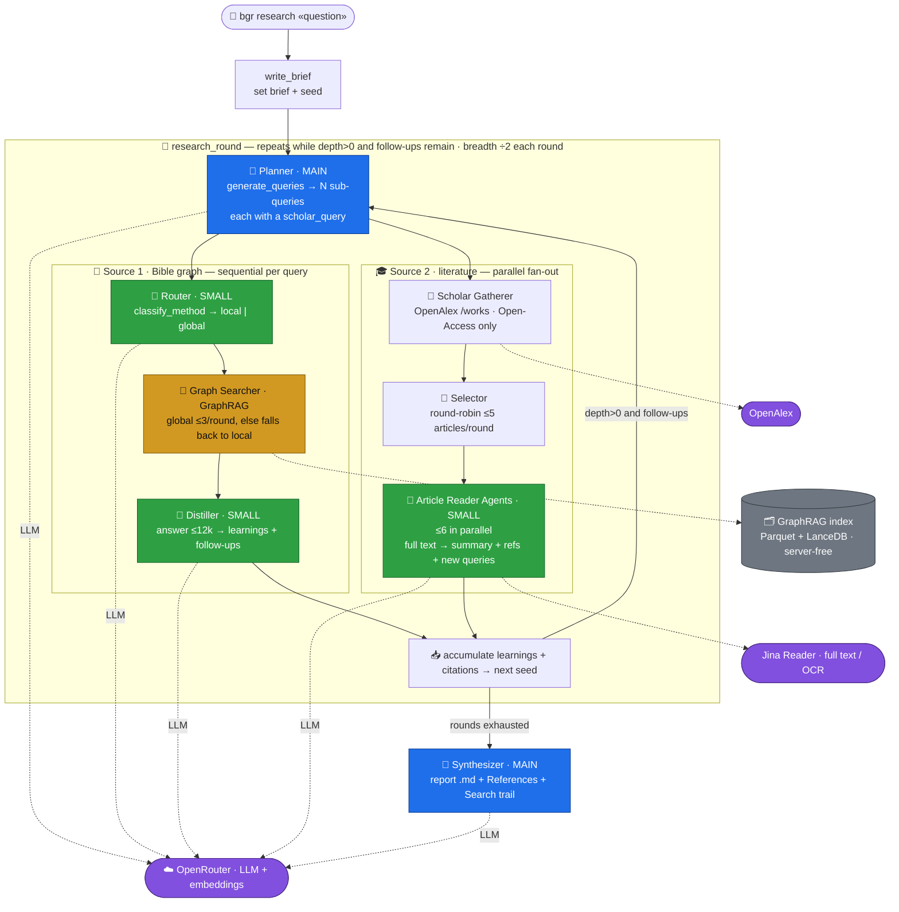

# BibleGraphRAG

> A knowledge-graph RAG pipeline that turns biblical text into a queryable graph with [Microsoft GraphRAG](https://github.com/microsoft/graphrag), then answers questions over it with four complementary search strategies, an LLM router, and a multi-round deep researcher.

[](pyproject.toml)
[](https://github.com/microsoft/graphrag)
[](LICENSE)

BibleGraphRAG ingests a raw Bible translation, segments each chapter into **pericopes** (self-contained narrative/teaching units), and runs Microsoft GraphRAG to extract an entity–relationship graph plus a hierarchy of community summaries. You then ask questions in natural language — a small LLM routes each question to the best search method, or you pick one yourself. A LangGraph **deep researcher** chains many searches into a cited Markdown report.

The stack is **fully native**: the graph and text live in Parquet files, embeddings in on-disk [LanceDB](https://lancedb.com/) tables — no database server to run. Every LLM and embedding call goes through an OpenAI-compatible endpoint ([OpenRouter](https://openrouter.ai/) by default).

---

## How it works

```
data/akjv.txt                                          raw verses ("text -- book ch:vs")
      │
      ▼  bgr parser            normalize verses
output/akjv-1.json                                     structured records
      │
      ▼  bgr pericope          LLM splits chapters into pericopes  (cached)
cache/akjv-pericopes.json
      │
      ▼  bgr build             one document per pericope → graphrag.api.build_index
rag/input/akjv.csv  ─────────────────────────────────▶ rag/output/*.parquet   (graph + community reports)
                                                        rag/output/lancedb/    (entity / text / community embeddings)
      │
      ├──▶  bgr query "..."     auto-routed: global · local · drift · basic  → streamed answer
      └──▶  bgr research "..."  plan → classify → search → distil → synthesize → cited report
```

`bgr estimate` can be run against the corpus at any point to get a USD cost projection before you pay for indexing.

---

## Architecture — the deep researcher

`bgr research` runs a **LangGraph orchestrator** that decomposes the question and routes work across specialised agent roles, over **two complementary sources** — the Bible knowledge graph (GraphRAG) and scholarly literature (OpenAlex). Each round fans out to several parallel article-reader agents. The model split (`MAIN` vs `SMALL`) is the main cost lever.



| Agent | Model | Role |
|---|---|---|
| **Planner** | `MAIN` | Generates `N` sub-queries from the seed (each with a `scholar_query` for the scholarly search). |
| **Router** | `SMALL` | Classifies each sub-query into `local` or `global` (drift is too slow per query). |
| **Graph Searcher** | GraphRAG | Runs the search over the index; `global` is capped at 3/round, else falls back to `local`. |
| **Distiller** | `SMALL` | Compresses the verbose answer (≤12k chars) into dense learnings + follow-up questions. |
| **Scholar Gatherer** | — | One OpenAlex search per query; filters to Open-Access only, so every citation is verifiable. |
| **Selector** | — | Round-robins across queries; picks ≤5 articles/round, skipping already-read works. |
| **Article Readers** | `SMALL` | **Fan-out, ≤6 in parallel**: reads each article's full text (via Jina) and distils summary + references + new queries. |
| **Synthesizer** | `MAIN` | Composes the final Markdown report + References + Search trail. |

Cost governors: `MAX_GLOBAL_CALLS=3`, `MAX_DEEP_READS=5`, `DEEP_READ_CONCURRENCY=6`, `ANSWER_CHAR_CAP=12k`.

---

## Features

- **Pericope segmentation** — a whole chapter is too coarse for one extraction pass (entities get dropped, coreference resolves wrong). An LLM splits each chapter into contiguous, gap-free pericopes so GraphRAG extracts from small, focused units. Boundaries are cached, so you only pay the segmentation cost once.
- **Four GraphRAG search modes** over one index:
  - **global** — map-reduce over community reports; broad, thematic *sensemaking* across the whole corpus.
  - **local** — vector-seed on the most relevant entities, expand their neighbourhood; questions about a specific person/place/thing.
  - **drift** — prime on community reports, then drill into entities/relationships and refine; multi-hop questions needing both the big picture and detail.
  - **basic** — plain vector RAG over text chunks; literal lookups, no graph.
- **LLM method router** — `bgr query` without `-m` asks a small model to classify the question into one of the four modes, so callers don't need to know GraphRAG's taxonomy. Falls back to `local` on any error.
- **Deep researcher** — a LangGraph loop (`plan → classify → search → distil → synthesize`) that runs breadth × depth rounds of searches, compresses each verbose answer into dense learnings, chases follow-up questions, and writes a cited report or a concise answer. Ported from [dzhng/deep-research](https://github.com/dzhng/deep-research) with cost governors (caps on expensive global searches, small-model distillation).
- **Cost estimation** — counts corpus tokens with `tiktoken`, prices them against **live OpenRouter rates** (with an offline fallback table), and applies a configurable GraphRAG-overhead multiplier.
- **Server-free** — Parquet + LanceDB on disk; nothing to deploy at query time.
- **Single source of truth for config** — everything reads from `.env`; `bgr build` injects the values into GraphRAG's `settings.yaml` placeholders at runtime.

---

## Requirements

- **Python 3.11–3.13** (3.13 pinned in `.python-version`)
- An **OpenAI-compatible API key** — OpenRouter by default; any OpenAI-compatible endpoint works
- [`uv`](https://github.com/astral-sh/uv) (recommended) or `pip`

---

## Installation

```bash
git clone <your-fork-url> BibleGraphRAG
cd BibleGraphRAG

# with uv (recommended) — creates the venv and installs from uv.lock
uv sync

# …or with pip
python -m venv .venv && source .venv/bin/activate
pip install -e .
```

This installs the `bgr` console script (defined in `pyproject.toml`). With `uv`, prefix commands with `uv run` (e.g. `uv run bgr query "..."`).

---

## Configuration

Copy the template and fill in your key:

```bash
cp .env.template .env
```

```ini
# OpenRouter (OpenAI-compatible)
OPENAI_API_KEY=sk-or-...
OPENAI_BASE_URL=https://openrouter.ai/api/v1

# Models (routed through OpenRouter)
LLM_MODEL=openai/gpt-4o                       # main model: extraction, reports, synthesis
LLM_SMALL_MODEL=openai/gpt-4o-mini            # cheap model: pericope segmentation, routing, distillation
EMBEDDING_MODEL=openai/text-embedding-3-small
```

| Variable | Default | Purpose |
|---|---|---|
| `OPENAI_API_KEY` | — | API key for the completion + embedding endpoint |
| `OPENAI_BASE_URL` | `https://openrouter.ai/api/v1` | OpenAI-compatible base URL |
| `LLM_MODEL` | `openai/gpt-oss-120b` | Main model (graph extraction, summaries, community reports, synthesis) |
| `LLM_SMALL_MODEL` | *(falls back to `LLM_MODEL`)* | Cheap model for segmentation, the query router, and research distillation — the main cost lever |
| `EMBEDDING_MODEL` | `openai/text-embedding-3-small` | Embedding model |
| `EMBEDDING_DIM` | `1536` | Embedding dimensions (must match `vector_size` in `rag/settings.yaml`) |
| `EMBED_API_KEY` / `EMBED_BASE_URL` | *(fall back to the main key/URL)* | Route embeddings to a different provider if needed |
| `RAG_ROOT` | `rag` | GraphRAG workspace (`settings.yaml`, `prompts/`, `input/`, `output/`) |

GraphRAG indexing knobs (chunk size, entity types, community report length, which search prompts to use) live in [`rag/settings.yaml`](rag/settings.yaml).

---

## Quick start

A full run, from raw text to a cited report. Start small (one book or a chapter range) to keep indexing cheap.

```bash
# 1. Normalize the raw translation into structured JSON  →  output/akjv-1.json
bgr parser --target akjv

# 2. (optional) Project the USD cost before you index
bgr estimate --target akjv

# 3. Build the index for just Genesis 1–3 (segments pericopes on demand, then indexes)
#    Produces rag/output/*.parquet and rag/output/lancedb/
bgr build --target akjv --book Genesis --chapters 1-3

# 4. Ask questions — the router picks the search method
bgr query "Who is Abraham and how is he related to Isaac?"
bgr query "What are the major themes of the creation account?" -m global

# 5. Run multi-round deep research into a Markdown report
bgr research "How does the covenant theme develop across Genesis?" --depth 3 --breadth 4
```

> **Tip:** `--dry-run` is available on `pericope`, `build`, and `research` to preview the plan (and, for `build`, the documents) without spending any tokens.

---

## CLI reference

All commands are subcommands of `bgr` (run `bgr <command> -h` for full options).

### `bgr parser --target <name>`
Reads `data/<name>.txt`, normalizes verses (book casing, whitespace, references), and writes `output/<name>-<N>.json` (never overwrites — picks the next free `N`).

### `bgr estimate --target <name>`
Counts corpus tokens and projects the end-to-end USD cost against live OpenRouter pricing.

| Option | Description |
|---|---|
| `--input-factor` | LLM input tokens per corpus token (prompts + repeated context). Default `8.0` |
| `--output-ratio` | LLM output tokens as a fraction of corpus tokens. Default `0.5` |
| `--embed-factor` | Embedding tokens as a multiple of corpus tokens. Default `1.5` |
| `--model` | Override the main model id for the estimate |
| `--no-fetch` | Skip live pricing; use the builtin fallback table |

> The estimate is approximate — the **ground-truth cost is the `usage.cost`** OpenRouter returns after a real run.

### `bgr pericope --target <name>`
Segments chapters into pericopes via the LLM and caches them to `cache/<translation>-pericopes.json`. `bgr build` does this on demand, so this command is only needed to pre-segment, re-segment, or inspect boundaries.

Filters: `--book`, `--chapter` / `--chapters 1-3,5`, `--limit`, `--model`, `--force` (re-segment cached), `--dry-run`.

### `bgr build --target <name>`
Prepares the GraphRAG input CSV (one row per pericope) and runs the indexing pipeline in-process via `graphrag.api`. Output: Parquet graph tables + community reports and the LanceDB vector tables under `rag/output/`.

| Option | Description |
|---|---|
| `--book` / `--chapter` / `--chapters` | Restrict the corpus subset to index |
| `--limit` | Cap the number of documents |
| `--no-pericope` | One document per chapter instead of per pericope |
| `--skip-index` | Only prepare the input CSV; don't index |
| `--verbose` | Verbose indexing output |
| `--dry-run` | Show the plan without calling the LLM/GraphRAG |

GraphRAG's pipeline cache (`rag/cache/`) makes re-runs cheap; the stable per-document `id` keeps `graphrag update` idempotent for incremental additions.

### `bgr query "<question>"`
Queries the built index. Without `-m`, an LLM router classifies the question; the answer streams to stdout (progress goes to stderr, so the answer stays pipe-clean).

| Option | Description |
|---|---|
| `-m` / `--method` | `global` · `local` · `drift` · `basic` (skips the router) |
| `--community-level` | Max Leiden community level for global/drift. Default `2` |
| `--response-type` | Free-form shape, e.g. `"single paragraph"`, `"bullet points"` |
| `--verbose` | Per-report / per-entity progress on stderr |

### `bgr research "<question>"`
Runs the deep-research graph over the index: plan sub-queries → route each → search → distil into learnings → synthesize.

| Option | Description |
|---|---|
| `--breadth` | Sub-queries per round (halves each round). Default `4` |
| `--depth` | Number of research rounds. Default `3` |
| `--answer` | Produce a concise answer instead of a full report |
| `--dry-run` | Print the graph structure and plan without calling the LLM/index |

---

## Project layout

```
core/
  cli/            bgr command wiring (argparse → handlers)
  config.py       typed .env settings (pydantic-settings)
  llm.py          LangChain ChatOpenAI / Embeddings → OpenRouter (the pipeline's own LLM calls)
  pipe/
    parser.py     raw .txt → structured JSON verse records
    pericope.py   LLM chapter→pericope segmentation, cached
  graph/
    episodes.py   verse records → GraphRAG input rows (one doc per pericope)
    build.py      prepare → index orchestration
    engine.py     in-process graphrag.api.build_index
    search.py     global / local / drift / basic search (graphrag.api)
    query.py      query dispatch
    route.py      LLM method router
  research/
    graph.py      LangGraph StateGraph (plan → round* → synthesize)
    nodes.py      node implementations + LLM/GraphRAG helpers
    state.py      research state (accumulating learnings/sources)
    prompts.py    research prompts (adapted from dzhng/deep-research)
  cost/
    estimate.py   tiktoken token count + live OpenRouter pricing

rag/              GraphRAG workspace
  settings.yaml   models, chunking, entity types, search prompts
  prompts/        extraction / summarization / search prompt templates
  input/          generated per-translation CSVs
  output/         Parquet tables + lancedb/ (created by `bgr build`)

data/             raw corpora (akjv.txt, nasb.txt)
output/           parsed JSON corpora
cache/            pericope-boundary cache
docs/             reference notes (GraphRAG, LangGraph, deep-research)
```

---

## Input data format

`data/<name>.txt` holds one verse per record, separated by a line containing only a period. Each record is the verse text, then ` -- `, then the reference:

```
In the beginning God created the heaven and the earth. -- genesis 1:1
.
And the earth was without form, and void... -- genesis 1:2
.
```

The parser normalizes book names (`song of songs` → `Song of Songs`, `1 samuel` → `1 Samuel`), collapses whitespace, and records `book` / `chapter` / `verse`. Two translations ship in `data/`: **AKJV** (American King James Version) and **NASB** (New American Standard Bible).

---

## Notes

- **No database server.** The graph and text are Parquet; embeddings are on-disk LanceDB tables written during indexing and read back natively at query time.
- **Single config source.** `.env` is canonical. `bgr build` injects its values into the `${...}` placeholders in `rag/settings.yaml` at runtime, so the GraphRAG CLI and the `bgr` pipeline never drift apart. (Running the `graphrag` CLI directly requires those env vars to be present.)
- **Cost levers.** Set `LLM_SMALL_MODEL` to a cheap model — it does segmentation, routing, and research distillation, which run many times. The deep researcher additionally caps expensive `global` searches and trims long answers before distilling.
- **Tuning extraction.** Entity types, chunk size, and gleanings live in `rag/settings.yaml`; re-tune the extraction prompts with `graphrag prompt-tune --root rag`.

---

## License

[MIT](LICENSE) © 2026 Mateus Andrade.

Bible translations included for development are in the public domain (AKJV) or used here for research/evaluation; verify the license of any translation before redistribution.
