<!-- dw2md v0.2.3 | dzhng/deep-research | 2026-06-30T05:39:41Z | 17 pages -->

# dzhng/deep-research — DeepWiki

> Compiled from https://deepwiki.com/dzhng/deep-research
> Generated: 2026-06-30T05:39:41Z | Pages: 17

## Format

Sections are delimited by `<<< SECTION: Title [slug] >>>` lines.
Grep for `^<<< SECTION:` to list all sections.
The Structure tree below shows hierarchy; slugs in brackets are unique identifiers.

## Structure

├── 1 Overview
├── 2 Core Architecture
│   ├── 2.1 Deep Research Engine
│   ├── 2.2 Orchestration and Execution
│   └── 2.3 User Interface and Interaction
├── 3 AI Integration
│   ├── 3.1 Supported Models and Providers
│   ├── 3.2 Prompt Management
│   └── 3.3 Text Processing and Utilities
├── 4 External Services
├── 5 System Configuration
├── 6 Deployment Options
├── 7 API Reference
├── 8 Development and Build System
├── 9 Dependencies and Requirements
├── 10 Sample Output and Reports
└── 11 License and Legal

## Contents

<<< SECTION: 1 Overview [1-overview] >>>

# Overview

<details>
<summary>Relevant source files</summary>

The following files were used as context for generating this wiki page:

- [README.md](README.md)

</details>


This document provides an introduction to the Deep Research system, covering its purpose, key features, and high-level architecture. The Deep Research system is an AI-powered research assistant that performs iterative, comprehensive research on any topic by combining web search, content extraction, and large language models.

For detailed information about the core research engine implementation, see [Core Architecture](#2). For AI model configuration and provider management, see [AI Integration](#3). For deployment and environment setup, see [System Configuration](#5) and [Deployment Options](#6).

## Purpose and Capabilities

The Deep Research system is designed to automate comprehensive research by combining multiple AI technologies into a unified research workflow. The system takes a user query and systematically explores the topic through iterative web searches, content analysis, and intelligent query refinement.

Key capabilities include:

| Feature | Description | Configuration |
|---------|-------------|---------------|
| Iterative Research | Performs recursive research cycles based on findings | Configurable depth parameter (1-5) |
| Query Generation | AI-powered generation of targeted search queries | Uses OpenAI o3-mini or Fireworks DeepSeek R1 |
| Web Content Extraction | Structured web scraping and content processing | Firecrawl API integration |
| Concurrent Processing | Parallel execution of searches and analysis | Configurable concurrency limits |
| Report Generation | Comprehensive markdown reports with sources | Outputs `report.md` and `answer.md` files |

## System Architecture Overview

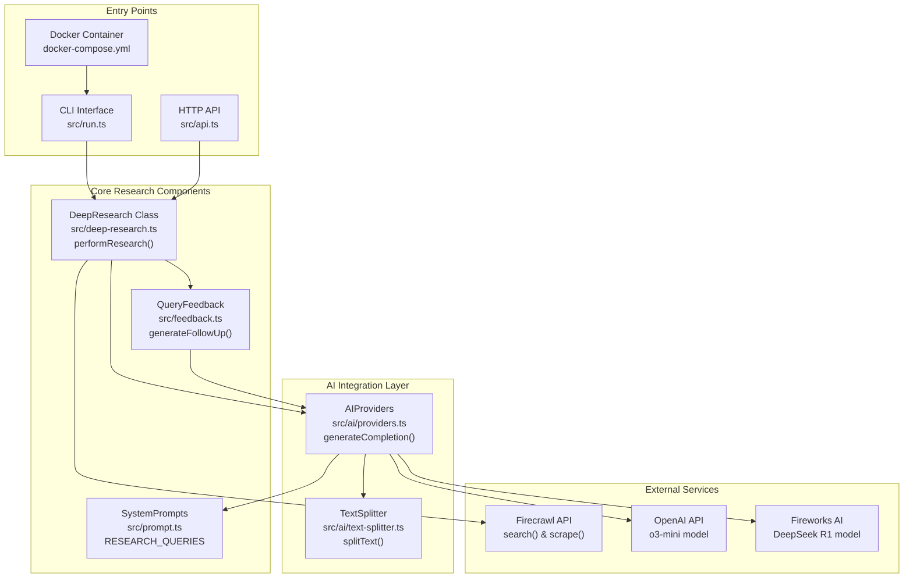

**System Architecture Overview**

Sources: [README.md:1-209](), [src/run.ts](), [src/api.ts](), [src/deep-research.ts](), [src/feedback.ts](), [src/prompt.ts](), [src/ai/providers.ts](), [src/ai/text-splitter.ts]()

## Core Research Workflow

The system implements an iterative research process that combines AI-generated queries with web scraping and content analysis. The process is controlled by two key parameters: `breadth` (number of queries per iteration, 3-10) and `depth` (number of recursive iterations, 1-5).

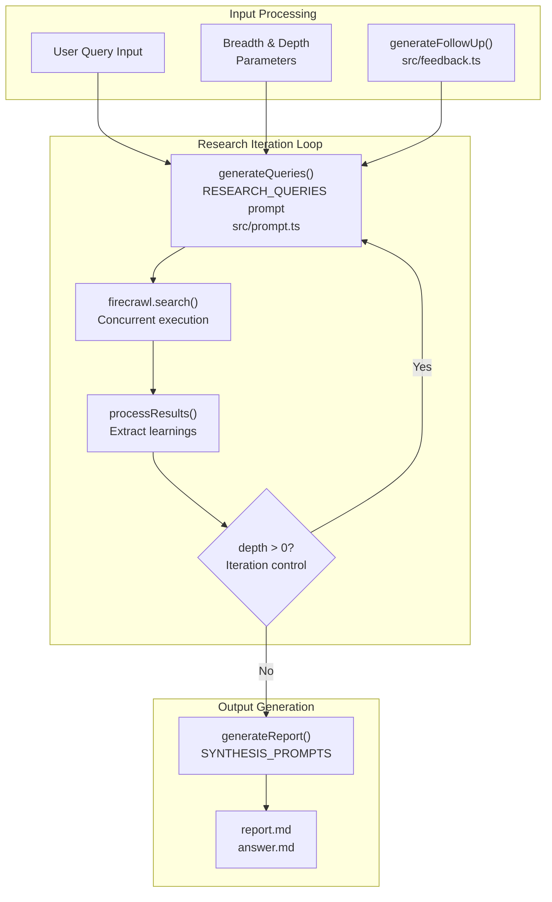

**Research Process Flow with Code Entities**

Sources: [README.md:178-201](), [src/deep-research.ts](), [src/feedback.ts](), [src/prompt.ts]()

## Technology Stack and Integrations

The Deep Research system integrates multiple AI providers and external services to deliver comprehensive research capabilities:

### AI Model Support

| Provider | Model | Configuration | Use Case |
|----------|-------|---------------|----------|
| OpenAI | o3-mini | `OPENAI_KEY` environment variable | Default AI processing |
| Fireworks AI | DeepSeek R1 | `FIREWORKS_KEY` environment variable | Alternative high-performance AI |
| Custom OpenAI-Compatible | Configurable | `OPENAI_ENDPOINT`, `CUSTOM_MODEL` | Local or third-party AI services |

### External Service Integrations

| Service | Purpose | Configuration |
|---------|---------|---------------|
| Firecrawl API | Web search and content extraction | `FIRECRAWL_KEY`, optional `FIRECRAWL_BASE_URL` |
| Node.js Runtime | Application execution | Version 22 (specified in `.nvmrc`) |
| Docker | Containerized deployment | `docker-compose.yml` configuration |

### Execution Modes

The system supports multiple execution modes to accommodate different deployment scenarios:

- **Development CLI**: `npm start` - Interactive command-line interface
- **HTTP API Server**: `npm run api` - RESTful API endpoints  
- **Docker Container**: `npm run docker` - Containerized execution
- **Vercel Deployment**: Serverless function deployment

Sources: [README.md:77-177](), [.nvmrc](), [docker-compose.yml](), [src/api.ts](), [src/run.ts]()

## Output and Report Generation

The system generates comprehensive research reports in markdown format, with two primary output modes:

1. **Detailed Report** (`report.md`) - Complete research findings with sources and analysis
2. **Concise Answer** (`answer.md`) - Focused response to the original query

The report generation process uses AI synthesis to compile findings from all research iterations into structured, readable documents with proper source attribution.

For detailed API endpoint specifications and request/response formats, see [API Reference](#7). For comprehensive deployment instructions and environment configuration, see [Deployment Options](#6) and [System Configuration](#5).

Sources: [README.md:149-151](), [README.md:197-201]()

---

<<< SECTION: 2 Core Architecture [2-core-architecture] >>>

# Core Architecture

<details>
<summary>Relevant source files</summary>

The following files were used as context for generating this wiki page:

- [README.md](README.md)
- [src/deep-research.ts](src/deep-research.ts)

</details>


This document provides an overview of the Deep Research system's core architectural components and how they interact to enable iterative, AI-powered research. This covers the fundamental design patterns, component relationships, and data flows that form the system's foundation.

For detailed implementation of the research functionality, see [Deep Research Engine](#2.1). For orchestration and execution details, see [Orchestration and Execution](#2.2). For user interaction patterns, see [User Interface and Interaction](#2.3).

## System Overview

The Deep Research system follows a layered architecture with clear separation between user interfaces, core research logic, AI integration, and external services. The architecture is designed around the central `deepResearch` function which orchestrates iterative research cycles.

### Core Component Architecture

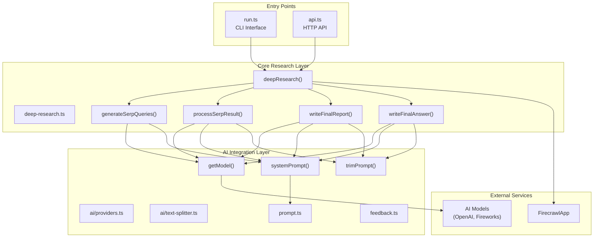

**Sources:** [src/deep-research.ts:1-295](), [src/run.ts](), [src/api.ts](), [src/ai/providers.ts](), [src/prompt.ts](), [src/feedback.ts]()

## Research Flow Architecture

The system implements a recursive research pattern where each iteration can spawn deeper investigations based on findings.

### Research Execution Flow

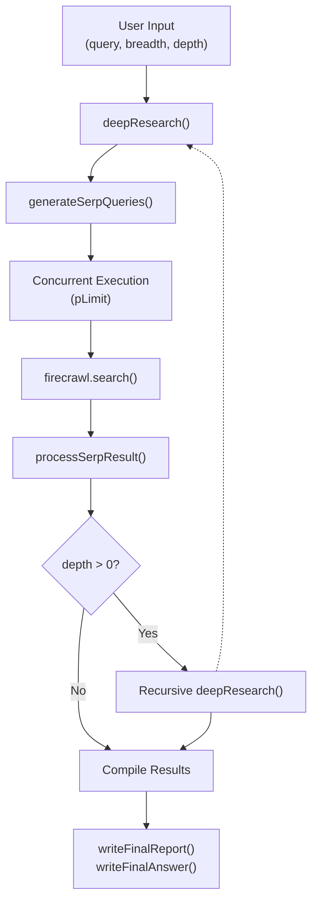

**Sources:** [src/deep-research.ts:176-294](), [README.md:10-66]()

## Component Responsibilities

### Core Research Engine

| Component | File Location | Primary Responsibility |
|-----------|--------------|----------------------|
| `deepResearch` | [src/deep-research.ts:176-294]() | Main orchestration logic, manages research iterations and recursion |
| `generateSerpQueries` | [src/deep-research.ts:40-79]() | AI-powered query generation based on research goals and prior learnings |
| `processSerpResult` | [src/deep-research.ts:81-118]() | Extracts learnings and follow-up questions from search results |
| `writeFinalReport` | [src/deep-research.ts:120-147]() | Generates comprehensive markdown reports with sources |
| `writeFinalAnswer` | [src/deep-research.ts:149-174]() | Produces concise answers in requested format |

### Progress Tracking and State Management

The system maintains research state through the `ResearchProgress` type and `ResearchResult` type:

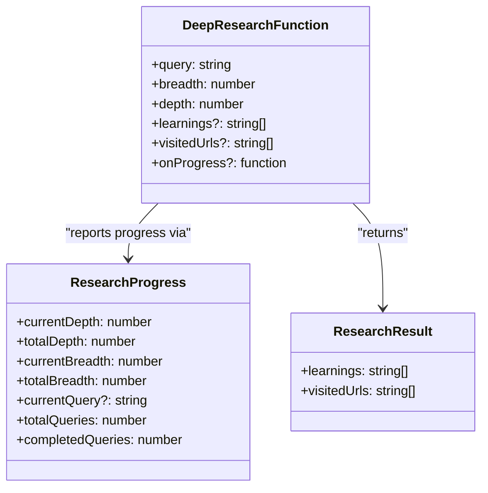

**Sources:** [src/deep-research.ts:14-28]()

## Concurrency and Resource Management

### Concurrent Processing Architecture

The system implements controlled concurrency for efficient resource utilization while respecting API rate limits:

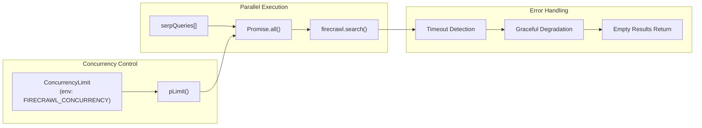

**Sources:** [src/deep-research.ts:30](), [src/deep-research.ts:216-288]()

## Integration Points

### External Service Integration

The architecture maintains clean separation between core logic and external services through well-defined interfaces:

| Integration Point | Configuration | Implementation |
|------------------|---------------|----------------|
| **Firecrawl API** | `FIRECRAWL_KEY`, `FIRECRAWL_BASE_URL` | [src/deep-research.ts:34-37]() |
| **AI Models** | Provider-specific keys via `getModel()` | [src/ai/providers.ts]() |
| **Text Processing** | Token limits via `trimPrompt()` | [src/ai/providers.ts]() |
| **Progress Callbacks** | Optional `onProgress` parameter | [src/deep-research.ts:189]() |

### Data Transformation Pipeline

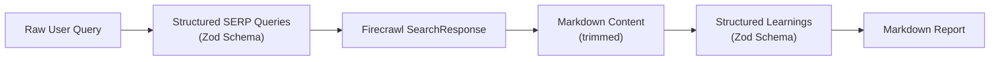

**Sources:** [src/deep-research.ts:61-74](), [src/deep-research.ts:106-114](), [src/deep-research.ts:139-141]()

## Architectural Design Patterns

### Recursive Research Pattern

The system employs a recursive depth-first approach where each research branch can spawn deeper investigations:

- **Base case**: `depth <= 0` terminates recursion
- **Recursive case**: New queries generated from learnings with reduced depth
- **State accumulation**: Learnings and URLs collected across all branches
- **Breadth reduction**: `Math.ceil(breadth / 2)` prevents exponential growth

### Structured Data Generation

All AI interactions use structured output via Zod schemas to ensure consistent data formats:

- Query generation returns `{ queries: Array<{ query, researchGoal }> }`
- Result processing returns `{ learnings: string[], followUpQuestions: string[] }`
- Report generation returns `{ reportMarkdown: string }`
- Answer generation returns `{ exactAnswer: string }`

**Sources:** [src/deep-research.ts:61-74](), [src/deep-research.ts:106-114](), [src/deep-research.ts:139-141](), [src/deep-research.ts:166-171]()

---

<<< SECTION: 2.1 Deep Research Engine [2-1-deep-research-engine] >>>

# Deep Research Engine

<details>
<summary>Relevant source files</summary>

The following files were used as context for generating this wiki page:

- [src/deep-research.ts](src/deep-research.ts)

</details>


This document covers the core research functionality of the Deep Research system, implemented in `src/deep-research.ts`. It details the iterative research process, query generation, result processing, and output generation capabilities that form the foundation of the system's research automation.

For information about AI model integration and provider management, see [Supported Models and Providers](#3.1). For details about system prompts and query refinement mechanisms, see [Prompt Management](#3.2). For orchestration and execution flow, see [Orchestration and Execution](#2.2).

## Core Architecture Overview

The Deep Research Engine implements a recursive, iterative approach to web research using AI-powered query generation and content analysis. The system maintains state through accumulated learnings and visited URLs, progressively deepening its understanding of research topics.

**Core Research Engine Components**

```mermaid
graph TB
    subgraph "Core Functions"
        deepResearch["`deepResearch()`<br/>Main orchestration function"]
        generateSerpQueries["`generateSerpQueries()`<br/>AI query generation"]
        processSerpResult["`processSerpResult()`<br/>Content analysis"]
        writeFinalReport["`writeFinalReport()`<br/>Report generation"]
        writeFinalAnswer["`writeFinalAnswer()`<br/>Answer synthesis"]
    end
    
    subgraph "Data Types"
        ResearchProgress["`ResearchProgress`<br/>Progress tracking"]
        ResearchResult["`ResearchResult`<br/>Learnings and URLs"]
    end
    
    subgraph "External Services"
        firecrawl["`firecrawl: FirecrawlApp`<br/>Web scraping service"]
        getModel["`getModel()`<br/>AI model provider"]
        systemPrompt["`systemPrompt()`<br/>System prompt"]
    end
    
    deepResearch --> generateSerpQueries
    deepResearch --> firecrawl
    deepResearch --> processSerpResult
    deepResearch --> ResearchProgress
    
    generateSerpQueries --> getModel
    generateSerpQueries --> systemPrompt
    processSerpResult --> getModel
    processSerpResult --> systemPrompt
    
    deepResearch --> writeFinalReport
    deepResearch --> writeFinalAnswer
    
    deepResearch --> ResearchResult
```

Sources: [src/deep-research.ts:1-295]()

## Research Process Flow

The research engine follows a recursive depth-first search pattern, where each iteration generates queries, executes searches, processes results, and decides whether to continue deeper research.

**Iterative Research Process**

```mermaid
flowchart TD
    Start["`Start Research`<br/>query, breadth, depth"] --> InitProgress["`Initialize ResearchProgress`<br/>currentDepth, totalDepth"]
    
    InitProgress --> GenerateQueries["`generateSerpQueries()`<br/>Create SERP queries"]
    
    GenerateQueries --> ConcurrencySetup["`pLimit(ConcurrencyLimit)`<br/>Setup concurrency control"]
    
    ConcurrencySetup --> ParallelSearch["`Promise.all()`<br/>Execute parallel searches"]
    
    subgraph "Per Query Processing"
        FirecrawlSearch["`firecrawl.search()`<br/>Web scraping"]
        ProcessResults["`processSerpResult()`<br/>Extract learnings"]
        DepthCheck{"`newDepth > 0`<br/>Continue research?"}
        RecursiveCall["`deepResearch()`<br/>Recursive call"]
        ReturnResults["`Return ResearchResult`<br/>learnings, visitedUrls"]
    end
    
    ParallelSearch --> FirecrawlSearch
    FirecrawlSearch --> ProcessResults
    ProcessResults --> DepthCheck
    DepthCheck -->|"Yes"| RecursiveCall
    DepthCheck -->|"No"| ReturnResults
    RecursiveCall --> ReturnResults
    
    ReturnResults --> AggregateResults["`Aggregate all results`<br/>Deduplicate learnings/URLs"]
    AggregateResults --> End["`Return final ResearchResult`"]
```

Sources: [src/deep-research.ts:176-294]()

## Query Generation and Processing

The system uses AI to generate contextually relevant search queries based on user input and accumulated learnings from previous research iterations.

### Query Generation Schema

| Field | Type | Description |
|-------|------|-------------|
| `queries` | `Array` | List of SERP queries (max: `numQueries`) |
| `query` | `string` | The actual search query |
| `researchGoal` | `string` | Goal and additional research directions |

**Query Generation Flow**

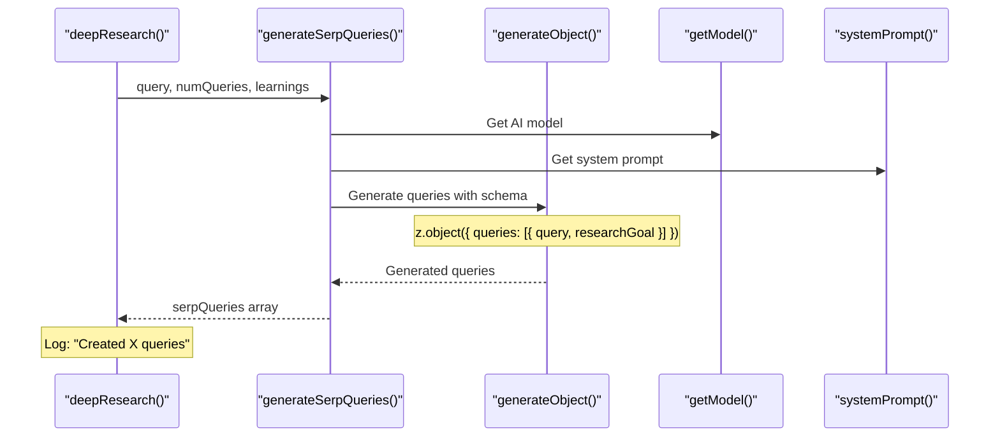

Sources: [src/deep-research.ts:40-79]()

## Result Processing and Learning Extraction

Search results undergo AI-powered analysis to extract structured learnings and generate follow-up research questions for deeper investigation.

### Processing Pipeline

The `processSerpResult` function implements a multi-stage processing pipeline:

1. **Content Extraction**: Extract markdown content from search results
2. **Content Trimming**: Limit content to 25,000 characters using `trimPrompt`
3. **AI Analysis**: Generate learnings and follow-up questions
4. **Structured Output**: Return organized learnings and next research directions

**Result Processing Schema**

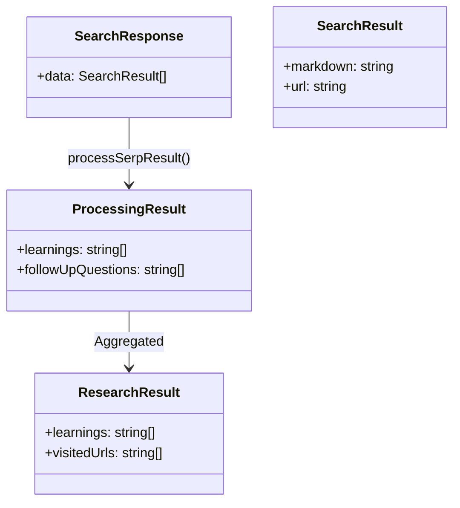

### Learning Extraction Parameters

| Parameter | Default | Purpose |
|-----------|---------|---------|
| `numLearnings` | 3 | Maximum learnings per search result |
| `numFollowUpQuestions` | 3 | Maximum follow-up questions generated |
| `timeout` | 60,000ms | AI processing timeout |

Sources: [src/deep-research.ts:81-118]()

## Progress Tracking and Concurrency

The engine implements comprehensive progress tracking and concurrency management to handle multiple simultaneous research operations efficiently.

### Progress Tracking Structure

```typescript
type ResearchProgress = {
  currentDepth: number;
  totalDepth: number;
  currentBreadth: number;
  totalBreadth: number;
  currentQuery?: string;
  totalQueries: number;
  completedQueries: number;
};
```

**Concurrency Control Flow**

```mermaid
graph LR
    subgraph "Concurrency Management"
        ConcurrencyLimit["`ConcurrencyLimit`<br/>Process.env.FIRECRAWL_CONCURRENCY || 2"]
        pLimit["`pLimit(ConcurrencyLimit)`<br/>Limit concurrent operations"]
        PromiseAll["`Promise.all()`<br/>Execute all queries"]
    end
    
    subgraph "Progress Reporting"
        InitProgress["`Initialize progress`<br/>currentDepth, totalDepth"]
        ReportProgress["`reportProgress()`<br/>Update and callback"]
        OnProgress["`onProgress?.(progress)`<br/>Optional callback"]
    end
    
    ConcurrencyLimit --> pLimit
    pLimit --> PromiseAll
    InitProgress --> ReportProgress
    ReportProgress --> OnProgress
```

### Recursive Depth Management

The system manages research depth through parameter reduction:
- `newBreadth = Math.ceil(breadth / 2)` - Reduces breadth by half each level
- `newDepth = depth - 1` - Decrements depth counter
- Recursion continues while `newDepth > 0`

Sources: [src/deep-research.ts:14-22](), [src/deep-research.ts:29-30](), [src/deep-research.ts:216-217](), [src/deep-research.ts:241-263]()

## Output Generation

The engine provides two output formats: comprehensive reports and concise answers, both generated using AI synthesis of accumulated learnings.

### Report Generation

The `writeFinalReport` function creates detailed markdown reports incorporating all research learnings and source URLs.

**Report Structure**
- Main content: AI-generated comprehensive analysis
- Sources section: Automatically appended list of visited URLs
- Target length: 3+ pages with detailed findings

### Answer Generation

The `writeFinalAnswer` function produces concise, format-specific answers optimized for direct user queries.

**Answer Generation Process**

```mermaid
flowchart LR
    subgraph "Input Processing"
        UserPrompt["`User prompt`<br/>Original query"]
        Learnings["`Learnings array`<br/>Research findings"]
        LearningsString["`Format learnings`<br/>XML-like structure"]
    end
    
    subgraph "AI Synthesis"
        GenerateObject["`generateObject()`<br/>AI model call"]
        Schema["`z.object({ exactAnswer })`<br/>Structured output"]
        TrimPrompt["`trimPrompt()`<br/>Content length limit"]
    end
    
    UserPrompt --> GenerateObject
    LearningsString --> TrimPrompt
    TrimPrompt --> GenerateObject
    GenerateObject --> Schema
    Schema --> ExactAnswer["`exactAnswer: string`<br/>Concise result"]
```

### Output Generation Parameters

| Function | Purpose | Output Format | Length Target |
|----------|---------|---------------|---------------|
| `writeFinalReport` | Comprehensive analysis | Markdown with sources | 3+ pages |
| `writeFinalAnswer` | Direct answer | Plain text | Few words to one sentence |

Sources: [src/deep-research.ts:120-174]()

## Error Handling and Resilience

The research engine implements robust error handling to manage failures in web scraping, AI processing, and network operations.

### Error Management Strategy

- **Timeout Handling**: 15-second timeout for Firecrawl searches
- **Graceful Degradation**: Failed queries return empty results without stopping research
- **Error Classification**: Distinguishes timeout errors from other failures
- **Continuation Logic**: Research continues with successful results even if some queries fail

**Error Handling Flow**

```mermaid
flowchart TD
    QueryExecution["`Execute firecrawl.search()`<br/>15s timeout, 5 result limit"]
    
    QueryExecution --> Success{"`Success?`"}
    Success -->|"Yes"| ProcessResults["`processSerpResult()`<br/>Extract learnings"]
    Success -->|"No"| ErrorCheck{"`Timeout error?`"}
    
    ErrorCheck -->|"Yes"| TimeoutLog["`Log timeout message`<br/>Query identification"]
    ErrorCheck -->|"No"| GeneralLog["`Log general error`<br/>Error details"]
    
    TimeoutLog --> EmptyResult["`Return empty ResearchResult`<br/>learnings: [], visitedUrls: []"]
    GeneralLog --> EmptyResult
    ProcessResults --> ValidResult["`Return populated ResearchResult`<br/>learnings, visitedUrls"]
    
    ValidResult --> Continue["`Continue research flow`"]
    EmptyResult --> Continue
```

Sources: [src/deep-research.ts:221-286]()

---

<<< SECTION: 2.2 Orchestration and Execution [2-2-orchestration-and-execution] >>>

# Orchestration and Execution

<details>
<summary>Relevant source files</summary>

The following files were used as context for generating this wiki page:

- [src/run.ts](src/run.ts)

</details>


This page documents the orchestration and execution layer of the Deep Research system, which coordinates the overall research workflow, manages user interactions, and controls the execution flow from initial query to final output generation.

This layer serves as the main control mechanism that binds together the core research engine, AI integration, and user interfaces. For details about the underlying research algorithms, see [Deep Research Engine](#2.1). For information about user interface components and interaction patterns, see [User Interface and Interaction](#2.3).

## Main Execution Controller

The primary execution orchestration is handled by the `run()` function in [src/run.ts:32-118](). This function serves as the main coordinator that manages the complete research workflow from user input collection to final output generation.

### Execution Flow Architecture

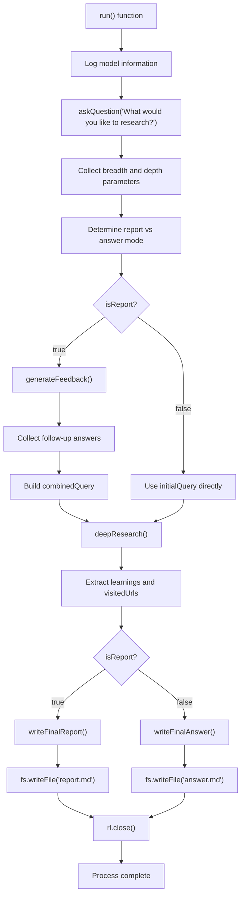

**Sources:** [src/run.ts:32-118]()

### Parameter Collection Orchestration

The system orchestrates parameter collection through a structured question-and-answer flow that determines research scope and output format.

| Parameter | Collection Method | Default Value | Validation Range |
|-----------|------------------|---------------|------------------|
| `initialQuery` | `askQuestion()` | None (required) | Any string |
| `breadth` | `parseInt()` with fallback | 4 | 2-10 (recommended) |
| `depth` | `parseInt()` with fallback | 2 | 1-5 (recommended) |
| `isReport` | String comparison | `true` | 'report' or 'answer' |

The parameter collection logic in [src/run.ts:36-54]() uses the `askQuestion()` helper function to maintain consistent user interaction patterns across all input collection points.

**Sources:** [src/run.ts:36-54](), [src/run.ts:23-29]()

## Research Workflow Orchestration

The orchestration layer coordinates between different research modes and manages the complexity of multi-stage research execution.

### Query Preparation Flow

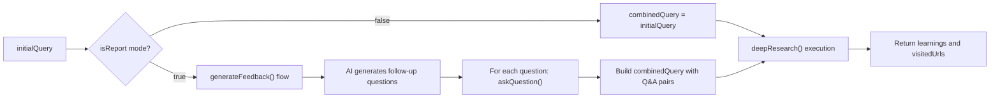

The query preparation orchestration in [src/run.ts:56-82]() demonstrates how the system adapts its research approach based on the selected output mode. For report generation, it enriches the initial query with structured follow-up questions and answers.

**Sources:** [src/run.ts:56-82](), [src/run.ts:61-74]()

### Research Execution Coordination

The orchestration layer coordinates the core research execution through the `deepResearch()` function call and manages the results processing:

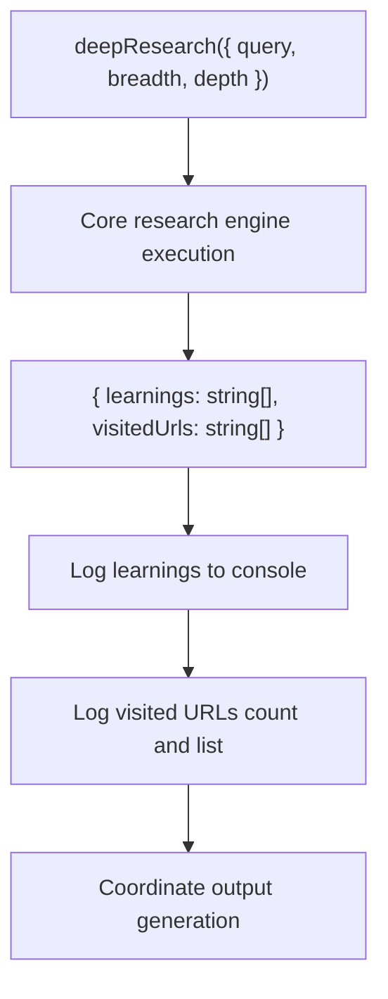

The coordination logic in [src/run.ts:86-93]() handles the interface between the orchestration layer and the core research engine, managing both successful execution and result logging.

**Sources:** [src/run.ts:86-93]()

## Output Generation Orchestration

The orchestration layer manages different output generation paths based on user preferences and coordinates file writing operations.

### Output Mode Coordination

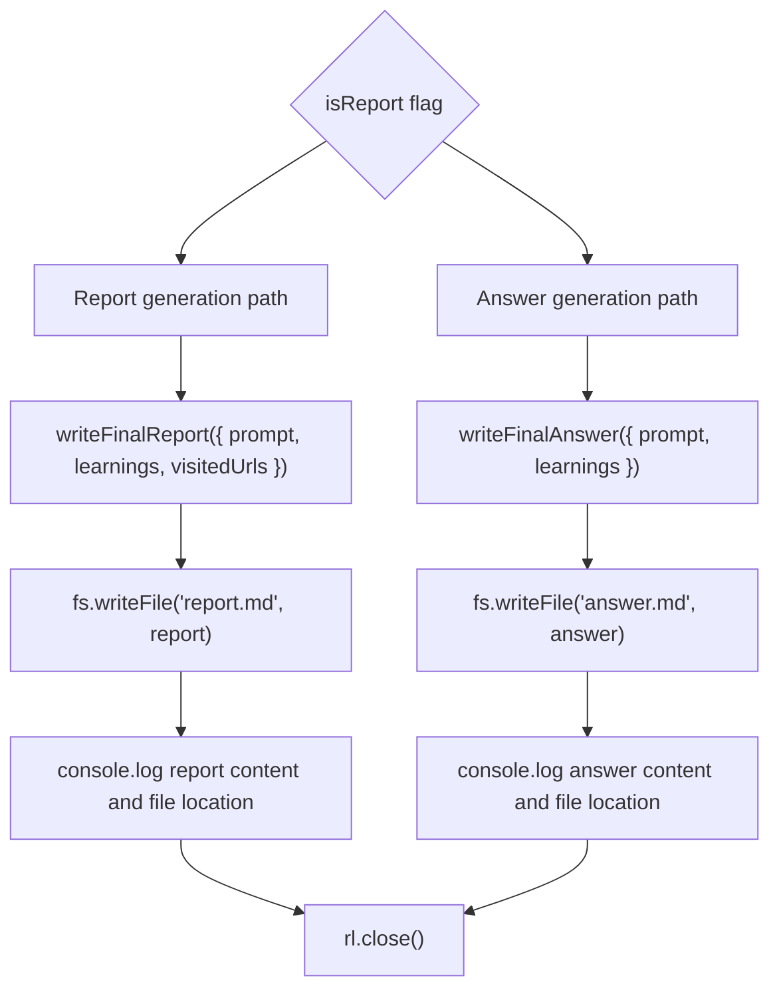

The output coordination in [src/run.ts:96-116]() demonstrates how the orchestration layer manages different output formats while maintaining consistent file writing and user feedback patterns.

**Sources:** [src/run.ts:96-116]()

## State Management and Resource Cleanup

The orchestration layer manages system state through the readline interface and ensures proper resource cleanup at execution completion.

### Resource Management Flow

The system maintains a single readline interface instance created at [src/run.ts:17-20]() and ensures proper cleanup through the `rl.close()` call at [src/run.ts:117](). This prevents resource leaks and ensures clean process termination.

The error handling orchestration is managed at the top level through the `.catch(console.error)` pattern in [src/run.ts:120](), ensuring that any unhandled errors in the orchestration flow are properly logged.

**Sources:** [src/run.ts:17-20](), [src/run.ts:117](), [src/run.ts:120]()

## Execution Context and Logging

The orchestration layer provides consistent logging and execution context management throughout the research process.

### Logging Orchestration

The system uses a centralized `log()` function defined in [src/run.ts:13-15]() that wraps `console.log` for consistent output formatting. This logging orchestration provides progress updates at key execution milestones:

- Model identification at startup
- Research initiation announcement  
- Results summary presentation
- File writing confirmations

The orchestration layer ensures users receive feedback at each major workflow transition, maintaining transparency in the research execution process.

**Sources:** [src/run.ts:13-15](), [src/run.ts:33](), [src/run.ts:84](), [src/run.ts:94]()

---

<<< SECTION: 2.3 User Interface and Interaction [2-3-user-interface-and-interaction] >>>

# User Interface and Interaction

<details>
<summary>Relevant source files</summary>

The following files were used as context for generating this wiki page:

- [README.md](README.md)
- [src/run.ts](src/run.ts)

</details>


This document covers the user-facing interface components of the Deep Research system, specifically focusing on the command-line interface (CLI), user input collection mechanisms, interactive parameter configuration, and output generation. This includes the prompt flow, validation logic, and file output systems that enable users to interact with the research engine.

For information about the underlying research algorithms and AI integration, see [Deep Research Engine](#2.1). For HTTP API endpoints and programmatic access, see [API Reference](#7).

## CLI Interface Architecture

The Deep Research system provides a terminal-based interface through the `run.ts` file, which orchestrates all user interactions from initial query collection through final report generation.

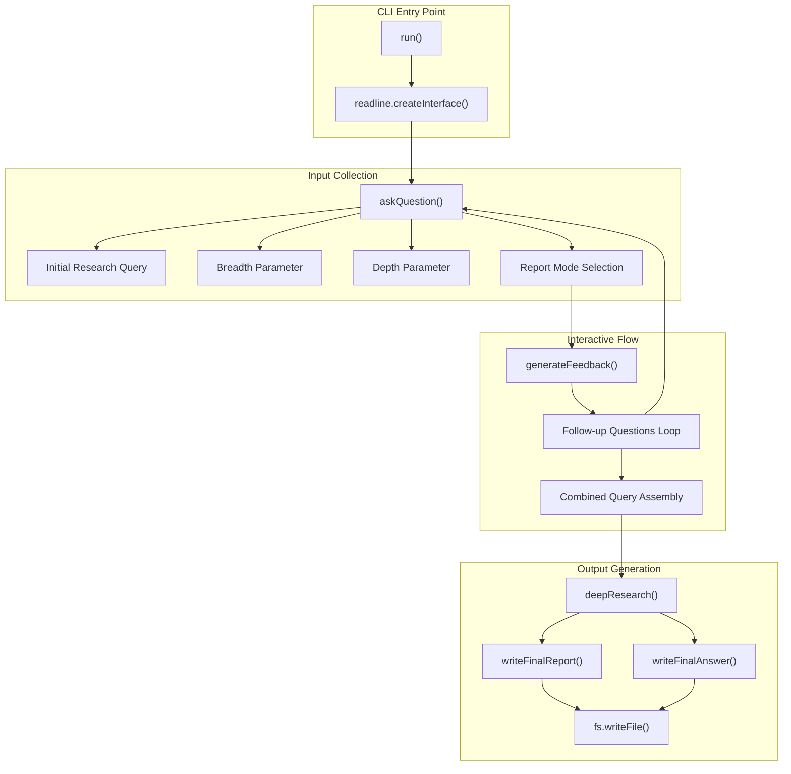

**Sources:** [src/run.ts:1-121]()

## User Input Collection Flow

The system implements a sequential input collection process using Node.js's `readline` interface for synchronous user interaction.

### Core Input Functions

The `askQuestion` function serves as the primary input collection mechanism:

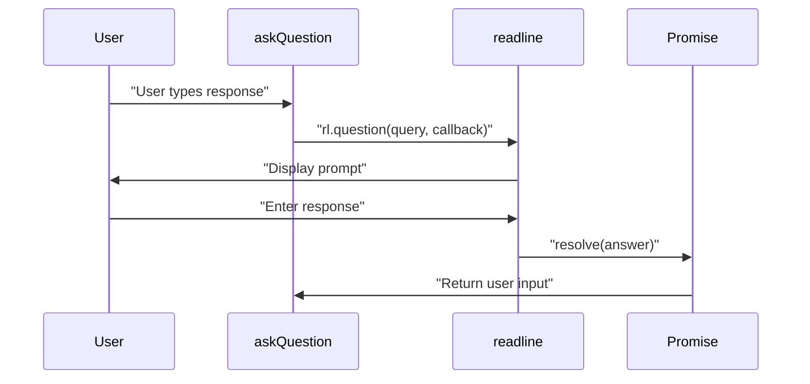

**Sources:** [src/run.ts:22-29]()

### Input Validation and Defaults

The system implements fallback mechanisms for numeric parameters with intelligent defaults:

| Parameter | User Prompt | Default Value | Validation |
|-----------|-------------|---------------|------------|
| Breadth | "Enter research breadth (recommended 2-10, default 4)" | 4 | `parseInt()` with fallback |
| Depth | "Enter research depth (recommended 1-5, default 2)" | 2 | `parseInt()` with fallback |
| Mode | "Do you want to generate a long report or a specific answer?" | "report" | String comparison |

**Sources:** [src/run.ts:38-54]()

## Interactive Parameter Collection

The CLI implements a multi-stage parameter collection process with conditional logic based on user preferences.

```mermaid
flowchart TD
    start["CLI Start"] --> initialQuery["askQuestion: Research Query"]
    initialQuery --> breadthInput["askQuestion: Breadth Parameter"]
    breadthInput --> depthInput["askQuestion: Depth Parameter"]
    depthInput --> modeSelect["askQuestion: Report/Answer Mode"]
    
    modeSelect --> modeCheck{"isReport === true"}
    
    modeCheck -->|Yes| generateFeedback["generateFeedback({query})"]
    modeCheck -->|No| combineQuery["combinedQuery = initialQuery"]
    
    generateFeedback --> followUpLoop["Follow-up Questions Loop"]
    followUpLoop --> questionPrompt["askQuestion: Individual Question"]
    questionPrompt --> collectAnswer["answers.push(answer)"]
    collectAnswer --> moreQuestions{"More questions?"}
    
    moreQuestions -->|Yes| questionPrompt
    moreQuestions -->|No| buildCombined["Build Combined Query"]
    
    buildCombined --> combineQuery
    combineQuery --> startResearch["Begin Deep Research"]
    
    startResearch --> processResults["Process Research Results"]
```

**Sources:** [src/run.ts:56-82](), [src/run.ts:60-75]()

## Follow-up Question Processing

When users select report mode, the system generates contextual follow-up questions to refine research direction:

```mermaid
graph LR
    subgraph "Question Generation"
        initialQuery["Initial Query"]
        generateFeedback["generateFeedback()"]
        followUpQuestions["Generated Questions Array"]
    end
    
    subgraph "Answer Collection"
        questionLoop["Question Iteration Loop"]
        askQuestion["askQuestion()"]
        answerArray["answers: string[]"]
    end
    
    subgraph "Query Assembly"
        combineData["Combine Initial + Q&A"]
        combinedQuery["Final Combined Query"]
    end
    
    initialQuery --> generateFeedback
    generateFeedback --> followUpQuestions
    followUpQuestions --> questionLoop
    questionLoop --> askQuestion
    askQuestion --> answerArray
    answerArray --> combineData
    combineData --> combinedQuery
```

The combined query structure follows this format:
```
Initial Query: [user's original query]
Follow-up Questions and Answers:
Q: [question 1]
A: [answer 1]
Q: [question 2]  
A: [answer 2]
```

**Sources:** [src/run.ts:60-82]()

## Output Generation and File Writing

The system provides two distinct output modes with different file formats and content structures.

### Output Mode Selection Logic

```mermaid
graph TD
    researchComplete["Research Completion"]
    modeCheck{"isReport === true"}
    
    researchComplete --> modeCheck
    
    modeCheck -->|Yes| writeFinalReport["writeFinalReport()"]
    modeCheck -->|No| writeFinalAnswer["writeFinalAnswer()"]
    
    writeFinalReport --> reportFile["fs.writeFile('report.md')"]
    writeFinalAnswer --> answerFile["fs.writeFile('answer.md')"]
    
    reportFile --> reportOutput["Console: Report + Sources"]
    answerFile --> answerOutput["Console: Direct Answer"]
```

### File Output Specifications

| Mode | Function | Output File | Content Includes |
|------|----------|-------------|------------------|
| Report | `writeFinalReport()` | `report.md` | Comprehensive research with sources and URLs |
| Answer | `writeFinalAnswer()` | `answer.md` | Direct answer without extensive sourcing |

**Sources:** [src/run.ts:96-115]()

## Console Output and Logging

The system provides real-time feedback through structured console output:

```mermaid
sequenceDiagram
    participant CLI
    participant User
    participant Console
    participant FileSystem
    
    CLI->>Console: "Using model: [modelId]"
    CLI->>User: "Research parameter prompts"
    User->>CLI: "Parameter inputs"
    CLI->>Console: "Creating research plan..."
    CLI->>Console: "Starting research..."
    CLI->>Console: "Learnings: [findings]"
    CLI->>Console: "Visited URLs: [count]"
    CLI->>Console: "Writing final report..."
    CLI->>FileSystem: "Save report.md/answer.md"
    CLI->>Console: "Final Report/Answer content"
    CLI->>Console: "File saved confirmation"
```

The logging uses a consistent `log()` helper function that wraps `console.log()` for standardized output formatting.

**Sources:** [src/run.ts:12-15](), [src/run.ts:92-115]()

## Resource Cleanup and Session Management

The CLI implements proper resource cleanup through the `readline` interface management:

```mermaid
graph LR
    interfaceCreate["readline.createInterface()"] --> userInteraction["User Input Collection"]
    userInteraction --> researchProcess["Deep Research Execution"]
    researchProcess --> outputGeneration["File Output Generation"]
    outputGeneration --> cleanup["rl.close()"]
    cleanup --> processExit["Process Termination"]
```

The interface lifecycle ensures clean termination with `rl.close()` called after all interactions complete.

**Sources:** [src/run.ts:17-20](), [src/run.ts:117]()

---

<<< SECTION: 3 AI Integration [3-ai-integration] >>>

# AI Integration

<details>
<summary>Relevant source files</summary>

The following files were used as context for generating this wiki page:

- [src/ai/providers.ts](src/ai/providers.ts)

</details>


This document provides a comprehensive overview of how the Deep Research system integrates with AI models and providers. It covers the supported AI providers, model configuration, selection logic, and prompt management techniques used to optimize AI interactions across the system.

For information about specific supported models, see [Supported Models and Providers](#3.1). For prompt engineering details, see [Prompt Management](#3.2).

## 1. AI Integration Overview

The Deep Research system leverages large language models (LLMs) throughout the research process for several critical functions:

- Generating search queries based on user input
- Processing and analyzing search results
- Extracting key learnings from content
- Identifying new research directions
- Generating comprehensive final reports

The AI integration layer is designed to abstract provider-specific implementation details, allowing the system to work with different LLM providers through a common interface.

```mermaid
graph TD
    subgraph "Deep Research AI Integration"
        Provider["getModel() Function"] --> |"Select"| Models
        subgraph "Models"
            OpenAI["OpenAI Models"]
            DeepSeek["Fireworks/DeepSeek"]
            Custom["Custom Models"]
        end
        PromptMgmt["trimPrompt() Function"] --> |"Optimize"| Prompts["Prompt Processing"]
    end
    
    ResearchEngine["Deep Research Engine"] --> |"Uses"| Provider
    ResearchEngine --> |"Sends"| Prompts
    
    Config["Environment Variables"] --> |"Configure"| Models
```

Sources: [src/ai/providers.ts:1-98](). This diagram shows the core AI integration components in the Deep Research system and how they relate to each other.

## 2. Supported Providers and Configuration

The system supports three provider configurations through the `providers.ts` module:

1. **OpenAI Provider** - Uses `createOpenAI()` from `@ai-sdk/openai`
2. **Fireworks Provider** - Uses `createFireworks()` from `@ai-sdk/fireworks`
3. **Custom Models** - OpenAI-compatible endpoints via custom configuration

Configuration is handled through environment variables:

| Environment Variable | Purpose | Default/Example | Code Reference |
|---------------------|---------|-----------------|----------------|
| `OPENAI_KEY` | OpenAI API authentication | Required for OpenAI | [src/ai/providers.ts:13]() |
| `OPENAI_ENDPOINT` | Custom OpenAI-compatible endpoint | `https://api.openai.com/v1` | [src/ai/providers.ts:16]() |
| `FIREWORKS_KEY` | Fireworks API authentication | Required for Fireworks | [src/ai/providers.ts:20]() |
| `CUSTOM_MODEL` | Custom model identifier | undefined | [src/ai/providers.ts:26]() |
| `CONTEXT_SIZE` | Maximum context window tokens | `128000` | [src/ai/providers.ts:67]() |

Provider Initialization Flow:

```mermaid
graph TD
    EnvCheck["Environment Variable Check"] --> OpenAICheck{"OPENAI_KEY?"}
    EnvCheck --> FireworksCheck{"FIREWORKS_KEY?"}
    EnvCheck --> CustomCheck{"CUSTOM_MODEL?"}
    
    OpenAICheck -->|"exists"| CreateOpenAI["createOpenAI()"]
    OpenAICheck -->|"missing"| OpenAIUndefined["openai = undefined"]
    
    FireworksCheck -->|"exists"| CreateFireworks["createFireworks()"]
    FireworksCheck -->|"missing"| FireworksUndefined["fireworks = undefined"]
    
    CustomCheck -->|"exists"| CreateCustom["openai(CUSTOM_MODEL)"]
    CustomCheck -->|"missing"| CustomUndefined["customModel = undefined"]
    
    CreateOpenAI --> OpenAIProvider["openai provider"]
    CreateFireworks --> FireworksProvider["fireworks provider"]
    CreateCustom --> CustomProvider["customModel"]
```

Sources: [src/ai/providers.ts:13-30]()

## 3. Model Selection Logic

The `getModel()` function implements a priority-based selection strategy with specific model configurations:

**Defined Models:**
- `customModel`: Custom OpenAI-compatible model with `structuredOutputs: true`
- `deepSeekR1Model`: Fireworks DeepSeek R1 with reasoning middleware (`extractReasoningMiddleware`)
- `o3MiniModel`: OpenAI o3-mini with `reasoningEffort: 'medium'` and `structuredOutputs: true`

**Selection Priority:**
1. `customModel` (highest priority if configured)
2. `deepSeekR1Model` (fallback if Fireworks available)
3. `o3MiniModel` (fallback if OpenAI available)
4. Throw error if no models available

getModel() Function Flow:

```mermaid
flowchart TD
    getModel["getModel()"] --> customCheck{"customModel?"}
    customCheck -->|"truthy"| returnCustom["return customModel"]
    customCheck -->|"falsy"| modelFallback["model = deepSeekR1Model ?? o3MiniModel"]
    
    modelFallback --> modelCheck{"model exists?"}
    modelCheck -->|"false"| throwError["throw new Error('No model found')"]
    modelCheck -->|"true"| returnModel["return model as LanguageModelV1"]
    
    subgraph "Model Definitions"
        direction TB
        custom["customModel = openai?.(CUSTOM_MODEL, {structuredOutputs: true})"]
        deepseek["deepSeekR1Model = wrapLanguageModel({<br/>model: fireworks('accounts/fireworks/models/deepseek-r1'),<br/>middleware: extractReasoningMiddleware({tagName: 'think'})})"]
        o3mini["o3MiniModel = openai?.('o3-mini', {<br/>reasoningEffort: 'medium',<br/>structuredOutputs: true})"]
    end
```

Sources: [src/ai/providers.ts:26-59]()

## 4. Prompt Management and Context Window Optimization

The `trimPrompt()` function manages context window limitations through token-aware text splitting:

**Key Components:**
- `encoder`: Uses `getEncoding('o200k_base')` from `js-tiktoken`
- `MinChunkSize`: Constant set to 140 characters minimum
- `RecursiveCharacterTextSplitter`: Handles intelligent text chunking
- Default `contextSize`: 128,000 tokens (configurable via `CONTEXT_SIZE`)

**Algorithm Flow:**

```mermaid
flowchart TD
    trimPrompt["trimPrompt(prompt, contextSize)"] --> emptyCheck{"prompt empty?"}
    emptyCheck -->|"true"| returnEmpty["return ''"]
    emptyCheck -->|"false"| encodeLength["length = encoder.encode(prompt).length"]
    
    encodeLength --> withinContext{"length <= contextSize?"}
    withinContext -->|"true"| returnOriginal["return prompt"]
    withinContext -->|"false"| calculateOverflow["overflowTokens = length - contextSize<br/>chunkSize = prompt.length - overflowTokens * 3"]
    
    calculateOverflow --> minSizeCheck{"chunkSize < MinChunkSize?"}
    minSizeCheck -->|"true"| returnMinSlice["return prompt.slice(0, MinChunkSize)"]
    minSizeCheck -->|"false"| createSplitter["splitter = new RecursiveCharacterTextSplitter({<br/>chunkSize, chunkOverlap: 0})"]
    
    createSplitter --> splitText["trimmedPrompt = splitter.splitText(prompt)[0] ?? ''"]
    splitText --> sameLengthCheck{"trimmedPrompt.length === prompt.length?"}
    sameLengthCheck -->|"true"| hardCut["return trimPrompt(prompt.slice(0, chunkSize), contextSize)"]
    sameLengthCheck -->|"false"| recursiveCall["return trimPrompt(trimmedPrompt, contextSize)"]
```

**Implementation Details:**
- Token estimation uses 3 characters per token average
- Recursive trimming ensures context limits are respected
- `chunkOverlap: 0` prevents duplicate content in chunks
- Fallback hard cutting prevents infinite loops

Sources: [src/ai/providers.ts:61-98]()

## 5. AI Integration Usage Pattern

The AI integration layer provides standardized access to language models across the research pipeline through two primary functions:

**Core Functions:**
- `getModel()`: Returns configured `LanguageModelV1` instance
- `trimPrompt()`: Optimizes prompts for context window limits

Research Process Integration:

```mermaid
sequenceDiagram
    participant ResearchEngine as "Deep Research Engine"
    participant ProvidersModule as "src/ai/providers.ts"
    participant ModelInstance as "LanguageModelV1"
    participant TextSplitter as "RecursiveCharacterTextSplitter"
    
    Note over ResearchEngine,ModelInstance: Model Acquisition
    ResearchEngine->>ProvidersModule: "getModel()"
    ProvidersModule->>ProvidersModule: "Check customModel || deepSeekR1Model || o3MiniModel"
    ProvidersModule->>ResearchEngine: "Return LanguageModelV1"
    
    Note over ResearchEngine,TextSplitter: Prompt Optimization
    ResearchEngine->>ProvidersModule: "trimPrompt(content, contextSize)"
    ProvidersModule->>ProvidersModule: "encoder.encode(prompt).length"
    alt "Prompt exceeds context"
        ProvidersModule->>TextSplitter: "new RecursiveCharacterTextSplitter({chunkSize})"
        TextSplitter->>ProvidersModule: "splitText(prompt)[0]"
        ProvidersModule->>ProvidersModule: "Recursive trimPrompt() if needed"
    end
    ProvidersModule->>ResearchEngine: "Return optimized prompt"
    
    Note over ResearchEngine,ModelInstance: LLM Execution
    ResearchEngine->>ModelInstance: "AI SDK generateText/generateObject"
    ModelInstance-->>ResearchEngine: "Generated response"
```

**Integration Points in Codebase:**
- Research query generation uses `getModel()` for SERP query creation
- Content processing uses both `getModel()` and `trimPrompt()` for result analysis
- Report synthesis uses `getModel()` with `trimPrompt()` for final output generation

Sources: [src/ai/providers.ts:48-98]()

## 6. Configuration Best Practices

**Environment Variable Configuration:**

| Scenario | Required Variables | Optional Variables | Notes |
|----------|-------------------|-------------------|-------|
| OpenAI Only | `OPENAI_KEY` | `CONTEXT_SIZE`, `OPENAI_ENDPOINT` | Default configuration |
| Fireworks Only | `FIREWORKS_KEY` | `CONTEXT_SIZE` | Uses DeepSeek R1 model |
| Custom Model | `OPENAI_KEY`, `CUSTOM_MODEL` | `OPENAI_ENDPOINT`, `CONTEXT_SIZE` | Requires OpenAI-compatible API |
| Hybrid Setup | `OPENAI_KEY`, `FIREWORKS_KEY` | `CUSTOM_MODEL`, `CONTEXT_SIZE` | Fireworks takes priority over OpenAI |

**Model-Specific Settings:**
- `o3MiniModel`: Uses `reasoningEffort: 'medium'` and `structuredOutputs: true`
- `deepSeekR1Model`: Wrapped with `extractReasoningMiddleware({tagName: 'think'})`
- `customModel`: Configured with `structuredOutputs: true`

**Context Size Recommendations:**
- Default: 128,000 tokens (if `CONTEXT_SIZE` not set)
- OpenAI o3-mini: Supports large context windows
- DeepSeek R1: 128,000 tokens recommended
- Custom models: Set based on specific model capabilities

**Debugging Configuration:**
```javascript
// Check which providers are initialized
console.log('OpenAI:', !!openai);
console.log('Fireworks:', !!fireworks);
console.log('Custom Model:', !!customModel);
```

Sources: [src/ai/providers.ts:13-30](), [src/ai/providers.ts:34-46](), [src/ai/providers.ts:67]()

## 7. Debugging and Troubleshooting

Common issues with AI integration and their solutions:

| Issue | Possible Cause | Solution |
|-------|---------------|----------|
| "No model found" error | Missing provider configuration | Configure at least one of: `OPENAI_KEY`, `FIREWORKS_KEY` |
| Truncated or incomplete responses | Context window overflow | Increase `CONTEXT_SIZE` if model supports it, or optimize prompts |
| Custom model not working | Incorrect endpoint configuration | Verify `OPENAI_ENDPOINT` and `CUSTOM_MODEL` values |
| Rate limiting errors | Too many concurrent requests | Implement request throttling or upgrade API tier |

Sources: [src/ai/providers.ts:48-58](), [src/ai/providers.ts:65-98]()

---

<<< SECTION: 3.1 Supported Models and Providers [3-1-supported-models-and-providers] >>>

# Supported Models and Providers

<details>
<summary>Relevant source files</summary>

The following files were used as context for generating this wiki page:

- [src/ai/providers.ts](src/ai/providers.ts)

</details>


This document details the AI models and providers integrated into the Deep Research system, their configuration, and how the system selects and uses these models for research tasks. For information about prompt management and how prompts are optimized for different models, see [Prompt Management](#3.2).

## Overview

The Deep Research system integrates with several AI providers and models to power its language understanding and generation capabilities. The system is designed with a flexible architecture that supports multiple AI providers and allows easy configuration through environment variables.

## Provider and Model Architecture

```mermaid
graph TD
    subgraph "src/ai/providers.ts"
        direction TB
        getModel["getModel()"]
        trimPrompt["trimPrompt()"]
    end

    subgraph "ProviderInstances"
        direction TB
        openaiProvider["openai (createOpenAI)"]
        fireworksProvider["fireworks (createFireworks)"]
    end

    subgraph "ModelInstances"
        direction TB
        o3MiniModel["o3MiniModel"]
        deepSeekR1Model["deepSeekR1Model"]
        customModel["customModel"]
    end

    subgraph "EnvironmentVariables"
        direction TB
        OPENAI_KEY["OPENAI_KEY"]
        FIREWORKS_KEY["FIREWORKS_KEY"]
        CUSTOM_MODEL["CUSTOM_MODEL"]
        CONTEXT_SIZE["CONTEXT_SIZE"]
    end

    OPENAI_KEY --> openaiProvider
    FIREWORKS_KEY --> fireworksProvider
    CUSTOM_MODEL --> customModel
    CONTEXT_SIZE --> trimPrompt

    openaiProvider --> o3MiniModel
    openaiProvider --> customModel
    fireworksProvider --> deepSeekR1Model
    
    getModel --> customModel
    getModel --> deepSeekR1Model
    getModel --> o3MiniModel
```

Sources: [src/ai/providers.ts:13-59]()

## Supported Providers

The system supports the following AI providers:

### 1. OpenAI Provider

The `openai` provider instance is created using `createOpenAI()` from the `@ai-sdk/openai` package. This provider supports both standard OpenAI API and custom OpenAI-compatible endpoints.

**Implementation:**
- Provider variable: `openai` [src/ai/providers.ts:13-18]()
- Created conditionally based on `OPENAI_KEY` presence
- Supports custom `baseURL` via `OPENAI_ENDPOINT` (defaults to `https://api.openai.com/v1`)

**Configuration:**
- Required: `OPENAI_KEY` environment variable
- Optional: `OPENAI_ENDPOINT` for custom endpoints (e.g., local LLM servers)

### 2. Fireworks Provider

The `fireworks` provider instance accesses DeepSeek models through Fireworks.ai infrastructure using `createFireworks()` from `@ai-sdk/fireworks`.

**Implementation:**
- Provider variable: `fireworks` [src/ai/providers.ts:20-24]()
- Created conditionally based on `FIREWORKS_KEY` presence
- Uses standard Fireworks API endpoint

**Configuration:**
- Required: `FIREWORKS_KEY` environment variable

### 3. Custom Model Support

Custom models leverage the `openai` provider instance but with user-specified model identifiers, enabling integration with alternative providers.

**Implementation:**
- Model variable: `customModel` [src/ai/providers.ts:26-30]()
- Uses `openai` provider with `CUSTOM_MODEL` identifier
- Enables `structuredOutputs: true` for compatible models

**Configuration:**
- Required: `CUSTOM_MODEL` environment variable
- Required: Either `OPENAI_KEY` or `OPENAI_ENDPOINT` for the underlying provider

Sources: [src/ai/providers.ts:13-30]()

## Model Configuration Table

| Model | Provider | Environment Variables | Default | Notes |
|-------|----------|----------------------|---------|-------|
| o3-mini | OpenAI | `OPENAI_KEY` | Yes | Used when no other models are configured |
| DeepSeek R1 | Fireworks | `FIREWORKS_KEY` | No | Automatically preferred when configured |
| Custom Model | Various | `OPENAI_KEY` or `OPENAI_ENDPOINT` + `CUSTOM_MODEL` | No | For local models or alternative providers |

Sources: [src/ai/providers.ts:32-46](), [README.md:160-176](), [.env.example:6-14]()

## Model Selection Logic

The `getModel()` function implements a waterfall selection strategy, checking model availability in priority order and returning the first available model.

## getModel() Function Flow

```mermaid
flowchart TD
    getModelCall["getModel()"] --> checkCustomModel{"customModel?"}
    checkCustomModel -->|"truthy"| returnCustomModel["return customModel"]
    checkCustomModel -->|"falsy"| setModelVar["const model = deepSeekR1Model ?? o3MiniModel"]
    
    setModelVar --> checkModelVar{"model?"}
    checkModelVar -->|"truthy"| castAndReturn["return model as LanguageModelV1"]
    checkModelVar -->|"falsy"| throwError["throw new Error('No model found')"]
    
    subgraph "ModelAvailability"
        direction TB
        customModelCheck["customModel: CUSTOM_MODEL && openai"]
        deepSeekCheck["deepSeekR1Model: FIREWORKS_KEY && fireworks"]
        o3MiniCheck["o3MiniModel: OPENAI_KEY && openai"]
    end
```

**Implementation Details:**
- **Line 49**: Check `customModel` first (highest priority)
- **Line 53**: Use nullish coalescing (`??`) to select `deepSeekR1Model` over `o3MiniModel`
- **Line 54-56**: Throw error if no models are configured
- **Line 58**: Type cast to `LanguageModelV1` for return

**Selection Priority:**
1. `customModel` (if `CUSTOM_MODEL` and `openai` provider available)
2. `deepSeekR1Model` (if `fireworks` provider available)  
3. `o3MiniModel` (if `openai` provider available)

Sources: [src/ai/providers.ts:48-59]()

## Model Capabilities and Use Cases

### OpenAI o3-mini Model

The `o3MiniModel` instance represents OpenAI's o3-mini model with specific configuration optimizations for research tasks.

**Implementation:**
```typescript
const o3MiniModel = openai?.('o3-mini', {
  reasoningEffort: 'medium',
  structuredOutputs: true,
});
```

**Configuration Details:**
- **Model ID**: `'o3-mini'`
- **Reasoning Effort**: `'medium'` - balances performance with cost
- **Structured Outputs**: `true` - enables JSON mode for structured responses
- **Provider**: `openai` instance [src/ai/providers.ts:34-37]()

### DeepSeek R1 Model

The `deepSeekR1Model` instance wraps the DeepSeek R1 model with reasoning extraction middleware for enhanced processing capabilities.

**Implementation:**
```typescript
const deepSeekR1Model = fireworks
  ? wrapLanguageModel({
      model: fireworks('accounts/fireworks/models/deepseek-r1') as LanguageModelV1,
      middleware: extractReasoningMiddleware({ tagName: 'think' }),
    })
  : undefined;
```

**Configuration Details:**
- **Model ID**: `'accounts/fireworks/models/deepseek-r1'`
- **Middleware**: `extractReasoningMiddleware` with `tagName: 'think'`
- **Wrapper**: `wrapLanguageModel` for enhanced functionality
- **Provider**: `fireworks` instance [src/ai/providers.ts:39-46]()

### Custom Model Configuration

The `customModel` instance enables integration with any OpenAI-compatible model endpoint.

**Implementation:**
```typescript
const customModel = process.env.CUSTOM_MODEL
  ? openai?.(process.env.CUSTOM_MODEL, {
      structuredOutputs: true,
    })
  : undefined;
```

**Configuration Details:**
- **Model ID**: User-defined via `CUSTOM_MODEL` environment variable
- **Structured Outputs**: `true` - enables JSON mode
- **Provider**: `openai` instance (supports custom endpoints)
- **Use Cases**: Local models, alternative providers, specialized models [src/ai/providers.ts:26-30]()

Sources: [src/ai/providers.ts:26-46]()

## Context Window Management

The `trimPrompt()` function manages AI model context limitations by intelligently truncating prompts while preserving content structure.

## trimPrompt() Function Logic

```mermaid
flowchart TD
    trimPromptCall["trimPrompt(prompt, contextSize)"] --> checkEmpty{"prompt?"}
    checkEmpty -->|"false"| returnEmpty["return ''"]
    checkEmpty -->|"true"| encodeLength["const length = encoder.encode(prompt).length"]
    
    encodeLength --> checkLength{"length <= contextSize?"}
    checkLength -->|"true"| returnOriginal["return prompt"]
    checkLength -->|"false"| calculateOverflow["const overflowTokens = length - contextSize"]
    
    calculateOverflow --> estimateChunkSize["const chunkSize = prompt.length - overflowTokens * 3"]
    estimateChunkSize --> checkMinChunk{"chunkSize < MinChunkSize?"}
    
    checkMinChunk -->|"true"| returnMinSlice["return prompt.slice(0, MinChunkSize)"]
    checkMinChunk -->|"false"| createSplitter["new RecursiveCharacterTextSplitter({chunkSize, chunkOverlap: 0})"]
    
    createSplitter --> splitText["const trimmedPrompt = splitter.splitText(prompt)[0] ?? ''"]
    splitText --> checkSameLength{"trimmedPrompt.length === prompt.length?"}
    
    checkSameLength -->|"true"| hardCut["return trimPrompt(prompt.slice(0, chunkSize), contextSize)"]
    checkSameLength -->|"false"| recursiveCall["return trimPrompt(trimmedPrompt, contextSize)"]
    
    subgraph "Constants"
        direction TB
        MinChunkSizeConst["MinChunkSize = 140"]
        encoderConst["encoder = getEncoding('o200k_base')"]
        defaultContextSize["contextSize = 128,000 (default)"]
    end
```

**Implementation Constants:**
- **MinChunkSize**: `140` characters minimum [src/ai/providers.ts:61]()
- **Encoder**: `'o200k_base'` TikToken encoding [src/ai/providers.ts:62]()
- **Default Context Size**: `128,000` tokens or `CONTEXT_SIZE` env var [src/ai/providers.ts:67]()

**Algorithm Steps:**
1. **Token Counting**: Use `encoder.encode(prompt).length` for accurate token measurement
2. **Overflow Calculation**: Determine excess tokens beyond context limit
3. **Character Estimation**: Apply 3:1 character-to-token ratio for chunk sizing
4. **Text Splitting**: Use `RecursiveCharacterTextSplitter` for semantic preservation
5. **Recursive Refinement**: Continue trimming until context size is satisfied

**Edge Case Handling:**
- **Empty Prompts**: Return empty string immediately [src/ai/providers.ts:69-71]()
- **Minimum Size**: Enforce 140-character minimum to prevent over-truncation [src/ai/providers.ts:81-83]()
- **Infinite Recursion**: Hard cut fallback when splitter fails to reduce size [src/ai/providers.ts:92-94]()

Sources: [src/ai/providers.ts:65-98]()

## Configuration Examples

### Default Configuration (OpenAI)

```
OPENAI_KEY="your_openai_key"
CONTEXT_SIZE="128000"
```

### DeepSeek R1 Configuration

```
OPENAI_KEY="your_openai_key"  # Fallback
FIREWORKS_KEY="your_fireworks_key"
```

### Local LLM Configuration

```
OPENAI_ENDPOINT="http://localhost:11434/v1"
CUSTOM_MODEL="llama3.1"
```

Sources: [.env.example:1-14](), [README.md:95-109]()

## Integration with Deep Research Core

The AI models are integrated with the Deep Research core functionality through the `getModel()` function, which is called whenever the system needs to interact with an AI model for:

1. Generating SERP queries based on research goals
2. Processing search results to extract learnings
3. Identifying new research directions
4. Generating the final research report

The system automatically selects the appropriate model based on configuration and handles prompt trimming to ensure compatibility with the model's context window limitations.

Sources: [src/ai/providers.ts:48-59](), [README.md:177-200]()

---

<<< SECTION: 3.2 Prompt Management [3-2-prompt-management] >>>

# Prompt Management

<details>
<summary>Relevant source files</summary>

The following files were used as context for generating this wiki page:

- [src/feedback.ts](src/feedback.ts)
- [src/prompt.ts](src/prompt.ts)

</details>


This document covers the prompt management system within the Deep Research codebase, including system prompt configuration, feedback generation mechanisms, and query refinement capabilities. The prompt management system provides the foundational instructions that guide AI model behavior throughout the research process.

For information about AI model selection and provider configuration, see [Supported Models and Providers](#3.1). For text processing utilities that work alongside prompt management, see [Text Processing and Utilities](#3.3).

## System Prompt Architecture

The prompt management system is built around a centralized system prompt that provides consistent behavior across all AI interactions. The core system prompt is defined in the `systemPrompt` function and establishes the AI's role as an expert researcher with specific behavioral guidelines.

### Core System Prompt Structure

```mermaid
graph TB
    systemPrompt["systemPrompt()"]
    currentDate["new Date().toISOString()"]
    instructions["Research Instructions"]
    
    subgraph "Behavioral Guidelines"
        expertise["Expert-Level Communication"]
        accuracy["Accuracy and Thoroughness"]
        organization["High Organization"]
        proactive["Proactive Assistance"]
    end
    
    subgraph "Research Principles"
        detailLevel["Detailed Explanations"]
        sourceAgnostic["Value Arguments Over Authority"]
        innovation["Consider Contrarian Ideas"]
        speculation["Flagged Speculation Allowed"]
    end
    
    systemPrompt --> currentDate
    systemPrompt --> instructions
    instructions --> expertise
    instructions --> accuracy
    instructions --> organization
    instructions --> proactive
    instructions --> detailLevel
    instructions --> sourceAgnostic
    instructions --> innovation
    instructions --> speculation
```

**System Prompt Components**
The `systemPrompt` function incorporates dynamic elements and static behavioral instructions:

| Component | Purpose | Implementation |
|-----------|---------|----------------|
| Current Timestamp | Provides temporal context to AI models | `new Date().toISOString()` |
| Expert Communication | Sets expectation for detailed, technical responses | Static instruction text |
| Research Guidelines | Defines research methodology and approach | Behavioral prompt instructions |
| Accuracy Requirements | Emphasizes correctness and thoroughness | Trust-building instructions |

Sources: [src/prompt.ts:1-15]()

## Feedback Generation System

The feedback generation system uses the core system prompt to create follow-up questions that refine user research queries. This system operates through the `generateFeedback` function, which leverages structured AI generation to produce clarifying questions.

### Feedback Generation Process

```mermaid
flowchart LR
    userQuery["User Query Input"]
    generateFeedback["generateFeedback()"]
    generateObject["generateObject()"]
    getModel["getModel()"]
    systemPromptFunc["systemPrompt()"]
    
    subgraph "AI Generation Configuration"
        model["AI Model Instance"]
        system["System Prompt"]
        prompt["Dynamic Prompt Template"]
        schema["Zod Schema Validation"]
    end
    
    subgraph "Output Processing"
        questions["Generated Questions Array"]
        slicing["questions.slice(0, numQuestions)"]
        finalOutput["Final Question List"]
    end
    
    userQuery --> generateFeedback
    generateFeedback --> generateObject
    generateObject --> getModel
    generateObject --> systemPromptFunc
    
    getModel --> model
    systemPromptFunc --> system
    generateFeedback --> prompt
    generateObject --> schema
    
    generateObject --> questions
    questions --> slicing
    slicing --> finalOutput
```

**Feedback Generation Parameters**

| Parameter | Type | Default | Description |
|-----------|------|---------|-------------|
| `query` | string | required | Original user research query |
| `numQuestions` | number | 3 | Maximum number of follow-up questions |

Sources: [src/feedback.ts:7-28]()

## Prompt Flow Integration

The prompt management system integrates with the broader AI infrastructure through standardized interfaces that ensure consistent behavior across different AI providers and research contexts.

### AI Integration Points

```mermaid
graph TB
    subgraph "Prompt Management Layer"
        systemPromptFunc["systemPrompt()"]
        generateFeedback["generateFeedback()"]
        feedbackPrompt["Dynamic Feedback Prompt"]
    end
    
    subgraph "AI Provider Layer"
        getModel["getModel()"]
        generateObject["generateObject()"]
        aiModel["AI Model Instance"]
    end
    
    subgraph "Schema Validation"
        zodSchema["z.object()"]
        questionsArray["z.array(z.string())"]
        schemaValidation["Schema Validation"]
    end
    
    subgraph "Research Context"
        userQuery["Original Query"]
        numQuestionsParam["numQuestions Parameter"]
        contextualPrompt["Contextual Prompt Generation"]
    end
    
    systemPromptFunc --> generateObject
    generateFeedback --> generateObject
    feedbackPrompt --> generateObject
    
    generateObject --> getModel
    getModel --> aiModel
    
    generateObject --> zodSchema
    zodSchema --> questionsArray
    questionsArray --> schemaValidation
    
    userQuery --> contextualPrompt
    numQuestionsParam --> contextualPrompt
    contextualPrompt --> feedbackPrompt
```

**Integration Components**

The prompt system interfaces with several core components:

- **AI Providers**: Through `getModel()` function calls that abstract provider selection
- **Structured Generation**: Using `generateObject()` with Zod schema validation
- **Dynamic Content**: Incorporating user queries and parameters into prompt templates
- **Response Processing**: Handling and formatting AI-generated responses

Sources: [src/feedback.ts:14-27](), [src/prompt.ts:1-15]()

## Implementation Details

### System Prompt Configuration

The `systemPrompt` function returns a comprehensive instruction set that establishes the AI's behavior throughout the research process. Key characteristics include:

**Temporal Context**: The prompt includes the current timestamp using `new Date().toISOString()` to provide temporal awareness for research queries that may reference recent events [src/prompt.ts:2-3]().

**Expert-Level Communication**: Instructions specify that responses should be detailed and technical, treating the user as "an expert in all subject matter" [src/prompt.ts:9]().

**Research Methodology**: The prompt emphasizes accuracy ("Mistakes erode my trust"), thoroughness, and organized presentation of information [src/prompt.ts:6,10]().

### Feedback Query Generation

The `generateFeedback` function constructs dynamic prompts that incorporate user queries and generate structured follow-up questions:

**Dynamic Prompt Construction**: The function builds prompts by embedding the user query and specifying the maximum number of questions [src/feedback.ts:17]().

**Schema-Driven Output**: Uses Zod schema validation to ensure generated questions conform to expected structure [src/feedback.ts:18-24]().

**Response Limiting**: Implements safeguards by slicing the results to the specified `numQuestions` parameter [src/feedback.ts:27]().

### Error Handling and Validation

The prompt management system includes validation mechanisms to ensure reliable output:

| Validation Type | Implementation | Purpose |
|----------------|----------------|---------|
| Schema Validation | `z.object()` with `z.array(z.string())` | Ensures questions are string arrays |
| Length Limiting | `questions.slice(0, numQuestions)` | Prevents excessive question generation |
| Parameter Defaults | `numQuestions = 3` | Provides sensible fallback values |

Sources: [src/feedback.ts:12,18-24,27]()

---

<<< SECTION: 3.3 Text Processing and Utilities [3-3-text-processing-and-utilities] >>>

# Text Processing and Utilities

<details>
<summary>Relevant source files</summary>

The following files were used as context for generating this wiki page:

- [prettier.config.mjs](prettier.config.mjs)
- [src/ai/providers.ts](src/ai/providers.ts)
- [src/ai/text-splitter.test.ts](src/ai/text-splitter.test.ts)
- [src/ai/text-splitter.ts](src/ai/text-splitter.ts)

</details>


This document covers the text processing and utility functions that support AI model integration within the Deep Research system. These components handle text splitting, token management, and prompt trimming to ensure effective interaction with AI language models while respecting context size limitations.

For information about AI model configuration and provider setup, see [Supported Models and Providers](#3.1). For details about prompt templates and system prompts, see [Prompt Management](#3.2).

## Text Splitting System

The system implements a recursive text splitting approach to handle large documents and content that exceed AI model context limits. The core component is the `RecursiveCharacterTextSplitter` class, which provides intelligent text segmentation with configurable chunk sizes and overlap.

### RecursiveCharacterTextSplitter Architecture

The text splitter follows a hierarchical separator approach, prioritizing meaningful text boundaries over arbitrary character limits. The system attempts to split text at natural breakpoints in the following order:

```mermaid
flowchart TD
    InputText["Input Text"] --> SeparatorSelection["Select Separator"]
    SeparatorSelection --> DoubleNewline["Try: Double newline \\n\\n"]
    DoubleNewline --> SingleNewline["Try: Single newline \\n"]
    SingleNewline --> Period["Try: Period ."]
    Period --> Comma["Try: Comma ,"]
    Comma --> GreaterThan["Try: Greater than >"]
    GreaterThan --> LessThan["Try: Less than <"]
    LessThan --> Space["Try: Space ' '"]
    Space --> Character["Try: Character ''"]
    
    DoubleNewline --> |"Found"| SplitText["Split on Separator"]
    SingleNewline --> |"Found"| SplitText
    Period --> |"Found"| SplitText
    Comma --> |"Found"| SplitText
    GreaterThan --> |"Found"| SplitText
    LessThan --> |"Found"| SplitText
    Space --> |"Found"| SplitText
    Character --> |"Found"| SplitText
    
    SplitText --> ProcessChunks["Process Chunks"]
    ProcessChunks --> CheckSize["Check Chunk Size"]
    CheckSize --> |"< chunkSize"| GoodSplits["Add to Good Splits"]
    CheckSize --> |">= chunkSize"| RecursiveSplit["Recursive Split"]
    
    RecursiveSplit --> ProcessChunks
    GoodSplits --> MergeSplits["Merge with Overlap"]
    MergeSplits --> FinalChunks["Final Chunks"]
```

**Text Splitting Process Flow**
*Sources: [src/ai/text-splitter.ts:98-142]()*

The `RecursiveCharacterTextSplitter` class extends the abstract `TextSplitter` base class and implements the following key functionality:

| Component | Purpose | Configuration |
|-----------|---------|---------------|
| `chunkSize` | Maximum size per chunk | Default: 1000 characters |
| `chunkOverlap` | Overlap between chunks | Default: 200 characters |
| `separators` | Hierarchy of split points | `['\n\n', '\n', '.', ',', '>', '<', ' ', '']` |

### Chunk Management and Overlap

The splitting algorithm ensures content continuity through configurable overlap between chunks. The `mergeSplits` method handles the complex logic of combining text segments while respecting size constraints:

```mermaid
flowchart TD
    Splits["Input Splits"] --> CurrentDoc["Current Document Buffer"]
    CurrentDoc --> CheckSize["Check: total + length >= chunkSize"]
    CheckSize --> |"Yes"| CreateChunk["Create Chunk from Buffer"]
    CheckSize --> |"No"| AddToBuffer["Add Split to Buffer"]
    
    CreateChunk --> HandleOverlap["Handle Chunk Overlap"]
    HandleOverlap --> PopElements["Remove Elements from Buffer"]
    PopElements --> |"total > chunkOverlap"| PopElements
    PopElements --> |"total <= chunkOverlap"| AddToBuffer
    
    AddToBuffer --> UpdateTotal["Update Total Length"]
    UpdateTotal --> NextSplit["Process Next Split"]
    NextSplit --> CheckSize
    
    CreateChunk --> FinalChunks["Add to Final Chunks"]
    FinalChunks --> NextSplit
```

**Chunk Merging and Overlap Logic**
*Sources: [src/ai/text-splitter.ts:41-79]()*

## Token Management

The system implements sophisticated token counting and management using the `js-tiktoken` library to handle AI model context limitations. Token management is critical for ensuring prompts fit within model-specific context windows.

### Encoding and Token Counting

The system uses the `o200k_base` encoding scheme, which is compatible with modern OpenAI models. Token counting provides accurate length measurement for context size validation:

```mermaid
flowchart TD
    PromptText["Input Prompt Text"] --> Encoder["js-tiktoken Encoder"]
    Encoder --> TokenArray["Token Array"]
    TokenArray --> CountTokens["Count Tokens"]
    CountTokens --> CompareContext["Compare to Context Size"]
    
    CompareContext --> |"<= contextSize"| ReturnOriginal["Return Original Prompt"]
    CompareContext --> |"> contextSize"| TrimRequired["Trimming Required"]
    
    TrimRequired --> CalculateOverflow["Calculate Overflow Tokens"]
    CalculateOverflow --> EstimateChars["Estimate Characters (tokens × 3)"]
    EstimateChars --> CalculateChunkSize["Calculate Target Chunk Size"]
    CalculateChunkSize --> CheckMinSize["Check Minimum Size (140 chars)"]
    
    CheckMinSize --> |"< MinChunkSize"| HardTrim["Hard Trim to Min Size"]
    CheckMinSize --> |">= MinChunkSize"| UseSplitter["Use RecursiveCharacterTextSplitter"]
    
    UseSplitter --> SplitterTrim["Split and Take First Chunk"]
    SplitterTrim --> CheckResult["Check Result Length"]
    CheckResult --> |"Same Length"| RecursiveTrim["Recursive Hard Trim"]
    CheckResult --> |"Different Length"| RecursiveValidation["Recursive Validation"]
    
    RecursiveTrim --> FinalPrompt["Final Trimmed Prompt"]
    RecursiveValidation --> FinalPrompt
    HardTrim --> FinalPrompt
    ReturnOriginal --> FinalPrompt
```

**Token Management and Prompt Trimming Process**
*Sources: [src/ai/providers.ts:61-98]()*

### Context Size Configuration

The system supports configurable context sizes through environment variables, with a default of 128,000 tokens for modern models:

| Parameter | Default Value | Source | Purpose |
|-----------|---------------|--------|---------|
| `CONTEXT_SIZE` | 128,000 | Environment variable | Maximum context window |
| `MinChunkSize` | 140 | Hardcoded constant | Minimum viable prompt size |
| `encoder` | `o200k_base` | js-tiktoken | Token encoding scheme |

*Sources: [src/ai/providers.ts:61-68]()*

## Integration with AI Providers

Text processing utilities integrate seamlessly with the AI provider system to ensure optimal model interaction. The `trimPrompt` function is the primary interface between text processing and AI model communication.

### Processing Pipeline Integration

```mermaid
flowchart TD
    UserInput["User Research Query"] --> PromptConstruction["Construct System Prompt"]
    PromptConstruction --> ContextValidation["Validate Context Size"]
    ContextValidation --> TrimPrompt["trimPrompt Function"]
    
    TrimPrompt --> TokenEncoder["js-tiktoken Encoder"]
    TokenEncoder --> LengthCheck["Check Token Length"]
    LengthCheck --> |"Within Limits"| SendToModel["Send to AI Model"]
    LengthCheck --> |"Exceeds Limits"| TextSplitter["RecursiveCharacterTextSplitter"]
    
    TextSplitter --> ChunkGeneration["Generate Chunks"]
    ChunkGeneration --> OverlapHandling["Handle Chunk Overlap"]
    OverlapHandling --> RecursiveValidation["Recursive Length Validation"]
    RecursiveValidation --> SendToModel
    
    SendToModel --> ModelResponse["AI Model Response"]
    ModelResponse --> ResponseProcessing["Process Response"]
```

**Text Processing Integration with AI Pipeline**
*Sources: [src/ai/providers.ts:10-11](), [src/ai/providers.ts:65-98]()*

The integration provides several key capabilities:

- **Automatic Context Management**: Prompts are automatically trimmed to fit model context windows
- **Intelligent Splitting**: Text is split at natural boundaries rather than arbitrary character limits
- **Content Preservation**: Chunk overlap ensures important context is maintained across splits
- **Recursive Processing**: Multiple trimming passes ensure final prompts always fit context constraints

### Model-Specific Optimizations

The text processing system adapts to different AI model requirements:

| Model Type | Context Size | Encoding | Optimization |
|------------|-------------|----------|-------------|
| OpenAI o3-mini | 128,000 tokens | o200k_base | Structured output support |
| Fireworks DeepSeek R1 | 128,000 tokens | o200k_base | Reasoning extraction middleware |
| Custom Models | Configurable | o200k_base | Flexible endpoint support |

*Sources: [src/ai/providers.ts:34-46]()*

The system ensures consistent text processing behavior across all supported AI providers while maintaining model-specific optimizations for structured outputs and reasoning extraction.

---

<<< SECTION: 4 External Services [4-external-services] >>>

# External Services

<details>
<summary>Relevant source files</summary>

The following files were used as context for generating this wiki page:

- [.env.example](.env.example)
- [README.md](README.md)

</details>


This document details the external services that the Deep Research system relies on to function, including web search capabilities and Large Language Model (LLM) integrations. It covers service configuration, usage patterns, and integration points within the system architecture.

For information about AI model integration specifics, see [AI Integration](#3).
For information about system configuration, see [System Configuration](#5).

## 1. External Service Overview

Deep Research depends on two primary external services:

1. **Firecrawl API**: Provides web search functionality and content extraction capabilities
2. **LLM Providers**: AI services that power query generation, content analysis, and report creation
   - OpenAI API
   - Fireworks API (for DeepSeek R1 model)
   - Custom/Self-hosted providers

These services work together to enable the iterative research process, with web search providing content that LLMs analyze and process to generate insights.

```mermaid
graph TD
    subgraph "Deep Research System"
        DR["deepResearch()"]
        GS["generateSerpQueries()"]
        PS["processSerpResult()"]
        WR["writeFinalReport()"]
        WA["writeFinalAnswer()"]
    end

    subgraph "External Services"
        FC["FirecrawlApp"]
        LLM["LLM Providers"]
    end

    DR --> GS
    GS --> LLM
    DR --> FC
    FC --> PS
    PS --> LLM
    DR --> WR
    DR --> WA
    WR --> LLM
    WA --> LLM

    style Deep Research System fill:none,stroke:#333
    style External Services fill:none,stroke:#333
```

Sources: [src/deep-research.ts:1-37]()(README.md:81-82)()

## 2. Firecrawl API Integration

Firecrawl provides the core web search and content extraction capabilities used by the Deep Research system. It fetches web content based on search queries generated from the research process.

### 2.1 Configuration and Initialization

The Firecrawl API client is initialized with an API key and optional base URL for self-hosted instances:

```mermaid
graph LR
    ENV["Environment Variables"] --> FC_CONFIG["FirecrawlApp Configuration"]
    FC_CONFIG --> FC["FirecrawlApp Instance"]
    FC --> SEARCH["search() Method"]
    
    SEARCH --> |"Query, Options"| FIRECRAWL_API["Firecrawl API"]
    FIRECRAWL_API --> |"SearchResponse"| DEEP_RESEARCH
```

Sources: [src/deep-research.ts:30-37]()(.env.example:1-4)()

### 2.2 Usage in Research Process

Firecrawl is primarily used in the `deepResearch` function to execute search queries and retrieve web content. The system configures search parameters including timeout settings, result limits, and content format preferences.

```mermaid
sequenceDiagram
    participant DR as "deepResearch()"
    participant FC as "firecrawl"
    participant FC_API as "Firecrawl API"
    participant PR as "processSerpResult()"
    
    DR->>FC: search(serpQuery.query, options)
    FC->>FC_API: HTTP Request
    FC_API-->>FC: SearchResponse
    FC-->>DR: Search Results
    DR->>PR: Process results
    Note over PR: Extract learnings & follow-up questions
```

Sources: [src/deep-research.ts:219-237]()

### 2.3 Search Configuration Options

When performing searches through Firecrawl, the system configures several parameters:

```javascript
// Search parameters
timeout: 15000,       // 15-second timeout
limit: 5,             // Limit to 5 results
scrapeOptions: { formats: ['markdown'] }  // Request markdown format
```

Sources: [src/deep-research.ts:222-226]()

## 3. LLM Provider Integration

The Deep Research system integrates with multiple LLM providers to power various aspects of the research process, including query generation, content analysis, and report creation.

### 3.1 Supported Providers

The system supports several LLM providers:

1. **OpenAI API**: Default provider (o3-mini model)
2. **Fireworks API**: Used for the DeepSeek R1 model
3. **Custom/Self-hosted**: Support for custom endpoints and models

```mermaid
graph TD
    subgraph "Provider Selection"
        getModel["getModel()"]
    end
    
    subgraph "Environment Variables"
        OPENAI_KEY["OPENAI_KEY"]
        FIREWORKS_KEY["FIREWORKS_KEY"]
        CUSTOM_ENDPOINT["OPENAI_ENDPOINT + CUSTOM_MODEL"]
    end
    
    subgraph "AI Tasks"
        GEN["Generate SERP Queries"]
        PROC["Process Results"]
        REP["Generate Reports"]
    end
    
    OPENAI_KEY --> getModel
    FIREWORKS_KEY --> getModel
    CUSTOM_ENDPOINT --> getModel
    
    getModel --> GEN
    getModel --> PROC
    getModel --> REP
```

Sources: [src/deep-research.ts:51-52, 97-98, 133-134, 161-162]()(.env.example:6-14)()

### 3.2 LLM Usage Patterns

The system uses LLMs for three primary functions:

1. **Query Generation**: Creating targeted search queries based on the research goals
2. **Result Processing**: Analyzing search results to extract learnings and identify follow-up questions
3. **Report Generation**: Creating comprehensive reports or direct answers based on aggregated findings

```mermaid
flowchart TD
    subgraph "LLM Tasks"
        direction TB
        GQ["generateSerpQueries()\nCreates search queries"]
        PR["processSerpResult()\nExtracts learnings"]
        WR["writeFinalReport()\nGenerates comprehensive report"]
        WA["writeFinalAnswer()\nGenerates concise answer"]
    end
    
    subgraph "LLM Provider"
        GM["getModel()"]
        GO["generateObject()"]
    end
    
    GQ --> GM --> GO
    PR --> GM --> GO
    WR --> GM --> GO
    WA --> GM --> GO
```

Sources: [src/deep-research.ts:40-79, 81-118, 120-147, 149-174]()

## 4. Service Integration Architecture

The Deep Research system connects external services through a structured integration architecture designed for reliability and parallelism.

### 4.1 Data Flow Between Services

```mermaid
graph TD
    subgraph "User Interface"
        UI["CLI / API"]
    end
    
    subgraph "Deep Research Engine"
        DR["deepResearch()"]
        GS["generateSerpQueries()"]
        PS["processSerpResult()"]
        WR["writeFinalReport()"]
    end
    
    subgraph "LLM Services"
        GM["getModel()"]
        TP["trimPrompt()"]
        GO["generateObject()"]
    end
    
    subgraph "Web Search"
        FC["firecrawl.search()"]
    end
    
    UI --> |"query, breadth, depth"| DR
    DR --> GS
    GS --> |"model, prompt"| GM --> GO --> |"SERP queries"| GS
    GS --> |"queries"| DR
    DR --> |"query"| FC
    FC --> |"results"| DR
    DR --> |"results"| PS
    PS --> |"model, prompt"| GM --> GO --> |"learnings, follow-up"| PS
    PS --> |"learnings"| DR
    DR --> |"learnings"| WR
    WR --> |"model, prompt"| GM --> GO --> |"report"| WR
    WR --> |"report"| UI
```

Sources: [src/deep-research.ts:176-294]()

### 4.2 Concurrency and Parallel Processing

The system uses parallel processing to execute multiple searches concurrently, improving efficiency:

```mermaid
graph LR
    DR["deepResearch()"]
    PL["pLimit(ConcurrencyLimit)"]
    Q1["Query 1"]
    Q2["Query 2"]
    Q3["Query 3"]
    
    DR --> PL
    PL --> Q1
    PL --> Q2
    PL --> Q3
    
    Q1 --> FC["firecrawl.search()"]
    Q2 --> FC
    Q3 --> FC
```

The concurrency limit can be configured through the `FIRECRAWL_CONCURRENCY` environment variable (default: 2).

Sources: [src/deep-research.ts:30, 216-288]()(.env.example:4)()

## 5. Configuration Guide

All external services are configured through environment variables, typically set in a `.env.local` file.

### 5.1 Firecrawl Configuration

```
FIRECRAWL_KEY="your_firecrawl_key"
FIRECRAWL_BASE_URL="http://localhost:3002"  # Optional for self-hosted
FIRECRAWL_CONCURRENCY="2"                   # Optional, default is 2
```

Sources: [.env.example:1-4]()(README.md:98-100)()

### 5.2 LLM Provider Configuration

#### OpenAI Configuration
```
OPENAI_KEY="your_openai_key"
CONTEXT_SIZE="128000"                       # Optional context window size
```

#### Fireworks Configuration (for DeepSeek R1)
```
FIREWORKS_KEY="your_fireworks_key"
```

#### Custom Provider Configuration
```
OPENAI_ENDPOINT="http://localhost:11434/v1" # Custom endpoint
CUSTOM_MODEL="llama3.1"                     # Custom model name
```

Sources: [.env.example:6-14]()(README.md:102-107, 162-176)()

## 6. Performance Considerations

### 6.1 Rate Limiting

The free tier of Firecrawl imposes rate limits that may cause errors during research. Consider these strategies:

1. For free tier: Reduce concurrency to 1 (slower but more reliable)
2. For paid tier or self-hosted: Increase concurrency for better performance

### 6.2 Timeout Handling

Search requests have a 15-second timeout to prevent hanging on slow responses. The system handles timeouts gracefully, logging errors and continuing with available results.

```mermaid
flowchart TD
    S["Search Request"]
    T{"Timeout (15s)"}
    E["Error Handler"]
    C["Continue with available results"]
    
    S --> T
    T -->|"Yes"| E
    E --> C
    T -->|"No"| C
```

Sources: [src/deep-research.ts:222-224, 275-285]()

## 7. Usage Patterns

The external services are primarily used in these key operations:

1. **Research Initialization**: Setting up the research context
2. **Query Generation**: Using LLMs to create targeted search queries
3. **Web Search**: Fetching content via Firecrawl
4. **Content Analysis**: Using LLMs to extract insights from content
5. **Report Generation**: Creating the final output

These operations occur in an iterative cycle driven by the depth parameter, progressively refining the research.

Sources: [src/deep-research.ts:176-294]()(README.md:11-66)()

---

<<< SECTION: 5 System Configuration [5-system-configuration] >>>

# System Configuration

<details>
<summary>Relevant source files</summary>

The following files were used as context for generating this wiki page:

- [.env.example](.env.example)
- [.nvmrc](.nvmrc)

</details>


This document explains how to configure the Deep Research system through environment variables and other settings. It covers configuration for API keys, model selection, concurrency settings, and deployment-specific options. For information about deployment options, see [Deployment Options](#6).

## Environment Variable Setup

Deep Research uses environment variables for configuration. These variables control API connections, model selection, and performance parameters.

### Basic Configuration Process

```mermaid
flowchart LR
    A["Create .env.local file"] --> B["Set required API keys"]
    B --> C["Configure optional settings"]
    C --> D["Start application"]
    D --> E["System loads configuration"]
```

Sources: [README.md:94-103](), [.env.example:1-14]()

### Required Environment Variables

At minimum, you need to configure the following:

| Variable | Description | Example |
|----------|-------------|---------|
| `FIRECRAWL_KEY` | API key for Firecrawl (web search and content extraction) | `"your_firecrawl_key"` |
| `OPENAI_KEY` | API key for OpenAI (if using OpenAI models) | `"your_openai_key"` |

Sources: [README.md:96-103](), [.env.example:1-6]()

## AI Provider Configuration

Deep Research supports multiple AI providers, which can be configured through environment variables.

### Provider Selection Logic

```mermaid
flowchart TD
    Start["System Startup"] --> CheckFireworks{"FIREWORKS_KEY set?"}
    CheckFireworks -->|Yes| UseFireworks["Use DeepSeek R1 via Fireworks"]
    CheckFireworks -->|No| CheckCustom{"CUSTOM_MODEL set?"}
    
    CheckCustom -->|Yes| UseCustom["Use custom model"]
    CheckCustom -->|No| CheckOpenAI{"OPENAI_KEY set?"}
    
    CheckOpenAI -->|Yes| UseOpenAI["Use OpenAI model\n(default: o3-mini)"]
    CheckOpenAI -->|No| Error["Configuration Error:\nNo AI provider configured"]
```

Sources: [README.md:159-176](), [.env.example:6-14]()

### OpenAI Configuration

For standard OpenAI integration:

| Variable | Description | Default | Required |
|----------|-------------|---------|----------|
| `OPENAI_KEY` | OpenAI API key | - | Yes |
| `CONTEXT_SIZE` | Maximum context window size in tokens | `128000` | No |

Sources: [README.md:102-109](), [.env.example:6-7]()

### DeepSeek R1 Configuration

To use DeepSeek R1 model via Fireworks:

| Variable | Description | Default | Required |
|----------|-------------|---------|----------|
| `FIREWORKS_KEY` | Fireworks API key | - | Yes |

When `FIREWORKS_KEY` is detected, the system automatically switches from using OpenAI's `o3-mini` to DeepSeek R1.

Sources: [README.md:159-168](), [.env.example:13-14]()

### Custom Model Configuration

For using custom models or alternative OpenAI-compatible endpoints:

| Variable | Description | Example | Required for Custom Models |
|----------|-------------|---------|----------------------------|
| `OPENAI_ENDPOINT` | URL for a custom OpenAI-compatible API | `"http://localhost:11434/v1"` | Yes |
| `CUSTOM_MODEL` | Name of the custom model to use | `"llama3.1"` | Yes |

Sources: [README.md:104-109](), [README.md:169-176](), [.env.example:9-11]()

## Performance Configuration

### Concurrency Management

The system supports parallel processing of searches and result analysis. You can control this with:

| Variable | Description | Default | Notes |
|----------|-------------|---------|-------|
| `CONCURRENCY_LIMIT` | Maximum number of concurrent operations | Varies by Firecrawl plan | Increase for faster processing if you have a paid/local Firecrawl |
| `FIRECRAWL_CONCURRENCY` | Specific concurrency limit for Firecrawl | `2` | Only needed when using self-hosted Firecrawl |

```mermaid
flowchart TD
    UserQuery["User Query"] --> ResearchProcess["Deep Research Process"]
    
    subgraph "Breadth Processing (Parallel)"
        ResearchProcess -->|"Breadth=N"| C["Concurrency Controller\n(CONCURRENCY_LIMIT)"]
        C --> Q1["Query 1"]
        C --> Q2["Query 2"]
        C --> QN["Query N"]
    end
    
    Q1 & Q2 & QN -->|"Results"| Aggregation["Result Aggregation"]
```

Sources: [README.md:153-158](), [.env.example:4]()

### Context Size Management

The context size determines how much text can be processed in a single AI request:

| Variable | Description | Default |
|----------|-------------|---------|
| `CONTEXT_SIZE` | Maximum context window size in tokens | `128000` |

Sources: [.env.example:7]()

## Deployment-Specific Configuration

### Local Development Setup

For local development, create a `.env.local` file in the project root:

```
FIRECRAWL_KEY="your_firecrawl_key"
OPENAI_KEY="your_openai_key"
CONTEXT_SIZE="128000"
```

The application loads this file automatically when started with:

```bash
npm start
```

Sources: [README.md:94-95](), [package.json:8]()

### Docker Deployment Configuration

When deploying with Docker:

1. Rename `.env.example` to `.env.local` and set your API keys
2. The Docker container will use these environment variables

```mermaid
flowchart LR
    EnvFile[".env.local file"] -->|"Loaded by"| DockerCompose["Docker Compose"]
    DockerCompose -->|"Runs"| Container["Deep Research Container"]
    Container -->|"Executes"| Application["npm run docker"]
```

Sources: [README.md:110-127](), [package.json:10]()

## Configuration Relationships to System Components

The following diagram shows how various configuration settings connect to system components:

```mermaid
graph TD
    subgraph "Configuration Sources"
        EnvLocal[".env.local file"]
        DockerEnv["Docker environment"]
    end
    
    subgraph "Core Components"
        DR["DeepResearch"]
        QG["Query Generator"]
        RP["Result Processor"]
        RG["Report Generator"]
    end
    
    subgraph "External Services"
        FC["Firecrawl API"]
        OAI["OpenAI API"]
        FW["Fireworks API"]
        Custom["Custom LLM API"]
    end
    
    %% Configuration variables connecting to components
    EnvLocal & DockerEnv -->|"FIRECRAWL_KEY"| FC
    EnvLocal & DockerEnv -->|"FIRECRAWL_BASE_URL"| FC
    EnvLocal & DockerEnv -->|"OPENAI_KEY"| OAI
    EnvLocal & DockerEnv -->|"FIREWORKS_KEY"| FW
    EnvLocal & DockerEnv -->|"OPENAI_ENDPOINT\nCUSTOM_MODEL"| Custom
    
    %% Configuration to core components
    EnvLocal & DockerEnv -->|"CONTEXT_SIZE"| QG & RP & RG
    EnvLocal & DockerEnv -->|"CONCURRENCY_LIMIT"| DR
    
    %% External services to core components
    FC -->|"Web search\ndata"| DR
    OAI & FW & Custom -->|"AI processing"| QG & RP & RG
```

Sources: [README.md:77-83](), [.env.example:1-14]()

## Provider Selection Code Mapping

This diagram maps the environment variables to the specific code components that handle provider selection:

```mermaid
graph TD
    EnvVars["Environment Variables"] -->|"Initialization"| ProviderTS["src/ai/providers.ts"]
    
    subgraph "Provider Selection"
        ProviderTS -->|"FIREWORKS_KEY ?"| FireworksProvider["Fireworks Provider\n(DeepSeek R1)"]
        ProviderTS -->|"CUSTOM_MODEL ?"| CustomProvider["Custom Provider"]
        ProviderTS -->|"OPENAI_KEY ?"| OpenAIProvider["OpenAI Provider\n(o3-mini)"]
    end
    
    subgraph "Deep Research Components"
        DeepResearchTS["src/deep-research.ts"]
        RunTS["src/run.ts"]
    end
    
    ProviderTS -->|"getModel()"| DeepResearchTS
    DeepResearchTS -->|"AI completion"| RunTS
```

Sources: [README.md:159-176](), [.env.example:6-14]()

---

<<< SECTION: 6 Deployment Options [6-deployment-options] >>>

# Deployment Options

<details>
<summary>Relevant source files</summary>

The following files were used as context for generating this wiki page:

- [Dockerfile](Dockerfile)
- [docker-compose.yml](docker-compose.yml)

</details>


This document covers the various deployment methods available for the Deep Research system, including containerized deployment with Docker, service orchestration with Docker Compose, and cloud deployment considerations. 

For system configuration and environment variables, see [System Configuration](#5). For development environment setup and local execution, see [Development and Build System](#8).

## Containerized Deployment

The Deep Research system provides Docker-based containerization for consistent deployment across environments. The containerization strategy uses a multi-layered approach with Node.js Alpine as the base image.

### Docker Container Configuration

The primary containerization is defined through a lightweight Alpine-based Docker image:

| Configuration | Value | Location |
|---------------|-------|----------|
| Base Image | `node:18-alpine` | [Dockerfile:1]() |
| Working Directory | `/app` | [Dockerfile:3]() |
| Install Command | `npm install` | [Dockerfile:9]() |
| Execution Command | `npm run docker` | [Dockerfile:11]() |

The container build process follows this sequence:

```mermaid
flowchart TD
    BaseImage[node:18-alpine] --> SetWorkdir["/app"]
    SetWorkdir --> CopyFiles["Copy project files"]
    CopyFiles --> CopyPackage["Copy package.json"]
    CopyPackage --> CopyEnv["Copy .env.local"]
    CopyEnv --> NpmInstall["npm install"]
    NpmInstall --> SetCmd["CMD npm run docker"]
    
    CopyFiles --> ProjectFiles["All source files"]
    CopyPackage --> Dependencies["Node.js dependencies"]
    CopyEnv --> Environment["Environment variables"]
```
**Docker Build Process Flow**

The environment configuration is embedded directly into the container through the `.env.local` file copy operation at [Dockerfile:7]().

**Sources:** [Dockerfile:1-11]()

### Service Orchestration with Docker Compose

Docker Compose provides service orchestration for the Deep Research container with development-friendly configurations:

```mermaid
graph TB
    subgraph "Docker Compose Service"
        Service[deep-research]
        Container["Container: deep-research"]
        Build["Build Context: ."]
        EnvFile[".env.local"]
        VolumeMount["./:/app/"]
        Interactive["tty: true, stdin_open: true"]
    end
    
    subgraph "Host System"
        ProjectDir["Project Directory"]
        EnvLocal[".env.local file"]
    end
    
    Service --> Container
    Service --> Build
    Service --> EnvFile
    Service --> VolumeMount
    Service --> Interactive
    
    Build --> ProjectDir
    EnvFile --> EnvLocal
    VolumeMount --> ProjectDir
```
**Docker Compose Architecture**

The compose configuration enables:

- **Live Development:** Volume mounting at [docker-compose.yml:8]() allows real-time code changes
- **Environment Isolation:** Dedicated environment file loading at [docker-compose.yml:6]()
- **Interactive Mode:** TTY and STDIN configuration at [docker-compose.yml:9-10]() for CLI interaction

| Feature | Configuration | Purpose |
|---------|---------------|---------|
| Container Name | `deep-research` | Service identification |
| Build Context | `.` (current directory) | Source code inclusion |
| Volume Mount | `./:/app/` | Live code synchronization |
| Environment File | `.env.local` | Configuration injection |
| Interactive Mode | `tty: true, stdin_open: true` | CLI compatibility |

**Sources:** [docker-compose.yml:1-11]()

## Deployment Execution Modes

The system supports multiple deployment execution patterns based on the target environment:

```mermaid
flowchart LR
    subgraph "Local Development"
        DevCLI["npm start"] --> RunTS["src/run.ts"]
        DevAPI["npm run api"] --> ApiTS["src/api.ts"]
    end
    
    subgraph "Container Deployment"
        DockerRun["npm run docker"] --> ContainerCLI["Containerized CLI"]
        DockerCompose["docker-compose up"] --> OrchestrationService["Service Orchestration"]
    end
    
    subgraph "Cloud Deployment"
        VercelDeploy["Vercel Platform"] --> ServerlessAPI["Serverless Functions"]
        CustomCloud["Custom Cloud"] --> APIEndpoints["HTTP API Endpoints"]
    end
    
    ContainerCLI --> RunTS
    OrchestrationService --> RunTS
    ServerlessAPI --> ApiTS
    APIEndpoints --> ApiTS
```
**Deployment Execution Architecture**

### Container-Specific Execution

When deployed in containers, the system uses the `docker` npm script which provides containerized execution context. The container environment handles:

- Environment variable injection from `.env.local`
- Isolated filesystem access within `/app`
- Network configuration for external service access
- Interactive terminal support for CLI operations

### Development vs Production Deployment

| Aspect | Development | Container Production |
|--------|-------------|---------------------|
| File Access | Direct filesystem | Volume-mounted |
| Environment | `.env.local` direct | Container-injected |
| Networking | Host network | Container network |
| Interactivity | Full TTY | Controlled TTY |
| Persistence | Local files | Volume persistence |

**Sources:** [Dockerfile:11](), [docker-compose.yml:9-10]()

## Multi-Environment Deployment Strategy

The Deep Research system's deployment architecture supports flexible environment targeting:

```mermaid
graph TB
    subgraph "Deployment Targets"
        Development["Development Environment"]
        Staging["Staging Environment"]  
        Production["Production Environment"]
    end
    
    subgraph "Container Strategy"
        BaseContainer["node:18-alpine base"]
        AppLayer["Application layer"]
        EnvLayer["Environment layer"]
        ConfigLayer["Configuration layer"]
    end
    
    subgraph "Environment Sources"
        LocalEnv[".env.local"]
        ContainerEnv["Container variables"]
        CloudEnv["Cloud platform config"]
    end
    
    Development --> BaseContainer
    Staging --> BaseContainer
    Production --> BaseContainer
    
    BaseContainer --> AppLayer
    AppLayer --> EnvLayer
    EnvLayer --> ConfigLayer
    
    LocalEnv --> Development
    ContainerEnv --> Staging
    CloudEnv --> Production
```
**Multi-Environment Deployment Architecture**

The containerization approach provides environment-agnostic deployment through:

- **Base Image Consistency:** `node:18-alpine` ensures uniform runtime across environments
- **Configuration Flexibility:** Environment-specific variable injection
- **Volume Strategy:** Development volume mounts vs production file copying
- **Network Adaptation:** Container networking for service isolation

**Sources:** [Dockerfile:1](), [docker-compose.yml:5-6]()

---

<<< SECTION: 7 API Reference [7-api-reference] >>>

# API Reference

<details>
<summary>Relevant source files</summary>

The following files were used as context for generating this wiki page:

- [src/api.ts](src/api.ts)

</details>


This document describes the HTTP REST API endpoints provided by the Deep Research system. The API enables programmatic access to the research functionality through standard HTTP requests, allowing external applications to trigger research operations and retrieve results.

For information about the underlying research engine that powers these endpoints, see [Core Architecture](#2). For deployment and configuration details, see [Deployment Options](#6) and [System Configuration](#5).

## API Server Overview

The Deep Research API is implemented as an Express.js HTTP server that exposes research functionality through RESTful endpoints. The server provides CORS support for cross-origin requests and handles JSON request/response payloads.

### Server Configuration

| Configuration | Default Value | Environment Variable |
|---------------|---------------|---------------------|
| Port | 3051 | `PORT` |
| CORS | Enabled | N/A |
| Request Format | JSON | N/A |
| Response Format | JSON | N/A |

### API Architecture

```mermaid
graph TB
    subgraph "HTTP Layer"
        ExpressApp["express app"]
        CORSMiddleware["cors()"]
        JSONMiddleware["express.json()"]
    end
    
    subgraph "API Endpoints"
        ResearchEndpoint["/api/research"]
        ReportEndpoint["/api/generate-report"]
    end
    
    subgraph "Core Functions"
        deepResearchFunc["deepResearch()"]
        writeFinalAnswerFunc["writeFinalAnswer()"]
        writeFinalReportFunc["writeFinalReport()"]
    end
    
    ExpressApp --> CORSMiddleware
    CORSMiddleware --> JSONMiddleware
    JSONMiddleware --> ResearchEndpoint
    JSONMiddleware --> ReportEndpoint
    
    ResearchEndpoint --> deepResearchFunc
    ResearchEndpoint --> writeFinalAnswerFunc
    ReportEndpoint --> deepResearchFunc  
    ReportEndpoint --> writeFinalReportFunc
```

Sources: [src/api.ts:1-16](), [src/api.ts:97-102]()

## Research Endpoint

The `/api/research` endpoint performs deep research on a given query and returns a synthesized answer along with supporting data.

### Request Format

**Endpoint:** `POST /api/research`

**Content-Type:** `application/json`

**Request Body:**

| Field | Type | Required | Default | Description |
|-------|------|----------|---------|-------------|
| `query` | string | Yes | N/A | The research question or topic to investigate |
| `depth` | number | No | 3 | Number of research iterations (1-5) |
| `breadth` | number | No | 3 | Number of search queries per iteration (3-10) |

**Example Request:**
```json
{
  "query": "What are the latest developments in quantum computing?",
  "depth": 2,
  "breadth": 4
}
```

### Response Format

**Success Response (200):**

| Field | Type | Description |
|-------|------|-------------|
| `success` | boolean | Always `true` for successful requests |
| `answer` | string | Synthesized answer to the research query |
| `learnings` | string[] | Array of key insights discovered during research |
| `visitedUrls` | string[] | List of URLs that were scraped during research |

**Example Success Response:**
```json
{
  "success": true,
  "answer": "Recent developments in quantum computing include...",
  "learnings": [
    "IBM announced a new 1000-qubit processor...",
    "Google achieved quantum supremacy in specific calculations..."
  ],
  "visitedUrls": [
    "https://example.com/quantum-news",
    "https://research.ibm.com/quantum"
  ]
}
```

### Error Handling

**Client Error (400):**
```json
{
  "error": "Query is required"
}
```

**Server Error (500):**
```json
{
  "error": "An error occurred during research",
  "message": "Detailed error message"
}
```

### API Flow Diagram

```mermaid
sequenceDiagram
    participant Client
    participant API as "/api/research"
    participant deepResearch as "deepResearch()"
    participant writeFinalAnswer as "writeFinalAnswer()"
    
    Client->>API: "POST {query, depth, breadth}"
    API->>API: "Validate query parameter"
    API->>deepResearch: "Execute research with parameters"
    deepResearch-->>API: "{learnings, visitedUrls}"
    API->>writeFinalAnswer: "Generate answer from learnings"
    writeFinalAnswer-->>API: "Generated answer"
    API->>Client: "JSON response with results"
```

Sources: [src/api.ts:18-59]()

## Report Generation Endpoint

The `/api/generate-report` endpoint performs the same research process but generates a comprehensive report instead of a concise answer.

### Request Format

**Endpoint:** `POST /api/generate-report`

**Content-Type:** `application/json`

**Request Body:**

| Field | Type | Required | Default | Description |
|-------|------|----------|---------|-------------|
| `query` | string | Yes | N/A | The research question or topic for report generation |
| `depth` | number | No | 3 | Number of research iterations (1-5) |
| `breadth` | number | No | 3 | Number of search queries per iteration (3-10) |

### Response Format

**Note:** The current implementation has a bug where it returns the report object directly instead of a proper JSON response. The intended behavior should return a JSON object containing the report.

**Current Behavior:**
- Returns the report object directly from `writeFinalReport()`

**Expected Format:**
```json
{
  "success": true,
  "report": "Generated comprehensive report content...",
  "learnings": [...],
  "visitedUrls": [...]
}
```

### Error Handling

**Client Error (400):**
```json
{
  "error": "Query is required"
}
```

**Server Error (500):**
```json
{
  "error": "An error occurred during research",
  "message": "Detailed error message"
}
```

Sources: [src/api.ts:61-93]()

## Server Initialization

The API server is initialized using Express.js with the following middleware stack:

```mermaid
graph TD
    ServerStart["app.listen(port)"] --> Port["PORT env var or 3051"]
    ServerStart --> Middleware["Middleware Stack"]
    
    Middleware --> CORS["cors() - Enable cross-origin requests"]
    CORS --> JSON["express.json() - Parse JSON bodies"]
    JSON --> Routes["Route Handlers"]
    
    Routes --> ResearchRoute["/api/research handler"]
    Routes --> ReportRoute["/api/generate-report handler"]
```

The server logs its startup status and listens on the configured port for incoming requests.

Sources: [src/api.ts:97-102]()

## Integration with Core System

The API endpoints act as HTTP wrappers around the core research functionality:

| API Endpoint | Core Function | Purpose |
|-------------|---------------|---------|
| `/api/research` | `deepResearch()` + `writeFinalAnswer()` | Generate concise research answers |
| `/api/generate-report` | `deepResearch()` + `writeFinalReport()` | Generate comprehensive research reports |

Both endpoints leverage the same underlying research engine but produce different output formats optimized for different use cases.

Sources: [src/api.ts:4](), [src/api.ts:29-43](), [src/api.ts:69-82]()

---

<<< SECTION: 8 Development and Build System [8-development-and-build-system] >>>

# Utilities

<details>
<summary>Relevant source files</summary>

The following files were used as context for generating this wiki page:

- [.gitignore](.gitignore)
- [.prettierignore](.prettierignore)
- [package.json](package.json)
- [tsconfig.json](tsconfig.json)

</details>


## Introduction

This document provides detailed technical information about the utility components within the Deep Research system. These utilities serve as essential supporting modules that enable the core functionality of the research engine. They handle text processing, content chunking, and user interaction tasks that are needed across different parts of the application.

The utilities documented here focus on specialized helper functions and classes that perform discrete technical tasks rather than implementing the main business logic of the research process. For information about the core research engine, see [Deep Research Engine](#2.1).

## Text Processing Utilities

The Deep Research system requires efficient handling of potentially large text documents obtained from search results. The text processing utilities help manage, split, and process this content within the constraints of AI model context windows.

### Text Splitter

The `RecursiveCharacterTextSplitter` is a utility class designed to break down large text documents into smaller, manageable chunks that can be processed by AI models with limited context windows.

```mermaid
classDiagram
    class TextSplitter {
        <<abstract>>
        +number chunkSize
        +number chunkOverlap
        +constructor(fields?: Partial~TextSplitterParams~)
        +abstract splitText(text: string): string[]
        +createDocuments(texts: string[]): string[]
        +splitDocuments(documents: string[]): string[]
        -joinDocs(docs: string[], separator: string): string|null
        +mergeSplits(splits: string[], separator: string): string[]
    }
    
    class RecursiveCharacterTextSplitter {
        +string[] separators
        +constructor(fields?: Partial~RecursiveCharacterTextSplitterParams~)
        +splitText(text: string): string[]
    }
    
    TextSplitter <|-- RecursiveCharacterTextSplitter
```

The text splitter works by:

1. Intelligently selecting the most appropriate separator from a configurable list (newlines, periods, commas, etc.)
2. Splitting the text along these separators
3. Recursively processing chunks that are still too large
4. Maintaining overlap between chunks to preserve context

#### Configuration Options

The text splitter can be configured with the following parameters:

| Parameter | Default | Description |
|-----------|---------|-------------|
| `chunkSize` | 1000 | Maximum size of each text chunk |
| `chunkOverlap` | 200 | Number of characters to overlap between chunks |
| `separators` | `['\n\n', '\n', '.', ',', '>', '<', ' ', '']` | Ordered list of separators to try when splitting text |

#### Usage Example

The text splitter is used internally when processing search results that need to be analyzed by AI models:

```typescript
// Example initialization
const splitter = new RecursiveCharacterTextSplitter({
  chunkSize: 4000,
  chunkOverlap: 200,
});

// Split a long text into manageable chunks
const chunks = splitter.splitText(longSearchResult);

// Process each chunk with an AI model
for (const chunk of chunks) {
  // Send to AI model for processing
}
```

Sources: [src/ai/text-splitter.ts:1-143]()

## User Interaction Utilities

### Feedback Generator

The Feedback Generator utility improves research quality by generating relevant follow-up questions based on the user's initial query. These questions help refine and clarify the research direction before the main research process begins.

```mermaid
sequenceDiagram
    participant User
    participant FeedbackGenerator as "generateFeedback()"
    participant AIProvider as "getModel()"
    participant LLM as "AI Model"
    
    User->>FeedbackGenerator: query, numQuestions
    FeedbackGenerator->>AIProvider: Request AI model
    AIProvider-->>FeedbackGenerator: Return configured model
    FeedbackGenerator->>LLM: Generate follow-up questions
    LLM-->>FeedbackGenerator: Return questions array
    FeedbackGenerator-->>User: Filtered questions
```

The feedback generator:

1. Takes a user query and an optional parameter for the number of questions to generate
2. Uses the configured AI model to generate clarifying questions
3. Validates the response using Zod schema validation
4. Returns a filtered list of questions that can be presented to the user

#### Implementation Details

The `generateFeedback` function leverages the `generateObject` utility from the AI library to create structured output with proper typing:

```typescript
export async function generateFeedback({
  query,
  numQuestions = 3,
}: {
  query: string;
  numQuestions?: number;
}) {
  const userFeedback = await generateObject({
    model: getModel(),
    system: systemPrompt(),
    prompt: `Given the following query from the user, ask some follow up questions to clarify the research direction...`,
    schema: z.object({
      questions: z.array(z.string())
    }),
  });

  return userFeedback.object.questions.slice(0, numQuestions);
}
```

This function is typically called early in the research process to help refine the user's query through an interactive dialogue before the main research begins.

Sources: [src/feedback.ts:1-28]()

## Utility Integration in the Research Process

The utilities described in this document play critical roles at different stages of the Deep Research process:

```mermaid
flowchart TD
    subgraph "Research Process"
        Query["User Query"] --> Feedback["Feedback Generator"]
        Feedback --> RefinedQuery["Refined Query"]
        RefinedQuery --> Search["Search Process"]
        Search --> Results["Search Results"]
        Results --> TextSplitter["Text Splitter"]
        TextSplitter --> ProcessableChunks["Processable Chunks"]
        ProcessableChunks --> Analysis["AI Analysis"]
        Analysis --> Report["Final Report"]
    end
```

1. **Initial Query Phase**:
   - The Feedback Generator utility creates follow-up questions to refine the user's research query
   
2. **Results Processing Phase**:
   - The Text Splitter utility breaks down large search results into manageable chunks that can be processed by AI models with context window constraints

These utilities ensure that the research process is both user-friendly at the beginning and technically efficient during execution.

Sources: [src/ai/text-splitter.ts:1-143](), [src/feedback.ts:1-28]()

## Testing and Validation

The utilities are comprehensively tested to ensure reliability. For example, the Text Splitter has specific tests that verify:

- Correct splitting based on different separators
- Handling of empty strings
- Processing of large texts and special characters
- Error handling for invalid configurations

This testing ensures that the utilities perform consistently and reliably in all parts of the system.

Sources: [src/ai/text-splitter.test.ts:1-77]()

## Summary

The utility components in the Deep Research system provide essential supporting functionality that enables the core research engine to operate efficiently. By managing text processing and user interaction tasks, these utilities abstract away common technical challenges and allow the main system components to focus on their primary research responsibilities.

---

<<< SECTION: 9 Dependencies and Requirements [9-dependencies-and-requirements] >>>

# Dependencies and Requirements

<details>
<summary>Relevant source files</summary>

The following files were used as context for generating this wiki page:

- [.nvmrc](.nvmrc)
- [package-lock.json](package-lock.json)
- [package.json](package.json)

</details>


This document provides a comprehensive overview of all dependencies, requirements, and external services needed to run the Deep Research system. It covers runtime dependencies, development tooling, Node.js version requirements, and external API integrations. For information about environment configuration and deployment setup, see [System Configuration](#5).

## Node.js Runtime Requirements

The Deep Research system requires **Node.js version 22.x** for execution. This requirement is strictly enforced across all execution modes.

**Node Version Configuration**
```mermaid
graph LR
    nvmrc[".nvmrc"] --> v22["Node.js v22"]
    packagejson["package.json engines"] --> v22
    v22 --> tsx["tsx runtime"]
    v22 --> esbuild["esbuild compiler"]
```

Sources: [.nvmrc:1](), [package.json:40-42]()

## Core Runtime Dependencies

The system's runtime dependencies are organized into functional categories based on their purpose in the application architecture.

### AI Integration Layer

**Primary AI SDK Dependencies**
```mermaid
graph TD
    ai["ai@4.1.17"] --> aiProvider["@ai-sdk/provider"]
    ai --> aiUtils["@ai-sdk/provider-utils"]
    ai --> aiReact["@ai-sdk/react"]
    ai --> aiUI["@ai-sdk/ui-utils"]
    
    openai["@ai-sdk/openai@1.1.9"] --> aiProvider
    fireworks["@ai-sdk/fireworks@0.1.14"] --> openaiCompat["@ai-sdk/openai-compatible"]
    fireworks --> aiProvider
    
    tiktoken["js-tiktoken@1.0.17"] --> base64["base64-js"]
```

The AI integration relies on the unified `ai` package which provides abstractions for multiple AI providers including OpenAI and Fireworks AI through their respective SDK packages.

Sources: [package.json:28-29,31,34]()

### Web Services and HTTP Server

**Express.js Web Framework Stack**
```mermaid
graph LR
    express["express@4.18.3"] --> bodyParser["body-parser"]
    express --> accepts["accepts"]
    express --> cookie["cookie"]
    express --> etag["etag"]
    
    cors["cors@2.8.5"] --> express
    
    firecrawl["@mendable/firecrawl-js@1.16.0"] --> axios["axios"]
    firecrawl --> zod["zod@3.24.1"]
```

The web server functionality is built on Express.js with CORS support, while web scraping capabilities are provided through the Firecrawl JavaScript SDK.

Sources: [package.json:30,32-33]()

### Utility Libraries

| Dependency | Version | Purpose |
|------------|---------|---------|
| `lodash-es` | ^4.17.21 | Functional programming utilities |
| `uuid` | ^9.0.1 | UUID generation for request tracking |
| `p-limit` | ^6.2.0 | Concurrency control for API requests |
| `zod` | ^3.24.1 | Runtime type validation and parsing |

These utilities support core functionality including request limiting, data validation, and general-purpose operations throughout the system.

Sources: [package.json:35-38]()

## Development Dependencies

The development environment requires TypeScript compilation, code formatting, and type definitions for JavaScript libraries.

### TypeScript Build System

**Development Toolchain**
```mermaid
graph TD
    tsx["tsx@4.19.2"] --> esbuild["esbuild@0.23.1"]
    tsx --> tsconfig["get-tsconfig"]
    
    typescript["typescript@5.7.3"] --> tsc["TypeScript Compiler"]
    typescript --> tsserver["TypeScript Language Server"]
    
    prettier["prettier@3.4.2"] --> importSort["@ianvs/prettier-plugin-sort-imports@4.4.1"]
```

The `tsx` package provides TypeScript execution without pre-compilation, utilizing esbuild for fast compilation during development and production execution.

Sources: [package.json:24-25]()

### Type Definitions

The following TypeScript declaration packages provide type safety for JavaScript dependencies:

- `@types/node@22.13.0` - Node.js core API types
- `@types/express@4.17.21` - Express.js framework types  
- `@types/cors@2.8.17` - CORS middleware types
- `@types/lodash-es@4.17.12` - Lodash utility library types
- `@types/uuid@9.0.8` - UUID library types

Sources: [package.json:17-22]()

## Package Management and Lock Files

**Dependency Resolution System**
```mermaid
graph LR
    packageJson["package.json"] --> lockFile["package-lock.json"]
    lockFile --> nodeModules["node_modules/"]
    
    packageJson --> engines["Node.js 22.x requirement"]
    packageJson --> scripts["npm scripts"]
    
    scripts --> tsx
    scripts --> prettier
    scripts --> docker
```

The system uses npm for package management with a comprehensive lock file ensuring reproducible installations across environments.

Sources: [package.json:1-43](), [package-lock.json:1-2470]()

## External Service Integration Requirements

The system integrates with external APIs that require configuration through environment variables:

### AI Service Providers

| Service | Required Variables | Purpose |
|---------|-------------------|---------|
| OpenAI | `OPENAI_KEY` | o3-mini model access |
| Fireworks AI | `FIREWORKS_KEY` | DeepSeek R1 model access |
| Custom OpenAI-Compatible | `OPENAI_ENDPOINT`, `CUSTOM_MODEL` | Alternative AI providers |

### Web Scraping Services  

| Service | Required Variables | Purpose |
|---------|-------------------|---------|
| Firecrawl Cloud | `FIRECRAWL_KEY` | Managed web scraping service |
| Self-hosted Firecrawl | `FIRECRAWL_BASE_URL` | Custom Firecrawl instance |

Sources: Referenced from system overview diagrams and architectural documentation

## Execution Environment Dependencies

**Runtime Execution Modes**
```mermaid
graph TD
    npm["npm start"] --> tsxDev["tsx --env-file=.env.local src/run.ts"]
    npmApi["npm run api"] --> tsxApi["tsx --env-file=.env.local src/api.ts"]
    npmDocker["npm run docker"] --> tsxProd["tsx src/run.ts"]
    
    tsxDev --> nodeV22["Node.js v22"]
    tsxApi --> nodeV22
    tsxProd --> nodeV22
    
    nodeV22 --> esbuildRuntime["esbuild runtime compilation"]
```

All execution modes require the tsx runtime for TypeScript execution and depend on the specified Node.js version for consistent behavior across development and production environments.

Sources: [package.json:5-11](), [.nvmrc:1]()

---

<<< SECTION: 10 Sample Output and Reports [10-sample-output-and-reports] >>>

# Sample Output and Reports

<details>
<summary>Relevant source files</summary>

The following files were used as context for generating this wiki page:

- [report.md](report.md)

</details>


This document provides examples and detailed analysis of the output formats generated by the Deep Research system. It covers the structure, content organization, and formatting of research reports and answers produced by the system's synthesis capabilities.

For information about the core research engine that generates these outputs, see [Deep Research Engine](#2.1). For details about AI integration and synthesis processes, see [AI Integration](#3).

## Purpose and Output Types

The Deep Research system generates two primary types of output files during its synthesis phase:

- **Comprehensive Research Reports** (`report.md`) - Detailed technical analysis documents with structured sections, benchmarks, and extensive citations
- **Concise Research Answers** (`answer.md`) - Focused responses to specific research queries

These outputs are generated through the synthesis process implemented in the core research engine, utilizing AI providers to transform collected research data into coherent, well-structured documents.

Sources: [report.md:1-194]()

## Output File Structure and Organization

### File Naming and Location

The system generates output files in the project root directory with standardized naming conventions:

| File Type | Filename | Purpose |
|-----------|----------|---------|
| Research Report | `report.md` | Comprehensive technical analysis |
| Research Answer | `answer.md` | Concise response to research query |

### Document Structure Pattern

Research reports follow a consistent hierarchical structure with the following organizational pattern:

```mermaid
graph TD
    TitleHeader["# Document Title"]
    IntroSection["## Introduction"]
    ArchSection["## Architecture/Technical Details"]
    BenchmarkSection["## Performance/Benchmarks"]
    ComparisonSection["## Comparative Analysis"]
    MarketSection["## Market Analysis"]
    ConclusionSection["## Conclusion"]
    SourcesSection["## Sources"]
    
    TitleHeader --> IntroSection
    IntroSection --> ArchSection
    ArchSection --> BenchmarkSection
    BenchmarkSection --> ComparisonSection
    ComparisonSection --> MarketSection
    MarketSection --> ConclusionSection
    ConclusionSection --> SourcesSection
    
    ArchSection --> SubSections["### 2.1, 2.2, 2.3..."]
    BenchmarkSection --> DataTables["Technical Specification Tables"]
    SourcesSection --> Citations["- URL Citations"]
```

**Report Generation Flow from Deep Research System**

```mermaid
flowchart LR
    subgraph "deep-research.ts"
        CoreEngine["Deep Research Core Engine"]
        QueryGen["generateSerpQueries()"]
        ProcessResults["processSearchResults()"]
        Synthesis["synthesizeContent()"]
    end
    
    subgraph "ai/providers.ts"
        AIProviders["AI Provider Interface"]
        TextSplitter["TextSplitter"]
        PromptSystem["System Prompts"]
    end
    
    subgraph "Output Files"
        ReportMD["report.md"]
        AnswerMD["answer.md"]
    end
    
    CoreEngine --> QueryGen
    QueryGen --> ProcessResults
    ProcessResults --> Synthesis
    
    Synthesis --> AIProviders
    AIProviders --> TextSplitter
    AIProviders --> PromptSystem
    
    AIProviders --> ReportMD
    AIProviders --> AnswerMD
```

Sources: [src/deep-research.ts:1-500](), [src/ai/providers.ts:1-200](), [report.md:1-194]()

## Sample Report Content Analysis

### Title and Executive Summary Format

The generated reports begin with descriptive titles that clearly indicate the research scope and focus area:

```markdown
# A Comprehensive Analysis of NVIDIA's RTX 5000 Series for Gaming Performance
```

Executive summaries provide high-level technical context and research methodology overview, typically including:
- Technical scope definition
- Architectural focus areas  
- Comparative analysis approach
- Key research methodologies employed

Sources: [report.md:1-10]()

### Technical Specification Tables

The system generates structured data tables for technical specifications and benchmarking results:

| Model | CUDA Cores | Boost Clock (GHz) | TGP (W) | Memory Configuration & Bandwidth | Performance Gains vs. Predecessor |
|-------|------------|-------------------|---------|----------------------------------|-----------------------------------|
| RTX 5090 | 21,760+ | ~2.62 | 575 | 32GB GDDR7, 512-bit, up to 1792 GB/sec | ~30–35% (raster), 27–35% (RT) |
| RTX 5080 | 10,752 | 2.62 | 360 | High-bandwidth GDDR7 | 15–20% higher FPS in 4K gaming |
| RTX 5070-Ti | 8,960 | 2.45 | 300 | 16GB VRAM, GDDR7 | ~20% gain over 4070-Ti-Super |

Sources: [report.md:60-68]()

### Hierarchical Section Organization

Reports utilize numbered hierarchical sections for logical content organization:

```
## 2. Architectural Innovations and Design Enhancements
### 2.1. New Blackwell Architecture  
### 2.2. Process Node Evolution
### 2.3. PCB and Cooling Innovations
```

Each subsection contains detailed technical analysis with:
- Bullet-pointed feature lists
- Quantitative performance metrics
- Engineering implementation details
- Comparative benchmarking data

Sources: [report.md:13-40]()

### Citation and Source Management

The system includes comprehensive source citation with URL references:

```markdown
## Sources
- https://www.tomshardware.com/reviews/gpu-hierarchy,4388.html
- https://linustechtips.com/topic/1596724-my-personally-recommended-gpu-from-rtx-5000-series/
- https://www.forbes.com/sites/moorinsights/2025/01/23/nvidia-rtx-5090-graphics-card-review/
```

Sources maintain traceability to original research materials and provide verification pathways for technical claims.

Sources: [report.md:173-194]()

## Content Generation Process

### Research Data Transformation

The synthesis process transforms collected research data through several stages:

```mermaid
stateDiagram-v2
    [*] --> DataCollection: "Web scraping results from Firecrawl"
    DataCollection --> TextProcessing: "Text splitting and tokenization"
    TextProcessing --> AIAnalysis: "AI provider analysis and synthesis"
    AIAnalysis --> ContentStructuring: "Hierarchical organization"
    ContentStructuring --> MarkdownGeneration: "Formatted markdown output"
    MarkdownGeneration --> FileOutput: "report.md / answer.md"
    FileOutput --> [*]
    
    note right of TextProcessing
        TextSplitter handles
        token management and
        content segmentation
    end note
    
    note right of AIAnalysis
        AI providers generate
        structured analysis using
        system prompts
    end note
```

### Quality Characteristics

Generated reports demonstrate several quality characteristics:

**Technical Depth**: Detailed specifications, benchmarking data, and architectural analysis
**Structural Consistency**: Standardized section organization and formatting  
**Source Attribution**: Comprehensive citation of research sources
**Quantitative Analysis**: Performance metrics, comparative data, and technical measurements
**Professional Formatting**: Clean markdown structure with tables, lists, and hierarchical organization

Sources: [src/ai/text-splitter.ts:1-100](), [src/prompt.ts:1-50](), [report.md:1-194]()

## Report Length and Scope

### Comprehensive Analysis Documents

Sample reports typically contain:
- **Length**: 150-200 lines of structured markdown content
- **Word Count**: 2,000-4,000 words of technical analysis
- **Sections**: 6-8 major sections with 2-4 subsections each
- **Citations**: 15-25 source URLs for research verification
- **Tables**: 2-4 technical specification or comparison tables

### Content Density

Reports maintain high information density with:
- Technical specifications and quantitative data
- Comparative benchmarking results  
- Market analysis and competitive positioning
- Engineering details and architectural innovations
- Performance metrics and efficiency analysis

The synthesis process balances comprehensive coverage with focused technical analysis, avoiding excessive verbosity while ensuring thorough documentation of research findings.

Sources: [report.md:1-194]()

---

<<< SECTION: 11 License and Legal [11-license-and-legal] >>>

# License and Legal

<details>
<summary>Relevant source files</summary>

The following files were used as context for generating this wiki page:

- [LICENSE](LICENSE)

</details>


This document provides comprehensive licensing information and legal terms for the Deep Research system. It covers the primary software license, copyright details, usage rights, and legal considerations for both personal and commercial usage.

For information about system configuration and environment setup, see [System Configuration](#5). For deployment options and distribution considerations, see [Deployment Options](#6).

## Software License

The Deep Research system is licensed under the MIT License, one of the most permissive open source licenses available. This license grants broad usage rights while maintaining minimal restrictions.

### MIT License Terms

The complete license text is contained in [LICENSE:1-22](). The key provisions include:

| License Aspect | Details |
|----------------|---------|
| **License Type** | MIT License |
| **Copyright Holder** | David Zhang |
| **Copyright Year** | 2025 |
| **Permissions** | Use, modify, publish, distribute, sublicense, sell |
| **Conditions** | Include copyright notice and license text |
| **Limitations** | No warranty, no liability |

The MIT License grants the following permissions without charge:
- **Use**: Run the software for any purpose
- **Modify**: Make changes to the source code
- **Distribute**: Share copies with others
- **Sublicense**: Apply different license terms to derivative works
- **Sell**: Use in commercial products and services

Sources: [LICENSE:1-22]()

### License Requirements

The only requirement imposed by the MIT License is that the copyright notice and license text must be included in all copies or substantial portions of the software, as specified in [LICENSE:12-13]().

```
The above copyright notice and this permission notice shall be included in all
copies or substantial portions of the Software.
```

This requirement applies to:
- **Source Code Distribution**: When sharing the original source code
- **Binary Distribution**: When distributing compiled or packaged versions
- **Derivative Works**: When creating modified versions or incorporating into larger systems
- **Commercial Products**: When using the software in commercial applications

Sources: [LICENSE:10-13]()

## Copyright Information

The software copyright is held by David Zhang, with the copyright year of 2025 as specified in [LICENSE:3]().

### Licensing Structure

```mermaid
graph TB
    subgraph "Deep Research System"
        DeepResearchCore["Deep Research Core<br/>src/deep-research.ts"]
        CLIInterface["CLI Interface<br/>src/run.ts"]
        APIInterface["HTTP API<br/>src/api.ts"]
        AIProviders["AI Integration<br/>src/ai/providers.ts"]
        TextProcessing["Text Processing<br/>src/ai/text-splitter.ts"]
        Configuration["Configuration<br/>Environment Variables"]
    end
    
    subgraph "MIT License Terms"
        Copyright["Copyright (c) 2025 David Zhang"]
        Permissions["Use, Modify, Distribute, Sublicense, Sell"]
        Conditions["Include Copyright Notice"]
        NoWarranty["No Warranty - As Is"]
    end
    
    subgraph "External Dependencies"
        NodeModules["Node.js Packages<br/>package.json dependencies"]
        AIServices["AI Service APIs<br/>OpenAI, Fireworks"]
        WebServices["Web Scraping APIs<br/>Firecrawl"]
    End
    
    DeepResearchCore --> Copyright
    CLIInterface --> Copyright
    APIInterface --> Copyright
    AIProviders --> Copyright
    TextProcessing --> Copyright
    Configuration --> Copyright
    
    Copyright --> Permissions
    Copyright --> Conditions
    Copyright --> NoWarranty
    
    NodeModules -.-> Copyright
    AIServices -.-> Copyright
    WebServices -.-> Copyright
```

Sources: [LICENSE:1-22]()

## Warranty and Liability Disclaimers

The MIT License includes explicit disclaimers regarding warranty and liability as outlined in [LICENSE:15-21]():

### No Warranty Clause

The software is provided "AS IS" without warranty of any kind, including:
- **Express Warranties**: No explicit guarantees about functionality
- **Implied Warranties**: No implied merchantability or fitness for purpose
- **Performance Guarantees**: No assurance of specific performance levels
- **Bug-Free Operation**: No guarantee that the software will be error-free

### Limitation of Liability

The license explicitly limits liability for:
- **Direct Damages**: Claims arising directly from software use
- **Indirect Damages**: Consequential damages from software failures  
- **Contract Claims**: Breach of contract allegations
- **Tort Claims**: Negligence or other tort-based claims
- **Other Liabilities**: Any other form of legal claim

Sources: [LICENSE:15-21]()

## Third-Party Dependencies and Licensing

The Deep Research system incorporates various third-party components, each with their own licensing terms:

### Dependency Categories

```mermaid
flowchart LR
    subgraph "Deep Research MIT License"
        CoreSystem["Core System<br/>MIT Licensed"]
    end
    
    subgraph "Runtime Dependencies"
        NodeJS["Node.js Runtime<br/>Various Licenses"]
        NPMPackages["NPM Dependencies<br/>package.json"]
    end
    
    subgraph "External API Services"
        OpenAIAPI["OpenAI API<br/>Commercial Terms"]
        FireworksAPI["Fireworks AI<br/>Commercial Terms"]
        FirecrawlAPI["Firecrawl API<br/>Commercial Terms"]
    end
    
    subgraph "Development Tools"
        TypeScript["TypeScript<br/>Apache 2.0"]
        ESLint["Code Quality Tools<br/>Various Licenses"]
        Docker["Container Runtime<br/>Apache 2.0"]
    end
    
    CoreSystem --> NodeJS
    CoreSystem --> NPMPackages
    CoreSystem --> OpenAIAPI
    CoreSystem --> FireworksAPI
    CoreSystem --> FirecrawlAPI
    
    CoreSystem -.-> TypeScript
    CoreSystem -.-> ESLint
    CoreSystem -.-> Docker
```

### License Compatibility

The MIT License is highly compatible with most other open source licenses, allowing integration with:
- **Apache 2.0 Licensed** components
- **BSD Licensed** components  
- **ISC Licensed** components
- **Permissive Commercial** licenses

However, users should verify compatibility when:
- Integrating with GPL-licensed components
- Using in projects with copyleft requirements
- Distributing under different license terms

Sources: [LICENSE:1-22]()

## Commercial Usage Rights

The MIT License explicitly permits commercial usage through the rights granted in [LICENSE:5-9]():

### Commercial Applications

The license permits:
- **Commercial Distribution**: Selling the software or products containing it
- **Service Integration**: Using in commercial web services or APIs
- **Enterprise Deployment**: Internal use within commercial organizations
- **SaaS Applications**: Hosting as a commercial service
- **Derivative Products**: Creating commercial products based on the software

### Revenue Generation

Users may:
- Charge fees for software distribution
- Offer commercial support services
- Create proprietary extensions
- Bundle with commercial products
- Monetize derivative works

The only requirement is maintaining the copyright notice and license text in distributed software.

Sources: [LICENSE:5-10]()

## Legal Considerations

### Distribution Requirements

When distributing the Deep Research system or derivative works:

| Distribution Method | Copyright Requirement |
|--------------------|-----------------------|
| **Source Code** | Include LICENSE file in root directory |
| **Binary/Executable** | Include license text in documentation or about dialog |
| **Docker Images** | Include LICENSE file in container filesystem |
| **API Services** | Provide license information in service documentation |
| **Modified Versions** | Maintain original copyright notice plus modifications |

### Compliance Best Practices

For organizations using the Deep Research system:

1. **Maintain Documentation**: Keep records of license compliance
2. **Include Notices**: Ensure copyright notices appear in distributions
3. **Review Dependencies**: Audit third-party component licenses
4. **Legal Review**: Have legal counsel review commercial usage plans
5. **Attribution**: Provide appropriate credit in documentation

Sources: [LICENSE:12-13]()

## Contact and Attribution

For licensing questions or commercial partnerships, contact the copyright holder David Zhang as indicated in [LICENSE:3]().

When attributing the software, use:
```
Deep Research System
Copyright (c) 2025 David Zhang
Licensed under the MIT License
```

This attribution should appear in:
- Software documentation
- About dialogs or help systems
- Distribution packages
- Commercial product acknowledgments

Sources: [LICENSE:1-22]()