<!-- dw2md v0.2.3 | langchain-ai/open_deep_research | 2026-06-30T05:29:41Z | 21 pages -->

# langchain-ai/open_deep_research — DeepWiki

> Compiled from https://deepwiki.com/langchain-ai/open_deep_research
> Generated: 2026-06-30T05:29:41Z | Pages: 21

## Format

Sections are delimited by `<<< SECTION: Title [slug] >>>` lines.
Grep for `^<<< SECTION:` to list all sections.
The Structure tree below shows hierarchy; slugs in brackets are unique identifiers.

## Structure

├── 1 Overview
├── 2 Getting Started
├── 3 System Architecture
│   ├── 3.1 Deep Research Agent Workflow
│   ├── 3.2 State Management
│   ├── 3.3 Configuration System
│   ├── 3.4 Tool Integration and Utilities
│   ├── 3.5 Agent Prompts and Instructions
│   └── 3.6 Legacy Implementations
├── 4 Usage Guide
│   ├── 4.1 Configuration Options
│   ├── 4.2 Model Selection and Search APIs
│   ├── 4.3 MCP Server Integration
│   └── 4.4 Deployment Options
├── 5 Evaluation and Quality Assessment
│   ├── 5.1 Evaluation System
│   └── 5.2 Performance Benchmarks and Results
└── 6 Development Guide
    ├── 6.1 Dependencies and Environment Setup
    ├── 6.2 Project Configuration and Build System
    └── 6.3 Testing and CI/CD

## Contents

<<< SECTION: 1 Overview [1-overview] >>>

# Overview

<details>
<summary>Relevant source files</summary>

The following files were used as context for generating this wiki page:

- [CLAUDE.md](CLAUDE.md)
- [README.md](README.md)
- [tests/expt_results/deep_research_bench_gpt-4.1.jsonl](tests/expt_results/deep_research_bench_gpt-4.1.jsonl)
- [tests/expt_results/deep_research_bench_gpt-5.jsonl](tests/expt_results/deep_research_bench_gpt-5.jsonl)
- [tests/extract_langsmith_data.py](tests/extract_langsmith_data.py)

</details>


This page introduces the Open Deep Research repository: what it is, what it does, how its major components are organized, and how to orient yourself before diving into the detailed subsections of this wiki. For step-by-step setup instructions, see [Getting Started](#2). For the full architectural breakdown, see [System Architecture](#3).

---

## What It Is

Open Deep Research is a fully open-source, configurable deep research agent built on [LangGraph](https://github.com/langchain-ai/langgraph). Given a research question, the agent autonomously plans, searches, synthesizes, and writes a structured Markdown report. It is designed to work across many LLM providers, search backends, and MCP (Model Context Protocol) servers.

The primary graph is defined in `src/open_deep_research/deep_researcher.py` and is registered under the name `deep_researcher` in `langgraph.json`. This is the entry point for all research runs.

The agent has been evaluated on [Deep Research Bench](https://huggingface.co/spaces/Ayanami0730/DeepResearch-Leaderboard), a 100-task PhD-level benchmark spanning 22 fields, and achieved a RACE score competitive with leading commercial deep research systems.

Sources: [README.md:1-20](), [CLAUDE.md:1-20]()

---

## Repository Layout

**Title: Repository Module Map**

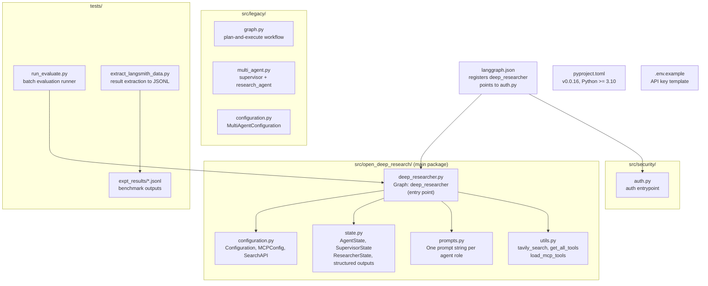

Sources: [README.md:1-20](), [CLAUDE.md:6-55](), [langgraph.json]()

---

## Core Capabilities

| Capability | Details |
|---|---|
| **Multi-agent research pipeline** | Supervisor subgraph coordinates multiple Researcher subgraphs in parallel |
| **LLM provider support** | Any model supported by `init_chat_model()`: OpenAI, Anthropic, Google, Groq, DeepSeek, Ollama, OpenRouter |
| **Search backends** | Tavily (default), OpenAI native web search, Anthropic native web search, or none |
| **MCP tool integration** | Configurable via `MCPConfig`; tools are loaded at runtime and injected into the researcher agent |
| **Configurable model roles** | Four separate model fields: `summarization_model`, `research_model`, `compression_model`, `final_report_model` |
| **Optional user clarification** | The `clarify_with_user` node can ask follow-up questions before beginning research |
| **Deployment targets** | Local dev server (`langgraph dev`), LangGraph Platform, Open Agent Platform (OAP) |
| **Evaluation pipeline** | LangSmith integration for running and scoring against Deep Research Bench |

Sources: [README.md:60-130](), [CLAUDE.md:47-66]()

---

## High-Level Runtime Flow

The diagram below maps the runtime execution path from user input to final report, naming the specific graph nodes and state types from the codebase.

**Title: Runtime Execution Flow (deep_researcher graph)**

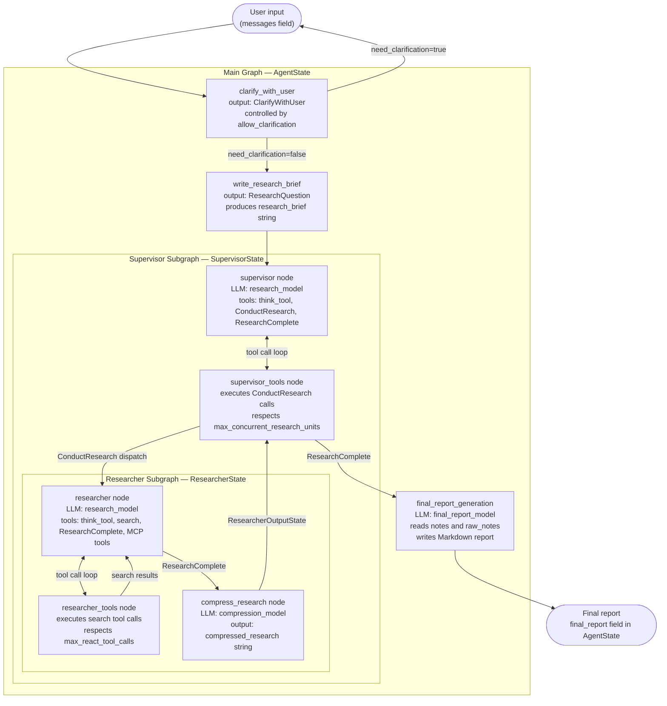

Sources: [README.md:1-10](), [CLAUDE.md:17-19]()

---

## Key Code Entities at a Glance

The table below maps the major system concepts to their concrete code locations.

| Concept | Code Entity | File |
|---|---|---|
| Main compiled graph | `deep_researcher` | `src/open_deep_research/deep_researcher.py` |
| Primary state type | `AgentState` | `src/open_deep_research/state.py` |
| Supervisor state | `SupervisorState` | `src/open_deep_research/state.py` |
| Researcher state | `ResearcherState` | `src/open_deep_research/state.py` |
| Structured output: delegate work | `ConductResearch` | `src/open_deep_research/state.py` |
| Structured output: stop research | `ResearchComplete` | `src/open_deep_research/state.py` |
| All configuration fields | `Configuration` | `src/open_deep_research/configuration.py` |
| MCP server config | `MCPConfig` | `src/open_deep_research/configuration.py` |
| Search backend selection | `SearchAPI` (enum) | `src/open_deep_research/configuration.py` |
| Tool assembly function | `get_all_tools()` | `src/open_deep_research/utils.py` |
| MCP tool loading | `load_mcp_tools()` | `src/open_deep_research/utils.py` |
| Tavily search implementation | `tavily_search` | `src/open_deep_research/utils.py` |
| All agent prompt strings | module-level constants | `src/open_deep_research/prompts.py` |
| LangGraph deployment manifest | — | `langgraph.json` |
| Authentication entrypoint | `auth.py` | `src/security/auth.py` |

Sources: [CLAUDE.md:16-55]()

---

## Supported LLM Providers and Search APIs

**LLM Providers** — any model string accepted by `init_chat_model()` works, including:

- `openai:gpt-4.1`, `openai:gpt-5`, `openai:gpt-4.1-mini`
- `anthropic:claude-sonnet-4-20250514`
- Google, Groq, DeepSeek, Ollama (local), OpenRouter

> Models must support both **structured outputs** and **tool calling**.

**Search Backends** — controlled by the `search_api` field in `Configuration`:

| `SearchAPI` enum value | Mechanism | Notes |
|---|---|---|
| `TAVILY` (default) | `tavily_search` async multi-query tool | Requires `TAVILY_API_KEY` |
| `OPENAI` | OpenAI native `web_search_preview` tool | Requires `OPENAI_API_KEY` |
| `ANTHROPIC` | Anthropic native `web_search_20250305` tool | Requires `ANTHROPIC_API_KEY` |
| `NONE` | No search tool loaded | Useful for MCP-only setups |

Sources: [README.md:60-82]()

---

## Benchmark Performance

Open Deep Research is evaluated on [Deep Research Bench](https://huggingface.co/spaces/Ayanami0730/DeepResearch-Leaderboard), which provides 100 PhD-level tasks (50 English, 50 Chinese) across 22 domains. The scoring metric is **RACE** — an LLM-as-a-judge approach (using Gemini) that compares agent output against expert-written golden reports.

Evaluation is executed via `tests/run_evaluate.py` against the LangSmith dataset `deep_research_bench`. Results are extracted to JSONL format using `tests/extract_langsmith_data.py`.

| Configuration | Research Model | RACE Score |
|---|---|---|
| GPT-5 | `openai:gpt-5` | 0.4943 |
| Claude Sonnet 4 | `anthropic:claude-sonnet-4-20250514` | 0.4401 |
| Defaults | `openai:gpt-4.1` | 0.4309 |
| Deep Research Bench Submission | `openai:gpt-4.1` | 0.4344 |

Summarization model was `openai:gpt-4.1-mini` and compression model was `openai:gpt-4.1` for all runs. For details on running evaluations, see [Evaluation System](#5.1) and [Performance Benchmarks and Results](#5.2).

Sources: [README.md:83-114]()

---

## Legacy Implementations

The `src/legacy/` directory contains two earlier architectures that are less performant than the current implementation but demonstrate alternative design approaches:

| Implementation | File | Architecture |
|---|---|---|
| Workflow | `src/legacy/graph.py` | Plan-and-execute, sequential, human-in-the-loop |
| Multi-agent | `src/legacy/multi_agent.py` | Supervisor + `research_agent` StateGraph, parallel |

These are not registered in `langgraph.json` and are not part of the active deployment. For details, see [Legacy Implementations](#3.6).

Sources: [README.md:135-150](), [CLAUDE.md:24-31]()

---

## Where to Go Next

| Goal | Page |
|---|---|
| Install and run the agent locally | [Getting Started](#2) |
| Understand the full graph node-by-node | [Deep Research Agent Workflow](#3.1) |
| See all configuration options | [Configuration Options](#4.1) |
| Configure MCP servers | [MCP Server Integration](#4.3) |
| Deploy to production | [Deployment Options](#4.4) |
| Run benchmarks | [Evaluation System](#5.1) |

---

<<< SECTION: 2 Getting Started [2-getting-started] >>>

# Getting Started

<details>
<summary>Relevant source files</summary>

The following files were used as context for generating this wiki page:

- [.env.example](.env.example)
- [README.md](README.md)
- [langgraph.json](langgraph.json)
- [pyproject.toml](pyproject.toml)
- [tests/expt_results/deep_research_bench_gpt-5.jsonl](tests/expt_results/deep_research_bench_gpt-5.jsonl)

</details>


This page covers the steps required to install Open Deep Research, configure environment variables, launch a local LangGraph server, and submit a first research query. It is scoped to initial setup only. For a deeper explanation of how the system works internally, see [System Architecture](#3). For a full reference of configuration options, see [Configuration Options](#4.1).

---

## Prerequisites

| Requirement | Minimum Version | Notes |
|---|---|---|
| Python | 3.10 | 3.11 recommended (used in `langgraph.json`) |
| `uv` | any recent | Used for dependency management |
| API key (LLM) | — | OpenAI by default; Anthropic, Google, etc. also supported |
| API key (Search) | — | Tavily by default; OpenAI/Anthropic native search also supported |
| LangSmith API key | — | Required for tracing (optional but recommended) |

The full dependency list is declared in [pyproject.toml:11-47](). Python version constraint is set at [pyproject.toml:8]().

---

## Installation

**Step 1 — Clone the repository and create a virtual environment:**

```bash
git clone https://github.com/langchain-ai/open_deep_research.git
cd open_deep_research
uv venv
source .venv/bin/activate   # Windows: .venv\Scripts\activate
```

**Step 2 — Install dependencies:**

```bash
uv sync
```

Alternatively:

```bash
uv pip install -r pyproject.toml
```

The package layout is defined in [pyproject.toml:56-65](), mapping three top-level packages:

| Package name | Source directory |
|---|---|
| `open_deep_research` | `src/open_deep_research/` |
| `legacy` | `src/legacy/` |
| `tests` | `tests/` |

Sources: [pyproject.toml:1-65]()

---

## Environment Setup

Copy the environment variable template:

```bash
cp .env.example .env
```

Then open `.env` and populate the keys you need. The full template is at [.env.example:1-13]().

**Environment variable reference:**

| Variable | Required | Purpose |
|---|---|---|
| `OPENAI_API_KEY` | Yes (default config) | Powers all four model roles by default |
| `ANTHROPIC_API_KEY` | If using Anthropic models | Research, compression, or final report model |
| `GOOGLE_API_KEY` | If using Google models | Vertex AI / Gemini model roles |
| `TAVILY_API_KEY` | Yes (default search) | Tavily search API used by researcher agents |
| `LANGSMITH_API_KEY` | Recommended | Enables LangSmith tracing |
| `LANGSMITH_PROJECT` | Optional | Names the LangSmith project for traces |
| `LANGSMITH_TRACING` | Optional | Set to `true` to enable tracing |
| `SUPABASE_KEY` | OAP deployments only | Open Agent Platform auth |
| `SUPABASE_URL` | OAP deployments only | Open Agent Platform auth |
| `GET_API_KEYS_FROM_CONFIG` | Production only | Set `true` to read keys from `RunnableConfig` instead of env |

The `GET_API_KEYS_FROM_CONFIG` flag controls whether the system reads API keys from the environment (local dev) or from the `RunnableConfig.configurable` dict (production deployments). It defaults to `false` in [.env.example:13]().

Sources: [.env.example:1-13]()

---

## Launching the Local LangGraph Server

```bash
uvx --refresh --from "langgraph-cli[inmem]" --with-editable . --python 3.11 langgraph dev --allow-blocking
```

This command:
1. Uses `uvx` to run `langgraph dev` in an isolated environment with the current project installed as an editable package.
2. Reads [langgraph.json:1-14]() to discover the graph and auth entrypoint.
3. Starts the in-memory LangGraph server.

Once running, three endpoints are available:

| Endpoint | URL |
|---|---|
| REST API | `http://127.0.0.1:2024` |
| LangGraph Studio UI | `https://smith.langchain.com/studio/?baseUrl=http://127.0.0.1:2024` |
| API Docs (OpenAPI) | `http://127.0.0.1:2024/docs` |

Sources: [README.md:43-56](), [langgraph.json:1-14]()

---

## How `langgraph.json` Connects to the Code

The server entrypoint is declared in [langgraph.json:1-14](). It registers one graph and one auth handler:

**Diagram: `langgraph.json` wiring to Python entrypoints**

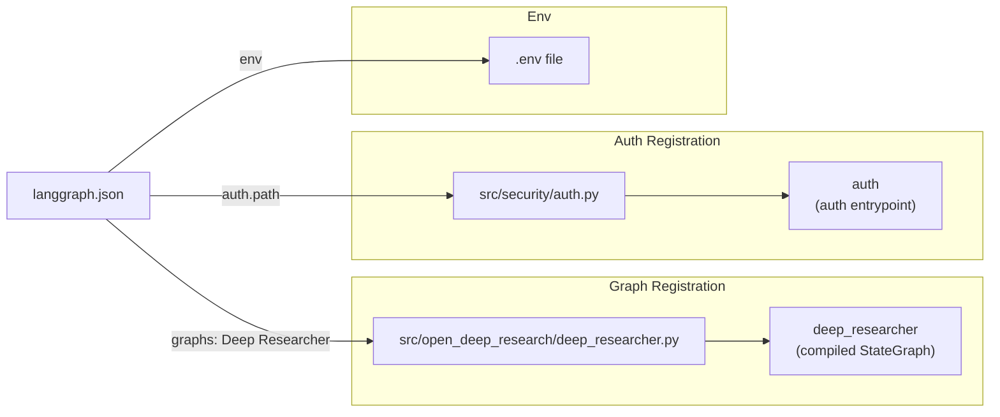

Sources: [langgraph.json:1-14](), [README.md:43-56]()

---

## Submitting a First Research Query

Once the Studio UI is open in your browser:

1. Locate the `messages` input field.
2. Enter a research question as a plain text message.
3. Click **Submit**.

The graph entry point is the `clarify_with_user` node in `deep_researcher.py`. If the `allow_clarification` configuration flag is enabled (it is by default), the agent may respond with a clarifying question before producing a report. Respond to it in the same `messages` field, or disable clarification via configuration (see below).

The final output appears in the `final_report` field of the graph state as a Markdown document.

---

## Selecting a Configuration Before Running

In the Studio UI, open the **Manage Assistants** tab to set configuration values before submitting. The values map directly to fields in the `Configuration` Pydantic model in [src/open_deep_research/configuration.py]().

**Diagram: Configuration flow from `.env` and Studio UI to graph nodes**

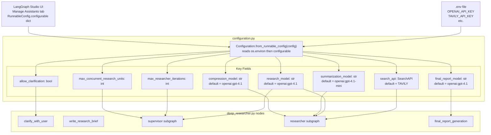

Sources: [README.md:60-81](), [.env.example:1-13](), [langgraph.json:1-14]()

---

## Common Initial Configuration Choices

| Goal | Field to Change | Example Value |
|---|---|---|
| Use Anthropic for research | `research_model` | `anthropic:claude-sonnet-4-20250514` |
| Use Anthropic native web search | `search_api` | `ANTHROPIC` |
| Use OpenAI native web search | `search_api` | `OPENAI` |
| Skip clarification step | `allow_clarification` | `false` |
| Limit search depth | `max_researcher_iterations` | `3` |
| Run researchers in parallel | `max_concurrent_research_units` | `3` |
| No web search at all | `search_api` | `NONE` |

Selected models must support both **structured outputs** and **tool calling**. See [Model Selection and Search APIs](#4.2) for provider-specific guidance.

Sources: [README.md:60-81]()

---

## What Happens When You Submit a Query

**Diagram: High-level execution path for a submitted query**

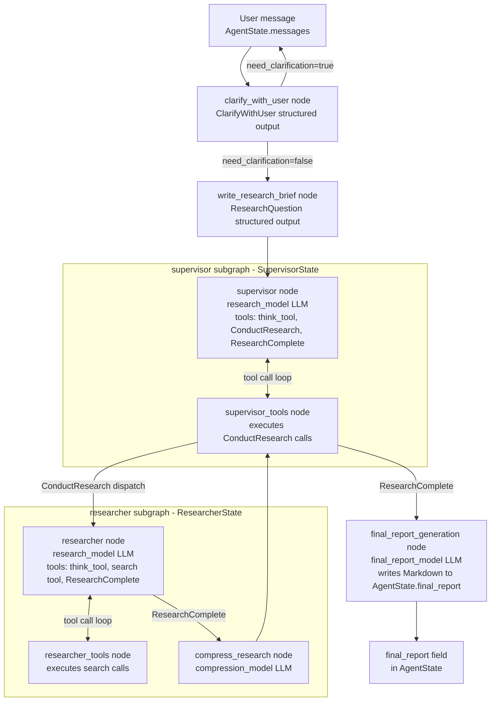

The compiled graph object is named `deep_researcher` and is defined at the bottom of [src/open_deep_research/deep_researcher.py](). It is this object that `langgraph.json` registers under the name `"Deep Researcher"`.

Sources: [langgraph.json:3-5](), [README.md:43-58]()

---

<<< SECTION: 3 System Architecture [3-system-architecture] >>>

# System Architecture

<details>
<summary>Relevant source files</summary>

The following files were used as context for generating this wiki page:

- [README.md](README.md)
- [src/legacy/configuration.py](src/legacy/configuration.py)
- [src/open_deep_research/deep_researcher.py](src/open_deep_research/deep_researcher.py)
- [src/open_deep_research/state.py](src/open_deep_research/state.py)
- [tests/expt_results/deep_research_bench_gpt-5.jsonl](tests/expt_results/deep_research_bench_gpt-5.jsonl)
- [tests/run_evaluate.py](tests/run_evaluate.py)

</details>


This document provides a technical overview of the Open Deep Research system's architecture, covering the LangGraph graph, sub-graphs, state objects, configuration, tools, and prompts, and how they fit together.

For installation and setup, see page 2 (Getting Started). For configuration reference tables, see page 4 (Usage Guide). For evaluation details, see page 5 (Evaluation and Quality Assessment).

## Core System Overview

The system implements a multi-agent research pipeline where a supervisor agent coordinates multiple parallel researcher agents. The primary source files are:

| File | Role |
|------|------|
| `src/open_deep_research/deep_researcher.py` | Main LangGraph graph and all agent node functions |
| `src/open_deep_research/state.py` | State classes and structured output types |
| `src/open_deep_research/configuration.py` | `Configuration` Pydantic model, `MCPConfig`, `SearchAPI` enum |
| `src/open_deep_research/utils.py` | Tool assembly (`get_all_tools`), search, MCP loading, token utilities |
| `src/open_deep_research/prompts.py` | System prompt strings, one per agent role |
| `langgraph.json` | Deployment manifest — registers `deep_researcher` graph |
| `src/security/auth.py` | Auth entrypoint for hosted deployments |

Sources: [src/open_deep_research/deep_researcher.py:1-60](), [src/open_deep_research/state.py:1-15](), [src/open_deep_research/configuration.py:1-10]()

### Package-to-Code Map

The following diagram maps the main runtime objects to their source locations.

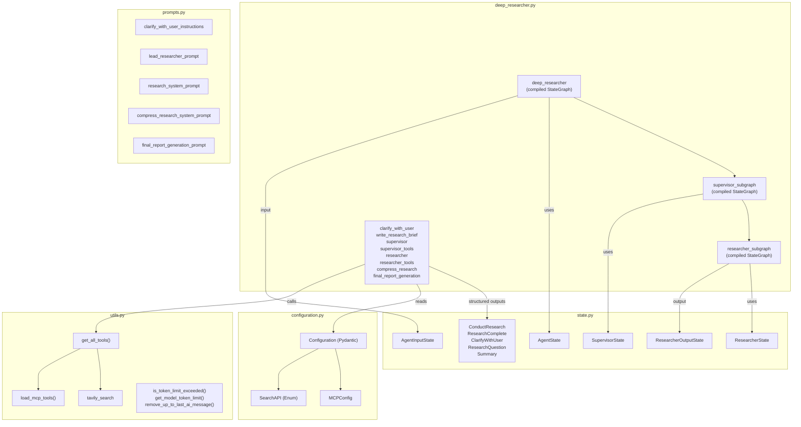

Sources: [src/open_deep_research/deep_researcher.py:353-719](), [src/open_deep_research/state.py:62-97](), [src/open_deep_research/configuration.py:1-120]()

## Agent Workflow and State Management

The workflow progresses from user input through optional clarification, research brief generation, parallel research execution, and final report synthesis.

### Main Graph Execution Flow

The outer graph (`deep_researcher`) is a `StateGraph(AgentState, input=AgentInputState)`. Inside it, the `research_supervisor` node is the compiled `supervisor_subgraph`, which in turn invokes `researcher_subgraph` instances in parallel.

**Main graph node execution order (`deep_researcher`):**

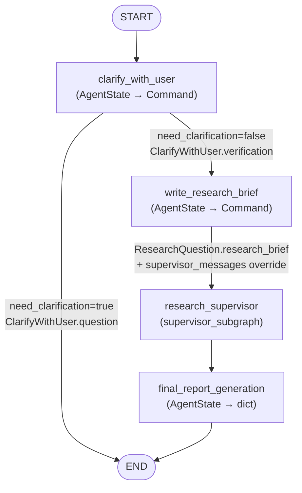

**Supervisor subgraph loop (`supervisor_subgraph`, `SupervisorState`):**

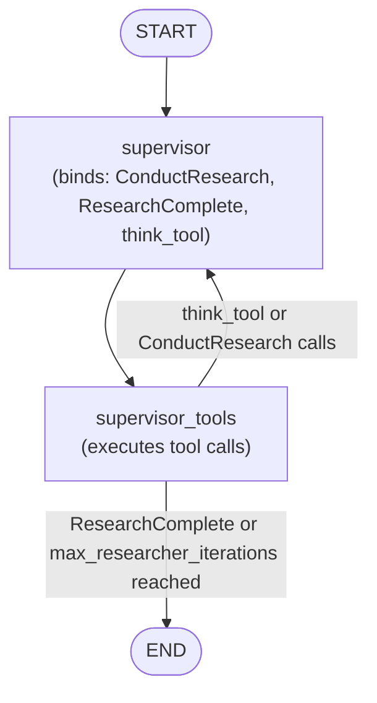

**Researcher subgraph loop (`researcher_subgraph`, `ResearcherState`, output=`ResearcherOutputState`):**

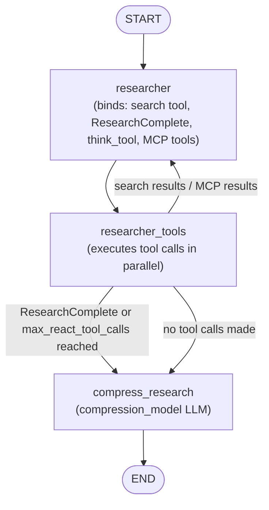

Sources: [src/open_deep_research/deep_researcher.py:60-719](), [src/open_deep_research/deep_researcher.py:353-363](), [src/open_deep_research/deep_researcher.py:587-605](), [src/open_deep_research/deep_researcher.py:699-717]()

### State Classes

The system defines five state classes in `state.py`, used by different layers of the graph hierarchy.

| Class | Graph layer | Key fields |
|-------|-------------|------------|
| `AgentInputState` | Main graph input | `messages` (from `MessagesState`) |
| `AgentState` | Main graph | `messages`, `supervisor_messages`, `research_brief`, `raw_notes`, `notes`, `final_report` |
| `SupervisorState` | Supervisor subgraph | `supervisor_messages`, `research_brief`, `notes`, `research_iterations`, `raw_notes` |
| `ResearcherState` | Researcher subgraph | `researcher_messages`, `tool_call_iterations`, `research_topic`, `compressed_research`, `raw_notes` |
| `ResearcherOutputState` | Researcher subgraph output | `compressed_research`, `raw_notes` |

Both `AgentState` and `SupervisorState` use an `override_reducer` on `supervisor_messages`, `raw_notes`, and `notes`. This reducer allows a node to either append to a list (default) or fully replace it by passing `{"type": "override", "value": [...]}`. See [src/open_deep_research/state.py:55-60]() for the implementation.

### Structured Output Types

Nodes use these `pydantic.BaseModel` subclasses as structured outputs or tool schemas:

| Type | Used by | Purpose |
|------|---------|---------|
| `ClarifyWithUser` | `clarify_with_user` | Determines whether to ask user a question |
| `ResearchQuestion` | `write_research_brief` | Extracts structured research brief from conversation |
| `ConductResearch` | `supervisor` (tool) | Instructs supervisor to spawn a researcher |
| `ResearchComplete` | `supervisor`, `researcher` (tool) | Signals task completion |
| `Summary` | `tavily_search` | Per-URL summarization output |

Sources: [src/open_deep_research/state.py:15-49](), [src/open_deep_research/state.py:55-97]()

## Configuration

Configuration is managed via the `Configuration` Pydantic model in `configuration.py`. Its `from_runnable_config` classmethod loads values, giving priority to environment variables (`os.environ.get(field.upper())`) over values from `RunnableConfig.configurable`.

### Configuration Loading Flow

```mermaid
flowchart LR
    DOTENV["`.env` file\n(OPENAI_API_KEY, TAVILY_API_KEY, etc.)"]
    RC["RunnableConfig.configurable\n(Studio UI or API body)"]
    FRC["Configuration.from_runnable_config(config)\niterates model_fields:\n1. os.environ.get(FIELD.upper()) — priority\n2. configurable.get(field) — fallback\n3. drop None → Pydantic defaults"]
    CFG["Configuration instance\n(consumed by all node functions)"]

    DOTENV --> FRC
    RC --> FRC
    FRC --> CFG
```

### Key Configuration Fields

| Field | Default | Controls |
|-------|---------|---------|
| `research_model` | `openai:gpt-4.1` | LLM for `supervisor`, `researcher`, `clarify_with_user`, `write_research_brief` |
| `summarization_model` | `openai:gpt-4.1-mini` | Per-URL summarization inside `tavily_search` |
| `compression_model` | `openai:gpt-4.1` | LLM for `compress_research` node |
| `final_report_model` | `openai:gpt-4.1` | LLM for `final_report_generation` node |
| `search_api` | `SearchAPI.TAVILY` | Which search tool the researcher receives |
| `allow_clarification` | `True` | Whether `clarify_with_user` may prompt the user |
| `max_researcher_iterations` | `6` | Max supervisor loop iterations before forced exit |
| `max_react_tool_calls` | `10` | Max researcher tool call rounds per researcher instance |
| `max_concurrent_research_units` | `10` | Max parallel `researcher_subgraph` invocations per supervisor step |
| `mcp_config` | `None` | `MCPConfig(url, tools, auth_required)` for MCP server integration |

All models are initialised via `init_chat_model(configurable_fields=("model", "max_tokens", "api_key"))`, so any provider string accepted by `langchain.chat_models.init_chat_model` is valid.

Sources: [src/open_deep_research/configuration.py:1-120](), [src/open_deep_research/deep_researcher.py:56-58]()

## Deployment and Runtime Architecture

The graph is registered for deployment via `langgraph.json`, which points to the compiled `deep_researcher` graph in `deep_researcher.py` and the `auth.py` entrypoint in `src/security/`.

### Deployment Targets

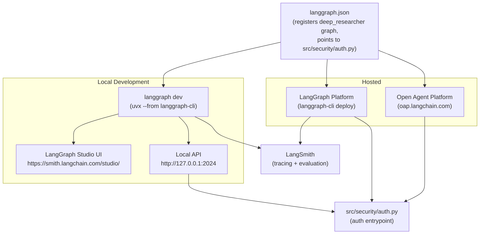

Sources: [README.md:21-58](), [README.md:115-134]()

## Tool Integration

Tools are assembled by `get_all_tools(config)` in `utils.py` and bound to the appropriate agent model at runtime.

### Tool Assignment by Agent

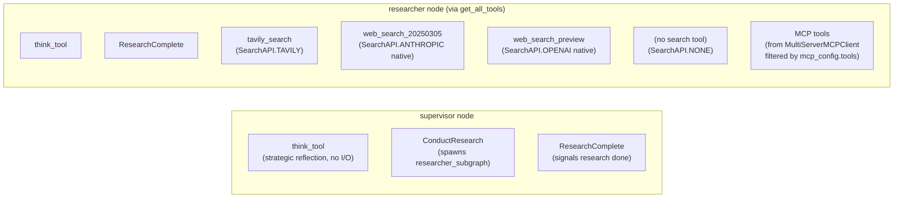

The `search_api` field on `Configuration` (a `SearchAPI` enum) selects exactly one search backend for the researcher. Options are `TAVILY`, `ANTHROPIC`, `OPENAI`, and `NONE`. MCP tools are additive — if `mcp_config` is set, tools from the configured MCP server are appended, skipping any name that already exists in the tool list.

`tavily_search` is an async multi-query tool defined in `utils.py`. For each URL returned by Tavily, it calls the `summarization_model` to produce a `Summary(summary, key_excerpts)` before returning results.

Sources: [src/open_deep_research/utils.py:1-300](), [src/open_deep_research/deep_researcher.py:200-210](), [src/open_deep_research/deep_researcher.py:383-389]()

## Budget and Resource Management

The system implements comprehensive resource management through configurable limits on iterations, token usage, and concurrent operations to ensure controlled execution and cost management.

| Resource Type | Configuration Parameter | Purpose |
|---------------|------------------------|---------|
| Research Iterations | `max_researcher_iterations` | Limits supervisor delegation cycles |
| Tool Calls | `max_react_tool_calls` | Prevents excessive API usage per researcher |
| Concurrent Research | `max_concurrent_research_units` | Controls parallel researcher spawning |
| Token Limits | Model-specific limits | Manages LLM token consumption |
| Search API Calls | Search provider limits | Controls external API usage |

Sources: [README.md:139-148](), [src/open_deep_research/state.py:74-96]()

The architecture enables scalable, configurable research workflows while maintaining resource control and quality assurance through its layered approach to agent coordination, state management, and external service integration.

---

<<< SECTION: 3.1 Deep Research Agent Workflow [3-1-deep-research-agent-workflow] >>>

# Deep Research Agent Workflow

<details>
<summary>Relevant source files</summary>

The following files were used as context for generating this wiki page:

- [src/legacy/configuration.py](src/legacy/configuration.py)
- [src/open_deep_research/deep_researcher.py](src/open_deep_research/deep_researcher.py)
- [src/open_deep_research/prompts.py](src/open_deep_research/prompts.py)
- [src/open_deep_research/state.py](src/open_deep_research/state.py)
- [tests/run_evaluate.py](tests/run_evaluate.py)

</details>


This page documents the complete execution flow of the deep research agent: every node in the main LangGraph graph, the subgraphs it contains, how nodes communicate through state, and the routing logic between them. The graph is defined entirely in [src/open_deep_research/deep_researcher.py]().

For the state types used by each node, see [State Management](#3.2). For configuration fields that control node behavior, see [Configuration System](#3.3). For tool implementations referenced here, see [Tool Integration and Utilities](#3.4). For the prompt strings passed into each node, see [Agent Prompts and Instructions](#3.5).

---

## Graph Overview

The system is composed of three nested LangGraph `StateGraph` instances:

| Graph variable | Builder variable | State type | Scope |
|---|---|---|---|
| `deep_researcher` | `deep_researcher_builder` | `AgentState` (input: `AgentInputState`) | Top-level graph |
| `supervisor_subgraph` | `supervisor_builder` | `SupervisorState` | Supervisor loop |
| `researcher_subgraph` | `researcher_builder` | `ResearcherState` (output: `ResearcherOutputState`) | Per-research-task loop |

The top-level graph embeds `supervisor_subgraph` as a node named `"research_supervisor"`, and `supervisor_subgraph` calls `researcher_subgraph` by direct `ainvoke` inside the `supervisor_tools` function — not as a declared LangGraph node.

Sources: [src/open_deep_research/deep_researcher.py:700-719](), [src/open_deep_research/deep_researcher.py:351-363](), [src/open_deep_research/deep_researcher.py:587-605]()

---

## Top-Level Graph Structure

**Diagram: Top-level `deep_researcher` graph node/edge structure**

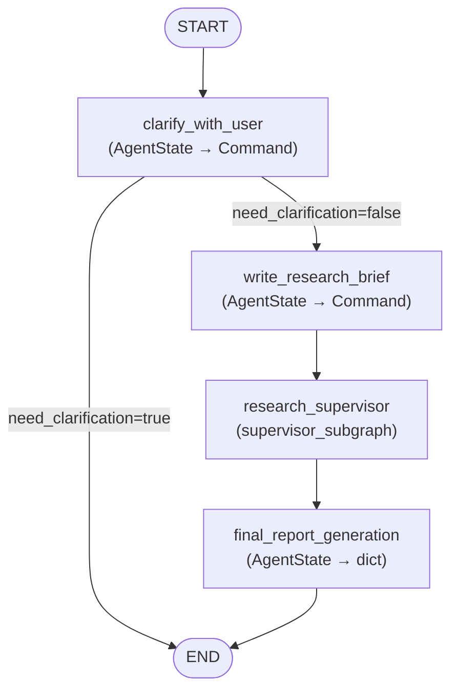

Sources: [src/open_deep_research/deep_researcher.py:700-719]()

---

## Node Reference

### `clarify_with_user`

**Function:** `clarify_with_user(state: AgentState, config: RunnableConfig)`  
**Defined at:** [src/open_deep_research/deep_researcher.py:60-115]()

This is the entry point of the graph. It uses the `research_model` configured via `Configuration`, invokes it with `.with_structured_output(ClarifyWithUser)`, and decides whether to ask the user a follow-up question or proceed immediately.

**Routing logic:**

| Condition | Route | State update |
|---|---|---|
| `allow_clarification=False` (config flag) | → `write_research_brief` | none |
| `ClarifyWithUser.need_clarification=True` | → `END` | appends clarifying question as `AIMessage` |
| `ClarifyWithUser.need_clarification=False` | → `write_research_brief` | appends verification `AIMessage` |

The prompt used is `clarify_with_user_instructions` from [src/open_deep_research/prompts.py:3-41]().

---

### `write_research_brief`

**Function:** `write_research_brief(state: AgentState, config: RunnableConfig)`  
**Defined at:** [src/open_deep_research/deep_researcher.py:118-175]()

Transforms the conversation history into a focused `ResearchQuestion` structured output via `.with_structured_output(ResearchQuestion)`. It then initialises the supervisor's message history by:

1. Generating `research_brief: str` from `ResearchQuestion.research_brief`
2. Building the supervisor system prompt from `lead_researcher_prompt` (formatted with `date`, `max_concurrent_research_units`, `max_researcher_iterations`)
3. Writing `supervisor_messages` to state using the `override_reducer` pattern (type: `"override"`)

The prompt used is `transform_messages_into_research_topic_prompt` from [src/open_deep_research/prompts.py:44-77]().

**State updates written:** `research_brief`, `supervisor_messages`

---

### `research_supervisor` (Supervisor Subgraph)

This node is the compiled `supervisor_subgraph`, which is itself a two-node loop. See the subgraph section below for details.

**State boundary:** The supervisor subgraph operates on `SupervisorState`. It reads `supervisor_messages` and `research_brief` from the parent `AgentState` and writes back `notes` and `raw_notes`.

---

### `final_report_generation`

**Function:** `final_report_generation(state: AgentState, config: RunnableConfig)`  
**Defined at:** [src/open_deep_research/deep_researcher.py:607-697]()

Reads all `notes` (compressed research summaries) from state, concatenates them, and passes them along with `research_brief` and message history to the `final_report_model`. Produces a Markdown report.

**Token-limit retry logic:** If the model raises a token limit error, the node truncates `findings` by 10% per retry for up to 3 attempts. The initial truncation size is derived from `get_model_token_limit()` multiplied by 4 (character approximation).

**State updates written:** `final_report` (str), `messages` (appends report), `notes` (cleared via override reducer)

The prompt used is `final_report_generation_prompt` from [src/open_deep_research/prompts.py:228-308]().

---

## Supervisor Subgraph

**Diagram: `supervisor_subgraph` internal loop**

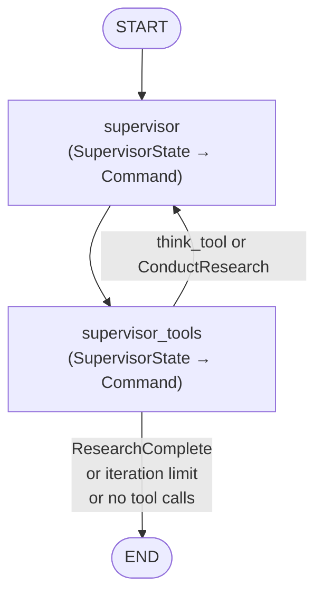

Sources: [src/open_deep_research/deep_researcher.py:351-363]()

### `supervisor` node

**Function:** `supervisor(state: SupervisorState, config: RunnableConfig)`  
**Defined at:** [src/open_deep_research/deep_researcher.py:178-223]()

Binds three tools to the `research_model`:

| Tool | Purpose |
|---|---|
| `ConductResearch` | Spawn a researcher subgraph on a topic |
| `ResearchComplete` | Signal end of research phase |
| `think_tool` | Strategic reflection (no I/O) |

Invokes the model with the full `supervisor_messages` history and appends the response. Increments `research_iterations` by 1.

### `supervisor_tools` node

**Function:** `supervisor_tools(state: SupervisorState, config: RunnableConfig)`  
**Defined at:** [src/open_deep_research/deep_researcher.py:225-348]()

**Exit conditions** (any one routes to `END`):

| Condition | Effect |
|---|---|
| `research_iterations > max_researcher_iterations` | Exits; writes `notes` from tool call history |
| No tool calls in last message | Exits |
| `ResearchComplete` tool called | Exits |

**`ConductResearch` execution:**

When the supervisor calls `ConductResearch`, this node:

1. Slices the calls to `max_concurrent_research_units` (extras receive an error `ToolMessage`)
2. Dispatches all allowed calls **in parallel** via `asyncio.gather` over `researcher_subgraph.ainvoke`
3. Each call passes `{"researcher_messages": [HumanMessage(content=research_topic)], "research_topic": research_topic}`
4. Results arrive as `ResearcherOutputState`; `compressed_research` is placed into a `ToolMessage`; `raw_notes` are concatenated and appended to state

**`think_tool` execution:**

Each `think_tool` call is handled inline — its `reflection` argument is echoed back as a `ToolMessage` with no external I/O.

Sources: [src/open_deep_research/deep_researcher.py:225-348]()

---

## Researcher Subgraph

**Diagram: `researcher_subgraph` internal loop and exit paths**

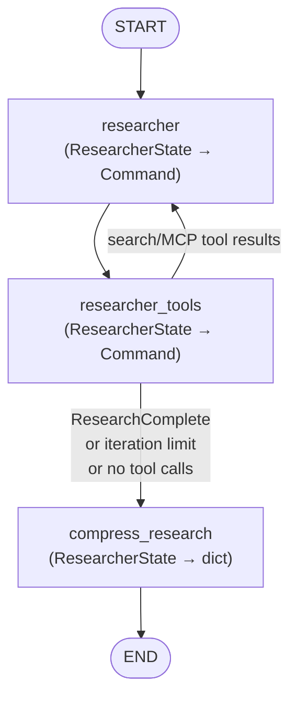

Sources: [src/open_deep_research/deep_researcher.py:587-605]()

### `researcher` node

**Function:** `researcher(state: ResearcherState, config: RunnableConfig)`  
**Defined at:** [src/open_deep_research/deep_researcher.py:365-424]()

Calls `get_all_tools(config)` to retrieve the configured search tool, `think_tool`, `ResearchComplete`, and any MCP tools. Raises `ValueError` if the tool list is empty (no search API or MCP configured).

Prepends `research_system_prompt` as a `SystemMessage`, then invokes `research_model` with the full `researcher_messages` history. Increments `tool_call_iterations`.

The prompt used is `research_system_prompt` from [src/open_deep_research/prompts.py:138-183]().

### `researcher_tools` node

**Function:** `researcher_tools(state: ResearcherState, config: RunnableConfig)`  
**Defined at:** [src/open_deep_research/deep_researcher.py:435-509]()

**Exit conditions** (route to `compress_research`):

| Condition | Notes |
|---|---|
| No tool calls and no native search (OpenAI/Anthropic) | Immediate exit |
| `tool_call_iterations >= max_react_tool_calls` | Exits after processing last tool calls |
| `ResearchComplete` tool called | Exits after processing all tool calls |

Tool calls are dispatched in parallel via `asyncio.gather` using `execute_tool_safely`, which wraps each invocation with a `try/except` to prevent one tool failure from aborting the entire batch.

Detects native provider search via `openai_websearch_called()` and `anthropic_websearch_called()` helpers from [src/open_deep_research/utils.py]().

### `compress_research` node

**Function:** `compress_research(state: ResearcherState, config: RunnableConfig)`  
**Defined at:** [src/open_deep_research/deep_researcher.py:511-585]()

Uses the `compression_model` (not `research_model`) to distill accumulated `researcher_messages` into a clean, citation-preserving summary. The output becomes the `ToolMessage` content returned to the supervisor.

**Retry logic:** Up to 3 attempts. On token limit error, older messages are removed via `remove_up_to_last_ai_message()` before retrying.

**Returns** (`ResearcherOutputState`):

| Field | Content |
|---|---|
| `compressed_research` | Cleaned, cited summary string |
| `raw_notes` | Concatenated raw tool + AI message content |

The prompt used is `compress_research_system_prompt` from [src/open_deep_research/prompts.py:186-226]().

---

## Complete Data Flow Diagram

**Diagram: State fields flowing between graph nodes**

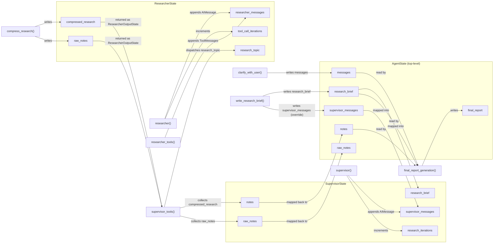

Sources: [src/open_deep_research/deep_researcher.py:60-697](), [src/open_deep_research/state.py:62-96]()

---

## Iteration and Budget Controls

The following `Configuration` fields act as hard stops at specific points in the graph:

| Field | Enforced in | Effect when exceeded |
|---|---|---|
| `allow_clarification` | `clarify_with_user` | Skips clarification entirely if `False` |
| `max_researcher_iterations` | `supervisor_tools` | Exits supervisor loop, writes collected notes to state |
| `max_concurrent_research_units` | `supervisor_tools` | Caps parallel `ConductResearch` calls; extras receive error `ToolMessage` |
| `max_react_tool_calls` | `researcher_tools` | Exits researcher loop, routes to `compress_research` |
| `max_structured_output_retries` | `clarify_with_user`, `write_research_brief`, `supervisor`, `researcher` | Retries `.with_retry(stop_after_attempt=...)` on structured output calls |

Sources: [src/open_deep_research/deep_researcher.py:75-77](), [src/open_deep_research/deep_researcher.py:247-262](), [src/open_deep_research/deep_researcher.py:289-292](), [src/open_deep_research/deep_researcher.py:492-503]()

---

## Graph Compilation and Registration

The three compiled graph objects are:

```
deep_researcher       — top-level, registered in langgraph.json
supervisor_subgraph   — embedded as node "research_supervisor"
researcher_subgraph   — called directly from supervisor_tools via ainvoke
```

`deep_researcher` is built with:
- `input=AgentInputState` — only `messages` accepted on entry
- `config_schema=Configuration` — all configuration fields exposed to LangGraph Studio UI

`researcher_subgraph` is built with:
- `output=ResearcherOutputState` — only `compressed_research` and `raw_notes` returned to caller

[src/open_deep_research/deep_researcher.py:699-719](), [src/open_deep_research/deep_researcher.py:351-363](), [src/open_deep_research/deep_researcher.py:587-605]()

---

<<< SECTION: 3.2 State Management [3-2-state-management] >>>

# State Management

<details>
<summary>Relevant source files</summary>

The following files were used as context for generating this wiki page:

- [src/legacy/configuration.py](src/legacy/configuration.py)
- [src/open_deep_research/deep_researcher.py](src/open_deep_research/deep_researcher.py)
- [src/open_deep_research/state.py](src/open_deep_research/state.py)
- [tests/run_evaluate.py](tests/run_evaluate.py)

</details>


This page documents the state classes and structured output types defined in [src/open_deep_research/state.py](), which form the data layer of the entire research pipeline. It covers what each state class holds, which graph layer uses it, how fields are annotated with reducers, and how the structured output types act as typed contracts between LLM calls and graph transitions.

For the graph nodes that read and write these states, see [3.1](#3.1). For configuration values that influence graph behavior, see [3.3](#3.3).

---

## Overview

The pipeline operates across three nested graph levels — a main graph, a supervisor subgraph, and one or more researcher subgraphs. Each level has its own state type. Because LangGraph merges state updates from concurrent nodes using reducer functions, every field with non-trivial merge behavior is annotated with an explicit reducer.

**State class → graph level mapping:**

| State Class | Graph Level | Defined In |
|---|---|---|
| `AgentInputState` | Main graph input | [src/open_deep_research/state.py:62-63]() |
| `AgentState` | Main graph | [src/open_deep_research/state.py:65-72]() |
| `SupervisorState` | Supervisor subgraph | [src/open_deep_research/state.py:74-81]() |
| `ResearcherState` | Researcher subgraph (internal) | [src/open_deep_research/state.py:83-90]() |
| `ResearcherOutputState` | Researcher subgraph output | [src/open_deep_research/state.py:92-96]() |

**Structured output types (used as LLM response schemas, not graph state):**

| Class | Used By |
|---|---|
| `ClarifyWithUser` | `clarify_with_user` node |
| `ResearchQuestion` | `write_research_brief` node |
| `ConductResearch` | `supervisor` node (tool call) |
| `ResearchComplete` | `supervisor` and `researcher` nodes (tool call) |
| `Summary` | `tavily_search` URL summarization |

Sources: [src/open_deep_research/state.py:1-96]()

---

## The `override_reducer` Pattern

LangGraph applies a reducer function whenever a state field is updated. The default reducer for lists is `operator.add`, which appends new values. The pipeline defines a custom reducer to allow nodes to selectively replace a list instead of extending it:

[src/open_deep_research/state.py:55-60]()

```
def override_reducer(current_value, new_value):
    if isinstance(new_value, dict) and new_value.get("type") == "override":
        return new_value.get("value", new_value)
    else:
        return operator.add(current_value, new_value)
```

- **Normal update**: pass a list → appended to the current value.
- **Override update**: pass `{"type": "override", "value": [...]}` → replaces the current value entirely.

This pattern is used in `write_research_brief` to reset `supervisor_messages` to a fresh system prompt at the start of each research session, rather than accumulating old messages:

[src/open_deep_research/deep_researcher.py:163-175]()

```python
update={
    "supervisor_messages": {
        "type": "override",
        "value": [SystemMessage(...), HumanMessage(...)]
    }
}
```

It is also used in `final_report_generation` to clear `notes` after the report is written:

[src/open_deep_research/deep_researcher.py:622]()

```python
cleared_state = {"notes": {"type": "override", "value": []}}
```

**Fields annotated with `override_reducer`:**

| Field | State Class |
|---|---|
| `supervisor_messages` | `AgentState`, `SupervisorState` |
| `raw_notes` | `AgentState`, `SupervisorState`, `ResearcherState`, `ResearcherOutputState` |
| `notes` | `AgentState`, `SupervisorState` |

Sources: [src/open_deep_research/state.py:55-96](), [src/open_deep_research/deep_researcher.py:163-175](), [src/open_deep_research/deep_researcher.py:622]()

---

## State Classes

### `AgentInputState`

[src/open_deep_research/state.py:62-63]()

```python
class AgentInputState(MessagesState):
    """InputState is only 'messages'."""
```

A thin wrapper around LangGraph's `MessagesState`. It restricts the external-facing input to only the `messages` field. The main graph is constructed with this as its input schema:

[src/open_deep_research/deep_researcher.py:701-705]()

```python
deep_researcher_builder = StateGraph(
    AgentState,
    input=AgentInputState,
    config_schema=Configuration
)
```

This means callers only need to provide `messages`; all other fields in `AgentState` are internal.

---

### `AgentState`

[src/open_deep_research/state.py:65-72]()

The full state of the main graph. It inherits `messages` from `MessagesState` and adds research-specific fields.

| Field | Type | Reducer | Purpose |
|---|---|---|---|
| `messages` | `list[BaseMessage]` | `add_messages` (from `MessagesState`) | Conversation history with the user |
| `supervisor_messages` | `list[MessageLikeRepresentation]` | `override_reducer` | Internal message thread for the supervisor subgraph |
| `research_brief` | `Optional[str]` | last-write-wins | Structured research brief produced by `write_research_brief` |
| `raw_notes` | `list[str]` | `override_reducer` | Raw tool/AI output collected from all researcher subgraphs |
| `notes` | `list[str]` | `override_reducer` | Compressed research summaries from the supervisor |
| `final_report` | `str` | last-write-wins | The completed Markdown report |

Sources: [src/open_deep_research/state.py:65-72]()

---

### `SupervisorState`

[src/open_deep_research/state.py:74-81]()

State for the supervisor subgraph. It is a `TypedDict`, not a `MessagesState`, because the supervisor maintains its own message thread (`supervisor_messages`) separate from the user-facing `messages` list.

| Field | Type | Reducer | Purpose |
|---|---|---|---|
| `supervisor_messages` | `list[MessageLikeRepresentation]` | `override_reducer` | Message thread between supervisor LLM calls |
| `research_brief` | `str` | last-write-wins | Passed in from `AgentState`; guides the supervisor |
| `notes` | `list[str]` | `override_reducer` | Compressed summaries accumulated across iterations |
| `research_iterations` | `int` | last-write-wins | Counter used to enforce `max_researcher_iterations` |
| `raw_notes` | `list[str]` | `override_reducer` | Raw notes passed up from researcher subgraphs |

`research_iterations` is incremented by the `supervisor` node on each pass and checked in `supervisor_tools` to determine whether to exit the loop:

[src/open_deep_research/deep_researcher.py:247]()

```python
exceeded_allowed_iterations = research_iterations > configurable.max_researcher_iterations
```

Sources: [src/open_deep_research/state.py:74-81](), [src/open_deep_research/deep_researcher.py:243-255]()

---

### `ResearcherState`

[src/open_deep_research/state.py:83-90]()

State for an individual researcher subgraph instance. Each parallel `ConductResearch` call spawns a fresh invocation with its own `ResearcherState`.

| Field | Type | Reducer | Purpose |
|---|---|---|---|
| `researcher_messages` | `list[MessageLikeRepresentation]` | `operator.add` | Message thread for the researcher's ReAct loop |
| `tool_call_iterations` | `int` | last-write-wins | Counter used to enforce `max_react_tool_calls` |
| `research_topic` | `str` | last-write-wins | The specific topic string assigned by the supervisor |
| `compressed_research` | `str` | last-write-wins | Output from `compress_research`; returned to supervisor |
| `raw_notes` | `list[str]` | `override_reducer` | Raw tool output collected during the ReAct loop |

Note that `researcher_messages` uses `operator.add` (plain append), not `override_reducer`. This is intentional — the researcher's message thread should only grow; it is never reset mid-execution.

Sources: [src/open_deep_research/state.py:83-90]()

---

### `ResearcherOutputState`

[src/open_deep_research/state.py:92-96]()

```python
class ResearcherOutputState(BaseModel):
    compressed_research: str
    raw_notes: Annotated[list[str], override_reducer] = []
```

A Pydantic `BaseModel` (not a `TypedDict`) that defines what the researcher subgraph exposes to its caller. The subgraph is built with this as its output schema:

[src/open_deep_research/deep_researcher.py:589-593]()

```python
researcher_builder = StateGraph(
    ResearcherState,
    output=ResearcherOutputState,
    config_schema=Configuration
)
```

When `supervisor_tools` calls `researcher_subgraph.ainvoke(...)`, it receives a dict matching this schema, and reads `compressed_research` to build a `ToolMessage` back to the supervisor.

Sources: [src/open_deep_research/state.py:92-96](), [src/open_deep_research/deep_researcher.py:589-605](), [src/open_deep_research/deep_researcher.py:308-313]()

---

## State Flow Across Graph Levels

The diagram below traces how data moves between the three graph levels, which state type each level uses, and how the key fields propagate.

**State Flow Diagram**

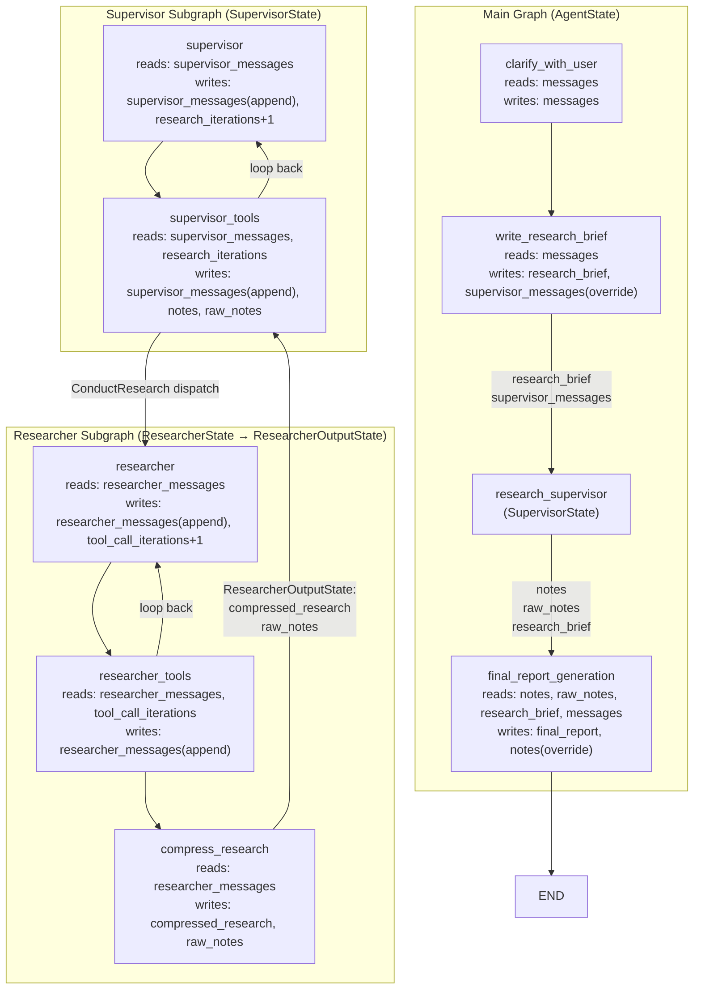

Sources: [src/open_deep_research/state.py:62-96](), [src/open_deep_research/deep_researcher.py:60-719]()

---

## Structured Output Types

These Pydantic `BaseModel` classes are used with `.with_structured_output()` or `.bind_tools()` to enforce typed LLM responses. They are not part of the graph state directly — they are instantiated per LLM call and their fields are then extracted to update state or route the graph.

**Structured Output Types Diagram**

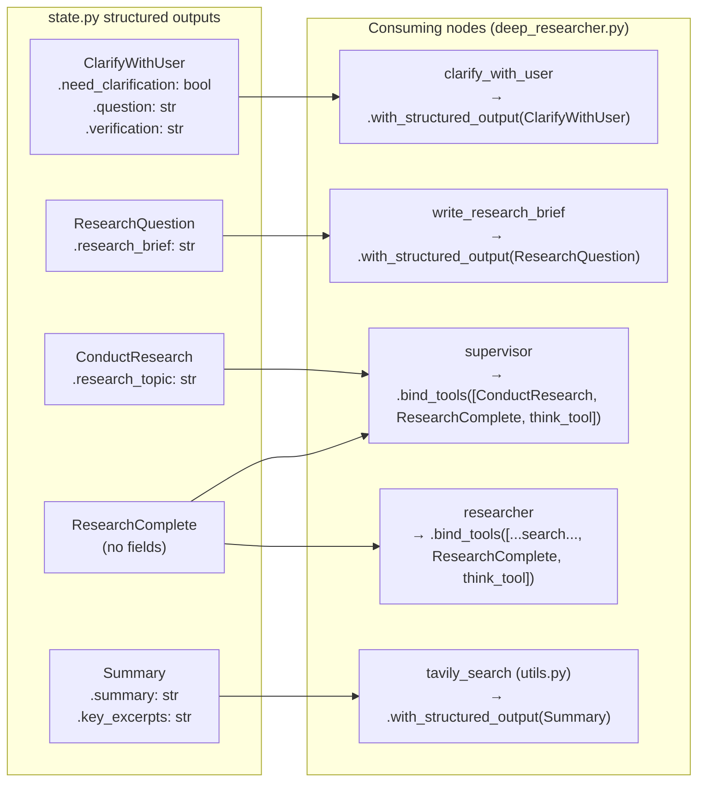

### `ClarifyWithUser`

[src/open_deep_research/state.py:30-41]()

Returned by the `clarify_with_user` node. The `need_clarification` boolean determines whether the graph routes to `END` (asking the user a question) or continues to `write_research_brief`.

### `ResearchQuestion`

[src/open_deep_research/state.py:43-48]()

Returned by `write_research_brief`. Its `research_brief` field is written directly to `AgentState.research_brief` and also used as the initial `HumanMessage` to the supervisor.

### `ConductResearch`

[src/open_deep_research/state.py:15-19]()

A tool that the supervisor binds and calls to delegate research. Its `research_topic` field (described as "at least a paragraph") is passed as the initial message to a researcher subgraph instance. The field description instructs the LLM to be detailed.

### `ResearchComplete`

[src/open_deep_research/state.py:21-22]()

A signal-only tool with no fields. Both the supervisor and researcher agents can call it to indicate they are done. `supervisor_tools` checks for it to exit the supervisor loop; `researcher_tools` checks for it to route to `compress_research`.

### `Summary`

[src/open_deep_research/state.py:24-27]()

Used internally by `tavily_search` in `utils.py` to structure the per-URL summarization output. It is not directly referenced in any graph state class.

Sources: [src/open_deep_research/state.py:15-48](), [src/open_deep_research/deep_researcher.py:88-115](), [src/open_deep_research/deep_researcher.py:141-154](), [src/open_deep_research/deep_researcher.py:249-252](), [src/open_deep_research/deep_researcher.py:492-496]()

---

## Field Lifecycle Reference

The table below summarizes where each `AgentState` field originates and where it is consumed.

| Field | Written By | Read By | Notes |
|---|---|---|---|
| `messages` | User input; `clarify_with_user`; `final_report_generation` | `clarify_with_user`; `write_research_brief`; `final_report_generation` | Inherited from `MessagesState`; uses `add_messages` reducer |
| `supervisor_messages` | `write_research_brief` (override); `supervisor`; `supervisor_tools` | `supervisor` | Separate thread from user `messages` |
| `research_brief` | `write_research_brief` | `supervisor` (via `SupervisorState`); `final_report_generation` | Plain string; no reducer needed |
| `raw_notes` | `supervisor_tools` (aggregated from researchers) | `final_report_generation` | Uses `override_reducer`; appended per research round |
| `notes` | `supervisor_tools` (at END) | `final_report_generation` | Compressed summaries; cleared after report generation |
| `final_report` | `final_report_generation` | External caller | Terminal output field |

Sources: [src/open_deep_research/state.py:65-72](), [src/open_deep_research/deep_researcher.py:60-719]()

---

<<< SECTION: 3.3 Configuration System [3-3-configuration-system] >>>

# Configuration System

<details>
<summary>Relevant source files</summary>

The following files were used as context for generating this wiki page:

- [.env.example](.env.example)
- [src/open_deep_research/configuration.py](src/open_deep_research/configuration.py)

</details>


## Purpose and Scope

The Configuration System provides centralized management of all configurable parameters for the Open Deep Research agent system. It defines model selections, research behavior settings, search API configurations, and MCP server integrations through a strongly-typed Pydantic-based configuration framework.

This document covers the configuration data structures, parameter definitions, and loading mechanisms. For information about deployment-specific configuration and environment setup, see [Deployment Options](#4.4). For details about model selection and API configuration, see [Model Selection and Search APIs](#4.2).

## Configuration Architecture

The configuration system is built around three main components: the `Configuration` class, `MCPConfig` class, and `SearchAPI` enum, all working together to provide a unified configuration interface.

### Configuration System Overview

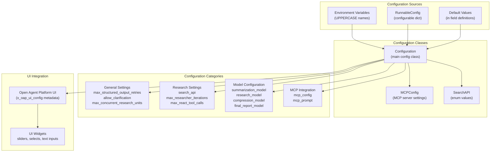

**Sources:** [src/open_deep_research/configuration.py:1-252]()

### Configuration Loading Flow

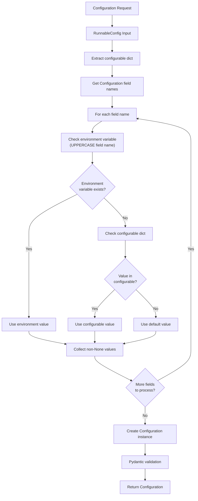

**Sources:** [src/open_deep_research/configuration.py:236-247]()

## Configuration Classes

### Configuration Class

The `Configuration` class is the main configuration container that defines all system parameters through Pydantic fields with comprehensive UI metadata.

| Field Category | Purpose | Key Fields |
|---|---|---|
| General | Core system behavior | `max_structured_output_retries`, `allow_clarification`, `max_concurrent_research_units` |
| Research | Research execution control | `search_api`, `max_researcher_iterations`, `max_react_tool_calls` |
| Models | LLM model specifications | `summarization_model`, `research_model`, `compression_model`, `final_report_model` |
| MCP Integration | External tool connectivity | `mcp_config`, `mcp_prompt` |

**Sources:** [src/open_deep_research/configuration.py:38-252]()

### MCPConfig Class

The `MCPConfig` class manages Model Context Protocol server configuration for external tool integration.

```mermaid
classDiagram
    class MCPConfig {
        "+Optional[str] url"
        "+Optional[List[str]] tools"
        "+Optional[bool] auth_required"
    }
    
    class Configuration {
        "+Optional[MCPConfig] mcp_config"
        "+Optional[str] mcp_prompt"
    }
    
    Configuration --> MCPConfig : "contains"
```

**Sources:** [src/open_deep_research/configuration.py:19-36]()

### SearchAPI Enum

The `SearchAPI` enum defines available search providers for research operations.

| Value | Description |
|---|---|
| `ANTHROPIC` | Anthropic native web search |
| `OPENAI` | OpenAI native web search |
| `TAVILY` | Tavily search API (default) |
| `NONE` | No search API |

**Sources:** [src/open_deep_research/configuration.py:11-17]()

## Configuration Parameters

### General Configuration

These parameters control core system behavior and execution patterns.

| Parameter | Type | Default | Range | Description |
|---|---|---|---|---|
| `max_structured_output_retries` | `int` | `3` | 1–10 | Maximum retries for structured output calls from models |
| `allow_clarification` | `bool` | `True` | — | Whether to allow clarifying questions before starting research |
| `max_concurrent_research_units` | `int` | `5` | 1–20 | Maximum number of concurrent research units |

**Sources:** [src/open_deep_research/configuration.py:42-76]()

### Research Configuration

These parameters control research execution and iteration behavior.

| Parameter | Type | Default | Range | Description |
|---|---|---|---|---|
| `search_api` | `SearchAPI` | `TAVILY` | — | Search API provider for research operations |
| `max_researcher_iterations` | `int` | `6` | 1–10 | Maximum supervisor reflection/follow-up iterations |
| `max_react_tool_calls` | `int` | `10` | 1–30 | Maximum tool-call iterations per researcher step |

**Sources:** [src/open_deep_research/configuration.py:77-119]()

### Model Configuration

The system uses a specialized model pipeline where different models handle different stages of the research process.

**Model Pipeline — Configuration Fields to Pipeline Stages**

```mermaid
flowchart LR
    INPUT["Research Query"]
    SUMMARIZATION["summarization_model\nopenai:gpt-4.1-mini\nmax_tokens: 8192"]
    RESEARCH["research_model\nopenai:gpt-4.1\nmax_tokens: 10000"]
    COMPRESSION["compression_model\nopenai:gpt-4.1\nmax_tokens: 8192"]
    FINAL["final_report_model\nopenai:gpt-4.1\nmax_tokens: 10000"]
    OUTPUT["Final Report"]

    INPUT --> RESEARCH
    RESEARCH -->|"per-URL summarization\n(Tavily results)"| SUMMARIZATION
    RESEARCH --> COMPRESSION
    COMPRESSION --> FINAL
    FINAL --> OUTPUT
```

| Configuration Field | Default Value | Max Tokens Field | Default Max Tokens | Purpose |
|---|---|---|---|---|
| `summarization_model` | `openai:gpt-4.1-mini` | `summarization_model_max_tokens` | `8192` | Summarizing individual Tavily search result pages |
| `research_model` | `openai:gpt-4.1` | `research_model_max_tokens` | `10000` | Supervisor and researcher agents conducting research |
| `compression_model` | `openai:gpt-4.1` | `compression_model_max_tokens` | `8192` | Compressing sub-agent research findings |
| `final_report_model` | `openai:gpt-4.1` | `final_report_model_max_tokens` | `10000` | Writing the final Markdown report |

Also controlled by `max_content_length` (default: `50000` characters) — the maximum character length for webpage content before the `summarization_model` is invoked to trim it.

**Sources:** [src/open_deep_research/configuration.py:120-212]()

### MCP Integration Configuration

MCP (Model Context Protocol) configuration enables integration with external tools and services.

| Parameter | Type | Description |
|---|---|---|
| `mcp_config` | `Optional[MCPConfig]` | MCP server configuration object |
| `mcp_prompt` | `Optional[str]` | Additional instructions for MCP tool usage |

The `MCPConfig` object contains:
- `url`: MCP server endpoint URL
- `tools`: List of specific tool names to expose to the agent
- `auth_required`: Boolean flag for OAuth authentication requirements

**Sources:** [src/open_deep_research/configuration.py:213-233]()

## Configuration Loading and Initialization

### from_runnable_config Method

The primary configuration loading mechanism uses the `from_runnable_config` class method to create `Configuration` instances from `RunnableConfig` objects.

**`from_runnable_config` — Resolution Logic**

```mermaid
sequenceDiagram
    participant Caller
    participant Configuration
    participant os_environ as "os.environ"
    participant configurable as "RunnableConfig[configurable]"
    
    Caller->>Configuration: "from_runnable_config(config)"
    Configuration->>configurable: "config.get('configurable', {})"
    Configuration->>Configuration: "list(cls.model_fields.keys())"
    
    loop "for each field_name"
        Configuration->>os_environ: "os.environ.get(field_name.upper(), fallback)"
        note over os_environ,configurable: "fallback = configurable.get(field_name)"
        os_environ-->>Configuration: "env value OR configurable value OR None"
    end
    
    Configuration->>Configuration: "filter out None values"
    Configuration->>Configuration: "cls(**values) — Pydantic applies remaining defaults"
    Configuration-->>Caller: "Configuration instance"
```

The resolution order for each field:

| Priority | Source | Mechanism |
|---|---|---|
| 1 (highest) | Environment variable | `os.environ.get(field_name.upper(), ...)` |
| 2 | `RunnableConfig` `configurable` dict | `configurable.get(field_name)` used as fallback to `os.environ.get` |
| 3 (lowest) | Pydantic field default | Applied when neither of the above provide a value |

The single-expression `os.environ.get(field_name.upper(), configurable.get(field_name))` means environment variables always shadow the `configurable` dict. Fields that resolve to `None` are excluded from the constructor call, allowing Pydantic defaults to apply.

**Sources:** [src/open_deep_research/configuration.py:236-247]()

## Open Agent Platform UI Integration

The configuration system includes comprehensive UI metadata for the Open Agent Platform, enabling dynamic form generation and user-friendly configuration interfaces.

### UI Widget Types

| Widget Type | Usage | Examples |
|---|---|---|
| `slider` | Numeric ranges with constraints | `max_concurrent_research_units`, `max_researcher_iterations` |
| `select` | Enumerated choices | `search_api` options |
| `text` | String input fields | Model names, prompts |
| `number` | Numeric input | Token limits, retry counts |
| `boolean` | Toggle switches | `allow_clarification` |
| `mcp` | MCP server configuration | `mcp_config` |

Each field's `x_oap_ui_config` metadata defines the UI widget properties, including type, default values, constraints, and descriptions.

**Sources:** [src/open_deep_research/configuration.py:34-210]()

---

<<< SECTION: 3.4 Tool Integration and Utilities [3-4-tool-integration-and-utilities] >>>

# Tool Integration and Utilities

<details>
<summary>Relevant source files</summary>

The following files were used as context for generating this wiki page:

- [src/open_deep_research/configuration.py](src/open_deep_research/configuration.py)
- [src/open_deep_research/utils.py](src/open_deep_research/utils.py)

</details>


This document covers the utility functions and external service integrations that support the Open Deep Research system's research capabilities. The utilities provide search functionality, tool management, Model Context Protocol (MCP) server integration, and various support functions for the research agents.

For configuration of these tools and services, see [Configuration Options](#4.1). For information about deploying with MCP servers, see [MCP Server Integration](#4.3).

## Search API Integration

The system supports multiple search providers through a unified interface, with Tavily Search being the primary implementation for comprehensive web search capabilities.

### Tavily Search Implementation

The `tavily_search` function provides the core web search functionality used by research agents:

```mermaid
flowchart TD
    A[tavily_search] --> B[tavily_search_async]
    B --> C[AsyncTavilyClient]
    C --> D[Parallel_Search_Tasks]
    D --> E[Raw_Search_Results]
    E --> F[Deduplication_By_URL]
    F --> G[summarization_model]
    G --> H[Summarized_Results]
    H --> I[Formatted_Output]
    
    J[Configuration] --> K[max_results]
    J --> L[topic_filter]
    J --> M[summarization_model]
    
    K --> A
    L --> A
    M --> G
    
    style A fill:#e1f5fe
    style G fill:#fff3e0
    style C fill:#e8f5e8
```

**Search Process Flow**

The search integration implements intelligent content processing:

| Component | Function | Implementation |
|-----------|----------|----------------|
| **Query Processing** | `tavily_search_async` | Executes multiple queries in parallel |
| **Result Deduplication** | URL-based filtering | Removes duplicate results across queries |
| **Content Summarization** | `summarize_webpage` | Uses configured summarization model |
| **Character Limits** | 50,000 character limit | Prevents token overflow |
| **Error Handling** | Timeout and retry logic | 60-second timeout with structured retries |

Sources: [src/open_deep_research/utils.py:43-136](), [src/open_deep_research/utils.py:138-173](), [src/open_deep_research/utils.py:175-213]()

### Multi-Provider Search Support

The system supports different search APIs through the `get_search_tool` function:

```mermaid
graph TD
    A[get_search_tool] --> B{SearchAPI_Type}
    
    B -->|ANTHROPIC| C["web_search_20250305"]
    B -->|OPENAI| D["web_search_preview"]
    B -->|TAVILY| E[tavily_search_tool]
    B -->|NONE| F[empty_list]
    
    C --> G[Native_Provider_Tools]
    D --> G
    E --> H[Custom_Tool_Implementation]
    F --> I[No_Search_Tools]
    
    style A fill:#e1f5fe
    style E fill:#e8f5e8
    style G fill:#fff3e0
```

Sources: [src/open_deep_research/utils.py:531-567]()

## Reflection and Strategic Planning Tools

The system includes a strategic reflection tool that enables research agents to pause and analyze their progress during the research process.

### Think Tool Implementation

**Think Tool Architecture**

```mermaid
flowchart TD
    A["think_tool"] --> B["Strategic_Reflection"]
    B --> C["Current_Findings_Analysis"]
    B --> D["Gap_Assessment"]
    B --> E["Quality_Evaluation"]
    B --> F["Strategic_Decision"]
    
    G["After_Search_Results"] --> A
    H["Before_Next_Steps"] --> A
    I["Research_Gap_Assessment"] --> A
    J["Before_Conclusion"] --> A
    
    C --> K["Recorded_Reflection"]
    D --> K
    E --> K
    F --> K
    
    style A fill:#e1f5fe
    style K fill:#e8f5e8
```

The `think_tool` creates deliberate pause points in the research workflow, allowing agents to systematically evaluate their progress and plan next steps. This tool addresses four key reflection areas:

| Reflection Area | Purpose | Implementation |
|----------------|---------|----------------|
| **Current Findings Analysis** | Assess concrete information gathered | What key information did I find? |
| **Gap Assessment** | Identify missing information | What crucial information is still missing? |
| **Quality Evaluation** | Determine sufficiency of evidence | Do I have sufficient evidence/examples? |
| **Strategic Decision** | Plan next research actions | Should I continue searching or conclude? |

**Usage Triggers:**
- After receiving search results to analyze findings
- Before deciding next steps to ensure systematic planning  
- When assessing research gaps to identify specific missing information
- Before concluding research to ensure completeness

Sources: [src/open_deep_research/utils.py:219-244]()

## MCP Server Integration

The Model Context Protocol (MCP) integration enables external tool access through standardized server connections.

### Authentication and Token Management

MCP authentication follows a token exchange pattern:

```mermaid
sequenceDiagram
    participant Agent as "Research_Agent"
    participant Utils as "MCP_Utils"
    participant Store as "LangGraph_Store"
    participant MCP as "MCP_Server"
    
    Agent->>Utils: load_mcp_tools(config)
    Utils->>Utils: fetch_tokens(config)
    Utils->>Store: get_tokens()
    
    alt Tokens Expired or Missing
        Utils->>MCP: get_mcp_access_token()
        MCP-->>Utils: new_access_token
        Utils->>Store: set_tokens(new_token)
    end
    
    Utils->>MCP: MultiServerMCPClient()
    MCP-->>Utils: available_tools
    Utils->>Agent: wrapped_tools
```

**Token Management Functions**

| Function | Purpose | Implementation |
|----------|---------|----------------|
| `get_tokens` | Retrieve stored tokens | Checks expiration and validates user context |
| `set_tokens` | Store authentication tokens | Thread and user-scoped storage |
| `fetch_tokens` | Obtain new tokens | Handles Supabase token exchange |
| `get_mcp_access_token` | Exchange tokens with MCP server | OAuth-style token exchange |

Sources: [src/open_deep_research/utils.py:250-383]()

### Tool Loading and Error Handling

MCP tools are loaded dynamically and wrapped with authentication handling:

```mermaid
flowchart TD
    A[load_mcp_tools] --> B{auth_required}
    B -->|Yes| C[fetch_tokens]
    B -->|No| D[Skip_Authentication]
    
    C --> E[MultiServerMCPClient]
    D --> E
    
    E --> F[get_tools]
    F --> G[Tool_Filtering]
    G --> H[wrap_mcp_authenticate_tool]
    H --> I[Wrapped_Tools]
    
    J[Configuration] --> K[mcp_config.url]
    J --> L[mcp_config.tools]
    J --> M[mcp_config.auth_required]
    
    K --> E
    L --> G
    M --> B
    
    style A fill:#e1f5fe
    style H fill:#fff3e0
    style E fill:#e8f5e8
```

The `wrap_mcp_authenticate_tool` function provides intelligent error handling for MCP tool failures, specifically handling interaction-required errors (code -32003) and converting them to user-friendly `ToolException` messages.

Sources: [src/open_deep_research/utils.py:449-524](), [src/open_deep_research/utils.py:385-447]()

## Tool Management System

The tool management system coordinates different tool types and provides them to research agents.

### Unified Tool Loading

```mermaid
graph TD
    A[get_all_tools] --> B[Base_Tools]
    A --> C[Search_Tools] 
    A --> D[MCP_Tools]
    
    B --> E[ResearchComplete_Tool]
    C --> F[get_search_tool]
    D --> G[load_mcp_tools]
    
    F --> H{Search_API_Type}
    H --> I[Provider_Specific_Tools]
    
    G --> J[External_MCP_Tools]
    
    E --> K[All_Tools_Collection]
    I --> K
    J --> K
    
    L[existing_tool_names] --> M[Name_Conflict_Prevention]
    M --> K
    
    style A fill:#e1f5fe
    style K fill:#e8f5e8
```

**Tool Categories**

| Category | Implementation | Purpose |
|----------|----------------|---------|
| **Base Tools** | `ResearchComplete` | Signal research completion |
| **Search Tools** | Provider-specific implementations | Web search capabilities |
| **MCP Tools** | External server tools | Extended functionality |
| **Name Deduplication** | `existing_tool_names` set | Prevents tool name conflicts |

Sources: [src/open_deep_research/utils.py:569-597]()

### Tool Call Processing

The system extracts information from tool calls in message histories:

```python
def get_notes_from_tool_calls(messages: list[MessageLikeRepresentation]):
    return [tool_msg.content for tool_msg in filter_messages(messages, include_types="tool")]
```

Sources: [src/open_deep_research/utils.py:599-601]()

## Provider-Specific Utilities

Different LLM providers have native search capabilities that require specific handling.

### Native Web Search Detection

```mermaid
flowchart TD
    A[LLM_Response] --> B{Provider_Type}
    
    B -->|Anthropic| C[anthropic_websearch_called]
    B -->|OpenAI| D[openai_websearch_called]
    
    C --> E[Check_server_tool_use]
    E --> F[web_search_requests > 0]
    
    D --> G[Check_tool_outputs]
    G --> H[type == web_search_call]
    
    F --> I[Search_Used_Flag]
    H --> I
    
    style A fill:#e1f5fe
    style I fill:#e8f5e8
```

**Provider-Specific Implementation**

| Provider | Detection Method | Response Location |
|----------|------------------|-------------------|
| **Anthropic** | `server_tool_use.web_search_requests` | `response_metadata.usage` |
| **OpenAI** | `tool_outputs` with `web_search_call` type | `additional_kwargs.tool_outputs` |

Sources: [src/open_deep_research/utils.py:607-658]()

## Token Management and Error Handling

The system includes sophisticated token limit detection and handling across multiple LLM providers.

### Token Limit Detection

```mermaid
graph TD
    A[is_token_limit_exceeded] --> B{Model_Provider}
    
    B -->|OpenAI| C[_check_openai_token_limit]
    B -->|Anthropic| D[_check_anthropic_token_limit]
    B -->|Gemini/Google| E[_check_gemini_token_limit]
    B -->|Unknown| F[Check_All_Providers]
    
    C --> G[BadRequestError_Analysis]
    D --> H[prompt_too_long_Check]
    E --> I[ResourceExhausted_Check]
    
    G --> J[Token_Limit_Boolean]
    H --> J
    I --> J
    F --> J
    
    style A fill:#e1f5fe
    style J fill:#e8f5e8
```

**Provider-Specific Error Patterns**

| Provider | Error Types | Detection Keywords |
|----------|-------------|-------------------|
| **OpenAI** | `BadRequestError`, `context_length_exceeded` | token, context, length, maximum context |
| **Anthropic** | `BadRequestError` | prompt is too long |
| **Google/Gemini** | `ResourceExhausted`, `GoogleGenerativeAIFetchError` | Resource exhaustion patterns |

Sources: [src/open_deep_research/utils.py:665-785]()

### Model Token Limits Database

The system maintains a comprehensive database of model token limits:

```mermaid
graph TD
    A[MODEL_TOKEN_LIMITS] --> B[OpenAI_Models]
    A --> C[Anthropic_Models]
    A --> D[Google_Models]
    A --> E[Other_Providers]
    
    B --> F["gpt-4o: 128000"]
    B --> G["o3-mini: 200000"]
    
    C --> H["claude-3-5-sonnet: 200000"]
    C --> I["claude-3-5-haiku: 200000"]
    
    D --> J["gemini-1.5-pro: 2097152"]
    D --> K["gemini-1.5-flash: 1048576"]
    
    L[get_model_token_limit] --> M[Token_Limit_Lookup]
    A --> M
    
    style A fill:#e1f5fe
    style M fill:#e8f5e8
```

Sources: [src/open_deep_research/utils.py:788-846]()

### Message History Management

When token limits are exceeded, the system can truncate message history:

```python
def remove_up_to_last_ai_message(messages: list[MessageLikeRepresentation]) -> list[MessageLikeRepresentation]:
    for i in range(len(messages) - 1, -1, -1):
        if isinstance(messages[i], AIMessage):
            return messages[:i]  # Return everything up to (but not including) the last AI message
    return messages
```

Sources: [src/open_deep_research/utils.py:848-866]()

## General Utilities

### API Key Management

The system supports both environment variable and configuration-based API key management:

```mermaid
flowchart TD
    A[get_api_key_for_model] --> B{GET_API_KEYS_FROM_CONFIG}
    
    B -->|true| C[Config_Based_Keys]
    B -->|false| D[Environment_Variables]
    
    C --> E[config.configurable.apiKeys]
    D --> F[os.getenv]
    
    E --> G{Model_Provider}
    F --> G
    
    G -->|openai:| H[OPENAI_API_KEY]
    G -->|anthropic:| I[ANTHROPIC_API_KEY]
    G -->|google| J[GOOGLE_API_KEY]
    
    style A fill:#e1f5fe
    style E fill:#fff3e0
    style F fill:#e8f5e8
```

**Configuration Support**

| Function | Purpose | Implementation |
|----------|---------|----------------|
| `get_api_key_for_model` | Model-specific API key retrieval | Supports both config and env vars |
| `get_tavily_api_key` | Tavily search API key | Consistent with model key pattern |
| `get_config_value` | Generic configuration value extraction | Handles different value types |
| `get_today_str` | Current date formatting | Human-readable date strings |

Sources: [src/open_deep_research/utils.py:892-925](), [src/open_deep_research/utils.py:872-879]()

## Integration Architecture

The utilities system integrates with the broader Open Deep Research architecture:

```mermaid
graph TB
    subgraph "Research Agents"
        A[Supervisor_Agent]
        B[Researcher_Agents]
        C[Compression_Agent]
    end
    
    subgraph "Utils Integration Layer"
        D["get_all_tools"]
        E["tavily_search"]
        F["load_mcp_tools"]
        G["think_tool"]
        H["Provider_Utils"]
    end
    
    subgraph "External Services"
        H[Tavily_API]
        I[MCP_Servers]
        J[LLM_Providers]
        K[LangGraph_Store]
    end
    
    A --> D
    B --> D
    C --> D
    
    D --> E
    D --> F
    D --> G
    D --> H
    
    E --> H
    F --> I
    F --> K
    G --> J
    
    style D fill:#e1f5fe
    style E fill:#e8f5e8
    style F fill:#fff3e0
```

This utilities layer provides the foundation for all external integrations, enabling research agents to access web search, external tools, and provider-specific capabilities through a unified interface.

Sources: [src/open_deep_research/utils.py:1-494]()

---

<<< SECTION: 3.5 Agent Prompts and Instructions [3-5-agent-prompts-and-instructions] >>>

# Agent Prompts and Instructions

<details>
<summary>Relevant source files</summary>

The following files were used as context for generating this wiki page:

- [src/legacy/configuration.py](src/legacy/configuration.py)
- [src/open_deep_research/deep_researcher.py](src/open_deep_research/deep_researcher.py)
- [src/open_deep_research/prompts.py](src/open_deep_research/prompts.py)
- [tests/run_evaluate.py](tests/run_evaluate.py)

</details>


This page documents every prompt template defined in [src/open_deep_research/prompts.py]() and describes how each is used by the nodes in the main research pipeline. The focus is on the text content, template parameters, output contracts, and which pipeline stage each prompt controls.

For the runtime nodes that consume these prompts, see [3.1 Deep Research Agent Workflow](#3.1). For the configuration fields that parameterize prompts (e.g., `max_researcher_iterations`, `mcp_prompt`), see [3.3 Configuration System](#3.3). For the tool definitions that prompts reference (e.g., `think_tool`, `ConductResearch`), see [3.4 Tool Integration and Utilities](#3.4).

---

## Prompt Overview

All prompts are plain module-level string constants in [src/open_deep_research/prompts.py](). They are imported by [src/open_deep_research/deep_researcher.py]() and injected into LangChain messages before being passed to LLMs.

**Prompt-to-node mapping:**

| Prompt Constant | Consuming Node | Role |
|---|---|---|
| `clarify_with_user_instructions` | `clarify_with_user` | Decides if user input needs clarification |
| `transform_messages_into_research_topic_prompt` | `write_research_brief` | Converts conversation into a structured research brief |
| `lead_researcher_prompt` | `write_research_brief` (injected into supervisor) | System instructions for the supervisor agent |
| `research_system_prompt` | `researcher` | System instructions for individual researcher agents |
| `compress_research_system_prompt` | `compress_research` | Instructions for compressing raw research output |
| `compress_research_simple_human_message` | `compress_research` | Human-turn trigger appended before compression |
| `final_report_generation_prompt` | `final_report_generation` | Instructions for writing the final markdown report |
| `summarize_webpage_prompt` | `tavily_search` (via `utils.py`) | Per-URL summarization during web search |

Sources: [src/open_deep_research/prompts.py:1-368](), [src/open_deep_research/deep_researcher.py:22-30]()

---

## Pipeline Position of Each Prompt

The following diagram maps each prompt constant to the node and message role it occupies.

**Diagram: Prompts in the Pipeline**

```mermaid
flowchart TD
    subgraph "AgentState Graph"
        N1["clarify_with_user\nnode"]
        N2["write_research_brief\nnode"]
        subgraph "SupervisorState Subgraph"
            N3["supervisor\nnode"]
        end
        subgraph "ResearcherState Subgraph"
            N4["researcher\nnode"]
            N5["compress_research\nnode"]
        end
        N6["final_report_generation\nnode"]
    end

    P1["clarify_with_user_instructions\n(HumanMessage)"] --> N1
    P2["transform_messages_into_research_topic_prompt\n(HumanMessage)"] --> N2
    P3["lead_researcher_prompt\n(SystemMessage, injected via write_research_brief)"] --> N3
    P4["research_system_prompt\n(SystemMessage)"] --> N4
    P5["compress_research_system_prompt\n(SystemMessage)"] --> N5
    P6["compress_research_simple_human_message\n(HumanMessage, appended)"] --> N5
    P7["final_report_generation_prompt\n(HumanMessage)"] --> N6
    P8["summarize_webpage_prompt\n(used inside tavily_search)"] --> N4
```

Sources: [src/open_deep_research/deep_researcher.py:97-101](), [src/open_deep_research/deep_researcher.py:150-174](), [src/open_deep_research/deep_researcher.py:400-415](), [src/open_deep_research/deep_researcher.py:540-552](), [src/open_deep_research/deep_researcher.py:642-647]()

---

## `clarify_with_user_instructions`

[src/open_deep_research/prompts.py:3-41]()

### Purpose

Determines whether additional clarification from the user is needed before initiating research. This is rendered as a `HumanMessage` and passed to a model configured with `with_structured_output(ClarifyWithUser)`.

### Template Parameters

| Parameter | Source |
|---|---|
| `{messages}` | `get_buffer_string(state["messages"])` — the full conversation history |
| `{date}` | `get_today_str()` — today's date for temporal context |

### Output Contract

The model must respond with a `ClarifyWithUser` structured output (JSON with three fields):

| Field | Type | Meaning |
|---|---|---|
| `need_clarification` | `bool` | Whether a question should be asked |
| `question` | `str` | The clarifying question text (empty if not needed) |
| `verification` | `str` | Acknowledgement message to show the user when proceeding |

### Routing Logic

The consuming node `clarify_with_user` in [src/open_deep_research/deep_researcher.py:104-115]() routes based on `response.need_clarification`:
- `True` → returns `AIMessage(content=response.question)` and ends the turn (prompts user reply)
- `False` → returns `AIMessage(content=response.verification)` and continues to `write_research_brief`

### Key Behavioral Rules in the Prompt

- If a clarifying question has already been asked, do **not** ask another unless absolutely necessary.
- Ask about acronyms, abbreviations, or unknown terms.
- Format questions using markdown (bullet points, numbered lists).

Sources: [src/open_deep_research/prompts.py:3-41](), [src/open_deep_research/deep_researcher.py:60-115]()

---

## `transform_messages_into_research_topic_prompt`

[src/open_deep_research/prompts.py:44-77]()

### Purpose

Converts the conversation history (user messages plus any clarification exchange) into a single, self-contained research brief. This prompt is used inside `write_research_brief`, which uses `with_structured_output(ResearchQuestion)`.

### Template Parameters

| Parameter | Source |
|---|---|
| `{messages}` | `get_buffer_string(state["messages"])` |
| `{date}` | `get_today_str()` |

### Output Contract

The model returns a `ResearchQuestion` structured output. Its `research_brief` field is stored in `AgentState.research_brief` and passed as the first `HumanMessage` to the supervisor.

[src/open_deep_research/deep_researcher.py:150-175]()

### Key Behavioral Rules in the Prompt

1. **Maximize specificity** — include all user-stated preferences and attributes.
2. **Fill gaps as open-ended** — do not invent constraints not stated by the user.
3. **Avoid assumptions** — label unspecified dimensions as flexible.
4. **Use first-person** — phrase from the user's perspective.
5. **Source guidance** — prefer primary sources over aggregators; academic queries should point to original papers; people queries should prefer LinkedIn or personal sites; language-specific queries prefer same-language sources.

Sources: [src/open_deep_research/prompts.py:44-77](), [src/open_deep_research/deep_researcher.py:118-175]()

---

## `lead_researcher_prompt`

[src/open_deep_research/prompts.py:79-136]()

### Purpose

System instructions for the **supervisor agent**. This prompt is formatted in `write_research_brief` and injected as the `SystemMessage` that opens the supervisor's message history.

### Template Parameters

| Parameter | Source |
|---|---|
| `{date}` | `get_today_str()` |
| `{max_researcher_iterations}` | `configurable.max_researcher_iterations` |
| `{max_concurrent_research_units}` | `configurable.max_concurrent_research_units` |

[src/open_deep_research/deep_researcher.py:157-161]()

### Supervisor Tool Contract

The prompt explicitly names the three tools available to the supervisor:

| Tool | Purpose |
|---|---|
| `ConductResearch` | Delegate a research subtask to a sub-agent |
| `ResearchComplete` | Signal that research is finished |
| `think_tool` | Strategic reflection (must not be called in parallel with other tools) |

### Key Behavioral Rules in the Prompt

**Scaling rules** govern how many sub-agents to spawn:
- Simple fact-finding → 1 sub-agent
- Comparisons → 1 sub-agent per element (e.g., A vs B vs C → 3 agents)
- Default: bias toward a single agent

**Hard limits:**
- Maximum `{max_concurrent_research_units}` parallel `ConductResearch` calls per iteration
- Stop after `{max_researcher_iterations}` total tool calls

**Process:**
1. Use `think_tool` before calling `ConductResearch` (plan)
2. After each `ConductResearch` result, use `think_tool` to assess whether the research is sufficient
3. Pass complete, standalone instructions to each sub-agent (sub-agents cannot see each other's work)
4. Avoid acronyms in research topics passed to sub-agents

Sources: [src/open_deep_research/prompts.py:79-136](), [src/open_deep_research/deep_researcher.py:155-174]()

---

## `research_system_prompt`

[src/open_deep_research/prompts.py:138-183]()

### Purpose

System instructions for each individual **researcher agent**. This is prepended as a `SystemMessage` to the researcher's message list on every invocation of the `researcher` node.

### Template Parameters

| Parameter | Source |
|---|---|
| `{date}` | `get_today_str()` |
| `{mcp_prompt}` | `configurable.mcp_prompt or ""` — injected MCP tool descriptions |

[src/open_deep_research/deep_researcher.py:400-403]()

### Researcher Tool Contract

The prompt lists the standard tools by name:

| Tool | Notes |
|---|---|
| `tavily_search` | Primary web search (exact name varies by `search_api` config) |
| `think_tool` | Reflection after each search; **must not** be called in parallel with other tools |
| MCP tools | Described via `{mcp_prompt}` placeholder |

The `{mcp_prompt}` slot allows the system to inject descriptions of any MCP tools loaded at runtime, making the researcher aware of what additional capabilities are available.

### Key Behavioral Rules in the Prompt

**Search budget (hard limits):**
- Simple queries: 2–3 search calls maximum
- Complex queries: up to 5 search calls maximum
- Always stop after 5 total search calls

**Stop conditions:**
- Question can be answered comprehensively
- 3+ relevant sources gathered
- Last 2 searches returned similar information

**Process:**
1. Read question carefully
2. Start with broad searches; narrow progressively
3. After each search, use `think_tool` to assess: what was found, what is missing, whether to continue

Sources: [src/open_deep_research/prompts.py:138-183](), [src/open_deep_research/deep_researcher.py:396-415]()

---

## `compress_research_system_prompt` and `compress_research_simple_human_message`

[src/open_deep_research/prompts.py:186-226]()

### Purpose

These two constants work together to drive the **compression step**, which distills a researcher's full tool call history into a clean, structured summary.

- `compress_research_system_prompt` is rendered as a `SystemMessage`
- `compress_research_simple_human_message` is appended as the final `HumanMessage` to the researcher's message list immediately before calling the compression model

[src/open_deep_research/deep_researcher.py:538-548]()

### Template Parameters

`compress_research_system_prompt` takes one parameter:

| Parameter | Source |
|---|---|
| `{date}` | `get_today_str()` |

`compress_research_simple_human_message` has no parameters — it is a static string.

### Output Contract

The compression model produces a free-form text block (stored as `compressed_research` in `ResearcherOutputState`) structured as:

```
**List of Queries and Tool Calls Made**
**Fully Comprehensive Findings**
**List of All Relevant Sources (with citations in the report)**
```

Citations within the findings use sequential numbered references:
```
[1] Source Title: URL
[2] Source Title: URL
```

### Key Behavioral Rules in the Prompt

- **Do not summarize or paraphrase** — reproduce relevant information verbatim or near-verbatim.
- **No information loss** — the compressed output is the only artifact forwarded to the supervisor; nothing else from the raw researcher session survives.
- Deduplicate only when multiple sources say exactly the same thing (e.g., "These three sources all stated X").
- Include all sources, even marginally relevant ones — a downstream LLM will merge multiple compressed reports.

Sources: [src/open_deep_research/prompts.py:186-226](), [src/open_deep_research/deep_researcher.py:511-585]()

---

## `final_report_generation_prompt`

[src/open_deep_research/prompts.py:228-308]()

### Purpose

Instructions for writing the final, user-facing research report. This is the only prompt rendered as a single large `HumanMessage` (no system message) sent directly to `final_report_model`.

### Template Parameters

| Parameter | Source |
|---|---|
| `{research_brief}` | `state.get("research_brief", "")` — the structured brief from `write_research_brief` |
| `{messages}` | `get_buffer_string(state.get("messages", []))` — full conversation history |
| `{findings}` | `"\n".join(state.get("notes", []))` — concatenated compressed research from all researchers |
| `{date}` | `get_today_str()` |

[src/open_deep_research/deep_researcher.py:642-647]()

### Output Contract

A well-formed markdown document, written in **the same language as the user's input messages**. The prompt makes this requirement explicit with a `CRITICAL` notice.

**Structural options described in the prompt:**

| Query type | Suggested structure |
|---|---|
| Comparison | Intro → Topic A → Topic B → Comparison → Conclusion |
| List | Single list section or one section per item (no intro/conclusion required) |
| Overview / Summary | Overview → Concept 1 → Concept 2 → ... → Conclusion |
| Simple answer | Single answer section |

**Formatting rules:**
- `#` for the title, `##` for sections, `###` for subsections
- Write in paragraph form by default; use bullet points only when appropriate
- No self-referential language ("I will now discuss...")
- Each section should be as long as necessary — this is a deep research report

**Citation rules:**
- Inline citations using `[Title](URL)` format within the text
- Numbered sequential citation list at the end under `### Sources`
- No gaps in numbering

### Token Limit Retry Behavior

If the model raises a token limit error, `final_report_generation` progressively truncates `findings`:
- Retry 1: truncate to `model_token_limit * 4` characters
- Retry 2+: reduce by 10% per attempt, up to 3 retries

[src/open_deep_research/deep_researcher.py:663-683]()

Sources: [src/open_deep_research/prompts.py:228-308](), [src/open_deep_research/deep_researcher.py:607-697]()

---

## `summarize_webpage_prompt`

[src/open_deep_research/prompts.py:311-368]()

### Purpose

Used during the `tavily_search` tool execution (in `utils.py`) to compress the raw text content of individual web pages into structured summaries before returning results to the researcher agent. This happens **inside the tool**, not inside a pipeline node directly.

### Template Parameters

| Parameter | Source |
|---|---|
| `{webpage_content}` | Raw text of the fetched URL |
| `{date}` | `get_today_str()` |

### Output Contract

The model must return a JSON object with two fields:

```json
{
  "summary": "Paragraphs or bullet points summarizing the page",
  "key_excerpts": "Quote 1, Quote 2, Quote 3, ..."
}
```

The prompt targets **25–30% of original content length** while remaining self-contained.

### Content-Type Guidelines in the Prompt

| Content type | Instruction |
|---|---|
| News articles | Focus on who, what, when, where, why, how |
| Scientific content | Preserve methodology, results, conclusions |
| Opinion pieces | Retain main arguments and supporting points |
| Product pages | Keep features, specifications, selling points |

Sources: [src/open_deep_research/prompts.py:311-368]()

---

## Prompt Data Flow Diagram

The following diagram maps the exact variables that flow into each prompt at runtime, bridging the prompt constants to the state fields and configuration that supply them.

**Diagram: Prompt Inputs and Outputs**

```mermaid
flowchart LR
    subgraph "State / Config Sources"
        MS["state.messages\nget_buffer_string"]
        RB["state.research_brief"]
        NT["state.notes\njoined findings"]
        DT["get_today_str()"]
        MI["configurable.max_researcher_iterations"]
        MC["configurable.max_concurrent_research_units"]
        MP["configurable.mcp_prompt"]
        WC["webpage_content\nper-URL fetch"]
    end

    subgraph "prompts.py constants"
        P1["clarify_with_user_instructions"]
        P2["transform_messages_into_research_topic_prompt"]
        P3["lead_researcher_prompt"]
        P4["research_system_prompt"]
        P5["compress_research_system_prompt"]
        P6["compress_research_simple_human_message\n(no params)"]
        P7["final_report_generation_prompt"]
        P8["summarize_webpage_prompt"]
    end

    subgraph "Structured Outputs"
        O1["ClarifyWithUser\n.need_clarification\n.question\n.verification"]
        O2["ResearchQuestion\n.research_brief"]
        O3["supervisor AIMessage\n(tool calls)"]
        O4["researcher AIMessage\n(tool calls)"]
        O5["compressed_research str"]
        O7["final_report str"]
        O8["Summary JSON\n.summary .key_excerpts"]
    end

    MS --> P1
    DT --> P1
    P1 --> O1

    MS --> P2
    DT --> P2
    P2 --> O2

    DT --> P3
    MI --> P3
    MC --> P3
    P3 --> O3

    DT --> P4
    MP --> P4
    P4 --> O4

    DT --> P5
    P5 --> O5
    P6 --> O5

    RB --> P7
    MS --> P7
    NT --> P7
    DT --> P7
    P7 --> O7

    WC --> P8
    DT --> P8
    P8 --> O8
```

Sources: [src/open_deep_research/prompts.py:1-368](), [src/open_deep_research/deep_researcher.py:97-101](), [src/open_deep_research/deep_researcher.py:150-161](), [src/open_deep_research/deep_researcher.py:400-403](), [src/open_deep_research/deep_researcher.py:540-548](), [src/open_deep_research/deep_researcher.py:642-647]()

---

## Design Patterns Across Prompts

Several consistent patterns appear across all prompts:

| Pattern | Where Applied |
|---|---|
| `{date}` injection via `get_today_str()` | Every prompt — provides temporal grounding |
| `<Task>` / `<Instructions>` / `<Hard Limits>` XML tags | `lead_researcher_prompt`, `research_system_prompt`, `compress_research_system_prompt` |
| `think_tool` usage guidance | `lead_researcher_prompt`, `research_system_prompt` — both enforce that `think_tool` must not be called in parallel with other tools |
| Citation numbering rules | `compress_research_system_prompt`, `final_report_generation_prompt` — consistent `[N] Title: URL` format |
| Language matching | `final_report_generation_prompt` — explicitly instructs the model to write in the user's language |
| "Do not lose information" emphasis | `compress_research_system_prompt` — warns that a downstream LLM will merge reports, so all sources must be preserved |

Sources: [src/open_deep_research/prompts.py:1-368]()

---

<<< SECTION: 3.6 Legacy Implementations [3-6-legacy-implementations] >>>

# Legacy Implementations

<details>
<summary>Relevant source files</summary>

The following files were used as context for generating this wiki page:

- [README.md](README.md)
- [src/legacy/multi_agent.py](src/legacy/multi_agent.py)
- [tests/expt_results/deep_research_bench_gpt-5.jsonl](tests/expt_results/deep_research_bench_gpt-5.jsonl)

</details>


This page documents the two older research implementations located in `src/legacy/`. These implementations predate and are architecturally distinct from the current agent described in pages [3.1](3.1) and [3.2](3.2). They are not registered in `langgraph.json` and are not part of the active deployment. They remain in the repository as reference implementations that explore alternative design patterns for automated research.

For the current active architecture, see [Deep Research Agent Workflow](3.1).

---

## Package Layout

The `src/legacy/` directory is a standalone Python package with its own configuration, utilities, and prompt modules. It does not import from `src/open_deep_research/`.

```
src/legacy/
├── __init__.py
├── configuration.py     — MultiAgentConfiguration Pydantic model
├── graph.py             — Plan-and-execute workflow (graph-based)
├── multi_agent.py       — Supervisor + parallel research agents
├── prompts.py           — SUPERVISOR_INSTRUCTIONS, RESEARCH_INSTRUCTIONS
└── utils.py             — tavily_search, duckduckgo_search, get_today_str, get_config_value
```

Sources: [src/legacy/multi_agent.py:1-25]()

---

## Implementation 1: Plan-and-Execute Workflow (`graph.py`)

`src/legacy/graph.py` implements a **plan-and-execute** pattern with human-in-the-loop approval at the planning stage.

### Characteristics

| Property | Description |
|---|---|
| **Strategy** | Plan first, then execute section by section |
| **Parallelism** | None — sections written sequentially |
| **Human interaction** | Supports mid-run feedback and plan approval |
| **Quality mechanism** | Iterative reflection on each section |
| **Search support** | Tavily and DuckDuckGo |

### High-Level Flow

**Diagram: `graph.py` Plan-and-Execute Workflow**

```mermaid
flowchart TD
    USER(["User input"])
    PLAN["Plan report\n(generate section outline)"]
    HUMAN["Human review\n(approve or revise plan)"]
    EXEC["Execute sections\n(one by one, with reflection)"]
    REPORT(["Final report"])

    USER --> PLAN
    PLAN --> HUMAN
    HUMAN -->|"Approved"| EXEC
    HUMAN -->|"Revise"| PLAN
    EXEC --> REPORT
```

Sources: [README.md:139-143]()

---

## Implementation 2: Multi-Agent Supervisor/Researcher (`multi_agent.py`)

`src/legacy/multi_agent.py` implements a **supervisor + parallel researchers** pattern. The supervisor decomposes the topic into named report sections, then dispatches each section to an independent research agent using LangGraph's `Send()` API for concurrent execution.

### Characteristics

| Property | Description |
|---|---|
| **Strategy** | Section-first decomposition, parallel research |
| **Parallelism** | Yes — one `research_agent` subgraph per section via `Send()` |
| **Human interaction** | Optional clarification via `Question` tool (`ask_for_clarification` flag) |
| **Quality mechanism** | Research loop per section until `FinishResearch` is called |
| **Search support** | Tavily, DuckDuckGo, MCP tools |
| **Report assembly** | Introduction + sorted body sections + Conclusion |

### State Classes

**Diagram: State Classes in `multi_agent.py`**

```mermaid
classDiagram
    class ReportState {
        +messages: list
        +sections: list[str]
        +completed_sections: list[Section]
        +final_report: str
        +source_str: str
    }
    class SectionState {
        +messages: list
        +section: str
        +completed_sections: list[Section]
        +source_str: str
    }
    class SectionOutputState {
        +completed_sections: list[Section]
        +source_str: str
    }
    class ReportStateOutput {
        +messages: list
        +final_report: str
        +source_str: str
    }
    class Section {
        +name: str
        +description: str
        +content: str
    }
    class Sections {
        +sections: list[str]
    }
    class Introduction {
        +name: str
        +content: str
    }
    class Conclusion {
        +name: str
        +content: str
    }

    ReportState --> SectionState : "dispatches via Send()"
    SectionState --> SectionOutputState : "output"
    ReportState --> ReportStateOutput : "output"
```

Sources: [src/legacy/multi_agent.py:51-127]()

### Structured Output / Tool Types

The supervisor and research agents use tool calls driven by Pydantic models rather than free-form text. Each tool signals a specific intent:

| Tool Class | Used by | Purpose |
|---|---|---|
| `Sections` | Supervisor | Declare list of section names to research |
| `Introduction` | Supervisor | Write the report introduction |
| `Conclusion` | Supervisor | Write the report conclusion |
| `Question` | Supervisor | Ask clarifying question (if `ask_for_clarification=True`) |
| `FinishReport` | Supervisor | Signal report is complete |
| `Section` | Researcher | Write the completed section content |
| `FinishResearch` | Researcher | Signal research for this section is done |

Sources: [src/legacy/multi_agent.py:51-100]()

### Graph Structure

Two separate `StateGraph` instances are built and one is compiled into the other as a node.

**Diagram: `multi_agent.py` StateGraph Node Layout**

```mermaid
flowchart TD
    subgraph supervisor_builder["supervisor_builder (ReportState)"]
        S_START["START"]
        SUP["supervisor\nnode"]
        SUP_TOOLS["supervisor_tools\nnode"]
        RT["research_team\nnode\n(compiled research_builder)"]
        S_END["END"]

        S_START --> SUP
        SUP -->|"supervisor_should_continue\ntool_calls present"| SUP_TOOLS
        SUP -->|"supervisor_should_continue\nno tool_calls"| S_END
        SUP_TOOLS -->|"Sections tool called\nSend() per section"| RT
        SUP_TOOLS -->|"Question or FinishReport"| S_END
        SUP_TOOLS -->|"other tools"| SUP
        RT --> SUP
    end

    subgraph research_builder["research_builder (SectionState)"]
        R_START["START"]
        RA["research_agent\nnode"]
        RA_TOOLS["research_agent_tools\nnode"]
        R_END["END"]

        R_START --> RA
        RA -->|"research_agent_should_continue\nnot FinishResearch"| RA_TOOLS
        RA -->|"research_agent_should_continue\nFinishResearch"| R_END
        RA_TOOLS --> RA
    end
```

Sources: [src/legacy/multi_agent.py:460-488]()

### Node Descriptions

**`supervisor`** [src/legacy/multi_agent.py:188-238]()

- Loads `MultiAgentConfiguration` from `RunnableConfig`
- Initializes LLM via `init_chat_model(supervisor_model)`
- If `completed_sections` is populated but `final_report` is not, injects a prompt to write introduction/conclusion
- Binds `supervisor_tool_list` (dynamically assembled) with `tool_choice="any"`
- Applies `SUPERVISOR_INSTRUCTIONS` system prompt; appends `mcp_prompt` if set

**`supervisor_tools`** [src/legacy/multi_agent.py:240-338]()

- Iterates over all tool calls on the last message
- Routes on tool name:
  - `Sections` → dispatches to `research_team` via `Send()` for each section
  - `Introduction` → stores in `final_report` field, prompts for `Conclusion`
  - `Conclusion` → assembles full report (`intro + body + conclusion`), goes to `END`
  - `Question` → returns to `END` (interrupts for user response)
  - `FinishReport` → returns to `END`
  - Search tools → appends to `source_str` if `include_source_str=True`

**`research_agent`** [src/legacy/multi_agent.py:353-394]()

- Loads `MultiAgentConfiguration`, initializes LLM via `init_chat_model(researcher_model)`
- Uses `RESEARCH_INSTRUCTIONS` prompt formatted with `section_description` and `number_of_queries`
- Binds `research_tool_list` with `tool_choice="any"`
- If `messages` is empty, inserts an initial user message to satisfy Anthropic's API requirement

**`research_agent_tools`** [src/legacy/multi_agent.py:396-445]()

- Processes all tool calls from the last message
- If a `Section` tool is called, stores the resulting `Section` object in `completed_sections`
- Search tool output is appended to `source_str` if `include_source_str` is enabled
- Routing is handled by `research_agent_should_continue`: returns to `research_agent` or `END`

### Tool Assembly

Tools are assembled dynamically per invocation via two async factory functions:

**`get_supervisor_tools(config)`** [src/legacy/multi_agent.py:161-173]()  
Returns: `[Sections, Introduction, Conclusion, FinishReport]` + optionally `Question`, a search tool, and MCP tools.

**`get_research_tools(config)`** [src/legacy/multi_agent.py:176-185]()  
Returns: `[Section, FinishResearch]` + optionally a search tool and MCP tools.

**`get_search_tool(config)`** [src/legacy/multi_agent.py:26-49]()  
Reads `search_api` from `MultiAgentConfiguration`. Supports `"tavily"`, `"duckduckgo"`, and `"none"`. Raises `NotImplementedError` for other values with a note to use the main `graph.py` implementation.

MCP tools are loaded via `_load_mcp_tools(config, existing_tool_names)` [src/legacy/multi_agent.py:130-157](), which uses `MultiServerMCPClient` from `langchain_mcp_adapters`. Tools already in the name set are skipped with a warning; tools not in `mcp_tools_to_include` (if set) are filtered out.

Sources: [src/legacy/multi_agent.py:26-185]()

### Configuration: `MultiAgentConfiguration`

Defined in `src/legacy/configuration.py`, imported as:

```python
from legacy.configuration import MultiAgentConfiguration
```

Referenced fields across `multi_agent.py`:

| Field | Type | Usage |
|---|---|---|
| `search_api` | `str` | Selects `tavily`, `duckduckgo`, or `none` |
| `supervisor_model` | `str` | LLM for supervisor node |
| `researcher_model` | `str` | LLM for research_agent node |
| `ask_for_clarification` | `bool` | Whether to add `Question` tool to supervisor |
| `number_of_queries` | `int` | Passed into `RESEARCH_INSTRUCTIONS` prompt |
| `mcp_server_config` | `dict` | Passed to `MultiServerMCPClient` |
| `mcp_tools_to_include` | `list[str]` | Filter for MCP tool names |
| `mcp_prompt` | `str` | Appended to system prompts when set |
| `include_source_str` | `bool` | Controls whether raw search text is accumulated in `source_str` |

Sources: [src/legacy/multi_agent.py:26-29](), [src/legacy/multi_agent.py:161-185](), [src/legacy/multi_agent.py:188-238]()

---

## Architectural Comparison: Legacy vs. Current

**Diagram: Legacy vs. Current — Key Structural Differences**

```mermaid
flowchart LR
    subgraph current["Current: deep_researcher.py"]
        CUR1["write_research_brief\n(ResearchQuestion)"]
        CUR2["supervisor\n(ConductResearch tool)"]
        CUR3["researcher subgraph\n(per research question)"]
        CUR4["compress_research\n(per researcher)"]
        CUR5["final_report_generation\n(all notes → report)"]
        CUR1 --> CUR2
        CUR2 --> CUR3
        CUR3 --> CUR4
        CUR4 --> CUR2
        CUR2 --> CUR5
    end

    subgraph multi["Legacy: multi_agent.py"]
        MA1["supervisor\n(Sections tool)"]
        MA2["research_team\n(Send() per section)"]
        MA3["research_agent\n(per section)"]
        MA4["supervisor\n(Introduction + Conclusion tools)"]
        MA1 --> MA2
        MA2 --> MA3
        MA3 --> MA2
        MA2 --> MA1
        MA1 --> MA4
    end

    subgraph plan["Legacy: graph.py"]
        PL1["plan\n(section outline)"]
        PL2["human-in-the-loop\n(approve/revise)"]
        PL3["execute sections\n(sequential + reflection)"]
        PL1 --> PL2
        PL2 --> PL1
        PL2 --> PL3
    end
```

Sources: [src/legacy/multi_agent.py:460-488](), [README.md:135-150]()

| Dimension | `graph.py` | `multi_agent.py` | Current (`deep_researcher.py`) |
|---|---|---|---|
| Decomposition unit | Sections | Sections | Research questions |
| Parallelism | None | Yes (`Send()` per section) | Yes (`Send()` per research unit) |
| Human-in-the-loop | Yes (plan approval) | Optional (clarification) | Optional (clarification) |
| Research compression | No | No | Yes (`compress_research` node) |
| Final report assembly | From sections | Intro + body + conclusion | Single `final_report_generation` node |
| Search backends | Tavily, DuckDuckGo | Tavily, DuckDuckGo | Tavily, Anthropic native, OpenAI native |
| MCP support | No | Yes | Yes |
| Registered in `langgraph.json` | No | No | Yes |
| Configuration class | Separate | `MultiAgentConfiguration` | `Configuration` |

Sources: [src/legacy/multi_agent.py:26-49](), [README.md:135-150]()

---

## Relevance and Limitations

Both legacy implementations are **not registered** in `langgraph.json` and therefore cannot be launched via `langgraph dev` or the LangGraph Platform without manual modification.

Per the README, they are "less performant than the current implementation" and are preserved as reference material for:

- Studying alternative design patterns (section-first vs. question-first decomposition)
- Understanding the evolution of the system (detailed in the [blog post](https://rlancemartin.github.io/2025/07/30/bitter_lesson/) linked from the README)
- Experimenting with human-in-the-loop planning (`graph.py`) or strict section-structured output (`multi_agent.py`)

Notable limitations of `multi_agent.py` specifically:
- Search API selection limited to `tavily`, `duckduckgo`, and `none`. Attempting other values raises `NotImplementedError` at `get_search_tool()` [src/legacy/multi_agent.py:41-45]()
- No research compression step, meaning raw search content can grow unbounded over a research session
- Report structure is fixed (Introduction → Body Sections → Conclusion), whereas the current implementation lets the final report model freely structure content

Sources: [README.md:135-150](), [src/legacy/multi_agent.py:41-45]()

---

<<< SECTION: 4 Usage Guide [4-usage-guide] >>>

# Usage Guide

<details>
<summary>Relevant source files</summary>

The following files were used as context for generating this wiki page:

- [README.md](README.md)
- [src/open_deep_research/configuration.py](src/open_deep_research/configuration.py)
- [tests/expt_results/deep_research_bench_gpt-5.jsonl](tests/expt_results/deep_research_bench_gpt-5.jsonl)

</details>


This document is a practical reference for operating the Open Deep Research agent: submitting queries, selecting configurations, understanding the output, and common usage patterns.

For detailed system architecture information, see page 3 (System Architecture). For development setup and dependencies, see page 6 (Development Guide). This page summarizes configuration and deployment; detailed breakdowns are in the child pages:

- **Page 4.1** — Complete Configuration Options reference table
- **Page 4.2** — Model Selection and Search API configuration
- **Page 4.3** — MCP Server Integration
- **Page 4.4** — Deployment Options (local, hosted, OAP)

## Running a Research Query

The Open Deep Research system operates as a configurable deep research agent built on LangGraph. The basic end-to-end workflow is:

1. **Environment Setup**: Configure API keys and environment variables in `.env`
2. **Configuration**: Set model preferences, search APIs, and operational parameters via Studio UI or `RunnableConfig`
3. **Deployment**: Launch via local development server or production platforms
4. **Submit Query**: Post a message through LangGraph Studio UI, the REST API, or the LangGraph SDK
5. **Review Output**: The agent writes a Markdown report to the `final_report` field of `AgentState`

**End-to-End Request Flow**

```mermaid
flowchart TD
    USER["User submits message\n(LangGraph Studio / API)"]
    CLARIFY["clarify_with_user node\n(allow_clarification flag)"]
    BRIEF["write_research_brief node\n(ResearchQuestion output)"]
    SUP["supervisor node\n(ConductResearch tool calls)"]
    RES["researcher subgraph\n(search + think tools)"]
    COMPRESS["compress_research node"]
    FINAL["final_report_generation node"]
    REPORT["final_report field\n(Markdown string in AgentState)"]

    USER --> CLARIFY
    CLARIFY -->|"need_clarification=true"| USER
    CLARIFY -->|"need_clarification=false"| BRIEF
    BRIEF --> SUP
    SUP -->|"delegates"| RES
    RES --> COMPRESS
    COMPRESS -->|"notes / raw_notes"| SUP
    SUP -->|"ResearchComplete"| FINAL
    FINAL --> REPORT
```

Sources: [src/open_deep_research/deep_researcher.py](), [src/open_deep_research/state.py]()

## Configuration System

Configuration is managed by the `Configuration` Pydantic model in [src/open_deep_research/configuration.py:38-248](). Settings are resolved through `Configuration.from_runnable_config()` [src/open_deep_research/configuration.py:236-247]() using the following priority order:

1. **Environment variables** (highest priority) — e.g., `RESEARCH_MODEL`, `SEARCH_API`
2. **`RunnableConfig.configurable` dict** — set via LangGraph Studio "Manage Assistants" or API request body
3. **Pydantic field defaults** (lowest priority)

**How Configuration Resolves to Agent Behavior**

```mermaid
graph LR
    subgraph "Sources (priority: high to low)"
        ENV["os.environ\n(FIELD.upper())"]
        RC["RunnableConfig.configurable\n(field name as key)"]
        DEFAULTS["Pydantic field defaults"]
    end

    subgraph "Configuration class fields"
        MODELS["research_model\ncompression_model\nfinal_report_model\nsummarization_model"]
        SEARCH["search_api: SearchAPI enum\n(TAVILY / OPENAI / ANTHROPIC / NONE)"]
        LIMITS["max_concurrent_research_units\nmax_researcher_iterations\nmax_react_tool_calls"]
        MCP["mcp_config: MCPConfig\n(url, tools, auth_required)"]
        MISC["allow_clarification\nmax_structured_output_retries\nmcp_prompt"]
    end

    subgraph "Consumers"
        NODES["deep_researcher.py nodes"]
        UTILS["utils.py tool assembly"]
    end

    ENV --> MODELS
    ENV --> SEARCH
    RC --> MODELS
    RC --> SEARCH
    DEFAULTS --> LIMITS
    DEFAULTS --> MISC
    MODELS --> NODES
    SEARCH --> UTILS
    MCP --> UTILS
    LIMITS --> NODES
```

Sources: [src/open_deep_research/configuration.py:38-248](), [src/open_deep_research/configuration.py:236-247]()

### Key Configuration Parameters

| Parameter | Default | Controls | Env Var |
|-----------|---------|---------|---------|
| `research_model` | `openai:gpt-4.1` | Supervisor and researcher LLM | `RESEARCH_MODEL` |
| `compression_model` | `openai:gpt-4.1` | `compress_research` node LLM | `COMPRESSION_MODEL` |
| `final_report_model` | `openai:gpt-4.1` | `final_report_generation` node LLM | `FINAL_REPORT_MODEL` |
| `summarization_model` | `openai:gpt-4.1-mini` | Per-URL summarization in `tavily_search` | `SUMMARIZATION_MODEL` |
| `search_api` | `SearchAPI.TAVILY` | Which search tool researcher agents receive | `SEARCH_API` |
| `max_concurrent_research_units` | `5` | Parallelism of `ConductResearch` dispatches | `MAX_CONCURRENT_RESEARCH_UNITS` |
| `max_researcher_iterations` | `6` | Max supervisor tool-call loops | `MAX_RESEARCHER_ITERATIONS` |
| `max_react_tool_calls` | `10` | Max researcher tool-call loops per task | `MAX_REACT_TOOL_CALLS` |
| `allow_clarification` | `True` | Whether `clarify_with_user` node is active | `ALLOW_CLARIFICATION` |
| `mcp_config` | `None` | MCP server URL, tool list, auth flag | — (set via configurable) |

See page 4.1 for the complete reference table including token-limit fields and `mcp_prompt`.

Sources: [src/open_deep_research/configuration.py:42-233]()

## Model Selection and Search APIs

The system uses four model roles, each independently configurable via the `init_chat_model()` format (`provider:model-name`). Models must support structured outputs and tool calling.

| Role field | Default | Used in node |
|-----------|---------|-------------|
| `research_model` | `openai:gpt-4.1` | `supervisor`, `researcher` |
| `compression_model` | `openai:gpt-4.1` | `compress_research` |
| `final_report_model` | `openai:gpt-4.1` | `final_report_generation` |
| `summarization_model` | `openai:gpt-4.1-mini` | `tavily_search` (per-URL) |

The `search_api` field (type: `SearchAPI` enum in [src/open_deep_research/configuration.py:11-17]()) selects which search tool researcher agents receive:

| `search_api` value | Search tool given to researcher |
|---|---|
| `SearchAPI.TAVILY` (default) | `tavily_search` async multi-query tool |
| `SearchAPI.OPENAI` | `web_search_preview` (OpenAI native) |
| `SearchAPI.ANTHROPIC` | `web_search_20250305` (Anthropic native) |
| `SearchAPI.NONE` | No search tool; MCP tools only |

> **Note**: When using `SearchAPI.OPENAI` or `SearchAPI.ANTHROPIC`, the `research_model` must be a model from that same provider.

See page 4.2 for full details on provider setup and API key requirements.

Sources: [src/open_deep_research/configuration.py:11-17](), [src/open_deep_research/configuration.py:78-93](), [src/open_deep_research/configuration.py:121-212]()

## Understanding the Output

When a research run completes, the primary output is the `final_report` field on `AgentState` (defined in [src/open_deep_research/state.py]()). This is a Markdown string produced by the `final_report_generation` node.

**What the agent accumulates during a run:**

| State field | Type | Description |
|---|---|---|
| `research_brief` | `str` | Structured research plan from `write_research_brief` |
| `notes` | `list[str]` | Compressed researcher outputs (one per `ConductResearch` call) |
| `raw_notes` | `list[str]` | Uncompressed raw findings before compression |
| `final_report` | `str` | Final Markdown report (the primary output) |

**From State Fields to Final Report**

```mermaid
flowchart LR
    subgraph "AgentState fields populated during run"
        BRIEF["research_brief\n(ResearchQuestion structured output)"]
        NOTES["notes\n(compressed_research strings)"]
        RAWNOTES["raw_notes\n(uncompressed findings)"]
    end

    subgraph "final_report_generation node"
        FRG["final_report_model LLM\n+ final_report_generation_prompt\n+ all notes / raw_notes"]
    end

    subgraph "Output"
        REPORT["final_report\n(Markdown string on AgentState)"]
    end

    BRIEF --> FRG
    NOTES --> FRG
    RAWNOTES --> FRG
    FRG --> REPORT
```

Sources: [src/open_deep_research/state.py](), [src/open_deep_research/deep_researcher.py](), [src/open_deep_research/prompts.py]()

### Clarification Interrupts

When `allow_clarification=True` (default), the `clarify_with_user` node may interrupt the run to ask the user a question before research begins. In LangGraph Studio, this appears as a message in the thread. Through the API, it surfaces as a human-in-the-loop `interrupt` event. Respond to it with additional context; the run then continues to `write_research_brief`.

To disable this behavior and have research start immediately, set `allow_clarification=False`.

Sources: [src/open_deep_research/configuration.py:54-63](), [src/open_deep_research/deep_researcher.py]()

## MCP Server Integration

MCP servers add external tools (databases, APIs, custom data sources) to researcher agents. Configuration uses the `MCPConfig` class in [src/open_deep_research/configuration.py:19-36]():

| `MCPConfig` field | Type | Description |
|---|---|---|
| `url` | `Optional[str]` | MCP server endpoint URL |
| `tools` | `Optional[List[str]]` | Allowlist of tool names to expose to the agent |
| `auth_required` | `Optional[bool]` | Whether the server requires OAuth token exchange |

MCP tools are loaded at runtime via `load_mcp_tools()` in [src/open_deep_research/utils.py:449-524]() and added to the researcher's tool set alongside the search tool. Tools whose names conflict with existing tools are skipped.

**MCP Authentication and Tool Loading**

```mermaid
sequenceDiagram
    participant "researcher node" as AGENT
    participant "load_mcp_tools()" as LOADER
    participant "get_mcp_access_token()" as AUTH
    participant "MultiServerMCPClient" as CLIENT
    participant "MCP Server" as MCP

    AGENT->>LOADER: "load_mcp_tools(mcp_config, config)"
    LOADER->>AUTH: "auth_required=True?"
    AUTH->>MCP: "OAuth token exchange"
    MCP->>AUTH: "access_token"
    AUTH->>LOADER: "Authorization header"
    LOADER->>CLIENT: "connect with headers"
    CLIENT->>MCP: "list tools"
    MCP->>CLIENT: "tool definitions"
    CLIENT->>LOADER: "filtered by mcp_config.tools"
    LOADER->>AGENT: "wrapped LangChain tools"
```

Sources: [src/open_deep_research/configuration.py:19-36](), [src/open_deep_research/utils.py:449-524](), [src/open_deep_research/utils.py:250-383]()

See page 4.3 for the full OAuth flow, token persistence functions, and error handling details.

## Deployment Options

Three deployment targets are supported. The graph is registered in `langgraph.json` [langgraph.json]() pointing to the `deep_researcher` compiled graph in [src/open_deep_research/deep_researcher.py]().

**Deployment Targets and Their Entry Points**

```mermaid
flowchart TD
    subgraph "langgraph.json"
        GRAPH["deep_researcher graph\n(src/open_deep_research/deep_researcher.py)"]
        AUTH["auth entrypoint\n(src/security/auth.py)"]
    end

    subgraph "LocalDev[Local Development]"
        CLI["langgraph dev --allow-blocking"]
        STUDIO["LangGraph Studio UI\nhttp://127.0.0.1:2024"]
        API["REST API\nhttp://127.0.0.1:2024/docs"]
    end

    subgraph "Hosted[LangGraph Platform]"
        PLATFORM["LangGraph Platform\n(managed infrastructure)"]
    end

    subgraph "OAP[Open Agent Platform]"
        OAPUI["OAP UI\n(no-code configuration)"]
        GETKEYS["GET_API_KEYS_FROM_CONFIG flag\n(reads keys from RunnableConfig)"]
    end

    GRAPH --> CLI
    CLI --> STUDIO
    CLI --> API
    GRAPH --> PLATFORM
    GRAPH --> OAPUI
    AUTH --> OAPUI
    GETKEYS --> OAPUI
```

Sources: [langgraph.json](), [src/open_deep_research/deep_researcher.py](), [src/security/auth.py](), [README.md:115-133]()

### Local Development

```
uvx --refresh --from "langgraph-cli[inmem]" --with-editable . --python 3.11 langgraph dev --allow-blocking
```

Starts:
- **API**: `http://127.0.0.1:2024`
- **Studio UI**: `https://smith.langchain.com/studio/?baseUrl=http://127.0.0.1:2024`
- **API Docs**: `http://127.0.0.1:2024/docs`

Configuration is changed in Studio via the "Manage Assistants" tab. Each assistant stores a `RunnableConfig` that overrides field defaults.

### LangGraph Platform (Hosted)

Deploy directly from the repository to LangGraph Platform. Environment variables set in the platform UI are picked up by `Configuration.from_runnable_config()` at priority above `RunnableConfig.configurable`.

### Open Agent Platform (OAP)

OAP provides a no-code UI for non-technical users. When the `GET_API_KEYS_FROM_CONFIG` environment variable is set, `get_api_key_for_model()` in [src/open_deep_research/utils.py]() reads provider API keys from the `RunnableConfig.configurable` dict instead of environment variables — enabling per-user key injection from the OAP frontend.

See page 4.4 for full deployment configuration details.

Sources: [README.md:115-133](), [src/open_deep_research/utils.py]()

## Environment Configuration Examples

The `.env.example` file at the repository root documents all supported environment variables. Copy it to `.env` and fill in your values before starting the server.

```
# Provider API Keys
OPENAI_API_KEY=sk-...
ANTHROPIC_API_KEY=sk-ant-...
TAVILY_API_KEY=tvly-...
LANGSMITH_API_KEY=ls__...

# Model selection (provider:model-name format)
RESEARCH_MODEL=openai:gpt-4.1
COMPRESSION_MODEL=openai:gpt-4.1
FINAL_REPORT_MODEL=openai:gpt-4.1
SUMMARIZATION_MODEL=openai:gpt-4.1-mini

# Search backend
SEARCH_API=tavily

# Operational limits
MAX_CONCURRENT_RESEARCH_UNITS=5
MAX_RESEARCHER_ITERATIONS=6
MAX_REACT_TOOL_CALLS=10

# Behaviour flags
ALLOW_CLARIFICATION=true
```

**Note**: Environment variables take precedence over values set in the LangGraph Studio "Manage Assistants" UI. To allow Studio/API-level overrides, leave the corresponding environment variable unset.

Sources: [.env.example](), [src/open_deep_research/configuration.py:236-247]()

## Common Usage Patterns

### Research Query Execution

1. **Input**: Submit research question through LangGraph Studio UI
2. **Clarification**: System may ask clarifying questions if `allow_clarification=True`
3. **Research Planning**: Lead researcher creates research plan and delegates tasks
4. **Parallel Research**: Multiple researcher agents work concurrently within `max_concurrent_research_units`
5. **Synthesis**: Findings compressed and synthesized into final report

### Configuration Validation

The system validates all configuration parameters through Pydantic models in [src/open_deep_research/configuration.py:38-248](). Invalid configurations result in clear error messages and suggested corrections.

### Token Limit Handling

Advanced token limit detection and handling is implemented in [src/open_deep_research/utils.py:665-866]() with provider-specific error patterns and recovery strategies.

Sources: [src/open_deep_research/configuration.py:38-248](), [src/open_deep_research/utils.py:665-866]()

---

<<< SECTION: 4.1 Configuration Options [4-1-configuration-options] >>>

# Configuration Options

<details>
<summary>Relevant source files</summary>

The following files were used as context for generating this wiki page:

- [.env.example](.env.example)
- [src/open_deep_research/configuration.py](src/open_deep_research/configuration.py)

</details>


This document provides a complete reference for all configuration parameters available in the Open Deep Research system. It covers the `Configuration` class structure, environment variables, model fields, and how each option affects runtime behavior. For deployment-specific configuration, see page 4.4. For guidance on model and search API selection, see page 4.2.

## Configuration System Overview

The Open Deep Research system uses a centralized configuration approach built on Pydantic's `BaseModel`. The primary configuration is managed through the `Configuration` class in [src/open_deep_research/configuration.py:38-252](), which defines all configurable parameters with validation, default values, and UI metadata.

The configuration system supports multiple input sources with the following priority order:
1. Environment variables (highest priority — uppercase field name, e.g. `MAX_CONCURRENT_RESEARCH_UNITS`)
2. `RunnableConfig.configurable` dict (passed at runtime via Studio UI or API)
3. `Field(default=...)` values defined in the `Configuration` class (lowest priority)

**Diagram: `Configuration` class structure and loading sources**

```mermaid
graph TB
    subgraph "Input Sources"
        ENV[".env file\nos.environ.get(FIELD.upper())"]
        RC["RunnableConfig.configurable\nconfigurable.get(field_name)"]
        DEF["Field(default=...) values\nin Configuration class"]
    end

    LOADER["Configuration.from_runnable_config(config)"]

    subgraph "Configuration(BaseModel) — configuration.py"
        GENERAL["General\nmax_structured_output_retries\nallow_clarification\nmax_concurrent_research_units"]
        RESEARCH["Research\nsearch_api: SearchAPI\nmax_researcher_iterations\nmax_react_tool_calls"]
        MODELS["Models\nresearch_model\nsummarization_model\ncompression_model\nfinal_report_model"]
        MCP["MCP\nmcp_config: MCPConfig\nmcp_prompt"]
    end

    ENV --> LOADER
    RC --> LOADER
    DEF --> LOADER
    LOADER --> GENERAL
    LOADER --> RESEARCH
    LOADER --> MODELS
    LOADER --> MCP
```

Sources: [src/open_deep_research/configuration.py:38-248]()

## Configuration Categories

### General Configuration

The general configuration controls system-wide behavior and operational parameters:

| Parameter | Type | Default | Description |
|-----------|------|---------|-------------|
| `max_structured_output_retries` | int | 3 | Maximum retries for structured output calls from models |
| `allow_clarification` | bool | true | Whether to allow clarifying questions before research |
| `max_concurrent_research_units` | int | 5 | Maximum concurrent research sub-agents (1-20) |

The `max_concurrent_research_units` parameter is particularly important for performance tuning. Higher values enable more parallel research but may trigger rate limits:

```mermaid
graph LR
    USER_QUERY["User Query"] --> SUPERVISOR["Research Supervisor"]
    SUPERVISOR --> SPAWN["Spawn Research Units"]
    
    subgraph "Concurrent Research Units"
        R1["Researcher 1"]
        R2["Researcher 2"] 
        R3["Researcher 3"]
        RN["Researcher N"]
    end
    
    SPAWN --> R1
    SPAWN --> R2
    SPAWN --> R3
    SPAWN --> RN
    
    R1 --> COMPRESS["Compression Agent"]
    R2 --> COMPRESS
    R3 --> COMPRESS
    RN --> COMPRESS
    
    note1["max_concurrent_research_units<br/>controls this parallelism"]
    note1 -.-> SPAWN
```

**Sources:** [src/open_deep_research/configuration.py:42-76]()

### Research Configuration

Research configuration parameters control the research process behavior:

| Parameter | Type | Default | Description |
|-----------|------|---------|-------------|
| `search_api` | SearchAPI | TAVILY | Search API provider (tavily/openai/anthropic/none) |
| `max_researcher_iterations` | int | 6 | Maximum research iterations for supervisor reflection |
| `max_react_tool_calls` | int | 10 | Maximum tool calls per researcher step |

The `SearchAPI` enum defines available search providers:

**Diagram: `SearchAPI` enum values and compatibility constraints**

```mermaid
graph LR
    subgraph "SearchAPI enum — configuration.py:11-17"
        TAV["SearchAPI.TAVILY\nvalue='tavily'"]
        OAI["SearchAPI.OPENAI\nvalue='openai'"]
        ANT["SearchAPI.ANTHROPIC\nvalue='anthropic'"]
        NON["SearchAPI.NONE\nvalue='none'"]
    end

    subgraph "Tool assembled in utils.py"
        TAVTOOL["tavily_search\nasync multi-query tool"]
        OAITOOL["web_search_preview\nOpenAI native tool"]
        ANTTOOL["web_search_20250305\nAnthropic native tool"]
        NOTOOL["(no search tool)"]
    end

    TAV --> TAVTOOL
    OAI --> OAITOOL
    ANT --> ANTTOOL
    NON --> NOTOOL

    OAITOOL --> COMPAT1["research_model must be\nan OpenAI model"]
    ANTTOOL --> COMPAT2["research_model must be\nan Anthropic model"]
```

Sources: [src/open_deep_research/configuration.py:11-17](), [src/open_deep_research/configuration.py:78-93]()

### Model Configuration

The system uses four specialized models for different research pipeline stages:

| Model Role | Parameter | Default | Max Tokens | Purpose |
|------------|-----------|---------|------------|---------|
| Summarization | `summarization_model` | `openai:gpt-4.1-mini` | 8192 | Summarize Tavily search results |
| Research | `research_model` | `openai:gpt-4.1` | 10000 | Conduct research and use tools |
| Compression | `compression_model` | `openai:gpt-4.1` | 8192 | Compress findings from sub-agents |
| Final Report | `final_report_model` | `openai:gpt-4.1` | 10000 | Generate final research report |

Additional model configuration parameters:

| Parameter | Type | Default | Description |
|-----------|------|---------|-------------|
| `max_content_length` | int | 50000 | Maximum character length for webpage content before summarization |

Each model configuration field has a paired `_max_tokens` field that caps output length for that stage. The `max_content_length` field caps the character length of raw webpage content before it is passed to the summarization model.

**Diagram: Model configuration fields mapped to pipeline stages**

```mermaid
flowchart TD
    subgraph "configuration.py — Configuration(BaseModel)"
        SUM["summarization_model\nsummarization_model_max_tokens\nmax_content_length"]
        RES["research_model\nresearch_model_max_tokens"]
        CMP["compression_model\ncompression_model_max_tokens"]
        FIN["final_report_model\nfinal_report_model_max_tokens"]
    end

    subgraph "deep_researcher.py pipeline stages"
        TAVRES["Tavily search result\nsummarization\n(researcher_tools node)"]
        RESEARCHER["researcher node\n(ResearcherState)"]
        COMPRESS["compress_research node\n(ResearcherState)"]
        FINALNODE["final_report_generation node\n(AgentState)"]
    end

    SUM --> TAVRES
    RES --> RESEARCHER
    CMP --> COMPRESS
    FIN --> FINALNODE
```

Sources: [src/open_deep_research/configuration.py:121-212]()

### MCP Configuration

Model Context Protocol (MCP) configuration enables integration with external tools and services:

**Diagram: `MCPConfig` fields and their relation to `Configuration`**

```mermaid
graph TB
    subgraph "MCPConfig(BaseModel) — configuration.py:19-36"
        URL["url: Optional[str]\nMCP server URL"]
        TOOLS["tools: Optional[List[str]]\nfilter to specific tools"]
        AUTH["auth_required: Optional[bool]\ndefault=False"]
    end

    subgraph "Configuration(BaseModel) — configuration.py:38-233"
        MCP_CONFIG["mcp_config: Optional[MCPConfig]"]
        MCP_PROMPT["mcp_prompt: Optional[str]\nadditional instructions for agent"]
    end

    URL --> MCP_CONFIG
    TOOLS --> MCP_CONFIG
    AUTH --> MCP_CONFIG
    MCP_CONFIG --> LOADER["load_mcp_tools()\nutils.py"]
    MCP_PROMPT --> RESEARCHER["researcher node\ndeep_researcher.py"]
```

The `MCPConfig` class supports optional MCP server integration:

| Field | Type | Default | Description |
|-------|------|---------|-------------|
| `url` | Optional[str] | None | MCP server URL |
| `tools` | Optional[List[str]] | None | Available tools list |
| `auth_required` | Optional[bool] | False | Authentication requirement |

**Sources:** [src/open_deep_research/configuration.py:19-37](), [src/open_deep_research/configuration.py:214-233]()

## Environment Variables and API Keys

The system requires various API keys and environment variables for external service integration. The [.env.example:1-13]() file provides a template:

### Required API Keys

| Environment Variable | Service | Purpose |
|---------------------|---------|---------|
| `OPENAI_API_KEY` | OpenAI | GPT model access |
| `ANTHROPIC_API_KEY` | Anthropic | Claude model access |
| `GOOGLE_API_KEY` | Google | Gemini model access |
| `TAVILY_API_KEY` | Tavily | Web search API |

### Optional Configuration

| Environment Variable | Default | Purpose |
|---------------------|---------|---------|
| `LANGSMITH_API_KEY` | None | LangSmith tracing |
| `LANGSMITH_PROJECT` | None | Project name for tracing |
| `LANGSMITH_TRACING` | None | Enable/disable tracing |

### Platform-Specific Variables

For Open Agent Platform deployment:

| Environment Variable | Purpose |
|---------------------|---------|
| `SUPABASE_KEY` | Supabase authentication |
| `SUPABASE_URL` | Supabase instance URL |
| `GET_API_KEYS_FROM_CONFIG` | Use platform-managed keys (true/false) |

**Sources:** [.env.example:1-13]()

## Configuration Loading Process

The configuration loading follows a specific hierarchy implemented in the `Configuration.from_runnable_config` class method:

```mermaid
sequenceDiagram
    participant Client
    participant from_runnable_config
    participant os_environ
    participant configurable_dict
    participant Configuration_cls
    
    Client->>from_runnable_config: "Call with Optional[RunnableConfig]"
    from_runnable_config->>Configuration_cls: "cls.model_fields.keys()"
    
    loop "For each field_name in field_names"
        from_runnable_config->>os_environ: "os.environ.get(field_name.upper())"
        alt "Environment variable exists"
            os_environ-->>from_runnable_config: "Return env value"
        else "Environment variable missing"
            from_runnable_config->>configurable_dict: "configurable.get(field_name)"
            alt "Configurable value exists"
                configurable_dict-->>from_runnable_config: "Return config value"
            else "No configurable value"
                from_runnable_config->>Configuration_cls: "Use Field default"
            end
        end
    end
    
    from_runnable_config->>Configuration_cls: "cls(**filtered_values)"
    Configuration_cls-->>Client: "Configuration instance"
```

**Configuration Resolution Priority**

The loading process prioritizes environment variables over runtime configuration:

1. **Environment Variables**: Uppercase field names (e.g., `MAX_CONCURRENT_RESEARCH_UNITS`)
2. **RunnableConfig.configurable**: Values from the `configurable` dictionary  
3. **Field Defaults**: Class-defined `Field(default=...)` values

**Sources:** [src/open_deep_research/configuration.py:237-248]()

## Configuration in Practice

`Configuration.from_runnable_config(config)` is called at the start of each node in `deep_researcher.py`. Any field can be overridden at runtime by passing it in the `configurable` dict of a `RunnableConfig`, or permanently by setting the corresponding uppercase environment variable.

### UI Integration Metadata

Each configuration field includes `x_oap_ui_config` metadata for Open Agent Platform integration:

| UI Type | Fields | Description |
|---------|--------|-------------|
| `slider` | `max_concurrent_research_units`, `max_researcher_iterations` | Numeric range controls |
| `select` | `search_api` | Dropdown with predefined options |
| `boolean` | `allow_clarification` | Toggle switches |
| `text` | Model identifiers | Text input fields |
| `number` | Token limits | Numeric input fields |
| `mcp` | `mcp_config` | Special MCP server configuration |

**Sources:** [src/open_deep_research/configuration.py:34-211]()

---

<<< SECTION: 4.2 Model Selection and Search APIs [4-2-model-selection-and-search-apis] >>>

# Model Selection and Search APIs

<details>
<summary>Relevant source files</summary>

The following files were used as context for generating this wiki page:

- [README.md](README.md)
- [src/open_deep_research/configuration.py](src/open_deep_research/configuration.py)
- [src/open_deep_research/utils.py](src/open_deep_research/utils.py)
- [tests/expt_results/deep_research_bench_gpt-5.jsonl](tests/expt_results/deep_research_bench_gpt-5.jsonl)

</details>


This page provides guidance on selecting and configuring LLM providers and search APIs for the Open Deep Research system. It covers the available options, their capabilities, trade-offs, and configuration approaches.

For information about the overall configuration system and available parameters, see [Configuration Options](#4.1). For details on MCP server integration, see [MCP Server Integration](#4.3).

## Overview

The Open Deep Research system uses a multi-model architecture with specialized models for different research tasks, combined with configurable search APIs for information retrieval. The system supports multiple LLM providers and search services, allowing for flexible deployment based on requirements, costs, and capabilities.

## LLM Model Architecture

### Specialized Model Roles

The `Configuration` class defines four model fields. Each field value is passed to `init_chat_model()` (from `langchain.chat_models`) at runtime in the relevant pipeline node. All selected models must support both **structured outputs** and **tool calling**.

**`Configuration` field → pipeline node (in `deep_researcher.py`) → task:**

```mermaid
flowchart TD
    subgraph ConfigFields["Configuration fields (configuration.py:121-212)"]
        SM["summarization_model\ndefault: openai:gpt-4.1-mini\nmax_tokens field: summarization_model_max_tokens"]
        RM["research_model\ndefault: openai:gpt-4.1\nmax_tokens field: research_model_max_tokens"]
        CM["compression_model\ndefault: openai:gpt-4.1\nmax_tokens field: compression_model_max_tokens"]
        FM["final_report_model\ndefault: openai:gpt-4.1\nmax_tokens field: final_report_model_max_tokens"]
    end
    subgraph PipelineNodes["Pipeline nodes consuming each model"]
        N1["tavily_search()\nSummarizes each search result URL\nvia init_chat_model().with_structured_output(Summary)"]
        N2["researcher node\nConducts iterative web research\nvia init_chat_model()"]
        N3["compress_research node\nCompresses sub-agent findings\nvia init_chat_model()"]
        N4["final_report_generation\nWrites final Markdown report\nvia init_chat_model()"]
    end
    SM -- "init_chat_model()" --> N1
    RM -- "init_chat_model()" --> N2
    CM -- "init_chat_model()" --> N3
    FM -- "init_chat_model()" --> N4
```

Sources: [src/open_deep_research/configuration.py:121-212](), [src/open_deep_research/utils.py:85-93](), [README.md:64-71]()

### Model Provider Support

All models are initialized via `init_chat_model()` from `langchain.chat_models`, which dispatches to the correct provider based on the `provider:model-name` string format. The `get_api_key_for_model()` function in `utils.py` reads the appropriate API key for each provider prefix.

| Provider Prefix | Example Model String | Strengths | API Key Env Var |
|-----------------|----------------------|-----------|-----------------|
| `openai:` | `openai:gpt-4.1`, `openai:gpt-4.1-mini` | High quality, fast, reliable | `OPENAI_API_KEY` |
| `anthropic:` | `anthropic:claude-sonnet-4-20250514` | Strong reasoning | `ANTHROPIC_API_KEY` |
| `google:` | `google:gemini-1.5-pro` | Large context windows | `GOOGLE_API_KEY` |
| `bedrock:` | `bedrock:us.amazon.nova-pro-v1:0` | Enterprise, AWS-native | AWS credentials |
| `ollama:` | `ollama:llama2` | Local, no API costs | None required |

> **Note:** For OpenRouter or other proxy providers, see the community guidance in the README. For local models via Ollama, see the [setup instructions](https://github.com/langchain-ai/open_deep_research/issues/65#issuecomment-2743586318).

Sources: [README.md:62-74](), [src/open_deep_research/utils.py:892-915]()

### Model String Format

The model string follows the `provider:model-name` convention required by `init_chat_model()`. The `get_api_key_for_model()` function in `utils.py` parses the prefix to select the correct API key:

```python
# utils.py — get_api_key_for_model() logic
if model_name.startswith("openai:"):
    return os.getenv("OPENAI_API_KEY")
elif model_name.startswith("anthropic:"):
    return os.getenv("ANTHROPIC_API_KEY")
elif model_name.startswith("google"):
    return os.getenv("GOOGLE_API_KEY")
```

The `summarization_model` is also wrapped with `.with_structured_output(Summary)` and `.with_retry(stop_after_attempt=max_structured_output_retries)` when used inside `tavily_search()`.

Sources: [src/open_deep_research/utils.py:85-93](), [src/open_deep_research/utils.py:892-915]()

### Default Model Configuration

| `Configuration` field | Default value | `max_tokens` field | Default max tokens |
|-----------------------|---------------|---------------------|-------------------|
| `summarization_model` | `openai:gpt-4.1-mini` | `summarization_model_max_tokens` | 8192 |
| `research_model` | `openai:gpt-4.1` | `research_model_max_tokens` | 10000 |
| `compression_model` | `openai:gpt-4.1` | `compression_model_max_tokens` | 8192 |
| `final_report_model` | `openai:gpt-4.1` | `final_report_model_max_tokens` | 10000 |

All four model roles must support both **structured outputs** and **tool calling**. The `research_model` is additionally required to support the selected `search_api` natively if `SearchAPI.ANTHROPIC` or `SearchAPI.OPENAI` is chosen.

Sources: [src/open_deep_research/configuration.py:121-212](), [README.md:66-71]()

## Search API Selection

### Available Search Providers

The `SearchAPI` enum (defined in `configuration.py`) controls which search tool is returned by `get_search_tool()` in `utils.py`. This bridges the configuration string to the actual tool object passed to the researcher agent.

**`SearchAPI` enum value → `get_search_tool()` return value:**

```mermaid
flowchart LR
    subgraph SearchAPIEnum["SearchAPI enum (configuration.py:11-17)"]
        TAV["SearchAPI.TAVILY\nvalue = 'tavily'"]
        OAI["SearchAPI.OPENAI\nvalue = 'openai'"]
        ANT["SearchAPI.ANTHROPIC\nvalue = 'anthropic'"]
        NON["SearchAPI.NONE\nvalue = 'none'"]
    end
    subgraph ToolObjects["get_search_tool() return value (utils.py:531-567)"]
        TR["[tavily_search]\nasync @tool function"]
        OR["[{'type': 'web_search_preview'}]\nOpenAI built-in"]
        AR["[{'type': 'web_search_20250305',\n'name': 'web_search', 'max_uses': 5}]\nAnthropic built-in"]
        NR["[] (empty list)\nno search capability"]
    end
    TAV -->|"get_search_tool()"| TR
    OAI -->|"get_search_tool()"| OR
    ANT -->|"get_search_tool()"| AR
    NON -->|"get_search_tool()"| NR
```

Sources: [src/open_deep_research/configuration.py:11-17](), [src/open_deep_research/utils.py:531-567]()

### Search API Comparison

| `SearchAPI` value | Tool type | Strengths | Limitations | Required API key |
|-------------------|-----------|-----------|-------------|------------------|
| `SearchAPI.TAVILY` | `tavily_search` async tool | Research-optimized, multi-query, per-URL summarization | Requires separate API key | `TAVILY_API_KEY` |
| `SearchAPI.OPENAI` | `web_search_preview` dict | Integrated natively into OpenAI model calls | Preview feature; only works with OpenAI `research_model` | `OPENAI_API_KEY` |
| `SearchAPI.ANTHROPIC` | `web_search_20250305` dict, `max_uses: 5` | Integrated natively into Anthropic model calls | Hard limit of 5 uses per turn; only works with Anthropic `research_model` | `ANTHROPIC_API_KEY` |
| `SearchAPI.NONE` | `[]` (empty) | No external dependencies | No web access; only MCP tools or no search | None |

> **Compatibility note:** Native search options (`OPENAI`, `ANTHROPIC`) must match the `research_model` provider. Using `SearchAPI.ANTHROPIC` with an OpenAI `research_model` will not work as expected.

Sources: [src/open_deep_research/utils.py:539-567](), [README.md:75-77]()

### Tavily Search Implementation

`tavily_search` is an `async` `@tool`-decorated function. It runs multiple queries in parallel, deduplicates by URL, and then summarizes each unique URL using the configured `summarization_model`.

**`tavily_search()` internal pipeline:**

```mermaid
flowchart TD
    A["tavily_search(queries, config)"] --> B["tavily_search_async()\nasyncio.gather over all queries"]
    B --> C["AsyncTavilyClient.search()\none call per query"]
    C --> D["Deduplicate results by URL\nunique_results dict"]
    D --> E["init_chat_model(summarization_model)\n.with_structured_output(Summary)\n.with_retry(max_structured_output_retries)"]
    E --> F["summarize_webpage(model, content)\nasyncio.gather, 60s timeout"]
    F --> G["Summary.summary + Summary.key_excerpts\n(structured output)"]
    G --> H["formatted string output\nSOURCE blocks per URL"]
    subgraph Config["Configuration values used"]
        I["max_content_length\ntruncates raw_content before summarization"]
        J["summarization_model_max_tokens\npassed to init_chat_model()"]
    end
    D --> I
    E --> J
```

Sources: [src/open_deep_research/utils.py:43-136](), [src/open_deep_research/utils.py:175-213]()

## Configuration Approaches

### Environment Variables

```bash
# Model configuration
SUMMARIZATION_MODEL=openai:gpt-4.1-mini
RESEARCH_MODEL=openai:gpt-4.1
COMPRESSION_MODEL=openai:gpt-4.1
FINAL_REPORT_MODEL=openai:gpt-4.1

# Search API
SEARCH_API=tavily

# API keys
OPENAI_API_KEY=your_key_here
TAVILY_API_KEY=your_key_here
```

**Sources:** [src/open_deep_research/configuration.py:236-247]()

### Runtime Configuration

The `Configuration.from_runnable_config()` method allows runtime configuration through RunnableConfig:

```mermaid
graph LR
    A["RunnableConfig"] --> B["configurable dict"]
    B --> C["Configuration.from_runnable_config()"]
    C --> D["Configuration instance"]
    
    subgraph "Priority Order"
        E["Environment Variables"] --> F["configurable values"]
        F --> G["Default values"]
    end
    
    C --> E
```

**Sources:** [src/open_deep_research/configuration.py:236-247]()

### API Key Management

Two functions in `utils.py` handle key retrieval: `get_api_key_for_model()` (for LLM providers) and `get_tavily_api_key()` (for Tavily). Both check the `GET_API_KEYS_FROM_CONFIG` environment variable to decide whether to read from the runtime config (used in hosted deployments like OAP) or from environment variables (used locally).

```mermaid
flowchart TD
    A["get_api_key_for_model(model_name, config)\nutils.py:892"] --> B{"GET_API_KEYS_FROM_CONFIG\n== 'true'?"}
    B -->|"yes"| C["config.configurable.apiKeys dict\n(OPENAI_API_KEY / ANTHROPIC_API_KEY / GOOGLE_API_KEY)"]
    B -->|"no"| D["os.getenv()\n(OPENAI_API_KEY / ANTHROPIC_API_KEY / GOOGLE_API_KEY)"]
    E["get_tavily_api_key(config)\nutils.py:916"] --> F{"GET_API_KEYS_FROM_CONFIG\n== 'true'?"}
    F -->|"yes"| G["config.configurable.apiKeys.TAVILY_API_KEY"]
    F -->|"no"| H["os.getenv(TAVILY_API_KEY)"]
```

Sources: [src/open_deep_research/utils.py:892-926]()

## Model Selection Trade-offs

### Performance vs Cost

| Model Tier | Use Case | Cost | Performance | Examples |
|------------|----------|------|-------------|-----------|
| High-end | Final reports, complex research | High | Excellent | `gpt-4.1`, `claude-sonnet-4` |
| Mid-tier | Compression, analysis | Medium | Good | `gpt-4.1-mini` |
| Local | Privacy-sensitive, offline | Hardware | Variable | `ollama:llama2` |

### Context Window Considerations

Different models offer varying context windows. The `MODEL_TOKEN_LIMITS` dict in `utils.py` stores known limits keyed by model string, used by `get_model_token_limit()` and `is_token_limit_exceeded()` to detect and handle context overflow errors gracefully.

```mermaid
flowchart LR
    subgraph ModelTokenLimits["MODEL_TOKEN_LIMITS dict (utils.py:788-829)"]
        M1["openai:gpt-4.1 → 1,047,576"]
        M2["openai:gpt-4.1-mini → 1,047,576"]
        M3["anthropic:claude-sonnet-4 → 200,000"]
        M4["google:gemini-1.5-pro → 2,097,152"]
        M5["bedrock:us.amazon.nova-pro-v1:0 → 300,000"]
    end
    subgraph ErrorHandling["Token limit error handling (utils.py:665-866)"]
        A["is_token_limit_exceeded(exception, model_name)"] --> B["_check_openai_token_limit()"]
        A --> C["_check_anthropic_token_limit()"]
        A --> D["_check_gemini_token_limit()"]
        A --> E["remove_up_to_last_ai_message(messages)"]
    end
    ModelTokenLimits --> A
```

| Role | Typical context need | Recommended model size |
|------|----------------------|------------------------|
| `summarization_model` | Short (one webpage at a time, capped by `max_content_length`) | Small/fast (e.g., `gpt-4.1-mini`) |
| `research_model` | Medium (growing tool call history) | Full-size with large context |
| `compression_model` | Medium-large (accumulated research notes) | Full-size |
| `final_report_model` | Large (all compressed notes) | Full-size with largest context |

Sources: [src/open_deep_research/utils.py:787-846](), [src/open_deep_research/utils.py:665-786]()

## Search API Trade-offs

### Coverage and Quality

| Provider | Coverage | Quality | Real-time | Cost Model |
|----------|----------|---------|-----------|------------|
| Tavily | Comprehensive | High (research-optimized) | Yes | Per search |
| OpenAI Native | Good | Good | Yes | Model usage |
| Anthropic Native | Limited | Good | Yes | Usage limits |

### Integration Complexity

```mermaid
graph TD
    subgraph "Integration Complexity"
        A["Native Search"] --> B["Simple: Built into model"]
        C["Tavily"] --> D["Medium: API integration"]
        E["Custom Search"] --> F["Complex: Full implementation"]
    end
    
    subgraph "Error Handling"
        G["is_token_limit_exceeded()"] --> H["Detect context limits"]
        I["get_all_tools()"] --> J["Combine search + tools"]
    end
```

**Sources:** [src/open_deep_research/utils.py:665-786](), [src/open_deep_research/utils.py:569-597]()

## Advanced Configuration

### Tool Integration

`get_all_tools(config)` in `utils.py` assembles the complete tool list passed to the researcher agent. It always includes the core tools, conditionally adds the configured search tool, and appends any MCP tools (skipping name conflicts).

```mermaid
flowchart TD
    GA["get_all_tools(config)\nutils.py:569"] --> CORE["Core tools always included:\ntool(ResearchComplete), think_tool"]
    GA --> SEARCH["get_search_tool(search_api)\nreturns 0 or 1 search tool"]
    GA --> MCP["load_mcp_tools(config, existing_tool_names)\nreturns 0 or more MCP tools"]
    CORE --> NAMES["existing_tool_names set\nprevents name conflicts"]
    SEARCH --> NAMES
    NAMES --> MCP
    MCP --> FINAL["final tools list\nreturned to researcher node"]
```

Sources: [src/open_deep_research/utils.py:569-597]()

### Error Handling and Fallbacks

The system includes robust error handling for model and search API failures:

- Token limit detection and graceful degradation
- API key validation and fallback mechanisms  
- Search result deduplication and filtering
- Model-specific error pattern recognition

**Sources:** [src/open_deep_research/utils.py:665-866]()

---

<<< SECTION: 4.3 MCP Server Integration [4-3-mcp-server-integration] >>>

# MCP Server Integration

<details>
<summary>Relevant source files</summary>

The following files were used as context for generating this wiki page:

- [src/open_deep_research/configuration.py](src/open_deep_research/configuration.py)
- [src/open_deep_research/utils.py](src/open_deep_research/utils.py)

</details>


This page covers how the Open Deep Research agent connects to Model Context Protocol (MCP) servers: the `MCPConfig` data model, the OAuth token exchange flow for authenticated servers, the tool loading pipeline, and error handling behavior. This is specifically about how MCP tools are made available to the **researcher agent** at runtime.

For the broader tool ecosystem (how MCP tools combine with search tools and core tools), see [Tool Integration and Utilities](#3.4). For setting configuration fields like `mcp_config` via environment or the Studio UI, see [Configuration System](#3.3).

---

## MCPConfig — The Configuration Model

MCP connectivity is controlled by the `MCPConfig` Pydantic model, defined in [src/open_deep_research/configuration.py:19-36]().

| Field | Type | Default | Description |
|---|---|---|---|
| `url` | `Optional[str]` | `None` | Base URL of the MCP server |
| `tools` | `Optional[List[str]]` | `None` | Allowlist of tool names to expose to the agent |
| `auth_required` | `Optional[bool]` | `False` | Whether the server requires OAuth authentication |

`MCPConfig` is embedded as an optional field in the main `Configuration` model:

```
mcp_config: Optional[MCPConfig] = Field(default=None, ...)
```

[src/open_deep_research/configuration.py:214-223]()

An additional field, `mcp_prompt: Optional[str]`, allows passing supplementary instructions to the agent about available MCP tools [src/open_deep_research/configuration.py:224-233]().

**Sources:** [src/open_deep_research/configuration.py:19-36](), [src/open_deep_research/configuration.py:213-233]()

---

## Authentication Flow

When `auth_required` is `True`, the system performs an OAuth token exchange before connecting to the MCP server. The flow involves three storage-backed helpers and one HTTP call.

**Diagram: OAuth Token Exchange Flow**

```mermaid
sequenceDiagram
    participant "load_mcp_tools" as L
    participant "fetch_tokens" as FT
    participant "get_tokens" as GT
    participant "LangGraph Store" as S
    participant "get_mcp_access_token" as GA
    participant "MCP Server /oauth/token" as MCP

    L->>FT: "await fetch_tokens(config)"
    FT->>GT: "await get_tokens(config)"
    GT->>S: "store.aget((user_id, 'tokens'), 'data')"
    S-->>GT: "stored token or None"
    GT-->>FT: "valid token (not expired) or None"
    alt "valid cached token"
        FT-->>L: "return cached token"
    else "no valid token"
        FT->>GA: "await get_mcp_access_token(supabase_token, url)"
        GA->>MCP: "POST /oauth/token (token-exchange grant)"
        MCP-->>GA: "access_token, expires_in"
        GA-->>FT: "token_data dict"
        FT->>S: "store.aput((user_id, 'tokens'), 'data', tokens)"
        FT-->>L: "return new token"
    end
```

**Sources:** [src/open_deep_research/utils.py:250-383]()

### Function Responsibilities

| Function | Location | Purpose |
|---|---|---|
| `get_mcp_access_token` | [utils.py:250-291]() | Performs the HTTP POST to `/oauth/token` using an RFC 8693 token-exchange grant |
| `get_tokens` | [utils.py:293-329]() | Retrieves stored tokens from the LangGraph store, validates expiration |
| `set_tokens` | [utils.py:331-350]() | Persists tokens to the LangGraph store keyed by `(user_id, "tokens")` |
| `fetch_tokens` | [utils.py:352-383]() | Orchestrates: checks cache first, falls back to `get_mcp_access_token` |

#### Token Exchange Request Detail

`get_mcp_access_token` sends a `POST` to `{base_mcp_url}/oauth/token` with the following form fields [src/open_deep_research/utils.py:265-270]():

| Field | Value |
|---|---|
| `client_id` | `"mcp_default"` |
| `subject_token` | Supabase access token from `x-supabase-access-token` config key |
| `grant_type` | `urn:ietf:params:oauth:grant-type:token-exchange` |
| `resource` | `{base_mcp_url}/mcp` |
| `subject_token_type` | `urn:ietf:params:oauth:token-type:access_token` |

#### Token Expiration Check

`get_tokens` computes expiration from the stored `expires_in` (seconds) and the `created_at` timestamp on the store entry. If `current_time > created_at + expires_in`, the token is deleted and `None` is returned [src/open_deep_research/utils.py:319-328]().

**Sources:** [src/open_deep_research/utils.py:250-383]()

---

## Tool Loading Pipeline

The central function for MCP integration is `load_mcp_tools` [src/open_deep_research/utils.py:449-524](). It is called from `get_all_tools` and returns a filtered, authenticated list of `BaseTool` instances.

**Diagram: load_mcp_tools Execution Path**

```mermaid
flowchart TD
    A["load_mcp_tools(config, existing_tool_names)"]
    B{"mcp_config.auth_required?"}
    C["fetch_tokens(config)"]
    D["mcp_tokens = None"]
    E{"config_valid?\n(url, tools, token or no-auth)"}
    F["Return []"]
    G["Build mcp_server_config\n{server_1: {url, headers, transport}}"]
    H["MultiServerMCPClient(mcp_server_config)"]
    I["client.get_tools()"]
    J["Exception?"]
    K["Return []"]
    L["For each mcp_tool in available_mcp_tools"]
    M{"name in existing_tool_names?"}
    N["warn + skip"]
    O{"name in mcp_config.tools?"}
    P["skip"]
    Q["wrap_mcp_authenticate_tool(mcp_tool)"]
    R["append to configured_tools"]
    S["Return configured_tools"]

    A --> B
    B -->|"True"| C
    B -->|"False"| D
    C --> E
    D --> E
    E -->|"invalid"| F
    E -->|"valid"| G
    G --> H
    H --> I
    I --> J
    J -->|"yes"| K
    J -->|"no"| L
    L --> M
    M -->|"yes"| N
    M -->|"no"| O
    O -->|"no"| P
    O -->|"yes"| Q
    Q --> R
    R --> L
    L -->|"done"| S
```

**Sources:** [src/open_deep_research/utils.py:449-524]()

### Key Behaviors

- **Server URL construction**: The tool appends `/mcp` to the configured base URL — `configurable.mcp_config.url.rstrip("/") + "/mcp"` [src/open_deep_research/utils.py:482]().
- **Transport protocol**: Uses `"streamable_http"` as the transport for `MultiServerMCPClient` [src/open_deep_research/utils.py:492-494]().
- **Authentication header**: If tokens are available, sets `Authorization: Bearer {access_token}` in the server config headers [src/open_deep_research/utils.py:486-487]().
- **Name conflict avoidance**: Any MCP tool whose name already appears in `existing_tool_names` is skipped with a `warnings.warn` call [src/open_deep_research/utils.py:510-513]().
- **Allowlist filtering**: Only tools whose names appear in `mcp_config.tools` are included [src/open_deep_research/utils.py:517-518]().
- **Connection failure**: If `client.get_tools()` raises any exception, the function returns an empty list rather than propagating the error [src/open_deep_research/utils.py:499-503]().

> **Note**: The current implementation connects to a single MCP server keyed as `"server_1"`. A TODO comment at [src/open_deep_research/utils.py:496]() marks where multi-server support is planned.

**Sources:** [src/open_deep_research/utils.py:449-524]()

---

## Error Handling: wrap_mcp_authenticate_tool

Every MCP tool returned by `load_mcp_tools` is wrapped with `wrap_mcp_authenticate_tool` before being handed to the agent [src/open_deep_research/utils.py:385-447]().

This wrapper replaces the tool's `coroutine` with an async function that intercepts `McpError` instances anywhere in the exception chain (including inside `ExceptionGroup`s in Python 3.11+).

**Diagram: wrap_mcp_authenticate_tool Logic**

```mermaid
flowchart TD
    A["authentication_wrapper(**kwargs)"]
    B["await original_coroutine(**kwargs)"]
    C{"BaseException raised?"}
    D["_find_mcp_error_in_exception_chain(exc)"]
    E{"McpError found?"}
    F["re-raise original_error"]
    G{"error_code == -32003?"}
    H["Extract message + url from error_data"]
    I["raise ToolException(error_message)"]
    J["re-raise original_error"]

    A --> B
    B --> C
    C -->|"no"| K["return result"]
    C -->|"yes"| D
    D --> E
    E -->|"no"| F
    E -->|"yes"| G
    G -->|"yes"| H
    H --> I
    G -->|"no"| J
```

**Key error code:**

| Code | Meaning | Behavior |
|---|---|---|
| `-32003` | Interaction required (e.g. OAuth consent needed) | Raises `ToolException` with a user-readable message and optional URL |
| Other | Non-auth MCP error | Re-raises original exception unchanged |

The helper `_find_mcp_error_in_exception_chain` recursively walks exception chains including `ExceptionGroup.exceptions` to locate `McpError` instances [src/open_deep_research/utils.py:399-409]().

**Sources:** [src/open_deep_research/utils.py:385-447]()

---

## Integration with get_all_tools

MCP tools are assembled as part of the researcher agent's full tool set by `get_all_tools` [src/open_deep_research/utils.py:569-597]().

**Diagram: get_all_tools Assembly**

```mermaid
flowchart LR
    subgraph "get_all_tools(config)"
        core["[ResearchComplete, think_tool]"]
        search["get_search_tool(search_api)"]
        names["existing_tool_names (set)"]
        mcp["load_mcp_tools(config, existing_tool_names)"]
        result["tools list (returned)"]

        core --> names
        search --> names
        core --> result
        search --> result
        names --> mcp
        mcp --> result
    end
```

The ordering matters: `existing_tool_names` is computed from `core` + `search` tools before calling `load_mcp_tools`, ensuring MCP tools cannot shadow built-in tool names [src/open_deep_research/utils.py:588-595]().

**Sources:** [src/open_deep_research/utils.py:569-597]()

---

## Configuration Reference Summary

| Configuration Path | Effect |
|---|---|
| `mcp_config.url` | Base URL for the MCP server (required for any MCP tool loading) |
| `mcp_config.tools` | Explicit list of tool names to expose; tools not in this list are filtered out |
| `mcp_config.auth_required` | When `True`, triggers the OAuth token exchange before connecting |
| `mcp_prompt` | Optional instruction string passed to the agent alongside MCP tools |
| `x-supabase-access-token` (in `configurable`) | Supabase bearer token used as the subject token in the OAuth exchange |

**Sources:** [src/open_deep_research/configuration.py:19-36](), [src/open_deep_research/configuration.py:213-233](), [src/open_deep_research/utils.py:352-383]()

---

<<< SECTION: 4.4 Deployment Options [4-4-deployment-options] >>>

# Deployment Options

<details>
<summary>Relevant source files</summary>

The following files were used as context for generating this wiki page:

- [.env.example](.env.example)
- [README.md](README.md)
- [langgraph.json](langgraph.json)
- [tests/expt_results/deep_research_bench_gpt-5.jsonl](tests/expt_results/deep_research_bench_gpt-5.jsonl)

</details>


This document covers the three deployment targets for Open Deep Research: a local development server, LangGraph Platform (hosted), and Open Agent Platform (OAP). All three rely on the same `langgraph.json` manifest to register the graph and authentication entrypoints, and the same `Configuration` class to resolve runtime settings.

For runtime configuration fields and their defaults, see page 4.1. For the core agent architecture, see page 3.

## Overview of Deployment Architectures

The system supports three deployment patterns differentiated primarily by where environment variables are sourced and how API keys reach the agent.

| Deployment | Environment | API Keys Source | Auth | Target Users |
|---|---|---|---|---|
| `langgraph dev` (local) | `.env` file | OS environment | `auth.py` | Developers |
| LangGraph Platform | Platform env vars | Platform secrets manager | `auth.py` | Engineering teams |
| Open Agent Platform (OAP) | `.env` + Supabase | Supabase (`GET_API_KEYS_FROM_CONFIG=true`) | `auth.py` + Supabase Auth | Non-technical users |

**Deployment Manifest (`langgraph.json`) and Core Entrypoints**

```mermaid
graph TB
    subgraph ManifestFile["langgraph.json"]
        GRAPH_ENTRY["graphs: Deep Researcher\n./src/open_deep_research/deep_researcher.py:deep_researcher"]
        AUTH_ENTRY["auth.path\n./src/security/auth.py:auth"]
        PY_VER["python_version: 3.11"]
        ENV_PTR["env: ./.env"]
        DEPS["dependencies: [.]"]
    end

    subgraph CoreSystem["Core Package (src/open_deep_research/)"]
        DEEP_RESEARCHER["deep_researcher\n(compiled LangGraph graph)"]
        CONFIG["Configuration\n(configuration.py)"]
    end

    subgraph Security["src/security/"]
        AUTH["auth\n(auth.py)"]
    end

    GRAPH_ENTRY --> DEEP_RESEARCHER
    AUTH_ENTRY --> AUTH
    DEEP_RESEARCHER --> CONFIG
    AUTH --> DEEP_RESEARCHER
```

Sources: [langgraph.json:1-14](), [README.md:115-134]()

## Local Development Environment

Local development provides the most flexibility for testing, debugging, and customizing the research agent. The system runs on your local machine with full access to logs and debugging tools.

### Setup Process

The local deployment uses the LangGraph in-memory development server:

```bash
uvx --refresh --from "langgraph-cli[inmem]" --with-editable . --python 3.11 langgraph dev --allow-blocking
```

This starts three endpoints:

| Endpoint | URL |
|---|---|
| API | `http://127.0.0.1:2024` |
| Studio UI | `https://smith.langchain.com/studio/?baseUrl=http://127.0.0.1:2024` |
| API Docs | `http://127.0.0.1:2024/docs` |

The Studio UI (at smith.langchain.com) connects to the local server and provides a chat interface and the "Manage Assistants" panel for configuration overrides.

### langgraph.json — Deployment Manifest

`langgraph.json` [langgraph.json:1-14]() is the single file that registers the graph and auth handler for any deployment target.

| Field | Value | Purpose |
|---|---|---|
| `graphs."Deep Researcher"` | `./src/open_deep_research/deep_researcher.py:deep_researcher` | Registers the compiled graph |
| `python_version` | `3.11` | Runtime Python version |
| `env` | `./.env` | Path to env file (local dev only) |
| `dependencies` | `["."]` | Install package from current directory |
| `auth.path` | `./src/security/auth.py:auth` | Auth handler entrypoint |

### Local Environment File

Copy `.env.example` to `.env` and populate the required keys before starting the server:

```
OPENAI_API_KEY=
ANTHROPIC_API_KEY=
GOOGLE_API_KEY=
TAVILY_API_KEY=
LANGSMITH_API_KEY=
LANGSMITH_PROJECT=
LANGSMITH_TRACING=
GET_API_KEYS_FROM_CONFIG=false   # must be false for local dev
```

The `Configuration.from_runnable_config()` method reads these as OS environment variables at runtime [src/open_deep_research/configuration.py]().

**Local Configuration Flow**

```mermaid
graph LR
    DOTENV[".env file"]
    LG_JSON["langgraph.json"]
    DEEP_R["deep_researcher.py\n:deep_researcher"]
    AUTH_M["auth.py\n:auth"]
    CFG["configuration.py\nConfiguration.from_runnable_config()"]

    LG_JSON -->|"registers graph"| DEEP_R
    LG_JSON -->|"registers auth"| AUTH_M
    DOTENV -->|"os.environ"| CFG
    DEEP_R --> CFG
    AUTH_M --> DEEP_R
```

Sources: [README.md:43-58](), [langgraph.json:1-14](), [.env.example:1-13]()

## LangGraph Platform Deployment

LangGraph Platform provides a hosted, production-ready deployment option with managed infrastructure and scaling capabilities.

### Platform Integration

LangGraph Platform reads the same `langgraph.json` manifest used locally. The platform handles container orchestration, scaling, API endpoint management, and dependency installation automatically. No changes to application code are needed to deploy.

Environment variables are set via the platform's secrets/environment management interface instead of a local `.env` file. The `env` field in `langgraph.json` is ignored in hosted deployments. Required variables:

| Variable | Purpose |
|---|---|
| `OPENAI_API_KEY` | OpenAI model access |
| `ANTHROPIC_API_KEY` | Anthropic model access |
| `GOOGLE_API_KEY` | Google model access |
| `TAVILY_API_KEY` | Tavily search API |
| `LANGSMITH_API_KEY` | Tracing and evaluation |
| `LANGSMITH_TRACING` | Set to `true` to enable tracing |
| `GET_API_KEYS_FROM_CONFIG` | Set to `false` (not OAP mode) |

The `Configuration.from_runnable_config()` loader reads all fields from `os.environ` first before falling back to `RunnableConfig.configurable` values passed in the API request body [src/open_deep_research/configuration.py]().

Sources: [README.md:121-123](), [.env.example:1-13]()

## Open Agent Platform (OAP) Deployment

Open Agent Platform provides a non-technical user interface for configuring and using the Deep Researcher agent. This deployment option targets users who need the research capabilities without requiring technical setup.

Open Agent Platform (OAP) allows non-technical users to configure and run the Deep Researcher through a web UI, selecting MCP tools, search APIs, and model settings without writing code.

### OAP-Specific Environment Variables

These variables are only required for OAP deployments [.env.example:9-13]():

| Variable | Required For | Description |
|---|---|---|
| `SUPABASE_KEY` | OAP only | Auth key for the Supabase backend |
| `SUPABASE_URL` | OAP only | URL for the Supabase instance |
| `GET_API_KEYS_FROM_CONFIG` | OAP only | Set to `true` in OAP production; `false` elsewhere |

### `GET_API_KEYS_FROM_CONFIG` Flag

This flag controls where the agent retrieves LLM/search API keys at request time:

- **`false`** (default): Keys come from OS environment variables — standard for local dev and LangGraph Platform.
- **`true`**: Keys are retrieved from the per-user configuration stored in Supabase — required for OAP so each user's keys are used, not a shared server-level key.

The comment in `.env.example` states this explicitly [.env.example:12-13]():
> *Should be set to `true` for a production deployment on Open Agent Platform. Should be set to `false` otherwise, such as for local development.*

**OAP Architecture and Key Flow**

```mermaid
graph TB
    subgraph OAPLayer["Open Agent Platform"]
        OAP_UI["Web UI\n(oap.langchain.com)"]
        CFG_UI["Agent Config Panel\n(MCP tools, search API, models)"]
        OAP_UI --> CFG_UI
    end

    subgraph SupabaseBackend["Supabase Backend"]
        SB_AUTH["Supabase Auth\n(SUPABASE_KEY, SUPABASE_URL)"]
        SB_DB["User Config Store\n(per-user API keys)"]
        SB_AUTH --> SB_DB
    end

    subgraph AgentRuntime["Agent Runtime"]
        AUTH_MOD["auth.py:auth"]
        GRAPH["deep_researcher\n(deep_researcher.py)"]
        CFG_CLS["Configuration.from_runnable_config()"]
        GET_FLAG["GET_API_KEYS_FROM_CONFIG=true"]
        AUTH_MOD --> GRAPH
        GRAPH --> CFG_CLS
        GET_FLAG --> CFG_CLS
    end

    CFG_UI --> SB_DB
    OAP_UI --> GRAPH
    SB_DB -->|"per-user API keys"| CFG_CLS
```

### Deployment Options for OAP

| Option | Description |
|---|---|
| **Public demo** | `oap.langchain.com` — add your own API keys to test immediately |
| **Self-hosted** | Deploy your own OAP instance and register `deep_researcher` as an available agent |

Sources: [README.md:125-134](), [.env.example:9-13]()

## Authentication

The `auth` entrypoint is registered in `langgraph.json` [langgraph.json:11-13]():

```
"auth": {
  "path": "./src/security/auth.py:auth"
}
```

This causes LangGraph (in all deployment modes) to invoke the `auth` object defined in `src/security/auth.py` for request authentication and authorization. The module integrates with Supabase in OAP deployments for per-user session and API key isolation.

| Deployment | Auth Behavior |
|---|---|
| Local (`langgraph dev`) | Minimal enforcement; suitable for development |
| LangGraph Platform | Platform-level hardening layered on top of `auth.py` |
| OAP | Full user session management via Supabase Auth; per-user API key retrieval |

Sources: [langgraph.json:11-13](), [src/security/auth.py](), [README.md:38-42]()

## Configuration Management Across Deployments

The configuration system adapts to different deployment environments while maintaining consistency in agent behavior and capabilities.

### Environment Variable Hierarchy

```mermaid
graph TD
    PRODUCTION_ENV["Production Environment Variables"]
    LOCAL_ENV[".env File"]
    DEFAULT_CONFIG["configuration.py Defaults"]
    
    OAP_CONFIG["OAP User Configuration"]
    SUPABASE_KEYS["Supabase-stored API Keys"]
    
    PRODUCTION_ENV --> DEEP_RESEARCHER
    LOCAL_ENV --> DEEP_RESEARCHER
    OAP_CONFIG --> SUPABASE_KEYS
    SUPABASE_KEYS --> DEEP_RESEARCHER
    DEFAULT_CONFIG --> DEEP_RESEARCHER
    
    DEEP_RESEARCHER["`deep_researcher`"]
```

**Configuration Sources by Deployment Type**

### Deployment-Specific Considerations

Each deployment type has unique configuration requirements:

- **Local**: Uses `.env` file with development API keys and debugging enabled
- **Platform**: Uses platform environment variables with production API keys and monitoring
- **OAP**: Uses Supabase-stored user configurations with per-user API key isolation

The `GET_API_KEYS_FROM_CONFIG` flag determines whether API keys are retrieved from environment variables (local/platform) or from user configuration stored in Supabase (OAP).

Sources: [.env.example:1-13](), [README.md:60-82]()

---

<<< SECTION: 5 Evaluation and Quality Assessment [5-evaluation-and-quality-assessment] >>>

# Evaluation and Quality Assessment

<details>
<summary>Relevant source files</summary>

The following files were used as context for generating this wiki page:

- [CLAUDE.md](CLAUDE.md)
- [README.md](README.md)
- [tests/expt_results/deep_research_bench_gpt-4.1.jsonl](tests/expt_results/deep_research_bench_gpt-4.1.jsonl)
- [tests/expt_results/deep_research_bench_gpt-5.jsonl](tests/expt_results/deep_research_bench_gpt-5.jsonl)
- [tests/extract_langsmith_data.py](tests/extract_langsmith_data.py)

</details>


Open Deep Research is benchmarked against [Deep Research Bench](https://huggingface.co/spaces/Ayanami0730/DeepResearch-Leaderboard), a public benchmark of 100 PhD-level research tasks. The evaluation pipeline runs the `deep_researcher` graph against this dataset via LangSmith, then scores outputs using the RACE metric with Gemini as judge comparing generated reports to expert-compiled golden reports.

For implementation details on running evaluations and extracting results, see [Evaluation System](5.1). For published benchmark results and leaderboard context, see [Performance Benchmarks and Results](5.2).

Sources: [README.md:84-104]()

## Evaluation Pipeline Overview

**Diagram: End-to-End Evaluation Flow**

```mermaid
flowchart LR
    DS["LangSmith Dataset\n'deep_research_bench'\n(100 tasks)"]

    subgraph "run_evaluate.py"
        TARGET["target()"]
        CONFIG["configurable\n(model, search_api, etc.)"]
    end

    subgraph "deep_researcher graph"
        AGENT["deep_researcher_builder\n.compile()"]
    end

    subgraph "LangSmith"
        LS_EXP["Experiment Project"]
        RUNS["Run Records\n(final_report output)"]
    end

    subgraph "extract_langsmith_data.py"
        EXTRACT["extract_langsmith_data()"]
        JSONL["tests/expt_results/\ndeep_research_bench_MODEL.jsonl"]
    end

    subgraph "External Scoring"
        DRB["deep_research_bench repo\n(local clone)"]
        RACE["RACE Score\n(Gemini as judge)"]
    end

    DS --> TARGET
    CONFIG --> TARGET
    TARGET --> AGENT
    AGENT --> LS_EXP
    LS_EXP --> RUNS
    RUNS --> EXTRACT
    EXTRACT --> JSONL
    JSONL --> DRB
    DRB --> RACE
```

Sources: [README.md:84-104](), [tests/extract_langsmith_data.py:13-58]()

## Deep Research Bench Dataset

The Deep Research Bench is a public benchmark for evaluating deep research systems at expert-level synthesis quality.

| Characteristic | Value |
|---|---|
| **Total Tasks** | 100 |
| **Language Split** | 50 English, 50 Chinese |
| **Domain Coverage** | 22 academic fields |
| **Example Fields** | Science & Technology, Business & Finance |
| **Task Complexity** | PhD-level research questions |
| **Reference Standard** | Expert-compiled golden reports |
| **LangSmith Dataset Name** | `"Deep Research Bench"` |
| **Evaluation Judge** | Gemini LLM (RACE score) |

Each task is a comprehensive research question designed to mirror real-world expert research needs. The dataset is publicly available on LangSmith and referenced in `tests/run_evaluate.py` via the `dataset_name` variable.

Sources: [README.md:85-86]()

## RACE Scoring Methodology

RACE is the primary metric used on the Deep Research Bench leaderboard. It uses an LLM-as-a-judge approach:

1. **Reference reports**: Domain experts compile high-quality golden reports for each benchmark task.
2. **Generated reports**: The `deep_researcher` graph produces a `final_report` for each task.
3. **Judgment**: A Gemini model evaluates the generated report against the golden report across multiple quality dimensions.
4. **Score**: The RACE score is a normalized aggregate reflecting overall research quality relative to expert-level standards.

This scoring is performed externally by the Deep Research Bench repository after JSONL results are submitted. The `tests/extract_langsmith_data.py` script packages outputs into the required submission format.

> **Cost note**: Running the full 100-task evaluation costs approximately $20–$100 depending on model selection.

Sources: [README.md:85-86](), [README.md:97-104]()

## Evaluation Tooling

Two scripts implement the evaluation workflow:

| Script | Role |
|---|---|
| `tests/run_evaluate.py` | Submits all 100 tasks to `deep_researcher_builder.compile()`, configures model and search settings via `config['configurable']`, logs results to a named LangSmith experiment |
| `tests/extract_langsmith_data.py` | Reads a LangSmith experiment by `--project-name`, extracts `final_report` outputs from root runs, writes a JSONL file formatted for Deep Research Bench submission |

**Diagram: Script Responsibilities and Key Code Entities**

```mermaid
flowchart TD
    subgraph "run_evaluate.py"
        RE_TARGET["target()"]
        RE_EVAL["client.aevaluate()"]
        RE_BUILDER["deep_researcher_builder"]
        RE_CONFIG["config configurable dict"]
        RE_TARGET --> RE_BUILDER
        RE_CONFIG --> RE_TARGET
        RE_EVAL --> RE_TARGET
    end

    subgraph "extract_langsmith_data.py"
        ELD_FN["extract_langsmith_data()\nproject_name, model_name,\ndataset_name, api_key"]
        ELD_PROJ["client.read_project()"]
        ELD_EX["client.list_examples()"]
        ELD_RUNS["client.list_runs(is_root=True)"]
        ELD_OUT["output_jsonl\n{id, prompt, article}"]
        ELD_FILE["tests/expt_results/\ndataset_name_model_name.jsonl"]
        ELD_FN --> ELD_PROJ
        ELD_FN --> ELD_EX
        ELD_FN --> ELD_RUNS
        ELD_RUNS --> ELD_OUT
        ELD_OUT --> ELD_FILE
    end

    LS["LangSmith"] --> RE_EVAL
    LS --> ELD_PROJ
```

The output JSONL file contains one record per completed run with fields `id`, `prompt`, and `article` (the `final_report`). Only runs where `run.outputs["final_report"]` is non-null are included.

See [Evaluation System](5.1) for full usage instructions.

Sources: [tests/extract_langsmith_data.py:13-58](), [README.md:94-104]()

## Published Results Summary

Results stored in `tests/expt_results/` represent runs against the full Deep Research Bench. All configurations use `openai:gpt-4.1-mini` for summarization and `openai:gpt-4.1` for compression and final report unless noted.

| Name | Research Model | RACE Score | Total Tokens | Cost |
|---|---|---|---|---|
| GPT-5 | `openai:gpt-5` | **0.4943** | 204,640,896 | — |
| Claude Sonnet 4 | `anthropic:claude-sonnet-4-20250514` | 0.4401 | 138,917,050 | $187.09 |
| Deep Research Bench Submission | `openai:gpt-4.1` (summarization: `gpt-4.1-nano`) | 0.4344 | 207,005,549 | $87.83 |
| Default Configuration | `openai:gpt-4.1` | 0.4309 | 58,015,332 | $45.98 |

The Deep Research Bench Submission achieved #6 on the public leaderboard with a RACE score of 0.4344.

See [Performance Benchmarks and Results](5.2) for detailed analysis of these results.

Sources: [README.md:108-114](), [tests/expt_results/deep_research_bench_gpt-5.jsonl:1-2](), [tests/expt_results/deep_research_bench_gpt-4.1.jsonl:1-2]()

## Evaluation Workflow Integration

The evaluation system operates as a parallel workflow to the main research system, allowing for systematic quality assessment without interfering with production usage:

```mermaid
graph LR
    subgraph "Research Execution"
        DRB[Deep Research Bench] --> TF[target function]
        TF --> DRA[deep_researcher_builder.compile]
        DRA --> CONFIG[RunnableConfig]
        CONFIG --> FS[final_state]
    end
    
    subgraph "Quality Assessment" 
        FS --> LSE[LangSmith evaluators]
        LSE --> QM[quality metrics]
        QM --> ER[experiment results]
    end
    
    subgraph "Analysis & Reporting"
        ER --> ELD[extract_langsmith_data.py]
        ELD --> JSONL[results.jsonl]
        JSONL --> PERF[performance analysis]
    end
```

This architecture enables continuous evaluation and improvement of the research system while maintaining separation of concerns between research execution and quality assessment.

Sources: [tests/run_evaluate.py:32-41](), [tests/run_evaluate.py:63-86]()

---

<<< SECTION: 5.1 Evaluation System [5-1-evaluation-system] >>>

# Evaluation System

<details>
<summary>Relevant source files</summary>

The following files were used as context for generating this wiki page:

- [CLAUDE.md](CLAUDE.md)
- [src/legacy/configuration.py](src/legacy/configuration.py)
- [src/open_deep_research/deep_researcher.py](src/open_deep_research/deep_researcher.py)
- [tests/expt_results/deep_research_bench_gpt-4.1.jsonl](tests/expt_results/deep_research_bench_gpt-4.1.jsonl)
- [tests/extract_langsmith_data.py](tests/extract_langsmith_data.py)
- [tests/run_evaluate.py](tests/run_evaluate.py)

</details>


This page explains how batch evaluations are run against the **Deep Research Bench** dataset, how results are stored in LangSmith, and how they are extracted into JSONL files for external scoring. For background on the RACE scoring metric and published benchmark results, see [Performance Benchmarks and Results](#5.2). For background on the agent pipeline that runs during evaluation, see [Deep Research Agent Workflow](#3.1).

---

## Overview

The evaluation system has two sequential stages:

1. **Batch evaluation** — `tests/run_evaluate.py` submits each benchmark task to the `deep_researcher` graph and stores both the outputs and LLM-judge scores in a LangSmith project.
2. **Result extraction** — `tests/extract_langsmith_data.py` pulls completed runs from LangSmith and writes them to a JSONL file for submission to the external Deep Research Bench leaderboard.

**Pipeline diagram: Evaluation system data flow**

```mermaid
flowchart LR
    DS["\"LangSmith dataset\n(Deep Research Bench)\""]

    subgraph Stage1["\"Stage 1: tests/run_evaluate.py\""]
        TGT["\"target(inputs)\ncompiles deep_researcher_builder\nwith MemorySaver\""]
        GRAPH["\"deep_researcher graph\nruns per task\""]
        EVALS["\"evaluators\n(eval_overall_quality,\neval_relevance,\neval_structure,\neval_correctness,\neval_groundedness,\neval_completeness)\""]
        LS["\"LangSmith project\n(named experiment)\""]
        TGT --> GRAPH
        GRAPH --> LS
        EVALS --> LS
    end

    subgraph Stage2["\"Stage 2: tests/extract_langsmith_data.py\""]
        EXT["\"extract_langsmith_data()\n--project-name\n--model-name\n--dataset-name\""]
        JSONL["\"tests/expt_results/\n{dataset_name}_{model_name}.jsonl\""]
        EXT --> JSONL
    end

    subgraph Stage3["\"Stage 3: External Scoring\""]
        DRB["\"Deep Research Bench repo\n(local clone)\""]
        RACE["\"RACE score\n(Gemini judge vs.\nexpert golden reports)\""]
        DRB --> RACE
    end

    DS --> TGT
    LS --> EXT
    JSONL --> DRB
```

Sources: [tests/run_evaluate.py:1-89](), [tests/extract_langsmith_data.py:1-83]()

---

## Stage 1: Batch Evaluation (`run_evaluate.py`)

### Entry Point

The script's `main()` function calls `client.aevaluate()`, which drives the full evaluation loop:

[tests/run_evaluate.py:63-86]()

```
asyncio.run(main())
  └── client.aevaluate(
        target,
        data="Deep Research Bench",
        evaluators=[...],
        experiment_prefix="...",
        max_concurrency=10,
        metadata={...}
      )
```

### The `target` Function

`target(inputs)` is the per-task function passed to LangSmith's evaluator harness. For each dataset example it:

1. Compiles `deep_researcher_builder` fresh with a `MemorySaver` checkpoint store.
2. Assigns a new `thread_id` via `uuid.uuid4()`.
3. Injects all configuration parameters into `config["configurable"]`.
4. Calls `graph.ainvoke({"messages": [...]}, config)` and returns the full final state.

[tests/run_evaluate.py:32-61]()

The `final_report` field of the returned state is what the evaluators and the downstream extraction step both read.

### Configuration Parameters

All parameters are hard-coded at the top of `run_evaluate.py` and passed through `config["configurable"]`. The intent is for each experiment to be reproducibly documented in LangSmith's metadata.

| Parameter | Example value | Purpose |
|---|---|---|
| `search_api` | `"tavily"` | Search backend — kept consistent across runs |
| `research_model` | `"openai:gpt-5"` | LLM for supervisor and researcher nodes |
| `research_model_max_tokens` | `10000` | Max tokens for research model |
| `compression_model` | `"openai:gpt-4.1"` | LLM for `compress_research` node |
| `compression_model_max_tokens` | `10000` | Max tokens for compression model |
| `final_report_model` | `"openai:gpt-4.1"` | LLM for `final_report_generation` node |
| `final_report_model_max_tokens` | `10000` | Max tokens for final report model |
| `summarization_model` | `"openai:gpt-4.1-mini"` | LLM for URL summarization in Tavily search |
| `summarization_model_max_tokens` | `8192` | Max tokens for summarization model |
| `max_concurrent_research_units` | `10` | Parallel `ConductResearch` calls allowed |
| `max_researcher_iterations` | `6` | Max supervisor iterations |
| `max_react_tool_calls` | `10` | Max tool calls per researcher |
| `allow_clarification` | `False` | Skip clarification node during eval |
| `max_structured_output_retries` | `3` | Retry attempts for structured outputs |

Sources: [tests/run_evaluate.py:17-31](), [tests/run_evaluate.py:41-55]()

### Evaluators

The evaluator list is imported from `tests/evaluators` (not shown in full here, but referenced):

[tests/run_evaluate.py:2-2]()

| Evaluator | What it scores |
|---|---|
| `eval_overall_quality` | Holistic quality of the final report |
| `eval_relevance` | Whether the report addresses the question |
| `eval_structure` | Clarity and organization of the report |
| `eval_correctness` | Factual accuracy |
| `eval_groundedness` | Whether claims are supported by sources |
| `eval_completeness` | Coverage of the topic |

These scores are computed by LLM judges and stored in the LangSmith project alongside the raw outputs.

### Concurrency

`client.aevaluate()` is called with `max_concurrency=10`, meaning up to 10 tasks run simultaneously. Within each task, `max_concurrent_research_units=10` permits the supervisor to dispatch up to 10 parallel researcher subgraph calls. This means the effective level of parallelism is high — plan API rate limits accordingly.

Sources: [tests/run_evaluate.py:63-86]()

---

## Stage 2: Result Extraction (`extract_langsmith_data.py`)

After the evaluation run completes in LangSmith, `extract_langsmith_data.py` pulls the results down to disk.

### Invocation

```
python tests/extract_langsmith_data.py \
  --project-name "ODR GPT-5, Tavily Search" \
  --model-name "gpt-5" \
  --dataset-name "deep_research_bench" \
  [--api-key <LANGSMITH_API_KEY>]
```

The `--api-key` argument is optional; it falls back to the `LANGSMITH_API_KEY` environment variable.

[tests/extract_langsmith_data.py:61-79]()

### `extract_langsmith_data` Function

**Data flow within the function:**

```mermaid
flowchart TD
    A["\"client.read_project(project_name)\""]
    B["\"client.list_examples(\ndataset_id=project_data\n.reference_dataset_id)\""]
    C["\"client.list_runs(\nproject_name, is_root=True)\""]
    D["\"Filter: run.outputs\n.get('final_report') is not None\""]
    E["\"Build output_jsonl list\n{id, prompt, article}\""]
    F["\"Write to\ntests/expt_results/\n{dataset_name}_{model_name}.jsonl\""]

    A --> B
    A --> C
    B --> D
    C --> D
    D --> E
    E --> F
```

Sources: [tests/extract_langsmith_data.py:13-58]()

The function:

1. Reads the LangSmith project to get its `reference_dataset_id`.
2. Lists all dataset examples, building an `examples_dict` keyed by example ID.
3. Lists all root runs from the project (one per task).
4. **Filters out** runs where `final_report` is `None` — failed runs are silently dropped.
5. For each surviving run, constructs a record:
   - `id`: the integer ID from the dataset example's metadata
   - `prompt`: the original user question (`run.inputs["inputs"]["messages"][0]["content"]`)
   - `article`: the generated report (`run.outputs["final_report"]`)
6. Writes each record as a JSON line to `tests/expt_results/{dataset_name}_{model_name}.jsonl`.

[tests/extract_langsmith_data.py:38-54]()

### Output File Format

Each line in the output JSONL is a self-contained JSON object:

```json
{
  "id": 57,
  "prompt": "Summarize the global investments...",
  "article": "# How Leading Global Consulting Firms..."
}
```

File naming convention: `tests/expt_results/{dataset_name}_{model_name}.jsonl`

Example: `tests/expt_results/deep_research_bench_gpt-4.1.jsonl`

Sources: [tests/extract_langsmith_data.py:41-54](), [tests/expt_results/deep_research_bench_gpt-4.1.jsonl:1-6]()

---

## Code Entity Map

The following diagram maps the high-level evaluation concepts to their concrete code locations.

```mermaid
flowchart LR
    subgraph RunEvaluate["\"tests/run_evaluate.py\""]
        main_fn["\"main()\nasync entrypoint\""]
        target_fn["\"target(inputs)\nper-task runner\""]
        params["\"module-level constants\n(search_api, research_model,\nmax_concurrent_research_units, ...)\""]
        eval_list["\"evaluators list\n[eval_overall_quality, ...]\""]
    end

    subgraph AgentCore["\"src/open_deep_research/deep_researcher.py\""]
        builder["\"deep_researcher_builder\nStateGraph(AgentState)\""]
        compiled["\"graph = builder.compile(\ncheckpointer=MemorySaver())\""]
    end

    subgraph ExtractScript["\"tests/extract_langsmith_data.py\""]
        extract_fn["\"extract_langsmith_data(\nproject_name,\nmodel_name,\ndataset_name,\napi_key)\""]
        cli_main["\"main()\nargparse entrypoint\""]
    end

    subgraph Results["\"tests/expt_results/\""]
        jsonl["\"deep_research_bench_{model}.jsonl\n{id, prompt, article} per line\""]
    end

    subgraph LangSmith["\"LangSmith (external)\""]
        ls_client["\"Client.aevaluate()\nClient.list_runs()\nClient.list_examples()\""]
        ls_project["\"named experiment project\""]
    end

    params --> target_fn
    eval_list --> main_fn
    main_fn --> ls_client
    target_fn --> compiled
    builder --> compiled
    ls_client --> ls_project
    ls_project --> extract_fn
    extract_fn --> jsonl
    cli_main --> extract_fn
```

Sources: [tests/run_evaluate.py:1-89](), [tests/extract_langsmith_data.py:1-83](), [src/open_deep_research/deep_researcher.py:700-719]()

---

## Prerequisites and Environment

| Requirement | Detail |
|---|---|
| `LANGSMITH_API_KEY` | Required for both scripts |
| `OPENAI_API_KEY` / `ANTHROPIC_API_KEY` | Required depending on configured models |
| `TAVILY_API_KEY` | Required when `search_api = "tavily"` |
| LangSmith dataset | `"Deep Research Bench"` must be accessible in the LangSmith account |

The scripts use `load_dotenv()` to read from a `.env` file at the repo root or parent directory.

[tests/run_evaluate.py:9-9](), [tests/extract_langsmith_data.py:10-10]()

---

## Running an Evaluation End-to-End

```
# Step 1: Run the evaluation
python tests/run_evaluate.py

# Step 2: Extract results after the run completes
python tests/extract_langsmith_data.py \
  --project-name "ODR GPT-5, Tavily Search" \
  --model-name "gpt-5" \
  --dataset-name "deep_research_bench"

# Step 3: Score with the external Deep Research Bench repo
# (see the Deep Research Bench repository for RACE scoring instructions)
```

The resulting `tests/expt_results/deep_research_bench_gpt-5.jsonl` file is the artifact submitted to the leaderboard. For published results from previous runs, see [Performance Benchmarks and Results](#5.2).

---

<<< SECTION: 5.2 Performance Benchmarks and Results [5-2-performance-benchmarks-and-results] >>>

# Research Report Examples

<details>
<summary>Relevant source files</summary>

The following files were used as context for generating this wiki page:

- [CLAUDE.md](CLAUDE.md)
- [README.md](README.md)
- [tests/expt_results/deep_research_bench_gpt-4.1.jsonl](tests/expt_results/deep_research_bench_gpt-4.1.jsonl)
- [tests/expt_results/deep_research_bench_gpt-5.jsonl](tests/expt_results/deep_research_bench_gpt-5.jsonl)
- [tests/extract_langsmith_data.py](tests/extract_langsmith_data.py)

</details>


This page presents examples of research reports generated by the Open Deep Research system and analysis of their quality through systematic evaluation. It demonstrates the system's output capabilities, evaluation methodology, and performance metrics against academic-level research tasks.

For information about the underlying evaluation framework and metrics, see [Evaluation System](#5.1). For guidance on configuring the system for optimal performance, see [Configuration Options](#4.1).

## Report Generation Pipeline

The Open Deep Research system follows a structured multi-stage pipeline to generate comprehensive research reports. This process transforms user queries into well-structured, evidence-based documents through systematic research and synthesis.

### Research Report Generation Flow

```mermaid
flowchart TD
    UserQuery["User Query Input"] --> ClarifyWithUser["clarify_with_user()"]
    ClarifyWithUser --> WriteResearchBrief["write_research_brief()"]
    WriteResearchBrief --> SupervisorSubgraph["supervisor_subgraph"]
    
    SupervisorSubgraph --> Supervisor["supervisor()"]
    Supervisor --> SupervisorTools["supervisor_tools()"]
    SupervisorTools --> ConductResearch["ConductResearch tool calls"]
    ConductResearch --> ResearcherSubgraph["researcher_subgraph (parallel)"]
    
    ResearcherSubgraph --> Researcher["researcher()"]
    Researcher --> ResearcherTools["researcher_tools()"]
    ResearcherTools --> SearchTools["tavily_search, think_tool, MCP tools"]
    SearchTools --> CompressResearch["compress_research()"]
    CompressResearch --> CompressedFindings["Compressed Research Output"]
    
    SupervisorTools --> ResearchComplete["ResearchComplete signal"]
    ResearchComplete --> FinalReportGeneration["final_report_generation()"]
    CompressedFindings --> FinalReportGeneration
    
    FinalReportGeneration --> FinalReport["Final Research Report"]
    
    subgraph "Configuration Models"
        SummarizationModel["summarization_model: gpt-4.1-mini"]
        ResearchModel["research_model: gpt-4.1/gpt-5"]
        CompressionModel["compression_model: gpt-4.1"] 
        FinalReportModel["final_report_model: gpt-4.1"]
    end
    
    SummarizationModel -.-> SupervisorSubgraph
    ResearchModel -.-> SupervisorSubgraph
    CompressionModel -.-> CompressResearch
    FinalReportModel -.-> FinalReportGeneration
```

Sources: [src/open_deep_research/deep_researcher.py:60-716](), [tests/run_evaluate.py:23-30]()

### State Management and Data Flow

The system maintains research context through structured state objects that track progress and aggregate findings across the pipeline stages.

```mermaid
graph TB
    AgentInputState["AgentInputState"] --> AgentState["AgentState"]
    AgentState --> SupervisorState["SupervisorState"]
    SupervisorState --> ResearcherState["ResearcherState (multiple)"]
    ResearcherState --> ResearcherOutputState["ResearcherOutputState"]
    
    subgraph "State Data Flow"
        Messages["messages: List[BaseMessage]"]
        ResearchBrief["research_brief: str"]
        SupervisorMessages["supervisor_messages: List[BaseMessage]"] 
        Notes["notes: List[str]"]
        RawNotes["raw_notes: List[str]"]
        CompressedResearch["compressed_research: str"]
        FinalReport["final_report: str"]
    end
    
    AgentInputState --> Messages
    Messages --> ResearchBrief
    ResearchBrief --> SupervisorMessages
    SupervisorMessages --> Notes
    ResearcherState --> RawNotes
    RawNotes --> CompressedResearch
    CompressedResearch --> FinalReport
    
    subgraph "Structured Outputs"
        ClarifyWithUser["ClarifyWithUser"]
        ResearchQuestion["ResearchQuestion"] 
        ConductResearch["ConductResearch"]
        ResearchComplete["ResearchComplete"]
    end
```

Sources: [src/open_deep_research/state.py](), [src/open_deep_research/deep_researcher.py:118-175]()

## Performance Evaluation Results

The system is evaluated against the Deep Research Bench, a dataset of 100 PhD-level research tasks, using multiple quality metrics including the RACE (Research Assessment Comprehensive Evaluation) score.

### Benchmark Configuration and Results

The evaluation pipeline in [tests/run_evaluate.py]() demonstrates systematic testing with different model configurations:

| Configuration | Research Model | RACE Score | Notes |
|---------------|---------------|------------|-------|
| GPT-5 Setup | `openai:gpt-5` | 0.4943 | Best performing configuration |
| Default Setup | `openai:gpt-4.1` | 0.4309 | Standard configuration |
| Custom Configs | Various models | Variable | Multiple provider testing |

### Evaluation Framework Components

```mermaid
graph LR
    DeepResearchBench["Deep Research Bench Dataset"] --> RunEvaluate["run_evaluate.py"]
    RunEvaluate --> Target["target() function"]
    Target --> GraphExecution["deep_researcher_builder.compile()"]
    
    GraphExecution --> LangSmithClient["LangSmith Client"]
    LangSmithClient --> Evaluators["Multiple Evaluators"]
    
    subgraph "Quality Metrics"
        EvalOverall["eval_overall_quality"]
        EvalRelevance["eval_relevance"] 
        EvalStructure["eval_structure"]
        EvalCorrectness["eval_correctness"]
        EvalGroundedness["eval_groundedness"]
        EvalCompleteness["eval_completeness"]
    end
    
    Evaluators --> EvalOverall
    Evaluators --> EvalRelevance
    Evaluators --> EvalStructure
    Evaluators --> EvalCorrectness
    Evaluators --> EvalGroundedness
    Evaluators --> EvalCompleteness
    
    EvalOverall --> RACEScore["RACE Score Calculation"]
    EvalRelevance --> RACEScore
    EvalStructure --> RACEScore
    EvalCorrectness --> RACEScore
    EvalGroundedness --> RACEScore
    EvalCompleteness --> RACEScore
```

Sources: [tests/run_evaluate.py:1-90](), [tests/evaluators.py]()

### Configuration Parameters for Optimal Performance

The evaluation script demonstrates key configuration parameters that affect report quality:

```python
# Research execution parameters
max_concurrent_research_units = 10
max_researcher_iterations = 6
max_react_tool_calls = 10

# Model specialization
summarization_model = "openai:gpt-4.1-mini"
research_model = "openai:gpt-5"  # Best performing
compression_model = "openai:gpt-4.1"
final_report_model = "openai:gpt-4.1"

# Token limits per model
summarization_model_max_tokens = 8192
research_model_max_tokens = 10000
compression_model_max_tokens = 10000
final_report_model_max_tokens = 10000
```

Sources: [tests/run_evaluate.py:17-31](), [tests/run_evaluate.py:42-55]()

## Report Structure and Quality Assessment

Research reports generated by the system follow a structured format designed to provide comprehensive coverage of complex topics while maintaining academic rigor.

### Report Generation Prompts

The system uses specialized prompts at different stages to ensure high-quality output:

- `clarify_with_user_instructions`: Analyzes user queries for clarity requirements
- `transform_messages_into_research_topic_prompt`: Converts user input to structured research brief
- `lead_researcher_prompt`: Guides research strategy and task delegation
- `research_system_prompt`: Directs individual researcher behavior
- `compress_research_system_prompt`: Synthesizes findings into coherent summaries  
- `final_report_generation_prompt`: Creates comprehensive final reports

Sources: [src/open_deep_research/prompts.py](), [src/open_deep_research/deep_researcher.py:22-30]()

### Error Handling and Retry Logic

The system implements robust error handling for token limits and execution failures:

```mermaid
graph TD
    FinalReportGeneration["final_report_generation()"] --> TokenCheck["is_token_limit_exceeded()"]
    TokenCheck -->|"Token limit exceeded"| TruncateFindings["Truncate findings progressively"]
    TokenCheck -->|"Other error"| ReturnError["Return error message"]
    TruncateFindings --> RetryGeneration["Retry with reduced context"]
    RetryGeneration --> MaxRetriesCheck{"Max retries (3) exceeded?"}
    MaxRetriesCheck -->|"No"| TokenCheck
    MaxRetriesCheck -->|"Yes"| ReturnError
    TokenCheck -->|"Success"| FinalReport["Return final report"]
    
    subgraph "Token Management"
        ModelTokenLimit["get_model_token_limit()"]
        CharacterApprox["4x token limit for character count"]
        ProgressiveReduction["Reduce by 10% each retry"]
    end
    
    ModelTokenLimit --> CharacterApprox
    CharacterApprox --> ProgressiveReduction
```

Sources: [src/open_deep_research/deep_researcher.py:607-697](), [src/open_deep_research/utils.py:is_token_limit_exceeded]()

### Research Quality Indicators

The evaluation system assesses multiple dimensions of research quality:

1. **Overall Quality**: Comprehensive assessment of report usefulness and accuracy
2. **Relevance**: Alignment with user's research question and objectives  
3. **Structure**: Organization, flow, and logical presentation of information
4. **Correctness**: Factual accuracy and proper interpretation of sources
5. **Groundedness**: Citations and evidence supporting claims made
6. **Completeness**: Coverage of important aspects of the research topic

These metrics combine to produce the RACE score, where the GPT-5 configuration achieved 0.4943, representing strong performance on PhD-level research tasks.

Sources: [tests/run_evaluate.py:14-15](), [tests/evaluators.py]()

---

<<< SECTION: 6 Development Guide [6-development-guide] >>>

# Development Guide

<details>
<summary>Relevant source files</summary>

The following files were used as context for generating this wiki page:

- [CLAUDE.md](CLAUDE.md)
- [pyproject.toml](pyproject.toml)
- [tests/expt_results/deep_research_bench_gpt-4.1.jsonl](tests/expt_results/deep_research_bench_gpt-4.1.jsonl)
- [tests/extract_langsmith_data.py](tests/extract_langsmith_data.py)

</details>


This page is a reference for developers contributing to or extending the `open_deep_research` project. It covers the overall codebase structure, development tooling, and code quality standards. For runtime configuration and deployment, see [Usage Guide](#4) and [Deployment Options](#4.4). For evaluation methodology, see [Evaluation System](#5.1).

Detailed sub-pages:
- **[6.1 — Dependencies and Environment Setup](#6.1)**: Direct dependency catalog, `uv.lock`, and `.env` configuration
- **[6.2 — Project Configuration and Build System](#6.2)**: `pyproject.toml` structure, `setuptools` layout, `ruff`/`mypy` settings, and `langgraph.json`
- **[6.3 — Testing and CI/CD](#6.3)**: Evaluation scripts, GitHub Actions workflows, and Dependabot configuration

---

## Repository Layout

The project uses a `src/`-layout. Three Python packages are declared and mapped in [pyproject.toml:56-62]().

**Package Boundaries and Module Map**

```mermaid
graph TD
    subgraph pyproject_section["pyproject.toml — tool.setuptools.package-dir"]
        m1["open_deep_research → src/open_deep_research/"]
        m2["legacy → src/legacy/"]
        m3["tests → tests/"]
    end

    subgraph odr_section["open_deep_research (main package)"]
        DR["deep_researcher.py\nentry point: deep_researcher (CompiledGraph)"]
        CFG["configuration.py\nConfiguration, MCPConfig, SearchAPI"]
        STATE["state.py\nAgentState, SupervisorState, ResearcherState"]
        PROMPTS["prompts.py\nprompt string constants"]
        UTILS["utils.py\nget_all_tools, tavily_search, load_mcp_tools"]
    end

    subgraph leg_section["legacy (legacy package)"]
        GRAPH["graph.py — plan-and-execute workflow"]
        MULTI["multi_agent.py — supervisor + research_agent"]
        LCFG["configuration.py — MultiAgentConfiguration"]
    end

    subgraph sec_section["src/security/"]
        AUTH["auth.py — auth entrypoint"]
    end

    subgraph tests_section["tests/"]
        EVAL["run_evaluate.py"]
        EXTRACT["extract_langsmith_data.py"]
        RESULTS["expt_results/*.jsonl"]
    end

    subgraph root_section["Root Files"]
        LG_JSON["langgraph.json"]
        ENV_EX[".env.example"]
        UV_LOCK["uv.lock"]
        PYPROJ["pyproject.toml"]
    end

    m1 --> odr_section
    m2 --> leg_section
    m3 --> tests_section
```

Sources: [pyproject.toml:56-62](), [CLAUDE.md:8-43]()

---

## Development Tooling

### Package Manager

The project uses `uv` as the package manager. `uv.lock` pins the full transitive dependency tree for reproducible installs.

```bash
uv sync                  # install all dependencies from uv.lock
uvx langgraph dev        # start local dev server (auto-installs langgraph-cli[inmem])
```

`langgraph-cli[inmem]` is declared as a direct dependency [pyproject.toml:38]() so that the in-memory backend is available without a separate install step.

### Linting — `ruff`

`ruff` is configured under `[tool.ruff]` in [pyproject.toml:67-89](). The active rule sets are:

| Code | Rule Set | Purpose |
|---|---|---|
| `E` | pycodestyle | Style errors |
| `F` | pyflakes | Undefined names, unused imports |
| `I` | isort | Import ordering |
| `D` | pydocstyle | Docstring completeness and format |
| `D401` | pydocstyle | Imperative mood in first-line summary |
| `T201` | flake8-print | `print()` statement detection |
| `UP` | pyupgrade | Modern Python syntax enforcement |

Explicitly ignored rules [pyproject.toml:77-83]():

| Rule | Reason |
|---|---|
| `UP006`, `UP007`, `UP035` | Typing alias migration rules — both old and new styles are acceptable |
| `D417` | Missing argument descriptions in docstrings |
| `E501` | Line length — not enforced |

Test files under `tests/*` have `D` and `UP` suppressed entirely [pyproject.toml:85-86]().

Docstring convention is Google-style [pyproject.toml:88-89]().

```bash
ruff check           # lint all source files
ruff check --fix     # lint and auto-fix where possible
```

### Type Checking — `mypy`

`mypy` is listed under `[project.optional-dependencies] dev` [pyproject.toml:50](). No custom `[tool.mypy]` section is present, so `mypy` operates with its default settings.

```bash
mypy
```

---

## Tooling Chain Diagram

**Dev Workflow: Configuration Files to Runtime**

```mermaid
flowchart TD
    subgraph config_files["Configuration Files"]
        PYPROJ["pyproject.toml\n[tool.ruff], [tool.setuptools]"]
        UVLOCK["uv.lock\nfull transitive pin"]
        LGJSON["langgraph.json\ngraph entry point + auth"]
        ENVFILE[".env\n(from .env.example)"]
    end

    subgraph quality["Code Quality Tools"]
        RUFF["ruff check\npycodestyle, pyflakes, isort\npydocstyle (Google), pyupgrade"]
        MYPY["mypy\nstatic type checking"]
    end

    subgraph pkgmgmt["Package Management"]
        UV["uv sync\ninstalls from uv.lock"]
        UVX["uvx langgraph dev\nuses langgraph-cli[inmem]"]
    end

    subgraph runtime["Local Runtime"]
        DEVSERVER["LangGraph Dev Server\nlocalhost:2024"]
        STUDIO["LangGraph Studio\nbrowser UI"]
    end

    PYPROJ --> RUFF
    PYPROJ --> MYPY
    UVLOCK --> UV
    UV --> UVX
    LGJSON --> UVX
    ENVFILE --> DEVSERVER
    UVX --> DEVSERVER
    DEVSERVER --> STUDIO
```

Sources: [pyproject.toml:49-89](), [CLAUDE.md:54-58]()

---

## Quick Reference: Common Commands

| Command | Purpose |
|---|---|
| `uv sync` | Install all dependencies from `uv.lock` |
| `uvx langgraph dev` | Start local LangGraph dev server with Studio UI |
| `ruff check` | Run linter |
| `ruff check --fix` | Run linter with auto-fix |
| `mypy` | Run static type checker |
| `python tests/run_evaluate.py` | Run batch evaluation against Deep Research Bench |
| `python tests/extract_langsmith_data.py --project-name NAME --model-name MODEL --dataset-name DS` | Extract LangSmith run results to JSONL |

Sources: [CLAUDE.md:54-63](), [tests/extract_langsmith_data.py:61-79]()

---

## Dependency Categories

All direct dependencies are declared in [pyproject.toml:11-47](). The table below groups them by function.

| Category | Packages |
|---|---|
| LangGraph / LangChain core | `langgraph`, `langchain-community` |
| LLM providers | `langchain-openai`, `langchain-anthropic`, `langchain-deepseek`, `langchain-groq`, `langchain-google-vertexai`, `langchain-google-genai`, `langchain-aws`, `openai` |
| Search integrations | `langchain-tavily`, `tavily-python`, `duckduckgo-search`, `exa-py`, `linkup-sdk` |
| MCP | `langchain-mcp-adapters`, `mcp` |
| Document processing | `arxiv`, `pymupdf`, `xmltodict`, `beautifulsoup4`, `markdownify` |
| Azure Search | `azure-identity`, `azure-search`, `azure-search-documents` |
| Persistence | `supabase` |
| Data analysis | `pandas` |
| HTTP / networking | `requests`, `httpx` |
| Environment / display | `python-dotenv`, `rich` |
| Evaluation / observability | `langsmith`, `langgraph-cli[inmem]`, `pytest`, `ipykernel` |
| Dev extras (optional) | `mypy`, `ruff` |

For version constraints and rationale, see [6.1 — Dependencies and Environment Setup](#6.1).

---

## Code Quality Standards

### Python Version

Python ≥ 3.10 is required [pyproject.toml:10]().

### Docstrings

All public APIs use Google-style docstrings [pyproject.toml:88-89](). The `D401` rule enforces imperative mood in the first-line summary (e.g., "Return the result." not "Returns the result.").

### Imports

Import ordering follows `isort` conventions (rule `I`). `ruff` enforces this automatically on each check run.

### Type Annotations

`mypy` is available for static checks. The `UP006`, `UP007`, and `UP035` pyupgrade rules are suppressed [pyproject.toml:78-80](), meaning both `Optional[X]` and `X | None` annotation styles are accepted.

### Test Files

Files under `tests/*` are exempt from docstring rules (`D`) and pyupgrade rules (`UP`) [pyproject.toml:85-86](). This allows evaluation scripts to use more informal style.

Sources: [pyproject.toml:10](), [pyproject.toml:67-89]()

---

## Project Metadata

| Field | Value |
|---|---|
| Package name | `open_deep_research` |
| Version | `0.0.16` |
| License | MIT |
| Python requirement | `>=3.10` |
| Build backend | `setuptools>=73.0.0` + `wheel` |

Sources: [pyproject.toml:1-54]()

---

<<< SECTION: 6.1 Dependencies and Environment Setup [6-1-dependencies-and-environment-setup] >>>

# Dependencies and Environment Setup

<details>
<summary>Relevant source files</summary>

The following files were used as context for generating this wiki page:

- [.env.example](.env.example)
- [.gitignore](.gitignore)
- [pyproject.toml](pyproject.toml)
- [uv.lock](uv.lock)

</details>


This document provides detailed information about project dependencies, Python environment requirements, and development setup for the Open Deep Research system. It covers package management, build configuration, and development workflow setup for contributors and maintainers.

For information about project configuration and deployment settings, see [Project Configuration and Build System](#6.2). For details about testing frameworks and quality assurance, see [Testing and Quality Assurance](#6.3).

## Python Environment Requirements

The Open Deep Research system requires **Python 3.10 or higher** as specified in the project configuration. The system uses modern Python features and depends on recent versions of AI/ML libraries that require this minimum version.

**Sources:** [pyproject.toml:10-10]()

## Core Dependencies Architecture

The system's dependencies are organized into several functional categories that support the multi-agent research architecture:

**Dependency Categories and Key Packages**
```mermaid
graph TB
    subgraph "Core Framework"
        lg["langgraph>=0.5.4"]
        lc["langchain-community>=0.3.9"]
        ls["langsmith>=0.3.37"]
        lgcli["langgraph-cli[inmem]>=0.3.1"]
    end

    subgraph "AI Model Integrations"
        lco["langchain-openai>=0.3.28"]
        lca["langchain-anthropic>=0.3.15"]
        lcgv["langchain-google-vertexai>=2.0.25"]
        lcgg["langchain-google-genai>=2.1.5"]
        lcd["langchain-deepseek>=0.1.2"]
        lcgr["langchain-groq>=0.2.4"]
        lcaw["langchain-aws>=0.2.28"]
        openai["openai>=1.99.2"]
    end

    subgraph "Search and Research Tools"
        lt["langchain-tavily"]
        tv["tavily-python>=0.5.0"]
        dd["duckduckgo-search>=3.0.0"]
        ex["exa-py>=1.8.8"]
        ar["arxiv>=2.1.3"]
        linkup["linkup-sdk>=0.2.3"]
    end

    subgraph "Document Processing"
        pdf["pymupdf>=1.25.3"]
        xml["xmltodict>=0.14.2"]
        bs["beautifulsoup4==4.14.3"]
        md["markdownify>=0.11.6"]
    end

    subgraph "Cloud and Infrastructure"
        az1["azure-identity>=1.21.0"]
        az2["azure-search>=1.0.0b2"]
        az3["azure-search-documents>=11.5.2"]
        sup["supabase>=2.15.3"]
    end

    subgraph "MCP Integration"
        mcp["mcp>=1.9.4"]
        lmcp["langchain-mcp-adapters>=0.1.6"]
    end

    lg --> lc
    lg --> lgcli
    lc --> lco
    lc --> lca
    lc --> lcgv
    lc --> lcgg
    lc --> lcd
    lc --> lcgr
    lc --> lcaw

    lg --> lt
    lt --> tv

    lmcp --> mcp
```

Sources: [pyproject.toml:11-47]()

## LangGraph and LangChain Ecosystem

The system is built on the LangGraph framework for orchestrating multi-agent workflows, with extensive integration across the LangChain ecosystem:

| Component | Version | Purpose |
|-----------|---------|---------|
| `langgraph` | >=0.5.4 | Core agent orchestration framework |
| `langchain-community` | >=0.3.9 | Community integrations and utilities |
| `langsmith` | >=0.3.37 | Monitoring and evaluation platform |
| `langgraph-cli[inmem]` | >=0.3.1 | Development and deployment CLI |

**Sources:** [pyproject.toml:12-12](), [pyproject.toml:13-13](), [pyproject.toml:39-39](), [pyproject.toml:38-38]()

## AI Model Provider Integrations

The system supports multiple AI model providers through dedicated LangChain integrations. Each provider has a corresponding adapter package that implements the `init_chat_model` interface used throughout `configuration.py`.

**LangChain Provider Adapters**
```mermaid
graph LR
    subgraph "Model Providers"
        openai["OpenAI"]
        anthropic["Anthropic"]
        google["Google"]
        deepseek["DeepSeek"]
        groq["Groq"]
        aws["AWS Bedrock"]
    end

    subgraph "LangChain Adapters"
        lco["langchain-openai>=0.3.28"]
        lca["langchain-anthropic>=0.3.15"]
        lcgv["langchain-google-vertexai>=2.0.25"]
        lcgg["langchain-google-genai>=2.1.5"]
        lcd["langchain-deepseek>=0.1.2"]
        lcgr["langchain-groq>=0.2.4"]
        lcaw["langchain-aws>=0.2.28"]
    end

    subgraph "Direct SDK"
        oi["openai>=1.99.2"]
    end

    openai --> lco
    openai --> oi
    anthropic --> lca
    google --> lcgv
    google --> lcgg
    deepseek --> lcd
    groq --> lcgr
    aws --> lcaw
```

| Package | Min Version | Provider |
|---------|-------------|----------|
| `langchain-openai` | >=0.3.28 | OpenAI (GPT-4.1, o-series) |
| `langchain-anthropic` | >=0.3.15 | Anthropic (Claude) |
| `langchain-google-vertexai` | >=2.0.25 | Google Vertex AI (Gemini) |
| `langchain-google-genai` | >=2.1.5 | Google AI Studio (Gemini) |
| `langchain-deepseek` | >=0.1.2 | DeepSeek |
| `langchain-groq` | >=0.2.4 | Groq (fast inference) |
| `langchain-aws` | >=0.2.28 | AWS Bedrock |
| `openai` | >=1.99.2 | OpenAI SDK (native web search tool) |

Sources: [pyproject.toml:14-20](), [pyproject.toml:40-41](), [pyproject.toml:45-45]()

## Search and Research Tools

The system integrates multiple search providers and research tools. The active search backend is selected at runtime via the `SearchAPI` enum in `configuration.py`.

| Package | Min Version | Role |
|---------|-------------|------|
| `langchain-tavily` | (latest) | LangChain wrapper for `tavily_search` tool |
| `tavily-python` | >=0.5.0 | Tavily web search SDK |
| `duckduckgo-search` | >=3.0.0 | DuckDuckGo search backend |
| `exa-py` | >=1.8.8 | Exa semantic search API |
| `arxiv` | >=2.1.3 | arXiv academic paper search |
| `linkup-sdk` | >=0.2.3 | Linkup search backend |

Sources: [pyproject.toml:18-18](), [pyproject.toml:21-21](), [pyproject.toml:25-27]()

## Document Processing Pipeline

The system includes libraries for parsing and converting content retrieved during research. These are used primarily inside `utils.py` for processing web page content returned by search tools.

**Document Processing Library Map**
```mermaid
graph TB
    subgraph "Input Formats"
        pdf_in["PDF Documents"]
        html_in["HTML / Web Pages"]
        xml_in["XML Data"]
    end

    subgraph "Processing Libraries"
        pymupdf["pymupdf>=1.25.3"]
        bs4["beautifulsoup4==4.14.3"]
        xmltodict["xmltodict>=0.14.2"]
        markdownify["markdownify>=0.11.6"]
    end

    subgraph "Output"
        text_out["Extracted Text"]
        markdown_out["Markdown"]
        structured_out["Structured Dict"]
    end

    pdf_in --> pymupdf
    html_in --> bs4
    xml_in --> xmltodict

    pymupdf --> text_out
    bs4 --> markdownify
    xmltodict --> structured_out
    markdownify --> markdown_out
```

Sources: [pyproject.toml:23-24](), [pyproject.toml:29-29](), [pyproject.toml:33-33]()

## Model Context Protocol (MCP) Integration

The system supports extensible tool integration through the MCP protocol:

| Package | Version | Purpose |
|---------|---------|---------|
| `mcp` | >=1.9.4 | Core MCP protocol implementation |
| `langchain-mcp-adapters` | >=0.1.6 | LangChain integration for MCP tools |

**Sources:** [pyproject.toml:44-44](), [pyproject.toml:16-16]()

## Cloud Service Integrations

The system includes integrations with major cloud platforms:

```mermaid
graph TB
    subgraph "Azure Services"
        az_id["azure-identity>=1.21.0"]
        az_search["azure-search>=1.0.0b2"]
        az_docs["azure-search-documents>=11.5.2"]
    end
    
    subgraph "Other Cloud"
        supabase["supabase>=2.15.3"]
    end
    
    subgraph "Capabilities"
        auth["Authentication"]
        vector_search["Vector Search"]
        backend["Backend Services"]
    end
    
    az_id --> auth
    az_search --> vector_search
    az_docs --> vector_search
    supabase --> backend
```

**Sources:** [pyproject.toml:34-36](), [pyproject.toml:43-43]()

## Development and Utility Dependencies

In addition to runtime dependencies, several packages support development workflows, evaluation, and notebook-based experimentation:

| Package | Min Version | Purpose |
|---------|-------------|---------|
| `pytest` | (latest) | Test runner |
| `httpx` | >=0.24.0 | HTTP client (also used at runtime for MCP) |
| `requests` | >=2.32.3 | HTTP library |
| `python-dotenv` | >=1.0.1 | `.env` file loading |
| `rich` | >=13.0.0 | Formatted terminal output |
| `ipykernel` | >=6.29.5 | Jupyter kernel for notebooks |
| `pandas` | >=2.3.1 | Data manipulation (used in evaluation scripts) |
| `langsmith` | >=0.3.37 | Tracing, evaluation platform |

Optional development tools are declared under `[project.optional-dependencies]`:

| Tool | Min Version | Purpose |
|------|-------------|---------|
| `mypy` | >=1.11.1 | Static type checking |
| `ruff` | >=0.6.1 | Linter and formatter |

Install dev extras with:

```
uv sync --extra dev
```

Sources: [pyproject.toml:31-32](), [pyproject.toml:37-39](), [pyproject.toml:42-42](), [pyproject.toml:46-46](), [pyproject.toml:49-50]()

## Build System Configuration

The project uses setuptools as the build backend with specific package structure:

```mermaid
graph TB
    subgraph "Build Configuration"
        setup["setuptools>=73.0.0"]
        wheel["wheel"]
        meta["setuptools.build_meta"]
    end
    
    subgraph "Package Structure"
        main["src/open_deep_research"]
        legacy["src/legacy"]
        tests["tests"]
    end
    
    subgraph "Package Data"
        typed["py.typed"]
    end
    
    setup --> meta
    wheel --> meta
    meta --> main
    meta --> legacy
    meta --> tests
    main --> typed
```

**Sources:** [pyproject.toml:50-52](), [pyproject.toml:55-55](), [pyproject.toml:57-60](), [pyproject.toml:62-63]()

## Linting and Code Quality Configuration

The project uses Ruff for comprehensive code quality enforcement:

| Rule Set | Purpose |
|----------|---------|
| `E`, `F` | pycodestyle and pyflakes |
| `I` | isort import sorting |
| `D` | pydocstyle documentation |
| `T201` | print statement detection |
| `UP` | pyupgrade modernization |

**Sources:** [pyproject.toml:65-82]()

## Package Management with uv

The project uses `uv` as its package manager. The `uv.lock` file pins exact versions for all transitive dependencies across Python 3.10–3.13, ensuring reproducible installs.

**uv.lock resolution markers** cover the following Python versions:

| Marker | Versions |
|--------|----------|
| `python_full_version >= '3.13'` | 3.13+ |
| `python_full_version >= '3.12.4' and < '3.13'` | 3.12.4–3.12.x |
| `python_full_version >= '3.12' and < '3.12.4'` | 3.12.0–3.12.3 |
| `python_full_version == '3.11.*'` | 3.11.x |
| `python_full_version < '3.11'` | 3.10.x |

**Install commands:**

```
# Install all runtime dependencies (creates .venv automatically)
uv sync

# Install with optional dev tools (mypy, ruff)
uv sync --extra dev

# Re-generate lock file after editing pyproject.toml
uv lock
```

Sources: [uv.lock:1-10](), [pyproject.toml:1-50]()

## Environment Variable Setup

All secrets and runtime flags are provided through environment variables. Copy `.env.example` to `.env` and fill in the required values before starting the server.

**Environment Variables from `.env.example`**
```mermaid
graph LR
    subgraph "LLM Provider Keys"
        OAK["OPENAI_API_KEY"]
        AAK["ANTHROPIC_API_KEY"]
        GAK["GOOGLE_API_KEY"]
    end

    subgraph "Search"
        TAK["TAVILY_API_KEY"]
    end

    subgraph "Observability"
        LSAK["LANGSMITH_API_KEY"]
        LSP["LANGSMITH_PROJECT"]
        LST["LANGSMITH_TRACING"]
    end

    subgraph "Open Agent Platform Only"
        SK["SUPABASE_KEY"]
        SU["SUPABASE_URL"]
        GAKFC["GET_API_KEYS_FROM_CONFIG"]
    end

    OAK --> langchain_openai["langchain-openai"]
    AAK --> langchain_anthropic["langchain-anthropic"]
    GAK --> langchain_google["langchain-google-*"]
    TAK --> tavily_search["tavily_search (utils.py)"]
    LSAK --> langsmith["langsmith tracing"]
    SK --> supabase_backend["supabase (auth.py)"]
    SU --> supabase_backend
    GAKFC --> from_runnable_config["Configuration.from_runnable_config"]
```

| Variable | Required For | Default | Notes |
|----------|-------------|---------|-------|
| `OPENAI_API_KEY` | OpenAI models | — | Needed when `research_model` uses `openai:` prefix |
| `ANTHROPIC_API_KEY` | Anthropic models | — | Needed when `research_model` uses `anthropic:` prefix |
| `GOOGLE_API_KEY` | Google AI models | — | For `google_genai:` model prefix |
| `TAVILY_API_KEY` | Tavily search | — | Required when `search_api = SearchAPI.TAVILY` |
| `LANGSMITH_API_KEY` | Tracing & eval | — | Required for LangSmith tracing and evaluation runs |
| `LANGSMITH_PROJECT` | Tracing | — | Groups traces by project name |
| `LANGSMITH_TRACING` | Tracing | — | Set to `true` to enable trace export |
| `SUPABASE_KEY` | OAP deployment | — | Only for Open Agent Platform |
| `SUPABASE_URL` | OAP deployment | — | Only for Open Agent Platform |
| `GET_API_KEYS_FROM_CONFIG` | OAP deployment | `false` | Set `true` in production to read keys from `RunnableConfig` instead of env |

> **Local development:** Keep `GET_API_KEYS_FROM_CONFIG=false`. When set to `true`, the system reads API keys from the `configurable` dict passed in each request (used in production OAP deployments where per-user API keys are stored in Supabase).

The `Configuration.from_runnable_config` method in `configuration.py` checks `os.environ` first, then falls back to `RunnableConfig.configurable`. Environment variables always take precedence. See page 3.3 for full details on how configuration loading works.

Sources: [.env.example:1-13](), [pyproject.toml:43-43]()

## Development Environment Setup

The development environment includes Jupyter notebook support and rich terminal output:

| Package | Version | Purpose |
|---------|---------|---------|
| `ipykernel` | >=6.29.5 | Jupyter notebook kernel |
| `rich` | >=13.0.0 | Rich terminal output |
| `python-dotenv` | >=1.0.1 | Environment variable management |

## IDE and Development Tool Support

The system includes comprehensive support for modern development workflows:

**Development Setup Diagram**
```mermaid
graph TB
    subgraph "Package Management"
        uv["uv package manager"]
        uvlock["uv.lock"]
        pyproject["pyproject.toml"]
    end
    
    subgraph "Development Tools"
        jupyter["ipykernel>=6.29.5"]
        rich_output["rich>=13.0.0"]
        dotenv["python-dotenv>=1.0.1"]
    end
    
    subgraph "Code Quality"
        ruff_tool["ruff>=0.6.1"]
        mypy_tool["mypy>=1.11.1"]
        pytest_tool["pytest"]
    end
    
    subgraph "Development Environment"
        venv[".venv/"]
        gitignore[".gitignore"]
        langgraph_dir[".langgraph/"]
    end
    
    uv --> uvlock
    uv --> pyproject
    uvlock --> venv
    pyproject --> jupyter
    pyproject --> rich_output
    pyproject --> dotenv
    
    ruff_tool --> pyproject
    mypy_tool --> pyproject
    pytest_tool --> pyproject
    
    gitignore --> venv
    gitignore --> langgraph_dir
```

**Sources:** [pyproject.toml:42-42](), [pyproject.toml:37-37](), [pyproject.toml:30-30](), [.gitignore:27-31](), [.gitignore:62-63]()

## Network and HTTP Dependencies

The system includes robust HTTP client capabilities:

| Package | Version | Purpose |
|---------|---------|---------|
| `httpx` | >=0.24.0 | Modern HTTP client |
| `requests` | >=2.32.3 | Traditional HTTP library |

**Sources:** [pyproject.toml:32-32](), [pyproject.toml:28-28]()

---

<<< SECTION: 6.2 Project Configuration and Build System [6-2-project-configuration-and-build-system] >>>

# Project Configuration and Build System

<details>
<summary>Relevant source files</summary>

The following files were used as context for generating this wiki page:

- [langgraph.json](langgraph.json)
- [pyproject.toml](pyproject.toml)

</details>


This page covers the two primary configuration files that govern how the `open_deep_research` package is built, linted, and deployed: `pyproject.toml` and `langgraph.json`. The scope here is the **static project-level configuration** — package layout, build tooling, code quality settings, and the LangGraph deployment manifest.

For the full list of runtime dependencies and how to set up the development environment, see [Dependencies and Environment Setup](#6.1). For how to deploy the agent and use `langgraph dev`, see [Deployment Options](#4.4). For CI/CD automation, see [Testing and CI/CD](#6.3).

---

## Package Identity

[pyproject.toml:1-10]()

| Field | Value |
|---|---|
| `name` | `open_deep_research` |
| `version` | `0.0.16` |
| `requires-python` | `>=3.10` |
| `license` | MIT |
| `readme` | `README.md` |

---

## Build System

[pyproject.toml:52-54]()

The project uses **setuptools** as its build backend.

```toml
[build-system]
requires = ["setuptools>=73.0.0", "wheel"]
build-backend = "setuptools.build_meta"
```

This means running `pip install .` or `uv pip install .` invokes `setuptools.build_meta` to produce the distribution. No custom build scripts or hooks are used.

---

## Package Layout

[pyproject.toml:56-65]()

The repository uses a `src/` layout, which means the importable package roots do **not** sit at the repository root. Setuptools is explicitly told how to map package names to directories.

**Package-to-directory mapping diagram:**

```mermaid
graph TD
    subgraph "Repository Root"
        PT["pyproject.toml"]
        subgraph "src/"
            ODR["src/open_deep_research/\n(main package)"]
            LEG["src/legacy/\n(legacy package)"]
            SEC["src/security/\n(not a registered package)"]
        end
        subgraph "tests/"
            TST["tests/\n(test utilities)"]
        end
    end

    subgraph "Installed Package Names"
        PKG1["open_deep_research"]
        PKG2["legacy"]
        PKG3["tests"]
    end

    ODR --> PKG1
    LEG --> PKG2
    TST --> PKG3
```

The `[tool.setuptools.package-dir]` table declares these mappings explicitly:

| Installed name | Source directory |
|---|---|
| `open_deep_research` | `src/open_deep_research` |
| `legacy` | `src/legacy` |
| `tests` | `tests` |

The `[tool.setuptools.package-data]` entry [pyproject.toml:64-65]() includes `py.typed` markers from all packages, which enables PEP 561 type checking by downstream consumers.

Sources: [pyproject.toml:56-65]()

---

## Optional Development Dependencies

[pyproject.toml:49-50]()

Code quality tools are isolated under the `dev` extras group, keeping them out of the default install:

```toml
[project.optional-dependencies]
dev = ["mypy>=1.11.1", "ruff>=0.6.1"]
```

Install with:

```
pip install ".[dev]"
# or
uv pip install ".[dev]"
```

Sources: [pyproject.toml:49-50]()

---

## Ruff Linting Configuration

[pyproject.toml:67-89]()

[Ruff](https://docs.astral.sh/ruff/) is the configured linter. Its rules and exceptions are declared in `[tool.ruff]`.

### Enabled rule sets

| Rule prefix | Ruleset |
|---|---|
| `E` | pycodestyle |
| `F` | pyflakes |
| `I` | isort |
| `D` | pydocstyle (all docstring rules) |
| `D401` | First line in imperative mood |
| `T201` | `print()` usage detection |
| `UP` | pyupgrade |

### Ignored rules

| Rule | Reason |
|---|---|
| `UP006` | Allow older `typing.List`/`Dict` style |
| `UP007` | Allow `Optional[X]` instead of `X \| None` |
| `UP035` | Allow deprecated `typing` imports |
| `D417` | Missing argument descriptions in docstrings |
| `E501` | Line too long (not enforced) |

### Docstring convention

[pyproject.toml:88-89]()

All docstrings follow the **Google** convention (`[tool.ruff.lint.pydocstyle] convention = "google"`).

### Per-file overrides

[pyproject.toml:85-86]()

Files under `tests/*` are exempt from all `D` (docstring) rules and `UP` (pyupgrade) rules, since test utilities prioritize readability over style compliance.

Sources: [pyproject.toml:67-89]()

---

## `langgraph.json` — Deployment Manifest

[langgraph.json:1-14]()

`langgraph.json` is the configuration file read by the `langgraph` CLI (both `langgraph dev` for local development and `langgraph build` for container deployment). It declares which graphs exist in this project, where to find them, and how the runtime should be configured.

**Manifest structure diagram:**

```mermaid
graph TD
    subgraph "langgraph.json"
        GR["graphs\n'Deep Researcher' key"]
        PY["python_version\n3.11"]
        ENV["env\n./.env"]
        DEP["dependencies\n['.']"]
        AU["auth\npath"]
        DF["dockerfile_lines\n[]"]
    end

    GR -->|"points to"| EP["src/open_deep_research/deep_researcher.py\n:deep_researcher"]
    AU -->|"points to"| AEP["src/security/auth.py\n:auth"]
    DEP -->|"installs"| PROJ["pyproject.toml\n(current directory)"]
    ENV -->|"loads"| DOTENV[".env file"]
```

### Field reference

| Field | Value | Effect |
|---|---|---|
| `graphs` | `{"Deep Researcher": "./src/open_deep_research/deep_researcher.py:deep_researcher"}` | Registers the `deep_researcher` compiled graph under the name "Deep Researcher" in the LangGraph server |
| `python_version` | `"3.11"` | Sets the Python version used in the generated Docker image |
| `env` | `"./.env"` | Path to the environment file loaded at startup (API keys, etc.) |
| `dependencies` | `["."]` | Instructs the CLI to install the current directory (`pyproject.toml`) into the runtime environment |
| `auth.path` | `"./src/security/auth.py:auth"` | Registers the `auth` object from `auth.py` as the LangGraph Platform authentication handler |
| `dockerfile_lines` | `[]` | No custom Dockerfile instructions appended |

The `deep_researcher` symbol referenced in the `graphs` entry is the compiled `StateGraph` instance exported from `deep_researcher.py`. The `auth` symbol is an `Auth` instance from `src/security/auth.py`, used when deploying on LangGraph Platform with OAuth.

Sources: [langgraph.json:1-14]()

---

## How the Configuration Files Relate

```mermaid
flowchart LR
    subgraph "Build time"
        PT["pyproject.toml"]
        PT -->|"setuptools build_meta"| WHL["open_deep_research wheel/sdist"]
        PT -->|"ruff config"| LINT["ruff linter"]
        PT -->|"mypy via dev extras"| TYPES["type checker"]
    end

    subgraph "Runtime / Deployment"
        LJ["langgraph.json"]
        LJ -->|"installs dependency '.'"| PT
        LJ -->|"registers graph"| DR["deep_researcher.py:deep_researcher"]
        LJ -->|"registers auth"| AU["auth.py:auth"]
        LJ -->|"loads env"| ENV[".env"]
    end
```

Sources: [pyproject.toml:1-89](), [langgraph.json:1-14]()

---

<<< SECTION: 6.3 Testing and CI/CD [6-3-testing-and-ci-cd] >>>

# Testing and CI/CD

<details>
<summary>Relevant source files</summary>

The following files were used as context for generating this wiki page:

- [.github/dependabot.yml](.github/dependabot.yml)
- [.github/workflows/claude-code-review.yml](.github/workflows/claude-code-review.yml)
- [.github/workflows/claude.yml](.github/workflows/claude.yml)
- [CLAUDE.md](CLAUDE.md)
- [tests/expt_results/deep_research_bench_gpt-4.1.jsonl](tests/expt_results/deep_research_bench_gpt-4.1.jsonl)
- [tests/extract_langsmith_data.py](tests/extract_langsmith_data.py)

</details>


This page covers the test suite layout, how to run evaluations locally, the GitHub Actions automation workflows, and dependency update configuration for the `open_deep_research` repository. For details on the *content* of the evaluation benchmarks and RACE scoring methodology, see [Evaluation System](#5.1) and [Performance Benchmarks and Results](#5.2).

---

## Test Suite Structure

The repository does not contain a traditional unit test suite. Correctness validation is performed through end-to-end evaluation runs against the LangSmith Deep Research Bench dataset. Code quality is enforced via linter and type checker invocations.

```
tests/
├── run_evaluate.py               # Batch evaluation runner against LangSmith dataset
├── extract_langsmith_data.py     # Extracts run outputs from LangSmith into JSONL
├── evaluators.py                 # Specialized evaluation functions
├── prompts.py                    # Evaluation prompt templates
├── pairwise_evaluation.py        # Comparative (A/B) evaluation tools
├── supervisor_parallel_evaluation.py  # Multi-threaded evaluation runner
└── expt_results/
    └── deep_research_bench_<model>.jsonl  # Stored benchmark outputs
```

**Diagram: Test Artifacts and Their Roles**

```mermaid
graph TD
    subgraph "tests/"
        RE["run_evaluate.py\n— submits tasks to deep_researcher\n— configures search_api + models"]
        EX["extract_langsmith_data.py\n— reads LangSmith project runs\n— writes JSONL to expt_results/"]
        EV["evaluators.py\n— evaluation scoring functions"]
        PR["prompts.py\n— evaluation prompt strings"]
        PE["pairwise_evaluation.py\n— A/B comparisons"]
        SP["supervisor_parallel_evaluation.py\n— parallel task submission"]
        RES["expt_results/\ndeep_research_bench_<model>.jsonl"]
    end

    RE --> EX
    EX --> RES
    EV --> RE
    PR --> EV
    PE --> EV
    SP --> RE
```

Sources: [CLAUDE.md:35-44](), [tests/extract_langsmith_data.py:1-83]()

---

## Running Evaluations Locally

### Batch Evaluation

The primary evaluation entry point is `tests/run_evaluate.py`. It submits all tasks from the LangSmith `deep_research_bench` dataset to the compiled `deep_researcher` graph and logs results to a named LangSmith project.

```bash
python tests/run_evaluate.py
```

Required environment variables: `LANGSMITH_API_KEY`, plus at least one LLM provider key and a search API key (see [Dependencies and Environment Setup](#6.1)).

### Extracting Results

After a run completes, `tests/extract_langsmith_data.py` pulls outputs from LangSmith and serializes them to JSONL for external scoring:

```bash
python tests/extract_langsmith_data.py \
  --project-name <langsmith-project-name> \
  --model-name <label-for-filename> \
  --dataset-name deep_research_bench
```

| Argument | Required | Description |
|---|---|---|
| `--project-name` | Yes | LangSmith project containing the evaluation run |
| `--model-name` | Yes | Label appended to the output filename |
| `--dataset-name` | Yes | Dataset name (typically `deep_research_bench`) |
| `--api-key` | No | Defaults to `LANGSMITH_API_KEY` env var |

Output is written to `tests/expt_results/{dataset_name}_{model_name}.jsonl`. Each line is a JSON object with fields `id`, `prompt`, and `article`.

**Diagram: extract_langsmith_data.py Data Flow**

```mermaid
flowchart LR
    LS["LangSmith API\n(project runs + examples)"]
    EX["extract_langsmith_data()\ntests/extract_langsmith_data.py"]
    JSONL["tests/expt_results/\ndeep_research_bench_MODEL.jsonl\n{id, prompt, article}"]

    LS -->|"client.list_runs(is_root=True)"| EX
    LS -->|"client.list_examples(dataset_id=...)"| EX
    EX -->|"json.dumps per run"| JSONL
```

Sources: [tests/extract_langsmith_data.py:13-58]()

### Code Quality Checks

Two tools are used locally for code quality, as noted in `CLAUDE.md`:

| Tool | Command | Purpose |
|---|---|---|
| `ruff` | `ruff check` | Linting (style, imports, common errors) |
| `mypy` | `mypy` | Static type checking |

Both are configured via `pyproject.toml` (see [Project Configuration and Build System](#6.2)).

Sources: [CLAUDE.md:55-57]()

---

## GitHub Actions CI/CD

The repository has two GitHub Actions workflows, both powered by the `anthropics/claude-code-action@beta` action. There are no traditional CI workflows (no build, lint, or test jobs run on push).

**Diagram: GitHub Actions Workflows and Triggers**

```mermaid
flowchart TD
    subgraph ".github/workflows/"
        CL[".github/workflows/claude.yml\nname: Claude Code"]
        CR[".github/workflows/claude-code-review.yml\nname: Claude Code Review"]
    end

    subgraph "Triggers for claude.yml"
        T1["issue_comment (created)\n— body contains @claude"]
        T2["pull_request_review_comment (created)\n— body contains @claude"]
        T3["pull_request_review (submitted)\n— review body contains @claude"]
        T4["issues (opened, assigned)\n— body or title contains @claude"]
    end

    subgraph "Triggers for claude-code-review.yml"
        T5["pull_request (opened, synchronize)\n— all PRs, no filter"]
    end

    T1 --> CL
    T2 --> CL
    T3 --> CL
    T4 --> CL
    T5 --> CR

    CL -->|"anthropics/claude-code-action@beta\n+ ANTHROPIC_API_KEY secret"| RESP1["Responds to @claude mention\nin issue or PR thread"]
    CR -->|"anthropics/claude-code-action@beta\n+ ANTHROPIC_API_KEY secret\n+ direct_prompt"| RESP2["Posts automated review\non PR open/update"]
```

Sources: [.github/workflows/claude.yml:1-65](), [.github/workflows/claude-code-review.yml:1-79]()

### Claude Code (On-Demand Assistance)

**File:** [.github/workflows/claude.yml:1-65]()

This workflow enables any repository participant to invoke Claude directly in GitHub issues or pull requests by mentioning `@claude`.

| Property | Value |
|---|---|
| Workflow name | `Claude Code` |
| Action | `anthropics/claude-code-action@beta` |
| Default model | Claude Sonnet 4 (configurable via `model` input) |
| Trigger phrase | `@claude` (default, configurable) |
| Secret required | `ANTHROPIC_API_KEY` |

**Permissions granted to the job:**

| Permission | Level | Purpose |
|---|---|---|
| `contents` | `read` | Read repository files |
| `pull-requests` | `read` | Read PR context |
| `issues` | `read` | Read issue context |
| `id-token` | `write` | OIDC authentication |
| `actions` | `read` | Read CI results referenced in PR comments |

The `additional_permissions: actions: read` setting [.github/workflows/claude.yml:40-41]() allows Claude to read CI logs when responding to PR comments, enabling it to reference build failures or test output in its answers.

Sources: [.github/workflows/claude.yml:1-65]()

### Claude Code Review (Automatic PR Review)

**File:** [.github/workflows/claude-code-review.yml:1-79]()

This workflow fires automatically on every PR open or synchronize event and posts a structured code review comment.

| Property | Value |
|---|---|
| Workflow name | `Claude Code Review` |
| Action | `anthropics/claude-code-action@beta` |
| Default model | Claude Sonnet 4 |
| Trigger | All PRs (opened or updated) |
| Mode | `direct_prompt` (no `@claude` mention required) |

The `direct_prompt` instructs Claude to review for [.github/workflows/claude-code-review.yml:44-51]():

- Code quality and best practices
- Potential bugs or issues
- Performance considerations
- Security concerns
- Test coverage

The review is posted as a comment on the PR. The `use_sticky_comment` option (commented out in the config) would make Claude update a single comment on each subsequent push rather than posting a new one.

**Permissions granted to the job:**

| Permission | Level |
|---|---|
| `contents` | `read` |
| `pull-requests` | `read` |
| `issues` | `read` |
| `id-token` | `write` |

Sources: [.github/workflows/claude-code-review.yml:1-79]()

---

## Dependabot Configuration

**File:** [.github/dependabot.yml:1-17]()

Dependabot is configured to open weekly pull requests for outdated dependencies across two package ecosystems:

| Ecosystem | Directory | Schedule |
|---|---|---|
| `pip` | `/` (reads `pyproject.toml`) | Weekly |
| `github-actions` | `/` (reads workflow `.yml` files) | Weekly |

The `github-actions` ecosystem entry keeps the `anthropics/claude-code-action@beta` and `actions/checkout` action versions current without manual tracking.

> **Note:** The `dependabot.yml` file as written has two `updates` keys at the same level [.github/dependabot.yml:8-16](), which means only the second `updates` block (`github-actions`) is parsed. The `pip` block is effectively overridden. In practice, only GitHub Actions dependencies receive automated Dependabot PRs unless this is corrected.

Sources: [.github/dependabot.yml:1-17]()

---

## Summary

| Concern | Mechanism | File |
|---|---|---|
| Functional correctness | LangSmith evaluation runs | `tests/run_evaluate.py` |
| Result archival | JSONL export | `tests/extract_langsmith_data.py` |
| Code linting | `ruff check` (manual) | `pyproject.toml` |
| Type checking | `mypy` (manual) | `pyproject.toml` |
| Automated PR review | `claude-code-review.yml` | `.github/workflows/claude-code-review.yml` |
| On-demand AI assistance | `claude.yml` via `@claude` | `.github/workflows/claude.yml` |
| Dependency updates | Dependabot (weekly) | `.github/dependabot.yml` |