<!-- dw2md v0.2.3 | microsoft/graphrag | 2026-06-29T23:18:27Z | 84 pages -->

# microsoft/graphrag — DeepWiki

> Compiled from https://deepwiki.com/microsoft/graphrag
> Generated: 2026-06-29T23:18:27Z | Pages: 84

## Format

Sections are delimited by `<<< SECTION: Title [slug] >>>` lines.
Grep for `^<<< SECTION:` to list all sections.
The Structure tree below shows hierarchy; slugs in brackets are unique identifiers.

## Structure

├── 1 GraphRAG Overview
│   ├── 1.1 Key Concepts
│   ├── 1.2 System Architecture
│   ├── 1.3 Installation and Dependencies
│   └── 1.4 Getting Started
├── 2 Monorepo Structure and Packages
│   ├── 2.1 Package Overview
│   ├── 2.2 Package Dependencies and Layering
│   └── 2.3 External Dependencies
├── 3 Configuration System
│   ├── 3.1 Configuration Files
│   ├── 3.2 Environment Variables
│   ├── 3.3 Language Model Configuration
│   ├── 3.4 Storage Configuration
│   ├── 3.5 Vector Store Configuration
│   ├── 3.6 Workflow Configuration
│   ├── 3.7 Search Method Configuration
│   └── 3.8 Configuration Defaults and Validation
├── 4 Indexing Pipeline
│   ├── 4.1 Pipeline Architecture and Workflow System
│   ├── 4.2 Document Loading and Chunking
│   ├── 4.3 Entity and Relationship Extraction
│   ├── 4.4 Community Detection and Clustering
│   ├── 4.5 Community Reports Generation
│   ├── 4.6 Text Embeddings Generation
│   ├── 4.7 Incremental Indexing and Updates
│   ├── 4.8 Indexing Methods Comparison
│   ├── 4.9 Graph Pruning and Finalization
│   ├── 4.10 Pipeline Artifacts and Output Format
│   └── 4.11 Table Providers and Data Serialization
├── 5 Query System
│   ├── 5.1 Query API
│   ├── 5.2 Global Search
│   ├── 5.3 Local Search
│   ├── 5.4 DRIFT Search
│   ├── 5.5 Basic Search
│   ├── 5.6 Context Builders and Entity Extraction
│   └── 5.7 Multi-Index Search
├── 6 Prompt Management
│   ├── 6.1 Prompt Files and Customization
│   ├── 6.2 Indexing Prompts
│   └── 6.3 Query Prompts
├── 7 Storage System
│   ├── 7.1 Storage Architecture and Factory Pattern
│   ├── 7.2 File and Memory Storage
│   ├── 7.3 Azure Storage Integration
│   ├── 7.4 Vector Store Architecture
│   ├── 7.5 LanceDB Vector Store
│   ├── 7.6 Azure AI Search Vector Store
│   ├── 7.7 Cosmos DB Vector Store
│   └── 7.8 Cache System
├── 8 CLI Interface
│   ├── 8.1 Initialization Command
│   ├── 8.2 Indexing Commands
│   ├── 8.3 Query Commands
│   ├── 8.4 Prompt Tuning Command
│   └── 8.5 Update Command
├── 9 Language Model Integration
│   ├── 9.1 LLM Provider System
│   ├── 9.2 Supported Providers
│   ├── 9.3 Rate Limiting and Retry Strategies
│   └── 9.4 Embedding Models
├── 10 Data Models and Schemas
│   ├── 10.1 Knowledge Graph Schema
│   ├── 10.2 Configuration Schema
│   ├── 10.3 Vector Store Documents
│   ├── 10.4 Pipeline Artifacts
│   ├── 10.5 Text Units Schema
│   └── 10.6 Covariate Schema
├── 11 Migration and Version Management
│   ├── 11.1 Version History and Breaking Changes
│   ├── 11.2 Data Model Migration
│   └── 11.3 Semantic Versioning Policy
├── 12 Development Guide
│   ├── 12.1 Project Structure
│   ├── 12.2 Development Environment Setup
│   ├── 12.3 Testing
│   ├── 12.4 CI/CD Pipeline
│   ├── 12.5 Release Management
│   ├── 12.6 Code Quality and Standards
│   ├── 12.7 Extending GraphRAG
│   ├── 12.8 Task Automation with Poethepoet
│   └── 12.9 Unified Search App
└── 13 Glossary

## Contents

<<< SECTION: 1 GraphRAG Overview [1-graphrag-overview] >>>

# GraphRAG Overview

<details>
<summary>Relevant source files</summary>

The following files were used as context for generating this wiki page:

- [CHANGELOG.md](CHANGELOG.md)
- [README.md](README.md)
- [breaking-changes.md](breaking-changes.md)
- [docs/index.md](docs/index.md)
- [docs/index/byog.md](docs/index/byog.md)
- [docs/index/methods.md](docs/index/methods.md)
- [packages/graphrag-llm/pyproject.toml](packages/graphrag-llm/pyproject.toml)
- [packages/graphrag-storage/pyproject.toml](packages/graphrag-storage/pyproject.toml)
- [packages/graphrag-vectors/pyproject.toml](packages/graphrag-vectors/pyproject.toml)
- [packages/graphrag/pyproject.toml](packages/graphrag/pyproject.toml)
- [pyproject.toml](pyproject.toml)
- [uv.lock](uv.lock)

</details>


## Purpose and Scope

This page provides a high-level introduction to GraphRAG, a structured, hierarchical approach to Retrieval Augmented Generation (RAG) that uses knowledge graphs to enhance language model reasoning over private datasets. This overview covers the system's purpose, core components, and basic workflow. For detailed information about specific subsystems, see:

- [Key Concepts](#1.1) — Fundamental concepts like knowledge graphs, entities, relationships, and communities.
- [System Architecture](#1.2) — Detailed architecture and component interactions.
- [Installation and Dependencies](#1.3) — Setup and requirements.
- [Getting Started](#1.4) — Quick start guide with examples.

## What is GraphRAG?

GraphRAG is a data pipeline and transformation suite designed to extract meaningful, structured data from unstructured text using Large Language Models (LLMs). Unlike traditional "baseline RAG" approaches that rely solely on vector similarity search over text chunks, GraphRAG builds a knowledge graph from your documents and uses this structured representation to provide more comprehensive and contextually aware responses.

The system consists of two primary phases:

1.  **Indexing Pipeline**: Processes documents to extract entities, relationships, and communities, then generates hierarchical summaries.
2.  **Query System**: Uses the indexed knowledge graph to answer questions through multiple search strategies.

**Sources:** [README.md:22-26](), [docs/index.md:13-14]()

## Why GraphRAG Exists

Traditional RAG systems struggle with two key limitations:

| Limitation | Description | GraphRAG Solution |
| :--- | :--- | :--- |
| **Connecting the Dots** | Baseline RAG cannot traverse disparate pieces of information through shared attributes to synthesize insights. | Uses graph structure to follow entity relationships and build connected context. |
| **Holistic Understanding** | Vector search performs poorly when questions require understanding summarized semantic concepts across large collections. | Employs hierarchical community detection and generates multi-level summaries. |

GraphRAG addresses these limitations by creating a structured knowledge graph with hierarchical community summaries, enabling both detailed entity-specific queries and broad dataset-level questions.

**Sources:** [docs/index.md:24-30](), [README.md:24-26]()

## Core System Components

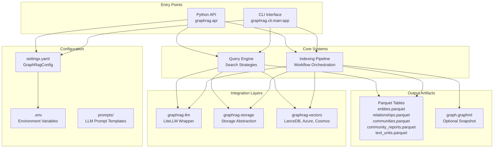
```mermaid
graph TB
    subgraph "Entry Points"
        CLI["CLI Interface<br/>graphrag.cli.main:app"]
        API["Python API<br/>graphrag.api"]
    end
    
    subgraph "Configuration"
        Settings["settings.yaml<br/>GraphRagConfig"]
        Env[".env<br/>Environment Variables"]
        Prompts["prompts/<br/>LLM Prompt Templates"]
    end
    
    subgraph "Core Systems"
        IndexPipeline["Indexing Pipeline<br/>Workflow Orchestration"]
        QueryEngine["Query Engine<br/>Search Strategies"]
    end
    
    subgraph "Integration Layers"
        LLMProvider["graphrag-llm<br/>LiteLLM Wrapper"]
        Storage["graphrag-storage<br/>Storage Abstraction"]
        VectorStore["graphrag-vectors<br/>LanceDB, Azure, Cosmos"]
    end
    
    subgraph "Output Artifacts"
        Parquet["Parquet Tables<br/>entities.parquet<br/>relationships.parquet<br/>communities.parquet<br/>community_reports.parquet<br/>text_units.parquet"]
        GraphML["graph.graphml<br/>Optional Snapshot"]
    end
    
    CLI --> Settings
    API --> Settings
    Settings --> Env
    
    CLI --> IndexPipeline
    CLI --> QueryEngine
    API --> IndexPipeline
    API --> QueryEngine
    
    IndexPipeline --> LLMProvider
    IndexPipeline --> Storage
    IndexPipeline --> VectorStore
    
    QueryEngine --> LLMProvider
    QueryEngine --> Storage
    QueryEngine --> VectorStore
    
    IndexPipeline --> Parquet
    IndexPipeline --> GraphML
    
    QueryEngine --> Parquet
```

**GraphRAG System Component Overview**

GraphRAG is organized into several key layers:

### User Interface Layer
- **CLI**: Command-line interface defined in `graphrag.cli.main:app` [packages/graphrag/pyproject.toml:63-63]() for initialization, indexing, and querying.
- **API**: Python library interface for programmatic integration via `graphrag.api` [breaking-changes.md:8-8]().

### Configuration System
- **settings.yaml**: Main configuration file defining models, storage, workflows, and search parameters [breaking-changes.md:10-10]().
- **.env**: Environment variables for API keys and sensitive configuration.

### Core Pipeline System
- **Indexing Pipeline**: Orchestrates document processing, graph extraction, and community detection.
- **Query Engine**: Provides strategies like Global, Local, and DRIFT search [docs/index.md:44-51]().

### Integration Layers
- **LLM Provider**: Abstraction over models via `graphrag-llm` [packages/graphrag-llm/pyproject.toml:2-2](), utilizing LiteLLM [packages/graphrag-llm/pyproject.toml:39-39]().
- **Storage**: Pluggable backends via `graphrag-storage` [packages/graphrag-storage/pyproject.toml:2-2]().
- **Vector Stores**: Integration via `graphrag-vectors` [packages/graphrag-vectors/pyproject.toml:2-2](), supporting LanceDB, Azure AI Search, and Cosmos DB [packages/graphrag-vectors/pyproject.toml:32-42]().

**Sources:** [README.md:22-36](), [packages/graphrag/pyproject.toml:63-63](), [breaking-changes.md:8-11](), [packages/graphrag-llm/pyproject.toml:39-39]()

## How GraphRAG Works

### Indexing Methods

GraphRAG supports multiple indexing strategies to balance cost and detail:

| Method | Description | Characteristics |
| :--- | :--- | :--- |
| **Standard** | Uses LLM for entity/relationship extraction and summarization. | High fidelity, rich descriptions, higher cost. |
| **FastGraphRAG** | Uses NLP (NLTK/spaCy) for entity extraction and co-occurrence for relationships. | Faster, cheaper, suitable for global summary questions. |

**Sources:** [docs/index/methods.md:5-29]()

### Indexing Workflow


```mermaid
graph LR
    Input["Raw Documents<br/>txt/csv/json"]
    Load["load_input_documents<br/>InputReader"]
    Chunk["create_base_text_units<br/>Text Chunking"]
    Extract["extract_graph<br/>LLM or NLP Extraction"]
    Summarize["summarize_descriptions<br/>LLM Summarization"]
    Cluster["cluster_graph<br/>Leiden Algorithm"]
    Reports["create_community_reports<br/>LLM Summaries"]
    Embed["generate_text_embeddings<br/>Vector Embeddings"]
    Output["Parquet Tables<br/>TableProvider"]
    
    Input --> Load
    Load --> Chunk
    Chunk --> Extract
    Extract --> Summarize
    Summarize --> Cluster
    Cluster --> Reports
    Reports --> Embed
    Embed --> Output
```

**GraphRAG Indexing Pipeline Flow**

The indexing pipeline transforms unstructured documents into a queryable knowledge graph. Key workflows include:
- **Document Loading**: `load_input_documents` handles text, CSV, or JSON [CHANGELOG.md:151-151]().
- **Community Detection**: Uses the Leiden technique for hierarchical clustering [docs/index.md:40-40]().
- **Table Management**: Uses `TableProvider` and `DataReader` for handling Parquet/CSV artifacts [CHANGELOG.md:50-54]().

**Sources:** [docs/index.md:36-42](), [docs/index/methods.md:5-29](), [CHANGELOG.md:50-54]()

### Query Workflow

The query system provides four search strategies:

| Search Method | Use Case | Data Sources |
| :--- | :--- | :--- |
| **Global Search** | Holistic questions about the corpus. | `community_reports.parquet` |
| **Local Search** | Reasoning about specific entities and neighbors. | `entities`, `relationships`, `text_units` |
| **DRIFT Search** | Combines global/local with iterative refinement. | All KG tables |
| **Basic Search** | Standard top-k vector RAG. | `text_units` |

**Sources:** [docs/index.md:44-51](), [docs/index/byog.md:33-50]()

## Package Architecture

GraphRAG is organized as a monorepo using `uv` workspaces [pyproject.toml:53-54]():

- **graphrag**: Main package containing CLI and orchestration [packages/graphrag/pyproject.toml:2-2]().
- **graphrag-llm**: LiteLLM integration and model providers [packages/graphrag-llm/pyproject.toml:2-2]().
- **graphrag-storage**: Storage abstraction (File, Blob, Cosmos) [packages/graphrag-storage/pyproject.toml:2-2]().
- **graphrag-vectors**: Vector store implementations [packages/graphrag-vectors/pyproject.toml:2-2]().
- **graphrag-common**: Shared types and utilities [pyproject.toml:58-58]().
- **graphrag-chunking**, **graphrag-input**, **graphrag-cache**: Specialized processing packages [pyproject.toml:57-61]().

**Sources:** [pyproject.toml:53-63](), [uv.lock:14-24]()

## Getting Started

1.  **Install**: Use `pip install graphrag`.
2.  **Initialize**: Run `graphrag init` to generate `settings.yaml` [pyproject.toml:99-99]().
3.  **Index**: Run `graphrag index` to build the graph [pyproject.toml:97-97]().
4.  **Query**: Run `graphrag query --method [global|local|drift]` [pyproject.toml:100-100]().

**Sources:** [README.md:28-30](), [pyproject.toml:97-101]()

## Versioning and Migration

GraphRAG uses `semversioner` for release management [pyproject.toml:45-45](). Breaking changes are documented, and users are encouraged to run `graphrag init --force` between minor version bumps to ensure configuration compatibility [README.md:53-53]().

**Sources:** [pyproject.toml:112-127](), [breaking-changes.md:1-14]()

---

<<< SECTION: 1.1 Key Concepts [1-1-key-concepts] >>>

# Key Concepts

<details>
<summary>Relevant source files</summary>

The following files were used as context for generating this wiki page:

- [CHANGELOG.md](CHANGELOG.md)
- [README.md](README.md)
- [breaking-changes.md](breaking-changes.md)
- [docs/config/yaml.md](docs/config/yaml.md)
- [docs/index.md](docs/index.md)
- [docs/index/architecture.md](docs/index/architecture.md)
- [docs/index/byog.md](docs/index/byog.md)
- [docs/index/inputs.md](docs/index/inputs.md)
- [docs/index/methods.md](docs/index/methods.md)
- [pyproject.toml](pyproject.toml)

</details>


## Purpose and Scope

This document explains the fundamental concepts that underpin GraphRAG's approach to retrieval-augmented generation. It covers the core data structures (entities, relationships, communities, text units), the distinction between indexing and querying phases, and how GraphRAG differs from traditional RAG systems. For detailed information about system architecture and component interactions, see [System Architecture (1.2)](). For query-specific concepts and methods, see the Query System documentation ([5]()).

---

## GraphRAG vs Traditional RAG

Traditional RAG systems use vector similarity search to retrieve relevant text chunks, then feed those chunks directly to an LLM for answer generation. This approach works well for answering questions about specific facts contained in single documents, but struggles with queries that require synthesis across multiple sources or global understanding of a dataset [docs/index.md:23-31]().

GraphRAG introduces an intermediate knowledge representation layer: a **knowledge graph** extracted from source documents. Instead of retrieving raw text chunks, GraphRAG retrieves structured entities, relationships, and community summaries, enabling more sophisticated reasoning patterns [docs/index.md:13-17]().

### Key Differences

| Aspect | Traditional RAG | GraphRAG |
|--------|----------------|----------|
| **Intermediate Representation** | Vector embeddings of text chunks | Knowledge graph + embeddings |
| **Retrieval Unit** | Text chunks | Entities, relationships, communities, text units |
| **Query Types** | Specific factual questions | Both specific and global synthesis questions |
| **Preprocessing** | Chunking + embedding | LLM-based extraction + graph analysis + embedding |
| **Global Understanding** | Limited to aggregating similar chunks | Hierarchical community summaries |

Sources: [docs/index.md:13-31](), [docs/index/methods.md:5-45](), [README.md:22-26]()

---

## Knowledge Graph Components

GraphRAG constructs a knowledge graph from input documents during the indexing phase. This graph consists of three primary components: entities, relationships, and communities [docs/index.md:36-42]().

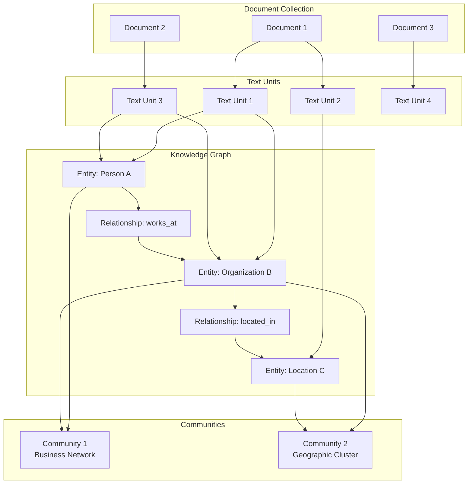
```mermaid
graph TB
    subgraph "Document Collection"
        D1["Document 1"]
        D2["Document 2"]
        D3["Document 3"]
    end
    
    subgraph "Text Units"
        TU1["Text Unit 1"]
        TU2["Text Unit 2"]
        TU3["Text Unit 3"]
        TU4["Text Unit 4"]
    end
    
    subgraph "Knowledge Graph"
        E1["Entity: Person A"]
        E2["Entity: Organization B"]
        E3["Entity: Location C"]
        R1["Relationship: works_at"]
        R2["Relationship: located_in"]
    end
    
    subgraph "Communities"
        C1["Community 1<br/>Business Network"]
        C2["Community 2<br/>Geographic Cluster"]
    end
    
    D1 --> TU1
    D1 --> TU2
    D2 --> TU3
    D3 --> TU4
    
    TU1 --> E1
    TU1 --> E2
    TU2 --> E3
    TU3 --> E1
    TU3 --> E2
    
    E1 --> R1
    R1 --> E2
    E2 --> R2
    R2 --> E3
    
    E1 --> C1
    E2 --> C1
    E2 --> C2
    E3 --> C2
```

**Diagram: From Documents to Knowledge Graph Structure**

Sources: [docs/index/byog.md:5-15](), [docs/index.md:36-42](), [breaking-changes.md:58-65]()

### Entities

**Entities** are the nodes of the knowledge graph, representing real-world objects, people, organizations, locations, concepts, or events extracted from the text [docs/index.md:40](). Each entity has:

- **id**: Unique identifier (UUID in v3+) [breaking-changes.md:61]()
- **title**: The entity name (formerly `name` in v2) [breaking-changes.md:64]()
- **type**: Classification (e.g., PERSON, ORGANIZATION, LOCATION) [docs/index/methods.md:9]()
- **description**: LLM-generated summary combining all mentions across documents [docs/index/methods.md:11]()
- **text_unit_ids**: List of text units where the entity appears [docs/index/byog.md:17]()

In **Standard GraphRAG**, entities are extracted by prompting an LLM to identify named entities from each text unit. The LLM also generates descriptions. When the same entity appears in multiple text units, their descriptions are summarized into a single consolidated description [docs/index/methods.md:7-12]().

In **FastGraphRAG**, entities are noun phrases extracted using NLP libraries (NLTK or spaCy), without LLM-generated descriptions. The source text units serve as the entity context [docs/index/methods.md:18-24]().

**Schema Reference**: [docs/index/byog.md:15-17]()

Sources: [docs/index/methods.md:5-30](), [docs/index/byog.md:15-17](), [breaking-changes.md:58-65]()

### Relationships

**Relationships** are the edges of the knowledge graph, representing connections between entities. Each relationship has:

- **id**: Unique identifier [docs/index/byog.md:21]()
- **source**: Source entity id [docs/index/byog.md:21]()
- **target**: Target entity id [docs/index/byog.md:21]()
- **description**: LLM-generated description of the relationship [docs/index/byog.md:21]()
- **weight**: Importance score (crucial for community detection) [docs/index/byog.md:23]()
- **text_unit_ids**: List of text units containing evidence for the relationship [docs/index/byog.md:21]()

In **Standard GraphRAG**, the LLM is prompted to describe relationships between entity pairs in each text unit. Multiple descriptions of the same relationship are summarized into a consolidated description [docs/index/methods.md:10-12]().

In **FastGraphRAG**, relationships are defined by co-occurrence: if two entities appear in the same text unit, a relationship exists between them. No explicit description is generated [docs/index/methods.md:23]().

**Schema Reference**: [docs/index/byog.md:19-23]()

Sources: [docs/index/methods.md:5-30](), [docs/index/byog.md:19-23]()

### Communities

**Communities** are groups of entities that are densely connected in the graph, detected using the **Leiden algorithm** [docs/index.md:40](). Communities represent thematic clusters in the dataset and form a hierarchical structure [docs/index.md:14]().

Each community has:

- **id**: UUID identifier [breaking-changes.md:61]()
- **level**: Hierarchy level (0 = leaf, higher = more abstract) [docs/index/byog.md:33]()
- **title**: LLM-generated title [docs/index/byog.md:33]()
- **full_content**: Comprehensive summary report [breaking-changes.md:38]()
- **summary**: Shorter version of the summary [docs/index.md:14]()

The hierarchical structure allows GraphRAG to answer questions at multiple levels of abstraction:
- **Leaf communities** (level 0): Specific, detailed topics.
- **Parent communities** (level 1+): Broader themes aggregating multiple sub-communities.

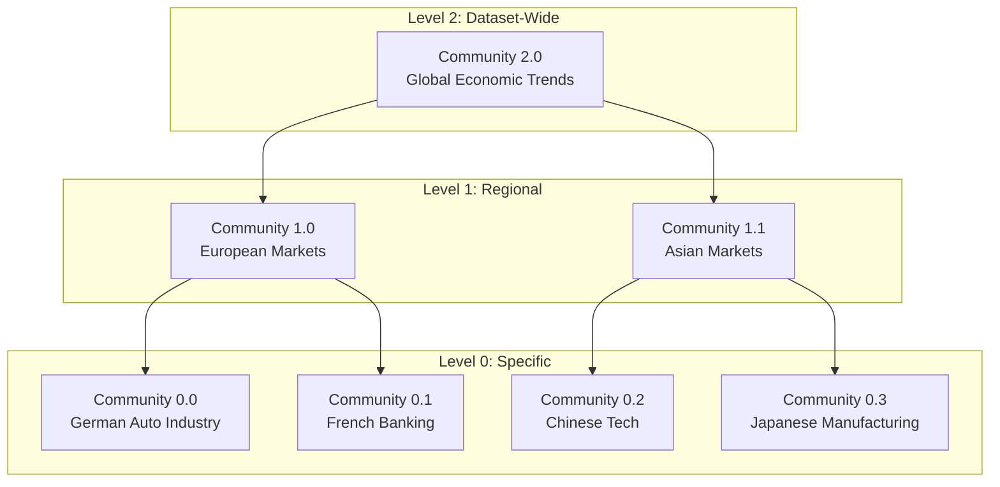
```mermaid
graph TB
    subgraph "Level 2: Dataset-Wide"
        C20["Community 2.0<br/>Global Economic Trends"]
    end
    
    subgraph "Level 1: Regional"
        C10["Community 1.0<br/>European Markets"]
        C11["Community 1.1<br/>Asian Markets"]
    end
    
    subgraph "Level 0: Specific"
        C00["Community 0.0<br/>German Auto Industry"]
        C01["Community 0.1<br/>French Banking"]
        C02["Community 0.2<br/>Chinese Tech"]
        C03["Community 0.3<br/>Japanese Manufacturing"]
    end
    
    C20 --> C10
    C20 --> C11
    C10 --> C00
    C10 --> C01
    C11 --> C02
    C11 --> C03
```

**Diagram: Hierarchical Community Structure**

Sources: [docs/index.md:36-42](), [CHANGELOG.md:158](), [docs/index/byog.md:27-33]()

---

## Text Units and Documents

### Text Units

**Text units** are the fundamental chunks of source text from which the knowledge graph is extracted. They are created during the document loading workflow by splitting documents into manageable pieces that fit within LLM context windows [docs/index/inputs.md:75-77]().

Each text unit contains:

- **id**: Unique identifier [docs/index/inputs.md:11]()
- **text**: The actual text content [docs/index/inputs.md:12]()
- **document_id**: Reference to parent document (singular in v3+, was `document_ids` list in v2) [breaking-changes.md:19]()
- **n_tokens**: Token count [docs/index/inputs.md:103-105]()
- **entity_ids**: Entities extracted from this unit [docs/index/byog.md:53-59]()
- **relationship_ids**: Relationships extracted from this unit [docs/index/byog.md:53-59]()

**Chunking Strategy**:
- Standard GraphRAG typically uses larger chunks (300-600 tokens) [docs/index/methods.md:9-14]().
- FastGraphRAG uses smaller chunks (50-100 tokens) to improve co-occurrence graphs [docs/index/methods.md:33]().

Sources: [docs/index/inputs.md:73-90](), [docs/index/methods.md:33](), [breaking-changes.md:19]()

### Documents

**Documents** represent the original input files. Each document record contains:

- **id**: Unique identifier [docs/index/inputs.md:11]()
- **title**: Document title (filename or extracted) [docs/index/inputs.md:13]()
- **text**: Full document text (formerly `raw_content` in v2) [breaking-changes.md:63]()
- **text_unit_ids**: List of text units created from this document [docs/index/byog.md:59]()

Sources: [docs/index/inputs.md:5-17](), [breaking-changes.md:63](), [CHANGELOG.md:56]()

---

## Indexing vs Querying Phases

GraphRAG operates in two distinct phases:

### Indexing Phase

The **indexing phase** is a batch processing pipeline that transforms raw documents into the knowledge graph artifacts [docs/index/architecture.md:12-28]().

**Key workflows**:
1. `load_input_documents` - Load and parse input files [CHANGELOG.md:53]()
2. `create_base_text_units` - Chunk documents into text units [CHANGELOG.md:43]()
3. `extract_graph` / `extract_graph_nlp` - Extract entities and relationships [CHANGELOG.md:21]()
4. `summarize_descriptions` - Consolidate entity/relationship descriptions [docs/index/methods.md:11-12]()
5. `cluster_graph` - Detect communities using Leiden algorithm [docs/index.md:40]()
6. `create_community_reports` - Generate LLM summaries for each community [CHANGELOG.md:41]()
7. `generate_text_embeddings` - Create vector embeddings [CHANGELOG.md:45]()


```mermaid
graph LR
    Input["Input Documents"] --> Load["load_input_documents"]
    Load --> Chunk["create_base_text_units"]
    Chunk --> Extract["extract_graph<br/>extract_graph_nlp"]
    Extract --> Cluster["cluster_graph"]
    Cluster --> Reports["create_community_reports"]
    Reports --> Embed["generate_text_embeddings"]
    Embed --> Output["Parquet Tables<br/>+ Vector Store"]
    
    style Extract fill:#f9f9f9
    style Cluster fill:#f9f9f9
    style Reports fill:#f9f9f9
```

**Diagram: Simplified Indexing Pipeline Flow**

Sources: [docs/index/architecture.md:12-28](), [CHANGELOG.md:36-47](), [docs/index/byog.md:27-33]()

### Querying Phase

The **querying phase** is a runtime operation that retrieves relevant information from the indexed knowledge graph [docs/index.md:43-51]().

**Query methods**:
- **Global Search**: Uses community reports for dataset-wide synthesis [docs/index.md:47]().
- **Local Search**: Uses entity-centric graph traversal for specific questions [docs/index.md:48]().
- **DRIFT Search**: Hybrid approach combining global and local strategies [docs/index.md:49]().
- **Basic Search**: Traditional vector RAG baseline [docs/index.md:50]().

Sources: [docs/index.md:43-51](), [CHANGELOG.md:100-101]()

---

## Search Methods Overview

### Global Search
**Mechanism**: Uses community reports and a map-reduce pattern to answer questions about the entire corpus [docs/index.md:47](). It is ideal for holistic questions like "What are the main themes?" [docs/index/methods.md:44]().

### Local Search
**Mechanism**: Focuses on specific entities and their immediate graph neighborhood [docs/index.md:48](). It retrieves related entities, relationships, and text units to provide detailed answers for entity-centric queries [docs/index.md:48]().

### DRIFT Search
**Mechanism**: An iterative search method that combines global community information with local graph traversal to refine answers [docs/index.md:49](). It is useful for complex questions requiring both broad context and specific details [CHANGELOG.md:173-174]().

### Basic Search
**Mechanism**: A standard vector similarity search over text units, serving as a baseline for performance comparison [docs/index.md:50]().

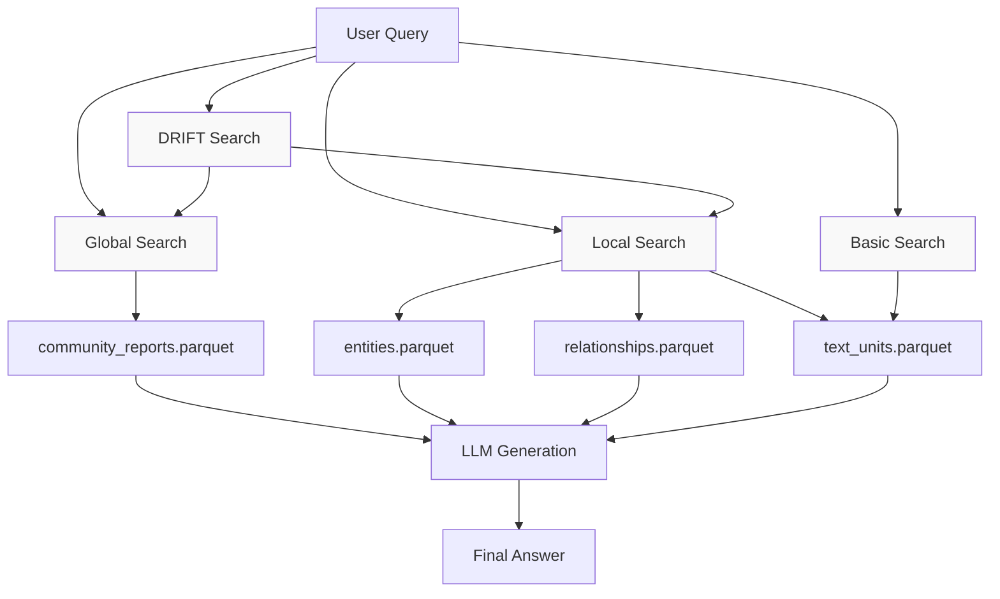
```mermaid
graph TB
    Query["User Query"]
    
    Query --> Global["Global Search"]
    Query --> Local["Local Search"]
    Query --> DRIFT["DRIFT Search"]
    Query --> Basic["Basic Search"]
    
    Global --> CR["community_reports.parquet"]
    
    Local --> E["entities.parquet"]
    Local --> R["relationships.parquet"]
    Local --> TU["text_units.parquet"]
    
    DRIFT --> Global
    DRIFT --> Local
    
    Basic --> TU
    
    CR --> LLM["LLM Generation"]
    E --> LLM
    R --> LLM
    TU --> LLM
    
    LLM --> Answer["Final Answer"]
    
    style Global fill:#f9f9f9
    style Local fill:#f9f9f9
    style DRIFT fill:#f9f9f9
    style Basic fill:#f9f9f9
```

**Diagram: Search Method Data Flow**

Sources: [docs/index.md:43-51](), [CHANGELOG.md:173-191](), [docs/index/methods.md:42-45]()

---

## Vector Stores and Embeddings

GraphRAG leverages vector embeddings for efficient retrieval of text units, entities, and community reports [breaking-changes.md:38]().

### Embedding Strategy
Embeddings are created for:
1. **Text unit text** (`text_unit.text`) [breaking-changes.md:38]().
2. **Entity descriptions** (`entity.description`) [breaking-changes.md:38]().
3. **Community full content** (`community_report.full_content`) [breaking-changes.md:38]().

### Vector Store Abstraction
GraphRAG uses a `VectorStore` interface with multiple implementations:
- **LanceDB**: Local embedded vector database [breaking-changes.md:54]().
- **Azure AI Search**: Cloud-based vector search [breaking-changes.md:54]().
- **Azure Cosmos DB**: NoSQL database with vector search capabilities [CHANGELOG.md:40]().

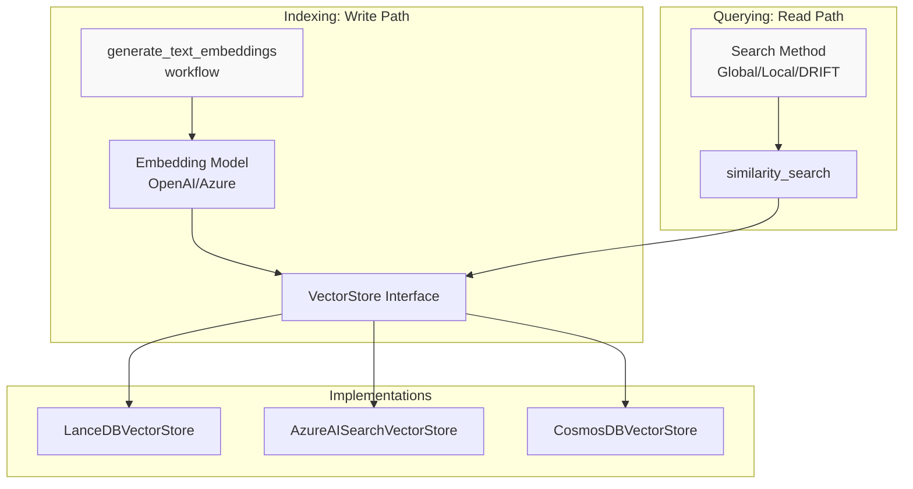
```mermaid
graph TB
    subgraph "Indexing: Write Path"
        Workflow["generate_text_embeddings<br/>workflow"]
        Model["Embedding Model<br/>OpenAI/Azure"]
        VectorStore["VectorStore Interface"]
        
        Workflow --> Model
        Model --> VectorStore
    end
    
    subgraph "Querying: Read Path"
        SearchMethod["Search Method<br/>Global/Local/DRIFT"]
        Similarity["similarity_search"]
        
        SearchMethod --> Similarity
        Similarity --> VectorStore
    end
    
    subgraph "Implementations"
        LanceDB["LanceDBVectorStore"]
        AzureAI["AzureAISearchVectorStore"]
        Cosmos["CosmosDBVectorStore"]
        
        VectorStore --> LanceDB
        VectorStore --> AzureAI
        VectorStore --> Cosmos
    end
    
    style Workflow fill:#f9f9f9
    style SearchMethod fill:#f9f9f9
```

**Diagram: Vector Store Architecture**

Sources: [breaking-changes.md:34-40](), [CHANGELOG.md:36-40](), [docs/index/architecture.md:48]()

---

## Workflow Pipeline Architecture

GraphRAG's indexing pipeline is built on a modular workflow orchestration system [docs/index/architecture.md:10-28]().

### Workflow Concept
A **workflow** is a discrete processing step (e.g., `extract_graph`, `cluster_graph`). Workflows can be registered and retrieved using a factory pattern [docs/index/architecture.md:49]().

### PipelineRunContext
The `PipelineRunContext` provides shared state across workflows, including storage, LLM providers, and caching [CHANGELOG.md:153]().

### LLM Caching
GraphRAG includes a cache layer around LLM interactions to handle network latency and throttling, ensuring the indexer is resilient and acts idempotently [docs/index/architecture.md:30-35]().

Sources: [docs/index/architecture.md:10-53](), [CHANGELOG.md:153](), [breaking-changes.md:31-36]()

---

<<< SECTION: 1.2 System Architecture [1-2-system-architecture] >>>

# System Architecture

<details>
<summary>Relevant source files</summary>

The following files were used as context for generating this wiki page:

- [CHANGELOG.md](CHANGELOG.md)
- [DEVELOPING.md](DEVELOPING.md)
- [docs/config/yaml.md](docs/config/yaml.md)
- [docs/developing.md](docs/developing.md)
- [docs/index/architecture.md](docs/index/architecture.md)
- [docs/index/default_dataflow.md](docs/index/default_dataflow.md)
- [docs/index/inputs.md](docs/index/inputs.md)
- [docs/index/outputs.md](docs/index/outputs.md)
- [packages/graphrag-llm/pyproject.toml](packages/graphrag-llm/pyproject.toml)
- [packages/graphrag-storage/pyproject.toml](packages/graphrag-storage/pyproject.toml)
- [packages/graphrag-vectors/pyproject.toml](packages/graphrag-vectors/pyproject.toml)
- [packages/graphrag/pyproject.toml](packages/graphrag/pyproject.toml)
- [pyproject.toml](pyproject.toml)
- [uv.lock](uv.lock)

</details>


## Purpose and Scope

This document describes the overall architecture of the GraphRAG system, including its monorepo structure, major components, and how they interact. It provides a technical overview of the system's organization and the relationships between packages and subsystems.

GraphRAG is designed as a modular, layered system that enables users to build knowledge graphs from unstructured documents and query them using multiple retrieval strategies. The architecture emphasizes extensibility through a provider-factory pattern, allowing for custom implementations of storage, language models, and vector databases.

**Sources:** [pyproject.toml:1-25](), [CHANGELOG.md:66-81](), [docs/index/architecture.md:1-13]()

---

## High-Level System Organization

GraphRAG is organized as a modular, layered system built on a monorepo architecture. The system transitions from unstructured "Natural Language Space" (documents, text chunks) to "Code Entity Space" (DataFrames, Graph Primitives, Vector Stores).

### System Layers

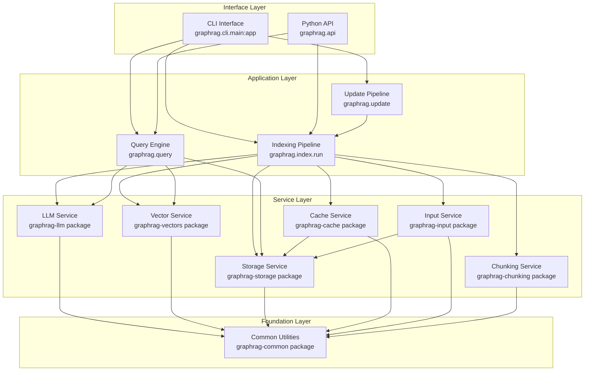
```mermaid
graph TB
    subgraph "Interface Layer"
        CLI["CLI Interface<br/>graphrag.cli.main:app"]
        API["Python API<br/>graphrag.api"]
    end
    
    subgraph "Application Layer"
        IndexPipeline["Indexing Pipeline<br/>graphrag.index.run"]
        QueryEngine["Query Engine<br/>graphrag.query"]
        UpdatePipeline["Update Pipeline<br/>graphrag.update"]
    end
    
    subgraph "Service Layer"
        LLMService["LLM Service<br/>graphrag-llm package"]
        VectorService["Vector Service<br/>graphrag-vectors package"]
        StorageService["Storage Service<br/>graphrag-storage package"]
        CacheService["Cache Service<br/>graphrag-cache package"]
        InputService["Input Service<br/>graphrag-input package"]
        ChunkingService["Chunking Service<br/>graphrag-chunking package"]
    end
    
    subgraph "Foundation Layer"
        Common["Common Utilities<br/>graphrag-common package"]
    end
    
    CLI --> IndexPipeline
    CLI --> QueryEngine
    CLI --> UpdatePipeline
    API --> IndexPipeline
    API --> QueryEngine
    
    IndexPipeline --> LLMService
    IndexPipeline --> VectorService
    IndexPipeline --> StorageService
    IndexPipeline --> CacheService
    IndexPipeline --> InputService
    IndexPipeline --> ChunkingService
    
    QueryEngine --> LLMService
    QueryEngine --> VectorService
    QueryEngine --> StorageService
    
    UpdatePipeline --> IndexPipeline
    
    LLMService --> Common
    VectorService --> Common
    StorageService --> Common
    CacheService --> Common
    InputService --> Common
    ChunkingService --> Common
    
    CacheService --> StorageService
    InputService --> StorageService
```

**Sources:** [pyproject.toml:53-64](), [packages/graphrag/pyproject.toml:34-60](), [packages/graphrag/pyproject.toml:62-63]()

---

## Monorepo Package Structure

The repository uses `uv` workspaces to manage eight distinct packages. The main `graphrag` package orchestrates the high-level workflows, while specialized packages handle specific infrastructure concerns.

### Package Dependency Graph

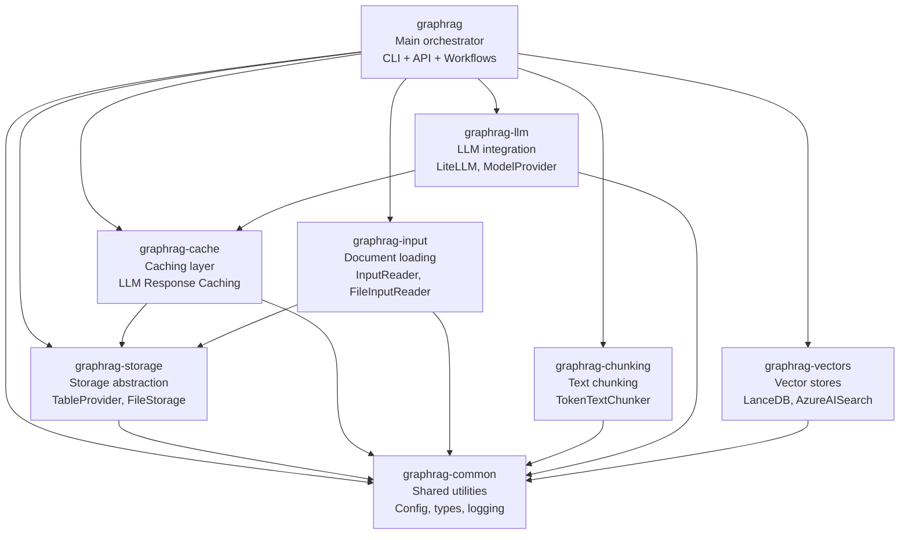
```mermaid
graph TB
    graphrag["graphrag<br/>Main orchestrator<br/>CLI + API + Workflows"]
    common["graphrag-common<br/>Shared utilities<br/>Config, types, logging"]
    storage["graphrag-storage<br/>Storage abstraction<br/>TableProvider, FileStorage"]
    cache["graphrag-cache<br/>Caching layer<br/>LLM Response Caching"]
    input["graphrag-input<br/>Document loading<br/>InputReader, FileInputReader"]
    chunking["graphrag-chunking<br/>Text chunking<br/>TokenTextChunker"]
    llm["graphrag-llm<br/>LLM integration<br/>LiteLLM, ModelProvider"]
    vectors["graphrag-vectors<br/>Vector stores<br/>LanceDB, AzureAISearch"]
    
    graphrag --> common
    graphrag --> storage
    graphrag --> cache
    graphrag --> input
    graphrag --> chunking
    graphrag --> llm
    graphrag --> vectors
    
    storage --> common
    cache --> common
    cache --> storage
    input --> common
    input --> storage
    chunking --> common
    llm --> common
    llm --> cache
    vectors --> common
```

### Package Responsibilities

| Package | Purpose | Key Code Entities |
|---------|---------|-------------|
| `graphrag` | Main entry point and workflow runner | `PipelineRunContext`, `GraphRagConfig` |
| `graphrag-common` | Foundation types and utilities | `Logger`, `read_dotenv` |
| `graphrag-storage` | Data persistence abstraction | `TableProvider`, `FileStorage`, `BlobStorage` |
| `graphrag-cache` | LLM interaction persistence | `Cache`, `JsonCache` |
| `graphrag-input` | Source data ingestion | `InputReader`, `FileInputReader` |
| `graphrag-chunking` | Document fragmentation | `TextChunker`, `TokenTextChunker` |
| `graphrag-llm` | Language model communication | `ModelProvider`, `LiteLLMProvider` |
| `graphrag-vectors` | Vector search and storage | `VectorStore`, `LanceDBVectorStore` |

**Sources:** [pyproject.toml:53-64](), [packages/graphrag/pyproject.toml:34-60](), [packages/graphrag-llm/pyproject.toml:34-43](), [packages/graphrag-storage/pyproject.toml:32-40](), [packages/graphrag-vectors/pyproject.toml:32-42]()

---

## Core Architectural Patterns

### Provider-Factory Pattern
GraphRAG uses a factory design pattern to enable deep customization. This allows users to register their own implementations of core components like storage backends or LLM providers.

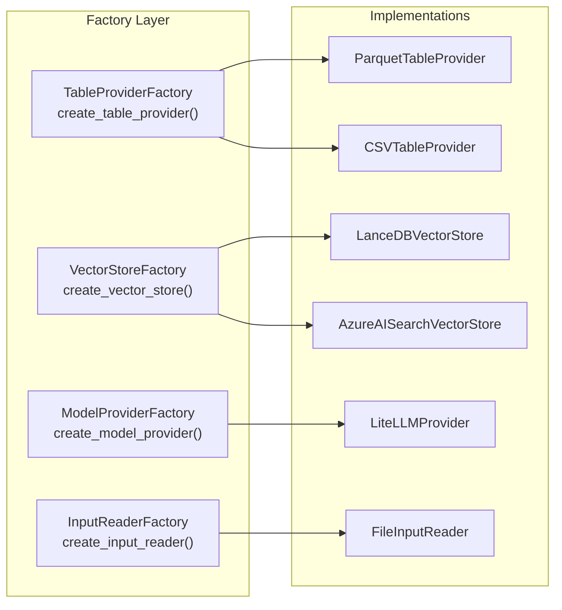
```mermaid
graph LR
    subgraph "Factory Layer"
        StorageFactory["TableProviderFactory<br/>create_table_provider()"]
        VectorFactory["VectorStoreFactory<br/>create_vector_store()"]
        ModelFactory["ModelProviderFactory<br/>create_model_provider()"]
        InputFactory["InputReaderFactory<br/>create_input_reader()"]
    end
    
    subgraph "Implementations"
        Parquet["ParquetTableProvider"]
        CSV["CSVTableProvider"]
        LanceDB["LanceDBVectorStore"]
        AzureAI["AzureAISearchVectorStore"]
        LiteLLM["LiteLLMProvider"]
        FileIn["FileInputReader"]
    end
    
    StorageFactory --> Parquet
    StorageFactory --> CSV
    VectorFactory --> LanceDB
    VectorFactory --> AzureAI
    ModelFactory --> LiteLLM
    InputFactory --> FileIn
```

**Sources:** [docs/index/architecture.md:37-53](), [CHANGELOG.md:50-54]()

### Knowledge Model Abstraction
The system operates on a standardized `GraphRAG Knowledge Model`. This model abstracts the underlying storage format (Parquet/CSV) into high-level graph primitives.

| Entity Type | Code Representation | Description |
|-------------|---------------------|-------------|
| `Document` | `documents` DataFrame | Original input source (file or row). |
| `TextUnit` | `text_units` DataFrame | Chunks of text used for extraction and search. |
| `Entity` | `entities` DataFrame | Extracted nodes (people, places, etc.). |
| `Relationship` | `relationships` DataFrame | Edges connecting entities. |
| `Community` | `communities` DataFrame | Clusters of entities (Leiden algorithm). |
| `Community Report` | `community_reports` DataFrame | LLM-generated summaries of clusters. |

**Sources:** [docs/index/default_dataflow.md:3-14](), [docs/index/inputs.md:7-16]()

---

## Indexing Pipeline Architecture

The indexing pipeline is a sequence of workflows that transform raw data into the knowledge model. It supports both LLM-based extraction and NLP-based extraction (FastGraphRAG).

### Indexing Workflow Chain

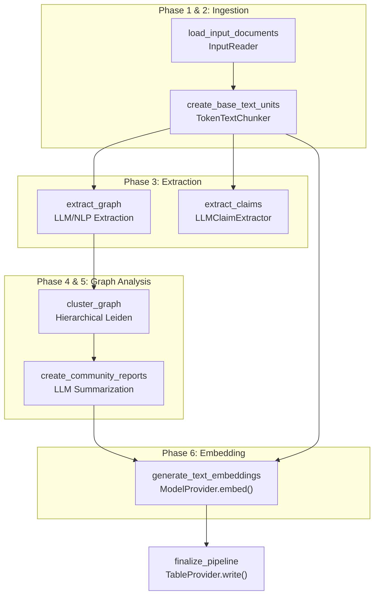
```mermaid
graph TD
    subgraph "Phase 1 & 2: Ingestion"
        Load["load_input_documents<br/>InputReader"] --> Chunk["create_base_text_units<br/>TokenTextChunker"]
    end
    
    subgraph "Phase 3: Extraction"
        Chunk --> Extract["extract_graph<br/>LLM/NLP Extraction"]
        Chunk --> Claims["extract_claims<br/>LLMClaimExtractor"]
    end
    
    subgraph "Phase 4 & 5: Graph Analysis"
        Extract --> Cluster["cluster_graph<br/>Hierarchical Leiden"]
        Cluster --> Reports["create_community_reports<br/>LLM Summarization"]
    end
    
    subgraph "Phase 6: Embedding"
        Reports --> Embed["generate_text_embeddings<br/>ModelProvider.embed()"]
        Chunk --> Embed
    end
    
    Embed --> Finalize["finalize_pipeline<br/>TableProvider.write()"]
```

**Sources:** [docs/index/architecture.md:14-28](), [docs/index/default_dataflow.md:19-52](), [CHANGELOG.md:33-46]()

---

## Query System Architecture

The query system provides multiple retrieval strategies, each utilizing different parts of the Knowledge Model.

### Search Strategy Comparison

| Strategy | Code Entry Point | Data Source | Logic |
|----------|------------------|-------------|-------|
| **Global Search** | `graphrag.query.global_search` | `community_reports` | Map-reduce over community summaries. |
| **Local Search** | `graphrag.query.local_search` | `entities`, `relationships` | Traverses the graph neighbors of detected entities. |
| **DRIFT Search** | `graphrag.query.drift_search` | Hybrid | Iterative refinement across global and local contexts. |
| **Basic Search** | `graphrag.query.basic_search` | `text_units` | Standard vector RAG on text chunks. |

**Sources:** [CHANGELOG.md:125-130](), [CHANGELOG.md:188-191](), [docs/developing.md:53-58]()

---

## Configuration and Environment

The system is configured via a hierarchical model that merges YAML/JSON settings with environment variables.

### Configuration Flow
1. **Load Environment**: `graphrag-common` reads `.env` files.
2. **Parse YAML**: `settings.yaml` is parsed, supporting `${VAR}` token replacement.
3. **Hydrate Config**: `GraphRagConfig` (Pydantic) validates and provides defaults.
4. **Initialize Components**: Factories use the config to instantiate `ModelProvider`, `Storage`, and `VectorStore`.

**Sources:** [docs/config/yaml.md:1-16](), [packages/graphrag/pyproject.toml:53-60]()

---

<<< SECTION: 1.3 Installation and Dependencies [1-3-installation-and-dependencies] >>>

# Installation and Dependencies

<details>
<summary>Relevant source files</summary>

The following files were used as context for generating this wiki page:

- [docs/config/models.md](docs/config/models.md)
- [docs/get_started.md](docs/get_started.md)
- [mkdocs.yaml](mkdocs.yaml)
- [packages/graphrag-cache/pyproject.toml](packages/graphrag-cache/pyproject.toml)
- [packages/graphrag-chunking/pyproject.toml](packages/graphrag-chunking/pyproject.toml)
- [packages/graphrag-common/pyproject.toml](packages/graphrag-common/pyproject.toml)
- [packages/graphrag-input/pyproject.toml](packages/graphrag-input/pyproject.toml)
- [packages/graphrag-llm/pyproject.toml](packages/graphrag-llm/pyproject.toml)
- [packages/graphrag-storage/pyproject.toml](packages/graphrag-storage/pyproject.toml)
- [packages/graphrag-vectors/pyproject.toml](packages/graphrag-vectors/pyproject.toml)
- [packages/graphrag/pyproject.toml](packages/graphrag/pyproject.toml)
- [uv.lock](uv.lock)

</details>


This page documents the prerequisites, installation procedures, and dependency structure for GraphRAG. It covers both end-user installation via PyPI and development setup using the `uv` package manager.

---

## Prerequisites

### Python Version Requirements

GraphRAG requires Python 3.11, 3.12, or 3.13. This requirement is enforced across all packages in the monorepo via `pyproject.toml` configurations.

| Package | Python Requirement | Location |
|---------|-------------------|----------|
| `graphrag` | `>=3.11, <3.14` | [packages/graphrag/pyproject.toml:26-26]() |
| `graphrag-llm` | `>=3.10, <3.14` | [packages/graphrag-llm/pyproject.toml:26-26]() |
| `graphrag-common` | `>=3.11, <3.14` | [packages/graphrag-common/pyproject.toml:25-25]() |
| `graphrag-storage` | `>=3.11, <3.14` | [packages/graphrag-storage/pyproject.toml:25-25]() |

**Sources:** [uv.lock:3-3](), [packages/graphrag/pyproject.toml:26-26](), [packages/graphrag-llm/pyproject.toml:26-26](), [docs/get_started.md:7-7]()

### UV Package Manager

For development and monorepo management, GraphRAG uses [uv](https://docs.astral.sh/uv/). It handles workspace synchronization, dependency resolution, and virtual environment management.

**Installation:**
```bash
# Follow instructions at https://docs.astral.sh/uv/
curl -LsSf https://astral.sh/uv/install.sh | sh
```

**Sources:** [uv.lock:1-11]()

---

## Installation Methods

### End-User Installation (PyPI)

Standard users should install the main `graphrag` package from PyPI. This will automatically pull in all necessary sub-packages (llm, storage, vectors, etc.) at compatible versions.

```bash
# Create and activate a virtual environment
python -m venv .venv
source .venv/bin/activate # Unix/MacOS
# .venv\Scripts\activate # Windows

# Install via pip
pip install graphrag
```

**Sources:** [docs/get_started.md:15-40](), [packages/graphrag/pyproject.toml:34-60]()

### Development Installation

For contributors working within the monorepo, the following workflow sets up the entire workspace.

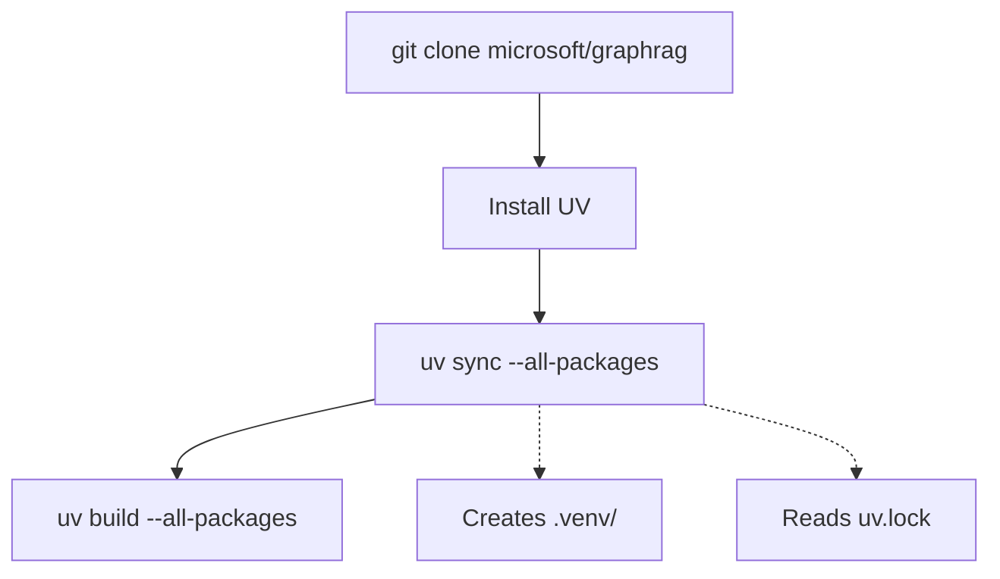
```mermaid
graph TB
    Clone["git clone microsoft/graphrag"]
    InstallUV["Install UV"]
    SyncDeps["uv sync --all-packages"]
    Build["uv build --all-packages"]
    
    Clone --> InstallUV
    InstallUV --> SyncDeps
    SyncDeps --> Build
    
    SyncDeps -.-> VirtualEnv["Creates .venv/"]
    SyncDeps -.-> LockFile["Reads uv.lock"]
```

**Figure 1: Development Setup Workflow**

**Commands:**
```bash
git clone https://github.com/microsoft/graphrag.git
cd graphrag
uv sync --all-packages
```

The workspace is defined in the root manifest, ensuring all packages are linked correctly during development.

**Sources:** [uv.lock:13-24](), [docs/get_started.md:19-23]()

---

## Workspace Package Dependencies

GraphRAG is structured as a monorepo with specialized packages. The main `graphrag` package acts as the primary entry point and CLI provider, depending on all other internal packages.

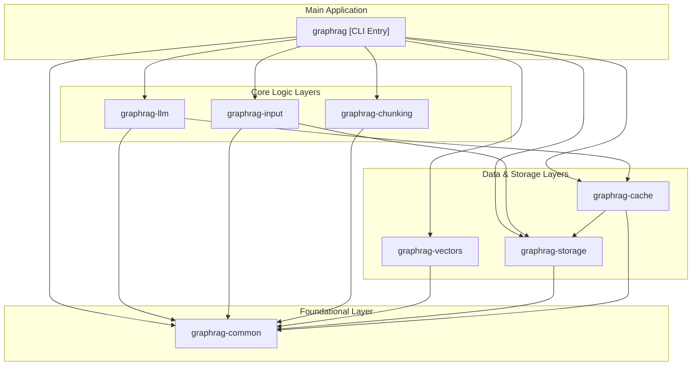
```mermaid
graph TD
    subgraph "Main Application"
        Main["graphrag [CLI Entry]"]
    end

    subgraph "Core Logic Layers"
        LLM["graphrag-llm"]
        Input["graphrag-input"]
        Chunking["graphrag-chunking"]
    end

    subgraph "Data & Storage Layers"
        Vectors["graphrag-vectors"]
        Storage["graphrag-storage"]
        Cache["graphrag-cache"]
    end

    subgraph "Foundational Layer"
        Common["graphrag-common"]
    end

    Main --> LLM
    Main --> Input
    Main --> Chunking
    Main --> Vectors
    Main --> Storage
    Main --> Cache
    Main --> Common

    LLM --> Cache
    LLM --> Common
    Input --> Storage
    Input --> Common
    Chunking --> Common
    Vectors --> Common
    Storage --> Common
    Cache --> Storage
    Cache --> Common
```

**Figure 2: Monorepo Package Dependency Hierarchy**

### Internal Package Versioning
All workspace packages are currently pinned to version `3.0.9` to ensure strict compatibility across the monorepo.

**Sources:** [packages/graphrag/pyproject.toml:39-45](), [packages/graphrag-llm/pyproject.toml:36-37](), [packages/graphrag-input/pyproject.toml:33-34](), [packages/graphrag-storage/pyproject.toml:37-37]()

---

## Core External Dependencies

### Language Model Integration (`graphrag-llm`)

The LLM package abstracts interactions with various providers, primarily through **LiteLLM**.

| Dependency | Version | Role |
|------------|---------|------|
| `litellm` | `1.82.6` | Multi-provider LLM abstraction |
| `azure-identity` | `~=1.25` | Managed identity support for Azure OpenAI |
| `jinja2` | `~=3.1` | Prompt templating engine |
| `pydantic` | `~=2.10` | Data validation and settings models |

**Sources:** [packages/graphrag-llm/pyproject.toml:34-43](), [docs/config/models.md:9-11]()

### Data Processing and NLP (`graphrag`)

The main package handles graph construction, community detection, and complex NLP tasks.

| Dependency | Version | Purpose |
|------------|---------|---------|
| `networkx` | `~=3.4` | Graph data structures and algorithms |
| `graspologic-native` | `~=1.2` | Hierarchical clustering (Leiden) |
| `spacy` | `~=3.8` | NLP pipeline for entity extraction |
| `nltk` | `~=3.9` | Text tokenization and preprocessing |
| `pandas` | `~=2.3` | Dataframe manipulation for pipeline steps |
| `pyarrow` | `~=22.0` | Parquet file support for indexing outputs |

**Sources:** [packages/graphrag/pyproject.toml:46-59]()

### Storage and Vector Backends

GraphRAG supports multiple storage backends for both raw data and vector embeddings.

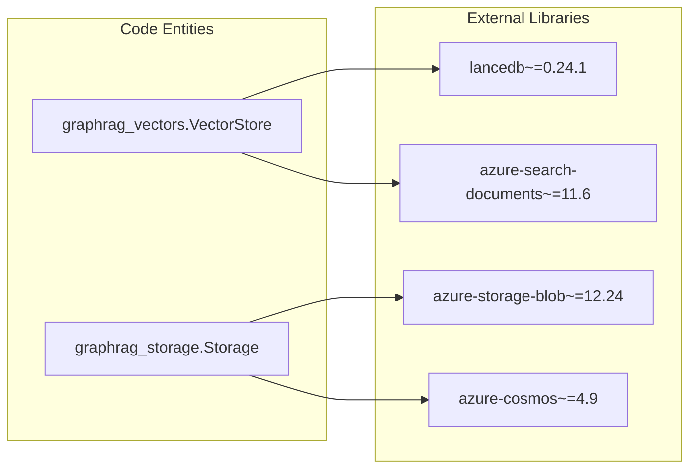
```mermaid
graph LR
    subgraph "Code Entities"
        VS["graphrag_vectors.VectorStore"]
        ST["graphrag_storage.Storage"]
    end

    subgraph "External Libraries"
        LanceDB["lancedb~=0.24.1"]
        AzureSearch["azure-search-documents~=11.6"]
        AzureBlob["azure-storage-blob~=12.24"]
        AzureCosmos["azure-cosmos~=4.9"]
    end

    VS --> LanceDB
    VS --> AzureSearch
    ST --> AzureBlob
    ST --> AzureCosmos
```

**Figure 3: Mapping Storage Code Entities to External Dependencies**

**Sources:** [packages/graphrag-vectors/pyproject.toml:32-42](), [packages/graphrag-storage/pyproject.toml:32-40]()

---

## Initialization and Workspace Setup

When a user runs `graphrag init`, the system prepares the local environment with necessary configuration files.

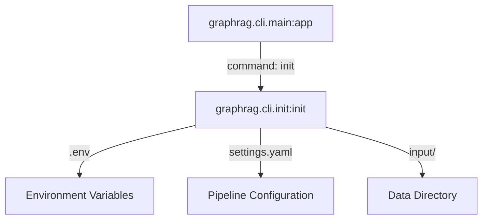
```mermaid
graph TD
    CLI["graphrag.cli.main:app"]
    Init["graphrag.cli.init:init"]
    
    CLI -->|"command: init"| Init
    Init -->|".env"| ENV["Environment Variables"]
    Init -->|"settings.yaml"| YAML["Pipeline Configuration"]
    Init -->|"input/"| DIR["Data Directory"]
```

**Figure 4: Initialization Data Flow**

**Key Artifacts Created:**
- `.env`: Stores sensitive keys like `GRAPHRAG_API_KEY`.
- `settings.yaml`: Defines model providers, chunking sizes, and storage paths.
- `input/`: Default directory for source text files (e.g., `.txt`, `.md`).

**Sources:** [docs/get_started.md:42-58](), [packages/graphrag/pyproject.toml:63-63]()

---

## Troubleshooting Installation

### Python Version Mismatch
If using a version outside the `3.11-3.13` range, installation may fail or lead to runtime errors in packages like `numpy` or `pandas` which have strict version constraints in the lockfile.

### Missing LLM Resources
GraphRAG is resource-intensive. It is recommended to verify connectivity to LLM providers immediately after installation using the `query` command with a small sample.

**Sources:** [docs/get_started.md:3-3](), [uv.lock:3-11]()

---

<<< SECTION: 1.4 Getting Started [1-4-getting-started] >>>

# Getting Started

<details>
<summary>Relevant source files</summary>

The following files were used as context for generating this wiki page:

- [README.md](README.md)
- [breaking-changes.md](breaking-changes.md)
- [docs/config/models.md](docs/config/models.md)
- [docs/get_started.md](docs/get_started.md)
- [docs/index.md](docs/index.md)
- [docs/index/byog.md](docs/index/byog.md)
- [docs/index/methods.md](docs/index/methods.md)
- [docs/index/overview.md](docs/index/overview.md)
- [docs/prompt_tuning/manual_prompt_tuning.md](docs/prompt_tuning/manual_prompt_tuning.md)
- [docs/query/drift_search.md](docs/query/drift_search.md)
- [docs/query/global_search.md](docs/query/global_search.md)
- [docs/query/local_search.md](docs/query/local_search.md)
- [docs/query/question_generation.md](docs/query/question_generation.md)
- [mkdocs.yaml](mkdocs.yaml)

</details>


This page provides a quick start guide for installing and running GraphRAG for the first time. It covers the essential steps from installation through indexing your first dataset and querying the resulting knowledge graph. This guide uses command-line interface (CLI) commands and assumes basic familiarity with terminal operations.

For detailed configuration options, see **3. Configuration System**. For in-depth explanation of the indexing process, see **4. Indexing Pipeline**. For comprehensive query documentation, see **5. Query System**.

---

## Prerequisites

GraphRAG requires Python 3.10, 3.11, or 3.12 [docs/get_started.md:5-7](). Verify your Python version before proceeding:

```bash
python --version
```

You will also need an API key for a supported language model provider. GraphRAG uses [LiteLLM](https://docs.litellm.ai/) and supports 100+ model providers including OpenAI, Azure OpenAI, Anthropic, and Google Gemini [docs/config/models.md:9-10]().

**Sources:** [docs/get_started.md:5-9](), [docs/config/models.md:9-10]()

---

## Quick Start Workflow

The following diagram shows the complete workflow from installation to query:

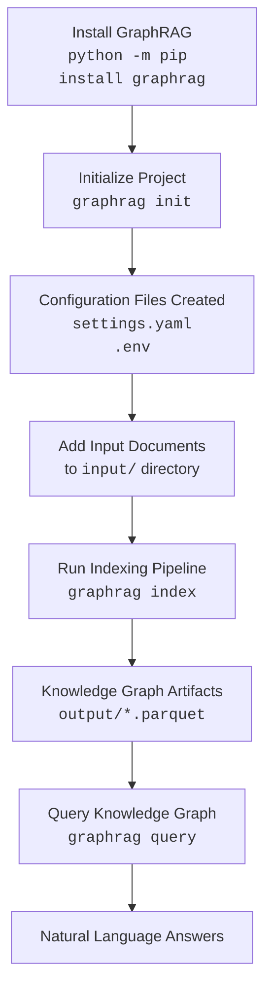
```mermaid
graph TB
    Install["Install GraphRAG<br/><code>python -m pip install graphrag</code>"]
    Init["Initialize Project<br/><code>graphrag init</code>"]
    ConfigFiles["Configuration Files Created<br/><code>settings.yaml</code><br/><code>.env</code>"]
    AddDocs["Add Input Documents<br/>to <code>input/</code> directory"]
    Index["Run Indexing Pipeline<br/><code>graphrag index</code>"]
    Artifacts["Knowledge Graph Artifacts<br/><code>output/*.parquet</code>"]
    Query["Query Knowledge Graph<br/><code>graphrag query</code>"]
    Results["Natural Language Answers"]
    
    Install --> Init
    Init --> ConfigFiles
    ConfigFiles --> AddDocs
    AddDocs --> Index
    Index --> Artifacts
    Artifacts --> Query
    Query --> Results
```

**Sources:** [docs/get_started.md:13-125]()

---

## Installation

### Create Project Directory

Create a dedicated directory for your GraphRAG project and a Python virtual environment:

```bash
mkdir graphrag_quickstart
cd graphrag_quickstart
python -m venv .venv
```

### Activate Virtual Environment

**Unix/MacOS:**
```bash
source .venv/bin/activate
```

**Windows:**
```bash
.venv\Scripts\activate
```

### Install GraphRAG Package

```bash
python -m pip install graphrag
```

This installs the `graphrag` package from PyPI, which includes all necessary dependencies and the CLI interface [docs/get_started.md:36-40]().

**Sources:** [docs/get_started.md:13-40]()

---

## Project Initialization

### Initialize Command

Run the initialization command to create the project structure [docs/get_started.md:42-48]():

```bash
graphrag init
```

The CLI will prompt you to specify default completion and embedding models. The command creates the following files and directories [docs/get_started.md:52-57]():

| File/Directory | Purpose |
|---------------|---------|
| `settings.yaml` | Main configuration file for pipeline settings |
| `.env` | Environment variables (API keys, etc.) |
| `input/` | Directory for source documents to be indexed |

**Sources:** [docs/get_started.md:42-57]()

### Configuration Files Structure

The following diagram maps configuration concepts to the code entities and files that manage them:

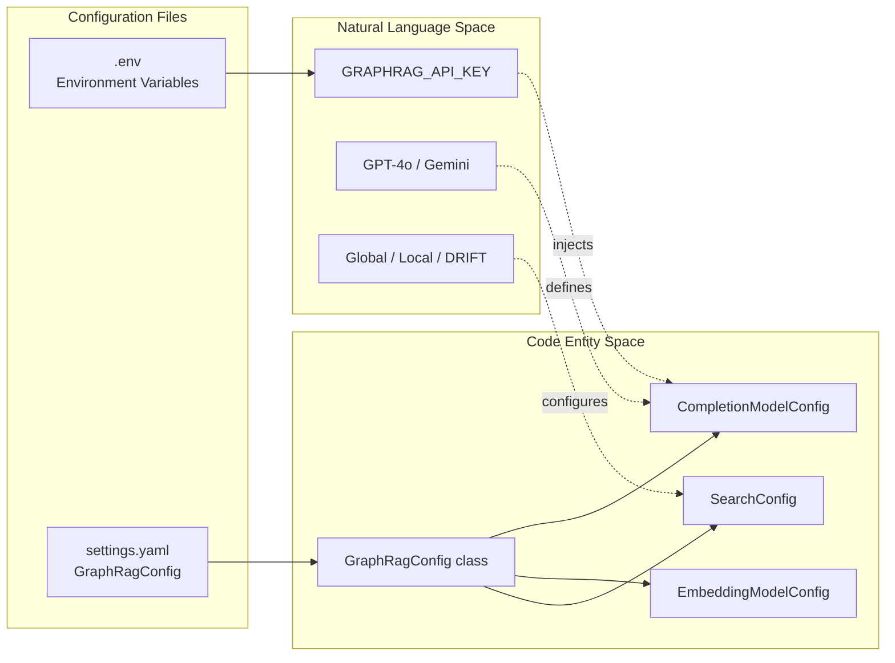
```mermaid
graph LR
    subgraph "Configuration Files"
        EnvFile[".env<br/>Environment Variables"]
        SettingsFile["settings.yaml<br/>GraphRagConfig"]
    end
    
    subgraph "Code Entity Space"
        ConfigModel["GraphRagConfig class"]
        LLMConfig["CompletionModelConfig"]
        EmbedConfig["EmbeddingModelConfig"]
        SearchConfig["SearchConfig"]
    end
    
    subgraph "Natural Language Space"
        APIKey["GRAPHRAG_API_KEY"]
        ModelName["GPT-4o / Gemini"]
        SearchMethod["Global / Local / DRIFT"]
    end
    
    EnvFile --> APIKey
    SettingsFile --> ConfigModel
    ConfigModel --> LLMConfig
    ConfigModel --> EmbedConfig
    ConfigModel --> SearchConfig
    
    APIKey -.injects.-> LLMConfig
    ModelName -.defines.-> LLMConfig
    SearchMethod -.configures.-> SearchConfig
```

**Sources:** [docs/get_started.md:52-57](), [docs/config/models.md:14-27]()

### Configure API Key

Edit the `.env` file and replace `<API_KEY>` with your actual API key [docs/get_started.md:55-56]():

**For OpenAI:**
```bash
GRAPHRAG_API_KEY=sk-...
```

**For Azure OpenAI:**

Azure OpenAI users should update `settings.yaml` with deployment details [docs/get_started.md:73-84]():

```yaml
type: chat
model_provider: azure
model: gpt-4o
deployment_name: <AZURE_DEPLOYMENT_NAME>
api_base: https://<instance>.openai.azure.com
api_version: 2024-02-15-preview
```

**Sources:** [docs/get_started.md:55-84]()

---

## Adding Input Documents

Place your source documents in the `input/` directory [docs/get_started.md:54](). 

### Example: Download Sample Data

```bash
curl https://www.gutenberg.org/cache/epub/24022/pg24022.txt -o ./input/book.txt
```

This downloads "A Christmas Carol" as a sample dataset for testing [docs/get_started.md:63-64]().

**Sources:** [docs/get_started.md:54-65]()

---

## Running the Indexing Pipeline

### Execute Index Command

```bash
graphrag index
```

This command executes the complete indexing pipeline [docs/get_started.md:100-101](). The pipeline transforms raw text into a structured knowledge graph through several workflows [docs/index/overview.md:5-10]().

### Indexing Dataflow

The diagram below bridges the indexing stages to the internal workflow names used in the codebase:

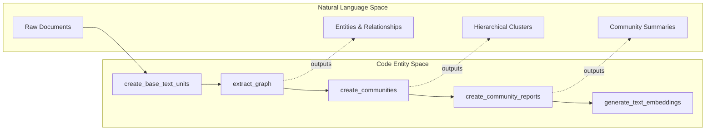
```mermaid
graph LR
    subgraph "Natural Language Space"
        RawText["Raw Documents"]
        Entities["Entities & Relationships"]
        Communities["Hierarchical Clusters"]
        Reports["Community Summaries"]
    end

    subgraph "Code Entity Space"
        Workflow1["create_base_text_units"]
        Workflow2["extract_graph"]
        Workflow3["create_communities"]
        Workflow4["create_community_reports"]
        Workflow5["generate_text_embeddings"]
    end

    RawText --> Workflow1
    Workflow1 --> Workflow2
    Workflow2 --> Workflow3
    Workflow3 --> Workflow4
    Workflow4 --> Workflow5
    
    Workflow2 -.outputs.-> Entities
    Workflow3 -.outputs.-> Communities
    Workflow4 -.outputs.-> Reports
```

**Sources:** [docs/index/overview.md:5-10](), [docs/index/byog.md:29-57]()

### Output Artifacts

Once complete, the `./output` folder contains a series of Parquet files [docs/get_started.md:106](). These tables (e.g., `entities.parquet`, `relationships.parquet`) serve as the foundation for the query engine [docs/index/byog.md:7-9]().

**Sources:** [docs/get_started.md:106](), [docs/index/byog.md:7-9]()

---

## Querying the Knowledge Graph

After indexing, use the `graphrag query` command to extract insights.

### Query Methods

GraphRAG provides different search strategies via the `--method` flag [docs/get_started.md:112-123]():

| Method | CLI Flag | Best For |
|--------|----------|----------|
| **Global Search** | (default) | Holistic, high-level themes across the entire dataset [docs/query/global_search.md:5-7]() |
| **Local Search** | `--method local` | Specific questions about particular characters or entities [docs/query/local_search.md:5]() |
| **DRIFT Search** | `--method drift` | Complex queries requiring both global context and local detail [docs/query/drift_search.md:7-8]() |

### Example Queries

**Global Search (holistic theme extraction):**
```bash
graphrag query "What are the top themes in this story?"
```

**Local Search (entity-centric reasoning):**
```bash
graphrag query \
"Who is Scrooge and what are his main relationships?" \
--method local
```

**Sources:** [docs/get_started.md:112-123](), [docs/query/global_search.md:5-7](), [docs/query/local_search.md:5](), [docs/query/drift_search.md:7-8]()

---

## Next Steps

- **Prompt Tuning:** Standard prompts may not fit every dataset. Use `graphrag prompt-tune` to optimize for your data [README.md:44-47]().
- **Custom Models:** Configure non-OpenAI models using the `model_provider` setting in `settings.yaml` [docs/config/models.md:11-27]().
- **Incremental Updates:** Use the update command to add new data to an existing index [README.md:53]().

**Sources:** [README.md:44-53](), [docs/config/models.md:11-27]()

---

<<< SECTION: 2 Monorepo Structure and Packages [2-monorepo-structure-and-packages] >>>

# Monorepo Structure and Packages

<details>
<summary>Relevant source files</summary>

The following files were used as context for generating this wiki page:

- [CHANGELOG.md](CHANGELOG.md)
- [packages/graphrag-cache/pyproject.toml](packages/graphrag-cache/pyproject.toml)
- [packages/graphrag-chunking/pyproject.toml](packages/graphrag-chunking/pyproject.toml)
- [packages/graphrag-common/pyproject.toml](packages/graphrag-common/pyproject.toml)
- [packages/graphrag-input/pyproject.toml](packages/graphrag-input/pyproject.toml)
- [packages/graphrag-llm/pyproject.toml](packages/graphrag-llm/pyproject.toml)
- [packages/graphrag-storage/pyproject.toml](packages/graphrag-storage/pyproject.toml)
- [packages/graphrag-vectors/pyproject.toml](packages/graphrag-vectors/pyproject.toml)
- [packages/graphrag/pyproject.toml](packages/graphrag/pyproject.toml)
- [pyproject.toml](pyproject.toml)
- [uv.lock](uv.lock)

</details>


This document describes the GraphRAG monorepo organization, including workspace configuration, the eight specialized packages, their dependency hierarchy, and version management. It covers the technical structure managed by the [uv](https://github.com/astral-sh/uv) package manager and the build system.

For information about development workflows and CI/CD, see [Development Guide](#12). For configuration management, see [Configuration System](#3).

---

## Workspace Organization

GraphRAG uses a monorepo structure managed by UV, with a root workspace that coordinates eight specialized packages. The workspace is defined in [pyproject.toml:53-54]() using UV's workspace members feature.

### Root Workspace Configuration

```
graphrag-monorepo/
├── pyproject.toml              # Root workspace definition
├── packages/
│   ├── graphrag/               # Main package (CLI, Indexing, Query)
│   ├── graphrag-llm/           # LLM integration (LiteLLM)
│   ├── graphrag-vectors/       # Vector stores (LanceDB, Azure AI Search)
│   ├── graphrag-storage/       # Storage backends (Blob, Cosmos, File)
│   ├── graphrag-cache/         # Caching layer
│   ├── graphrag-input/         # Document loading (MarkItDown)
│   ├── graphrag-chunking/      # Text segmentation
│   └── graphrag-common/        # Shared utilities
├── tests/                      # Unit, integration, and smoke tests
├── examples_notebooks/         # Usage examples
└── uv.lock                     # Unified lockfile
```

The root workspace is marked as non-publishable with `package = false` at [pyproject.toml:51]() and declares workspace members at [pyproject.toml:54]() with `members = ["packages/*"]`. All packages use workspace references defined at [pyproject.toml:56-63]() using `{ workspace = true }` syntax.

**Sources**: [pyproject.toml:1-107](), [uv.lock:14-24]()

---

## Package Dependency Architecture

The monorepo follows a strict layered architecture where dependencies flow upward only, preventing circular dependencies.

### Dependency Layering Diagram

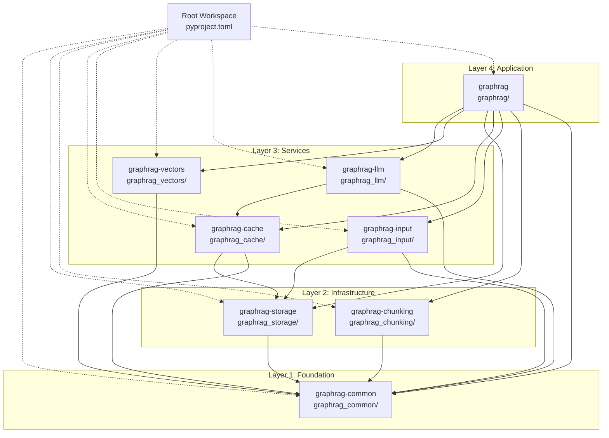
```mermaid
graph TD
    Root["Root Workspace<br/>pyproject.toml"]
    
    subgraph Layer1["Layer 1: Foundation"]
        Common["graphrag-common<br/>graphrag_common/"]
    end
    
    subgraph Layer2["Layer 2: Infrastructure"]
        Storage["graphrag-storage<br/>graphrag_storage/"]
        Chunking["graphrag-chunking<br/>graphrag_chunking/"]
    end
    
    subgraph Layer3["Layer 3: Services"]
        Cache["graphrag-cache<br/>graphrag_cache/"]
        Input["graphrag-input<br/>graphrag_input/"]
        Vectors["graphrag-vectors<br/>graphrag_vectors/"]
        LLM["graphrag-llm<br/>graphrag_llm/"]
    end
    
    subgraph Layer4["Layer 4: Application"]
        Main["graphrag<br/>graphrag/"]
    end
    
    Root -.-> Common
    Root -.-> Storage
    Root -.-> Chunking
    Root -.-> Cache
    Root -.-> Input
    Root -.-> Vectors
    Root -.-> LLM
    Root -.-> Main
    
    Storage --> Common
    Chunking --> Common
    
    Cache --> Storage
    Cache --> Common
    Input --> Storage
    Input --> Common
    Vectors --> Common
    LLM --> Cache
    LLM --> Common
    
    Main --> LLM
    Main --> Vectors
    Main --> Storage
    Main --> Cache
    Main --> Input
    Main --> Chunking
    Main --> Common
```

**Package Dependency Layers**

| Layer | Packages | Dependencies | Purpose |
|-------|----------|--------------|---------|
| Layer 1 | `graphrag-common` | None | Foundation utilities, types, YAML handling |
| Layer 2 | `graphrag-storage`, `graphrag-chunking` | `graphrag-common` | Storage backends, text segmentation |
| Layer 3 | `graphrag-cache`, `graphrag-input`, `graphrag-vectors`, `graphrag-llm` | Layers 1-2 | Specialized services and provider integrations |
| Layer 4 | `graphrag` | All packages | Main application, CLI, workflows, and NLP |

For details, see [Package Dependencies and Layering](#2.2).

**Sources**: [pyproject.toml:50-64](), [CHANGELOG.md:66-78]()

---

## Package Overview

This section provides a high-level summary of the packages. For a comprehensive list and detailed descriptions, see [Package Overview](#2.1).

### Foundation and Infrastructure
*   **graphrag-common**: Shared utilities for environment management (`python-dotenv`) and configuration parsing (`pyyaml`). [packages/graphrag-common/pyproject.toml:32-36]()
*   **graphrag-storage**: Abstractions for data persistence. Supports local file systems (`aiofiles`), Azure Blob Storage (`azure-storage-blob`), and Azure Cosmos DB (`azure-cosmos`). [packages/graphrag-storage/pyproject.toml:32-40]()
*   **graphrag-chunking**: Logic for splitting text into manageable units for indexing. [packages/graphrag-chunking/pyproject.toml:32-35]()

### Specialized Services
*   **graphrag-cache**: Implements response caching using the storage layer to reduce LLM costs and latency. [packages/graphrag-cache/pyproject.toml:33-36]()
*   **graphrag-input**: Document ingestion layer using `markitdown` to handle various file formats (PDF, JSON, etc.). [packages/graphrag-input/pyproject.toml:32-39]()
*   **graphrag-vectors**: Vector database integrations including `lancedb`, `azure-search-documents`, and `azure-cosmos` for vector similarity search. [packages/graphrag-vectors/pyproject.toml:32-42]()
*   **graphrag-llm**: The LLM interface layer built on `litellm`. Handles chat completions, embeddings, and provider-specific authentication. [packages/graphrag-llm/pyproject.toml:34-43]()

### Main Application
*   **graphrag**: The primary package containing the CLI (`graphrag.cli.main:app`), indexing workflows, and query engines (Global, Local, DRIFT). It integrates NLP libraries like `nltk`, `spacy`, and `textblob`, alongside graph processing via `networkx` and `graspologic-native`. [packages/graphrag/pyproject.toml:34-63]()

---

## External Dependencies

GraphRAG relies on several industry-standard libraries for its core functionality. For a detailed list and documentation of major external dependencies, see [External Dependencies](#2.3).

### Natural Language to Code Entity Mapping

The following diagram bridges system concepts to specific code-level dependencies.

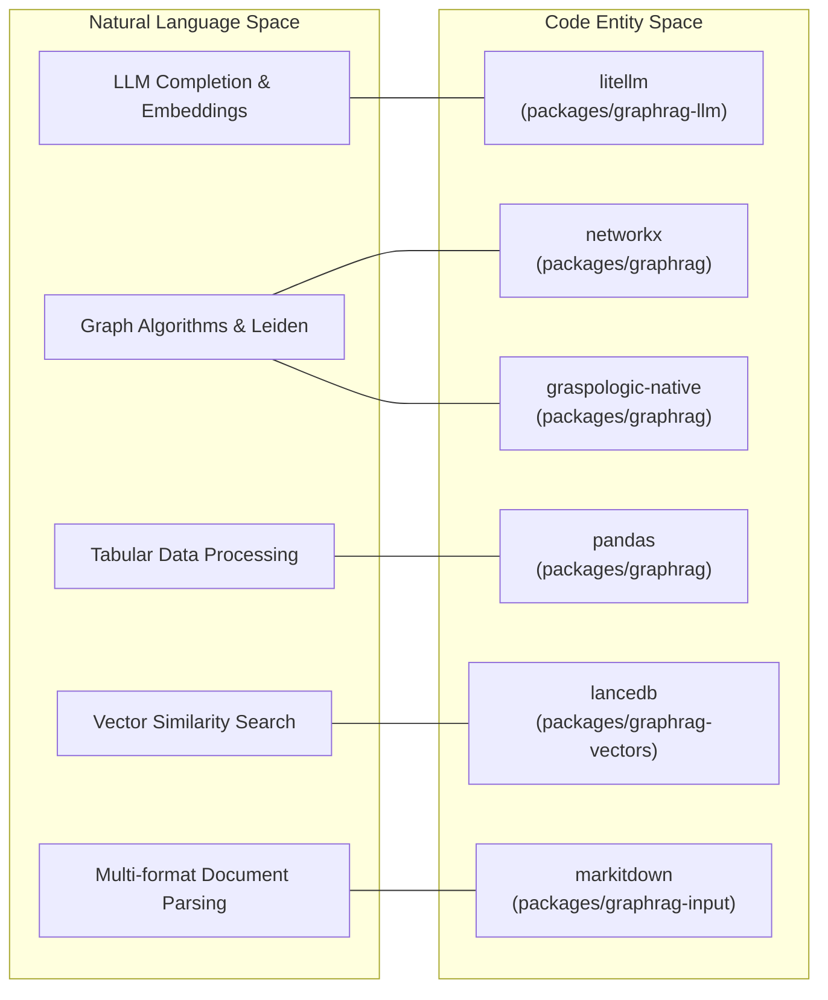
```mermaid
graph LR
    subgraph "Natural Language Space"
        LLM_Access["LLM Completion & Embeddings"]
        Graph_Algo["Graph Algorithms & Leiden"]
        Data_Frames["Tabular Data Processing"]
        Vector_Search["Vector Similarity Search"]
        Doc_Parsing["Multi-format Document Parsing"]
    end

    subgraph "Code Entity Space"
        LiteLLM["litellm<br/>(packages/graphrag-llm)"]
        NetworkX["networkx<br/>(packages/graphrag)"]
        Graspologic["graspologic-native<br/>(packages/graphrag)"]
        Pandas["pandas<br/>(packages/graphrag)"]
        LanceDB["lancedb<br/>(packages/graphrag-vectors)"]
        MarkItDown["markitdown<br/>(packages/graphrag-input)"]
    end

    LLM_Access --- LiteLLM
    Graph_Algo --- NetworkX
    Graph_Algo --- Graspologic
    Data_Frames --- Pandas
    Vector_Search --- LanceDB
    Doc_Parsing --- MarkItDown
```

**Sources**: [packages/graphrag/pyproject.toml:34-60](), [packages/graphrag-llm/pyproject.toml:39](), [packages/graphrag-vectors/pyproject.toml:38](), [packages/graphrag-input/pyproject.toml:36]()

---

## Version Management and Synchronization

All packages share a unified version number, currently `3.0.9`. This ensures compatibility across the monorepo.

### Version Synchronization Mechanism

The root workspace defines a `release` task at [pyproject.toml:112-127]() that synchronizes versions using `semversioner` and `update-toml`. Each package's `pyproject.toml` is updated via individual tasks such as `_semversioner_update_graphrag_toml_version` [pyproject.toml:77]().

### Workspace Dependency References

Packages reference each other using exact version pins. For example, the `graphrag` package depends on the other workspace members with strict equality:

```toml
dependencies = [
    "graphrag-cache==3.0.9",
    "graphrag-chunking==3.0.9",
    "graphrag-common==3.0.9",
    "graphrag-input==3.0.9",
    "graphrag-llm==3.0.9",
    "graphrag-storage==3.0.9",
    "graphrag-vectors==3.0.9",
]
```

**Sources**: [pyproject.toml:77-127](), [packages/graphrag/pyproject.toml:4-45](), [packages/graphrag-llm/pyproject.toml:3-37]()

---

## Build System Configuration

### Build Backend
All packages use **Hatchling** as the build backend, specified in the `[build-system]` section of their respective `pyproject.toml` files [packages/graphrag/pyproject.toml:68-70](), [packages/graphrag-llm/pyproject.toml:48-50]().

### Build Task
The root workspace defines a `build` task that executes `uv build --all-packages` [pyproject.toml:106-110]().

### Python Version Requirements
The monorepo requires Python `>=3.11,<3.14` [pyproject.toml:24](). Individual packages maintain similar constraints, though `graphrag-llm` supports `>=3.10` [packages/graphrag-llm/pyproject.toml:26]().

**Sources**: [pyproject.toml:24-110](), [packages/graphrag/pyproject.toml:68-70](), [packages/graphrag-llm/pyproject.toml:26]()

---

<<< SECTION: 2.1 Package Overview [2-1-package-overview] >>>

# Package Overview

<details>
<summary>Relevant source files</summary>

The following files were used as context for generating this wiki page:

- [CHANGELOG.md](CHANGELOG.md)
- [packages/graphrag-cache/pyproject.toml](packages/graphrag-cache/pyproject.toml)
- [packages/graphrag-chunking/pyproject.toml](packages/graphrag-chunking/pyproject.toml)
- [packages/graphrag-common/pyproject.toml](packages/graphrag-common/pyproject.toml)
- [packages/graphrag-input/pyproject.toml](packages/graphrag-input/pyproject.toml)
- [packages/graphrag-llm/pyproject.toml](packages/graphrag-llm/pyproject.toml)
- [packages/graphrag-storage/pyproject.toml](packages/graphrag-storage/pyproject.toml)
- [packages/graphrag-vectors/pyproject.toml](packages/graphrag-vectors/pyproject.toml)
- [packages/graphrag/pyproject.toml](packages/graphrag/pyproject.toml)
- [pyproject.toml](pyproject.toml)
- [uv.lock](uv.lock)

</details>


This page documents the eight packages that comprise the GraphRAG monorepo. Each package has a specific responsibility and is designed to be independently testable while working together to provide the complete GraphRAG system functionality.

For information about how these packages depend on each other and their architectural layering, see [Package Dependencies and Layering](). For details on external libraries used by these packages, see [External Dependencies]().

---

## Monorepo Structure

The GraphRAG codebase is organized as a monorepo with a root workspace and eight distinct packages located in the `packages/` directory. The workspace is managed using `uv` and defined in [pyproject.toml:53-54]().

**Sources:** [pyproject.toml:1-54]()

---

## Package Summary

The following table provides an overview of all packages in the monorepo. All packages currently share a synchronized version following the monorepo restructure in version `3.0.0` [CHANGELOG.md:66-78]().

| Package Name | Directory | Version | Purpose | Python Version |
|-------------|-----------|---------|---------|----------------|
| `graphrag` | `packages/graphrag/` | 3.0.9 | Main orchestration package with CLI, API, and workflows | >=3.11,<3.14 |
| `graphrag-common` | `packages/graphrag-common/` | 3.0.9 | Shared utilities, types, and configuration loading | >=3.11,<3.14 |
| `graphrag-storage` | `packages/graphrag-storage/` | 3.0.9 | Storage abstraction for file, blob, and Cosmos DB backends | >=3.11,<3.14 |
| `graphrag-cache` | `packages/graphrag-cache/` | 3.0.9 | Caching layer for LLM responses and extraction results | >=3.11,<3.14 |
| `graphrag-llm` | `packages/graphrag-llm/` | 3.0.9 | LLM integration via LiteLLM with prompt management | >=3.10,<3.14 |
| `graphrag-vectors` | `packages/graphrag-vectors/` | 3.0.9 | Vector store abstractions for LanceDB, Azure AI, Cosmos | >=3.11,<3.14 |
| `graphrag-input` | `packages/graphrag-input/` | 3.0.9 | Document loading from various formats (CSV, JSON, text, PDF) | >=3.11,<3.14 |
| `graphrag-chunking` | `packages/graphrag-chunking/` | 3.0.9 | Text chunking utilities for document segmentation | >=3.11,<3.14 |

**Sources:** [packages/graphrag/pyproject.toml:4-32](), [packages/graphrag-common/pyproject.toml:3-31](), [packages/graphrag-storage/pyproject.toml:3-31](), [packages/graphrag-cache/pyproject.toml:3-32](), [packages/graphrag-llm/pyproject.toml:3-33](), [packages/graphrag-vectors/pyproject.toml:3-31](), [packages/graphrag-input/pyproject.toml:3-31](), [packages/graphrag-chunking/pyproject.toml:3-31]()

---

## Package Dependency Graph

```mermaid
graph TB
    graphrag["graphrag<br/>(Main Package)"]
    graphrag-common["graphrag-common<br/>(Foundation)"]
    graphrag-storage["graphrag-storage<br/>(Storage Layer)"]
    graphrag-cache["graphrag-cache<br/>(Caching)"]
    graphrag-llm["graphrag-llm<br/>(LLM Integration)"]
    graphrag-vectors["graphrag-vectors<br/>(Vector Stores)"]
    graphrag-input["graphrag-input<br/>(Document Loading)"]
    graphrag-chunking["graphrag-chunking<br/>(Text Chunking)"]
    
    graphrag --> graphrag-common
    graphrag --> graphrag-storage
    graphrag --> graphrag-cache
    graphrag --> graphrag-llm
    graphrag --> graphrag-vectors
    graphrag --> graphrag-input
    graphrag --> graphrag-chunking
    
    graphrag-storage --> graphrag-common
    graphrag-cache --> graphrag-common
    graphrag-cache --> graphrag-storage
    graphrag-llm --> graphrag-common
    graphrag-llm --> graphrag-cache
    graphrag-vectors --> graphrag-common
    graphrag-input --> graphrag-common
    graphrag-input --> graphrag-storage
    graphrag-chunking --> graphrag-common
```

This diagram illustrates the dependency relationships between packages. The `graphrag-common` package is the foundation with no internal dependencies. The `graphrag` package depends on all others and serves as the orchestration layer.

**Sources:** [pyproject.toml:56-63](), [packages/graphrag/pyproject.toml:34-60]()

---

## Core Packages

### graphrag

**Location:** `packages/graphrag/`

The main `graphrag` package serves as the orchestration layer that brings together all other packages to provide the complete GraphRAG functionality. It contains:

- **CLI Interface**: Command-line interface exposed via the `graphrag` command, defined at [packages/graphrag/pyproject.toml:62-63]()
- **Python API**: Programmatic API for indexing and querying.
- **Workflow Orchestration**: Indexing pipeline workflows and search implementations.
- **Query Engine**: Multiple search strategies including Global, Local, DRIFT, and Basic.

**Key Dependencies:**
- All other graphrag packages (common, storage, cache, llm, vectors, input, chunking) [packages/graphrag/pyproject.toml:39-45]()
- External libraries: `azure-identity`, `azure-search-documents`, `azure-storage-blob`, `networkx`, `pandas`, `pyarrow`, `spacy`, `nltk` [packages/graphrag/pyproject.toml:35-60]()

**Primary Capabilities:**
- Document indexing pipeline execution.
- Knowledge graph construction and community detection.
- Multi-modal search operations.
- Incremental index updates.

**Sources:** [packages/graphrag/pyproject.toml:1-72]()

---

### graphrag-common

**Location:** `packages/graphrag-common/`

The `graphrag-common` package provides the foundational layer of shared utilities and types used across all other packages. It has minimal external dependencies and serves as the base layer in the package hierarchy.

**Key Dependencies:**
- `python-dotenv~=1.0` - Environment variable loading [packages/graphrag-common/pyproject.toml:33]()
- `pyyaml~=6.0` - YAML configuration parsing [packages/graphrag-common/pyproject.toml:34]()
- `toml` - TOML file handling [packages/graphrag-common/pyproject.toml:35]()

**Primary Capabilities:**
- Configuration file loading (YAML, TOML, environment variables).
- Shared type definitions and data structures.
- Common utility functions and logging infrastructure.

**Sources:** [packages/graphrag-common/pyproject.toml:1-45]()

---

## Infrastructure Packages

### graphrag-storage

**Location:** `packages/graphrag-storage/`

The `graphrag-storage` package provides an abstraction layer for storage operations, enabling the system to work with multiple storage backends without code changes. Recent updates introduced the `TableProvider` abstraction for handling CSV and Parquet formats [CHANGELOG.md:50-54]().

**Key Dependencies:**
- `graphrag-common==3.0.9` [packages/graphrag-storage/pyproject.toml:37]()
- `aiofiles~=24.1` - Async file I/O [packages/graphrag-storage/pyproject.toml:33]()
- `azure-cosmos~=4.9`, `azure-storage-blob~=12.24` [packages/graphrag-storage/pyproject.toml:34-36]()
- `pandas~=2.3` - DataFrame operations [packages/graphrag-storage/pyproject.toml:38]()

**Primary Capabilities:**
- Storage interface abstraction.
- File system and Azure Blob Storage implementation.
- Azure Cosmos DB storage integration (including output support [CHANGELOG.md:40]()).
- Table provider abstraction for structured data (CSV, Parquet).

**Sources:** [packages/graphrag-storage/pyproject.toml:1-49](), [CHANGELOG.md:50-54]()

---

### graphrag-cache

**Location:** `packages/graphrag-cache/`

The `graphrag-cache` package implements caching strategies for expensive operations, particularly LLM API calls and extraction results.

**Key Dependencies:**
- `graphrag-common==3.0.9` [packages/graphrag-cache/pyproject.toml:34]()
- `graphrag-storage==3.0.9` [packages/graphrag-cache/pyproject.toml:35]()

**Primary Capabilities:**
- LLM response caching.
- Extraction result caching.
- JSON-based and in-memory cache implementations.

**Sources:** [packages/graphrag-cache/pyproject.toml:1-44]()

---

### graphrag-llm

**Location:** `packages/graphrag-llm/`

The `graphrag-llm` package provides the language model integration layer, supporting 100+ models through LiteLLM.

**Key Dependencies:**
- `graphrag-common==3.0.9`, `graphrag-cache==3.0.9` [packages/graphrag-llm/pyproject.toml:36-37]()
- `litellm==1.82.6` - Unified LLM interface [packages/graphrag-llm/pyproject.toml:39]()
- `jinja2~=3.1` - Prompt templating [packages/graphrag-llm/pyproject.toml:38]()
- `pydantic~=2.10` - Request/response validation [packages/graphrag-llm/pyproject.toml:41]()

**Primary Capabilities:**
- LiteLLM provider integration (OpenAI, Azure, Gemini, etc.).
- Prompt template management via Jinja2.
- Rate limiting, retry logic, and streaming support.
- Embedding model support.

**Sources:** [packages/graphrag-llm/pyproject.toml:1-51]()

---

### graphrag-vectors

**Location:** `packages/graphrag-vectors/`

The `graphrag-vectors` package provides vector store abstractions and implementations for similarity search operations. Recent updates added support for filtering, timestamp explosion, and basic CRUD operations to the vector store API [CHANGELOG.md:36]().

**Key Dependencies:**
- `graphrag-common==3.0.9` [packages/graphrag-vectors/pyproject.toml:37]()
- `azure-search-documents~=11.6`, `azure-cosmos~=4.9` [packages/graphrag-vectors/pyproject.toml:34-36]()
- `lancedb~=0.24.1` - Local vector database [packages/graphrag-vectors/pyproject.toml:38]()
- `numpy~=2.1`, `pyarrow~=22.0` [packages/graphrag-vectors/pyproject.toml:39-40]()

**Primary Capabilities:**
- Vector store interface abstraction.
- LanceDB, Azure AI Search, and Cosmos DB implementations.
- Similarity search with filtering and metadata support.
- Dynamic vector size configuration by embedding model [CHANGELOG.md:17]().

**Sources:** [packages/graphrag-vectors/pyproject.toml:1-50](), [CHANGELOG.md:36]()

---

## Data Processing Packages

### graphrag-input

**Location:** `packages/graphrag-input/`

The `graphrag-input` package handles loading and parsing of input documents from various formats. It utilizes `InputReader` with async iterator support [CHANGELOG.md:53]().

**Key Dependencies:**
- `graphrag-common==3.0.9`, `graphrag-storage==3.0.9` [packages/graphrag-input/pyproject.toml:33-34]()
- `markitdown~=0.1.0` - Multi-format document conversion [packages/graphrag-input/pyproject.toml:36-37]()
- `pyarrow>=14.0.0` [packages/graphrag-input/pyproject.toml:38]()

**Primary Capabilities:**
- Loading CSV, JSON, and Plain Text documents.
- PDF document loading via `markitdown`.
- Async document iteration for pipeline workflows.

**Sources:** [packages/graphrag-input/pyproject.toml:1-47](), [CHANGELOG.md:53]()

---

### graphrag-chunking

**Location:** `packages/graphrag-chunking/`

The `graphrag-chunking` package provides text segmentation utilities for breaking documents into processable units.

**Key Dependencies:**
- `graphrag-common==3.0.9` [packages/graphrag-chunking/pyproject.toml:33]()
- `pydantic~=2.10` [packages/graphrag-chunking/pyproject.toml:34]()

**Primary Capabilities:**
- Token-based text chunking with configurable size and overlap.
- Character-level and token-level splitting strategies.

**Sources:** [packages/graphrag-chunking/pyproject.toml:1-44]()

---

## Package Installation and Building

All packages share a standardized build configuration using `hatchling` [packages/graphrag/pyproject.toml:69-70]().

**Build Command:** `poe build` (executes `_copy_build_assets` and `_build_packages` tasks) [pyproject.toml:109-111]().

**Release Command:** `poe release` (synchronizes versions across all packages using `semversioner` and `update-toml`) [pyproject.toml:112-127]().

---

## Workspace Configuration

```mermaid
graph LR
    Root["pyproject.toml<br/>(Root Workspace)"]
    Members["packages/*<br/>(Workspace Members)"]
    
    Root -->|"defines workspace"| Members
    
    subgraph "Workspace Members"
        graphrag["graphrag"]
        common["graphrag-common"]
        storage["graphrag-storage"]
        cache["graphrag-cache"]
        llm["graphrag-llm"]
        vectors["graphrag-vectors"]
        input["graphrag-input"]
        chunking["graphrag-chunking"]
    end
```

The workspace is configured at [pyproject.toml:53-54]() with all packages as members. The `uv.lock` file at the repository root manages unified dependency resolution across all packages [uv.lock:13-24]().

**Sources:** [pyproject.toml:50-63](), [uv.lock:13-24]()

---

<<< SECTION: 2.2 Package Dependencies and Layering [2-2-package-dependencies-and-layering] >>>

# Package Dependencies and Layering

<details>
<summary>Relevant source files</summary>

The following files were used as context for generating this wiki page:

- [packages/graphrag-cache/pyproject.toml](packages/graphrag-cache/pyproject.toml)
- [packages/graphrag-chunking/pyproject.toml](packages/graphrag-chunking/pyproject.toml)
- [packages/graphrag-common/pyproject.toml](packages/graphrag-common/pyproject.toml)
- [packages/graphrag-input/pyproject.toml](packages/graphrag-input/pyproject.toml)
- [packages/graphrag-llm/pyproject.toml](packages/graphrag-llm/pyproject.toml)
- [packages/graphrag-storage/pyproject.toml](packages/graphrag-storage/pyproject.toml)
- [packages/graphrag-vectors/pyproject.toml](packages/graphrag-vectors/pyproject.toml)
- [packages/graphrag/pyproject.toml](packages/graphrag/pyproject.toml)
- [uv.lock](uv.lock)

</details>


This page documents the dependency architecture and layering strategy of the GraphRAG monorepo. It explains how the 8 packages are organized into distinct layers, the rationale for this structure, and how dependencies flow bottom-up to prevent circular references.

For information about individual package contents and APIs, see [Package Overview](#2.1). For details on external library integrations, see [External Dependencies](#2.3).

## Overview

The GraphRAG monorepo employs a **strict layered architecture** where dependencies flow unidirectionally from higher layers to lower layers. This design prevents circular dependencies, enables independent testing of foundational components, and allows selective package installation based on use case.

The repository consists of 8 packages organized into 4 layers:

| Layer | Packages | Role |
|-------|----------|------|
| **Layer 1: Foundation** | `graphrag-common` | Shared utilities, types, configuration helpers |
| **Layer 2: Infrastructure** | `graphrag-storage`, `graphrag-chunking` | Storage abstraction and text segmentation |
| **Layer 3: Services** | `graphrag-cache`, `graphrag-input`, `graphrag-vectors`, `graphrag-llm` | Specialized domain services |
| **Layer 4: Application** | `graphrag` | CLI, workflows, indexing, querying |

All packages share the same version number (`3.0.9`) and are released together as part of the monorepo structure. The workspace is managed by the **uv package manager**, which provides fast dependency resolution and workspace management.

**Sources:** [uv.lock:14-24](), [packages/graphrag/pyproject.toml:4-4]()

## Monorepo Structure

### Workspace Configuration

The root workspace is configured using uv's workspace feature, as seen in the manifest members:

```toml
[manifest]
members = [
    "graphrag",
    "graphrag-cache",
    "graphrag-chunking",
    "graphrag-common",
    "graphrag-input",
    "graphrag-llm",
    "graphrag-monorepo",
    "graphrag-storage",
    "graphrag-vectors",
]
```

The unified lockfile `uv.lock` ensures that all packages in the workspace share compatible versions of external dependencies, such as `pydantic` or `pandas`.

**Sources:** [uv.lock:1-24]()

### Directory Layout

```
graphrag/
├── uv.lock                     # Unified lockfile for all packages
└── packages/
    ├── graphrag/               # Layer 4: Main application [packages/graphrag/pyproject.toml:2-2]()
    ├── graphrag-llm/           # Layer 3: LLM integration [packages/graphrag-llm/pyproject.toml:2-2]()
    ├── graphrag-vectors/       # Layer 3: Vector stores [packages/graphrag-vectors/pyproject.toml:2-2]()
    ├── graphrag-input/         # Layer 3: Document loading [packages/graphrag-input/pyproject.toml:2-2]()
    ├── graphrag-cache/         # Layer 3: Caching [packages/graphrag-cache/pyproject.toml:2-2]()
    ├── graphrag-storage/       # Layer 2: Storage abstraction [packages/graphrag-storage/pyproject.toml:2-2]()
    ├── graphrag-chunking/      # Layer 2: Text chunking [packages/graphrag-chunking/pyproject.toml:2-2]()
    └── graphrag-common/        # Layer 1: Foundation [packages/graphrag-common/pyproject.toml:2-2]()
```

**Sources:** [uv.lock:14-24]()

## Layer 1: Foundation

### graphrag-common

The `graphrag-common` package serves as the foundation for all other packages. It has **zero internal dependencies** on other GraphRAG packages and only depends on standard Python utilities.

```mermaid
graph TB
    Common["graphrag-common"]
    
    subgraph "External Foundation"
        DotEnv["python-dotenv<br/>Env Loading"]
        PyYAML["pyyaml<br/>Config Parsing"]
        TOML["toml<br/>Metadata Parsing"]
    end
    
    Common --> DotEnv
    Common --> PyYAML
    Common --> TOML
```

**External Dependencies:**
- `python-dotenv~=1.0` - Environment variable loading.
- `pyyaml~=6.0` - YAML configuration parsing.
- `toml` - TOML file handling.

**Sources:** [packages/graphrag-common/pyproject.toml:32-36]()

## Layer 2: Infrastructure

### graphrag-storage

The `graphrag-storage` package provides storage abstractions for file systems, Azure Blob Storage, and Azure Cosmos DB.

```mermaid
graph TB
    Storage["graphrag-storage"]
    Common["graphrag-common"]
    
    subgraph "External Storage Drivers"
        Aiofiles["aiofiles<br/>Async I/O"]
        AzureBlob["azure-storage-blob<br/>Blob Storage"]
        Cosmos["azure-cosmos<br/>NoSQL Storage"]
        Pandas["pandas<br/>DataFrames"]
    end
    
    Storage --> Common
    Storage --> Aiofiles
    Storage --> AzureBlob
    Storage --> Cosmos
    Storage --> Pandas
```

**Dependencies:**
- `graphrag-common==3.0.9` (Layer 1)
- `aiofiles~=24.1` - Asynchronous file operations.
- `azure-cosmos~=4.9` - Cosmos DB integration.
- `azure-storage-blob~=12.24` - Azure Blob Storage.
- `pandas~=2.3` - DataFrame serialization.

**Sources:** [packages/graphrag-storage/pyproject.toml:32-40]()

### graphrag-chunking

The `graphrag-chunking` package handles text segmentation logic.

**Dependencies:**
- `graphrag-common==3.0.9` (Layer 1)
- `pydantic~=2.10` - Data validation.

**Sources:** [packages/graphrag-chunking/pyproject.toml:32-35]()

## Layer 3: Services

Layer 3 packages build on Layers 1 and 2 to provide specialized domain services.

### graphrag-cache

Provides LLM response caching with pluggable storage backends.

**Dependencies:**
- `graphrag-common==3.0.9` (Layer 1)
- `graphrag-storage==3.0.9` (Layer 2)

**Sources:** [packages/graphrag-cache/pyproject.toml:33-36]()

### graphrag-input

Handles document loading and format conversion using MarkItDown.

**Dependencies:**
- `graphrag-common==3.0.9` (Layer 1)
- `graphrag-storage==3.0.9` (Layer 2)
- `markitdown~=0.1.0` - Document format conversion (PDF, etc).

**Sources:** [packages/graphrag-input/pyproject.toml:32-39]()

### graphrag-vectors

Manages vector storage with support for LanceDB, Azure AI Search, and Cosmos DB.

```mermaid
graph TB
    Vectors["graphrag-vectors"]
    Common["graphrag-common"]
    
    subgraph "Vector Providers"
        Lance["lancedb<br/>Local Vector DB"]
        AISearch["azure-search-documents<br/>AI Search"]
        CosmosVec["azure-cosmos<br/>Vector Search"]
    end
    
    Vectors --> Common
    Vectors --> Lance
    Vectors --> AISearch
    Vectors --> CosmosVec
```

**Dependencies:**
- `graphrag-common==3.0.9` (Layer 1)
- `azure-search-documents~=11.6` - Azure AI Search.
- `lancedb~=0.24.1` - Local vector database.
- `numpy~=2.1` and `pyarrow~=22.0` - Vector and table processing.

**Sources:** [packages/graphrag-vectors/pyproject.toml:32-42]()

### graphrag-llm

Integrates LLM providers via LiteLLM with caching support.

**Dependencies:**
- `graphrag-common==3.0.9` (Layer 1)
- `graphrag-cache==3.0.9` (Layer 3)
- `litellm==1.82.6` - Multi-provider LLM integration.
- `jinja2~=3.1` - Prompt templating.

**Sources:** [packages/graphrag-llm/pyproject.toml:34-43]()

## Layer 4: Application

### graphrag

The main `graphrag` package orchestrates all lower layers to provide the complete indexing and querying system. It depends on all other specialized packages in the workspace.

```mermaid
graph TB
    Main["graphrag<br/>(Main Package)"]
    
    subgraph "Internal Packages"
        LLM["graphrag-llm"]
        Vectors["graphrag-vectors"]
        Input["graphrag-input"]
        Storage["graphrag-storage"]
        Chunking["graphrag-chunking"]
        Cache["graphrag-cache"]
        Common["graphrag-common"]
    end
    
    subgraph "External Core"
        NetworkX["networkx<br/>Graph Data"]
        Graspologic["graspologic-native<br/>Leiden Algo"]
        Spacy["spacy<br/>NLP Extraction"]
        Typer["typer<br/>CLI Entry"]
    end
    
    Main --> LLM
    Main --> Vectors
    Main --> Input
    Main --> Storage
    Main --> Chunking
    Main --> Cache
    Main --> Common
    
    Main --> NetworkX
    Main --> Graspologic
    Main --> Spacy
    Main --> Typer
```

**Internal Workspace Dependencies (v3.0.9):**
All 7 specialized packages are included as direct dependencies.

**Key External Dependencies:**
- `networkx~=3.4` - Graph data structures.
- `graspologic-native~=1.2` - Community detection.
- `spacy~=3.8` - NLP for entity extraction.
- `typer~=0.16` - CLI framework for `graphrag.cli.main:app`.
- `json-repair~=0.30` - Handling malformed LLM JSON.

**Sources:** [packages/graphrag/pyproject.toml:34-63]()

## Summary of Dependency Flow

```mermaid
graph TB
    subgraph "Layer 4: Application"
        App["graphrag"]
    end
    
    subgraph "Layer 3: Services"
        LLM["graphrag-llm"]
        Input["graphrag-input"]
        Cache["graphrag-cache"]
        Vectors["graphrag-vectors"]
    end
    
    subgraph "Layer 2: Infrastructure"
        Storage["graphrag-storage"]
        Chunking["graphrag-chunking"]
    end
    
    subgraph "Layer 1: Foundation"
        Common["graphrag-common"]
    end
    
    App --> LLM
    App --> Input
    App --> Cache
    App --> Vectors
    App --> Storage
    App --> Chunking
    App --> Common
    
    LLM --> Cache
    LLM --> Common
    
    Input --> Storage
    Input --> Common
    
    Cache --> Storage
    Cache --> Common
    
    Vectors --> Common
    
    Storage --> Common
    Chunking --> Common
```

**Key Observations:**
1. **Unidirectional Flow:** Dependencies always point toward lower layers or within the same layer (e.g., `LLM` -> `Cache`).
2. **Universal Foundation:** `graphrag-common` is the base for every package in the system.
3. **Storage Abstraction:** Both `graphrag-cache` and `graphrag-input` rely on `graphrag-storage` for data persistence and retrieval.

**Sources:** All package `pyproject.toml` dependency lists.

---

<<< SECTION: 2.3 External Dependencies [2-3-external-dependencies] >>>

# External Dependencies

<details>
<summary>Relevant source files</summary>

The following files were used as context for generating this wiki page:

- [dictionary.txt](dictionary.txt)
- [packages/graphrag-cache/pyproject.toml](packages/graphrag-cache/pyproject.toml)
- [packages/graphrag-chunking/pyproject.toml](packages/graphrag-chunking/pyproject.toml)
- [packages/graphrag-common/pyproject.toml](packages/graphrag-common/pyproject.toml)
- [packages/graphrag-input/pyproject.toml](packages/graphrag-input/pyproject.toml)
- [packages/graphrag-llm/pyproject.toml](packages/graphrag-llm/pyproject.toml)
- [packages/graphrag-storage/pyproject.toml](packages/graphrag-storage/pyproject.toml)
- [packages/graphrag-vectors/graphrag_vectors/azure_ai_search.py](packages/graphrag-vectors/graphrag_vectors/azure_ai_search.py)
- [packages/graphrag-vectors/graphrag_vectors/cosmosdb.py](packages/graphrag-vectors/graphrag_vectors/cosmosdb.py)
- [packages/graphrag-vectors/graphrag_vectors/lancedb.py](packages/graphrag-vectors/graphrag_vectors/lancedb.py)
- [packages/graphrag-vectors/graphrag_vectors/vector_store.py](packages/graphrag-vectors/graphrag_vectors/vector_store.py)
- [packages/graphrag-vectors/pyproject.toml](packages/graphrag-vectors/pyproject.toml)
- [packages/graphrag/pyproject.toml](packages/graphrag/pyproject.toml)
- [uv.lock](uv.lock)

</details>


This page documents the external third-party libraries and services that GraphRAG depends on across all packages in the monorepo. These dependencies provide core functionality for language model integration, vector storage, cloud services, natural language processing, graph algorithms, and data manipulation.

For information about the internal package dependencies within the GraphRAG monorepo, see [2.2 Package Dependencies and Layering](). For configuration of external services like LLM providers and vector stores, see [3.3 Language Model Configuration](), [3.5 Vector Store Configuration](), and [3.4 Storage Configuration]().

## Overview of Dependency Categories

GraphRAG's external dependencies fall into several functional categories:

| Category | Purpose | Key Libraries |
|----------|---------|---------------|
| **LLM Integration** | Language model API access and management | LiteLLM, Azure Identity, Jinja2 |
| **Vector Storage** | Embeddings storage and similarity search | LanceDB, Azure AI Search, Azure Cosmos DB |
| **Cloud Storage** | Persistent storage backends | Azure Blob Storage, Azure Cosmos DB |
| **NLP Processing** | Text analysis and entity extraction | NLTK, spaCy, TextBlob |
| **Graph Processing** | Community detection and graph algorithms | NetworkX, Graspologic |
| **Data Processing** | DataFrames and data manipulation | Pandas, NumPy, PyArrow |
| **Configuration** | Settings and environment management | Pydantic, python-dotenv, PyYAML |

Sources: [packages/graphrag/pyproject.toml:34-60](), [packages/graphrag-llm/pyproject.toml:34-43](), [packages/graphrag-vectors/pyproject.toml:32-42]()

## Dependency Distribution Across Packages

The following diagram shows how external dependencies are distributed across the GraphRAG monorepo packages based on their respective `pyproject.toml` definitions.

```mermaid
graph TB
    subgraph "graphrag-common"
        CommonDeps["python-dotenv~=1.0<br/>pyyaml~=6.0<br/>toml"]
    end
    
    subgraph "graphrag-storage"
        StorageDeps["aiofiles~=24.1<br/>azure-cosmos~=4.9<br/>azure-identity~=1.25<br/>azure-storage-blob~=12.24<br/>pandas~=2.3<br/>pydantic~=2.10"]
    end
    
    subgraph "graphrag-cache"
        CacheDeps["(inherits storage/common deps)"]
    end
    
    subgraph "graphrag-chunking"
        ChunkingDeps["pydantic~=2.10"]
    end
    
    subgraph "graphrag-input"
        InputDeps["markitdown~=0.1.0<br/>pydantic~=2.10<br/>pyarrow>=14.0.0"]
    end
    
    subgraph "graphrag-llm"
        LLMDeps["azure-identity~=1.25<br/>jinja2~=3.1<br/>litellm==1.82.6<br/>nest-asyncio2~=1.7<br/>pydantic~=2.10"]
    end
    
    subgraph "graphrag-vectors"
        VectorDeps["azure-core~=1.32<br/>azure-cosmos~=4.9<br/>azure-identity~=1.25<br/>azure-search-documents~=11.6<br/>lancedb~=0.24.1<br/>numpy~=2.1<br/>pyarrow~=22.0<br/>pydantic~=2.10"]
    end
    
    subgraph "graphrag (main)"
        MainDeps["azure-identity~=1.25<br/>azure-search-documents~=11.5<br/>azure-storage-blob~=12.24<br/>devtools~=0.12<br/>graspologic-native~=1.2<br/>json-repair~=0.30<br/>networkx~=3.4<br/>nltk~=3.9<br/>numpy~=2.1<br/>pandas~=2.3<br/>pyarrow~=22.0<br/>pydantic~=2.10<br/>spacy~=3.8<br/>blis~=1.0<br/>textblob~=0.18<br/>tqdm~=4.67<br/>typer~=0.16"]
    end
    
    CommonDeps --> StorageDeps
    CommonDeps --> ChunkingDeps
    CommonDeps --> InputDeps
    CommonDeps --> LLMDeps
    CommonDeps --> VectorDeps
    StorageDeps --> CacheDeps
    StorageDeps --> InputDeps
    
    CommonDeps --> MainDeps
    StorageDeps --> MainDeps
    CacheDeps --> MainDeps
    ChunkingDeps --> MainDeps
    InputDeps --> MainDeps
    LLMDeps --> MainDeps
    VectorDeps --> MainDeps
```

Sources: [packages/graphrag/pyproject.toml:34-60](), [packages/graphrag-llm/pyproject.toml:34-43](), [packages/graphrag-common/pyproject.toml:32-36](), [packages/graphrag-cache/pyproject.toml:33-36](), [packages/graphrag-vectors/pyproject.toml:32-42](), [packages/graphrag-chunking/pyproject.toml:32-35](), [packages/graphrag-input/pyproject.toml:32-39](), [packages/graphrag-storage/pyproject.toml:32-40]()

## LLM Integration Dependencies

### LiteLLM (`litellm==1.82.6`)

LiteLLM is the primary abstraction layer for language model API access, enabling GraphRAG to support multiple LLM providers through a unified interface.

**Package:** `graphrag-llm`  
**Purpose:** Provides a consistent API for calling OpenAI, Azure OpenAI, Google Gemini, Anthropic, and other LLM providers.  
**Key Features:**
- Unified completion and embedding interfaces.
- Automatic retry logic and rate limiting.
- Token counting and cost tracking.

**Integration Points:**
- Used by the `graphrag-llm` package for all LLM calls [packages/graphrag-llm/pyproject.toml:39]().
- Configured through model settings in the main `graphrag` package.

Sources: [packages/graphrag-llm/pyproject.toml:39]()

### Jinja2 (`jinja2~=3.1`)

Jinja2 is used for prompt template rendering and token replacement.

**Package:** `graphrag-llm`  
**Purpose:** Template engine for constructing LLM prompts with dynamic content.  
**Integration Points:**
- Used to inject entities, relationships, and context into prompts before sending them to the LLM.

Sources: [packages/graphrag-llm/pyproject.toml:38]()

### Azure Identity (`azure-identity~=1.25`)

Azure Identity provides authentication for Azure services across multiple packages.

**Packages:** `graphrag`, `graphrag-llm`, `graphrag-storage`, `graphrag-vectors`  
**Purpose:** Handles authentication to Azure services using managed identities, service principals, or Azure CLI credentials.  

Sources: [packages/graphrag/pyproject.toml:35](), [packages/graphrag-llm/pyproject.toml:35](), [packages/graphrag-storage/pyproject.toml:35](), [packages/graphrag-vectors/pyproject.toml:35]()

## Vector Storage Dependencies

### LanceDB (`lancedb~=0.24.1`)

LanceDB is a local-first vector database built on Apache Arrow and Lance format.

**Package:** `graphrag-vectors`  
**Purpose:** Local vector storage and similarity search for embeddings.  
**Implementation Details:**
- `LanceDBVectorStore` implements the `VectorStore` base class [packages/graphrag-vectors/graphrag_vectors/lancedb.py:27-28]().
- Uses `pyarrow` for schema definition and data batching [packages/graphrag-vectors/graphrag_vectors/lancedb.py:10]().
- Compiles `FilterExpr` into SQL WHERE clauses for metadata filtering [packages/graphrag-vectors/graphrag_vectors/lancedb.py:130-146]().

**Data Flow:**
1. Documents are prepared using `_prepare_document` to explode timestamps [packages/graphrag-vectors/graphrag_vectors/vector_store.py:97-121]().
2. Data is converted to a `pa.table` (PyArrow Table) [packages/graphrag-vectors/graphrag_vectors/lancedb.py:109-115]().
3. The table is added to the LanceDB collection [packages/graphrag-vectors/graphrag_vectors/lancedb.py:117]().

Sources: [packages/graphrag-vectors/pyproject.toml:38](), [packages/graphrag-vectors/graphrag_vectors/lancedb.py:27-117](), [packages/graphrag-vectors/graphrag_vectors/vector_store.py:56-121]()

### Azure AI Search (`azure-search-documents~=11.6`)

**Packages:** `graphrag`, `graphrag-vectors`  
**Purpose:** Cloud-native vector storage and hybrid search.  

Sources: [packages/graphrag/pyproject.toml:36](), [packages/graphrag-vectors/pyproject.toml:36]()

### Azure Cosmos DB (`azure-cosmos~=4.9`)

**Packages:** `graphrag-storage`, `graphrag-vectors`  
**Purpose:** 
- In `graphrag-storage`: NoSQL document storage for cache and pipeline artifacts.
- In `graphrag-vectors`: Vector search using Cosmos DB's native vector indexing.

Sources: [packages/graphrag-storage/pyproject.toml:34](), [packages/graphrag-vectors/pyproject.toml:34]()

## Natural Language Processing Dependencies

The following diagram maps NLP dependencies to their usage in the extraction and resolution logic:

```mermaid
graph LR
    subgraph "NLP Libraries"
        NLTK["nltk~=3.9"]
        spaCy["spacy~=3.8"]
        blis["blis~=1.0"]
        TextBlob["textblob~=0.18"]
    end
    
    subgraph "Entity Space"
        Tokenize["NLTK Sentence Tokenization"]
        NER["spaCy NER / POS"]
        Dedupe["TextBlob Similarity"]
    end
    
    NLTK --> Tokenize
    spaCy --> NER
    blis --> spaCy
    TextBlob --> Dedupe
    
    Tokenize --> Pipeline["Indexing Pipeline"]
    NER --> Pipeline
    Dedupe --> Pipeline
```

Sources: [packages/graphrag/pyproject.toml:49-56]()

### NLTK (`nltk~=3.9`)
Used for sentence tokenization and basic text processing [packages/graphrag/pyproject.toml:49]().

### spaCy (`spacy~=3.8`)
Used for named entity recognition (NER), dependency parsing, and linguistic analysis [packages/graphrag/pyproject.toml:54](). Requires `blis` for optimized linear algebra [packages/graphrag/pyproject.toml:55]().

### TextBlob (`textblob~=0.18`)
Used for sentiment analysis and entity similarity calculations during deduplication [packages/graphrag/pyproject.toml:56]().

## Data Processing Dependencies

### Pandas (`pandas~=2.3`)
The primary data structure for pipeline artifacts and in-memory data processing [packages/graphrag/pyproject.toml:51]().

### NumPy (`numpy~=2.1`)
Numerical computing library for array operations and vector computations [packages/graphrag/pyproject.toml:50]().

### PyArrow (`pyarrow~=22.0`)
Apache Arrow Python bindings for columnar data processing, used for Parquet file support and high-performance data serialization [packages/graphrag/pyproject.toml:52]().

## Graph Processing Dependencies

### NetworkX (`networkx~=3.4`)
Python library for creation, manipulation, and analysis of complex networks. Used to build entity-relationship graphs [packages/graphrag/pyproject.toml:48]().

### Graspologic (`graspologic-native~=1.2`)
Used for hierarchical community detection using the Leiden algorithm [packages/graphrag/pyproject.toml:46]().

## Python Version Requirements

All GraphRAG packages require Python 3.11 or higher, with support up to Python 3.13:

| Package | Python Requirement |
|---------|-------------------|
| graphrag | `>=3.11,<3.14` |
| graphrag-common | `>=3.11,<3.14` |
| graphrag-storage | `>=3.11,<3.14` |
| graphrag-cache | `>=3.11,<3.14` |
| graphrag-chunking | `>=3.11,<3.14` |
| graphrag-input | `>=3.11,<3.14` |
| graphrag-vectors | `>=3.11,<3.14` |
| graphrag-llm | `>=3.10,<3.14` |

Sources: [packages/graphrag/pyproject.toml:26](), [packages/graphrag-llm/pyproject.toml:26](), [packages/graphrag-common/pyproject.toml:25](), [packages/graphrag-storage/pyproject.toml:25](), [packages/graphrag-vectors/pyproject.toml:25]()

---

<<< SECTION: 3 Configuration System [3-configuration-system] >>>

# Configuration System

<details>
<summary>Relevant source files</summary>

The following files were used as context for generating this wiki page:

- [docs/config/yaml.md](docs/config/yaml.md)
- [docs/index/architecture.md](docs/index/architecture.md)
- [docs/index/inputs.md](docs/index/inputs.md)
- [packages/graphrag-cache/graphrag_cache/cache_factory.py](packages/graphrag-cache/graphrag_cache/cache_factory.py)
- [packages/graphrag-storage/graphrag_storage/tables/table_provider_config.py](packages/graphrag-storage/graphrag_storage/tables/table_provider_config.py)
- [packages/graphrag/graphrag/config/models/graph_rag_config.py](packages/graphrag/graphrag/config/models/graph_rag_config.py)
- [packages/graphrag/graphrag/index/run/utils.py](packages/graphrag/graphrag/index/run/utils.py)
- [packages/graphrag/graphrag/index/typing/context.py](packages/graphrag/graphrag/index/typing/context.py)
- [tests/unit/config/fixtures/minimal_config/settings.yaml](tests/unit/config/fixtures/minimal_config/settings.yaml)
- [tests/unit/config/fixtures/minimal_config_missing_env_var/settings.yaml](tests/unit/config/fixtures/minimal_config_missing_env_var/settings.yaml)
- [tests/unit/config/test_config.py](tests/unit/config/test_config.py)
- [tests/unit/config/utils.py](tests/unit/config/utils.py)

</details>


The Configuration System is GraphRAG's centralized mechanism for managing all settings required for indexing and querying operations. It provides a flexible, hierarchical approach to configuration through YAML files, environment variables, and CLI overrides, with strong typing and validation.

For information about specific configuration options and their usage, see [Configuration Files](#3.1). For details on model selection, see [Language Model Configuration](#3.3).

---

## Configuration Sources and Loading

GraphRAG supports multiple configuration sources that are merged in priority order:

```mermaid
graph TB
    subgraph "Configuration Sources"
        EnvFile["'.env' File<br/>Environment Variables"]
        SettingsYAML["'settings.yaml'<br/>Primary Configuration"]
        CLIArgs["CLI Arguments<br/>Runtime Overrides"]
    end
    
    subgraph "Loading Process"
        LoadEnv["'load_env'<br/>'os.environ'"]
        ParseYAML["'load_config'<br/>Token Substitution"]
        ApplyOverrides["Apply CLI Overrides"]
    end
    
    subgraph "Configuration Model"
        GraphRagConfig["'GraphRagConfig'<br/>Validated Configuration Object"]
    end
    
    subgraph "Component Configuration"
        ModelConfigs["'completion_models'<br/>'embedding_models'"]
        StorageConfigs["'input_storage'<br/>'output_storage'<br/>'cache'"]
        VectorConfig["'vector_store'"]
        WorkflowConfigs["'extract_graph'<br/>'community_reports'<br/>'cluster_graph'"]
        SearchConfigs["'local_search'<br/>'global_search'<br/>'drift_search'"]
    end
    
    EnvFile --> LoadEnv
    LoadEnv --> ParseYAML
    SettingsYAML --> ParseYAML
    ParseYAML --> ApplyOverrides
    CLIArgs --> ApplyOverrides
    ApplyOverrides --> GraphRagConfig
    
    GraphRagConfig --> ModelConfigs
    GraphRagConfig --> StorageConfigs
    GraphRagConfig --> VectorConfig
    GraphRagConfig --> WorkflowConfigs
    GraphRagConfig --> SearchConfigs
```

**Configuration Loading Process**

The `load_config` function handles the hierarchical merging of configuration sources:

1.  **Environment Variables**: Loaded from `.env` file into process environment [docs/config/yaml.md:3-3]().
2.  **YAML Parsing**: Settings file parsed with `${VAR_NAME}` token substitution [docs/config/yaml.md:3-16]().
3.  **CLI Overrides**: Runtime parameters override YAML values via the `cli_overrides` parameter [tests/unit/config/test_config.py:45-57]().
4.  **Validation**: Strong typing via Pydantic validates the final configuration [packages/graphrag/graphrag/config/models/graph_rag_config.py:40-165]().

**Sources:** [docs/config/yaml.md:1-16](), [tests/unit/config/test_config.py:1-61](), [packages/graphrag/graphrag/config/models/graph_rag_config.py:40-165]()

---

## Configuration File Structure

The `settings.yaml` file is the primary configuration source and follows a structured hierarchy:

```mermaid
graph TB
    SettingsYAML["'settings.yaml'"]
    
    subgraph "Model Definitions"
        CompletionModels["'completion_models':<br/>  model_id:<br/>    model_provider<br/>    model<br/>    api_key<br/>    rate_limit<br/>    retry"]
        EmbeddingModels["'embedding_models':<br/>  model_id:<br/>    model_provider<br/>    model<br/>    api_key<br/>    rate_limit"]
    end
    
    subgraph "Storage & IO"
        Input["'input':<br/>  storage<br/>  type<br/>  encoding<br/>  file_pattern"]
        Output["'output_storage':<br/>  type<br/>  base_dir<br/>  encoding"]
        Cache["'cache':<br/>  type<br/>  storage"]
        UpdateOutput["'update_output_storage':<br/>  type<br/>  base_dir"]
    end
    
    subgraph "Vector & Reporting"
        VectorStore["'vector_store':<br/>  type<br/>  db_uri<br/>  index_schema"]
        Reporting["'reporting':<br/>  type<br/>  base_dir"]
    end
    
    subgraph "Workflows"
        ExtractGraph["'extract_graph':<br/>  completion_model_id<br/>  prompt<br/>  entity_types"]
        CommunityReports["'community_reports':<br/>  completion_model_id<br/>  max_length"]
        ClusterGraph["'cluster_graph':<br/>  max_cluster_size<br/>  seed"]
        EmbedText["'embed_text':<br/>  embedding_model_id<br/>  batch_size"]
    end
    
    subgraph "Search Methods"
        LocalSearch["'local_search':<br/>  prompt<br/>  text_unit_prop"]
        GlobalSearch["'global_search':<br/>  map_prompt<br/>  reduce_prompt"]
        DRIFTSearch["'drift_search':<br/>  drift_k_followups<br/>  n_depth"]
    end
    
    SettingsYAML --> CompletionModels
    SettingsYAML --> EmbeddingModels
    SettingsYAML --> Input
    SettingsYAML --> Output
    SettingsYAML --> Cache
    SettingsYAML --> UpdateOutput
    SettingsYAML --> VectorStore
    SettingsYAML --> Reporting
    SettingsYAML --> ExtractGraph
    SettingsYAML --> CommunityReports
    SettingsYAML --> ClusterGraph
    SettingsYAML --> EmbedText
    SettingsYAML --> LocalSearch
    SettingsYAML --> GlobalSearch
    SettingsYAML --> DRIFTSearch
```

**Sources:** [docs/config/yaml.md:18-121](), [packages/graphrag/graphrag/config/models/graph_rag_config.py:51-165](), [tests/unit/config/utils.py:7-32]()

---

## Environment Variable Substitution

The configuration system supports environment variable token replacement using `${VAR_NAME}` syntax [docs/config/yaml.md:3-3]().

**Example .env File:**
```bash
GRAPHRAG_API_KEY=sk-abc123...
GRAPHRAG_API_BASE=https://api.openai.com
```

**Example settings.yaml with Token Substitution:**
```yaml
completion_models:
  default_completion_model:
    model_provider: openai
    api_key: ${GRAPHRAG_API_KEY}
    api_base: ${GRAPHRAG_API_BASE}
```

**Sources:** [docs/config/yaml.md:7-16](), [tests/unit/config/fixtures/minimal_config/settings.yaml:1-12]()

---

## Configuration Model Classes

GraphRAG uses strongly-typed Pydantic models to represent configuration:

```mermaid
graph TB
    GraphRagConfig["'GraphRagConfig'<br/>Main Configuration Container"]
    
    subgraph "Model Configurations"
        ModelConfig["'ModelConfig'<br/>model_provider<br/>model<br/>api_key<br/>api_base<br/>call_args"]
        RateLimitConfig["'RateLimitConfig'<br/>type<br/>tokens_per_period<br/>requests_per_period"]
        RetryConfig["'RetryConfig'<br/>type<br/>max_retries<br/>base_delay"]
        MetricsConfig["'MetricsConfig'<br/>type<br/>store<br/>writer"]
    end
    
    subgraph "Storage Configurations"
        StorageConfig["'StorageConfig'<br/>type<br/>base_dir<br/>connection_string<br/>container_name"]
        CacheConfig["'CacheConfig'<br/>type<br/>storage"]
        InputConfig["'InputConfig'<br/>type<br/>encoding<br/>file_pattern<br/>text_column"]
    end
    
    subgraph "Vector & Table"
        VectorStoreConfig["'VectorStoreConfig'<br/>type<br/>db_uri<br/>url<br/>index_schema"]
        TableProviderConfig["'TableProviderConfig'<br/>type"]
    end
    
    subgraph "Workflow Configurations"
        ExtractGraphConfig["'ExtractGraphConfig'<br/>completion_model_id<br/>prompt<br/>entity_types"]
        CommunityReportsConfig["'CommunityReportsConfig'<br/>completion_model_id<br/>max_length"]
        ClusterGraphConfig["'ClusterGraphConfig'<br/>max_cluster_size<br/>seed"]
        EmbedTextConfig["'EmbedTextConfig'<br/>embedding_model_id<br/>batch_size"]
    end
    
    GraphRagConfig --> ModelConfig
    GraphRagConfig --> StorageConfig
    GraphRagConfig --> CacheConfig
    GraphRagConfig --> InputConfig
    GraphRagConfig --> VectorStoreConfig
    GraphRagConfig --> ExtractGraphConfig
    GraphRagConfig --> CommunityReportsConfig
    GraphRagConfig --> ClusterGraphConfig
    GraphRagConfig --> EmbedTextConfig
    
    ModelConfig --> RateLimitConfig
    ModelConfig --> RetryConfig
    ModelConfig --> MetricsConfig
    CacheConfig --> StorageConfig
```

**Key Configuration Classes:**

| Class | Purpose | Key Fields |
|-------|---------|------------|
| `GraphRagConfig` | Root configuration container | `completion_models`, `embedding_models`, `input`, `output_storage` [packages/graphrag/graphrag/config/models/graph_rag_config.py:40-165]() |
| `ModelConfig` | LLM model configuration | `model_provider`, `model`, `api_key`, `rate_limit`, `retry` [tests/unit/config/utils.py:90-113]() |
| `StorageConfig` | Storage backend settings | `type`, `base_dir`, `connection_string`, `container_name` [tests/unit/config/utils.py:138-146]() |
| `VectorStoreConfig` | Vector store settings | `type`, `db_uri`, `url`, `index_schema` [tests/unit/config/utils.py:115-126]() |
| `InputConfig` | Data ingestion settings | `type`, `file_pattern`, `text_column`, `title_column` [tests/unit/config/utils.py:154-160]() |

**Sources:** [packages/graphrag/graphrag/config/models/graph_rag_config.py:40-165](), [tests/unit/config/utils.py:7-180]()

---

## Model Configuration

GraphRAG supports multiple language models referenced by ID. It uses [LiteLLM](https://docs.litellm.ai/) under the hood to support over 100 model providers [docs/config/yaml.md:46-47]().

**Model Configuration Example:**
```yaml
completion_models:
  default_completion_model:
    model_provider: openai
    model: gpt-4.1
    api_key: ${GRAPHRAG_API_KEY}
    rate_limit:
      type: sliding_window
      requests_per_period: 250
    retry:
      type: exponential_backoff
      max_retries: 7
```

**Asymmetric Model Usage:**
Workflows can reference different models by ID, enabling optimization:
```yaml
extract_graph:
  completion_model_id: fast_model
community_reports:
  completion_model_id: quality_model
```

**Sources:** [docs/config/yaml.md:20-72](), [tests/unit/config/utils.py:36-54]()

---

## Storage Configuration

GraphRAG supports multiple storage backends through `StorageConfig`. These are used for input ingestion, output artifact export, and caching [docs/config/yaml.md:73-121]().

**Supported Storage Types:**
- `file`: Local filesystem [docs/config/yaml.md:82]().
- `memory`: In-memory storage [docs/config/yaml.md:82]().
- `blob`: Azure Blob Storage [docs/config/yaml.md:82]().
- `cosmosdb`: Azure Cosmos DB [docs/config/yaml.md:82]().

**Sources:** [docs/config/yaml.md:73-121](), [packages/graphrag/graphrag/config/models/graph_rag_config.py:76-141]()

---

## Vector Store Configuration

Vector store configuration defines the backend for storing and searching embeddings.

**Supported Backends:**
- `lancedb`: Default local vector database [tests/unit/config/utils.py:32]().
- `azure_ai_search`: Azure-hosted search service [tests/unit/config/utils.py:122-124]().
- `cosmosdb`: Cosmos DB with DiskANN support [tests/unit/config/utils.py:125]().

**Sources:** [tests/unit/config/utils.py:115-127](), [packages/graphrag/graphrag/config/models/graph_rag_config.py:16-16]()

---

## Workflow Configuration

Individual workflows within the indexing pipeline have specific parameter sets:

| Workflow | Configuration Section | Key Parameters |
|----------|----------------------|----------------|
| Graph Extraction | `extract_graph` | `prompt`, `entity_types`, `max_gleanings` [tests/unit/config/utils.py:13]() |
| Community Reports | `community_reports` | `max_length`, `max_input_length` [tests/unit/config/utils.py:9]() |
| Chunking | `chunking` | `size`, `overlap`, `type`, `encoding_model` [tests/unit/config/utils.py:171-177]() |
| Text Embedding | `embed_text` | `batch_size`, `embedding_model_id`, `names` [tests/unit/config/utils.py:162-169]() |

**Sources:** [tests/unit/config/utils.py:7-26](), [packages/graphrag/graphrag/config/models/graph_rag_config.py:94-104]()

---

## Search Method Configuration

Search parameters are configured per method to tune retrieval performance [tests/unit/config/utils.py:7-20]().

- **Global Search**: Configures map-reduce summarization parameters [tests/unit/config/utils.py:18]().
- **Local Search**: Configures entity-centric graph traversal and context building [tests/unit/config/utils.py:20]().
- **DRIFT Search**: Configures iterative refinement and followup parameters [tests/unit/config/utils.py:10]().
- **Basic Search**: Baseline vector RAG configuration [tests/unit/config/utils.py:7]().

**Sources:** [tests/unit/config/utils.py:7-20](), [packages/graphrag/graphrag/config/models/graph_rag_config.py:22-31]()

---

## Configuration Defaults and Validation

GraphRAG provides comprehensive defaults in `graphrag/config/defaults.py` [docs/config/yaml.md:5-5]().

**Default Config Creation:**
The system can generate a default configuration object using `get_default_graphrag_config()` which populates all nested models with system-standard values [tests/unit/config/utils.py:57-62]().

**Validation Logic:**
`GraphRagConfig` uses Pydantic `model_validator` decorators to ensure integrity, such as verifying that `base_dir` is provided when using `file` storage types [packages/graphrag/graphrag/config/models/graph_rag_config.py:84-141]().

**Sources:** [docs/config/yaml.md:5-5](), [tests/unit/config/utils.py:57-62](), [packages/graphrag/graphrag/config/models/graph_rag_config.py:84-141]()

---

## CLI Override System

Configuration can be overridden at runtime via CLI arguments passed to `load_config` [tests/unit/config/test_config.py:45-57]().

**Example Override:**
```python
# Override output storage directory at runtime
actual = load_config(
    root_dir=root_dir,
    cli_overrides={"output_storage": {"base_dir": "some_output_dir"}}
)
```

**Sources:** [tests/unit/config/test_config.py:45-57]()

---

## Integration with Factory Pattern

The configuration system feeds into GraphRAG's factory-based architecture. For example, `CacheConfig` is used by `CacheFactory` to instantiate the appropriate `Cache` implementation (e.g., `JsonCache`, `MemoryCache`, or `NoopCache`) [packages/graphrag-cache/graphrag_cache/cache_factory.py:41-89]().

```mermaid
graph LR
    Config["'CacheConfig'"]
    Factory["'CacheFactory'"]
    Storage["'Storage' Implementation"]
    Instance["'Cache' Instance"]
    
    Config --> Factory
    Storage --> Factory
    Factory --> Instance
```

**Sources:** [packages/graphrag-cache/graphrag_cache/cache_factory.py:41-89](), [docs/index/architecture.md:37-53]()

---

<<< SECTION: 3.1 Configuration Files [3-1-configuration-files] >>>

# Configuration Files

<details>
<summary>Relevant source files</summary>

The following files were used as context for generating this wiki page:

- [docs/config/init.md](docs/config/init.md)
- [docs/config/overview.md](docs/config/overview.md)
- [docs/config/yaml.md](docs/config/yaml.md)
- [docs/index/architecture.md](docs/index/architecture.md)
- [docs/index/inputs.md](docs/index/inputs.md)
- [docs/query/overview.md](docs/query/overview.md)
- [docs/visualization_guide.md](docs/visualization_guide.md)
- [tests/unit/config/fixtures/minimal_config/settings.yaml](tests/unit/config/fixtures/minimal_config/settings.yaml)
- [tests/unit/config/fixtures/minimal_config_missing_env_var/settings.yaml](tests/unit/config/fixtures/minimal_config_missing_env_var/settings.yaml)
- [tests/unit/config/test_config.py](tests/unit/config/test_config.py)
- [tests/unit/config/utils.py](tests/unit/config/utils.py)

</details>


This document describes the configuration file system used by GraphRAG, including the structure and content of `settings.yaml` and `.env` files, and how these files are discovered and loaded by the system. For detailed information about specific configuration sections and their parameters, see [Monorepo Structure and Packages](#2). For information about environment variable substitution and precedence rules, see [Package Dependencies and Layering](#2.2).

## Overview

GraphRAG uses a two-file configuration approach:

1. **`settings.yaml`** (or `settings.json`) - Structured configuration defining all system behavior [docs/config/yaml.md:3-3]()
2. **`.env`** - Environment variables for sensitive data and environment-specific values [docs/config/yaml.md:3-3]()

Both files are typically located in the project root directory and are generated by the `graphrag init` command [docs/config/init.md:3-3]().

## Configuration File Types

### settings.yaml

The `settings.yaml` file is the primary configuration file that defines all GraphRAG behavior. It uses YAML format by default, though JSON format is also supported via `settings.json` [docs/config/yaml.md:3-3]().

**Key characteristics:**
- Human-readable structured format
- Supports token substitution syntax `${VAR_NAME}` to reference environment variables [docs/config/yaml.md:3-3]()
- Defines models, storage, workflows, and all operational parameters [docs/config/yaml.md:18-125]()
- Generated with sensible defaults by `graphrag init` [docs/config/init.md:23-26]()

**File Location:** Root directory of the GraphRAG project (specified by `--root` option) [docs/config/init.md:13-13]().

Sources: [docs/config/yaml.md:1-7](), [docs/config/init.md:1-26]()

### .env File

The `.env` file stores environment variables, typically containing sensitive information like API keys and connection strings. Variables defined here are available for token substitution in `settings.yaml` [docs/config/yaml.md:3-3]().

**Key characteristics:**
- Simple key-value format: `KEY=value` [docs/config/yaml.md:11-11]()
- Loaded before `settings.yaml` processing [docs/config/yaml.md:3-3]()
- Not committed to version control (should be in `.gitignore`)
- Contains secrets and environment-specific configuration [docs/config/init.md:27-27]()

**Default content generated by init:**
```
GRAPHRAG_API_KEY=<API_KEY>
```

Sources: [docs/config/yaml.md:3-16](), [docs/config/init.md:27-27]()

## File Generation via Init Command

### Configuration File Creation

The `graphrag init` command generates both configuration files in the specified root directory [docs/config/init.md:23-28]():

```mermaid
flowchart TD
    CMD["graphrag init --root ./project"]
    CHECK{"Files exist?"}
    FORCE{"--force flag?"}
    GEN["Generate files"]
    SKIP["Skip generation"]
    
    CMD --> CHECK
    CHECK -->|No| GEN
    CHECK -->|Yes| FORCE
    FORCE -->|Yes| GEN
    FORCE -->|No| SKIP
    
    GEN --> YAML["Create settings.yaml"]
    GEN --> ENV["Create .env"]
    GEN --> PROMPTS["Create prompts/ directory"]
```

**Generated files:**

| File | Purpose |
|------|---------|
| `settings.yaml` | Main configuration settings [docs/config/init.md:26-26]() |
| `.env` | Environment variables referenced in settings [docs/config/init.md:27-27]() |
| `prompts/` | Default LLM prompts used by GraphRAG [docs/config/init.md:28-28]() |

Sources: [docs/config/init.md:1-29]()

## Configuration File Structure

### settings.yaml Structure Map

The following diagram shows the top-level structure of `settings.yaml` and how sections map to internal configuration classes:

```mermaid
graph TB
    YAML["settings.yaml"]
    
    subgraph "Root Configuration: GraphRagConfig"
        ROOT["root_dir"]
        MODELS["completion_models / embedding_models"]
        INPUT["input: InputConfig"]
        CHUNKS["chunking: ChunkingConfig"]
        OUTPUT["output: StorageConfig"]
        CACHE["cache: CacheConfig"]
        REPORTING["reporting: ReportingConfig"]
        VECTOR["vector_store: VectorStoreConfig"]
        EMBEDTEXT["embed_text: EmbedTextConfig"]
        EXTRACTGRAPH["extract_graph: ExtractGraphConfig"]
        EXTRACTNLP["extract_graph_nlp: ExtractGraphNLPConfig"]
        SUMMARIES["summarize_descriptions: SummarizeDescriptionsConfig"]
        COMMUNITY["community_reports: CommunityReportsConfig"]
        CLUSTER["cluster_graph: ClusterGraphConfig"]
        LOCALSEARCH["local_search: LocalSearchConfig"]
        GLOBALSEARCH["global_search: GlobalSearchConfig"]
        DRIFTSEARCH["drift_search: DRIFTSearchConfig"]
        BASICSEARCH["basic_search: BasicSearchConfig"]
    end
    
    YAML --> ROOT
    YAML --> MODELS
    YAML --> INPUT
    YAML --> CHUNKS
    YAML --> OUTPUT
    YAML --> CACHE
    YAML --> REPORTING
    YAML --> VECTOR
    YAML --> EMBEDTEXT
    YAML --> EXTRACTGRAPH
    YAML --> EXTRACTNLP
    YAML --> SUMMARIES
    YAML --> COMMUNITY
    YAML --> CLUSTER
    YAML --> LOCALSEARCH
    YAML --> GLOBALSEARCH
    YAML --> DRIFTSEARCH
    YAML --> BASICSEARCH
    
    MODELS --> MODEL1["completion_models: dict[str, ModelConfig]"]
    MODELS --> MODEL2["embedding_models: dict[str, ModelConfig]"]
```

Sources: [tests/unit/config/utils.py:7-32](), [docs/config/yaml.md:18-125]()

### Minimal Configuration Example

A minimal valid `settings.yaml` requires model definitions to interact with LLMs [docs/config/yaml.md:28-42]():

```yaml
completion_models:
  default_completion_model:
    model_provider: openai
    model: gpt-4.1
    api_key: ${GRAPHRAG_API_KEY}

embedding_models:
  default_embedding_model:
    model_provider: openai
    model: text-embedding-3-large
    api_key: ${GRAPHRAG_API_KEY}
```

All other configuration values will use defaults defined in the system [docs/config/yaml.md:5-5]().

Sources: [tests/unit/config/fixtures/minimal_config/settings.yaml:1-12](), [docs/config/yaml.md:28-42]()

## Configuration Loading Process

### File Discovery and Loading Flow

The following diagram illustrates how GraphRAG discovers and loads configuration files via `load_config` [tests/unit/config/test_config.py:8-8]():

```mermaid
flowchart TD
    START["load_config(root_dir)"]
    
    subgraph "File Discovery"
        FIND_ENV{".env exists?"}
        LOAD_ENV["Load .env variables"]
        FIND_YAML{"settings.yaml exists?"}
        FIND_JSON{"settings.json exists?"}
        LOAD_YAML["Load settings.yaml"]
        LOAD_JSON["Load settings.json"]
    end
    
    subgraph "Token Substitution"
        PARSE["Parse config content"]
        SUBSTITUTE["Replace ${VAR} tokens"]
        ENV_LOOKUP["Lookup in environment"]
        REPLACE["Replace with value"]
    end
    
    subgraph "Validation & Defaults"
        MERGE["Merge with defaults"]
        FINAL["GraphRagConfig instance"]
    end
    
    START --> FIND_ENV
    FIND_ENV -->|Yes| LOAD_ENV
    FIND_ENV -->|No| FIND_YAML
    LOAD_ENV --> FIND_YAML
    
    FIND_YAML -->|Yes| LOAD_YAML
    FIND_YAML -->|No| FIND_JSON
    
    FIND_JSON -->|Yes| LOAD_JSON
    FIND_JSON -->|No| MERGE
    
    LOAD_YAML --> PARSE
    LOAD_JSON --> PARSE
    
    PARSE --> SUBSTITUTE
    SUBSTITUTE --> ENV_LOOKUP
    ENV_LOOKUP --> REPLACE
    
    REPLACE --> MERGE
    MERGE --> FINAL
```

Sources: [docs/config/yaml.md:3-3](), [tests/unit/config/test_config.py:36-38]()

### Code Entry Points

The configuration loading process uses these key functions and classes:

| Component | Purpose | File Location |
|-----------|---------|---------------|
| `load_config()` | Main entry point for loading configuration | [tests/unit/config/test_config.py:8-8]() |
| `GraphRagConfig` | Root data model for configuration | [tests/unit/config/utils.py:19-19]() |
| `graphrag_config_defaults` | Default values for the configuration | [tests/unit/config/utils.py:59-59]() |
| `ModelConfig` | Configuration for individual LLM models | [tests/unit/config/utils.py:30-30]() |
| `InputConfig` | Configuration for data ingestion | [tests/unit/config/utils.py:29-29]() |

Sources: [tests/unit/config/utils.py:1-32](), [tests/unit/config/test_config.py:1-26]()

## Configuration Hierarchy

### Default Value Resolution

GraphRAG uses a hierarchy for configuration values, where CLI overrides take precedence [tests/unit/config/test_config.py:54-57]():

```mermaid
flowchart LR
    subgraph "Priority Order (High to Low)"
        CLI["CLI overrides"]
        YAML["settings.yaml values"]
        ENV[".env variables"]
        DEFAULTS["System defaults"]
    end
    
    CLI -->|"Overrides"| YAML
    YAML -->|"Overrides"| ENV
    ENV -->|"Overrides"| DEFAULTS
```

**Resolution order:**
1. **CLI overrides** - Parameters passed directly via `cli_overrides` dictionary [tests/unit/config/test_config.py:56-56]().
2. **settings.yaml** - Explicitly configured values in YAML/JSON [docs/config/yaml.md:3-3]().
3. **Environment variables** - Values from `.env` or system environment via `${VAR}` syntax [docs/config/yaml.md:3-3]().
4. **System defaults** - Hardcoded defaults in `graphrag.config.defaults` [docs/config/yaml.md:5-5]().

Sources: [tests/unit/config/test_config.py:45-61](), [docs/config/yaml.md:3-16]()

## Environment Variable Substitution

### Token Syntax

Configuration values in `settings.yaml` can reference environment variables using the syntax `${VARIABLE_NAME}` [docs/config/yaml.md:3-3]():

```yaml
default_chat_model:
  api_key: ${GRAPHRAG_API_KEY}
```

**Substitution rules:**
- Tokens are replaced during configuration loading [docs/config/yaml.md:3-3]().
- Variables must be defined in `.env` file or system environment [docs/config/yaml.md:3-3]().
- Substitution is performed before parsing the YAML structure [docs/config/yaml.md:3-3]().

Sources: [docs/config/yaml.md:3-16](), [tests/unit/config/fixtures/minimal_config/settings.yaml:1-12]()

## Path Resolution

### Relative Path Handling

GraphRAG handles relative paths for storage and output, typically relative to the project root:

| Config Field | Purpose | Example |
|-------------|------------|---------|
| `input.storage.base_dir` | Source of input documents | `input` [docs/config/yaml.md:84-84]() |
| `output.base_dir` | Target for output artifacts | `output` [docs/config/yaml.md:118-118]() |
| `cache.storage.base_dir` | Location for LLM cache | `cache` [docs/config/yaml.md:135-135]() |

Sources: [docs/config/yaml.md:75-140](), [docs/visualization_guide.md:11-13]()

## Configuration Validation

### Validation Process

After loading and token substitution, the configuration is instantiated as a `GraphRagConfig` object, which performs validation [tests/unit/config/test_config.py:22-25]().

**Validation includes:**
- **Type checking**: Ensuring fields like `max_retries` are integers [tests/unit/config/utils.py:67-67]().
- **Required fields**: Verifying that necessary model configurations are present [tests/unit/config/test_config.py:22-25]().
- **Enum validation**: Checking that `model_provider` is a supported string (e.g., `openai`, `azure`) [docs/config/yaml.md:47-47]().
- **Path validation**: Ensuring storage directories are accessible [docs/config/yaml.md:71-71]().

Sources: [tests/unit/config/utils.py:65-185](), [docs/config/yaml.md:44-72]()

---

<<< SECTION: 3.2 Environment Variables [3-2-environment-variables] >>>

# Environment Variables

<details>
<summary>Relevant source files</summary>

The following files were used as context for generating this wiki page:

- [docs/config/yaml.md](docs/config/yaml.md)
- [docs/index/architecture.md](docs/index/architecture.md)
- [docs/index/inputs.md](docs/index/inputs.md)
- [tests/fixtures/azure/settings.yml](tests/fixtures/azure/settings.yml)
- [tests/fixtures/min-csv/settings.yml](tests/fixtures/min-csv/settings.yml)
- [tests/fixtures/text/settings.yml](tests/fixtures/text/settings.yml)
- [tests/smoke/test_fixtures.py](tests/smoke/test_fixtures.py)

</details>


This document describes the environment variable system in GraphRAG, including how environment variables are defined, loaded, and used for configuration. Environment variables provide a secure and flexible way to manage sensitive information like API keys and to externalize configuration values.

For detailed information about the complete configuration system, see [Configuration System](3). For specifics about configuring language models, see [Language Model Configuration](3.3).

## Overview

GraphRAG uses environment variables to:

1.  **Store sensitive credentials** - API keys, connection strings, and authentication tokens are kept out of version control.
2.  **Enable token replacement** - Environment variables can be referenced in `settings.yaml` using `${ENV_VAR}` syntax [[docs/config/yaml.md:3-3]]().
3.  **Support multiple environments** - Different `.env` files can be used for development, staging, and production.
4.  **Simplify configuration** - Reuse the same variable across multiple configuration sections [[docs/config/yaml.md:13-16]]().

The environment variable system is initialized by the `graphrag init` command and automatically loaded when GraphRAG parses configuration files [[docs/config/yaml.md:3-3]]().

Sources: [docs/config/yaml.md:1-16]()

## Environment Variable Loading Flow

The following diagram shows how environment variables flow from the `.env` file through the configuration system to runtime components. The `GraphRagConfig` class is the primary data model that holds the resolved values.

### Data Flow: From .env to Code Entities

```mermaid
flowchart TB
    EnvFile[".env File<br/>(Key-Value Pairs)"]
    SettingsFile["settings.yaml<br/>(Token References)"]
    
    subgraph "Config System (graphrag.config)"
        ConfigParser["Configuration Parser<br/>(Token Replacement)"]
        GraphRagConfig["class GraphRagConfig<br/>(Resolved Pydantic Model)"]
    end

    subgraph "Runtime Providers"
        LLMProvider["LiteLLM / CompletionFactory"]
        StorageProvider["StorageFactory / TableProvider"]
        VectorStore["VectorStoreFactory"]
    end
    
    EnvFile -->|"os.environ"| ConfigParser
    SettingsFile -->|"yaml.safe_load"| ConfigParser
    ConfigParser -->|"replace_tokens()"| GraphRagConfig
    
    GraphRagConfig -->|"LLMParameters"| LLMProvider
    GraphRagConfig -->|"StorageConfig"| StorageProvider
    GraphRagConfig -->|"VectorStoreConfig"| VectorStore
    
    Note1["GRAPHRAG_API_KEY=sk-..."]
    Note2["api_key: \${GRAPHRAG_API_KEY}"]
    
    Note1 -.-> EnvFile
    Note2 -.-> SettingsFile
```

Sources: [docs/config/yaml.md:1-16](), [docs/index/architecture.md:37-53]()

## The `.env` File

### File Creation

The `.env` file is typically created in your project root. While `graphrag init` sets up the initial structure, users must manually populate it with secrets.

```bash
GRAPHRAG_API_KEY=some_api_key
GRAPHRAG_API_BASE=https://your-endpoint.com
AZURE_AI_SEARCH_API_KEY=your_search_key
```

**Location**: Project root directory (often passed via the `--root` parameter in CLI).

**Format**: Plain text, one variable per line, using `KEY=value` syntax.

Sources: [docs/config/yaml.md:9-11](), [tests/fixtures/text/settings.yml:4-5]()

## Token Replacement Syntax

Environment variables are referenced in `settings.yml` using the `${ENV_VAR}` syntax. This allows the configuration to remain generic while the environment provides the specifics.

```yaml
completion_models:
  default_completion_model:
    model_provider: azure
    api_key: ${GRAPHRAG_API_KEY}
    api_base: ${GRAPHRAG_API_BASE}
```

When the pipeline starts, the configuration loader scans the YAML for these tokens and replaces them with the corresponding value from the system environment or the `.env` file.

Sources: [docs/config/yaml.md:3-16](), [tests/fixtures/text/settings.yml:4-5]()

## Common Environment Variables

The following variables are frequently used across the codebase and test fixtures:

| Variable Name | Purpose | Example Value |
|--------------|---------|---------------|
| `GRAPHRAG_API_KEY` | API key for LLM providers (OpenAI, Azure, etc.) | `sk-...` |
| `GRAPHRAG_API_BASE` | Base URL for the LLM API endpoint | `https://api.openai.com` |
| `AZURE_AI_SEARCH_URL_ENDPOINT` | URL for Azure AI Search service | `https://svc.search.windows.net` |
| `AZURE_AI_SEARCH_API_KEY` | Admin key for Azure AI Search | `...` |
| `LOCAL_BLOB_STORAGE_CONNECTION_STRING` | Connection string for local Azurite or Azure Blob | `DefaultEndpointsProtocol=http;...` |
| `DEBUG` | Enables verbose logging in the indexer | `True` |

Sources: [tests/fixtures/text/settings.yml:4-29](), [tests/smoke/test_fixtures.py:24-28](), [tests/fixtures/azure/settings.yml:13-15]()

## Environment Variables in Component Configuration

### LLM Configuration
The `completion_models` and `embedding_models` sections rely heavily on environment variables for authentication. GraphRAG uses [LiteLLM](https://docs.litellm.ai/) under the hood [[docs/config/yaml.md:46-47]]().

```yaml
completion_models:
  default_completion_model:
    model_provider: azure
    api_key: ${GRAPHRAG_API_KEY} # Resolved at runtime
    api_base: ${GRAPHRAG_API_BASE}
    auth_method: api_key # Or azure_managed_identity
```

Sources: [docs/config/yaml.md:29-53](), [tests/fixtures/text/settings.yml:1-8]()

### Storage and Vector Stores
Storage backends for `input`, `output`, and `cache` can use environment variables for connection strings, especially when using `blob` or `cosmosdb` types [[docs/config/yaml.md:85-88]]().

```mermaid
graph LR
    subgraph "Environment Variables"
        CS["LOCAL_BLOB_STORAGE_CONNECTION_STRING"]
        AK["AZURE_AI_SEARCH_API_KEY"]
    end

    subgraph "Config Sections"
        Store["vector_store"]
        Inp["input.storage"]
        Out["output"]
    end

    subgraph "Code Classes"
        AzureSearch["class AzureAISearchVectorStore"]
        BlobStorage["class AzureBlobStorage"]
    end

    CS --> Inp
    CS --> Out
    AK --> Store

    Inp --> BlobStorage
    Out --> BlobStorage
    Store --> AzureSearch
```

Sources: [tests/fixtures/azure/settings.yml:4-29](), [tests/smoke/test_fixtures.py:97-100](), [docs/config/yaml.md:176-180]()

## Implementation Detail: Loading and Replacement

The configuration system follows a specific hierarchy:
1.  **Defaults**: Provided in `graphrag/config/defaults.py` [[docs/config/yaml.md:5-5]]().
2.  **YAML/JSON**: Loaded from `settings.yml` [[docs/config/yaml.md:3-3]]().
3.  **Environment Variables**: Loaded from `.env` and injected into the YAML via token replacement [[docs/config/yaml.md:3-3]]().

### Debugging and Testing
In the test suite, environment variables are often mocked or retrieved via `os.environ` to control test behavior. For example, `DEBUG` and `GH_PAGES` flags change how smoke tests execute [[tests/smoke/test_fixtures.py:24-25]]().

The indexer command is executed as a subprocess, inheriting the current environment:
```python
# From tests/smoke/test_fixtures.py
completion = subprocess.run(command, env=os.environ)
```
Sources: [tests/smoke/test_fixtures.py:145-145]()

## Best Practices

1.  **Security**: Never commit your `.env` file to version control. It contains sensitive keys [[docs/config/yaml.md:10-11]]().
2.  **Consistency**: Use the same variable names across different environments (dev, prod) but change the values in the respective `.env` files.
3.  **Managed Identity**: For Azure deployments, consider using `auth_method: azure_managed_identity` instead of `api_key` to avoid handling secrets in environment variables [[docs/config/yaml.md:53-53]]().

Sources: [docs/config/yaml.md:3-53]()

---

<<< SECTION: 3.3 Language Model Configuration [3-3-language-model-configuration] >>>

# Language Model Configuration

<details>
<summary>Relevant source files</summary>

The following files were used as context for generating this wiki page:

- [docs/config/models.md](docs/config/models.md)
- [docs/config/yaml.md](docs/config/yaml.md)
- [docs/get_started.md](docs/get_started.md)
- [docs/index/architecture.md](docs/index/architecture.md)
- [docs/index/inputs.md](docs/index/inputs.md)
- [mkdocs.yaml](mkdocs.yaml)
- [packages/graphrag-cache/graphrag_cache/cache_factory.py](packages/graphrag-cache/graphrag_cache/cache_factory.py)
- [packages/graphrag-storage/graphrag_storage/tables/table_provider_config.py](packages/graphrag-storage/graphrag_storage/tables/table_provider_config.py)
- [packages/graphrag/graphrag/config/models/graph_rag_config.py](packages/graphrag/graphrag/config/models/graph_rag_config.py)
- [packages/graphrag/graphrag/index/run/utils.py](packages/graphrag/graphrag/index/run/utils.py)
- [packages/graphrag/graphrag/index/typing/context.py](packages/graphrag/graphrag/index/typing/context.py)

</details>


## Purpose and Scope

This document describes the configuration of language models in GraphRAG. Language models are central to GraphRAG's indexing and query operations, used for entity extraction, summarization, report generation, and query answering. This page covers model authentication, provider selection, rate limiting, retry strategies, and asymmetric model usage.

GraphRAG utilizes [LiteLLM](https://docs.litellm.ai/) as its primary interface for calling language models, providing compatibility with over 100 model providers including OpenAI, Azure OpenAI, Anthropic, and Gemini.

Sources: [docs/config/yaml.md:20-47](), [docs/config/models.md:9-11]()

## Configuration Structure

GraphRAG uses a model registry pattern. Models are defined in the `completion_models` and `embedding_models` dictionaries within `settings.yaml`. Each entry is identified by a unique key (model ID) that can be referenced independently by different workflow steps.

```mermaid
graph TB
    subgraph "Code Entity Space: GraphRagConfig"
        Config["GraphRagConfig [packages/graphrag/graphrag/config/models/graph_rag_config.py]"]
        CompModels["completion_models: dict[str, ModelConfig]"]
        EmbedModels["embedding_models: dict[str, ModelConfig]"]
    end

    subgraph "Natural Language Space: settings.yaml"
        YAML["settings.yml"]
        DefaultComp["default_completion_model"]
        DefaultEmbed["default_embedding_model"]
        CustomModel["extraction_completion_model"]
    end

    Config --> CompModels
    Config --> EmbedModels
    
    YAML -.defines.-> DefaultComp
    YAML -.defines.-> DefaultEmbed
    YAML -.defines.-> CustomModel

    CompModels --> DefaultComp
    CompModels --> CustomModel
    EmbedModels --> DefaultEmbed
```

Sources: [packages/graphrag/graphrag/config/models/graph_rag_config.py:51-59](), [docs/config/yaml.md:22-42]()

## Model Fields and Parameters

Each model configuration supports a variety of fields to control behavior, authentication, and performance.

### Core Fields

| Field | Type | Description |
|-------|------|-------------|
| `type` | `litellm\|mock` | The LLM provider type. Default is `litellm`. |
| `model_provider` | `str` | The provider (e.g., `openai`, `azure`, `anthropic`). |
| `model` | `str` | The specific model name (e.g., `gpt-4o`, `claude-3-opus`). |
| `auth_method` | `api_key\|azure_managed_identity` | Authentication strategy. |
| `api_key` | `str` | API key (can use `${ENV_VAR}` syntax). |
| `api_base` | `str` | Base URL for the API endpoint. |
| `api_version` | `str` | API version (primarily for Azure). |

Sources: [docs/config/yaml.md:44-53](), [docs/get_started.md:73-84]()

### Reliability and Performance

GraphRAG includes built-in support for retries and rate limiting to handle transient errors and provider quotas.

| Field | Sub-fields | Description |
|-------|------------|-------------|
| `retry` | `type`, `max_retries`, `base_delay` | Configures `exponential_backoff` or `immediate` retries. |
| `rate_limit` | `requests_per_period`, `tokens_per_period` | Implements `sliding_window` rate limiting. |
| `call_args` | `temperature`, `max_tokens`, etc. | Default arguments sent with every request. |

Sources: [docs/config/yaml.md:55-65]()

## Asymmetric Model Usage

GraphRAG allows for "asymmetric" configuration, where different models are used for different stages of the pipeline. This is useful for optimizing costs and performance (e.g., using a cheaper model for extraction and a more powerful model for final queries).

```mermaid
sequenceDiagram
    participant Indexer as "Indexing Pipeline [packages/graphrag/graphrag/api/index.py]"
    participant Extractor as "ExtractGraph Workflow [packages/graphrag/graphrag/config/models/extract_graph_config.py]"
    participant Query as "GlobalSearch [packages/graphrag/graphrag/config/models/global_search_config.py]"
    participant ModelRegistry as "ModelConfig Registry"

    Indexer->>ModelRegistry: Lookup "extraction_completion_model"
    ModelRegistry-->>Extractor: Return gpt-4o config
    Extractor->>Extractor: Perform Entity Extraction

    Indexer->>ModelRegistry: Lookup "query_completion_model"
    ModelRegistry-->>Query: Return o1 config
    Query->>Query: Generate Global Answer
```

**Example Asymmetric Config:**
```yaml
completion_models:
  extraction_completion_model:
    model_provider: openai
    model: gpt-4o
    api_key: ${GRAPHRAG_API_KEY}
  query_completion_model:
    model_provider: openai
    model: o1
    api_key: ${GRAPHRAG_API_KEY}

extract_graph:
  completion_model_id: extraction_completion_model

global_search:
  completion_model_id: query_completion_model
```

Sources: [docs/config/models.md:42-68](), [packages/graphrag/graphrag/config/models/graph_rag_config.py:51-54]()

## Provider Specifics

### Azure OpenAI
Azure configurations require `api_base` and `api_version`. If the `deployment_name` differs from the `model` name, it must be specified.
For Managed Identity, set `auth_type: azure_managed_identity` and remove the `api_key`.

Sources: [docs/get_started.md:73-94](), [docs/config/yaml.md:53-54]()

### LiteLLM Integration
The `model_provider` is the portion prior to the `/` in LiteLLM syntax, while the `model` is the portion following the `/`.
Example: For `anthropic/claude-3`, `model_provider` is `anthropic` and `model` is `claude-3`.

Sources: [docs/config/yaml.md:47](), [docs/config/models.md:29]()

## Model Selection Considerations

*   **Structured Outputs:** Models must support returning structured outputs adhering to a JSON schema for many GraphRAG workflows.
*   **Reasoning Models (o-series):** These models handle tokens differently. GraphRAG 2.2.0+ supports `max_completion_tokens` for these models. Note that `logit_bias` is not supported for reasoning models; GraphRAG uses a prompted approach for these instead.
*   **Token Limits:** While `max_tokens` was previously used for response control, GraphRAG now primarily uses a prompted approach for length control, reserving `max_tokens` for budgetary limits.

Sources: [docs/config/models.md:9-10](), [docs/config/models.md:35-40]()

## Custom Model Implementation

Users can bypass LiteLLM by implementing the `LLMCompletion` protocol and registering a custom provider.

```python
from graphrag_llm.completion import LLMCompletion, register_completion

class MyCustomCompletionModel(LLMCompletion):
    async def __call__(self, prompt, **kwargs):
        # Custom logic here
        pass

register_completion("my-custom-model", MyCustomCompletionModel)
```

Sources: [docs/config/models.md:84-98](), [docs/index/architecture.md:43]()

---

<<< SECTION: 3.4 Storage Configuration [3-4-storage-configuration] >>>

# Storage Configuration

<details>
<summary>Relevant source files</summary>

The following files were used as context for generating this wiki page:

- [docs/config/yaml.md](docs/config/yaml.md)
- [docs/index/architecture.md](docs/index/architecture.md)
- [docs/index/inputs.md](docs/index/inputs.md)
- [packages/graphrag-cache/graphrag_cache/cache_factory.py](packages/graphrag-cache/graphrag_cache/cache_factory.py)
- [packages/graphrag-storage/graphrag_storage/tables/table_provider_config.py](packages/graphrag-storage/graphrag_storage/tables/table_provider_config.py)
- [packages/graphrag/graphrag/config/models/graph_rag_config.py](packages/graphrag/graphrag/config/models/graph_rag_config.py)
- [packages/graphrag/graphrag/index/run/utils.py](packages/graphrag/graphrag/index/run/utils.py)
- [packages/graphrag/graphrag/index/typing/context.py](packages/graphrag/graphrag/index/typing/context.py)

</details>


This page documents how to configure GraphRAG's storage backends for input documents, pipeline outputs, and LLM response caching. Storage configuration controls where source documents are read from, where indexing artifacts are written, and where cached data is stored.

## Overview

GraphRAG uses three distinct storage configurations in the indexing pipeline:

**Storage Configuration in the Indexing Pipeline**

```mermaid
graph TB
    subgraph "Configuration Sections"
        InputCfg["input.storage<br/>StorageConfig"]
        OutputCfg["output<br/>StorageConfig"]
        UpdateCfg["update_output_storage<br/>StorageConfig"]
        CacheCfg["cache.storage<br/>StorageConfig"]
    end
    
    subgraph "create_storage Factory"
        Factory["create_storage(config)"]
        FileImpl["FileStorage"]
        BlobImpl["BlobStorage"]
        CosmosImpl["CosmosDBStorage"]
        MemImpl["MemoryStorage"]
    end
    
    subgraph "Pipeline Usage"
        LoadDocs["load_input_documents<br/>workflow"]
        WriteTables["write_dataframe()<br/>to output_table_provider"]
        UpdateMerge["get_update_table_providers()<br/>merge old + delta"]
        LLMCache["LLM completion cache<br/>cache.child()"]
    end
    
    InputCfg --> Factory
    OutputCfg --> Factory
    UpdateCfg --> Factory
    CacheCfg --> Factory
    
    Factory --> FileImpl
    Factory --> BlobImpl
    Factory --> CosmosImpl
    Factory --> MemImpl
    
    FileImpl --> LoadDocs
    BlobImpl --> WriteTables
    FileImpl --> UpdateMerge
    BlobImpl --> LLMCache
```

**Sources:** [packages/graphrag/graphrag/index/run/utils.py:8-12](), [docs/config/yaml.md:75-125](), [packages/graphrag/graphrag/index/typing/context.py:21-30]()

### Storage Roles

| Storage Type | Purpose | Data Stored | Access Pattern |
|--------------|---------|-------------|----------------|
| **input.storage** | Document ingestion | Raw text files, CSV, JSON | Read-only during document loading |
| **output** | Pipeline artifacts | Parquet tables via `TableProvider` | Write during indexing, read during query operations |
| **update_output_storage** | Incremental indexing | Timestamped delta + previous copies | Write during update workflows |
| **cache.storage** | LLM response caching | JSON-serialized LLM responses | Read/write during workflows with LLM calls |

**Sources:** [docs/config/yaml.md:75-169](), [packages/graphrag/graphrag/index/typing/context.py:21-30]()

## Storage Configuration Structure

Storage configuration uses the `StorageConfig` data model and appears in multiple sections of `settings.yaml`. The `create_storage()` factory function instantiates concrete implementations based on the `type` field.

**GraphRagConfig Storage Fields and Factory Flow**

```mermaid
graph TB
    subgraph "GraphRagConfig Fields"
        InputStorage["input_storage: StorageConfig"]
        OutputStorage["output_storage: StorageConfig"]
        UpdateStorage["update_output_storage: StorageConfig"]
    end
    
    subgraph "StorageConfig Model"
        TypeField["type: StorageType"]
        BaseDir["base_dir: str"]
        ConnString["connection_string: str"]
        Container["container_name: str"]
        AccountUrl["account_url: str"]
    end
    
    subgraph "create_storage Function"
        Factory["create_storage(config)"]
        TypeSwitch{"config.type"}
        FileCreate["FileStorage"]
        BlobCreate["BlobStorage"]
        CosmosCreate["CosmosDBStorage"]
        MemCreate["MemoryStorage"]
    end
    
    InputStorage --> TypeField
    OutputStorage --> TypeField
    UpdateStorage --> TypeField
    
    TypeField --> Factory
    BaseDir --> Factory
    ConnString --> Factory
    
    Factory --> TypeSwitch
    TypeSwitch -->|"StorageType.File"| FileCreate
    TypeSwitch -->|"StorageType.Blob"| BlobCreate
    TypeSwitch -->|"StorageType.Cosmosdb"| CosmosCreate
    TypeSwitch -->|"StorageType.Memory"| MemCreate
```

**Sources:** [packages/graphrag/graphrag/config/models/graph_rag_config.py:76-141](), [packages/graphrag/graphrag/index/run/utils.py:8-12]()

### Storage Types

GraphRAG supports four storage backend types via the `StorageType` enum:

| Type | Enum Value | Implementation Class | Use Case | Required Fields |
|------|------------|---------------------|----------|-----------------|
| **File** | `file` | `FileStorage` | Local filesystem, development | `base_dir` |
| **Blob** | `blob` | `BlobStorage` | Azure Blob Storage, cloud deployment | `connection_string`, `container_name` |
| **CosmosDB** | `cosmosdb` | `CosmosDBStorage` | Azure CosmosDB NoSQL | `account_url`, `database_name`, `container_name` |
| **Memory** | `memory` | `MemoryStorage` | In-process testing, temporary data | None |

**Sources:** [docs/config/yaml.md:82-88](), [packages/graphrag/graphrag/config/models/graph_rag_config.py:86-141]()

### Configuration in settings.yaml

```yaml
# Input storage - where source documents are read from
input:
  storage:
    type: file              # file | blob | cosmosdb | memory
    base_dir: "input"       # for file type: relative to root
    encoding: utf-8         # optional text encoding

# Output storage - where parquet artifacts are written
output:
  type: file                # file | blob | cosmosdb | memory
  base_dir: "output"        # for file type: relative to root
  encoding: utf-8

# Update output storage - for incremental indexing
update_output_storage:
  type: file
  base_dir: "update_output"
```

**Sources:** [docs/config/yaml.md:75-141]()

### Path Resolution and Validation

For `file` type storage, `base_dir` paths are resolved to absolute paths during configuration validation:

**Path Resolution in GraphRagConfig Validators**

```mermaid
graph TD
    ConfigInit["GraphRagConfig Init"]
    
    InputValidate["_validate_input_base_dir()"]
    CheckFileType{"storage.type<br/>== StorageType.File?"}
    CheckInputBase{"base_dir empty?"}
    InputResolved["base_dir =<br/>Path(base_dir).resolve()"]
    
    OutputValidate["_validate_output_base_dir()"]
    OutputResolved["base_dir =<br/>Path(base_dir).resolve()"]
    
    UpdateValidate["_validate_update_output_storage_base_dir()"]
    UpdateResolved["base_dir =<br/>Path(base_dir).resolve()"]
    
    ConfigInit --> InputValidate
    InputValidate --> CheckFileType
    CheckFileType -->|Yes| CheckInputBase
    CheckInputBase -->|No| InputResolved
    CheckInputBase -->|Yes| Error1["ValueError:<br/>base_dir required"]
    
    ConfigInit --> OutputValidate
    OutputValidate --> OutputResolved
    
    ConfigInit --> UpdateValidate
    UpdateValidate --> UpdateResolved
```

**Sources:** [packages/graphrag/graphrag/config/models/graph_rag_config.py:84-141]()

## Input Storage

Input storage defines where the indexing pipeline reads source documents. This is configured in the `input.storage` section.

### Configuration Fields

| Field | Type | Required | Description |
|-------|------|----------|-------------|
| `type` | `str` | Yes | Storage backend: `file`, `blob`, `cosmosdb`, or `memory` |
| `base_dir` | `str` | For `file` type | Directory path |
| `encoding` | `str` | No | Text encoding (default: `utf-8`) |
| `connection_string` | `str` | For `blob`/`cosmosdb` | Azure Storage connection string |
| `container_name` | `str` | For `blob`/`cosmosdb` | Container or collection name |
| `account_url` | `str` | For `blob` type | Storage account blob URL |
| `database_name` | `str` | For `cosmosdb` type | CosmosDB database name |

**Sources:** [docs/config/yaml.md:81-88]()

## Output Storage

Output storage defines where the indexing pipeline writes parquet artifacts. This is configured in the `output` section.

### Usage in Indexing Pipeline

The output storage is used to create a `TableProvider` that handles parquet file serialization:

```mermaid
graph LR
    Config["GraphRagConfig.output_storage"]
    CreateStorage["create_storage(output_storage)"]
    Storage["Storage instance"]
    CreateTable["create_table_provider(<br/>table_provider_config,<br/>storage)"]
    TableProvider["TableProvider instance"]
    WriteDF["output_table_provider<br/>.write_dataframe(<br/>table_name, df)"]
    
    Config --> CreateStorage
    CreateStorage --> Storage
    Storage --> CreateTable
    CreateTable --> TableProvider
    TableProvider --> WriteDF
```

**Sources:** [packages/graphrag/graphrag/index/run/utils.py:8-12](), [packages/graphrag/graphrag/index/run/utils.py:69-73]()

## Update Output Storage

Update output storage is used for incremental indexing. The `get_update_table_providers` function uses this configuration to create a timestamped hierarchy for delta updates.

**Update Storage Structure**

```mermaid
graph TB
    UpdateStorage["update_storage: Storage"]
    Timestamp["timestamp: str"]
    TimestampChild["timestamped_storage =<br/>update_storage.child(timestamp)"]
    DeltaChild["delta_storage =<br/>timestamped_storage.child('delta')"]
    PrevChild["previous_storage =<br/>timestamped_storage.child('previous')"]
    
    DeltaTable["delta_table_provider"]
    PrevTable["previous_table_provider"]
    
    UpdateStorage --> TimestampChild
    TimestampChild --> DeltaChild
    TimestampChild --> PrevChild
    DeltaChild --> DeltaTable
    PrevChild --> PrevTable
```

**Sources:** [packages/graphrag/graphrag/index/run/utils.py:59-75]()

## Cache Configuration

Cache configuration stores LLM responses to avoid redundant API calls. Configured in the `cache` section.

### Cache Configuration Model

**create_cache Factory and Cache Usage**

```mermaid
graph TB
    CacheConfig["cache: CacheConfig"]
    CacheType["type: CacheType"]
    StorageCfg["storage: StorageConfig"]
    
    CreateCache["create_cache(config)"]
    TypeSwitch{"config.type"}
    
    JsonCache["JsonCache(storage)"]
    MemCache["MemoryCache()"]
    NoCache["NoopCache()"]
    
    CacheConfig --> CacheType
    CacheConfig --> StorageCfg
    CacheConfig --> CreateCache
    CreateCache --> TypeSwitch
    
    TypeSwitch -->|"CacheType.Json"| JsonCache
    TypeSwitch -->|"CacheType.Memory"| MemCache
    TypeSwitch -->|"CacheType.Noop"| NoCache
```

**Sources:** [packages/graphrag-cache/graphrag_cache/cache_factory.py:41-90](), [packages/graphrag/graphrag/config/models/graph_rag_config.py:147-152]()

### Cache Types

| Type | Enum Value | Implementation | Behavior |
|------|------------|----------------|----------|
| **JSON** | `json` | `JsonCache` | Persistent storage of responses in JSON format |
| **Memory** | `memory` | `MemoryCache` | Volatile in-memory storage |
| **Noop** | `noop` | `NoopCache` | Disables caching |

**Sources:** [packages/graphrag-cache/graphrag_cache/cache_factory.py:66-80](), [packages/graphrag-cache/graphrag_cache/cache_type.py:10-13]()

## Table Provider Configuration

The `table_provider` configuration controls how dataframes are serialized to storage.

### Table Provider Factory

```mermaid
graph LR
    TableConfig["table_provider: TableProviderConfig"]
    TypeField["type: str"]
    Storage["Storage instance"]
    
    CreateTable["create_table_provider(<br/>config, storage)"]
    TypeSwitch{"config.type"}
    
    ParquetImpl["ParquetTableProvider(storage)"]
    
    TableConfig --> TypeField
    TableConfig --> CreateTable
    Storage --> CreateTable
    CreateTable --> TypeSwitch
    
    TypeSwitch -->|"TableType.Parquet"| ParquetImpl
```

**Sources:** [packages/graphrag-storage/graphrag_storage/tables/table_provider_factory.py:12-15](), [packages/graphrag-storage/graphrag_storage/tables/table_provider_config.py:11-21](), [packages/graphrag/graphrag/index/run/utils.py:69-73]()

### Configuration Example

```yaml
table_provider:
  type: parquet    # Default: parquet
```

**Sources:** [packages/graphrag-storage/graphrag_storage/tables/table_provider_config.py:17-20]()

---

<<< SECTION: 3.5 Vector Store Configuration [3-5-vector-store-configuration] >>>

# Vector Store Configuration

<details>
<summary>Relevant source files</summary>

The following files were used as context for generating this wiki page:

- [dictionary.txt](dictionary.txt)
- [docs/config/yaml.md](docs/config/yaml.md)
- [docs/index/architecture.md](docs/index/architecture.md)
- [docs/index/inputs.md](docs/index/inputs.md)
- [packages/graphrag-cache/graphrag_cache/cache_factory.py](packages/graphrag-cache/graphrag_cache/cache_factory.py)
- [packages/graphrag-storage/graphrag_storage/tables/table_provider_config.py](packages/graphrag-storage/graphrag_storage/tables/table_provider_config.py)
- [packages/graphrag-vectors/graphrag_vectors/azure_ai_search.py](packages/graphrag-vectors/graphrag_vectors/azure_ai_search.py)
- [packages/graphrag-vectors/graphrag_vectors/cosmosdb.py](packages/graphrag-vectors/graphrag_vectors/cosmosdb.py)
- [packages/graphrag-vectors/graphrag_vectors/lancedb.py](packages/graphrag-vectors/graphrag_vectors/lancedb.py)
- [packages/graphrag-vectors/graphrag_vectors/vector_store.py](packages/graphrag-vectors/graphrag_vectors/vector_store.py)
- [packages/graphrag/graphrag/config/models/graph_rag_config.py](packages/graphrag/graphrag/config/models/graph_rag_config.py)
- [packages/graphrag/graphrag/index/run/utils.py](packages/graphrag/graphrag/index/run/utils.py)
- [packages/graphrag/graphrag/index/typing/context.py](packages/graphrag/graphrag/index/typing/context.py)

</details>


This page documents how to configure vector store backends and index schemas for GraphRAG. Vector stores are used to store and retrieve embeddings generated during indexing, enabling similarity search during query operations. For implementation details of vector store backends, see [Vector Store Architecture](#7.4). For storage configuration (input/output/cache), see [Storage Configuration](#3.4).

## Overview

GraphRAG generates embeddings for various text elements during indexing (text units, entity descriptions, community summaries) and stores them in a vector store. During query operations, these embeddings are retrieved via similarity search to build context for LLM responses. The vector store configuration defines which backend to use and how to organize the embedding indexes.

**Configuration Location:** The `vector_store` section in `settings.yaml` [docs/config/yaml.md:170-176]().

**Supported Backends:**
- **LanceDB** - Local or remote vector database (default) [packages/graphrag-vectors/graphrag_vectors/lancedb.py:27-32]()
- **Azure AI Search** - Cloud-based search service with vector capabilities [packages/graphrag-vectors/graphrag_vectors/azure_ai_search.py:48-53]()
- **Cosmos DB** - Azure Cosmos DB with vector indexing support [packages/graphrag-vectors/graphrag_vectors/cosmosdb.py:28-34]()

Sources: [docs/config/yaml.md:170-211](), [packages/graphrag-vectors/graphrag_vectors/vector_store.py:56-79]()

## Vector Store Structure

The following diagram illustrates the relationship between the configuration and the code entities responsible for managing vector storage.

### Vector Store Configuration Flow
```mermaid
graph TB
    subgraph "Natural Language Space"
        Config["vector_store:<br/>settings.yaml"]
        Type["type:<br/>lancedb|azure_ai_search|cosmosdb"]
        Backend["Backend-Specific<br/>Connection Settings"]
        Schema["index_schema:<br/>Per-embedding customization"]
    end
    
    subgraph "Code Entity Space"
        GRC["GraphRagConfig"]
        VSC["VectorStoreConfig"]
        IS["IndexSchema"]
        LS["LanceDBVectorStore"]
        AS["AzureAISearchVectorStore"]
        CS["CosmosDBVectorStore"]
    end
    
    Config -.-> GRC
    GRC --> VSC
    VSC --> IS
    
    Type -.-> LS
    Type -.-> AS
    Type -.-> CS
    
    LS -- "implements" --> VS["VectorStore (ABC)"]
    AS -- "implements" --> VS
    CS -- "implements" --> VS
```

Sources: [packages/graphrag/graphrag/config/models/graph_rag_config.py:16-116](), [packages/graphrag-vectors/graphrag_vectors/vector_store.py:56-79](), [docs/config/yaml.md:170-211]()

## Configuration Fields

### Common Fields

All vector store types support these base fields defined in the `VectorStore` base class constructor:

| Field | Type | Description | Default |
|-------|------|-------------|---------|
| `type` | str | Vector store backend type | `lancedb` |
| `index_schema` | dict | Per-embedding index customization | `{}` |
| `id_field` | str | Default field name for IDs | `"id"` |
| `vector_field` | str | Default field name for vectors | `"vector"` |
| `vector_size` | int | Embedding dimension size | `3072` |

Sources: [docs/config/yaml.md:176](), [packages/graphrag-vectors/graphrag_vectors/vector_store.py:59-79]()

### Type-Specific Fields

#### LanceDB
The `LanceDBVectorStore` uses a URI to locate the database.

| Field | Type | Description | Default |
|-------|------|-------------|---------|
| `db_uri` | str | Database URI (local path or remote) | `output/lancedb` |

Sources: [packages/graphrag-vectors/graphrag_vectors/lancedb.py:30-32]()

#### Azure AI Search
The `AzureAISearchVectorStore` requires service-specific connection details.

| Field | Type | Description | Required |
|-------|------|-------------|----------|
| `url` | str | Azure AI Search service URL | Yes |
| `api_key` | str | API key for authentication | No* |
| `audience` | str | Audience for managed identity token | No |

*If `api_key` is omitted, the system attempts to use `DefaultAzureCredential` [packages/graphrag-vectors/graphrag_vectors/azure_ai_search.py:78-82]().

Sources: [packages/graphrag-vectors/graphrag_vectors/azure_ai_search.py:53-68]()

#### Cosmos DB
The `CosmosDBVectorStore` supports both connection strings and direct URLs.

| Field | Type | Description | Required |
|-------|------|-------------|----------|
| `url` | str | Cosmos DB account URL | No** |
| `connection_string` | str | Cosmos DB connection string | No** |
| `database_name` | str | Database name | Yes |

**Either `url` or `connection_string` must be provided [packages/graphrag-vectors/graphrag_vectors/cosmosdb.py:46-48]().

Sources: [packages/graphrag-vectors/graphrag_vectors/cosmosdb.py:35-52]()

## Embedding Types and Index Schema

GraphRAG generates embeddings for three distinct content types. Each can be configured independently within the `index_schema` section of the config.

### Embedding Data Flow
```mermaid
graph LR
    subgraph "Natural Language Concepts"
        Chunks["Text Units"]
        Entities["Entities"]
        Reports["Community Reports"]
    end
    
    subgraph "Code Entities (VectorStoreDocument)"
        VSD_TU["VectorStoreDocument<br/>(text_unit_text)"]
        VSD_EN["VectorStoreDocument<br/>(entity_description)"]
        VSD_CR["VectorStoreDocument<br/>(community_full_content)"]
    end
    
    subgraph "Vector Store Implementation"
        VS_Load["VectorStore.load_documents()"]
        VS_Search["VectorStore.similarity_search_by_vector()"]
    end
    
    Chunks --> VSD_TU
    Entities --> VSD_EN
    Reports --> VSD_CR
    
    VSD_TU --> VS_Load
    VSD_EN --> VS_Load
    VSD_CR --> VS_Load
    
    VS_Load --> VS_Search
```

| Embedding Type | Source | Default Index Name |
|----------------|--------|--------------------|
| `text_unit_text` | Raw text chunks | `"text-unit-embeddings"` |
| `entity_description` | Entity descriptions | `"entity-description-embeddings"` |
| `community_full_content` | Community summaries | `"community-reports"` |

Sources: [docs/config/yaml.md:191-196](), [packages/graphrag-vectors/graphrag_vectors/vector_store.py:26-54]()

## Vector Store Behavior During Indexing

The indexing pipeline interacts with the vector store through the `VectorStore` abstract interface.

### Indexing Sequence
```mermaid
sequenceDiagram
    participant IP as "Indexing Pipeline"
    participant VS as "VectorStore Implementation"
    participant DB as "Backend Database"
    
    IP->>VS: connect()
    VS->>DB: Establish Connection
    
    IP->>VS: create_index()
    Note over VS,DB: For LanceDB: Overwrite and IVF_FLAT<br/>For Cosmos: DiskANN policy
    VS->>DB: Initialize Collection/Table
    
    loop For each document batch
        IP->>VS: load_documents(list[VectorStoreDocument])
        VS->>VS: _prepare_document()
        Note right of VS: Explodes timestamps and metadata
        VS->>DB: Batch Insert/Upsert
    end
```

### Metadata and Timestamps
The `VectorStore` class automatically manages document metadata and timestamps via `_prepare_document` [packages/graphrag-vectors/graphrag_vectors/vector_store.py:97-121](). 
- It sets `create_date` to current UTC time if missing [packages/graphrag-vectors/graphrag_vectors/vector_store.py:106-107]().
- It uses a `TimestampExploder` (defaulting to `explode_timestamp`) to break ISO 8601 strings into filterable component fields (year, month, etc.) [packages/graphrag-vectors/graphrag_vectors/vector_store.py:108-114]().

Sources: [packages/graphrag-vectors/graphrag_vectors/vector_store.py:97-121](), [packages/graphrag-vectors/graphrag_vectors/lancedb.py:41-80](), [packages/graphrag-vectors/graphrag_vectors/azure_ai_search.py:95-167](), [packages/graphrag-vectors/graphrag_vectors/cosmosdb.py:87-143]()

## Filtering and Search

Each backend implements its own filtering logic by compiling a `FilterExpr` into a backend-specific query language.

| Backend | Compilation Method | Target Syntax |
|---------|-------------------|---------------|
| **LanceDB** | `_compile_filter` | SQL WHERE clause [packages/graphrag-vectors/graphrag_vectors/lancedb.py:130-146]() |
| **Azure AI Search** | `_compile_filter` | OData filter string [packages/graphrag-vectors/graphrag_vectors/azure_ai_search.py:190-206]() |
| **Cosmos DB** | `_compile_filter` | Cosmos SQL (prefixed with `c.`) [packages/graphrag-vectors/graphrag_vectors/cosmosdb.py:188-198]() |

### Supported Operators
All implementations support standard comparison operators (`eq`, `ne`, `gt`, `lt`, `gte`, `lte`) and collection operators (`in_`, `not_in`). Backend-specific support exists for `contains`, `startswith`, and `endswith` [packages/graphrag-vectors/graphrag_vectors/lancedb.py:156-185]().

Sources: [packages/graphrag-vectors/graphrag_vectors/lancedb.py:130-186](), [packages/graphrag-vectors/graphrag_vectors/azure_ai_search.py:190-210](), [packages/graphrag-vectors/graphrag_vectors/cosmosdb.py:188-210]()

## Configuration Examples

### Basic LanceDB (Default)
```yaml
vector_store:
  type: lancedb
  db_uri: output/lancedb
```
Sources: [docs/config/yaml.md:199-202]()

### Azure AI Search with Managed Identity
```yaml
vector_store:
  type: azure_ai_search
  url: https://my-search-service.search.windows.net
  audience: https://search.azure.com
```
Sources: [packages/graphrag-vectors/graphrag_vectors/azure_ai_search.py:70-93]()

### Cosmos DB with Custom Vector Size
```yaml
vector_store:
  type: cosmosdb
  connection_string: ${COSMOS_CONNECTION_STRING}
  database_name: graphrag_vectors
  index_schema:
    text_unit_text:
      vector_size: 1536
```
Sources: [packages/graphrag-vectors/graphrag_vectors/cosmosdb.py:35-52](), [packages/graphrag-vectors/graphrag_vectors/vector_store.py:66]()

## Troubleshooting

- **CosmosDB ID Field**: Cosmos DB requires the `id_field` to be exactly `"id"`. Providing any other value will result in a `ValueError` [packages/graphrag-vectors/graphrag_vectors/cosmosdb.py:43-45]().
- **Azure AI Search Connectivity**: If neither `api_key` nor `url` is provided, the store will fail to initialize [packages/graphrag-vectors/graphrag_vectors/azure_ai_search.py:62-64]().
- **LanceDB Dummy Documents**: During `create_index`, LanceDB creates and immediately deletes a dummy document to establish the schema [packages/graphrag-vectors/graphrag_vectors/lancedb.py:78-79]().

Sources: [packages/graphrag-vectors/graphrag_vectors/cosmosdb.py:43-45](), [packages/graphrag-vectors/graphrag_vectors/azure_ai_search.py:62-64](), [packages/graphrag-vectors/graphrag_vectors/lancedb.py:78-79]()

---

<<< SECTION: 3.6 Workflow Configuration [3-6-workflow-configuration] >>>

# Workflow Configuration

<details>
<summary>Relevant source files</summary>

The following files were used as context for generating this wiki page:

- [docs/config/yaml.md](docs/config/yaml.md)
- [docs/index/architecture.md](docs/index/architecture.md)
- [docs/index/inputs.md](docs/index/inputs.md)
- [packages/graphrag-cache/graphrag_cache/cache_factory.py](packages/graphrag-cache/graphrag_cache/cache_factory.py)
- [packages/graphrag-storage/graphrag_storage/tables/table_provider_config.py](packages/graphrag-storage/graphrag_storage/tables/table_provider_config.py)
- [packages/graphrag/graphrag/config/models/graph_rag_config.py](packages/graphrag/graphrag/config/models/graph_rag_config.py)
- [packages/graphrag/graphrag/index/run/utils.py](packages/graphrag/graphrag/index/run/utils.py)
- [packages/graphrag/graphrag/index/typing/context.py](packages/graphrag/graphrag/index/typing/context.py)
- [tests/fixtures/min-csv/config.json](tests/fixtures/min-csv/config.json)
- [tests/fixtures/text/config.json](tests/fixtures/text/config.json)
- [tests/verbs/test_create_final_text_units.py](tests/verbs/test_create_final_text_units.py)
- [tests/verbs/util.py](tests/verbs/util.py)

</details>


## Purpose and Scope

This document describes the workflow configuration system in GraphRAG, which controls the sequence of operations executed during indexing. A workflow is a discrete processing step in the indexing pipeline (e.g., document loading, entity extraction, community detection). This page covers:

- Built-in indexing methods and their associated workflow lists.
- The workflow registration system via `PipelineFactory`.
- Custom workflow configuration and registration.
- The relationship between workflow selection and workflow parameters.
- Context and state management during workflow execution.

**Sources:** [packages/graphrag/graphrag/config/models/graph_rag_config.py:142-156](), [docs/index/architecture.md:10-28]()

---

## Configuration Structure

Workflow configuration in GraphRAG operates at two levels:

### 1. Workflow Selection (settings.yaml)

The `workflows` field in `GraphRagConfig` controls which workflows execute. While often omitted to use default methods, it can be explicitly defined.

| Field | Type | Default | Description |
|-------|------|---------|-------------|
| `workflows` | `list[str] | None` | `None` | Explicit list of workflow names to execute in order. When set, this overrides all built-in indexing methods. |

When `workflows` is `None` (the default), the system selects a workflow list based on the indexing method (e.g., "standard" or "fast") specified in the API or CLI call.

### 2. Workflow-Level Test Parameters (config.json)

Test fixtures in the codebase define workflow-specific validation parameters in a `workflow_config` block. These are primarily used for integration testing and smoke tests to validate data ranges and artifact generation.

```json
"workflow_config": {
    "finalize_graph": {
        "row_range": [10, 300],
        "max_runtime": 30,
        "expected_artifacts": ["entities.csv", "relationships.csv"]
    },
    "create_communities": {
        "row_range": [1, 30],
        "max_runtime": 30,
        "expected_artifacts": ["communities.csv"]
    }
}
```

**Sources:** [tests/fixtures/text/config.json:5-39](), [tests/fixtures/min-csv/config.json:5-37]()

---

## Built-in Indexing Methods

GraphRAG provides built-in indexing methods, each consisting of a predefined workflow sequence. These are managed by the `PipelineFactory`.

### Standard vs Fast Methods

| Aspect | Standard | Fast |
|--------|----------|------|
| **Entity Extraction** | `extract_graph` (LLM-based) | `extract_graph_nlp` (NLP-based) |
| **Graph Processing** | Direct finalization | `prune_graph` before finalization |
| **Claim Extraction** | `extract_covariates` (optional) | Not supported by default |
| **Community Reports** | `create_community_reports` | `create_community_reports_text` |

**Sources:** [tests/fixtures/text/config.json:4-18](), [tests/fixtures/min-csv/config.json:4-18]()

### Indexing Method Workflow Sequences

The following diagram illustrates the typical sequence of workflows for the "Standard" indexing method:

```mermaid
graph TB
    subgraph "Standard Method Workflow Sequence"
        S1["load_input_documents"]
        S2["create_base_text_units"]
        S3["create_final_documents"]
        S4["extract_graph"]
        S5["finalize_graph"]
        S6["extract_covariates"]
        S7["create_communities"]
        S8["create_final_text_units"]
        S9["create_community_reports"]
        S10["generate_text_embeddings"]
        S1 --> S2 --> S3 --> S4 --> S5 --> S6 --> S7 --> S8 --> S9 --> S10
    end
```

**Sources:** [docs/index/architecture.md:14-28](), [tests/fixtures/min-csv/config.json:5-93]()

---

## Workflow Registration System

### PipelineFactory and Provider Pattern

GraphRAG uses a factory pattern to register and retrieve workflow implementations. This allows developers to implement custom workflow steps and register them with a unique string name.

```mermaid
graph TB
    subgraph "Code Entity Space: Workflow Management"
        Factory["PipelineFactory"]
        Registry["Workflow Registry (dict)"]
        RunContext["PipelineRunContext"]
        
        Factory -->|"register()"| Registry
        Factory -->|"create_pipeline()"| Registry
    end

    subgraph "Natural Language Space: Workflow Concepts"
        Step["Individual Workflow Step"]
        Seq["Workflow Sequence"]
        Method["Indexing Method (Standard/Fast)"]
    end

    Factory -- "Manages" --> Step
    Registry -- "Stores" --> Seq
    Method -- "Maps to" --> Seq
    RunContext -- "Provides State to" --> Step
```

**Sources:** [docs/index/architecture.md:37-53](), [packages/graphrag/graphrag/index/run/utils.py:23-46]()

### Workflow Function Signature

Each registered workflow function typically follows a standard signature, accepting the configuration and a run context.

```python
async def run_workflow(
    config: GraphRagConfig, 
    context: PipelineRunContext
) -> None:
    # Workflow logic here
    pass
```

**Sources:** [tests/verbs/test_create_final_text_units.py:13-16](), [packages/graphrag/graphrag/index/typing/context.py:17-35]()

---

## Workflow Execution Flow

### PipelineRunContext and State

The `PipelineRunContext` is the primary object passed between workflows. It maintains the state, storage providers, and caches required for execution.

| Component | Code Entity | Purpose |
|-----------|-------------|---------|
| **Input Storage** | `input_storage` | Storage for reading raw input documents. |
| **Output Storage** | `output_storage` | Long-term storage for pipeline artifacts. |
| **Table Provider** | `output_table_provider` | Interface for reading/writing DataFrames (Parquet/CSV). |
| **Cache** | `cache` | Stores LLM responses to enable idempotency and cost savings. |
| **Stats** | `stats` | Tracks execution metrics and performance. |
| **State** | `state` | A `PipelineState` (dict) for arbitrary runtime property storage. |

**Sources:** [packages/graphrag/graphrag/index/typing/context.py:17-35](), [packages/graphrag/graphrag/index/run/utils.py:23-46]()

### Data Flow Between Workflows

Workflows interact primarily through the `TableProvider`. One workflow writes a table (e.g., `entities`), and a subsequent workflow reads it.

```mermaid
graph LR
    subgraph "Workflow Execution Flow"
        W1["Workflow A (e.g. extract_graph)"]
        W2["Workflow B (e.g. finalize_graph)"]
        TP["TableProvider (Parquet/CSV)"]
        Context["PipelineRunContext"]

        W1 -->|"write_dataframe('entities')"| TP
        TP -->|"read_dataframe('entities')"| W2
        Context -->|"Provides TP to"| W1
        Context -->|"Provides TP to"| W2
    end
```

**Sources:** [tests/verbs/util.py:12-26](), [tests/verbs/test_create_final_text_units.py:127-133]()

---

## Workflow Parameters and Configuration Mapping

Individual workflow behavior is controlled by specific configuration sections within the `GraphRagConfig`.

| Workflow Name | Config Section | Key Parameters |
|---------------|----------------|----------------|
| `load_input_documents` | `input` | `type`, `file_pattern`, `text_column` |
| `create_base_text_units` | `chunking` | `size`, `overlap`, `encoding_model` |
| `extract_graph` | `extract_graph` | `prompt`, `entity_types`, `max_gleanings` |
| `create_communities` | `cluster_graph` | `max_cluster_size`, `use_lcc` |
| `generate_text_embeddings` | `embed_text` | `batch_size`, `batch_max_tokens` |

### Input and Chunking Configuration

The `input` and `chunking` sections are critical for the initial workflows. The `input` section defines how files are discovered and read, while `chunking` defines how those documents are split into `text_units`.

**Sources:** [docs/config/yaml.md:73-107](), [packages/graphrag/graphrag/config/models/graph_rag_config.py:71-104]()

### Storage and Table Providers

Workflows use `StorageConfig` and `TableProviderConfig` to determine where and how to persist intermediate data. By default, GraphRAG uses `ParquetTableProvider` for efficient disk storage of DataFrames.

**Sources:** [packages/graphrag/graphrag/config/models/graph_rag_config.py:106-146](), [packages/graphrag-storage/graphrag_storage/tables/table_provider_config.py:11-21]()

---

<<< SECTION: 3.7 Search Method Configuration [3-7-search-method-configuration] >>>

# Search Method Configuration

<details>
<summary>Relevant source files</summary>

The following files were used as context for generating this wiki page:

- [docs/config/yaml.md](docs/config/yaml.md)
- [docs/index/architecture.md](docs/index/architecture.md)
- [docs/index/inputs.md](docs/index/inputs.md)
- [docs/index/overview.md](docs/index/overview.md)
- [docs/prompt_tuning/manual_prompt_tuning.md](docs/prompt_tuning/manual_prompt_tuning.md)
- [docs/query/drift_search.md](docs/query/drift_search.md)
- [docs/query/global_search.md](docs/query/global_search.md)
- [docs/query/local_search.md](docs/query/local_search.md)
- [docs/query/question_generation.md](docs/query/question_generation.md)

</details>


## Purpose and Scope

This page documents the configuration options for GraphRAG's query/search methods: **Local Search**, **Global Search**, **DRIFT Search**, and **Basic Search**. These configurations are defined in the `settings.yaml` file and control how queries are executed against indexed data.

For detailed information about how each search method works algorithmically, see the respective methodology sections for [Local Search](local_search.md), [Global Search](global_search.md), and [DRIFT Search](drift_search.md).

## Configuration Location

Search method configurations are defined as top-level sections in `settings.yaml`, alongside other configuration blocks such as `completion_models` and `embedding_models` [docs/config/yaml.md:14-42]().

```yaml
# settings.yaml structure
completion_models:
  default_completion_model: {...}
  
embedding_models:
  default_embedding_model: {...}

# Search method configurations
local_search: {...}
global_search: {...}
drift_search: {...}
basic_search: {...}
```

**Sources:** [docs/config/yaml.md:14-42](), [docs/config/yaml.md:336-406]()

## Configuration Schema Overview

The following diagram shows how search configurations fit into the overall `GraphRagConfig` structure and reference model definitions.

### Configuration Hierarchy and Code Association
```mermaid
graph TB
    subgraph "GraphRagConfig [graphrag/config/models/graph_rag_config.py]"
        CompletionModels["completion_models<br/>{model_id: ModelConfig}"]
        EmbeddingModels["embedding_models<br/>{model_id: ModelConfig}"]
        
        LocalSearch["local_search<br/>LocalSearchConfig"]
        GlobalSearch["global_search<br/>GlobalSearchConfig"]
        DRIFTSearch["drift_search<br/>DRIFTSearchConfig"]
        BasicSearch["basic_search<br/>BasicSearchConfig"]
    end
    
    subgraph "Model References"
        LocalSearch -->|completion_model_id| CompletionModels
        LocalSearch -->|embedding_model_id| EmbeddingModels
        GlobalSearch -->|completion_model_id| CompletionModels
        DRIFTSearch -->|completion_model_id| CompletionModels
        DRIFTSearch -->|embedding_model_id| EmbeddingModels
        BasicSearch -->|completion_model_id| CompletionModels
        BasicSearch -->|embedding_model_id| EmbeddingModels
    end
    
    subgraph "Implementation Classes [Code Entity Space]"
        LocalSearchImpl["LocalSearch<br/>graphrag.query.structured_search.local_search.search.LocalSearch"]
        GlobalSearchImpl["GlobalSearch<br/>graphrag.query.structured_search.global_search.search.GlobalSearch"]
        DRIFTSearchImpl["DRIFTSearch<br/>graphrag.query.structured_search.drift_search.search.DRIFTSearch"]
        BasicSearchImpl["BasicSearch<br/>graphrag.query.structured_search.basic_search.search.BasicSearch"]
    end
    
    LocalSearch -.->|configures| LocalSearchImpl
    GlobalSearch -.->|configures| GlobalSearchImpl
    DRIFTSearch -.->|configures| DRIFTSearchImpl
    BasicSearch -.->|configures| BasicSearchImpl
```

**Sources:** [docs/query/local_search.md:49-57](), [docs/query/global_search.md:55-69](), [docs/query/drift_search.md:22-28]()

## Local Search Configuration

Local Search combines structured data from the knowledge graph with unstructured text chunks. It identifies entities semantically related to the query and extracts connected relationships and community reports [docs/query/local_search.md:5-45]().

### Configuration Fields

| Field | Type | Description | Default |
|-------|------|-------------|---------|
| `prompt` | str | Path to the system prompt file | [docs/prompt_tuning/manual_prompt_tuning.md:59]() |
| `completion_model_id` | str | Key referencing a model in `completion_models` | `default_completion_model` |
| `embedding_model_id` | str | Key referencing a model in `embedding_models` | `default_embedding_model` |
| `text_unit_prop` | float | Proportion of context dedicated to text units | 0.5 |
| `community_prop` | float | Proportion of context dedicated to community info | 0.1 |
| `conversation_history_max_turns` | int | Max turns to include in context | 5 |
| `top_k_entities` | int | Number of entities to retrieve via vector search | 10 |
| `top_k_relationships` | int | Number of relationships to include | 10 |
| `max_context_tokens` | int | Total token budget for context | 4000 |

### Context Building Strategy
The `LocalSearch` implementation uses a `MixedContextBuilder` [docs/query/local_search.md:52]() to prioritize data. The `text_unit_prop` and `community_prop` values control how the `max_context_tokens` budget is partitioned among different data types (entities, relationships, reports, and text units).

**Sources:** [docs/query/local_search.md:47-57](), [docs/prompt_tuning/manual_prompt_tuning.md:57-65]()

## Global Search Configuration

Global Search uses a map-reduce approach over community reports to answer aggregation queries [docs/query/global_search.md:5-48]().

### Configuration Fields

| Field | Type | Description | Default |
|-------|------|-------------|---------|
| `map_prompt` | str | Path to the map phase prompt | [docs/query/global_search.md:59]() |
| `reduce_prompt` | str | Path to the reduce phase prompt | [docs/query/global_search.md:60]() |
| `knowledge_prompt` | str | Path to the general knowledge prompt | [docs/query/global_search.md:63]() |
| `completion_model_id` | str | Model ID for LLM calls | `default_completion_model` |
| `data_max_tokens` | int | Token budget for the context data | 8000 |
| `map_max_length` | int | Max length for map responses (words) | 300 |
| `reduce_max_length` | int | Max length for reduce responses (words) | 1000 |
| `max_context_tokens` | int | Max tokens for map stage context window | 4000 |
| `allow_general_knowledge` | bool | Include real-world knowledge in reduction | `false` |
| `concurrent_coroutines` | int | Degree of parallelism in map stage | 32 |

### Global Search Dataflow (Code association)
```mermaid
graph LR
    uq["User Query"]
    
    subgraph "Map Phase [GlobalSearch.search()]"
        CR["Community Reports"]
        M_LLM["LLM Call<br/>(map_system_prompt)"]
    end
    
    subgraph "Reduce Phase [GlobalSearch.search()]"
        R_LLM["LLM Call<br/>(reduce_system_prompt)"]
    end
    
    uq --> CR
    CR --> M_LLM
    M_LLM -- "Intermediate Responses" --> R_LLM
    R_LLM -- "Aggregated Result" --> Response["Final Response"]
```

**Sources:** [docs/query/global_search.md:11-69](), [docs/prompt_tuning/manual_prompt_tuning.md:67-80]()

## DRIFT Search Configuration

DRIFT Search (Dynamic Reasoning and Inference with Flexible Traversal) combines global priming with iterative local search refinements [docs/query/drift_search.md:7-18]().

### Configuration Fields

| Field | Type | Description | Default |
|-------|------|-------------|---------|
| `prompt` | str | Path to DRIFT system prompt | [docs/prompt_tuning/manual_prompt_tuning.md:83]() |
| `reduce_prompt` | str | Path to reducer prompt | Default path |
| `completion_model_id` | str | Model ID for LLM calls | `default_completion_model` |
| `embedding_model_id` | str | Model ID for vector searches | `default_embedding_model` |
| `n_depth` | int | Number of search steps/iterations | 3 |
| `drift_k_followups` | int | Number of follow-up questions to generate | 5 |
| `primer_folds` | int | Number of folds for search priming | 5 |
| `concurrency` | int | Max concurrent LLM requests | 32 |

**Sources:** [docs/query/drift_search.md:20-28](), [docs/prompt_tuning/manual_prompt_tuning.md:81-90]()

## Basic Search Configuration

Basic Search provides a baseline vector RAG implementation that bypasses the knowledge graph, retrieving text units directly via embedding similarity.

### Configuration Fields

| Field | Type | Description | Default |
|-------|------|-------------|---------|
| `prompt` | str | Path to the system prompt | Default path |
| `completion_model_id` | str | Model ID for LLM calls | `default_completion_model` |
| `embedding_model_id` | str | Model ID for vector search | `default_embedding_model` |
| `k` | int | Number of text units to retrieve | 10 |
| `max_context_tokens` | int | Total context token budget | 4000 |

**Sources:** [docs/config/yaml.md:397-406]()

## Model Reference and Authentication

Search methods do not define API keys directly. Instead, they reference model configurations defined in the `completion_models` and `embedding_models` sections [docs/config/yaml.md:22-42]().

```yaml
completion_models:
  default_completion_model:
    model_provider: openai
    model: gpt-4o
    api_key: ${GRAPHRAG_API_KEY} # Loaded from .env

local_search:
  completion_model_id: default_completion_model
```

**Sources:** [docs/config/yaml.md:1-16](), [docs/config/yaml.md:22-42]()

---

<<< SECTION: 3.8 Configuration Defaults and Validation [3-8-configuration-defaults-and-validation] >>>

# Configuration Defaults and Validation

<details>
<summary>Relevant source files</summary>

The following files were used as context for generating this wiki page:

- [packages/graphrag-cache/graphrag_cache/cache_factory.py](packages/graphrag-cache/graphrag_cache/cache_factory.py)
- [packages/graphrag-storage/graphrag_storage/tables/table_provider_config.py](packages/graphrag-storage/graphrag_storage/tables/table_provider_config.py)
- [packages/graphrag/graphrag/config/models/graph_rag_config.py](packages/graphrag/graphrag/config/models/graph_rag_config.py)
- [packages/graphrag/graphrag/index/run/utils.py](packages/graphrag/graphrag/index/run/utils.py)
- [packages/graphrag/graphrag/index/typing/context.py](packages/graphrag/graphrag/index/typing/context.py)
- [packages/graphrag/graphrag/index/validate_config.py](packages/graphrag/graphrag/index/validate_config.py)
- [tests/unit/config/fixtures/minimal_config/settings.yaml](tests/unit/config/fixtures/minimal_config/settings.yaml)
- [tests/unit/config/fixtures/minimal_config_missing_env_var/settings.yaml](tests/unit/config/fixtures/minimal_config_missing_env_var/settings.yaml)
- [tests/unit/config/test_config.py](tests/unit/config/test_config.py)
- [tests/unit/config/utils.py](tests/unit/config/utils.py)

</details>


This document covers GraphRAG's configuration defaults system and validation mechanism. The defaults system provides sensible initial values for all configuration parameters using Python dataclasses, while the validation system uses Pydantic models to ensure type safety and semantic correctness.

## Overview

GraphRAG's configuration system operates in two complementary layers:

1.  **Defaults Layer**: Centralized constants and dataclasses in `defaults.py` define default values for every configuration parameter [graphrag/config/defaults.py:1-481]().
2.  **Validation Layer**: Pydantic models in the `graphrag.config.models` package validate configuration values, enforce required fields, and resolve file paths [graphrag/config/models/graph_rag_config.py:40-416]().

This architecture enables users to specify only the settings they need to override, while the system fills in sensible defaults for everything else. The validation layer ensures that the final configuration is type-safe and semantically correct before any pipeline operations begin.

**Sources:** [graphrag/config/defaults.py](), [graphrag/config/models/graph_rag_config.py]()

## Defaults System

### Default Value Architecture

GraphRAG defines default values for all configuration sections. Each subsystem has its own default settings defined in `graphrag.config.defaults`:

| Configuration Area | Key Defaults | Source |
| :--- | :--- | :--- |
| **LLM Models** | `gpt-4-turbo-preview`, `text-embedding-3-small` | [graphrag/config/defaults.py:48-57]() |
| **Text Chunking** | `size=1200`, `overlap=100`, `encoding_model="cl100k_base"` | [graphrag/config/defaults.py:107-113]() |
| **Entity Extraction** | `max_gleanings=1`, `entity_types=["organization", "person", "geo", "event"]` | [graphrag/config/defaults.py:126-133]() |
| **Community Reports** | `max_input_length=8000`, `max_report_length=2000` | [graphrag/config/defaults.py:171-180]() |
| **Local Search** | `text_unit_prop=0.5`, `top_k_entities=10` | [graphrag/config/defaults.py:214-232]() |
| **Global Search** | `max_context_tokens=12000`, `dynamic_search_threshold=1` | [graphrag/config/defaults.py:235-263]() |
| **Storage** | `type="file"`, `base_dir="output"` | [graphrag/config/defaults.py:84-89]() |

**Sources:** [graphrag/config/defaults.py:48-263]()

### Default Model Configurations

GraphRAG defines default model identifiers that are referenced throughout the system:

```python
DEFAULT_COMPLETION_MODEL_ID = "default_completion_model"
DEFAULT_COMPLETION_MODEL = "gpt-4-turbo-preview"

DEFAULT_EMBEDDING_MODEL_ID = "default_embedding_model"
DEFAULT_EMBEDDING_MODEL = "text-embedding-3-small"

DEFAULT_MODEL_PROVIDER = "openai"
```

These constants ensure consistent model references across indexing and query operations.

**Sources:** [graphrag/config/defaults.py:48-57]()

## Pydantic Validation System

### Configuration Creation Flow

The `GraphRagConfig` Pydantic model automatically validates all configuration values upon instantiation. It includes internal validation methods for directories and required fields.

```mermaid
graph TD
    "InputDict[dict]" --> "GraphRagConfig[GraphRagConfig]"
    
    subgraph "GraphRagConfig Internal Validation"
        "GraphRagConfig[GraphRagConfig]" --> "ValidateInput[_validate_input_base_dir]"
        "GraphRagConfig[GraphRagConfig]" --> "ValidateOutput[_validate_output_base_dir]"
        "GraphRagConfig[GraphRagConfig]" --> "ValidateUpdate[_validate_update_output_storage_base_dir]"
        "GraphRagConfig[GraphRagConfig]" --> "ValidateReporting[_validate_reporting_base_dir]"
    end
    
    "ValidateInput" --> "PathResolve[Path.resolve]"
    "ValidateOutput" --> "PathResolve"
    "ValidateUpdate" --> "PathResolve"
    
    "PathResolve" --> "FinalConfig[Validated GraphRagConfig]"
```

**Sources:** [graphrag/config/models/graph_rag_config.py:84-141](), [graphrag/config/models/graph_rag_config.py:158-168]()

### Custom Validation Methods

The `GraphRagConfig` class implements several private validation methods to ensure file paths are resolved correctly relative to the environment:

*   `_validate_input_base_dir`: Ensures input storage exists for file-based types [graphrag/config/models/graph_rag_config.py:84-93]().
*   `_validate_output_base_dir`: Ensures output storage path is resolved [graphrag/config/models/graph_rag_config.py:114-123]().
*   `_validate_reporting_base_dir`: Validates reporting directory for file-based reporting [graphrag/config/models/graph_rag_config.py:158-168]().

**Sources:** [graphrag/config/models/graph_rag_config.py:84-168]()

## Required Fields

### Mandatory Model Configurations

Two model configurations are required for GraphRAG to function:

1.  **Default Completion Model**: Used for entity extraction and summarization.
2.  **Default Embedding Model**: Used for generating vector representations.

The validation logic enforces their presence by checking that both model IDs exist in the `completion_models` and `embedding_models` dictionaries.

**Sources:** [graphrag/config/models/graph_rag_config.py:51-59](), [tests/unit/config/utils.py:48-54]()

### Directory Path Requirements

For file-based storage, base directories are mandatory. If the storage type is `StorageType.File`, the `base_dir` must be provided and is resolved to an absolute path.

**Sources:** [graphrag/config/models/graph_rag_config.py:86-92](), [graphrag/config/models/graph_rag_config.py:116-122]()

## Runtime Validation

### Language Model Connectivity Testing

After Pydantic validation, the `validate_config_names` function in `graphrag.index.validate_config` performs runtime connectivity tests to ensure the configured models are reachable and functional.

```mermaid
graph TD
    "Config[GraphRagConfig]" --> "ValidateFn[validate_config_names]"
    
    subgraph "LLM Validation Logic"
        "ValidateFn" --> "CreateComp[create_completion]"
        "CreateComp" --> "TestComp[llm.completion]"
        "ValidateFn" --> "CreateEmbed[create_embedding]"
        "CreateEmbed" --> "TestEmbed[embed_llm.embedding_async]"
    end
    
    "TestEmbed" --> "SyncDim[_sync_vector_store_dimensions]"
    "SyncDim" --> "UpdateConfig[Update vector_size to match model output]"
```

**Sources:** [graphrag/index/validate_config.py:22-50]()

### Vector Dimension Synchronization

A critical part of runtime validation is the `_sync_vector_store_dimensions` function. It executes a test embedding and overrides the configured `vector_size` in the `vector_store` configuration to match the actual output of the embedding model.

**Sources:** [graphrag/index/validate_config.py:52-75]()

## Test Utilities for Configuration Validation

The test suite provides assertion helpers to ensure configuration objects match expected states. These are primarily located in `tests/unit/config/utils.py`.

| Assertion Function | Configuration Type | Source |
| :--- | :--- | :--- |
| `assert_model_configs` | `ModelConfig` | [tests/unit/config/utils.py:90-113]() |
| `assert_storage_config` | `StorageConfig` | [tests/unit/config/utils.py:138-146]() |
| `assert_vector_store_configs` | `VectorStoreConfig` | [tests/unit/config/utils.py:115-126]() |
| `assert_graphrag_configs` | `GraphRagConfig` | [tests/unit/config/utils.py:239-380]() |

### Default Configuration Factory for Testing

For unit testing, `get_default_graphrag_config()` provides a pre-populated configuration object using system defaults and fake API keys.

```python
def get_default_graphrag_config() -> GraphRagConfig:
    return GraphRagConfig(**{
        **asdict(defs.graphrag_config_defaults),
        "completion_models": DEFAULT_COMPLETION_MODELS,
        "embedding_models": DEFAULT_EMBEDDING_MODELS,
    })
```

**Sources:** [tests/unit/config/utils.py:57-62]()

## Integration with Pipeline Operations

Configuration is utilized to create the `PipelineRunContext`, which carries storage, cache, and table providers throughout the indexing run.

```mermaid
graph TD
    "Config[GraphRagConfig]" --> "CreateContext[create_run_context]"
    "Config" --> "CreateStorage[create_storage]"
    "Config" --> "CreateTableProv[create_table_provider]"
    
    "CreateStorage" --> "StorageObj[Storage]"
    "CreateTableProv" --> "TableProvObj[TableProvider]"
    
    "StorageObj" --> "PipelineRunContext[PipelineRunContext]"
    "TableProvObj" --> "PipelineRunContext"
```

**Sources:** [graphrag/index/run/utils.py:23-46](), [graphrag/index/typing/context.py:17-35]()

---

<<< SECTION: 4 Indexing Pipeline [4-indexing-pipeline] >>>

# Indexing Pipeline

<details>
<summary>Relevant source files</summary>

The following files were used as context for generating this wiki page:

- [DEVELOPING.md](DEVELOPING.md)
- [docs/config/yaml.md](docs/config/yaml.md)
- [docs/developing.md](docs/developing.md)
- [docs/index/architecture.md](docs/index/architecture.md)
- [docs/index/default_dataflow.md](docs/index/default_dataflow.md)
- [docs/index/inputs.md](docs/index/inputs.md)
- [docs/index/outputs.md](docs/index/outputs.md)
- [packages/graphrag-storage/graphrag_storage/memory_storage.py](packages/graphrag-storage/graphrag_storage/memory_storage.py)
- [packages/graphrag-storage/graphrag_storage/tables/table_provider_factory.py](packages/graphrag-storage/graphrag_storage/tables/table_provider_factory.py)
- [packages/graphrag-storage/graphrag_storage/tables/table_type.py](packages/graphrag-storage/graphrag_storage/tables/table_type.py)
- [packages/graphrag/graphrag/cli/query.py](packages/graphrag/graphrag/cli/query.py)
- [packages/graphrag/graphrag/index/run/run_pipeline.py](packages/graphrag/graphrag/index/run/run_pipeline.py)

</details>


The Indexing Pipeline is the core data processing system in GraphRAG that transforms raw documents into a queryable knowledge graph with hierarchical community structure. This page documents the complete indexing process, from document loading through embedding generation, covering both Standard (LLM-based) and Fast (NLP-based) extraction methods.

For information about configuring the indexing pipeline, see [Configuration System](#3). For details about querying indexed data, see [Query System](#5). For prompt customization, see [Prompt Management](#6).

## Overview

The indexing pipeline processes documents through a series of configurable workflows to produce a knowledge graph with entities, relationships, hierarchical communities, and embeddings. The system is designed to be extensible, idempotent through LLM caching, and resilient to failures.

**Key Outputs:**
- Entities and relationships extracted from text
- Hierarchical community structure using Leiden clustering
- LLM-generated community summaries
- Text embeddings for retrieval

**Indexing Methods:**
- **Standard GraphRAG**: LLM-based extraction with high quality and cost (~75% spent on entity summarization)
- **FastGraphRAG**: NLP-based extraction using NLTK/spaCy with lower cost and quality

Sources: [docs/index/architecture.md:1-53](), [packages/graphrag/graphrag/index/run/run_pipeline.py:30-106]()

## Pipeline Architecture

```mermaid
graph TB
    subgraph "Input Stage"
        RawDocs["Raw Documents<br/>.txt, .csv, .json"]
        InputReader["load_input_documents<br/>workflow"]
        Documents["documents<br/>DataFrame"]
    end
    
    subgraph "Text Processing"
        ChunkWF["create_base_text_units<br/>workflow"]
        TextUnits["text_units<br/>(chunks)"]
    end
    
    subgraph "Extraction Fork"
        MethodChoice{"index_method?"}
        ExtractStd["extract_graph<br/>workflow<br/>(LLM-based)"]
        ExtractFast["extract_graph_nlp<br/>workflow<br/>(NLP-based)"]
    end
    
    subgraph "Graph Processing"
        Summarize["summarize_descriptions<br/>workflow"]
        Prune["prune_graph<br/>workflow"]
        Finalize["finalize_graph<br/>workflow"]
        Entities["entities.parquet"]
        Relationships["relationships.parquet"]
    end
    
    subgraph "Community Analysis"
        ClusterWF["create_communities<br/>workflow<br/>(Leiden Algorithm)"]
        Communities["communities.parquet"]
        ReportWF["create_community_reports<br/>workflow"]
        Reports["community_reports.parquet"]
    end
    
    subgraph "Embedding Generation"
        EmbedWF["generate_text_embeddings<br/>workflow"]
        TextEmbed["embeddings.text_unit_text.parquet"]
        EntityEmbed["embeddings.entity_description.parquet"]
        ReportEmbed["embeddings.community_full_content.parquet"]
    end
    
    subgraph "Finalization"
        FinalUnits["create_final_text_units<br/>workflow"]
        FinalDocs["create_final_documents<br/>workflow"]
        FinalTextUnits["text_units.parquet"]
        FinalDocuments["documents.parquet"]
    end
    
    RawDocs --> InputReader
    InputReader --> Documents
    Documents --> ChunkWF
    ChunkWF --> TextUnits
    TextUnits --> MethodChoice
    
    MethodChoice -->|"standard"| ExtractStd
    MethodChoice -->|"fast"| ExtractFast
    
    ExtractStd --> Summarize
    Summarize --> Prune
    ExtractFast --> Prune
    Prune --> Finalize
    Finalize --> Entities
    Finalize --> Relationships
    
    Entities --> ClusterWF
    Relationships --> ClusterWF
    ClusterWF --> Communities
    Communities --> ReportWF
    ReportWF --> Reports
    
    TextUnits --> EmbedWF
    Entities --> EmbedWF
    Reports --> EmbedWF
    EmbedWF --> TextEmbed
    EmbedWF --> EntityEmbed
    EmbedWF --> ReportEmbed
    
    TextUnits --> FinalUnits
    Entities --> FinalUnits
    Relationships --> FinalUnits
    FinalUnits --> FinalTextUnits
    
    Documents --> FinalDocs
    FinalTextUnits --> FinalDocs
    FinalDocs --> FinalDocuments
```

**Pipeline Workflow System**

The indexing pipeline is implemented as a series of named workflows that execute sequentially. The orchestration is handled by `run_pipeline` which initializes a `PipelineRunContext` to manage storage, caching, and state across steps.

Sources: [docs/index/architecture.md:10-28](), [packages/graphrag/graphrag/index/run/run_pipeline.py:116-151](), [packages/graphrag/graphrag/index/run/utils.py:1-50]()

## Pipeline Execution Model

### PipelineRunContext

The `PipelineRunContext` is the central object passed between workflows. It encapsulates the operational environment:

| Component | Code Entity | Description |
|-----------|-------------|-------------|
| **Input Storage** | `input_storage` | Source for raw data (file, blob, etc.) |
| **Output Storage** | `output_storage` | Destination for parquet artifacts |
| **Table Provider** | `output_table_provider` | Handles dataframe serialization (Parquet/CSV) |
| **Cache** | `cache` | LLM response caching layer |
| **Callbacks** | `callbacks` | Progress and event reporting |
| **Stats** | `stats` | Runtime metrics and profiling |

Sources: [packages/graphrag/graphrag/index/typing/context.py:1-50](), [packages/graphrag/graphrag/index/run/run_pipeline.py:81-106]()

### Workflow Orchestration

The pipeline executes by iterating through workflows defined in the configuration. The `_run_pipeline` function manages the execution loop, calling each `workflow_function` and capturing results in `PipelineRunResult`.

```mermaid
sequenceDiagram
    participant CLI as CLI/API
    participant RP as run_pipeline
    participant W as Workflow Function
    participant S as Storage/TableProvider
    
    CLI->>RP: start(config, input)
    RP->>S: create_storage()
    RP->>S: create_table_provider()
    loop For each workflow in pipeline
        RP->>W: workflow_function(config, context)
        W->>S: read/write_dataframe()
        W-->>RP: WorkflowResult
        RP->>CLI: yield PipelineRunResult
    end
    RP-->>CLI: Done
```

Sources: [packages/graphrag/graphrag/index/run/run_pipeline.py:121-151](), [packages/graphrag/graphrag/index/typing/pipeline_run_result.py:1-20]()

## Document Loading and Input Processing

### Input Formats and Loading

The `load_input_documents` workflow reads documents from configured storage and produces a standardized `documents` DataFrame. GraphRAG supports `.txt`, `.csv`, and `.json` formats out-of-the-box.

**Input Schema:**

| Column | Type | Description |
|--------|------|-------------|
| `id` | str | Document ID (hash of text content) |
| `text` | str | Full text content |
| `title` | str | Document title |
| `creation_date` | str | ISO8601 creation date |
| `metadata` | dict | Optional additional metadata |

Sources: [docs/index/inputs.md:1-47](), [docs/config/yaml.md:75-95]()

### Table Providers and Data Serialization

The pipeline uses `TableProvider` abstractions to handle data persistence. By default, it uses `ParquetTableProvider` for efficient storage of the large DataFrames generated during indexing.

```mermaid
graph LR
    TPF["TableProviderFactory"]
    PT["ParquetTableProvider"]
    CT["CSVTableProvider"]
    
    TPF -->|"create"| PT
    TPF -->|"create"| CT
    
    PT -->|"writes to"| Storage["Storage (File/Blob/Cosmos)"]
```

Sources: [packages/graphrag-storage/graphrag_storage/tables/table_provider_factory.py:41-83](), [packages/graphrag-storage/graphrag_storage/tables/table_type.py:10-15]()

## Text Chunking

### Chunking Workflow

The `create_base_text_units` workflow segments documents into smaller chunks (TextUnits) to fit within LLM context windows.

**Chunking Configuration:**

```yaml
chunking:
  type: tokens|sentence
  encoding_model: cl100k_base
  size: 1200
  overlap: 100
  prepend_metadata: [title]
```

When `prepend_metadata` is enabled, document-level metadata is copied into every chunk to maintain context during entity extraction.

Sources: [docs/index/inputs.md:73-106](), [docs/config/yaml.md:96-106](), [docs/index/default_dataflow.md:54-71]()

## Extraction and Graph Construction

### Extraction Methods

The pipeline supports two primary extraction paths:

1.  **Standard (LLM-based)**: Uses `extract_graph` to identify entities and relationships using LLM prompts. This is followed by `summarize_descriptions` to consolidate multiple descriptions into a single canonical one.
2.  **Fast (NLP-based)**: Uses `extract_graph_nlp` to perform extraction using traditional NLP techniques (spaCy/NLTK), bypassing LLM costs at the expense of semantic depth.

Sources: [docs/index/default_dataflow.md:92-123](), [docs/index/architecture.md:49](), [docs/config/yaml.md:239-281]()

## Community Detection and Reporting

### Hierarchical Clustering

GraphRAG uses the **Leiden Algorithm** via the `create_communities` workflow to cluster the entity-relationship graph into a hierarchical structure. This allows the system to summarize knowledge at different levels of granularity.

### Community Reports

The `create_community_reports` workflow generates comprehensive summaries for each detected community. These reports are the primary source for **Global Search** queries.

Sources: [docs/index/default_dataflow.md:124-150](), [docs/index/outputs.md:13-47]()

## Embeddings and Vector Storage

### Embedding Generation

The `generate_text_embeddings` workflow creates vector representations for:
- Text Units (chunks)
- Entity descriptions
- Community reports

These embeddings are stored in a `VectorStore` (e.g., LanceDB) to enable semantic retrieval.

Sources: [docs/index/default_dataflow.md:47-52](), [docs/config/yaml.md:221-238](), [docs/index/architecture.md:48]()

## Incremental Indexing

GraphRAG supports updating existing indexes through the `is_update_run` flag in `run_pipeline`. This mode:
1.  Detects new/changed documents.
2.  Processes only the delta.
3.  Merges new entities and relationships with the previous index.
4.  Updates community structures and reports.

Sources: [packages/graphrag/graphrag/index/run/run_pipeline.py:54-90](), [docs/config/yaml.md:126-141]()

## Detailed Child Pages

For deep dives into specific pipeline stages, refer to the following child pages:

- **[Pipeline Architecture and Workflow System](#4.1)**: Orchestration, context management, and the execution model.
- **[Document Loading and Chunking](#4.2)**: Input handling, file formats, and text unit creation.
- **[Entity and Relationship Extraction](#4.3)**: LLM and NLP extraction workflows.
- **[Community Detection and Clustering](#4.4)**: Leiden algorithm and hierarchy generation.
- **[Community Reports Generation](#4.5)**: LLM summarization of graph clusters.
- **[Text Embeddings Generation](#4.6)**: Vectorization of knowledge model entities.
- **[Incremental Indexing and Updates](#4.7)**: Managing index deltas and merging state.
- **[Indexing Methods Comparison](#4.8)**: Choosing between Standard and Fast indexing.
- **[Graph Pruning and Finalization](#4.9)**: Cleaning and validating the knowledge graph.
- **[Pipeline Artifacts and Output Format](#4.10)**: Parquet schemas and GraphML exports.
- **[Table Providers and Data Serialization](#4.11)**: Dataframe handling and storage abstractions.

---

<<< SECTION: 4.1 Pipeline Architecture and Workflow System [4-1-pipeline-architecture-and-workflow-system] >>>

# Pipeline Architecture and Workflow System

<details>
<summary>Relevant source files</summary>

The following files were used as context for generating this wiki page:

- [DEVELOPING.md](DEVELOPING.md)
- [docs/developing.md](docs/developing.md)
- [docs/index/default_dataflow.md](docs/index/default_dataflow.md)
- [docs/index/outputs.md](docs/index/outputs.md)
- [packages/graphrag-cache/graphrag_cache/cache_factory.py](packages/graphrag-cache/graphrag_cache/cache_factory.py)
- [packages/graphrag-storage/graphrag_storage/memory_storage.py](packages/graphrag-storage/graphrag_storage/memory_storage.py)
- [packages/graphrag-storage/graphrag_storage/tables/table_provider_config.py](packages/graphrag-storage/graphrag_storage/tables/table_provider_config.py)
- [packages/graphrag-storage/graphrag_storage/tables/table_provider_factory.py](packages/graphrag-storage/graphrag_storage/tables/table_provider_factory.py)
- [packages/graphrag-storage/graphrag_storage/tables/table_type.py](packages/graphrag-storage/graphrag_storage/tables/table_type.py)
- [packages/graphrag/graphrag/cli/query.py](packages/graphrag/graphrag/cli/query.py)
- [packages/graphrag/graphrag/config/models/graph_rag_config.py](packages/graphrag/graphrag/config/models/graph_rag_config.py)
- [packages/graphrag/graphrag/index/run/run_pipeline.py](packages/graphrag/graphrag/index/run/run_pipeline.py)
- [packages/graphrag/graphrag/index/run/utils.py](packages/graphrag/graphrag/index/run/utils.py)
- [packages/graphrag/graphrag/index/typing/context.py](packages/graphrag/graphrag/index/typing/context.py)

</details>


This document describes the architecture of GraphRAG's indexing pipeline orchestration system, including the workflow execution model, pipeline context management, and the mechanisms for running both standard and incremental indexing operations.

For details about individual workflow implementations and their operations, see pages [4.2]() through [4.6](). For information about incremental indexing workflows, see [4.7](). For table storage abstractions used by workflows, see [4.11]().

## Core Architecture Components

The pipeline architecture is built around three primary abstractions that enable modular, stateful workflow execution:

### Pipeline Class

The `Pipeline` class represents an ordered sequence of named workflow functions. Each workflow is registered with a unique name and executes in the order it was added to the pipeline [packages/graphrag/graphrag/index/run/run_pipeline.py:130-131]().

**Key Operations:**
- `run()`: Returns an iterator of `(name, workflow_function)` tuples for sequential execution [packages/graphrag/graphrag/index/run/run_pipeline.py:130]().
- `remove(name)`: Removes a workflow by name, typically used to skip loading steps if dataframes are provided directly [packages/graphrag/graphrag/index/run/run_pipeline.py:79-97]().

### PipelineRunContext

The `PipelineRunContext` is the central execution context passed to every workflow function [packages/graphrag/graphrag/index/typing/context.py:17-35](). It provides access to:

| Context Property | Type | Purpose |
|-----------------|------|---------|
| `input_storage` | `Storage` | Read-only access to input documents [packages/graphrag/graphrag/index/typing/context.py:21-22]() |
| `output_storage` | `Storage` | Long-term storage for pipeline verbs to persist results [packages/graphrag/graphrag/index/typing/context.py:23-24]() |
| `output_table_provider` | `TableProvider` | Interface for reading and writing Parquet/CSV tables [packages/graphrag/graphrag/index/typing/context.py:25-26]() |
| `previous_table_provider` | `TableProvider` | Access to previous index state for incremental updates [packages/graphrag/graphrag/index/typing/context.py:27-28]() |
| `cache` | `Cache` | Caching layer for LLM responses [packages/graphrag/graphrag/index/typing/context.py:29-30]() |
| `callbacks` | `WorkflowCallbacks` | Event handlers for progress and lifecycle reporting [packages/graphrag/graphrag/index/typing/context.py:31-32]() |
| `state` | `PipelineState` | Mutable dictionary for runtime state and persistent pre-computes [packages/graphrag/graphrag/index/typing/context.py:33-34]() |
| `stats` | `PipelineRunStats` | Profiling metrics for each workflow [packages/graphrag/graphrag/index/typing/context.py:20]() |

### Workflow Execution Result

Each workflow function is expected to return a `WorkflowFunctionOutput`. The execution loop processes this to determine if the pipeline should continue or halt [packages/graphrag/graphrag/index/run/run_pipeline.py:143-145]().

Title: Pipeline Execution Entities
```mermaid
graph TB
    Pipeline["Pipeline<br/>(graphrag.index.typing.pipeline.Pipeline)"]
    Context["PipelineRunContext<br/>(graphrag.index.typing.context.PipelineRunContext)"]
    WorkflowFunc["Workflow Function<br/>async def workflow(config, context)"]
    Result["PipelineRunResult<br/>(graphrag.index.typing.pipeline_run_result.PipelineRunResult)"]
    
    Pipeline -->|"run() yields"| WorkflowFunc
    Context -->|"passed to"| WorkflowFunc
    WorkflowFunc -->|"yields"| Result
    
    subgraph "Context Infrastructure"
        Storage["Storage<br/>(graphrag_storage.storage.Storage)"]
        TableProvider["TableProvider<br/>(graphrag_storage.tables.table_provider.TableProvider)"]
        Cache["Cache<br/>(graphrag_cache.cache.Cache)"]
        State["PipelineState<br/>(dict)"]
        Stats["PipelineRunStats"]
    end
    
    Context --> Storage
    Context --> TableProvider
    Context --> Cache
    Context --> State
    Context --> Stats
```
Sources: [packages/graphrag/graphrag/index/run/run_pipeline.py:130-146](), [packages/graphrag/graphrag/index/typing/context.py:17-35]()

## Pipeline Execution Model

The pipeline executes workflows sequentially in a single async loop. The execution model is synchronous at the workflow level—each workflow completes before the next begins [packages/graphrag/graphrag/index/run/run_pipeline.py:130-145]().

Title: Workflow Orchestration Sequence
```mermaid
sequenceDiagram
    participant Runner as run_pipeline()
    participant Pipeline as Pipeline.run()
    participant Context as PipelineRunContext
    participant Workflow as Workflow Function
    participant Storage as output_storage
    
    Runner->>Context: Initialize via create_run_context()
    Runner->>Storage: Load state from "context.json"
    
    loop For each workflow in Pipeline
        Runner->>Pipeline: Get next (name, workflow_function)
        Runner->>Context: callbacks.workflow_start(name)
        Runner->>Workflow: await workflow_function(config, context)
        Workflow->>Context: Read/Write via output_table_provider
        Workflow-->>Runner: Return WorkflowFunctionOutput
        Runner->>Context: Update stats.workflows[name]
        Runner->>Storage: Persist "stats.json"
        Runner->>Context: callbacks.workflow_end(name, result)
        
        alt result.stop == True
            Runner->>Runner: break
        end
    end
    
    Runner->>Storage: Persist final "context.json"
```
Sources: [packages/graphrag/graphrag/index/run/run_pipeline.py:116-157](), [packages/graphrag/graphrag/index/run/run_pipeline.py:159-178]()

## Run Context Creation

The pipeline context is initialized differently depending on whether it is a standard indexing run or an incremental update run. The `run_pipeline` function implements this branching logic [packages/graphrag/graphrag/index/run/run_pipeline.py:30-107]().

### Standard vs. Update Runs

| Component | Standard Run [packages/graphrag/graphrag/index/run/run_pipeline.py:92-106]() | Update Run [packages/graphrag/graphrag/index/run/run_pipeline.py:54-89]() |
|-----------|-----------------------------------------------------------------------------|---------------------------------------------------------------------------|
| **Output Storage** | `config.output_storage` | `config.update_output_storage` (timestamped) |
| **Delta Storage** | N/A | Sub-child "delta" of timestamped storage |
| **Previous Provider** | `None` | `previous_table_provider` pointing to backup of old index |
| **Initial Step** | Standard loading | `_copy_previous_output` to backup old tables |

The `_copy_previous_output` function ensures that before an update run modifies data, the existing state is safely backed up to a "previous" directory [packages/graphrag/graphrag/index/run/run_pipeline.py:181-189]().

Sources: [packages/graphrag/graphrag/index/run/run_pipeline.py:30-114](), [packages/graphrag/graphrag/index/run/utils.py:23-46]()

## Persistence and State Management

The system persists two primary JSON files to the `output_storage` to ensure observability and resume-capability:

1.  **`stats.json`**: Stores timing and performance metrics for every workflow executed [packages/graphrag/graphrag/index/run/run_pipeline.py:159-163]().
2.  **`context.json`**: Stores the `PipelineState` dictionary. This includes the `update_timestamp` for incremental runs and any persistent pre-computes [packages/graphrag/graphrag/index/run/run_pipeline.py:166-178]().

### Workflow Profiling
Execution time for each workflow is captured using the `WorkflowProfiler` context manager [packages/graphrag/graphrag/index/run/profiling.py](). These metrics are mapped to the workflow name in the `context.stats` object [packages/graphrag/graphrag/index/run/run_pipeline.py:141]().

Sources: [packages/graphrag/graphrag/index/run/run_pipeline.py:126-150](), [packages/graphrag/graphrag/index/run/run_pipeline.py:159-178]()

## Storage and Table Provider Factories

The pipeline uses a factory pattern to decouple the execution logic from specific storage implementations (e.g., local file system vs. Azure Blob Storage).

Title: Pipeline Storage Initialization
```mermaid
graph LR
    Config["GraphRagConfig"]
    StorageFactory["create_storage()"]
    TableFactory["create_table_provider()"]
    
    Config -->|"config.input_storage"| StorageFactory
    Config -->|"config.output_storage"| StorageFactory
    StorageFactory -->|"Storage Instance"| TableFactory
    Config -->|"config.table_provider"| TableFactory
    
    TableFactory -->|"TableProvider Instance"| Context["PipelineRunContext"]
```
Sources: [packages/graphrag/graphrag/index/run/run_pipeline.py:39-45](), [packages/graphrag-storage/graphrag_storage/tables/table_provider_factory.py:41-82]()

The `TableProvider` (typically `ParquetTableProvider` or `CSVTableProvider`) is responsible for the actual serialization of DataFrames to the underlying `Storage` [packages/graphrag-storage/graphrag_storage/tables/table_provider_factory.py:62-74]().

## Summary of Execution Flow

1.  **Initialization**: `run_pipeline` creates storage, table providers, and cache based on `GraphRagConfig` [packages/graphrag/graphrag/index/run/run_pipeline.py:39-45]().
2.  **State Loading**: Existing state is read from `context.json` in the output storage [packages/graphrag/graphrag/index/run/run_pipeline.py:48-49]().
3.  **Context Setup**: A `PipelineRunContext` is instantiated with all required providers and initial state [packages/graphrag/graphrag/index/run/utils.py:23-46]().
4.  **Workflow Loop**: The pipeline iterates through registered workflows, profiling each one and yielding results [packages/graphrag/graphrag/index/run/run_pipeline.py:130-146]().
5.  **Finalization**: Final stats and context state are dumped to storage [packages/graphrag/graphrag/index/run/run_pipeline.py:149-150]().

Sources: [packages/graphrag/graphrag/index/run/run_pipeline.py:30-157]()

---

<<< SECTION: 4.2 Document Loading and Chunking [4-2-document-loading-and-chunking] >>>

# Document Loading and Chunking

<details>
<summary>Relevant source files</summary>

The following files were used as context for generating this wiki page:

- [packages/graphrag-cache/pyproject.toml](packages/graphrag-cache/pyproject.toml)
- [packages/graphrag-chunking/pyproject.toml](packages/graphrag-chunking/pyproject.toml)
- [packages/graphrag-common/pyproject.toml](packages/graphrag-common/pyproject.toml)
- [packages/graphrag-input/graphrag_input/csv.py](packages/graphrag-input/graphrag_input/csv.py)
- [packages/graphrag-input/graphrag_input/input_reader.py](packages/graphrag-input/graphrag_input/input_reader.py)
- [packages/graphrag-input/graphrag_input/input_reader_factory.py](packages/graphrag-input/graphrag_input/input_reader_factory.py)
- [packages/graphrag-input/graphrag_input/input_type.py](packages/graphrag-input/graphrag_input/input_type.py)
- [packages/graphrag-input/graphrag_input/parquet.py](packages/graphrag-input/graphrag_input/parquet.py)
- [packages/graphrag-input/pyproject.toml](packages/graphrag-input/pyproject.toml)
- [packages/graphrag-storage/graphrag_storage/file_storage.py](packages/graphrag-storage/graphrag_storage/file_storage.py)
- [packages/graphrag-storage/graphrag_storage/tables/parquet_table.py](packages/graphrag-storage/graphrag_storage/tables/parquet_table.py)
- [packages/graphrag-storage/graphrag_storage/tables/table.py](packages/graphrag-storage/graphrag_storage/tables/table.py)
- [packages/graphrag/graphrag/index/workflows/load_input_documents.py](packages/graphrag/graphrag/index/workflows/load_input_documents.py)
- [packages/graphrag/graphrag/index/workflows/load_update_documents.py](packages/graphrag/graphrag/index/workflows/load_update_documents.py)
- [tests/unit/indexing/input/data/one-parquet/input.parquet](tests/unit/indexing/input/data/one-parquet/input.parquet)
- [tests/unit/indexing/input/test_csv_loader.py](tests/unit/indexing/input/test_csv_loader.py)
- [tests/unit/indexing/input/test_parquet_loader.py](tests/unit/indexing/input/test_parquet_loader.py)

</details>


This page describes the first stage of the GraphRAG indexing pipeline: loading raw documents from various input formats and splitting them into processable text units (chunks). These text units serve as the foundational units for all downstream graph extraction and embedding operations.

---

## Overview

Document loading and chunking are implemented through sequential workflows in the GraphRAG pipeline, utilizing specialized packages from the monorepo structure:

1.  **`load_input_documents`**: Parses raw files into a standardized `documents` table. It uses the `graphrag-input` package to handle various file formats.
2.  **`load_update_documents`**: A specialized version for incremental indexing that identifies new or changed documents by comparing against previous runs.
3.  **`create_base_text_units`**: Splits documents into smaller "text units" (chunks) using the `graphrag-chunking` package.

**Monorepo Package Architecture for Input & Chunking**

```mermaid
graph TB
    subgraph "Layer 1: Foundation"
        Common["graphrag-common<br/>(Factory, Types)"]
    end
    
    subgraph "Layer 2: Infrastructure"
        Storage["graphrag-storage<br/>(Blob, File, Table)"]
        Chunking["graphrag-chunking<br/>(Text Segmentation)"]
    end
    
    subgraph "Layer 3: Core Services"
        Input["graphrag-input<br/>(Document Loading)"]
    end
    
    subgraph "Layer 4: Main Application"
        GraphRAG["graphrag<br/>(Workflows, Orchestration)"]
    end
    
    Storage --> Common
    Chunking --> Common
    Input --> Storage
    Input --> Common
    GraphRAG --> Input
    GraphRAG --> Chunking
    GraphRAG --> Storage
```

Sources: [packages/graphrag-input/pyproject.toml:1-39](), [packages/graphrag-chunking/pyproject.toml:1-35](), [packages/graphrag-common/pyproject.toml:1-36]()

---

## Document Loading

### Input Reader System

The `graphrag-input` package provides an extensible system for reading documents from storage. The core abstraction is the `InputReader` class [packages/graphrag_input/graphrag_input/input_reader.py:23-24]().

**Input Loading Logic Flow**

```mermaid
graph TD
    subgraph "Code Entity Space"
        Factory["InputReaderFactory<br/>create_input_reader()"]
        Reader["InputReader<br/>__aiter__ / _iterate_files()"]
        Storage["Storage<br/>find() / get()"]
        CSVReader["CSVFileReader"]
        TextReader["TextFileReader"]
        ParquetReader["ParquetFileReader"]
    end

    Factory -- "instantiates" --> Reader
    Reader -- "scans" --> Storage
    Reader <|-- CSVReader
    Reader <|-- TextReader
    Reader <|-- ParquetReader
    
    CSVReader -- "yields" --> Doc["TextDocument"]
```

The `create_input_reader` function [packages/graphrag_input/graphrag_input/input_reader_factory.py:44-58]() initializes the appropriate reader based on the `InputType` [packages/graphrag_input/graphrag_input/input_type.py:9-24]().

### Supported Formats

GraphRAG supports several input types out-of-the-box:

| Input Type | Enum Value | Reader Class | Description |
| :--- | :--- | :--- | :--- |
| **CSV** | `csv` | `CSVFileReader` | Reads rows as individual documents. Supports `title_column` and `text_column` mapping [packages/graphrag_input/graphrag_input/csv.py:22-45](). |
| **Text** | `text` | `TextFileReader` | Reads each `.txt` file as a single document. |
| **JSON** | `json` | `JSONFileReader` | Parses JSON structures. |
| **JSONL** | `jsonl` | `JSONLinesFileReader` | Parses line-delimited JSON. |
| **Parquet** | `parquet` | `ParquetFileReader` | Reads Apache Parquet files [packages/graphrag_input/graphrag_input/parquet.py:1-20](). |
| **MarkItDown** | `markitdown` | `MarkItDownFileReader` | Uses the `markitdown` library to convert complex formats (PDF, DOCX) to markdown [packages/graphrag_input/pyproject.toml:36-37](). |

Sources: [packages/graphrag_input/graphrag_input/input_reader_factory.py:60-88](), [packages/graphrag_input/graphrag_input/input_type.py:9-24]()

### The `load_input_documents` Workflow

The primary entry point for loading is the `run_workflow` function in `load_input_documents.py` [packages/graphrag/graphrag/index/workflows/load_input_documents.py:20-40]().

1.  **Reader Creation**: Calls `create_input_reader` with the provided `config.input` and `context.input_storage` [packages/graphrag/graphrag/index/workflows/load_input_documents.py:25]().
2.  **Iteration**: Iterates asynchronously over the reader [packages/graphrag/graphrag/index/workflows/load_input_documents.py:50]().
3.  **Table Writing**: Writes each document to the `documents` table via the `output_table_provider` [packages/graphrag/graphrag/index/workflows/load_input_documents.py:55]().
4.  **Stats**: Updates `context.stats.num_documents` with the total count [packages/graphrag/graphrag/index/workflows/load_input_documents.py:38]().

### Incremental Document Loading

For update runs, the `load_update_documents` workflow [packages/graphrag/graphrag/index/workflows/load_update_documents.py:22-46]() is used. It identifies "delta" documents—new or modified files—by comparing current inputs against the `previous_table_provider` [packages/graphrag/graphrag/index/workflows/load_update_documents.py:61]().

Sources: [packages/graphrag/graphrag/index/workflows/load_input_documents.py:20-60](), [packages/graphrag/graphrag/index/workflows/load_update_documents.py:22-63]()

---

## Document Chunking

Once documents are loaded into the `documents` table, they are processed into "Text Units" (chunks). This ensures that the text segments are small enough for LLM context windows and provides a granular basis for graph extraction.

### The `create_base_text_units` Workflow

This workflow orchestrates the transformation from `documents` to `text_units`.

**Chunking Process Data Flow**

```mermaid
graph LR
    subgraph "Natural Language Space"
        RawDoc["Raw Document Text"]
        SemanticUnits["Semantic Segments"]
    end

    subgraph "Code Entity Space"
        DocTable["documents Table"]
        ChunkerFactory["ChunkingFactory"]
        Chunker["TextChunker"]
        TextUnitTable["text_units Table"]
    end

    RawDoc --> DocTable
    DocTable --> ChunkerFactory
    ChunkerFactory -- "creates" --> Chunker
    Chunker -- "splits" --> SemanticUnits
    SemanticUnits --> TextUnitTable
```

### Chunking Strategies

The `graphrag-chunking` package supports different strategies for splitting text:

*   **Tokens**: Splits text based on token counts using `tiktoken`. This is the most common strategy for LLM-based pipelines.
*   **Sentences**: Splits text at sentence boundaries using NLP libraries like NLTK or spaCy.

The configuration for chunking (size, overlap, and strategy) is typically defined in the `GraphRagConfig` and validated via Pydantic models in the chunking package.

Sources: [packages/graphrag-chunking/pyproject.toml:32-35](), [packages/graphrag/graphrag/index/workflows/load_input_documents.py:1-60]()

---

## Data Schema

### Documents Table
The result of the loading workflow is a standardized table (usually Parquet) with the following key fields:

| Field | Description |
| :--- | :--- |
| `id` | Unique identifier for the document. |
| `text` | The raw content of the document. |
| `title` | The title or filename. |
| `metadata` | A dictionary of additional attributes. |
| `human_readable_id` | An integer index for easy reference [packages/graphrag/graphrag/index/workflows/load_input_documents.py:52](). |

### Text Units Table
The chunking process generates the `text_units` table:

| Field | Description |
| :--- | :--- |
| `id` | Unique identifier for the chunk. |
| `text` | The chunked text segment. |
| `n_tokens` | The number of tokens in the chunk. |
| `document_ids` | A list of source document IDs contributing to this chunk. |

Sources: [packages/graphrag/graphrag/index/workflows/load_input_documents.py:50-60](), [packages/graphrag/graphrag/index/workflows/load_update_documents.py:54-58]()

---

<<< SECTION: 4.3 Entity and Relationship Extraction [4-3-entity-and-relationship-extraction] >>>

# Entity and Relationship Extraction

<details>
<summary>Relevant source files</summary>

The following files were used as context for generating this wiki page:

- [packages/graphrag/graphrag/index/operations/build_noun_graph/build_noun_graph.py](packages/graphrag/graphrag/index/operations/build_noun_graph/build_noun_graph.py)
- [packages/graphrag/graphrag/index/operations/embed_text/embed_text.py](packages/graphrag/graphrag/index/operations/embed_text/embed_text.py)
- [packages/graphrag/graphrag/index/operations/extract_graph/extract_graph.py](packages/graphrag/graphrag/index/operations/extract_graph/extract_graph.py)
- [packages/graphrag/graphrag/index/operations/extract_graph/utils.py](packages/graphrag/graphrag/index/operations/extract_graph/utils.py)
- [packages/graphrag/graphrag/index/workflows/create_community_reports_text.py](packages/graphrag/graphrag/index/workflows/create_community_reports_text.py)
- [packages/graphrag/graphrag/index/workflows/extract_covariates.py](packages/graphrag/graphrag/index/workflows/extract_covariates.py)
- [packages/graphrag/graphrag/index/workflows/extract_graph.py](packages/graphrag/graphrag/index/workflows/extract_graph.py)
- [packages/graphrag/graphrag/index/workflows/extract_graph_nlp.py](packages/graphrag/graphrag/index/workflows/extract_graph_nlp.py)
- [packages/graphrag/graphrag/index/workflows/update_entities_relationships.py](packages/graphrag/graphrag/index/workflows/update_entities_relationships.py)
- [tests/unit/indexing/operations/embed_text/test_embed_text.py](tests/unit/indexing/operations/embed_text/test_embed_text.py)
- [tests/unit/indexing/operations/test_extract_graph.py](tests/unit/indexing/operations/test_extract_graph.py)
- [tests/unit/indexing/update/__init__.py](tests/unit/indexing/update/__init__.py)
- [tests/unit/indexing/update/test_update_relationships.py](tests/unit/indexing/update/test_update_relationships.py)
- [tests/verbs/test_create_base_text_units.py](tests/verbs/test_create_base_text_units.py)
- [tests/verbs/test_create_communities.py](tests/verbs/test_create_communities.py)
- [tests/verbs/test_create_final_documents.py](tests/verbs/test_create_final_documents.py)
- [tests/verbs/test_extract_covariates.py](tests/verbs/test_extract_covariates.py)
- [tests/verbs/test_extract_graph.py](tests/verbs/test_extract_graph.py)
- [tests/verbs/test_extract_graph_nlp.py](tests/verbs/test_extract_graph_nlp.py)

</details>


This page describes the graph extraction phase of the GraphRAG indexing pipeline, which transforms chunked text into structured entity and relationship data. This phase processes text units (chunks) to identify entities, their relationships, and associated descriptions.

## Purpose and Scope

Entity and relationship extraction is the core graph construction step in GraphRAG indexing. This phase identifies:
- **Entities**: Named entities such as people, organizations, locations, and events.
- **Relationships**: Semantic connections between entity pairs.
- **Descriptions**: Textual summaries for each entity and relationship instance.

GraphRAG supports two primary extraction workflows:
- **Standard GraphRAG**: LLM-based extraction using `extract_graph` [packages/graphrag/graphrag/index/workflows/extract_graph.py:1-40]().
- **FastGraphRAG**: NLP-based extraction using `extract_graph_nlp` [packages/graphrag/graphrag/index/workflows/extract_graph_nlp.py:29-58]().

**Sources**: [packages/graphrag/graphrag/index/workflows/extract_graph.py:1-40](), [packages/graphrag/graphrag/index/workflows/extract_graph_nlp.py:29-58]()

## Extraction Method Selection

The indexing pipeline selects the extraction method based on the configuration provided in `GraphRagConfig`.

```mermaid
graph TB
    TextUnits["text_units table"]
    MethodChoice{"Workflow Selection"}
    
    Standard["Workflow: extract_graph<br/>(LLM-based)"]
    Fast["Workflow: extract_graph_nlp<br/>(NLP-based)"]
    
    Merge["_merge_entities & _merge_relationships"]
    OrphanFilter["filter_orphan_relationships"]
    
    EntitiesTable["entities table"]
    RelationshipsTable["relationships table"]
    
    TextUnits --> MethodChoice
    MethodChoice --> Standard
    MethodChoice --> Fast
    
    Standard --> Merge
    Fast --> Merge
    
    Merge --> OrphanFilter
    OrphanFilter --> EntitiesTable
    OrphanFilter --> RelationshipsTable
```

**Sources**: [packages/graphrag/graphrag/index/workflows/extract_graph.py:25-35](), [packages/graphrag/graphrag/index/workflows/extract_graph_nlp.py:29-58](), [packages/graphrag/graphrag/index/operations/extract_graph/extract_graph.py:69-71]()

## Standard GraphRAG Extraction (LLM)

The standard extraction method uses an `LLMCompletion` model to identify entities and relationships within each text unit.

### Extraction Logic
The `extract_graph` operation [packages/graphrag/graphrag/index/operations/extract_graph/extract_graph.py:23-73]() iterates over text units and calls `GraphExtractor` [packages/graphrag/graphrag/index/operations/extract_graph/graph_extractor.py](). 

1.  **Per-Unit Extraction**: Each text unit is sent to the LLM with a prompt [packages/graphrag/graphrag/index/operations/extract_graph/extract_graph.py:42-49]().
2.  **Gleaning**: The system supports `max_gleanings` [packages/graphrag/graphrag/index/operations/extract_graph/extract_graph.py:31](), where the LLM is prompted iteratively to find entities it might have missed.
3.  **Merging**: Once all units are processed, results are aggregated:
    *   `_merge_entities`: Groups entities by `title` and `type`, aggregating descriptions into a list and counting frequency [packages/graphrag/graphrag/index/operations/extract_graph/extract_graph.py:104-115]().
    *   `_merge_relationships`: Groups relationships by `source` and `target`, summing weights and aggregating descriptions [packages/graphrag/graphrag/index/operations/extract_graph/extract_graph.py:118-129]().
4.  **Orphan Filtering**: Dangling relationships referencing non-existent entities are removed via `filter_orphan_relationships` [packages/graphrag/graphrag/index/operations/extract_graph/utils.py:13-53]().

### Description Summarization
After merging, entities and relationships have lists of descriptions. The `summarize_descriptions` workflow [packages/graphrag/graphrag/index/workflows/extract_graph.py:102-111]() uses an LLM to synthesize these into a single coherent summary.

**Sources**: [packages/graphrag/graphrag/index/operations/extract_graph/extract_graph.py:23-129](), [packages/graphrag/graphrag/index/operations/extract_graph/utils.py:13-53](), [packages/graphrag/graphrag/index/workflows/extract_graph.py:102-111]()

## FastGraphRAG Extraction (NLP)

FastGraphRAG uses local NLP libraries (spaCy or NLTK) to build a noun-phrase co-occurrence graph.

### NLP Extraction Workflow
The `extract_graph_nlp` workflow [packages/graphrag/graphrag/index/workflows/extract_graph_nlp.py:29-58]() orchestrates the process:

1.  **Noun Phrase Extraction**: Uses a `BaseNounPhraseExtractor` [packages/graphrag/graphrag/index/operations/build_noun_graph/np_extractors/base.py]() to identify phrases in text units.
2.  **Node Creation**: `_extract_nodes` [packages/graphrag/graphrag/index/operations/build_noun_graph/build_noun_graph.py:56-96]() maps phrases to the text unit IDs where they appear.
3.  **Edge Creation**: `_extract_edges` [packages/graphrag/graphrag/index/operations/build_noun_graph/build_noun_graph.py:99-143]() creates edges between phrases that co-occur in the same text unit.
4.  **Weighting**: If `normalize_edge_weights` is enabled, weights are calculated using Pointwise Mutual Information (PMI) via `calculate_pmi_edge_weights` [packages/graphrag/graphrag/index/operations/build_noun_graph/build_noun_graph.py:141]().

```mermaid
graph TD
    TU[text_units table]
    ANA["BaseNounPhraseExtractor<br/>(spaCy/NLTK)"]
    BNG["build_noun_graph"]
    
    subgraph "Internal Logic"
        EN["_extract_nodes"]
        EE["_extract_edges"]
        PMI["calculate_pmi_edge_weights"]
    end
    
    TU --> ANA
    ANA --> BNG
    BNG --> EN
    EN --> EE
    EE --> PMI
```

**Sources**: [packages/graphrag/graphrag/index/workflows/extract_graph_nlp.py:29-58](), [packages/graphrag/graphrag/index/operations/build_noun_graph/build_noun_graph.py:23-143]()

## Incremental Updates

When performing incremental indexing, the `update_entities_relationships` workflow [packages/graphrag/graphrag/index/workflows/update_entities_relationships.py:30-58]() handles merging new extractions with existing data.

1.  **Data Reading**: Reads previous entities/relationships and new delta entities/relationships [packages/graphrag/graphrag/index/workflows/update_entities_relationships.py:70-79]().
2.  **Entity Resolution**: `_group_and_resolve_entities` [packages/graphrag/graphrag/index/workflows/update_entities_relationships.py:73]() merges old and new entities, creating a mapping for ID updates.
3.  **Relationship Merging**: `_update_and_merge_relationships` [packages/graphrag/graphrag/index/workflows/update_entities_relationships.py:80]() combines relationship records.
4.  **Re-Summarization**: The merged descriptions are sent back through the summarization model to ensure the updated entities reflect the new context [packages/graphrag/graphrag/index/workflows/update_entities_relationships.py:102-111]().

**Sources**: [packages/graphrag/graphrag/index/workflows/update_entities_relationships.py:30-120]()

## Covariate (Claim) Extraction

In addition to entities and relationships, GraphRAG can extract "covariates" (claims). This is handled by the `extract_covariates` workflow [packages/graphrag/graphrag/index/workflows/extract_covariates.py](). It identifies specific claims or events associated with entities, including subject, object, type, status, and dates [tests/verbs/test_extract_covariates.py:59-73]().

**Sources**: [tests/verbs/test_extract_covariates.py:59-73]()

## Text Embedding for Entities

Extracted text (descriptions) can be embedded to support vector-based retrieval. The `embed_text` operation [packages/graphrag/graphrag/index/operations/embed_text/embed_text.py:23-90]() facilitates this:

1.  **Buffering**: Rows are buffered to reach a `flush_size` (calculated as `batch_size * num_threads`) [packages/graphrag/graphrag/index/operations/embed_text/embed_text.py:47-59]().
2.  **Concurrency**: `run_embed_text` [packages/graphrag/graphrag/index/operations/embed_text/run_embed_text.py]() dispatches batches to the embedding model.
3.  **Vector Storage**: Results are loaded into a `VectorStore` [packages/graphrag/graphrag/index/operations/embed_text/embed_text.py:136]() and optionally written to an output `Table` [packages/graphrag/graphrag/index/operations/embed_text/embed_text.py:151]().

**Sources**: [packages/graphrag/graphrag/index/operations/embed_text/embed_text.py:23-153](), [tests/unit/indexing/operations/embed_text/test_embed_text.py:106-150]()

---

<<< SECTION: 4.4 Community Detection and Clustering [4-4-community-detection-and-clustering] >>>

# Community Detection and Clustering

<details>
<summary>Relevant source files</summary>

The following files were used as context for generating this wiki page:

- [cspell.config.yaml](cspell.config.yaml)
- [packages/graphrag-storage/graphrag_storage/azure_cosmos_storage.py](packages/graphrag-storage/graphrag_storage/azure_cosmos_storage.py)
- [packages/graphrag/graphrag/graphs/__init__.py](packages/graphrag/graphrag/graphs/__init__.py)
- [packages/graphrag/graphrag/graphs/compute_degree.py](packages/graphrag/graphrag/graphs/compute_degree.py)
- [packages/graphrag/graphrag/graphs/connected_components.py](packages/graphrag/graphrag/graphs/connected_components.py)
- [packages/graphrag/graphrag/graphs/edge_weights.py](packages/graphrag/graphrag/graphs/edge_weights.py)
- [packages/graphrag/graphrag/graphs/hierarchical_leiden.py](packages/graphrag/graphrag/graphs/hierarchical_leiden.py)
- [packages/graphrag/graphrag/graphs/modularity.py](packages/graphrag/graphrag/graphs/modularity.py)
- [packages/graphrag/graphrag/graphs/stable_lcc.py](packages/graphrag/graphrag/graphs/stable_lcc.py)
- [packages/graphrag/graphrag/index/operations/cluster_graph.py](packages/graphrag/graphrag/index/operations/cluster_graph.py)
- [packages/graphrag/graphrag/index/workflows/create_communities.py](packages/graphrag/graphrag/index/workflows/create_communities.py)
- [tests/unit/indexing/test_cluster_graph.py](tests/unit/indexing/test_cluster_graph.py)
- [tests/unit/indexing/test_create_communities.py](tests/unit/indexing/test_create_communities.py)

</details>


## Purpose and Scope

This page explains the graph clustering workflow in GraphRAG's indexing pipeline, specifically focusing on the hierarchical Leiden algorithm implementation. Community detection transforms the extracted entity-relationship graph into hierarchical clusters that enable efficient holistic reasoning over large datasets by creating summarizable units for the query system.

---

## Overview

Community detection is a critical workflow in the GraphRAG indexing pipeline that partitions the entity-relationship graph into hierarchical groups of closely related entities. These communities represent thematic clusters within the data—groups of entities that are densely interconnected and share semantic relationships.

**Why Communities Matter:**
- **Holistic Reasoning**: They enable summarization of large datasets into manageable units.
- **Map-Reduce Patterns**: They support global search by providing discrete contexts for parallel LLM processing. [packages/graphrag/graphrag/index/workflows/create_communities.py:113-116]()
- **Multi-level Abstraction**: The hierarchical nature allows querying at different levels of granularity. [packages/graphrag/graphrag/index/operations/cluster_graph.py:34-47]()

GraphRAG uses the **Leiden algorithm** via the `graspologic-native` library to produce high-quality, hierarchical partitions. [packages/graphrag/graphrag/graphs/hierarchical_leiden.py:11-26]()

Sources: [packages/graphrag/graphrag/index/workflows/create_communities.py:25-52](), [packages/graphrag/graphrag/graphs/hierarchical_leiden.py:11-26]()

---

## Workflow Position and Data Flow

Community detection occurs after entities and relationships have been extracted and finalized. It consumes the relationship data to identify clusters and outputs a hierarchy of communities.

### Natural Language to Code Entity Space: Clustering Flow

This diagram bridges the conceptual "Community" with the specific code entities and data structures used during the `create_communities` workflow.

```mermaid
graph TD
    subgraph "Natural Language Space"
        Entities["Entities (People, Places, Concepts)"]
        Relations["Relationships (Interactions, Links)"]
    end

    subgraph "Code Entity Space: create_communities workflow"
        R_DF["pd.DataFrame (relationships)"]
        E_Table["Table (entities)"]
        
        Op_Cluster["cluster_graph() function"]
        Graph_Leiden["hierarchical_leiden()"]
        
        C_Table["Table (communities)"]
    end

    Entities --> E_Table
    Relations --> R_DF
    
    R_DF --> Op_Cluster
    E_Table --> Op_Cluster
    
    Op_Cluster --> Graph_Leiden
    Graph_Leiden --> C_Table
    
    style Op_Cluster fill:none
    style Graph_Leiden fill:none
```
Sources: [packages/graphrag/graphrag/index/workflows/create_communities.py:25-52](), [packages/graphrag/graphrag/index/operations/cluster_graph.py:20-47]()

---

## Leiden Algorithm Implementation

The core clustering logic resides in `cluster_graph.py`, which wraps the `hierarchical_leiden` implementation from the `graspologic-native` package. [packages/graphrag/graphrag/index/operations/cluster_graph.py:86-91]()

### Algorithm Characteristics

| Property | Description |
|----------|-------------|
| **Algorithm** | Hierarchical Leiden [packages/graphrag/graphrag/graphs/hierarchical_leiden.py:11-26]() |
| **Input** | Edge list (source, target, weight) [packages/graphrag/graphrag/index/operations/cluster_graph.py:77-84]() |
| **Output** | List of `(level, community_id, parent, nodes)` tuples [packages/graphrag/graphrag/index/operations/cluster_graph.py:14-14]() |
| **Determinism** | Seed-controlled via `random_seed` [packages/graphrag/graphrag/index/operations/cluster_graph.py:24-24]() |
| **LCC Filtering** | Optional restriction to the Largest Connected Component [packages/graphrag/graphrag/index/operations/cluster_graph.py:69-70]() |

### Implementation Flow

The clustering process follows a strict pipeline of normalization, filtering, and hierarchical partitioning:

```mermaid
graph TB
    subgraph "cluster_graph Operation"
        Start["cluster_graph(edges, max_size, use_lcc, seed)"]
        Norm["_compute_leiden_communities: Normalize & Dedup Edges"]
        LCC["stable_lcc(): Filter Largest Component"]
        Leiden["hierarchical_leiden(): Graspologic Native call"]
        Map["Map Node IDs to Community Levels"]
        End["Return Communities List"]
    end

    Start --> Norm
    Norm --> LCC
    LCC --> Leiden
    Leiden --> Map
    Map --> End

    style Start stroke-dasharray: 5 5
    style End stroke-dasharray: 5 5
```
Sources: [packages/graphrag/graphrag/index/operations/cluster_graph.py:20-47](), [packages/graphrag/graphrag/index/operations/cluster_graph.py:51-99]()

---

## Configuration

Clustering behavior is tuned via the `cluster_graph` settings in `GraphRagConfig`. [packages/graphrag/graphrag/index/workflows/create_communities.py:34-36]()

| Field | Type | Default | Description |
|-------|------|---------|-------------|
| `max_cluster_size` | `int` | 10 | Maximum number of entities per community at each hierarchical level. [packages/graphrag/graphrag/index/workflows/create_communities.py:34-34]() |
| `use_lcc` | `bool` | `True` | If true, clusters only the largest connected component of the graph. [packages/graphrag/graphrag/index/workflows/create_communities.py:35-35]() |
| `seed` | `int` | `0xDEADBEEF` | Random seed for deterministic Leiden results. [packages/graphrag/graphrag/index/operations/cluster_graph.py:24-24]() |

Sources: [packages/graphrag/graphrag/index/workflows/create_communities.py:34-36](), [packages/graphrag/graphrag/index/operations/cluster_graph.py:20-25]()

---

## The `create_communities` Workflow

The workflow `run_workflow` in `create_communities.py` manages the data transformation from raw relationships to the final `communities` table. [packages/graphrag/graphrag/index/workflows/create_communities.py:25-52]()

### Execution Logic

1.  **Read Data**: Loads relationships and entities from the `PipelineRunContext`. [packages/graphrag/graphrag/index/workflows/create_communities.py:31-41]()
2.  **Cluster**: Invokes `cluster_graph` to generate the raw hierarchy. [packages/graphrag/graphrag/index/workflows/create_communities.py:86-91]()
3.  **Map Entities**: Iterates through the `entities` table to map entity titles to their internal IDs. [packages/graphrag/graphrag/index/workflows/create_communities.py:93-95]()
4.  **Aggregate Relationships**: For each community level, it identifies intra-community edges where both source and target belong to the same community. [packages/graphrag/graphrag/index/workflows/create_communities.py:117-140]()
5.  **Calculate Metadata**:
    *   **Size**: Calculated based on the number of `entity_ids` in the community. [packages/graphrag/graphrag/index/workflows/create_communities.py:182-182]()
    *   **Children**: Aggregates community IDs that list the current community as their `parent`. [packages/graphrag/graphrag/index/workflows/create_communities.py:166-175]()
6.  **Sanitize and Write**: Converts numpy types to native Python types and writes to the output table. [packages/graphrag/graphrag/index/workflows/create_communities.py:187-192]()

### Relationship Aggregation Detail

To keep memory usage low, the workflow processes relationship IDs and text unit IDs level-by-level:
1.  Filter communities for the current level. [packages/graphrag/graphrag/index/workflows/create_communities.py:119-119]()
2.  Merge relationships with community assignments for both source and target. [packages/graphrag/graphrag/index/workflows/create_communities.py:120-125]()
3.  Filter for `community_x == community_y` (intra-community). [packages/graphrag/graphrag/index/workflows/create_communities.py:126-126]()
4.  Group and aggregate `relationship_ids` and `text_unit_ids`. [packages/graphrag/graphrag/index/workflows/create_communities.py:129-138]()

Sources: [packages/graphrag/graphrag/index/workflows/create_communities.py:55-192]()

---

## Output Schema

The workflow produces a `communities` table with the following final columns defined in `COMMUNITIES_FINAL_COLUMNS`. [packages/graphrag/graphrag/index/workflows/create_communities.py:184-184]()

| Column | Description |
|--------|-------------|
| `id` | Unique UUID string for the community. [packages/graphrag/graphrag/index/workflows/create_communities.py:159-159]() |
| `human_readable_id` | Integer ID based on the community index. [packages/graphrag/graphrag/index/workflows/create_communities.py:160-160]() |
| `title` | Defaulted to "Community {id}". [packages/graphrag/graphrag/index/workflows/create_communities.py:161-163]() |
| `level` | Hierarchy level (0 is most granular). [packages/graphrag/graphrag/index/workflows/create_communities.py:139-139]() |
| `parent` | The community ID of the parent cluster. [packages/graphrag/graphrag/index/workflows/create_communities.py:164-164]() |
| `children` | List of child community IDs. [packages/graphrag/graphrag/index/workflows/create_communities.py:177-179]() |
| `entity_ids` | List of entity IDs belonging to this community. [packages/graphrag/graphrag/index/workflows/create_communities.py:109-109]() |
| `relationship_ids` | List of unique relationship IDs within the community. [packages/graphrag/graphrag/index/workflows/create_communities.py:150-152]() |
| `text_unit_ids` | List of unique text unit IDs associated with the community's edges. [packages/graphrag/graphrag/index/workflows/create_communities.py:153-155]() |
| `size` | Count of entities in the community. [packages/graphrag/graphrag/index/workflows/create_communities.py:182-182]() |
| `period` | ISO format date of community creation. [packages/graphrag/graphrag/index/workflows/create_communities.py:181-181]() |

Sources: [packages/graphrag/graphrag/index/workflows/create_communities.py:158-185]()

---

<<< SECTION: 4.5 Community Reports Generation [4-5-community-reports-generation] >>>

# Community Reports Generation

<details>
<summary>Relevant source files</summary>

The following files were used as context for generating this wiki page:

- [docs/examples_notebooks/api_overview.ipynb](docs/examples_notebooks/api_overview.ipynb)
- [docs/examples_notebooks/input_documents.ipynb](docs/examples_notebooks/input_documents.ipynb)
- [packages/graphrag/graphrag/index/workflows/create_community_reports.py](packages/graphrag/graphrag/index/workflows/create_community_reports.py)
- [packages/graphrag/graphrag/index/workflows/create_final_documents.py](packages/graphrag/graphrag/index/workflows/create_final_documents.py)
- [packages/graphrag/graphrag/index/workflows/create_final_text_units.py](packages/graphrag/graphrag/index/workflows/create_final_text_units.py)
- [packages/graphrag/graphrag/index/workflows/update_covariates.py](packages/graphrag/graphrag/index/workflows/update_covariates.py)
- [tests/unit/storage/test_parquet_table_provider.py](tests/unit/storage/test_parquet_table_provider.py)
- [tests/verbs/test_create_community_reports.py](tests/verbs/test_create_community_reports.py)
- [unified-search-app/app/app_logic.py](unified-search-app/app/app_logic.py)

</details>


Community Reports are LLM-generated hierarchical summaries of graph communities. The `create_community_reports` workflow invokes the `summarize_communities()` operation to produce natural language descriptions of each community by analyzing entities, relationships, and text units. These reports serve as the primary data source for Global Search and DRIFT Search.

## Overview

After Leiden clustering partitions the graph into hierarchical communities (page 4.4), this workflow generates structured summaries at each hierarchy level using an LLM-based strategy.

### Code Architecture

```mermaid
graph TB
    subgraph "Workflow Layer [graphrag/index/workflows/create_community_reports.py]"
        Workflow["run_workflow()<br/>[line 41-89]"]
        CreateReports["create_community_reports()<br/>[line 92-140]"]
    end
    
    subgraph "Context Preparation [graphrag/index/operations/summarize_communities/]"
        Explode["explode_communities()<br/>[explode_communities.py]"]
        PrepNodes["_prep_nodes()<br/>[create_community_reports.py:143-161]"]
        PrepEdges["_prep_edges()<br/>[create_community_reports.py:164-180]"]
        BuildLocal["build_local_context()<br/>[graph_context/context_builder.py]"]
    end
    
    subgraph "LLM Operation"
        SummarizeOp["summarize_communities()<br/>[summarize_communities.py:125-138]"]
        Completion["create_completion()<br/>[graphrag_llm/completion]"]
    end
    
    subgraph "Data Entities [graphrag/data_model/schemas.py]"
        EntitiesTable["entities.parquet"]
        RelTable["relationships.parquet"]
        CommTable["communities.parquet"]
        CovTable["covariates.parquet"]
    end
    
    subgraph "Output"
        Reports["community_reports.parquet"]
    end
    
    Workflow --> CreateReports
    CreateReports --> Explode
    CreateReports --> PrepNodes
    CreateReports --> PrepEdges
    CreateReports --> BuildLocal
    CreateReports --> SummarizeOp
    SummarizeOp --> Completion
    
    EntitiesTable --> Workflow
    RelTable --> Workflow
    CommTable --> Workflow
    CovTable --> Workflow
    
    SummarizeOp --> Reports
```

**Workflow Registration**: The `create_community_reports` workflow is a standard part of the indexing pipeline [graphrag/index/workflows/create_community_reports.py:41]().

**Data Flow**: The workflow uses a `DataReader` to pull entities, relationships, and communities from the `output_table_provider` [graphrag/index/workflows/create_community_reports.py:47-50](). If enabled, it also incorporates claims/covariates [graphrag/index/workflows/create_community_reports.py:53-56]().

Sources: [graphrag/index/workflows/create_community_reports.py:41-89](), [graphrag/index/workflows/create_community_reports.py:92-140]()

## Core Operation: `create_community_reports()`

The entry point for generating reports is the `create_community_reports` function in [graphrag/index/workflows/create_community_reports.py:92-140](). It orchestrates the preparation of graph data and the execution of the LLM summarization.

### Data Preparation
Before calling the LLM, the graph data is transformed into structured dictionaries for the prompt:
- **Nodes**: Prepared via `_prep_nodes` to include a `NODE_DETAILS` dictionary containing `short_id`, `title`, `description`, and `degree` [graphrag/index/workflows/create_community_reports.py:143-161]().
- **Edges**: Prepared via `_prep_edges` to include `EDGE_DETAILS` with source, target, and description [graphrag/index/workflows/create_community_reports.py:164-180]().
- **Claims**: Prepared via `_prep_claims` if covariates are enabled [graphrag/index/workflows/create_community_reports.py:183-199]().

### Context Building
The system uses `build_local_context` to group these prepared details by community and ensure they fit within the `max_input_length` [graphrag/index/workflows/create_community_reports.py:116-123]().

Sources: [graphrag/index/workflows/create_community_reports.py:107-123](), [graphrag/index/workflows/create_community_reports.py:143-199]()

## LLM Summarization: `summarize_communities()`

The actual LLM interaction is managed by `summarize_communities`. It processes communities level-by-level, allowing higher-level communities to potentially leverage context from lower levels via `build_level_context` [graphrag/index/workflows/create_community_reports.py:125-138]().

### LLM Completion Setup
The workflow initializes an `LLMCompletion` instance using the configured `completion_model_id` [graphrag/index/workflows/create_community_reports.py:58-67](). This instance handles:
- **Caching**: Results are stored in a child cache named after the model instance [graphrag/index/workflows/create_community_reports.py:65]().
- **Tokenization**: Uses the model's native tokenizer to respect context limits [graphrag/index/workflows/create_community_reports.py:69]().

### Execution Flow

```mermaid
graph TD
    Start["summarize_communities()"]
    
    Sub1["build_level_context()<br/>[line 129]"]
    
    Sub2["LLM Completion<br/>(create_completion)"]
    
    Sub3["finalize_community_reports()<br/>[line 140]"]
    
    Start --> Sub1
    Sub1 --> Sub2
    Sub2 --> Sub3
```

Sources: [graphrag/index/workflows/create_community_reports.py:58-84](), [graphrag/index/workflows/create_community_reports.py:125-140]()

## Report Structure

Community reports follow a strict schema defined by `COMMUNITY_REPORTS_FINAL_COLUMNS` [graphrag/data_model/schemas.py]().

### Data Model

| Column | Type | Description |
|--------|------|-------------|
| `community` | int | Community ID from Leiden algorithm |
| `level` | int | Hierarchical level (0 = leaf) |
| `title` | string | LLM-generated descriptive title |
| `summary` | string | Executive summary of the community |
| `rank` | float | Importance rating (typically 1-10) |
| `rating_explanation`| string | Justification for the importance rating |
| `findings` | list | Structured list of key insights (summary + explanation) |

### Mock Implementation for Testing
Tests utilize a `CommunityReportResponse` and `FindingModel` to validate the schema and data flow [tests/verbs/test_create_community_reports.py:22-37]().

```python
# Example Mock Response Structure
CommunityReportResponse(
    title="<report_title>",
    summary="<executive_summary>",
    rating=2,
    findings=[
        FindingModel(summary="<insight_1_summary>", explanation="<insight_1_explanation>")
    ]
)
```

Sources: [tests/verbs/test_create_community_reports.py:5-37](), [tests/verbs/test_create_community_reports.py:66-70]()

## Configuration

The behavior of report generation is controlled via the `community_reports` section of the `GraphRagConfig`.

### Key Parameters
- **completion_model_id**: The ID of the LLM configuration to use [graphrag/index/workflows/create_community_reports.py:59]().
- **max_input_length**: Maximum tokens allowed for the graph context sent to the LLM [graphrag/index/workflows/create_community_reports.py:80]().
- **max_length**: Maximum length of the generated report [graphrag/index/workflows/create_community_reports.py:81]().
- **concurrent_requests**: Managed via `num_threads` to control parallelism [graphrag/index/workflows/create_community_reports.py:82]().

Sources: [graphrag/index/workflows/create_community_reports.py:58-84](), [graphrag/config/models/graph_rag_config.py]()

## Finalization and Output

After the LLM generates the raw reports, the `finalize_community_reports` operation is called to clean and format the data into the final output table [graphrag/index/workflows/create_community_reports.py:140]().

The resulting DataFrame is written to storage using the `write_dataframe` method of the `output_table_provider` [graphrag/index/workflows/create_community_reports.py:86]().

### Downstream Usage
These reports are critical for:
1. **Global Search**: Loaded into memory to answer high-level thematic queries [unified-search-app/app/app_logic.py:132]().
2. **Local Search**: Used to provide context for specific entities [unified-search-app/app/app_logic.py:167]().

Sources: [graphrag/index/workflows/create_community_reports.py:86-140](), [unified-search-app/app/app_logic.py:121-137]()

---

<<< SECTION: 4.6 Text Embeddings Generation [4-6-text-embeddings-generation] >>>

# Text Embeddings Generation

<details>
<summary>Relevant source files</summary>

The following files were used as context for generating this wiki page:

- [packages/graphrag-storage/graphrag_storage/tables/__init__.py](packages/graphrag-storage/graphrag_storage/tables/__init__.py)
- [packages/graphrag/graphrag/index/operations/embed_text/embed_text.py](packages/graphrag/graphrag/index/operations/embed_text/embed_text.py)
- [packages/graphrag/graphrag/index/operations/extract_graph/extract_graph.py](packages/graphrag/graphrag/index/operations/extract_graph/extract_graph.py)
- [packages/graphrag/graphrag/index/operations/extract_graph/utils.py](packages/graphrag/graphrag/index/operations/extract_graph/utils.py)
- [packages/graphrag/graphrag/index/workflows/create_base_text_units.py](packages/graphrag/graphrag/index/workflows/create_base_text_units.py)
- [packages/graphrag/graphrag/index/workflows/generate_text_embeddings.py](packages/graphrag/graphrag/index/workflows/generate_text_embeddings.py)
- [packages/graphrag/graphrag/index/workflows/update_entities_relationships.py](packages/graphrag/graphrag/index/workflows/update_entities_relationships.py)
- [tests/unit/indexing/operations/embed_text/test_embed_text.py](tests/unit/indexing/operations/embed_text/test_embed_text.py)
- [tests/unit/indexing/operations/test_extract_graph.py](tests/unit/indexing/operations/test_extract_graph.py)
- [tests/unit/indexing/update/__init__.py](tests/unit/indexing/update/__init__.py)
- [tests/unit/indexing/update/test_update_relationships.py](tests/unit/indexing/update/test_update_relationships.py)
- [tests/verbs/test_generate_text_embeddings.py](tests/verbs/test_generate_text_embeddings.py)

</details>


This document describes the text embeddings generation workflow in the GraphRAG indexing pipeline. This workflow creates vector embeddings for various text artifacts produced by earlier pipeline stages, enabling semantic search during query execution.

For configuration of embedding models, see **9.4 Embedding Models**. For configuration of vector stores, see **3.5 Vector Store Configuration**.

## Purpose and Scope

The text embeddings generation workflow (`generate_text_embeddings`) converts textual content from multiple artifact types into dense vector representations. This workflow:

- Generates embeddings for core text fields across 3 primary artifact types (Text Units, Entities, Community Reports).
- Supports both in-memory embedding storage and vector store persistence.
- Processes embeddings in configurable batches for efficiency.
- Produces parquet files containing ID-to-embedding mappings.
- Optionally uploads embeddings to vector stores for semantic search.

Sources: [packages/graphrag/graphrag/index/workflows/generate_text_embeddings.py:72-163](), [packages/graphrag/graphrag/index/operations/embed_text/embed_text.py:23-90]()

## Workflow Architecture

The embedding generation is orchestrated as a pipeline workflow that interacts with the `TableProvider` for source data and the `VectorStore` for persistence.

### System Flow: Natural Language to Code Entity Space

```mermaid
graph TB
    subgraph "Data Sources (Natural Language Space)"
        TU_Table["text_units table<br/>(Chunks of text)"]
        E_Table["entities table<br/>(Extracted graph nodes)"]
        CR_Table["community_reports table<br/>(LLM summaries)"]
    end
    
    subgraph "GraphRAG Indexing (Code Entity Space)"
        WF["Workflow: generate_text_embeddings.run_workflow"]
        OP["Operation: embed_text.embed_text"]
        RUN["Operation: embed_text.run_embed_text"]
        MODEL["graphrag_llm.embedding.LLMEmbedding"]
        VStore["graphrag_vectors.VectorStore"]
    end

    TU_Table --> WF
    E_Table --> WF
    CR_Table --> WF
    
    WF --> OP
    OP --> RUN
    RUN --> MODEL
    OP --> VStore
    
    subgraph "Outputs"
        Parquet["embeddings.*.parquet"]
        Index["Vector Database Index"]
    end
    
    OP --> Parquet
    VStore --> Index
```

Sources: [packages/graphrag/graphrag/index/workflows/generate_text_embeddings.py:72-108](), [packages/graphrag/graphrag/index/operations/embed_text/embed_text.py:23-43]()

## Embedding Types

The workflow supports 3 core embedding types defined in the `EMBEDDING_FIELDS` dictionary. Each configuration specifies the source table and the column to be embedded.

| Embedding Name | Source Table | Embed Column | Row Transform | Use Case |
|----------------|--------------|--------------|---------------|----------|
| `text_unit_text` | `text_units` | `text` | None | Text chunk semantic search (Basic Search) |
| `entity_description` | `entities` | `title_description` | `transform_entity_row_for_embedding` | Entity search using title and description |
| `community_full_content` | `community_reports` | `full_content` | None | Community report search (Local/DRIFT Search) |

Sources: [packages/graphrag/graphrag/index/workflows/generate_text_embeddings.py:52-69]()

### Row Transformers
For entities, a specific transformer `transform_entity_row_for_embedding` is used to concatenate the title and description before embedding, ensuring the vector represents both the identity and context of the entity.

Sources: [packages/graphrag/graphrag/index/workflows/generate_text_embeddings.py:58-63](), [packages/graphrag/graphrag/data_model/row_transformers.py:23-25]()

## Embedding Generation Process

### Batching Strategy
The embedding workflow uses a two-level batching approach to saturate the concurrency limit of the LLM provider:

1.  **Flush Buffer Size**: Calculated as `batch_size * num_threads`. Rows are accumulated in a buffer until this size is reached.
2.  **API Batch Size**: Controlled by `batch_size` and `batch_max_tokens`. `run_embed_text` dispatches these batches concurrently.

Sources: [packages/graphrag/graphrag/index/operations/embed_text/embed_text.py:45-47](), [tests/unit/indexing/operations/embed_text/test_embed_text.py:152-160]()

### Execution Logic

```mermaid
sequenceDiagram
    participant WF as generate_text_embeddings
    participant TP as TableProvider
    participant OP as embed_text
    participant RUN as run_embed_text
    participant VS as VectorStore

    WF->>TP: open(table_name, transformer)
    WF->>VS: connect()
    WF->>OP: embed_text(input_table, vector_store, ...)
    OP->>VS: create_index()
    loop For each Row in Table
        OP->>OP: buffer.append(row)
        Note over OP: If buffer >= batch_size * num_threads
        OP->>RUN: run_embed_text(texts, batch_size, ...)
        RUN-->>OP: TextEmbeddingResult
        OP->>VS: load_documents(VectorStoreDocument)
        OP->>TP: write(embeddings.field)
    end
```

Sources: [packages/graphrag/graphrag/index/operations/embed_text/embed_text.py:43-90](), [packages/graphrag/graphrag/index/workflows/generate_text_embeddings.py:124-156]()

## Vector Store Integration

The `embed_text` operation converts results into `VectorStoreDocument` objects before loading them into the configured `VectorStore`.

### Data Normalization
The system ensures that embedding vectors are compatible with various backends by converting `numpy.ndarray` types to standard Python lists before storage.

```python
if type(doc_vector) is np.ndarray:
    doc_vector = doc_vector.tolist()
documents.append(
    VectorStoreDocument(
        id=doc_id,
        vector=doc_vector,
    )
)
```

Sources: [packages/graphrag/graphrag/index/operations/embed_text/embed_text.py:127-134]()

## Incremental Updates

During an incremental index run, the `update_entities_relationships` workflow handles merging new extractions with previous data. While that workflow focuses on graph merging, the embedding workflow (`generate_text_embeddings`) is typically re-run on the final merged tables to ensure all new and updated entities/reports have valid vectors in the `VectorStore`.

Sources: [packages/graphrag/graphrag/index/workflows/update_entities_relationships.py:30-58](), [packages/graphrag/graphrag/index/operations/extract_graph/utils.py:13-16]()

## Output Artifacts

If `config.snapshots.embeddings` is enabled, the pipeline writes Parquet files for each embedding field.

**Parquet Schema:**
- `id`: The unique identifier of the source record (e.g., `text_unit_id` or `entity_id`).
- `embedding`: The generated vector as a list of floats.

Sources: [packages/graphrag/graphrag/index/workflows/generate_text_embeddings.py:140-143](), [packages/graphrag/graphrag/index/operations/embed_text/embed_text.py:145-151](), [tests/verbs/test_generate_text_embeddings.py:43-54]()

---

<<< SECTION: 4.7 Incremental Indexing and Updates [4-7-incremental-indexing-and-updates] >>>

# Incremental Indexing and Updates

<details>
<summary>Relevant source files</summary>

The following files were used as context for generating this wiki page:

- [docs/examples_notebooks/index_migration_to_v1.ipynb](docs/examples_notebooks/index_migration_to_v1.ipynb)
- [packages/graphrag/graphrag/data_model/row_transformers.py](packages/graphrag/graphrag/data_model/row_transformers.py)
- [packages/graphrag/graphrag/index/operations/embed_text/embed_text.py](packages/graphrag/graphrag/index/operations/embed_text/embed_text.py)
- [packages/graphrag/graphrag/index/operations/extract_graph/extract_graph.py](packages/graphrag/graphrag/index/operations/extract_graph/extract_graph.py)
- [packages/graphrag/graphrag/index/operations/extract_graph/utils.py](packages/graphrag/graphrag/index/operations/extract_graph/utils.py)
- [packages/graphrag/graphrag/index/workflows/update_entities_relationships.py](packages/graphrag/graphrag/index/workflows/update_entities_relationships.py)
- [packages/graphrag/graphrag/index/workflows/update_text_embeddings.py](packages/graphrag/graphrag/index/workflows/update_text_embeddings.py)
- [tests/unit/indexing/operations/__init__.py](tests/unit/indexing/operations/__init__.py)
- [tests/unit/indexing/operations/embed_text/__init__.py](tests/unit/indexing/operations/embed_text/__init__.py)
- [tests/unit/indexing/operations/embed_text/test_embed_text.py](tests/unit/indexing/operations/embed_text/test_embed_text.py)
- [tests/unit/indexing/operations/test_extract_graph.py](tests/unit/indexing/operations/test_extract_graph.py)
- [tests/unit/indexing/update/__init__.py](tests/unit/indexing/update/__init__.py)
- [tests/unit/indexing/update/test_update_relationships.py](tests/unit/indexing/update/test_update_relationships.py)
- [tests/verbs/test_update_text_embeddings.py](tests/verbs/test_update_text_embeddings.py)

</details>


## Purpose and Scope

This page documents GraphRAG's incremental indexing system, which enables updating an existing knowledge graph index with new or modified documents without reprocessing the entire corpus. Incremental updates detect changes in the input data, merge new entities and relationships with existing ones, and update community structures while preserving existing work.

The system uses a delta-based approach, comparing current input states against previously indexed artifacts to minimize LLM calls and computation.

Sources: [packages/graphrag/graphrag/index/workflows/update_entities_relationships.py:30-38](), [packages/graphrag/graphrag/index/workflows/update_text_embeddings.py:22-31]()

## Overview

Incremental indexing addresses the need to maintain up-to-date knowledge graphs as source documents evolve. Instead of rebuilding the entire index, the update workflow:

- **Delta Detection**: Identifies new or modified documents using content hashing.
- **Entity Resolution**: Groups and resolves entities by comparing existing finalized data with new extractions.
- **Relationship Merging**: Combines existing edges with new ones, aggregating weights and filtering orphans.
- **Summarization**: Uses LLMs to generate updated descriptions for merged entities and relationships.
- **Embedding Updates**: Regenerates vectors for updated text units and entities.

The process utilizes `TableProvider` abstractions to read from previous index states and write to new output locations.

Sources: [packages/graphrag/graphrag/index/workflows/update_entities_relationships.py:36-51](), [packages/graphrag/graphrag/index/workflows/update_entities_relationships.py:70-87](), [packages/graphrag/graphrag/index/workflows/update_text_embeddings.py:43-49]()

## Update Workflow Architecture

The following diagram bridges the logical update process with the specific code entities responsible for execution.

### Code Entity Space: Update Workflow Data Flow

```mermaid
graph TB
    subgraph "Context & Providers"
        PRC["PipelineRunContext"]
        GUTP["get_update_table_providers()"]
        PTP["previous_table_provider"]
        DTP["delta_table_provider"]
        OTP["output_table_provider"]
    end

    subgraph "Entity & Relationship Update"
        UER["update_entities_relationships.run_workflow()"]
        GRE["_group_and_resolve_entities()"]
        UMR["_update_and_merge_relationships()"]
        FOR["filter_orphan_relationships()"]
        GSER["get_summarized_entities_relationships()"]
    end

    subgraph "Embedding Update"
        UTE["update_text_embeddings.run_workflow()"]
        GTE["generate_text_embeddings()"]
        ET["embed_text()"]
    end

    PRC --> GUTP
    GUTP --> PTP
    GUTP --> DTP
    GUTP --> OTP

    PTP & DTP --> UER
    UER --> GRE
    UER --> UMR
    UMR --> FOR
    GRE & FOR --> GSER
    GSER --> OTP

    OTP --> UTE
    UTE --> GTE
    GTE --> ET
    ET --> OTP
```

Sources: [packages/graphrag/graphrag/index/workflows/update_entities_relationships.py:30-58](), [packages/graphrag/graphrag/index/workflows/update_text_embeddings.py:22-52](), [packages/graphrag/graphrag/index/operations/embed_text/embed_text.py:23-35]()

## Entity and Relationship Merging

### Entity Merging Strategy

The function `_group_and_resolve_entities` handles the reconciliation of entities across indexing runs. It compares entities from the `previous_table_provider` with those in the `delta_table_provider`.

**Merge Behavior:**
- **Matching**: Entities are typically matched based on `title` and `type`.
- **Resolution**: Attributes like descriptions are aggregated.
- **ID Mapping**: An `entity_id_mapping` is maintained to ensure consistency in downstream relationship updates.

Sources: [packages/graphrag/graphrag/index/workflows/update_entities_relationships.py:70-75](), [packages/graphrag/graphrag/index/update/entities.py:23-23]()

### Relationship Merging and Orphan Filtering

Relationships are merged via `_update_and_merge_relationships`, which combines existing edges with new ones extracted from delta documents.

| Operation | Logic |
|-----------|-------|
| **Weight Aggregation** | Overlapping pairs (same source/target) have weights aggregated (e.g., mean or sum). |
| **ID Incrementing** | `human_readable_id` values for delta relationships are offset by the previous maximum. |
| **Orphan Filtering** | `filter_orphan_relationships` removes edges where the source or target does not exist in the merged entity set. |

```mermaid
graph LR
    subgraph "filter_orphan_relationships()"
        RELS["Relationships DF"]
        ENTS["Entities DF"]
        Lookup{"Source/Target in Entities?"}
        Keep["Keep Relationship"]
        Drop["Drop & Log Warning"]
    end

    RELS --> Lookup
    ENTS --> Lookup
    Lookup -- "Yes" --> Keep
    Lookup -- "No" --> Drop
```

Sources: [packages/graphrag/graphrag/index/operations/extract_graph/utils.py:13-53](), [packages/graphrag/graphrag/index/workflows/update_entities_relationships.py:80-87](), [tests/unit/indexing/update/test_update_relationships.py:82-94]()

## Text Embedding Updates

The `update_text_embeddings` workflow ensures that all new or modified text units, entities, and reports have corresponding vectors in the vector store.

### Streaming Embedding Process

The `embed_text` operation uses a streaming approach to handle large updates efficiently:
1. **Buffering**: Rows from the `input_table` are buffered into a list.
2. **Flushing**: When the buffer reaches `batch_size * num_threads`, it is flushed to the LLM.
3. **Vector Store Loading**: Results are converted to `VectorStoreDocument` objects and loaded into the `VectorStore`.
4. **Table Output**: If an `output_table` is provided, the IDs and embeddings are written back to storage (e.g., Parquet).

Sources: [packages/graphrag/graphrag/index/operations/embed_text/embed_text.py:43-90](), [packages/graphrag/graphrag/index/operations/embed_text/embed_text.py:106-153]()

## Data Consistency and Type Coercion

During the update process, data is read from various formats (CSV, Parquet). The system uses `row_transformers` to ensure type safety when merging delta data with existing tables.

| Transformer | Target Fields | Coercion Logic |
|-------------|---------------|----------------|
| `transform_entity_row` | `human_readable_id`, `frequency`, `degree` | `_safe_int` with default fills |
| `transform_relationship_row` | `weight` | `_safe_float` handling NaNs |
| `transform_text_unit_row` | `n_tokens`, `entity_ids` | Int conversion and list parsing |

Sources: [packages/graphrag/graphrag/data_model/row_transformers.py:73-89](), [packages/graphrag/graphrag/data_model/row_transformers.py:105-127]()

## Implementation Summary

### Key Classes and Functions

| Component | File Path | Role |
|-----------|-----------|------|
| `run_workflow` (Update) | [packages/graphrag/graphrag/index/workflows/update_entities_relationships.py:30-58]() | Orchestrates the entity/relationship update pipeline. |
| `embed_text` | [packages/graphrag/graphrag/index/operations/embed_text/embed_text.py:23-35]() | Streams text to embedding models and updates vector stores. |
| `filter_orphan_relationships` | [packages/graphrag/graphrag/index/operations/extract_graph/utils.py:13-53]() | Validates graph integrity by removing dangling edges. |
| `get_update_table_providers` | [packages/graphrag/graphrag/index/run/utils.py:20-20]() | Resolves storage locations for previous, delta, and output data. |

Sources: [packages/graphrag/graphrag/index/workflows/update_entities_relationships.py:30-58](), [packages/graphrag/graphrag/index/operations/embed_text/embed_text.py:23-35](), [packages/graphrag/graphrag/index/operations/extract_graph/utils.py:13-53]()

---

<<< SECTION: 4.8 Indexing Methods Comparison [4-8-indexing-methods-comparison] >>>

# Indexing Methods Comparison

<details>
<summary>Relevant source files</summary>

The following files were used as context for generating this wiki page:

- [README.md](README.md)
- [breaking-changes.md](breaking-changes.md)
- [docs/index.md](docs/index.md)
- [docs/index/byog.md](docs/index/byog.md)
- [docs/index/methods.md](docs/index/methods.md)
- [docs/index/overview.md](docs/index/overview.md)
- [docs/prompt_tuning/manual_prompt_tuning.md](docs/prompt_tuning/manual_prompt_tuning.md)
- [docs/query/drift_search.md](docs/query/drift_search.md)
- [docs/query/global_search.md](docs/query/global_search.md)
- [docs/query/local_search.md](docs/query/local_search.md)
- [docs/query/question_generation.md](docs/query/question_generation.md)
- [tests/fixtures/min-csv/config.json](tests/fixtures/min-csv/config.json)
- [tests/fixtures/text/config.json](tests/fixtures/text/config.json)
- [tests/verbs/test_create_final_text_units.py](tests/verbs/test_create_final_text_units.py)
- [tests/verbs/util.py](tests/verbs/util.py)

</details>


This document provides a comprehensive comparison between the two indexing methods available in GraphRAG: **Standard GraphRAG** and **FastGraphRAG**. It analyzes their architectural differences, cost implications, quality tradeoffs, and appropriate use cases to help users select the optimal method for their requirements.

For information about the overall indexing pipeline architecture, see [4.1](). For specific workflow configurations, see [3.6](). For prompt customization details, see [6]().

## Overview of Indexing Methods

GraphRAG supports two distinct approaches to knowledge graph construction from unstructured text. Both methods produce the same final artifacts (entities, relationships, communities, and community reports) but differ significantly in their extraction mechanisms, computational requirements, and output quality.

**Standard GraphRAG** uses large language models (LLMs) for all reasoning and extraction tasks, providing high-fidelity graph structures with rich semantic descriptions. This is the method described in the original Microsoft Research [blog post](https://www.microsoft.com/en-us/research/blog/graphrag-unlocking-llm-discovery-on-narrative-private-data/) and [arXiv paper](https://arxiv.org/pdf/2404.16130).

**FastGraphRAG** substitutes traditional natural language processing (NLP) techniques for the most expensive LLM operations, dramatically reducing cost and indexing time while maintaining acceptable quality for certain use cases.

Sources: [README.md:22-36](), [docs/index/overview.md:1-12]()

## Method Execution Comparison

### Standard GraphRAG Workflow

Standard GraphRAG relies on LLM-based extraction logic defined in workflows like `extract_graph`. It typically uses larger chunk sizes (e.g., 300 tokens) and generates detailed semantic descriptions for every node and edge.

Title: Standard GraphRAG Dataflow
```mermaid
graph TB
    TextUnits["Text Units<br/>(chunked documents)"]
    
    subgraph "LLM-Based Extraction"
        ExtractEntities["Entity Extraction<br/>LLM prompted for<br/>named entities + descriptions"]
        ExtractRels["Relationship Extraction<br/>LLM prompted for<br/>entity pairs + descriptions"]
    end
    
    subgraph "LLM-Based Summarization"
        SummarizeEntities["Entity Summarization<br/>LLM combines descriptions<br/>across all text units"]
        SummarizeRels["Relationship Summarization<br/>LLM combines descriptions<br/>across all text units"]
        ExtractClaims["Claim Extraction (optional)<br/>LLM extracts claims<br/>from text units"]
    end
    
    subgraph "Graph Processing"
        BuildGraph["Build Knowledge Graph<br/>nodes = entities<br/>edges = relationships"]
        Leiden["Leiden Community Detection<br/>hierarchical clustering"]
    end
    
    subgraph "LLM-Based Reports"
        GenReports["Community Report Generation<br/>LLM summarizes from<br/>entity/relationship descriptions"]
    end
    
    Outputs["Output Artifacts<br/>entities.parquet<br/>relationships.parquet<br/>communities.parquet<br/>community_reports.parquet"]
    
    TextUnits --> ExtractEntities
    TextUnits --> ExtractRels
    ExtractEntities --> SummarizeEntities
    ExtractRels --> SummarizeRels
    TextUnits --> ExtractClaims
    
    SummarizeEntities --> BuildGraph
    SummarizeRels --> BuildGraph
    
    BuildGraph --> Leiden
    Leiden --> GenReports
    ExtractClaims -.-> GenReports
    
    GenReports --> Outputs
```

**Standard GraphRAG Execution Path:**
- Command: `graphrag index --method standard` or `graphrag index` (default).
- Configuration: Defined in `index_method: "standard"` in the config JSON [tests/fixtures/min-csv/config.json:4-4]().
- Key Workflow: `extract_graph` [tests/fixtures/min-csv/config.json:16-18]().
- Summarization: Uses `create_community_reports` which processes aggregated descriptions [tests/fixtures/min-csv/config.json:38-56]().

Sources: [tests/fixtures/min-csv/config.json:1-106](), [docs/index.md:36-42]()

---

### FastGraphRAG Workflow

FastGraphRAG replaces LLM extraction with NLP-based noun phrase extraction and co-occurrence analysis. This method is significantly faster and cheaper but produces a noisier graph structure.

Title: FastGraphRAG Dataflow
```mermaid
graph TB
    TextUnits["Text Units<br/>(chunked documents)<br/>smaller chunks: 50-100 tokens"]
    
    subgraph "NLP-Based Extraction"
        ExtractNP["Noun Phrase Extraction<br/>NLP text analyzer"]
        BuildCooccur["Co-occurrence Analysis<br/>entities in same text unit<br/>= relationship"]
    end
    
    subgraph "Graph Processing"
        BuildGraph["Build Knowledge Graph<br/>nodes = noun phrases<br/>edges = co-occurrence"]
        Leiden["Leiden Community Detection<br/>hierarchical clustering"]
    end
    
    subgraph "LLM-Only for Reports"
        GenReports["Community Report Generation<br/>LLM summarizes from<br/>raw text units"]
    end
    
    Outputs["Output Artifacts<br/>entities.csv<br/>relationships.csv<br/>communities.csv<br/>community_reports.csv"]
    
    TextUnits --> ExtractNP
    TextUnits --> BuildCooccur
    ExtractNP --> BuildGraph
    BuildCooccur --> BuildGraph
    
    BuildGraph --> Leiden
    Leiden --> GenReports
    TextUnits -.-> GenReports
    
    GenReports --> Outputs
```

**FastGraphRAG Execution Path:**
- Command: `graphrag index --method fast`.
- Configuration: Defined in `index_method: "fast"` in the config JSON [tests/fixtures/text/config.json:4-4]().
- Key Workflow: `extract_graph_nlp` [tests/fixtures/text/config.json:12-14]().
- Summarization: Uses `create_community_reports_text` to generate reports directly from text units rather than pre-summarized entity descriptions [tests/fixtures/text/config.json:40-58]().

Sources: [tests/fixtures/text/config.json:1-112](), [docs/index.md:36-42]()

## Detailed Feature Comparison

| Feature | Standard GraphRAG | FastGraphRAG |
|---------|------------------|--------------|
| **Entity Extraction** | LLM extracts named entities with semantic descriptions | NLP extracts noun phrases (no descriptions) |
| **Relationship Extraction** | LLM describes relationships between entity pairs | Co-occurrence in same text unit defines relationship |
| **Summarization Phase** | LLM combines multiple descriptions into one | Not required; uses raw text units |
| **Community Reports** | Generated from entity/relationship descriptions | Generated from raw text unit content |
| **Extraction Workflow** | `extract_graph` | `extract_graph_nlp` |
| **Reporting Workflow** | `create_community_reports` | `create_community_reports_text` |
| **Typical Artifacts** | `.parquet` tables | `.csv` or `.parquet` tables |

Sources: [tests/fixtures/text/config.json:12-58](), [tests/fixtures/min-csv/config.json:16-56](), [docs/index/overview.md:5-12]()

## Code Entity Association

The following diagram bridges the high-level indexing methods to the specific code entities and data models used within the `graphrag` package.

Title: Indexing Method Code Associations
```mermaid
graph LR
    subgraph "Config Space"
        Config["GraphRagConfig"]
        IMethod["index_method"]
    end

    subgraph "Standard Implementation"
        SWorkflow["extract_graph"]
        SReports["create_community_reports"]
        SData["relationships.parquet"]
    end

    subgraph "Fast Implementation"
        FWorkflow["extract_graph_nlp"]
        FReports["create_community_reports_text"]
        FData["relationships.csv"]
    end

    Config -- "method='standard'" --> SWorkflow
    Config -- "method='fast'" --> FWorkflow
    
    SWorkflow --> SReports
    FWorkflow --> FReports
    
    SReports --> SData
    FReports --> FData
```

Sources: [tests/fixtures/text/config.json:4-58](), [tests/fixtures/min-csv/config.json:4-56](), [graphrag/data_model/schemas.py:12-12]()

## Quality and Performance Tradeoffs

### Processing Time and Cost
- **Standard**: High LLM token usage during extraction and summarization. The `extract_graph` verb is typically the most time-consuming step [tests/fixtures/min-csv/config.json:16-18]().
- **Fast**: Minimal LLM usage until the reporting phase. The `extract_graph_nlp` step runs on local CPU resources [tests/fixtures/text/config.json:12-14]().

### Search Compatibility
Both methods support the primary search modes, but the quality of the context varies:
- **Local Search**: Performs better with **Standard** indexing because it relies on the rich entity-entity relationship descriptions [docs/query/local_search.md:5-45]().
- **Global Search**: Effective with both, but **Fast** indexing relies on the LLM's ability to synthesize raw text units during report generation [docs/query/global_search.md:7-48]().
- **DRIFT Search**: Combines both strategies and benefits from the hierarchical community structure produced by either method [docs/query/drift_search.md:1-18]().

## Implementation Details

The execution of these methods is managed by the `PipelineRunContext`, which coordinates the flow of data between workflows and storage.

Title: Pipeline Execution Architecture
```mermaid
graph TD
    Context["PipelineRunContext"]
    OTP["OutputTableProvider"]
    
    subgraph "Workflow Execution"
        RW["run_workflow()"]
        V_EXT["extract_graph / extract_graph_nlp"]
        V_REP["create_community_reports / _text"]
    end
    
    Context --> OTP
    RW --> Context
    RW --> V_EXT
    RW --> V_REP
    V_EXT --> OTP
    V_REP --> OTP
```

**Key Code Entities:**
- `PipelineRunContext`: Manages the state and table providers for a single indexing run [graphrag/index/typing/context.py:6-6]().
- `run_workflow`: Orchestrates the execution of specific indexing logic [graphrag/index/workflows/create_final_text_units.py:15-15]().
- `OutputTableProvider`: Abstraction for writing intermediate and final artifacts like `entities` or `relationships` [tests/verbs/util.py:19-19]().

Sources: [graphrag/index/typing/context.py:6-6](), [tests/verbs/util.py:12-26](), [graphrag/index/workflows/create_final_text_units.py:13-16]()

---

<<< SECTION: 4.9 Graph Pruning and Finalization [4-9-graph-pruning-and-finalization] >>>

# Graph Pruning and Finalization

<details>
<summary>Relevant source files</summary>

The following files were used as context for generating this wiki page:

- [packages/graphrag/graphrag/index/operations/finalize_entities.py](packages/graphrag/graphrag/index/operations/finalize_entities.py)
- [packages/graphrag/graphrag/index/operations/finalize_relationships.py](packages/graphrag/graphrag/index/operations/finalize_relationships.py)
- [packages/graphrag/graphrag/index/workflows/finalize_graph.py](packages/graphrag/graphrag/index/workflows/finalize_graph.py)
- [packages/graphrag/graphrag/index/workflows/prune_graph.py](packages/graphrag/graphrag/index/workflows/prune_graph.py)
- [tests/unit/indexing/test_finalize_graph.py](tests/unit/indexing/test_finalize_graph.py)
- [tests/verbs/test_finalize_graph.py](tests/verbs/test_finalize_graph.py)
- [tests/verbs/test_prune_graph.py](tests/verbs/test_prune_graph.py)

</details>


## Purpose and Scope

This document describes the graph pruning and finalization workflows that occur near the end of the indexing pipeline. These workflows filter low-quality graph elements and compute final graph statistics, ensuring the knowledge graph is clean and properly structured for downstream querying and community detection.

**Graph Pruning** removes entities and relationships that do not meet quality thresholds based on frequency and connectivity metrics [packages/graphrag/graphrag/index/workflows/prune_graph.py:50-54]().

**Graph Finalization** computes final graph-theoretic properties such as node degrees and combined degrees, enforces the final schema for output artifacts, and optionally exports the graph to GraphML format [packages/graphrag/graphrag/index/workflows/finalize_graph.py:62-95]().

---

## Pipeline Position

The pruning and finalization workflows are executed sequentially in the indexing pipeline:

```mermaid
graph LR
    ExtractGraph["extract_graph or<br/>extract_graph_nlp"]
    PruneGraph["graphrag.index.workflows.prune_graph.run_workflow"]
    FinalizeGraph["graphrag.index.workflows.finalize_graph.run_workflow"]
    CreateCommunities["create_communities"]
    
    ExtractGraph -->|"entities table<br/>relationships table"| PruneGraph
    PruneGraph -->|"filtered entities<br/>filtered relationships"| FinalizeGraph
    FinalizeGraph -->|"entities (final schema)<br/>relationships (final schema)"| CreateCommunities
```

**Diagram: Graph Pruning and Finalization in the Indexing Pipeline**

**Sources:** [packages/graphrag/graphrag/index/workflows/prune_graph.py:20-47](), [packages/graphrag/graphrag/index/workflows/finalize_graph.py:28-59]()

---

## Graph Pruning Workflow

The `prune_graph` workflow filters entities and relationships based on configurable quality thresholds. This step removes noise from the extracted graph by eliminating low-frequency entities and weakly connected edges.

### Configuration

Pruning behavior is controlled by the `PruneGraphConfig` class [packages/graphrag/graphrag/index/workflows/prune_graph.py:11-11]().

| Parameter | Type | Purpose |
|-----------|------|---------|
| `min_node_freq` | `int` | Minimum entity frequency threshold |
| `min_node_degree` | `int` | Minimum node degree (number of edges) |
| `min_edge_weight_pct` | `float` | Minimum edge weight percentile (0-100) |
| `lcc_only` | `bool` | If true, keep only the Largest Connected Component |
| `remove_ego_nodes` | `bool` | If true, remove high-degree "ego" nodes |

**Sources:** [packages/graphrag/graphrag/index/workflows/prune_graph.py:50-66](), [tests/verbs/test_prune_graph.py:20-22]()

### Pruning Logic

The workflow uses `prune_graph_operation` to perform the actual filtering [packages/graphrag/graphrag/index/workflows/prune_graph.py:56-66](). If the pruning process results in zero entities or relationships, a `ValueError` is raised to prevent downstream failures [packages/graphrag/graphrag/index/workflows/prune_graph.py:68-76]().

---

## Graph Finalization Workflow

The `finalize_graph` workflow computes final graph-theoretic properties and enforces the complete schema for entities and relationships.

### Implementation Detail: Streaming vs. DataFrames

Unlike pruning, which operates on DataFrames, the finalization workflow is designed to be memory-efficient by using streaming operations [packages/graphrag/graphrag/index/workflows/finalize_graph.py:66-71](). It processes rows one by one to avoid materializing large tables in memory.

### Workflow Steps

1.  **Build Degree Map**: Streams through the `relationships` table to count the number of unique undirected edges for each entity [packages/graphrag/graphrag/index/workflows/finalize_graph.py:98-125]().
2.  **Finalize Entities**: Streams the `entities` table, deduplicates by title, assigns the computed `degree`, and generates a `human_readable_id` and a unique `id` (UUID) [packages/graphrag/graphrag/index/operations/finalize_entities.py:14-56]().
3.  **Finalize Relationships**: Streams the `relationships` table, deduplicates by (source, target) pairs, computes `combined_degree` (sum of source and target degrees), and assigns IDs [packages/graphrag/graphrag/index/operations/finalize_relationships.py:14-55]().
4.  **GraphML Snapshot**: If `config.snapshots.graphml` is enabled, the workflow exports the finalized graph to a GraphML file using `snapshot_graphml` [packages/graphrag/graphrag/index/workflows/finalize_graph.py:50-56]().

### Degree Calculation Logic

The `_build_degree_map` function ensures undirected consistency by sorting source and target titles before counting [packages/graphrag/graphrag/index/workflows/finalize_graph.py:117-124]().

```mermaid
graph TD
    RelTable["relationships_table (Stream)"]
    SortPair["Sort (source, target)<br/>to (lo, hi)"]
    SeenSet["Check (lo, hi) in seen set"]
    Counter["Increment Counter[lo]<br/>Increment Counter[hi]"]
    DegreeMap["Final degree_map: dict[str, int]"]

    RelTable --> SortPair
    SortPair --> SeenSet
    SeenSet -- "New Edge" --> Counter
    Counter --> DegreeMap
```

**Diagram: Streaming Degree Map Construction**

**Sources:** [packages/graphrag/graphrag/index/workflows/finalize_graph.py:117-125](), [tests/unit/indexing/test_finalize_graph.py:103-167]()

### Schema Enforcement

The workflow enforces the final schema defined by `ENTITIES_FINAL_COLUMNS` and `RELATIONSHIPS_FINAL_COLUMNS` [packages/graphrag/graphrag/index/operations/finalize_entities.py:51-52](), [packages/graphrag/graphrag/index/operations/finalize_relationships.py:50-51]().

**`ENTITIES_FINAL_COLUMNS`** includes:
- `id`, `human_readable_id`, `title`, `type`, `description`, `degree`, `text_unit_ids` [tests/verbs/test_finalize_graph.py:4-7](), [packages/graphrag/graphrag/index/operations/finalize_entities.py:47-52]().

**`RELATIONSHIPS_FINAL_COLUMNS`** includes:
- `id`, `human_readable_id`, `source`, `target`, `description`, `weight`, `combined_degree`, `text_unit_ids` [tests/verbs/test_finalize_graph.py:4-7](), [packages/graphrag/graphrag/index/operations/finalize_relationships.py:46-51]().

---

## Code Entity Bridge

### Workflow Execution Flow

The following diagram maps the high-level workflow to the specific code entities and data structures used during execution.

```mermaid
graph TB
    subgraph "Code Entity Space"
        RunWF["finalize_graph.run_workflow"]
        BuildMap["_build_degree_map"]
        FinalEntities["finalize_entities"]
        FinalRels["finalize_relationships"]
        TableProvider["context.output_table_provider"]
        RowTrans["transform_entity_row / transform_relationship_row"]
    end

    subgraph "Data Space"
        EntTable["'entities' Table Object"]
        RelTable["'relationships' Table Object"]
        DegreeDict["degree_map: dict[str, int]"]
    end

    RunWF --> TableProvider
    TableProvider -- "open()" --> EntTable
    TableProvider -- "open()" --> RelTable
    EntTable -- "uses" --> RowTrans
    
    RunWF --> BuildMap
    BuildMap -- "streams" --> RelTable
    BuildMap -- "returns" --> DegreeDict
    
    RunWF --> FinalEntities
    FinalEntities -- "reads/writes" --> EntTable
    DegreeDict --> FinalEntities

    RunWF --> FinalRels
    FinalRels -- "reads/writes" --> RelTable
    DegreeDict --> FinalRels
```

**Diagram: Finalization Code Execution Bridge**

**Sources:** [packages/graphrag/graphrag/index/workflows/finalize_graph.py:28-95](), [packages/graphrag/graphrag/index/operations/finalize_entities.py:14-17](), [packages/graphrag/graphrag/index/operations/finalize_relationships.py:14-17]()

### Key Classes and Operations

| Code Entity | File Path | Role |
|-------------|-----------|------|
| `run_workflow` (Pruning) | [packages/graphrag/graphrag/index/workflows/prune_graph.py:20]() | Orchestrates graph pruning using DataFrames. |
| `run_workflow` (Finalize) | [packages/graphrag/graphrag/index/workflows/finalize_graph.py:28]() | Orchestrates streaming finalization. |
| `finalize_graph` | [packages/graphrag/graphrag/index/workflows/finalize_graph.py:62]() | Logic for building degree maps and delegating to sub-operations. |
| `finalize_entities` | [packages/graphrag/graphrag/index/operations/finalize_entities.py:14]() | Streams entity rows, enriches with degree and IDs. |
| `finalize_relationships` | [packages/graphrag/graphrag/index/operations/finalize_relationships.py:14]() | Streams relationship rows, enriches with combined degree and IDs. |
| `snapshot_graphml` | [packages/graphrag/graphrag/index/operations/snapshot_graphml.py]() | Exports the relationship DataFrame to GraphML format. |
| `FakeTable` | [tests/unit/indexing/test_finalize_graph.py:28]() | Mock implementation of `Table` for unit testing streaming logic. |

**Sources:** [packages/graphrag/graphrag/index/workflows/finalize_graph.py:28-125](), [packages/graphrag/graphrag/index/workflows/prune_graph.py:20-47](), [tests/unit/indexing/test_finalize_graph.py:28-70]()

---

<<< SECTION: 4.10 Pipeline Artifacts and Output Format [4-10-pipeline-artifacts-and-output-format] >>>

# Pipeline Artifacts and Output Format

<details>
<summary>Relevant source files</summary>

The following files were used as context for generating this wiki page:

- [DEVELOPING.md](DEVELOPING.md)
- [docs/developing.md](docs/developing.md)
- [docs/index/default_dataflow.md](docs/index/default_dataflow.md)
- [docs/index/outputs.md](docs/index/outputs.md)
- [tests/fixtures/min-csv/config.json](tests/fixtures/min-csv/config.json)
- [tests/fixtures/text/config.json](tests/fixtures/text/config.json)
- [tests/verbs/data/communities.parquet](tests/verbs/data/communities.parquet)
- [tests/verbs/data/community_reports.parquet](tests/verbs/data/community_reports.parquet)
- [tests/verbs/data/covariates.parquet](tests/verbs/data/covariates.parquet)
- [tests/verbs/data/documents.parquet](tests/verbs/data/documents.parquet)
- [tests/verbs/data/entities.parquet](tests/verbs/data/entities.parquet)
- [tests/verbs/data/relationships.parquet](tests/verbs/data/relationships.parquet)
- [tests/verbs/data/text_units.parquet](tests/verbs/data/text_units.parquet)
- [tests/verbs/test_create_final_text_units.py](tests/verbs/test_create_final_text_units.py)
- [tests/verbs/util.py](tests/verbs/util.py)

</details>


This page documents the data artifacts produced by the GraphRAG indexing pipeline, their schemas, file formats, and serialization details. For information about the workflow system that generates these artifacts, see [4.1 Pipeline Architecture and Workflow System](). For details on the TableProvider abstraction used to read and write these files, see [4.11 Table Providers and Data Serialization]().

## Purpose and Scope

The indexing pipeline processes input documents and produces a structured knowledge graph represented as a collection of interconnected tables. This page covers:

- **Output artifacts**: The complete set of Parquet/CSV files produced by indexing.
- **Schemas**: Column definitions and data types for each artifact.
- **File formats**: Parquet, CSV, and GraphML export options.
- **Serialization**: How complex types (lists, nested objects) are stored.
- **Relationships**: Foreign key relationships between artifacts.

## Overview of Pipeline Artifacts

The indexing pipeline produces six primary artifacts representing the knowledge graph, plus optional supporting files. The following diagram maps the logical dataflow to the specific output tables.

### Dataflow to Code Entity Mapping

```mermaid
graph TB
    subgraph "Phase 1: Compose TextUnits"
        InputDocs["Document (Input)"] -- "create_base_text_units" --> TextUnits["TextUnit"]
    end
    
    subgraph "Phase 3: Graph Extraction"
        TextUnits -- "extract_graph" --> Entities["Entity"]
        TextUnits -- "extract_graph" --> Relationships["Relationship"]
        TextUnits -- "extract_covariates" --> Covariates["Covariate (Claim)"]
    end
    
    subgraph "Phase 4 & 5: Augmentation"
        Entities -- "cluster_graph" --> Communities["Community"]
        Communities -- "create_community_reports" --> Reports["CommunityReport"]
    end
    
    subgraph "Output Artifacts (Code Space)"
        direction TB
        EntitiesTable[("entities.parquet")]
        RelsTable[("relationships.parquet")]
        CommTable[("communities.parquet")]
        RepoTable[("community_reports.parquet")]
        TUTable[("text_units.parquet")]
        DocTable[("documents.parquet")]
        CovTable[("covariates.parquet")]
    end

    Entities --> EntitiesTable
    Relationships --> RelsTable
    Communities --> CommTable
    Reports --> RepoTable
    TextUnits --> TUTable
    InputDocs --> DocTable
    Covariates --> CovTable
```
**Sources:**
- [docs/index/default_dataflow.md:19-52]()
- [docs/index/default_dataflow.md:5-13]()
- [tests/fixtures/text/config.json:27-94]()

## Artifact Relationships

The artifacts form a connected graph through ID references. Understanding these relationships is essential for query operations.

```mermaid
graph LR
    Documents["documents.parquet<br/>• id<br/>• text_unit_ids"]
    TextUnits["text_units.parquet<br/>• id<br/>• document_id<br/>• entity_ids<br/>• relationship_ids<br/>• covariate_ids"]
    Entities["entities.parquet<br/>• id<br/>• human_readable_id<br/>• text_unit_ids"]
    Relationships["relationships.parquet<br/>• id<br/>• source<br/>• target<br/>• text_unit_ids"]
    Communities["communities.parquet<br/>• id<br/>• community_id<br/>• level<br/>• entity_ids<br/>• relationship_ids<br/>• text_unit_ids"]
    Reports["community_reports.parquet<br/>• community_id<br/>• level"]
    Covariates["covariates.parquet<br/>• id<br/>• text_unit_id<br/>• subject_id<br/>• object_id"]
    
    Documents -->|"text_unit_ids"| TextUnits
    TextUnits -->|"document_id"| Documents
    TextUnits -->|"entity_ids"| Entities
    TextUnits -->|"relationship_ids"| Relationships
    TextUnits -->|"covariate_ids"| Covariates
    Entities -->|"text_unit_ids"| TextUnits
    Relationships -->|"text_unit_ids"| TextUnits
    Relationships -->|"source, target"| Entities
    Communities -->|"entity_ids"| Entities
    Communities -->|"relationship_ids"| Relationships
    Communities -->|"text_unit_ids"| TextUnits
    Reports -->|"community_id, level"| Communities
    Covariates -->|"text_unit_id"| TextUnits
    Covariates -->|"subject_id, object_id"| Entities
```
**Sources:**
- [docs/index/default_dataflow.md:84-86]()
- [tests/verbs/test_create_final_text_units.py:127-133]()
- [tests/fixtures/text/config.json:59-71]()

## File Formats

### Parquet Format
Parquet is the default and recommended format for pipeline outputs in `standard` indexing methods. It provides schema enforcement and efficient storage for the large dataframes generated by GraphRAG.
**Sources:**
- [tests/fixtures/min-csv/config.json:25-92]()

### CSV Format
CSV format is often used in the `fast` indexing method or for testing. GraphRAG handles CSV serialization by converting lists into newline-separated strings within cells.
**Sources:**
- [tests/fixtures/text/config.json:28-93]()
- [tests/verbs/test_create_final_text_units.py:97-104]()

### GraphML Format
The pipeline can optionally finalize the graph into a GraphML format, which is a standard XML-based format for graph structures, making it compatible with tools like Gephi or NetworkX.
**Sources:**
- [tests/fixtures/text/config.json:18-31]()

## Artifact Schemas

### entities.parquet
The entities table contains extracted named entities (people, organizations, locations, concepts).

| Column | Type | Description |
|--------|------|-------------|
| `id` | string | Unique entity identifier (UUID) |
| `title` | string | Entity name/title (normalized) |
| `type` | string | Entity type (PERSON, ORGANIZATION, etc.) |
| `description` | string | LLM-generated entity description |
| `text_unit_ids` | list[string] | Text units mentioning this entity |

**Sources:**
- [docs/index/default_dataflow.md:108-113]()
- [tests/verbs/data/entities.parquet:1-10]()

### relationships.parquet
Contains connections between entities.

| Column | Type | Description |
|--------|------|-------------|
| `id` | string | Unique relationship identifier |
| `source` | string | Source entity title/ID |
| `target` | string | Target entity title/ID |
| `description` | string | LLM-generated relationship description |
| `text_unit_ids` | list[string] | Text units mentioning this relationship |

**Sources:**
- [docs/index/default_dataflow.md:108-113]()
- [tests/verbs/data/relationships.parquet:1-10]()

### text_units.parquet
The text units table contains chunked text with enriched metadata linking to entities and relationships.

| Column | Type | Description |
|--------|------|-------------|
| `id` | string | Unique text unit identifier |
| `text` | string | Chunked text content |
| `document_id` | string | Parent document ID |
| `entity_ids` | list[string] | Entities mentioned in this unit |
| `relationship_ids` | list[string] | Relationships mentioned in this unit |
| `covariate_ids` | list[string] | Covariates extracted from this unit |

**Sources:**
- [tests/verbs/data/text_units.parquet:1-10]()
- [tests/verbs/test_create_final_text_units.py:12-16]()

### community_reports.parquet
LLM-generated summaries for each detected community.

| Column | Type | Description |
|--------|------|-------------|
| `community_id` | int | Reference to the community |
| `title` | string | Report title |
| `summary` | string | Brief summary of community |
| `full_content` | string | Complete LLM-generated report |
| `findings` | json | Structured findings from the report |
| `rank` | float | Importance rank |

**Sources:**
- [tests/fixtures/text/config.json:40-58]()
- [tests/verbs/data/community_reports.parquet:1-10]()

## Data Serialization and Row Transformers

GraphRAG uses `row_transformers` to handle the conversion between the raw storage format (like Parquet/CSV) and the internal data models.

### Row Transformation Diagram

```mermaid
sequenceDiagram
    participant S as Storage (CSV/Parquet)
    participant T as TableProvider
    participant R as RowTransformer
    participant P as Pipeline Workflow

    P->>T: read_dataframe("text_units")
    T->>S: Fetch Rows
    S-->>T: Raw Data
    T->>R: transform_text_unit_row(row)
    Note over R: Parses strings to lists<br/>Handles UUIDs
    R-->>T: Typed Dictionary
    T-->>P: Pandas DataFrame
```
**Sources:**
- [tests/verbs/test_create_final_text_units.py:7-11]()
- [tests/verbs/test_create_final_text_units.py:109-124]()

### Implementation Details
The `CSVTable` and `ParquetTableProvider` are responsible for the actual I/O. When reading from CSV, the system often encounters list columns that were serialized as strings. The `transform_text_unit_row` and similar functions in `graphrag.data_model.row_transformers` ensure these are converted back into Python lists.

**Sources:**
- [tests/verbs/test_create_final_text_units.py:7-11]()
- [tests/verbs/test_create_final_text_units.py:109-113]()
- [tests/verbs/util.py:29-32]()

---

<<< SECTION: 4.11 Table Providers and Data Serialization [4-11-table-providers-and-data-serialization] >>>

# Table Providers and Data Serialization

<details>
<summary>Relevant source files</summary>

The following files were used as context for generating this wiki page:

- [docs/examples_notebooks/index_migration_to_v1.ipynb](docs/examples_notebooks/index_migration_to_v1.ipynb)
- [packages/graphrag-storage/graphrag_storage/tables/csv_table.py](packages/graphrag-storage/graphrag_storage/tables/csv_table.py)
- [packages/graphrag-storage/graphrag_storage/tables/csv_table_provider.py](packages/graphrag-storage/graphrag_storage/tables/csv_table_provider.py)
- [packages/graphrag-storage/graphrag_storage/tables/parquet_table_provider.py](packages/graphrag-storage/graphrag_storage/tables/parquet_table_provider.py)
- [packages/graphrag-storage/graphrag_storage/tables/table_provider.py](packages/graphrag-storage/graphrag_storage/tables/table_provider.py)
- [packages/graphrag/graphrag/data_model/dfs.py](packages/graphrag/graphrag/data_model/dfs.py)
- [packages/graphrag/graphrag/data_model/row_transformers.py](packages/graphrag/graphrag/data_model/row_transformers.py)
- [packages/graphrag/graphrag/index/workflows/update_text_embeddings.py](packages/graphrag/graphrag/index/workflows/update_text_embeddings.py)
- [tests/unit/indexing/operations/__init__.py](tests/unit/indexing/operations/__init__.py)
- [tests/unit/indexing/operations/embed_text/__init__.py](tests/unit/indexing/operations/embed_text/__init__.py)
- [tests/unit/storage/test_csv_table.py](tests/unit/storage/test_csv_table.py)
- [tests/verbs/data/covariates.csv](tests/verbs/data/covariates.csv)
- [tests/verbs/data/entities.csv](tests/verbs/data/entities.csv)
- [tests/verbs/data/relationships.csv](tests/verbs/data/relationships.csv)
- [tests/verbs/data/text_units.csv](tests/verbs/data/text_units.csv)
- [tests/verbs/test_update_text_embeddings.py](tests/verbs/test_update_text_embeddings.py)

</details>


This page documents the table provider abstraction layer that handles data serialization and deserialization for GraphRAG's pipeline artifacts. Table providers offer both bulk DataFrame operations and memory-efficient row-by-row streaming access to tabular data stored as CSV or Parquet files. For information about the underlying storage backends (file, blob, cosmos), see [Storage Architecture and Factory Pattern](#7.1). For details on the pipeline artifacts themselves (entities, relationships, etc.), see [Pipeline Artifacts and Output Format](#4.10).

## Overview

The table provider system consists of two abstraction layers that work together to provide flexible data access patterns:

1.  **TableProvider Layer**: Handles bulk read/write operations with pandas DataFrames, suitable for loading entire tables into memory.
2.  **Table Layer**: Provides streaming row-by-row access for memory-efficient processing of large datasets.

Both CSV and Parquet formats are supported through concrete implementations that satisfy these interfaces. The system integrates with the `Storage` abstraction layer to work seamlessly across different storage backends (local files, Azure Blob Storage, Cosmos DB).

**Sources:** [packages/graphrag-storage/graphrag_storage/tables/table_provider.py:14-103](), [packages/graphrag-storage/graphrag_storage/tables/table.py:1-126]()

## Architecture Overview

```mermaid
graph TB
    subgraph "Application Layer"
        Workflows["Indexing Workflows<br/>(update_text_embeddings,<br/>generate_text_embeddings)"]
    end
    
    subgraph "TableProvider Abstraction"
        TPInterface["TableProvider<br/>Abstract Base Class"]
        TPMethods["read_dataframe()<br/>write_dataframe()<br/>has()<br/>list()<br/>open()"]
        TPInterface --> TPMethods
    end
    
    subgraph "Table Abstraction"
        TableInterface["Table<br/>Abstract Base Class"]
        TableMethods["__aiter__()<br/>write()<br/>length()<br/>has()<br/>close()"]
        TableInterface --> TableMethods
    end
    
    subgraph "CSV Implementation"
        CSVTableProvider["CSVTableProvider"]
        CSVTable["CSVTable"]
        CSVTableProvider --> CSVTable
    end
    
    subgraph "Parquet Implementation"
        ParquetTableProvider["ParquetTableProvider"]
        ParquetTable["ParquetTable"]
        ParquetTableProvider --> ParquetTable
    end
    
    subgraph "Storage Layer"
        Storage["Storage Interface<br/>(FileStorage, BlobStorage, etc.)"]
    end
    
    Workflows --> TPInterface
    Workflows --> TableInterface
    
    TPInterface -.implements.-> CSVTableProvider
    TPInterface -.implements.-> ParquetTableProvider
    
    TableInterface -.implements.-> CSVTable
    TableInterface -.implements.-> ParquetTable
    
    CSVTableProvider --> Storage
    CSVTable --> Storage
    ParquetTableProvider --> Storage
    ParquetTable --> Storage
```

**Diagram: Table Provider Architecture**

This architecture separates concerns between bulk DataFrame operations and streaming row access, allowing workflows to choose the appropriate access pattern based on their memory and performance requirements.

**Sources:** [packages/graphrag-storage/graphrag_storage/tables/table_provider.py:14-103](), [packages/graphrag-storage/graphrag_storage/tables/csv_table_provider.py:21-141](), [packages/graphrag-storage/graphrag_storage/tables/parquet_table_provider.py:20-139]()

## TableProvider Interface

The `TableProvider` abstract base class defines the contract for bulk DataFrame operations. It provides methods for reading and writing entire tables as pandas DataFrames, as well as checking for table existence and listing available tables.

### Core Methods

| Method | Description | Return Type |
| :--- | :--- | :--- |
| `read_dataframe(table_name)` | Load entire table as pandas DataFrame | `pd.DataFrame` |
| `write_dataframe(table_name, df)` | Write entire DataFrame to storage | `None` |
| `has(table_name)` | Check if table exists | `bool` |
| `list()` | List all table names (without extensions) | `list[str]` |
| `open(table_name, transformer, truncate)` | Open table for row-by-row streaming operations | `Table` |

The `open()` method bridges between the `TableProvider` and `Table` layers, returning a `Table` instance. It accepts optional parameters:

*   **transformer**: A `RowTransformer` callable to transform each row before yielding.
*   **truncate**: Controls write behavior (truncate/overwrite vs. append).

**Sources:** [packages/graphrag-storage/graphrag_storage/tables/table_provider.py:14-103]()

## Table Interface (Streaming Access)

The `Table` abstract base class provides a memory-efficient streaming interface for row-by-row access. It implements the async context manager protocol for automatic resource cleanup and supports async iteration over rows.

### Core Methods

| Method | Description | Return Type |
| :--- | :--- | :--- |
| `__aiter__()` | Yield rows asynchronously | `AsyncIterator[Any]` |
| `write(row)` | Write a single row | `None` |
| `length()` | Get row count | `int` |
| `has(row_id)` | Check if row with ID exists | `bool` |
| `close()` | Flush writes and release resources | `None` |

**Sources:** [packages/graphrag-storage/graphrag_storage/tables/table.py:16-126]()

## CSV Implementation

### CSVTableProvider

The `CSVTableProvider` class implements the `TableProvider` interface for CSV files. It requires a `FileStorage` backend and uses pandas for DataFrame operations.

Key characteristics:
*   **Storage requirement**: Only works with `FileStorage` backends (raises `TypeError` otherwise) [packages/graphrag-storage/graphrag_storage/tables/csv_table_provider.py:38-41]().
*   **File naming**: Stores tables as `{table_name}.csv` [packages/graphrag-storage/graphrag_storage/tables/csv_table_provider.py:63]().
*   **Empty file handling**: Returns an empty DataFrame for missing or empty CSV data [packages/graphrag-storage/graphrag_storage/tables/csv_table_provider.py:71-72]().
*   **Encoding**: Configurable character encoding (default: `utf-8`) [packages/graphrag-storage/graphrag_storage/tables/csv_table_provider.py:123]().

**Sources:** [packages/graphrag-storage/graphrag_storage/tables/csv_table_provider.py:21-141]()

### CSVTable (Streaming)

The `CSVTable` class provides row-by-row streaming access to CSV files using Python's `csv.DictReader` for reads and `csv.DictWriter` for writes.

#### Temporary File Write Strategy

When `truncate=True` (default), `CSVTable` uses a temporary file approach to enable safe concurrent reads and writes to the same file. The temporary file is moved over the original file during `close()` [packages/graphrag-storage/graphrag_storage/tables/csv_table.py:152-166](), [packages/graphrag-storage/graphrag_storage/tables/csv_table.py:200-204]().

**Write Modes:**

| Mode | Parameter | Behavior |
| :--- | :--- | :--- |
| Truncate | `truncate=True` | Writes to a temp file, replaces original on `close()` |
| Append | `truncate=False` | Appends directly to the existing file [packages/graphrag-storage/graphrag_storage/tables/csv_table.py:170-175]() |

**Sources:** [packages/graphrag-storage/graphrag_storage/tables/csv_table.py:50-204]()

## Parquet Implementation

### ParquetTableProvider

The `ParquetTableProvider` class implements the `TableProvider` interface for Parquet files. Unlike CSV, it works with any `Storage` backend [packages/graphrag-storage/graphrag_storage/tables/parquet_table_provider.py:37]().

Key characteristics:
*   **Storage flexibility**: Works with any `Storage` implementation (Blob, File, etc.).
*   **File naming**: Stores tables as `{table_name}.parquet` [packages/graphrag-storage/graphrag_storage/tables/parquet_table_provider.py:59]().
*   **Binary format**: Uses `as_bytes=True` for storage operations [packages/graphrag-storage/graphrag_storage/tables/parquet_table_provider.py:66]().

**Sources:** [packages/graphrag-storage/graphrag_storage/tables/parquet_table_provider.py:20-139]()

### ParquetTable (Simulated Streaming)

The `ParquetTable` class provides a streaming-compatible API, but internally accumulates rows in memory due to Parquet format constraints.

**Read behavior:**
1.  Loads the entire DataFrame on first iteration [packages/graphrag-storage/graphrag_storage/tables/parquet_table.py:73-83]().
2.  Yields rows one at a time via `iterrows()` [packages/graphrag-storage/graphrag_storage/tables/parquet_table.py:86-88]().

**Write behavior:**
1.  Accumulates rows in a `_write_rows` list [packages/graphrag-storage/graphrag_storage/tables/parquet_table.py:113]().
2.  On `close()`, converts the list to a DataFrame and writes the entire Parquet file [packages/graphrag-storage/graphrag_storage/tables/parquet_table.py:126-151]().

**Sources:** [packages/graphrag-storage/graphrag_storage/tables/parquet_table.py:38-151]()

## Row Transformers and Type Conversion

Row transformers enable type-safe processing of table data by converting raw dictionary rows (where values may be strings from CSV) into properly typed fields.

### RowTransformer Application

The logic in both `CSVTable` and `ParquetTable` handles two types of transformers:
*   **Class transformers** (e.g., Pydantic models): Called with `transformer(**row)` [packages/graphrag-storage/graphrag_storage/tables/csv_table.py:45-46]().
*   **Function transformers**: Called with `transformer(row)` [packages/graphrag-storage/graphrag_storage/tables/csv_table.py:47]().

**Sources:** [packages/graphrag-storage/graphrag_storage/tables/csv_table.py:39-48](), [packages/graphrag-storage/graphrag_storage/tables/parquet_table.py:27-36]()

### Specialized Row Transformers

The `graphrag.data_model.row_transformers` module provides functions that mirror the DataFrame-level typing helpers in `dfs.py`, but operate on single rows for streaming reads.

```mermaid
graph LR
    subgraph "Natural Language Space"
        Entity["Entity: 'Ebenezer Scrooge'"]
        Rel["Relationship: 'Scrooge' -> 'Marley'"]
    end

    subgraph "Code Entity Space"
        CSVRow["dict[str, Any]<br/>(Raw CSV Strings)"]
        Transform["transform_entity_row()"]
        TypedRow["dict[str, Any]<br/>(Typed Fields)"]
        
        CSVRow --> Transform
        Transform --> TypedRow
    end
    
    Entity -.-> CSVRow
    TypedRow -.-> EntityCode["Entity Class / Data Model"]
```

**Diagram: Bridging Raw Data to Typed Code Entities**

| Transformer Function | Key Conversions |
| :--- | :--- |
| `transform_entity_row` | `human_readable_id` → int, `text_unit_ids` → list, `frequency` → int, `degree` → int [packages/graphrag/graphrag/data_model/row_transformers.py:73-89]() |
| `transform_relationship_row` | `weight` → float, `combined_degree` → int, `text_unit_ids` → list [packages/graphrag/graphrag/data_model/row_transformers.py:105-127]() |
| `transform_community_row` | `community` → int, `level` → int, `children` → list, `size` → int [packages/graphrag/graphrag/data_model/row_transformers.py:133-160]() |
| `transform_text_unit_row` | `n_tokens` → int, `entity_ids` → list, `relationship_ids` → list [packages/graphrag/graphrag/data_model/row_transformers.py:208-228]() |

**Sources:** [packages/graphrag/graphrag/data_model/row_transformers.py:1-228]()

### List Column Parsing

The `split_list_column()` function handles CSV serialization of list fields, supporting two formats:
1.  **Comma-separated**: `"['a', 'b']"` (standard `str(list)` format).
2.  **Newline-separated**: `"['a'\n 'b']"` (pandas `to_csv` of numpy arrays) [packages/graphrag/graphrag/data_model/dfs.py:36-54]().

**Sources:** [packages/graphrag/graphrag/data_model/dfs.py:36-54]()

## Integration with Workflows

Workflows like `update_text_embeddings` use table providers to load data for processing and write back updated artifacts (e.g., embeddings).

```mermaid
graph TB
    subgraph "Workflow Context"
        Context["PipelineRunContext"]
        TableProv["output_table_provider"]
    end

    subgraph "Workflow Execution"
        Run["run_workflow()<br/>(update_text_embeddings.py)"]
        Gen["generate_text_embeddings()"]
    end

    Context --> Run
    Run -->|"retrieves"| TableProv
    Run --> Gen
    Gen -->|"reads/writes via"| TableProv
```

**Diagram: Table Provider Integration in update_text_embeddings**

In the `update_text_embeddings` workflow, the `output_table_provider` is retrieved from the context to facilitate the generation and storage of text embeddings in Parquet format [packages/graphrag/graphrag/index/workflows/update_text_embeddings.py:22-52]().

**Sources:** [packages/graphrag/graphrag/index/workflows/update_text_embeddings.py:22-52](), [tests/verbs/test_update_text_embeddings.py:18-65]()

---

<<< SECTION: 5 Query System [5-query-system] >>>

# Query System

<details>
<summary>Relevant source files</summary>

The following files were used as context for generating this wiki page:

- [docs/index/overview.md](docs/index/overview.md)
- [docs/prompt_tuning/manual_prompt_tuning.md](docs/prompt_tuning/manual_prompt_tuning.md)
- [docs/query/drift_search.md](docs/query/drift_search.md)
- [docs/query/global_search.md](docs/query/global_search.md)
- [docs/query/local_search.md](docs/query/local_search.md)
- [docs/query/question_generation.md](docs/query/question_generation.md)
- [packages/graphrag-storage/graphrag_storage/memory_storage.py](packages/graphrag-storage/graphrag_storage/memory_storage.py)
- [packages/graphrag-storage/graphrag_storage/tables/table_provider_factory.py](packages/graphrag-storage/graphrag_storage/tables/table_provider_factory.py)
- [packages/graphrag-storage/graphrag_storage/tables/table_type.py](packages/graphrag-storage/graphrag_storage/tables/table_type.py)
- [packages/graphrag/graphrag/cli/query.py](packages/graphrag/graphrag/cli/query.py)
- [packages/graphrag/graphrag/index/run/run_pipeline.py](packages/graphrag/graphrag/index/run/run_pipeline.py)

</details>


The Query System is the retrieval and response generation module of GraphRAG. It operates over completed indexes to answer user questions by leveraging the knowledge graph, community reports, text units, and embeddings created during the indexing phase [docs/query/local_search.md:1-5](). This document covers the query architecture, search methods, context builders, and configuration.

For information about creating the indexes that the query system operates on, see [Indexing Pipeline](#4). For details on prompt customization for query operations, see [Query Prompts](#6.3).

## Query System Architecture

The Query System provides four distinct search strategies, each optimized for different question types and retrieval patterns. All search methods follow a common pattern: context building → LLM-based synthesis → response formatting [docs/query/local_search.md:43-46]().

### Query Flow Overview

```mermaid
flowchart TB
    subgraph "Input"
        UserQuery["User Query"]
        Config["GraphRagConfig"]
    end
    
    subgraph "Indexed Artifacts (Parquet)"
        Entities["entities.parquet"]
        Relationships["relationships.parquet"]
        TextUnits["text_units.parquet"]
        Communities["communities.parquet"]
        Reports["community_reports.parquet"]
        VectorStore["Vector Store<br/>(LanceDB/Azure)"]
    end
    
    subgraph "Search Methods (Structured Search)"
        LocalSearch["LocalSearch.search()<br/>Entity-focused"]
        GlobalSearch["GlobalSearch.search()<br/>Map-reduce over reports"]
        DRIFTSearch["DRIFTSearch.search()<br/>Global priming + local iteration"]
        BasicSearch["BasicSearch.search()<br/>Vector similarity"]
    end
    
    subgraph "Context Building"
        LocalContext["LocalSearchContextBuilder<br/>Entities + relationships<br/>+ text units"]
        GlobalContext["GlobalSearchContextBuilder<br/>Community reports"]
        DRIFTContext["DRIFTContextBuilder<br/>Global + local context"]
        BasicContext["BasicSearchContextBuilder<br/>Text units only"]
    end
    
    subgraph "LLM Generation"
        Completion["ChatCompletion<br/>Generate response"]
        MapReduce["Map-Reduce Pattern<br/>Parallel + aggregation"]
    end
    
    subgraph "Output"
        Response["SearchResult<br/>response + context_data"]
    end
    
    UserQuery --> LocalSearch
    UserQuery --> GlobalSearch
    UserQuery --> DRIFTSearch
    UserQuery --> BasicSearch
    
    Config --> LocalSearch
    Config --> GlobalSearch
    Config --> DRIFTSearch
    Config --> BasicSearch
    
    LocalSearch --> LocalContext
    GlobalSearch --> GlobalContext
    DRIFTSearch --> DRIFTContext
    BasicSearch --> BasicContext
    
    Entities --> LocalContext
    Relationships --> LocalContext
    TextUnits --> LocalContext
    TextUnits --> BasicContext
    Communities --> GlobalContext
    Reports --> GlobalContext
    Reports --> DRIFTContext
    TextUnits --> DRIFTContext
    
    VectorStore --> LocalContext
    VectorStore --> DRIFTContext
    VectorStore --> BasicContext
    
    LocalContext --> Completion
    BasicContext --> Completion
    DRIFTContext --> Completion
    GlobalContext --> MapReduce
    
    MapReduce --> Completion
    Completion --> Response
```

**Sources:** [docs/query/local_search.md:9-43](), [docs/query/global_search.md:11-46](), [docs/query/drift_search.md:11-15]()

### Search Method Comparison

| Search Method | Question Type | Artifacts Used | LLM Pattern | Cost | Best For |
|---------------|--------------|----------------|-------------|------|----------|
| **Global Search** | Dataset-wide, holistic questions | `community_reports`, `communities` | Map-reduce over community hierarchy | High (multiple LLM calls) | "What are the main themes?" "What are the top entities?" |
| **Local Search** | Specific entity questions | `entities`, `relationships`, `text_units`, embeddings | Single LLM call with vector retrieval | Medium | "Who is Scrooge?" "What are the properties of X?" |
| **DRIFT Search** | Exploratory, iterative questions | All artifacts (reports + entities + text units) | Global priming + iterative local refinement | Very High (multiple rounds) | Complex multi-hop questions requiring broad context |
| **Basic Search** | Simple fact retrieval | `text_units`, embeddings | Single LLM call with vector retrieval | Low | Standard RAG baseline comparison |

**Sources:** [docs/query/global_search.md:3-8](), [docs/query/local_search.md:3-5](), [docs/query/drift_search.md:6-8]()

## Query API

The primary entry point for querying is through the API functions in `graphrag.api`. Each search method has a corresponding function that accepts configuration and dataframes [packages/graphrag/graphrag/cli/query.py:75-107]().

### Core Query Functions

```mermaid
classDiagram
    class GlobalSearchAPI {
        +global_search(config, entities, communities, community_reports, ...)
        +global_search_streaming(...)
    }
    
    class LocalSearchAPI {
        +local_search(config, entities, communities, community_reports, text_units, relationships, ...)
        +local_search_streaming(...)
    }
    
    class DRIFTSearchAPI {
        +drift_search(config, entities, community_reports, text_units, relationships, ...)
    }
    
    class SearchResult {
        +response: str | AsyncIterable[str]
        +context_data: dict | pd.DataFrame
    }
    
    GlobalSearchAPI ..> SearchResult
    LocalSearchAPI ..> SearchResult
    DRIFTSearchAPI ..> SearchResult
```

**Sources:** [packages/graphrag/graphrag/cli/query.py:75-107](), [packages/graphrag/graphrag/cli/query.py:168-207]()

## Global Search

Global Search uses a **map-reduce pattern** over community reports to answer holistic questions about the entire dataset [docs/query/global_search_md:48-50](). It segments community reports into text chunks and generates intermediate responses (map) before aggregating them into a final answer (reduce) [docs/query/global_search.md:48-50]().

### Key Parameters
- `map_system_prompt`: Used in the `map` stage to rate and summarize report segments [docs/query/global_search.md:59]().
- `reduce_system_prompt`: Used in the `reduce` stage to aggregate intermediate points [docs/query/global_search.md:60]().
- `allow_general_knowledge`: Allows the LLM to incorporate real-world knowledge outside the dataset [docs/query/global_search.md:62]().

For details, see [Global Search](#5.2).

## Local Search

Local Search performs entity-focused retrieval by identifying entities semantically related to the query and extracting their neighbors (relationships, other entities, and community reports) [docs/query/local_search.md:45-46]().

### Key Features
- **Entity-Text Mapping**: Extracts text units associated with identified entities [docs/query/local_search.md:45]().
- **Hybrid Context**: Combines structured graph data with unstructured raw text chunks [docs/query/local_search.md:45]().
- **Prioritization**: Filters data to fit within a single context window [docs/query/local_search.md:45]().

For details, see [Local Search](#5.3).

## DRIFT Search

DRIFT (Dynamic Reasoning and Inference with Flexible Traversal) Search is a hybrid approach that combines global community context with iterative local refinement [docs/query/drift_search.md:6-8]().

### Methodology Phases
1. **Primer**: Compares the query with top-K community reports for a broad initial answer [docs/query/drift_search.md:15]().
2. **Follow-Up**: Uses local search to refine queries and generate intermediate answers [docs/query/drift_search.md:15]().
3. **Output Hierarchy**: Produces a final structure of ranked questions and answers [docs/query/drift_search.md:15]().

For details, see [DRIFT Search](#5.4).

## Basic Search

Basic Search provides a simple vector similarity baseline. It performs vector search over text unit embeddings and passes the top-k chunks to the LLM without graph-based traversal.

For details, see [Basic Search](#5.5).

## Context Builders and Entity Extraction

Context builders are the core abstraction for assembling relevant data into LLM prompts. Each search method uses a specialized context builder (e.g., `LocalSearchContextBuilder`, `GlobalSearchContextBuilder`) that understands which artifacts to load and how to format them [docs/query/drift_search.md:25]().

### Question Generation
The system also supports entity-based question generation, which uses the same context-building approach as local search to generate candidate follow-up questions [docs/query/question_generation.md:8]().

For details, see [Context Builders and Entity Extraction](#5.6).

## Multi-Index Search

GraphRAG supports querying across multiple independent indexes. This is facilitated by the CLI and API loading dataframes from multiple output directories and merging them for the search context [packages/graphrag/graphrag/cli/query.py:48-60]().

For details, see [Multi-Index Search](#5.7).

**Sources:** [packages/graphrag/graphrag/cli/query.py:48-60](), [docs/query/drift_search.md:22-28](), [docs/query/question_generation.md:12-19]()

---

<<< SECTION: 5.1 Query API [5-1-query-api] >>>

# Query API

<details>
<summary>Relevant source files</summary>

The following files were used as context for generating this wiki page:

- [docs/index/overview.md](docs/index/overview.md)
- [docs/prompt_tuning/manual_prompt_tuning.md](docs/prompt_tuning/manual_prompt_tuning.md)
- [docs/query/drift_search.md](docs/query/drift_search.md)
- [docs/query/global_search.md](docs/query/global_search.md)
- [docs/query/local_search.md](docs/query/local_search.md)
- [docs/query/question_generation.md](docs/query/question_generation.md)
- [packages/graphrag-storage/graphrag_storage/memory_storage.py](packages/graphrag-storage/graphrag_storage/memory_storage.py)
- [packages/graphrag-storage/graphrag_storage/tables/table_provider_factory.py](packages/graphrag-storage/graphrag_storage/tables/table_provider_factory.py)
- [packages/graphrag-storage/graphrag_storage/tables/table_type.py](packages/graphrag-storage/graphrag_storage/tables/table_type.py)
- [packages/graphrag/graphrag/cli/query.py](packages/graphrag/graphrag/cli/query.py)
- [packages/graphrag/graphrag/index/run/run_pipeline.py](packages/graphrag/graphrag/index/run/run_pipeline.py)

</details>


This page documents the Query API entrypoints for executing searches against indexed GraphRAG data. The Query API provides both command-line and programmatic interfaces to access the search strategies supported by GraphRAG.

For detailed information about how each search strategy works internally, see [Global Search](5.2), [Local Search](5.3), [DRIFT Search](5.4), and [Basic Search](5.5). For information about building context and extracting entities from queries, see [Context Builders and Entity Extraction](5.6).

## Query API Architecture

The Query API consists of two primary interfaces that provide access to the search functionality:

Title: Query API Data Flow and Entrypoints
```mermaid
graph TB
    subgraph "User_Interfaces"
        CLI["CLI: graphrag query<br/>[graphrag/cli/query.py]"]
        PythonAPI["Python API<br/>[graphrag/api/__init__.py]"]
    end
    
    subgraph "Search_Method_Selection"
        GlobalMethod["global_search()<br/>global_search_streaming()"]
        LocalMethod["local_search()<br/>local_search_streaming()"]
        DriftMethod["drift_search()<br/>drift_search_streaming()"]
        BasicMethod["basic_search()<br/>basic_search_streaming()"]
    end
    
    subgraph "Configuration_and_Data_Loading"
        ConfigLoader["load_config()<br/>[graphrag/config/load_config.py]"]
        DataLoader["_resolve_output_files()<br/>DataReader"]
        TableProvider["TableProvider<br/>[graphrag_storage/tables]"]
    end
    
    subgraph "Required_Data_Tables"
        Entities["entities.parquet"]
        Communities["communities.parquet"]
        Reports["community_reports.parquet"]
        TextUnits["text_units.parquet"]
        Relationships["relationships.parquet"]
        Covariates["covariates.parquet"]
    end
    
    CLI --> ConfigLoader
    PythonAPI --> ConfigLoader
    
    CLI --> GlobalMethod
    CLI --> LocalMethod
    CLI --> DriftMethod
    CLI --> BasicMethod
    
    PythonAPI --> GlobalMethod
    PythonAPI --> LocalMethod
    PythonAPI --> DriftMethod
    PythonAPI --> BasicMethod
    
    ConfigLoader --> DataLoader
    DataLoader --> TableProvider
    
    TableProvider --> Entities
    TableProvider --> Communities
    TableProvider --> Reports
    TableProvider --> TextUnits
    TableProvider --> Relationships
    TableProvider --> Covariates
    
    GlobalMethod --> Entities
    GlobalMethod --> Communities
    GlobalMethod --> Reports
    
    LocalMethod --> Entities
    LocalMethod --> Communities
    LocalMethod --> Reports
    LocalMethod --> TextUnits
    LocalMethod --> Relationships
    LocalMethod --> Covariates
    
    DriftMethod --> Entities
    DriftMethod --> Communities
    DriftMethod --> Reports
    DriftMethod --> TextUnits
    DriftMethod --> Relationships
    
    BasicMethod --> TextUnits
```

Sources: [packages/graphrag/graphrag/cli/query.py:1-398](), [packages/graphrag/graphrag/api/query.py:1-200](), [packages/graphrag/graphrag/data_model/data_reader.py:1-50]()

## Query Methods

GraphRAG supports four distinct query strategies, each optimized for different types of questions:

| Method | Best For | Required Data Tables | Documentation |
|--------|----------|---------------------|---------------|
| **Global Search** | Holistic questions about the entire dataset | `entities`, `communities`, `community_reports` | [Global Search](5.2) |
| **Local Search** | Specific entity-focused questions | `entities`, `communities`, `community_reports`, `text_units`, `relationships`, `covariates` (optional) | [Local Search](5.3) |
| **DRIFT Search** | Entity-focused questions with community context | `entities`, `communities`, `community_reports`, `text_units`, `relationships` | [DRIFT Search](5.4) |
| **Basic Search** | Simple vector similarity baseline | `text_units` | [Basic Search](5.5) |

Sources: [packages/graphrag/graphrag/cli/query.py:26-372](), [docs/query/global_search.md:1-73](), [docs/query/local_search.md:1-63](), [docs/query/drift_search.md:1-37]()

## CLI Interface

The CLI provides a simple command-line interface for executing queries.

### CLI Options
- `--method`: Search method: `global` (default), `local`, `drift`, or `basic`. [packages/graphrag/graphrag/cli/query.py:26-371]()
- `--data`: Path to indexed data directory (defaults to `./output`). [packages/graphrag/graphrag/cli/query.py:41-42]()
- `--root`: Project root directory. [packages/graphrag/graphrag/cli/query.py:28-28]()
- `--community-level`: Community hierarchy level to use. [packages/graphrag/graphrag/cli/query.py:29-29]()
- `--response-type`: Response format (e.g., "Multiple Paragraphs"). [packages/graphrag/graphrag/cli/query.py:31-31]()
- `--streaming`: Enable streaming response output. [packages/graphrag/graphrag/cli/query.py:32-32]()

### CLI Implementation Routing

Title: CLI Query Method Routing
```mermaid
graph LR
    CLICommand["graphrag query<br/>command"]
    MethodRouter["Method Router<br/>[graphrag/cli/query.py]"]
    
    GlobalFunc["run_global_search()<br/>[line 26]"]
    LocalFunc["run_local_search()<br/>[line 113]"]
    DriftFunc["run_drift_search()<br/>[line 210]"]
    BasicFunc["run_basic_search()<br/>[line 302]"]
    
    ResolveFiles["_resolve_output_files()<br/>[line 374]"]
    
    CLICommand --> MethodRouter
    MethodRouter --> GlobalFunc
    MethodRouter --> LocalFunc
    MethodRouter --> DriftFunc
    MethodRouter --> BasicFunc
    
    GlobalFunc --> ResolveFiles
    LocalFunc --> ResolveFiles
    DriftFunc --> ResolveFiles
    BasicFunc --> ResolveFiles
```

Each CLI function follows a standard pattern:
1. Apply CLI overrides to `GraphRagConfig`. [packages/graphrag/graphrag/cli/query.py:40-46]()
2. Load required parquet tables using `_resolve_output_files()`. [packages/graphrag/graphrag/cli/query.py:48-56]()
3. Execute streaming or non-streaming search via the `api` module. [packages/graphrag/graphrag/cli/query.py:75-110]()

Sources: [packages/graphrag/graphrag/cli/query.py:1-398]()

## Python API Interface

The Python API provides programmatic access to all query methods through the `graphrag.api` module.

### API Functions
The API provides both standard (blocking) and streaming (async iterator) versions of each search:
- `api.global_search` / `api.global_search_streaming` [packages/graphrag/graphrag/cli/query.py:75-107]()
- `api.local_search` / `api.local_search_streaming` [packages/graphrag/graphrag/cli/query.py:168-204]()
- `api.drift_search` / `api.drift_search_streaming` [packages/graphrag/graphrag/cli/query.py:263-296]()
- `api.basic_search` / `api.basic_search_streaming` [packages/graphrag/graphrag/cli/query.py:340-368]()

### API Parameters
Common parameters across API methods include:
- `config`: `GraphRagConfig` object loaded via `load_config()`. [packages/graphrag/graphrag/cli/query.py:43-46]()
- `query`: The user's query string. [packages/graphrag/graphrag/cli/query.py:33-33]()
- `response_type`: Desired response format. [packages/graphrag/graphrag/cli/query.py:31-31]()
- `callbacks`: List of `QueryCallbacks` (e.g., `NoopQueryCallbacks`) to handle context events. [packages/graphrag/graphrag/cli/query.py:72-73]()

Sources: [packages/graphrag/graphrag/cli/query.py:14-15](), [packages/graphrag/graphrag/api/query.py:1-200]()

## Data Loading Process

The Query API requires loading indexed data from storage (typically Parquet files) before executing searches.

Title: Query Data Loading Architecture
```mermaid
graph TB
    Config["GraphRagConfig<br/>[graphrag/config]"]
    Storage["create_storage()<br/>[graphrag_storage]"]
    TableProvider["create_table_provider()<br/>[graphrag_storage/tables]"]
    DataReader["DataReader<br/>[graphrag/data_model/data_reader.py]"]
    
    OutputStorage["output_storage<br/>config setting"]
    ParquetFiles["Parquet Files<br/>(e.g., entities.parquet)"]
    
    DataFrames["Loaded DataFrames<br/>pd.DataFrame"]
    
    Config --> OutputStorage
    Config --> Storage
    OutputStorage --> Storage
    Storage --> TableProvider
    TableProvider --> DataReader
    
    ParquetFiles --> TableProvider
    DataReader --> DataFrames
    
    DataReader -.->|"reader.entities()"| DataFrames
    DataReader -.->|"reader.communities()"| DataFrames
    DataReader -.->|"reader.community_reports()"| DataFrames
    DataReader -.->|"reader.text_units()"| DataFrames
    DataReader -.->|"reader.relationships()"| DataFrames
    DataReader -.->|"reader.covariates()"| DataFrames
```

### Table Resolution
The `_resolve_output_files()` helper function handles the initialization of storage and loading of DataFrames:
1. It creates a storage instance using `create_storage(config.output_storage)`. [packages/graphrag/graphrag/cli/query.py:381]()
2. It creates a `TableProvider` (e.g., `ParquetTableProvider`) via `create_table_provider`. [packages/graphrag/graphrag/cli/query.py:382]()
3. It uses `DataReader` to fetch specific tables like `entities`, `communities`, and `community_reports`. [packages/graphrag/graphrag/cli/query.py:383-388]()

Sources: [packages/graphrag/graphrag/cli/query.py:374-397](), [packages/graphrag-storage/graphrag_storage/tables/table_provider_factory.py:41-82]()

## Streaming and Callbacks

GraphRAG supports streaming responses for real-time interaction.

### Streaming Implementation
Streaming is handled via async generators. For example, `api.global_search_streaming` yields chunks of strings as they are generated by the LLM. [packages/graphrag/graphrag/cli/query.py:75-86]().

### Context Callbacks
To capture the context data used during a streaming search, users can provide a callback object. The `NoopQueryCallbacks` class can be extended to capture context via the `on_context` method. [packages/graphrag/graphrag/cli/query.py:68-73]().

Sources: [packages/graphrag/graphrag/cli/query.py:62-93](), [packages/graphrag/graphrag/callbacks/noop_query_callbacks.py:1-20]()

---

<<< SECTION: 5.2 Global Search [5-2-global-search] >>>

# Global Search

<details>
<summary>Relevant source files</summary>

The following files were used as context for generating this wiki page:

- [docs/blog_posts.md](docs/blog_posts.md)
- [docs/examples_notebooks/drift_search.ipynb](docs/examples_notebooks/drift_search.ipynb)
- [docs/examples_notebooks/global_search.ipynb](docs/examples_notebooks/global_search.ipynb)
- [docs/examples_notebooks/global_search_with_dynamic_community_selection.ipynb](docs/examples_notebooks/global_search_with_dynamic_community_selection.ipynb)
- [docs/examples_notebooks/local_search.ipynb](docs/examples_notebooks/local_search.ipynb)
- [docs/index/overview.md](docs/index/overview.md)
- [docs/prompt_tuning/manual_prompt_tuning.md](docs/prompt_tuning/manual_prompt_tuning.md)
- [docs/query/drift_search.md](docs/query/drift_search.md)
- [docs/query/global_search.md](docs/query/global_search.md)
- [docs/query/local_search.md](docs/query/local_search.md)
- [docs/query/question_generation.md](docs/query/question_generation.md)

</details>


## Purpose and Scope

Global Search is a query strategy in GraphRAG designed for "whole-dataset" reasoning. While traditional RAG (and GraphRAG's Local Search) excels at retrieving specific facts about entities, it often fails on aggregate queries like "What are the major themes in this data?". Global Search solves this by using a map-reduce approach over the hierarchical community reports generated during the indexing pipeline.

**Sources:** [docs/query/global_search.md:1-8](), [docs/query/local_search.md:1-5]()

## Methodology: Map-Reduce over Communities

The Global Search algorithm processes the dataset by leveraging the semantic clusters (communities) created during indexing. It operates in two primary phases: **Map** and **Reduce**.

### Data Flow Overview

```mermaid
---
title: Global Search Technical Dataflow
---
graph TD
    subgraph "Input Space"
        UQ["User Query"]
        CH["Conversation History (Optional)"]
    end

    subgraph "Context Building Phase"
        CR["Community Reports Table<br/>(community_reports.parquet)"]
        CB["GlobalCommunityContext<br/>(context_builder)"]
        DS["Dynamic Community Selection<br/>(Optional Agent)"]
    end

    subgraph "Map Phase (Parallel)"
        MS["Map System Prompt<br/>(global_search_map_system_prompt.py)"]
        LLM_M["LLM Map Calls<br/>(concurrent_coroutines)"]
        IR["Rated Intermediate Responses<br/>(Points + Importance Ratings)"]
    end

    subgraph "Reduce Phase (Aggregation)"
        RS["Reduce System Prompt<br/>(global_search_reduce_system_prompt.py)"]
        KS["Knowledge Prompt<br/>(global_search_knowledge_system_prompt.py)"]
        LLM_R["LLM Reduce Call"]
        FA["Final Response"]
    end

    UQ --> CB
    CH --> CB
    CR --> CB
    CB --> DS
    DS --> MS
    MS --> LLM_M
    LLM_M --> IR
    IR --> RS
    RS --> LLM_R
    LLM_R --> KS
    KS --> FA
```

### 1. Context Building
The `GlobalCommunityContext` class prepares the data. It loads community reports from a specified `COMMUNITY_LEVEL`. Higher levels provide broad overviews, while lower levels (e.g., Level 2) provide more granular detail but increase computational cost.
*   **Dynamic Community Selection**: Instead of a fixed level, an LLM agent can dynamically traverse the hierarchy, rating level 0 communities for relevance and moving down to children only if the parent is relevant.

### 2. Map Phase
The `GlobalSearch` engine segments community reports into text chunks. Each chunk is processed by the LLM using the `map_system_prompt`.
*   **Output**: The LLM generates a list of key points, each with a numerical importance rating.
*   **Parallelism**: Controlled by `concurrent_coroutines` to manage rate limits and speed.

### 3. Reduce Phase
The engine filters and ranks the most important points from the intermediate responses.
*   **Aggregation**: These points are packed into the `reduce_system_prompt`.
*   **General Knowledge**: If `allow_general_knowledge` is enabled, the `general_knowledge_inclusion_prompt` is appended to allow the LLM to use its internal training data alongside the provided context.

**Sources:** [docs/query/global_search.md:48-52](), [docs/query/global_search.md:55-70](), [docs/examples_notebooks/global_search.ipynb:100-103](), [docs/examples_notebooks/global_search_with_dynamic_community_selection.ipynb:139-146]()

## Implementation Details

The implementation relies on several key classes and prompt templates to manage the lifecycle of a global query.

### Key Classes and Functions

| Component | Code Entity | Role |
| :--- | :--- | :--- |
| **Search Engine** | `GlobalSearch` | Orchestrates the map-reduce workflow and LLM interactions. |
| **Context Builder** | `GlobalCommunityContext` | Filters and formats community reports into LLM-readable tables. |
| **Data Adapters** | `read_indexer_reports` | Converts Parquet data into internal Knowledge Model objects. |
| **Tokenization** | `get_tokenizer` | Tracks token budgets for both Map and Reduce stages. |

**Sources:** [docs/query/global_search.md:55-60](), [docs/examples_notebooks/global_search.ipynb:25-34](), [docs/examples_notebooks/global_search.ipynb:140-147]()

### Bridge: Natural Language to Code Entity Space

The following diagram maps the logical steps of a Global Search to the specific code structures and files that handle them.

```mermaid
---
title: Global Search Code Entity Mapping
---
graph LR
    subgraph "Query Entry"
        API["graphrag.api.query.global_search()"]
    end

    subgraph "Logic & State"
        GS["GlobalSearch Class<br/>(packages/graphrag/graphrag/query/structured_search/global_search/search.py)"]
        GCC["GlobalCommunityContext<br/>(packages/graphrag/graphrag/query/structured_search/global_search/community_context.py)"]
    end

    subgraph "Prompts (Entity Space)"
        MP["map_system_prompt.py"]
        RP["reduce_system_prompt.py"]
        KP["knowledge_system_prompt.py"]
    end

    subgraph "Data Structures"
        CR["CommunityReport Object"]
        COMM["Community Object"]
    end

    API --> GS
    GS --> GCC
    GCC --> CR
    GCC --> COMM
    GS --> MP
    GS --> RP
    GS --> KP
```

**Sources:** [docs/query/global_search.md:55-60](), [docs/examples_notebooks/global_search.ipynb:25-34](), [docs/prompt_tuning/manual_prompt_tuning.md:68-72]()

## Configuration Parameters

Global Search behavior is highly configurable through the `GlobalSearch` class and its associated context builder.

| Parameter | Description | Source |
| :--- | :--- | :--- |
| `max_data_tokens` | The total token budget for the context data across all map/reduce steps. | [docs/query/global_search.md:64]() |
| `map_llm_params` | Dictionary (e.g., `temperature`, `max_tokens`) for the Map phase LLM calls. | [docs/query/global_search.md:65]() |
| `reduce_llm_params` | Dictionary for the final Reduce phase LLM call. | [docs/query/global_search.md:66]() |
| `allow_general_knowledge` | Boolean to toggle inclusion of the LLM's internal knowledge. | [docs/query/global_search.md:62]() |
| `dynamic_community_selection` | Enables an agentic approach to find relevant communities across levels. | [docs/examples_notebooks/global_search_with_dynamic_community_selection.ipynb:159-164]() |
| `use_community_summary` | If `True`, uses the `summary` field instead of `full_content` to save tokens. | [docs/examples_notebooks/global_search.ipynb:162]() |

**Sources:** [docs/query/global_search.md:55-70](), [docs/examples_notebooks/global_search.ipynb:161-183]()

## Comparison: Global vs. Local Search

| Feature | Global Search | Local Search |
| :--- | :--- | :--- |
| **Retrieval Unit** | Community Reports | Entities, Relationships, Text Units |
| **Architecture** | Map-Reduce | Semantic/Vector Search + Graph Traversal |
| **Best For** | "What are the top 5 themes?" | "Who is Agent Mercer?" |
| **Cost** | High (Many parallel LLM calls) | Low to Medium |

**Sources:** [docs/query/global_search.md:5-7](), [docs/query/local_search.md:3-5](), [docs/examples_notebooks/global_search.ipynb:41-43]()

## Prompt Templates
Global search uses three specific system prompts defined in the `graphrag.prompts.query` module:
1.  **Map Phase**: `global_search_map_system_prompt.py` — Used to generate intermediate points from individual community reports. [docs/prompt_tuning/manual_prompt_tuning.md:68]()
2.  **Reduce Phase**: `global_search_reduce_system_prompt.py` — Used to synthesize all intermediate points into a final answer. [docs/prompt_tuning/manual_prompt_tuning.md:70]()
3.  **Knowledge Phase**: `global_search_knowledge_system_prompt.py` — Optional instructions for incorporating general world knowledge. [docs/prompt_tuning/manual_prompt_tuning.md:72]()

**Sources:** [docs/prompt_tuning/manual_prompt_tuning.md:68-74](), [docs/query/global_search.md:59-63]()

---

<<< SECTION: 5.3 Local Search [5-3-local-search] >>>

# Local Search

<details>
<summary>Relevant source files</summary>

The following files were used as context for generating this wiki page:

- [docs/blog_posts.md](docs/blog_posts.md)
- [docs/examples_notebooks/drift_search.ipynb](docs/examples_notebooks/drift_search.ipynb)
- [docs/examples_notebooks/global_search.ipynb](docs/examples_notebooks/global_search.ipynb)
- [docs/examples_notebooks/global_search_with_dynamic_community_selection.ipynb](docs/examples_notebooks/global_search_with_dynamic_community_selection.ipynb)
- [docs/examples_notebooks/local_search.ipynb](docs/examples_notebooks/local_search.ipynb)
- [docs/index/overview.md](docs/index/overview.md)
- [docs/prompt_tuning/manual_prompt_tuning.md](docs/prompt_tuning/manual_prompt_tuning.md)
- [docs/query/drift_search.md](docs/query/drift_search.md)
- [docs/query/global_search.md](docs/query/global_search.md)
- [docs/query/local_search.md](docs/query/local_search.md)
- [docs/query/question_generation.md](docs/query/question_generation.md)
- [tests/integration/vector_stores/test_azure_ai_search.py](tests/integration/vector_stores/test_azure_ai_search.py)
- [tests/integration/vector_stores/test_cosmosdb.py](tests/integration/vector_stores/test_cosmosdb.py)
- [tests/integration/vector_stores/test_factory.py](tests/integration/vector_stores/test_factory.py)
- [tests/integration/vector_stores/test_lancedb.py](tests/integration/vector_stores/test_lancedb.py)
- [tests/unit/query/context_builder/test_entity_extraction.py](tests/unit/query/context_builder/test_entity_extraction.py)

</details>


Local Search is an entity-centric query method that retrieves information by identifying relevant entities in a user's query, then traversing the knowledge graph to gather related entities, relationships, text units, and community information to construct a comprehensive context for answer generation. It is specifically optimized for "bottom-up" reasoning where the query focuses on specific nodes and their immediate neighborhood in the graph.

## Purpose and Use Cases

Local Search is designed for questions that require detailed understanding of specific entities and their direct relationships. It excels at:

- Questions about particular people, organizations, or locations mentioned in the documents [docs/query/local_search.md:1-5]().
- Queries requiring detailed attribute information about specific entities.
- Questions that need context from immediate relationships and connected concepts.
- Scenarios where the answer involves a small subgraph of the overall knowledge graph.

Unlike Global Search, which operates on community summaries to answer dataset-wide thematic questions [docs/query/global_search.md:3-7](), Local Search performs graph traversal starting from query-relevant entities to build localized context windows [docs/query/local_search.md:43-45]().

Sources: [docs/query/local_search.md:1-5](), [docs/query/global_search.md:3-7](), [docs/query/local_search.md:43-45]()

## Architecture and Data Flow

The Local Search method combines structured data (entities, relationships) with unstructured data (text chunks) to augment the LLM context.

```mermaid
---
title: Local Search Logic Flow (Code Entities)
---
graph TD
    subgraph "Input Space"
        UQ["User Query"]
        CH["Conversation History"]
    end

    subgraph "Retrieval Engine"
        EE["map_query_to_entities()"]
        VS["VectorStore.similarity_search_by_text()"]
    end

    subgraph "Context Assembly"
        MCB["LocalSearchMixedContext"]
        PE["Prioritized Entities"]
        PR["Prioritized Relationships"]
        PCR["Prioritized Community Reports"]
        PTU["Prioritized Text Units"]
    end

    subgraph "Generation"
        LS["LocalSearch.search()"]
        LLM["LLM Chat Completion"]
    end

    UQ --> EE
    UQ --> VS
    CH --> MCB

    EE --> MCB
    VS --> MCB

    MCB --> PE
    MCB --> PR
    MCB --> PCR
    MCB --> PTU

    PE & PR & PCR & PTU --> LS
    LS --> LLM
    LLM --> Answer["Final Response"]
```

**Figure 1: Local Search Code Entity Dataflow**

Sources: [docs/query/local_search.md:9-43](), [graphrag/query/structured_search/local_search/search.py:49-57](), [graphrag/query/context_builder/entity_extraction.py:7-10]()

## Implementation Details

### Entity Extraction and Mapping
The system first identifies entities semantically related to the user input. This is handled by `map_query_to_entities`, which uses a `TextEmbedder` to search an `embedding_vectorstore` (often containing entity titles or descriptions) [tests/unit/query/context_builder/test_entity_extraction.py:7-10]().

### Context Building
The `LocalSearchMixedContext` class (often referred to as the `context_builder`) is responsible for preparing the data tables. It retrieves:
- **Entities**: Descriptions and attributes [docs/query/local_search.md:43-45]().
- **Relationships**: Entity-to-entity connections and their descriptions [docs/query/local_search.md:24-25]().
- **Community Reports**: Summaries of the communities the entities belong to [docs/query/local_search.md:22-23]().
- **Text Units**: Raw text chunks associated with the identified entities [docs/query/local_search.md:21-22]().
- **Covariates**: Extractions such as claims or facts [docs/query/local_search.md:25-26]().

### Vector Store Integration
Local search relies on a `VectorStore` (e.g., `LanceDBVectorStore` or `CosmosDBVectorStore`) to perform similarity searches [tests/integration/vector_stores/test_lancedb.py:15-18](), [tests/integration/vector_stores/test_cosmosdb.py:13-16](). The query is embedded using a `TextEmbedder` and matched against entity description embeddings or text unit embeddings [tests/unit/query/context_builder/test_entity_extraction.py:125-135]().

Sources: [graphrag/query/structured_search/local_search/mixed_context.py:15-18](), [docs/query/local_search.md:43-45](), [tests/unit/query/context_builder/test_entity_extraction.py:7-10](), [tests/integration/vector_stores/test_lancedb.py:15-18]()

## Configuration

Local search behavior is governed by the `LocalSearch` class parameters and the underlying context builder configuration.

| Parameter | Description | Source |
|-----------|-------------|--------|
| `model` | LLM chat completion object for response generation. | [docs/query/local_search.md:51]() |
| `context_builder` | `LocalSearchMixedContext` object for preparing data. | [docs/query/local_search.md:52]() |
| `system_prompt` | Template used for the final search response. | [docs/query/local_search.md:53]() |
| `response_type` | Desired format (e.g., "Multiple Paragraphs"). | [docs/query/local_search.md:54]() |
| `max_context_tokens` | The token budget for the assembled context. | [docs/query/drift_search.md:27-28]() |

### Prompt Tokens
The system prompt for local search utilizes specific tokens for dynamic replacement:
- `{response_type}`: Controls the output format [docs/prompt_tuning/manual_prompt_tuning.md:63]().
- `{context_data}`: Injects the tables of entities, relationships, and text units [docs/prompt_tuning/manual_prompt_tuning.md:64]().

Sources: [docs/query/local_search.md:49-57](), [docs/prompt_tuning/manual_prompt_tuning.md:57-65]()

## Comparison: Local vs. Global vs. DRIFT

```mermaid
---
title: Search Strategy Comparison
---
graph LR
    subgraph "Local Search"
        LS_E[Entity Centric] --> LS_G[Graph Traversal]
    end
    subgraph "Global Search"
        GS_C[Community Reports] --> GS_MR[Map-Reduce Aggregation]
    end
    subgraph "DRIFT Search"
        DS_P[Primer: Global] --> DS_F[Follow-up: Local]
    end

    LS_E --- LS_G
    GS_C --- GS_MR
    DS_P --- DS_F
```

| Feature | Local Search | Global Search |
|-----------|-------------|---------------|
| **Focus** | Specific entities/relationships [docs/query/local_search.md:1-5]() | Dataset-wide themes/aggregation [docs/query/global_search.md:3-7]() |
| **Context** | Text units + Graph nodes [docs/query/local_search.md:43-45]() | Community Reports only [docs/query/global_search.md:48-51]() |
| **Scalability** | High (localized retrieval) | Variable (requires map-reduce over reports) [docs/query/global_search.md:48-51]() |

Sources: [docs/query/local_search.md:1-7](), [docs/query/global_search.md:1-7](), [docs/query/drift_search.md:1-18]()

## Technical Workflow in Code

To instantiate a local search in Python, the following components are typically loaded:

1. **Data Tables**: Entities, Relationships, Reports, and Text Units are read from Parquet files [docs/examples_notebooks/local_search.ipynb:95-185]().
2. **Vector Store**: A `LanceDBVectorStore` (or similar) is connected to the entity description embeddings [docs/examples_notebooks/local_search.ipynb:102-106]().
3. **Context Builder**: `LocalSearchMixedContext` is initialized with the data collections [docs/examples_notebooks/local_search.ipynb:31-33]().
4. **Search Engine**: `LocalSearch` is executed with the query and the builder [docs/examples_notebooks/local_search.ipynb:34]().

Sources: [docs/examples_notebooks/local_search.ipynb:19-35](), [docs/examples_notebooks/local_search.ipynb:95-185]()

---

<<< SECTION: 5.4 DRIFT Search [5-4-drift-search] >>>

# DRIFT Search

<details>
<summary>Relevant source files</summary>

The following files were used as context for generating this wiki page:

- [docs/blog_posts.md](docs/blog_posts.md)
- [docs/examples_notebooks/drift_search.ipynb](docs/examples_notebooks/drift_search.ipynb)
- [docs/examples_notebooks/global_search.ipynb](docs/examples_notebooks/global_search.ipynb)
- [docs/examples_notebooks/global_search_with_dynamic_community_selection.ipynb](docs/examples_notebooks/global_search_with_dynamic_community_selection.ipynb)
- [docs/examples_notebooks/local_search.ipynb](docs/examples_notebooks/local_search.ipynb)
- [docs/index/overview.md](docs/index/overview.md)
- [docs/prompt_tuning/manual_prompt_tuning.md](docs/prompt_tuning/manual_prompt_tuning.md)
- [docs/query/drift_search.md](docs/query/drift_search.md)
- [docs/query/global_search.md](docs/query/global_search.md)
- [docs/query/local_search.md](docs/query/local_search.md)
- [docs/query/question_generation.md](docs/query/question_generation.md)

</details>


DRIFT Search (Dynamic Reasoning and Inference with Flexible Traversal) is an advanced query strategy in GraphRAG that combines the strengths of global and local search. It uses an iterative refinement process to navigate the knowledge graph, starting from broad community insights and drilling down into specific entity neighborhoods to generate comprehensive, detail-rich responses.

For information about other search strategies, see [Global Search](5.2), [Local Search](5.3), and [Basic Search](5.5).

## Overview

DRIFT Search implements a multi-phase algorithm designed to balance computational cost with high-quality outcomes. It expands upon the GraphRAG query engine by using community information to provide a broad starting point for local search queries, which are then refined into detailed follow-up questions.

The process is divided into three core phases:
1.  **Primer (Phase A)**: Compares the user's query with the top $K$ semantically relevant community reports to generate a broad initial answer and steering questions.
2.  **Follow-Up (Phase B)**: Uses local search to refine queries, producing intermediate answers and new follow-up questions that guide the engine toward context-rich information.
3.  **Output Hierarchy (Phase C)**: Synthesizes a final hierarchical structure of questions and answers ranked by relevance.

### DRIFT Search Data Flow

The following diagram associates the natural language phases with the internal code entities and data structures used during execution.

```mermaid
graph TD
    subgraph "Natural Language Space"
        UQ["User Query"]
        PI["Initial Insights"]
        FUQ["Follow-up Questions"]
        FR["Final Response"]
    end

    subgraph "Code Entity Space (graphrag.query.structured_search.drift_search)"
        DS["DRIFTSearch Class"]
        DCB["DRIFTSearchContextBuilder"]
        DP["DRIFTPrimer"]
        QS["QueryState (MultiDiGraph)"]
        DA["DriftAction"]
        LS["LocalSearch Engine"]
    end

    UQ --> DS
    DS --> DCB
    DCB --> DP
    DP --> PI
    PI --> DA
    DA --> QS
    QS --> LS
    LS --> FUQ
    FUQ --> DA
    DA --> FR
    
    style UQ stroke-dasharray: 5 5
    style FR stroke-dasharray: 5 5
```

Sources: [docs/query/drift_search.md:1-15](), [packages/graphrag/graphrag/query/structured_search/drift_search/search.py:1-40]()

## Implementation Details

### Core Classes and Functions

| Class/Function | File Path | Role |
| :--- | :--- | :--- |
| `DRIFTSearch` | [packages/graphrag/graphrag/query/structured_search/drift_search/search.py:38-60]() | Main orchestrator for the DRIFT algorithm. |
| `DRIFTSearchContextBuilder` | [packages/graphrag/graphrag/query/structured_search/drift_search/drift_context.py:1-50]() | Prepares context from community reports and entities. |
| `QueryState` | [packages/graphrag/graphrag/query/structured_search/drift_search/state.py:1-30]() | Tracks execution, follow-ups, and actions in a graph structure. |
| `DriftAction` | [packages/graphrag/graphrag/query/structured_search/drift_search/action.py:1-25]() | Represents an individual search step (query + answer + follow-ups). |
| `DRIFTSearchConfig` | [packages/graphrag/graphrag/config/models/drift_search_config.py:1-40]() | Defines hyperparameters like `n_depth` and `drift_k_followups`. |

### Iterative Execution Logic

The search maintains a `QueryState` object that tracks the progress of the traversal. Each step in the traversal is encapsulated as a `DriftAction`.

```mermaid
sequenceDiagram
    participant App as Application
    participant DS as DRIFTSearch
    participant DP as DRIFTPrimer
    participant QS as QueryState
    participant LS as LocalSearch

    App->>DS: search(query)
    DS->>DP: get_initial_actions(query)
    DP-->>DS: List[DriftAction]
    DS->>QS: add_actions(actions)
    
    loop for depth in n_depth
        DS->>QS: get_next_pending_actions()
        QS-->>DS: List[DriftAction]
        DS->>LS: execute_local_search(action.query)
        LS-->>DS: intermediate_answer + follow_ups
        DS->>QS: update_action(action, answer)
        DS->>QS: add_actions(follow_ups)
    end

    DS->>DS: reduce_results(QueryState)
    DS-->>App: Final Hierarchical Response
```

Sources: [docs/query/drift_search.md:22-28](), [packages/graphrag/graphrag/query/structured_search/drift_search/search.py:150-250]()

## Configuration Parameters

DRIFT Search is highly configurable via the `DRIFTSearchConfig` model. Key parameters include:

*   **`primer_folds`**: Number of initial community report batches to process during priming. [packages/graphrag/graphrag/config/models/drift_search_config.py:20-22]()
*   **`drift_k_followups`**: Maximum number of follow-up questions to explore per action. [packages/graphrag/graphrag/config/models/drift_search_config.py:25-27]()
*   **`n_depth`**: The maximum depth of the search traversal. [packages/graphrag/graphrag/config/models/drift_search_config.py:30-32]()
*   **`temperature`**: LLM sampling temperature for generating follow-ups and final reduction.

Sources: [docs/query/drift_search.md:22-28](), [packages/graphrag/graphrag/config/models/drift_search_config.py:1-50]()

## Context Building

The `DRIFTSearchContextBuilder` combines multiple data sources to provide the LLM with a rich environment for reasoning. It utilizes:
1.  **Community Reports**: Loaded from the `community_reports` parquet table. [docs/examples_notebooks/drift_search.ipynb:43-45]()
2.  **Entities and Relationships**: Extracted from the knowledge graph. [docs/examples_notebooks/drift_search.ipynb:45-48]()
3.  **Text Units**: Raw document chunks associated with the entities. [docs/examples_notebooks/drift_search.ipynb:48-50]()
4.  **Embeddings**: Specifically, `entity_description` and `community_full_content` embeddings stored in vector stores like `LanceDBVectorStore`. [docs/examples_notebooks/drift_search.ipynb:62-72]()

Sources: [packages/graphrag/graphrag/query/structured_search/drift_search/drift_context.py:1-100](), [docs/examples_notebooks/drift_search.ipynb:144-154]()

## Comparison with Other Search Methods

| Feature | Global Search | Local Search | DRIFT Search |
| :--- | :--- | :--- | :--- |
| **Primary Data** | Community Reports | Entity Neighborhoods | Both + Iterative Refinement |
| **Strategy** | Map-Reduce | Single-pass Retrieval | Dynamic Traversal |
| **Use Case** | High-level themes | Specific entity facts | Complex, multi-hop discovery |
| **Code Entry** | `GlobalSearch` | `LocalSearch` | `DRIFTSearch` |

Sources: [docs/query/drift_search.md:7-18](), [docs/query/global_search.md:48-50](), [docs/query/local_search.md:45-47]()

---

<<< SECTION: 5.5 Basic Search [5-5-basic-search] >>>

# Basic Search

<details>
<summary>Relevant source files</summary>

The following files were used as context for generating this wiki page:

- [docs/index/overview.md](docs/index/overview.md)
- [docs/prompt_tuning/manual_prompt_tuning.md](docs/prompt_tuning/manual_prompt_tuning.md)
- [docs/query/drift_search.md](docs/query/drift_search.md)
- [docs/query/global_search.md](docs/query/global_search.md)
- [docs/query/local_search.md](docs/query/local_search.md)
- [docs/query/question_generation.md](docs/query/question_generation.md)
- [tests/fixtures/min-csv/config.json](tests/fixtures/min-csv/config.json)
- [tests/fixtures/text/config.json](tests/fixtures/text/config.json)
- [tests/verbs/test_create_final_text_units.py](tests/verbs/test_create_final_text_units.py)
- [tests/verbs/util.py](tests/verbs/util.py)

</details>


## Purpose and Scope

This document describes the Basic Search method in GraphRAG, which provides a baseline vector-based Retrieval-Augmented Generation (RAG) implementation. Basic Search serves as a comparison point for evaluating the more sophisticated search methods and is useful for queries that are best answered through traditional semantic similarity matching.

For information about other search methods, see:
- **Global Search (5.2)**: for holistic questions about the corpus using community reports. [docs/query/global_search.md:1-7]()
- **Local Search (5.3)**: for entity-centric retrieval with graph traversal. [docs/query/local_search.md:1-5]()
- **DRIFT Search (5.4)**: for hybrid approach with iterative refinement. [docs/query/drift_search.md:1-7]()

## Overview

Basic Search implements a standard vector RAG approach that retrieves the top-k most semantically similar text units to a user's query and uses them as context for LLM-based answer generation. Unlike GraphRAG's other search methods, Basic Search does not leverage the knowledge graph structure, community reports, or entity relationships. Instead, it performs direct vector similarity search over text chunks.

**When to Use Basic Search:**
- Questions that can be answered from a small number of relevant passages.
- Queries where semantic similarity is sufficient for retrieval.
- As a baseline for comparing results with graph-based search methods.
- When you want fast responses without graph traversal overhead.

Sources: [tests/fixtures/text/config.json:106-108](), [docs/query/local_search.md:1-5]()

## Architecture

### Search Flow

The basic search process follows a linear data flow from natural language query to vector space and back to a natural language response.

Title: Basic Search Dataflow
```mermaid
graph TB
    uq["User Query (Natural Language)"]
    emb["Embedding Model (graphrag-llm)"]
    vsearch["Vector Similarity Search (graphrag-vectors)"]
    vstore["VectorStore (text_unit_text index)"]
    tunits["text_units.parquet (graphrag-storage)"]
    ctx["Context Assembly"]
    llm["LLM Completion (graphrag-llm)"]
    ans["Natural Language Answer"]
    
    uq --> emb
    emb -- "Query Vector" --> vsearch
    vstore -- "Vector Retrieval" --> vsearch
    vsearch -- "Top-K IDs" --> tunits
    tunits -- "Raw Text Content" --> ctx
    ctx -- "Prompt + Context" --> llm
    llm --> ans
```

Sources: [docs/query/local_search.md:9-43](), [tests/fixtures/text/config.json:83-94]()

### Component Interaction (Code Entity Space)

Basic Search bridges the high-level query requirements with specific storage and model entities.

Title: Basic Search Component Architecture
```mermaid
graph LR
    subgraph "Query Engine"
        SearchMethod["BasicSearch Method"]
    end
    
    subgraph "Storage & Data"
        CSVTable["CSVTable / ParquetTable"]
        TextUnitData["text_units.parquet"]
        VectorStore["VectorStore (LanceDB/Azure)"]
    end
    
    subgraph "LLM Integration"
        EmbedModel["Embedding Generation"]
        ChatModel["Chat Completion"]
    end
    
    SearchMethod --> EmbedModel
    SearchMethod --> VectorStore
    VectorStore -.-> TextUnitData
    SearchMethod --> CSVTable
    SearchMethod --> ChatModel
```

Sources: [tests/verbs/test_create_final_text_units.py:109-124](), [docs/index/overview.md:5-12]()

### Text Units

Basic Search operates exclusively on text units, which are the chunked segments of source documents created during the indexing pipeline. During indexing, text units are embedded using the configured embedding model, and these embeddings are stored in the vector store under the `text_unit_text` index.

| Artifact | Source Table | Embedding Column |
|----------|--------------|------------------|
| Text Units | `text_units.parquet` | `embeddings.text_unit_text.parquet` |

Sources: [tests/fixtures/text/config.json:83-94](), [tests/fixtures/min-csv/config.json:81-91]()

## Usage

### CLI Usage

Basic Search can be invoked through the `graphrag query` command. You can specify basic search using the `--method` parameter:

```bash
graphrag query "Who is Jordan Hayes?" --method basic
```

Sources: [tests/fixtures/text/config.json:106-108](), [docs/index/overview.md:25-29]()

### API Usage

The indexing and query workflows are managed through the `PipelineRunContext`. While Basic Search is a query-time operation, it relies on the artifacts produced by workflows like `create_final_text_units` and `generate_text_embeddings`.

Sources: [tests/verbs/util.py:12-26](), [tests/verbs/test_create_final_text_units.py:13-16]()

## Configuration

Basic Search uses configuration from several sections of the indexing and query settings.

### Workflow Configuration

The indexing pipeline must be configured to generate the necessary text unit embeddings for Basic Search to function.

```json
"generate_text_embeddings": {
    "row_range": [1, 100],
    "expected_artifacts": [
        "embeddings.text_unit_text.csv"
    ]
}
```

Sources: [tests/fixtures/text/config.json:83-94](), [tests/fixtures/min-csv/config.json:81-92]()

### Search Parameters

Basic Search parameters are typically defined in the `query_config` within the project configuration.

- **Method**: Set to `basic`.
- **Query**: The natural language input.

Sources: [tests/fixtures/text/config.json:96-109]()

## Comparison with Other Search Methods

| Feature | Basic Search | Local Search | Global Search | DRIFT Search |
|---------|--------------|--------------|---------------|--------------|
| **Primary Data Source** | Text units only | Entities + Relationships | Community reports | Hybrid (Reports + Local) |
| **Retrieval Mechanism** | Vector Search | Graph Traversal | Map-Reduce | Iterative Traversal |
| **Best For** | Fact retrieval | Specific entity details | High-level themes | Complex exploration |
| **Config Key** | `basic` | `local` | `global` | `drift` |

Sources: [tests/fixtures/text/config.json:96-109](), [tests/fixtures/min-csv/config.json:94-103](), [docs/query/drift_search.md:1-18]()

## Implementation Details

### Data Loading and Context

The search system utilizes the `output_table_provider` to read data from the storage layer. For Basic Search, the `text_units` table is the primary source of truth for raw text.

1. **Context Creation**: A `PipelineRunContext` is established to provide access to the `output_table_provider`. [tests/verbs/util.py:12-26]()
2. **Table Retrieval**: The `read_dataframe` method is used to fetch text unit data. [tests/verbs/test_create_final_text_units.py:84-85]()
3. **Row Transformation**: Rows are processed using `transform_text_unit_row` to ensure they match the expected `TEXT_UNITS_FINAL_COLUMNS` schema. [tests/verbs/test_create_final_text_units.py:7-12]()

### Limitations

Basic Search is a baseline and lacks several advanced features of the GraphRAG system:
- **No Community Awareness**: Unlike Global Search, it does not use `community_reports`. [docs/query/global_search.md:48-50]()
- **No Relationship Traversal**: It does not follow `relationships.parquet` edges like Local Search. [docs/query/local_search.md:45]()
- **No Dynamic Reasoning**: It lacks the iterative refinement found in DRIFT Search. [docs/query/drift_search.md:18]()

Sources: [docs/query/global_search.md:7-9](), [docs/query/local_search.md:5-7](), [docs/query/drift_search.md:7-8]()

---

<<< SECTION: 5.6 Context Builders and Entity Extraction [5-6-context-builders-and-entity-extraction] >>>

# Context Builders and Entity Extraction

<details>
<summary>Relevant source files</summary>

The following files were used as context for generating this wiki page:

- [docs/index/overview.md](docs/index/overview.md)
- [docs/prompt_tuning/manual_prompt_tuning.md](docs/prompt_tuning/manual_prompt_tuning.md)
- [docs/query/drift_search.md](docs/query/drift_search.md)
- [docs/query/global_search.md](docs/query/global_search.md)
- [docs/query/local_search.md](docs/query/local_search.md)
- [docs/query/question_generation.md](docs/query/question_generation.md)
- [tests/integration/vector_stores/test_azure_ai_search.py](tests/integration/vector_stores/test_azure_ai_search.py)
- [tests/integration/vector_stores/test_cosmosdb.py](tests/integration/vector_stores/test_cosmosdb.py)
- [tests/integration/vector_stores/test_factory.py](tests/integration/vector_stores/test_factory.py)
- [tests/integration/vector_stores/test_lancedb.py](tests/integration/vector_stores/test_lancedb.py)
- [tests/unit/query/context_builder/test_entity_extraction.py](tests/unit/query/context_builder/test_entity_extraction.py)

</details>


This page documents the context building mechanisms used during query time and the entity extraction process that maps user queries to relevant entities in the knowledge graph. Context builders are responsible for assembling relevant data from the knowledge graph—including entities, relationships, community reports, and text units—before passing it to the LLM for answer generation.

## Overview of Context Building

Context builders serve as the bridge between a user's natural language query and the structured knowledge graph data. They perform two primary functions:

1.  **Entity Extraction**: Identify which entities in the knowledge graph are most relevant to the query.
2.  **Context Assembly**: Gather and format the relevant graph data into a structured context window for the LLM.

Different search methods (Local, Global, DRIFT) utilize specialized context builders optimized for their specific retrieval strategies.

### Context Building Dataflow

The following diagram illustrates how the system bridges "Natural Language Space" (User Query) to "Code Entity Space" (Parquet tables and Vector Stores).

```mermaid
graph TB
    subgraph Natural_Language_Space ["Natural Language Space"]
        uq["User Query"]
        ch["Conversation History"]
    end

    subgraph Code_Logic ["Code Entity Space: Logic"]
        mqe["map_query_to_entities()"]
        te["TextEmbedder"]
        cb["Context Builder (e.g., MixedContextBuilder)"]
    end

    subgraph Data_Storage ["Code Entity Space: Data"]
        vs["VectorStore (LanceDB/CosmosDB/AzureAISearch)"]
        ent["entities.parquet"]
        rel["relationships.parquet"]
        rep["community_reports.parquet"]
        tu["text_units.parquet"]
    end

    uq --> mqe
    ch --> cb
    mqe --> te
    te --> vs
    vs --> mqe
    mqe -- "Relevant Entities" --> cb
    
    ent --> cb
    rel --> cb
    rep --> cb
    tu --> cb
    
    cb -- "Formatted Context String" --> LLM["LLM Completion"]
```

**Sources**: [tests/unit/query/context_builder/test_entity_extraction.py:97-166](), [docs/query/local_search.md:9-43](), [docs/query/global_search.md:11-46]()

## Entity Extraction Architecture

The entity extraction process maps a natural language query to a ranked list of relevant entities using vector similarity search. This is primarily implemented in the `map_query_to_entities()` function.

### map_query_to_entities Implementation

The `map_query_to_entities()` function identifies entry points into the graph.

**Function Signature**:
[tests/unit/query/context_builder/test_entity_extraction.py:125-135]()
```python
def map_query_to_entities(
    query: str,
    text_embedding_vectorstore: VectorStore,
    text_embedder: TextEmbedder,
    all_entities_dict: dict[str, Entity],
    embedding_vectorstore_key: EntityVectorStoreKey,
    k: int,
    oversample_scaler: int = 1,
) -> list[Entity]:
```

### Entity Extraction Logic Flow

```mermaid
graph LR
    Start["Query String"] --> Embed["TextEmbedder.embed()"]
    Embed --> Search["VectorStore.similarity_search_by_text()"]
    Search --> Results["VectorStoreSearchResult[]"]
    Results --> Lookup["all_entities_dict.get(id)"]
    Lookup --> ReRank["Sort by Entity.rank (Descending)"]
    ReRank --> Final["Top-K Entities"]
```

**Key Components**:
*   **`EntityVectorStoreKey`**: An enum determining if the search matches against entity `TITLE` or `DESCRIPTION`. [tests/unit/query/context_builder/test_entity_extraction.py:8-9]()
*   **`oversample_scaler`**: A multiplier used to retrieve more candidates from the vector store than requested (`k * oversample_scaler`). These candidates are then re-ranked by their graph-based `rank` attribute (calculated during indexing) to ensure globally important entities are prioritized. [tests/unit/query/context_builder/test_entity_extraction.py:134-135]()
*   **`Entity` Data Model**: Represents a node in the graph with attributes like `id`, `title`, and `rank`. [tests/unit/query/context_builder/test_entity_extraction.py:99-123]()

**Sources**: [tests/unit/query/context_builder/test_entity_extraction.py:7-166]()

## Context Builders by Search Strategy

GraphRAG provides different context builders depending on the search method.

### 1. Local Search Context
The `LocalSearch` class uses a `context_builder` (typically `MixedContextBuilder`) to prepare data from entities, relationships, covariates, community reports, and text units.

*   **Logic**: It identifies entities semantically related to the query, then traverses the graph to find connected neighbors and associated text segments.
*   **Configuration**: Parameters are passed via `context_builder_params`. [docs/query/local_search.md:52-57]()

### 2. Global Search Context
The `GlobalSearch` class uses a `context_builder` (typically `CommunityContextBuilder`) to prepare context from community reports.

*   **Logic**: It segments community reports into text chunks. In the `map` stage, these chunks generate intermediate responses. In the `reduce` stage, the most highly-rated points are aggregated. [docs/query/global_search.md:48-51]()
*   **Configuration**: Controlled by `max_data_tokens` and `context_builder_params`. [docs/query/global_search.md:58-67]()

### 3. DRIFT Search Context
The `DRIFTSearch` class utilizes a specialized `context_builder` that prepares data from community reports and query information to generate follow-up questions and refined answers.

*   **Logic**: It combines global community insights with local refinements iteratively. [docs/query/drift_search.md:25]()
*   **State Management**: Uses a `query_state` to track execution and follow-up actions. [docs/query/drift_search.md:28]()

### 4. Question Generation Context
The question generation method uses the same `context_builder` as local search (`mixed_context.py`) to extract relevant structured data for generating candidate follow-up questions. [docs/query/question_generation.md:15-18]()

## Vector Store Integration

Context builders rely on the `VectorStore` abstraction to perform similarity searches. Supported implementations include:

| Implementation | Description | Source |
| :--- | :--- | :--- |
| `LanceDBVectorStore` | File-based vector store using LanceDB. | [tests/integration/vector_stores/test_lancedb.py:15]() |
| `AzureAISearchVectorStore` | Integration with Azure AI Search. | [tests/integration/vector_stores/test_azure_ai_search.py:13]() |
| `CosmosDBVectorStore` | Integration with Azure Cosmos DB (vCore-based Vector Search). | [tests/integration/vector_stores/test_cosmosdb.py:13]() |

### Vector Search Methods
*   **`similarity_search_by_text`**: High-level method that uses a `TextEmbedder` to convert a string to a vector before searching. [tests/unit/query/context_builder/test_entity_extraction.py:60-68]()
*   **`similarity_search_by_vector`**: Low-level method for searching with pre-computed embeddings. [tests/unit/query/context_builder/test_entity_extraction.py:47-58]()

**Sources**: [tests/integration/vector_stores/test_factory.py:19-21](), [tests/unit/query/context_builder/test_entity_extraction.py:30-95]()

## Prompting and Token Management

Context builders must respect LLM token limits. They use tokenizers to track the budget for context data.

| Search Type | Context Tokens | Prompt Source |
| :--- | :--- | :--- |
| **Local** | `{context_data}` | [graphrag/prompts/query/local_search_system_prompt.py]() |
| **Global** | `{context_data}` | [graphrag/prompts/query/global_search_map_system_prompt.py]() |
| **DRIFT** | `{community_reports}`, `{context_data}` | [graphrag/prompts/query/drift_search_system_prompt.py]() |

**Sources**: [docs/prompt_tuning/manual_prompt_tuning.md:55-90](), [docs/query/drift_search.md:27]()

---

<<< SECTION: 5.7 Multi-Index Search [5-7-multi-index-search] >>>

# Multi-Index Search

<details>
<summary>Relevant source files</summary>

The following files were used as context for generating this wiki page:

- [docs/index/overview.md](docs/index/overview.md)
- [docs/prompt_tuning/manual_prompt_tuning.md](docs/prompt_tuning/manual_prompt_tuning.md)
- [docs/query/drift_search.md](docs/query/drift_search.md)
- [docs/query/global_search.md](docs/query/global_search.md)
- [docs/query/local_search.md](docs/query/local_search.md)
- [docs/query/question_generation.md](docs/query/question_generation.md)
- [packages/graphrag-storage/graphrag_storage/memory_storage.py](packages/graphrag-storage/graphrag_storage/memory_storage.py)
- [packages/graphrag-storage/graphrag_storage/tables/table_provider_factory.py](packages/graphrag-storage/graphrag_storage/tables/table_provider_factory.py)
- [packages/graphrag-storage/graphrag_storage/tables/table_type.py](packages/graphrag-storage/graphrag_storage/tables/table_type.py)
- [packages/graphrag/graphrag/cli/query.py](packages/graphrag/graphrag/cli/query.py)
- [packages/graphrag/graphrag/index/run/run_pipeline.py](packages/graphrag/graphrag/index/run/run_pipeline.py)

</details>


## Purpose and Scope

This page documents the multi-index search capability in GraphRAG, which enables querying across multiple independent GraphRAG indexes simultaneously. This feature allows users to maintain separate indexes for different data sources, time periods, or domains, and search across all of them in a single query operation. The system leverages the `TableProvider` abstraction and `Storage` interfaces to load artifacts from various locations, including incremental update directories.

For information about individual search methods (Global, Local, DRIFT, Basic), see pages [5.2](), [5.3](), [5.4](), and [5.5](). For the overall query API, see [5.1]().

**Sources**: [packages/graphrag/graphrag/index/run/run_pipeline.py:30-45](), [docs/query/drift_search.md:3-8]()

---

## Concept and Use Cases

Multi-index search allows query operations to span multiple GraphRAG indexes that were created independently. Each index maintains its own complete set of artifacts (entities, relationships, communities, text units, embeddings) but shares a common schema. A common scenario for multi-index interaction is during **Incremental Indexing**, where a "previous" index is merged or queried alongside a "delta" index.

### Common Use Cases

| Use Case | Description | Implementation Detail |
|----------|-------------|---------|
| **Incremental Updates** | New data in separate index before merge | Uses `previous_table_provider` and `delta_table_provider` [packages/graphrag/graphrag/index/run/run_pipeline.py:62-70]() |
| **Temporal Segmentation** | Separate indexes for different time periods | Loading multiple parquet sets via `TableProvider` [packages/graphrag-storage/graphrag_storage/tables/table_provider_factory.py:41-57]() |
| **Domain Separation** | Different indexes per topic or domain | Independent `root_dir` configurations in CLI [packages/graphrag/graphrag/cli/query.py:43-46]() |
| **Source Separation** | One index per data source | Distinct `output_storage` base directories [packages/graphrag/graphrag/cli/query.py:41-42]() |

**Sources**: [packages/graphrag/graphrag/index/run/run_pipeline.py:54-72](), [packages/graphrag/graphrag/cli/query.py:40-56]()

---

## Architecture Overview

Multi-index search operates by loading artifacts from multiple storage locations and executing queries against the combined data structures. The `run_pipeline` function demonstrates how the system handles multiple storage contexts (standard vs. update) by creating specialized `PipelineRunContext` objects.

### Multi-Index Context Flow (Code Entity Space)

This diagram shows how the `run_pipeline` function manages different storage providers to support multi-index operations, specifically during incremental runs.

```mermaid
graph TD
    subgraph "packages/graphrag/graphrag/index/run/run_pipeline.py"
        RP["run_pipeline()"]
        CRC["create_run_context()"]
        UP["_run_pipeline()"]
    end

    subgraph "packages/graphrag-storage/graphrag_storage"
        CS["create_storage()"]
        CTP["create_table_provider()"]
    end

    subgraph "Data Entities"
        OS["output_storage"]
        OTP["output_table_provider"]
        PTS["previous_storage"]
        PTP["previous_table_provider"]
        DTP["delta_table_provider"]
    end

    RP --> CS
    RP --> CTP
    CS --> OS
    CTP --> OTP

    RP -- "is_update_run=True" --> PTS
    RP -- "is_update_run=True" --> PTP
    RP -- "is_update_run=True" --> DTP

    PTP --> CRC
    DTP --> CRC
    OTP --> CRC

    CRC --> UP
    UP -- "yields" --> PRR["PipelineRunResult"]
```

**Sources**: [packages/graphrag/graphrag/index/run/run_pipeline.py:30-113](), [packages/graphrag-storage/graphrag_storage/tables/table_provider_factory.py:41-43]()

---

## Index Loading and Data Merging

The system handles multiple indexes through coordinated loading of parquet or CSV artifacts from multiple storage backends using the `TableProviderFactory`.

### Loading Sequence (Natural Language to Code Entity)

```mermaid
flowchart TB
    subgraph "Configuration Space"
        GC["GraphRagConfig"]
        TPC["TableProviderConfig"]
    end
    
    subgraph "Factory Logic"
        TPF["TableProviderFactory"]
        RTP["register_table_provider()"]
    end
    
    subgraph "Storage Implementation"
        PTP["ParquetTableProvider"]
        CTP["CSVTableProvider"]
        MS["MemoryStorage"]
    end
    
    subgraph "Artifacts"
        ENT["entities.parquet"]
        COMM["communities.parquet"]
        REP["community_reports.parquet"]
    end
    
    GC --> TPC
    TPC --> TPF
    TPF -- "match TableType" --> RTP
    RTP -- "creates" --> PTP
    RTP -- "creates" --> CTP
    
    PTP -- "reads from" --> MS
    PTP -- "loads" --> ENT
    PTP -- "loads" --> COMM
    PTP -- "loads" --> REP
```

**Sources**: [packages/graphrag-storage/graphrag_storage/tables/table_provider_factory.py:58-82](), [packages/graphrag-storage/graphrag_storage/tables/table_type.py:10-15](), [packages/graphrag/graphrag/cli/query.py:48-60]()

### Data Structure Handling
When querying across indexes, the CLI resolves specific files required for each search method:
- **Global Search**: Requires `entities`, `communities`, and `community_reports` [packages/graphrag/graphrag/cli/query.py:48-54]().
- **Local Search**: Requires `communities`, `community_reports`, `text_units`, `relationships`, and `entities` [packages/graphrag/graphrag/cli/query.py:134-142]().
- **DRIFT Search**: Combines community information with local search mechanics [docs/query/drift_search.md:18-19]().

---

## Query Execution Across Indexes

### Global Search Across Indexes
Global search uses a map-reduce approach. When multiple indexes are involved, community reports from all indexes are pooled. The `map` stage generates intermediate responses from these reports, and the `reduce` stage aggregates them into a final response [docs/query/global_search.md:48-50]().

### Local Search Across Indexes
Local search identifies entities semantically related to the query across the provided indexes. It extracts connected relationships and text units from the combined knowledge graph to fit into the LLM context window [docs/query/local_search.md:43-45]().

### DRIFT Search Across Indexes
DRIFT (Dynamic Reasoning and Inference with Flexible Traversal) specifically leverages community information to expand the breadth of local search [docs/query/drift_search.md:18-19](). It uses a `QueryState` to track execution across follow-up actions and multiple context sources [docs/query/drift_search.md:28]().

---

## Configuration and API

### Python API Example
The `run_pipeline` function is the primary entry point for managing multiple storage providers during an indexing run, which effectively prepares the multi-index environment.

```python
# From packages/graphrag/graphrag/index/run/run_pipeline.py
async def run_pipeline(
    pipeline: Pipeline,
    config: GraphRagConfig,
    callbacks: WorkflowCallbacks,
    is_update_run: bool = True, # Enables multi-index logic (previous + delta)
    input_documents: pd.DataFrame | None = None,
)
```
**Sources**: [packages/graphrag/graphrag/index/run/run_pipeline.py:30-37]()

### CLI Usage
The CLI allows specifying a `data_dir` which overrides the default output storage, facilitating the targeting of specific indexes for a query operation.

```bash
# Querying a specific index directory
graphrag query --root <root_dir> --data <data_dir> --method global "What are the themes?"
```
**Sources**: [packages/graphrag/graphrag/cli/query.py:40-42]()

---

## Storage and Table Providers

Multi-index search relies on the ability to swap or combine `TableProvider` implementations.

| Component | Role | File Reference |
|-----------|------|----------------|
| `TableProvider` | Interface for reading/writing Parquet/CSV tables | [packages/graphrag-storage/graphrag_storage/tables/table_provider.py]() |
| `ParquetTableProvider` | Implementation for Parquet files | [packages/graphrag-storage/graphrag_storage/tables/table_provider_factory.py:64-68]() |
| `MemoryStorage` | In-memory key-value store for artifacts | [packages/graphrag-storage/graphrag_storage/memory_storage.py:16-29]() |
| `TableType` | Enum defining supported formats (`parquet`, `csv`) | [packages/graphrag-storage/graphrag_storage/tables/table_type.py:10-15]() |

**Sources**: [packages/graphrag-storage/graphrag_storage/tables/table_provider_factory.py:5-21](), [packages/graphrag-storage/graphrag_storage/memory_storage.py:1-10]()

---

## Performance and Optimization

1. **Caching**: The system uses `graphrag_cache` to store LLM responses, reducing costs when querying multiple indexes with overlapping themes [packages/graphrag/graphrag/index/run/run_pipeline.py:45]().
2. **Parallelism**: Global search map stages can be parallelized via `concurrent_coroutines` [docs/query/global_search.md:68]().
3. **Context Budgeting**: Search methods use tokenizers to track and limit the budget for query expansion and context building [docs/query/drift_search.md:27](), [docs/query/global_search.md:64]().

**Sources**: [packages/graphrag/graphrag/index/run/run_pipeline.py:45-50](), [docs/query/global_search.md:64-68]()

---

<<< SECTION: 6 Prompt Management [6-prompt-management] >>>

# Prompt Management

<details>
<summary>Relevant source files</summary>

The following files were used as context for generating this wiki page:

- [docs/index/overview.md](docs/index/overview.md)
- [docs/prompt_tuning/auto_prompt_tuning.md](docs/prompt_tuning/auto_prompt_tuning.md)
- [docs/prompt_tuning/manual_prompt_tuning.md](docs/prompt_tuning/manual_prompt_tuning.md)
- [docs/query/drift_search.md](docs/query/drift_search.md)
- [docs/query/global_search.md](docs/query/global_search.md)
- [docs/query/local_search.md](docs/query/local_search.md)
- [docs/query/question_generation.md](docs/query/question_generation.md)

</details>


**Purpose**: This page documents the prompt management system in GraphRAG, including how prompts are configured, stored, and customized for both indexing and query operations. Prompts are text templates that instruct language models to perform specific extraction and summarization tasks.

**Scope**: This page covers prompt configuration, file organization, and customization mechanisms. For detailed information about automatic prompt optimization, see [Auto Prompt Tuning](#6.4). For configuration of language models themselves, see [Language Model Configuration](#3.3).

---

## Overview

GraphRAG uses **prompt templates** to guide language models through knowledge extraction, summarization, and query answering tasks. These prompts are critical to the quality of results and should be tuned for your specific domain and data characteristics.

Prompts are:
- **Text files** stored in a `prompts/` directory.
- **Referenced by path** in `settings.yaml` configuration.
- **Template-based** with support for variable substitution using `{token_name}` syntax [docs/prompt_tuning/manual_prompt_tuning.md:5-7]().
- **Workflow-specific** with different prompts for different indexing and query operations.

The system provides default prompts that work well for general use cases, but the GraphRAG team strongly recommends customizing prompts for your specific data domain to achieve optimal results [docs/prompt_tuning/auto_prompt_tuning.md:3-5]().

**Sources**: [docs/prompt_tuning/manual_prompt_tuning.md:1-8](), [docs/prompt_tuning/auto_prompt_tuning.md:1-6](), [docs/index/overview.md:1-13]()

---

## Prompt Architecture

### System Integration

The following diagram illustrates how prompts integrate with the GraphRAG indexing and query pipelines:

**Prompt Flow and Integration**
```mermaid
graph TB
    subgraph "Configuration"
        SettingsYAML["settings.yaml"]
        PromptsDir["prompts/ Directory"]
    end
    
    subgraph "Indexing Workflows"
        ExtractGraph["extract_graph Workflow"]
        Summarize["summarize_descriptions Workflow"]
        ExtractClaims["extract_claims Workflow"]
        CommunityReports["community_reports Workflow"]
    end
    
    subgraph "Query Operations"
        LocalSearch["LocalSearch class"]
        GlobalSearch["GlobalSearch class"]
        DRIFTSearch["DRIFTSearch class"]
        QuestionGen["QuestionGeneration class"]
    end
    
    subgraph "Prompt Files"
        ExtractGraphPrompt["extract_graph.txt"]
        SummarizePrompt["summarize_descriptions.txt"]
        ClaimsPrompt["extract_claims.txt"]
        GraphReportPrompt["community_report.txt"]
        
        LocalPrompt["local_search_system_prompt.py"]
        MapPrompt["global_search_map_system_prompt.py"]
        ReducePrompt["global_search_reduce_system_prompt.py"]
        DRIFTPrompt["drift_search_system_prompt.py"]
    end
    
    SettingsYAML --> ExtractGraph
    SettingsYAML --> LocalSearch
    
    PromptsDir --> ExtractGraphPrompt
    PromptsDir --> LocalPrompt
    
    ExtractGraphPrompt --> ExtractGraph
    SummarizePrompt --> Summarize
    ClaimsPrompt --> ExtractClaims
    GraphReportPrompt --> CommunityReports
    
    LocalPrompt --> LocalSearch
    MapPrompt --> GlobalSearch
    ReducePrompt --> GlobalSearch
    DRIFTPrompt --> DRIFTSearch
```

**Sources**: [docs/prompt_tuning/manual_prompt_tuning.md:9-90](), [docs/query/local_search.md:49-57](), [docs/query/global_search.md:55-63](), [docs/query/drift_search.md:22-28]()

### Natural Language to Code Entity Mapping

This diagram maps the conceptual prompt types to their specific implementation classes and source files within the codebase.

**Prompt Entity Mapping**
```mermaid
graph LR
    subgraph "Natural Language Space"
        Extraction["Entity Extraction"]
        Summarization["Description Summarization"]
        Community["Community Reporting"]
        Global["Global Search (Map/Reduce)"]
    end

    subgraph "Code Entity Space"
        ExtractGraph["extract_graph.py"]
        SummarizeDesc["summarize_descriptions.py"]
        CommReport["community_report.py"]
        GlobalMap["global_search_map_system_prompt.py"]
        GlobalReduce["global_search_reduce_system_prompt.py"]
    end

    Extraction -.-> ExtractGraph
    Summarization -.-> SummarizeDesc
    Community -.-> CommReport
    Global -.-> GlobalMap
    Global -.-> GlobalReduce
```

**Sources**: [docs/prompt_tuning/manual_prompt_tuning.md:13-72](), [docs/query/global_search.md:59-60]()

---

## Prompt Types and Configuration

### Indexing Prompts

Indexing prompts guide the LLM through knowledge extraction and summarization during the indexing pipeline [docs/index/overview.md:5-10]().

#### Entity and Relationship Extraction
Extracts entities and relationships from text chunks using tokens like `{input_text}` and `{entity_types}` [docs/prompt_tuning/manual_prompt_tuning.md:11-21]().
- **Source**: `packages/graphrag/graphrag/prompts/index/extract_graph.py` [docs/prompt_tuning/manual_prompt_tuning.md:13]()

#### Summarize Descriptions
Summarizes entity and relationship descriptions extracted from multiple chunks using `{entity_name}` and `{description_list}` [docs/prompt_tuning/manual_prompt_tuning.md:23-30]().
- **Source**: `packages/graphrag/graphrag/prompts/index/summarize_descriptions.py` [docs/prompt_tuning/manual_prompt_tuning.md:25]()

#### Community Reports
Generates summaries for detected communities using `{input_text}` containing tables of entities and relationships [docs/prompt_tuning/manual_prompt_tuning.md:47-54]().
- **Source**: `packages/graphrag/graphrag/prompts/index/community_report.py` [docs/prompt_tuning/manual_prompt_tuning.md:49]()

### Query Prompts

Query prompts guide the LLM in answering user questions using the indexed knowledge graph [docs/query/local_search.md:5-7]().

#### Local Search
Performs entity-focused search. The prompt uses `{context_data}` and `{response_type}` [docs/prompt_tuning/manual_prompt_tuning.md:57-65]().
- **Class**: `LocalSearch` [docs/query/local_search.md:49]()
- **Source**: `packages/graphrag/graphrag/prompts/query/local_search_system_prompt.py` [docs/prompt_tuning/manual_prompt_tuning.md:59]()

#### Global Search
Uses a map-reduce approach. It involves a `map_system_prompt` and a `reduce_system_prompt` [docs/query/global_search.md:48-60]().
- **Class**: `GlobalSearch` [docs/query/global_search.md:55]()
- **Sources**: `global_search_map_system_prompt.py` and `global_search_reduce_system_prompt.py` [docs/prompt_tuning/manual_prompt_tuning.md:68-70]()

#### DRIFT Search
Combines global insights with local refinements. Uses `{community_reports}`, `{context_data}`, and `{query}` [docs/prompt_tuning/manual_prompt_tuning.md:81-90]().
- **Class**: `DRIFTSearch` [docs/query/drift_search.md:22]()
- **Source**: `packages/graphrag/graphrag/prompts/query/drift_search_system_prompt.py` [docs/prompt_tuning/manual_prompt_tuning.md:83]()

---

## Prompt Customization

### Manual Tuning
Users can override any default prompt by writing a custom plaintext file using supported tokens like `{tuple_delimiter}` or `{record_delimiter}` [docs/prompt_tuning/manual_prompt_tuning.md:5-42]().

### Auto Prompt Tuning
GraphRAG provides a CLI tool to create domain-adapted prompts automatically by sampling input data [docs/prompt_tuning/auto_prompt_tuning.md:1-5]().

**Command**:
```bash
graphrag prompt-tune --root <project_root> --domain <domain_name>
```
[docs/prompt_tuning/auto_prompt_tuning.md:22-25]()

**Selection Methods**:
- `random`: (Default) Selects text units randomly [docs/prompt_tuning/auto_prompt_tuning.md:73]().
- `auto`: Embeds text units and selects nearest neighbors to the centroid [docs/prompt_tuning/auto_prompt_tuning.md:76]().

**Sources**: [docs/prompt_tuning/auto_prompt_tuning.md:20-77](), [docs/prompt_tuning/manual_prompt_tuning.md:1-8]()

---

## Child Pages

- **[Prompt Files and Customization](#6.1)**: Detailed structure of prompt files and token replacement rules.
- **[Indexing Prompts](#6.2)**: Specifics for extraction, summarization, and claim prompts.
- **[Query Prompts](#6.3)**: Detailed documentation for Local, Global, and DRIFT search prompts.
- **[6.4 Auto Prompt Tuning](#6.4)**: In-depth guide to the `prompt-tune` command and algorithms.

**Sources**: [docs/prompt_tuning/auto_prompt_tuning.md:1-80](), [docs/prompt_tuning/manual_prompt_tuning.md:1-90]()

---

<<< SECTION: 6.1 Prompt Files and Customization [6-1-prompt-files-and-customization] >>>

# Prompt Files and Customization

<details>
<summary>Relevant source files</summary>

The following files were used as context for generating this wiki page:

- [docs/index/overview.md](docs/index/overview.md)
- [docs/prompt_tuning/auto_prompt_tuning.md](docs/prompt_tuning/auto_prompt_tuning.md)
- [docs/prompt_tuning/manual_prompt_tuning.md](docs/prompt_tuning/manual_prompt_tuning.md)
- [docs/query/drift_search.md](docs/query/drift_search.md)
- [docs/query/global_search.md](docs/query/global_search.md)
- [docs/query/local_search.md](docs/query/local_search.md)
- [docs/query/question_generation.md](docs/query/question_generation.md)

</details>


This document explains the prompt file system in GraphRAG, including where prompt files are stored, how they are referenced in configuration, and how to customize them for your specific use case. For details about the specific prompts used during indexing, see [Indexing Prompts](6.2). For query-specific prompts, see [Query Prompts](6.3).

---

## Prompt Directory Structure

GraphRAG stores all LLM prompt templates in a dedicated `prompts/` directory within your project root. This directory is created automatically when you run the `graphrag init` command [docs/prompt_tuning/auto_prompt_tuning.md:14-16]().

```
project_root/
├── .env
├── settings.yaml
├── input/
└── prompts/              # Prompt template directory
    ├── extract_graph.txt
    ├── summarize_descriptions.txt
    ├── extract_claims.txt
    ├── community_report.txt
    ├── global_search_map_system_prompt.txt
    ├── global_search_reduce_system_prompt.txt
    ├── global_search_knowledge_system_prompt.txt
    ├── local_search_system_prompt.txt
    ├── drift_search_system_prompt.txt
    └── question_gen_system_prompt.txt
```

### Initialization Behavior

When you run `graphrag init`, the system:
1. Creates a `prompts/` directory.
2. Populates it with default prompt templates designed for broad knowledge discovery [docs/prompt_tuning/manual_prompt_tuning.md:1-4]().
3. References these prompts in the generated `settings.yaml` file [docs/prompt_tuning/auto_prompt_tuning.md:78-91]().

**Sources:** [docs/prompt_tuning/auto_prompt_tuning.md:14-16](), [docs/prompt_tuning/manual_prompt_tuning.md:1-4](), [docs/prompt_tuning/auto_prompt_tuning.md:78-91]()

---

## Prompt Configuration Architecture

Prompts are referenced in the configuration through specific workflow blocks. Each search method or indexing step that requires LLM interaction specifies which prompt file to use.

### Natural Language to Code Entity Mapping (Indexing)

The following diagram maps the logical indexing tasks to the specific prompt source files and the tokens they consume.

| Task | Code Prompt Source Reference | Key Tokens |
|------|------------------------------|------------|
| Entity Extraction | `extract_graph.py` | `{input_text}`, `{entity_types}`, `{tuple_delimiter}` |
| Description Summarization | `summarize_descriptions.py` | `{entity_name}`, `{description_list}` |
| Claim Extraction | `extract_claims.py` | `{input_text}`, `{entity_specs}`, `{claim_description}` |
| Community Reporting | `community_report.py` | `{input_text}` (tables of entities/relationships) |

**Sources:** [docs/prompt_tuning/manual_prompt_tuning.md:11-54]()

### Search Method Prompt Mapping

Search methods utilize distinct system prompts to guide the LLM's reasoning over the graph data.

| Search Method | Code Class | System Prompt Source |
|---------------|------------|----------------------|
| **Local Search** | `LocalSearch` | `local_search_system_prompt.py` |
| **Global Search (Map)** | `GlobalSearch` | `global_search_map_system_prompt.py` |
| **Global Search (Reduce)** | `GlobalSearch` | `global_search_reduce_system_prompt.py` |
| **DRIFT Search** | `DRIFTSearch` | `drift_search_system_prompt.py` |
| **Question Gen** | `Question Generation` | `question_gen_system_prompt.py` |

**Sources:** [docs/query/local_search.md:49-53](), [docs/query/global_search.md:55-60](), [docs/query/drift_search.md:22-28](), [docs/query/question_generation.md:12-16](), [docs/prompt_tuning/manual_prompt_tuning.md:56-90]()

---

## Variable Substitution (Tokens)

GraphRAG uses a token-replacement system in the form of `{token_name}` within plaintext `.txt` files [docs/prompt_tuning/manual_prompt_tuning.md:5-7]().

### Common Tokens

*   **`{input_text}`**: The raw text or data tables to be processed [docs/prompt_tuning/manual_prompt_tuning.md:17-53]().
*   **`{context_data}`**: Structured data tables (entities, relationships, reports) extracted from the index [docs/prompt_tuning/manual_prompt_tuning.md:64-88]().
*   **`{response_type}`**: Describes the desired output format (e.g., "multiple paragraphs") [docs/prompt_tuning/manual_prompt_tuning.md:63-87]().
*   **`{tuple_delimiter}` / `{record_delimiter}`**: Used to structure LLM outputs for reliable parsing into the knowledge graph [docs/prompt_tuning/manual_prompt_tuning.md:19-20]().

**Sources:** [docs/prompt_tuning/manual_prompt_tuning.md:5-90]()

---

## Customizing Prompts

### Manual Customization
Users can override any default prompt by creating a custom plaintext file and updating `settings.yaml` [docs/prompt_tuning/manual_prompt_tuning.md:5-7]().

```yaml
# Example settings.yaml update
extract_graph:
  prompt: "prompts/custom_extract_graph.txt"

summarize_descriptions:
  prompt: "prompts/custom_summarize_descriptions.txt"
```

**Sources:** [docs/prompt_tuning/auto_prompt_tuning.md:82-91]()

### Auto Prompt Tuning
GraphRAG provides an automated mechanism to generate domain-adapted prompts. This is highly recommended to improve knowledge graph quality [docs/prompt_tuning/auto_prompt_tuning.md:3-5]().

**Data Flow for Auto-Tuning:**

```mermaid
graph TD
    subgraph "Input Space"
        raw_docs["Raw Input Documents"]
    end

    subgraph "Code Entity Space (graphrag prompt-tune)"
        selection["Document Selection Method<br/>(random, top, auto, all)"]
        chunker["Text Chunker<br/>(chunk_size)"]
        llm_tune["LLM Prompt Generator"]
    end

    subgraph "Artifact Space"
        tuned_prompts["prompts/extract_graph.txt<br/>prompts/community_report.txt<br/>..."]
    end

    raw_docs --> chunker
    chunker --> selection
    selection --> llm_tune
    llm_tune --> tuned_prompts
```

**Sources:** [docs/prompt_tuning/auto_prompt_tuning.md:20-77]()

---

## Search Execution Dataflow

Prompts are injected into the search context at runtime based on the selected search strategy.

### Local Search Dataflow
Local search uses the `local_search_system_prompt.py` to combine prioritized entities, relationships, and text units into a single context window [docs/query/local_search.md:45-53]().

```mermaid
graph LR
    subgraph "Natural Language Space"
        query["User Query"]
    end

    subgraph "Code Entity Space"
        builder["mixed_context.py<br/>(LocalContextBuilder)"]
        searcher["search.py<br/>(LocalSearch)"]
        prompt_file["local_search_system_prompt.txt"]
    end

    subgraph "Data Space"
        entities["Prioritized Entities"]
        reports["Community Reports"]
        chunks["Text Units"]
    end

    query --> builder
    entities --> builder
    reports --> builder
    chunks --> builder
    builder --> searcher
    prompt_file --> searcher
    searcher --> response["LLM Response"]
```

**Sources:** [docs/query/local_search.md:9-45](), [docs/query/local_search.md:49-56](), [docs/prompt_tuning/manual_prompt_tuning.md:57-65]()

### Global Search Dataflow (Map-Reduce)
Global search utilizes a two-stage prompt system:
1.  **Map Stage**: Uses `global_search_map_system_prompt.txt` to generate intermediate rated responses from community report batches [docs/query/global_search.md:48-50]().
2.  **Reduce Stage**: Uses `global_search_reduce_system_prompt.txt` to aggregate the most important points into a final answer [docs/query/global_search.md:48-50]().

**Sources:** [docs/query/global_search.md:11-50](), [docs/prompt_tuning/manual_prompt_tuning.md:67-80]()

---

## Summary of Prompt Parameters

| Parameter | Type | Description | Source |
|-----------|------|-------------|--------|
| `max_tokens` | CLI Option | Max token count for prompt generation during tuning | [docs/prompt_tuning/auto_prompt_tuning.md:40-41]() |
| `domain` | CLI Option | Domain context (e.g., 'space science') for tuning | [docs/prompt_tuning/auto_prompt_tuning.md:32-33]() |
| `allow_general_knowledge` | Config | Whether to use `knowledge_prompt` in Global Search | [docs/query/global_search.md:62-63]() |
| `response_type` | Config | Desired format (e.g., 'Multi-Page Report') | [docs/query/global_search.md:61-61]() |

**Sources:** [docs/prompt_tuning/auto_prompt_tuning.md:28-53](), [docs/query/global_search.md:55-70]()

---

<<< SECTION: 6.2 Indexing Prompts [6-2-indexing-prompts] >>>

# Indexing Prompts

<details>
<summary>Relevant source files</summary>

The following files were used as context for generating this wiki page:

- [docs/prompt_tuning/auto_prompt_tuning.md](docs/prompt_tuning/auto_prompt_tuning.md)
- [packages/graphrag/graphrag/index/operations/build_noun_graph/build_noun_graph.py](packages/graphrag/graphrag/index/operations/build_noun_graph/build_noun_graph.py)
- [packages/graphrag/graphrag/index/workflows/create_community_reports_text.py](packages/graphrag/graphrag/index/workflows/create_community_reports_text.py)
- [packages/graphrag/graphrag/index/workflows/extract_covariates.py](packages/graphrag/graphrag/index/workflows/extract_covariates.py)
- [packages/graphrag/graphrag/index/workflows/extract_graph.py](packages/graphrag/graphrag/index/workflows/extract_graph.py)
- [packages/graphrag/graphrag/index/workflows/extract_graph_nlp.py](packages/graphrag/graphrag/index/workflows/extract_graph_nlp.py)

</details>


This page documents the prompts used during the GraphRAG indexing pipeline. These prompts instruct the language model on how to extract entities, relationships, claims, and generate community reports from input text. For information about prompts used during query operations, see [Local Search](#5.3). For general information about customizing prompts, see [Prompt Files and Customization](#6.1).

## Overview

The indexing pipeline uses several primary prompt types to transform raw text into structured knowledge graph artifacts. Each prompt is defined as a text template with token placeholders replaced at runtime with workflow-specific data.

```mermaid
graph TD
    subgraph "Indexing Workflows"
        TextUnits["Text Units"]
        ExtractGraph["extract_graph.py"]
        SummarizeDesc["summarize_descriptions.py"]
        ExtractClaims["extract_covariates.py"]
        CommunityReports["create_community_reports_text.py"]
    end
    
    subgraph "Prompt Files (settings.yaml)"
        ExtractPrompt["extract_graph.txt"]
        SummarizePrompt["summarize_descriptions.txt"]
        ClaimsPrompt["extract_claims.txt"]
        ReportPrompt["community_report.txt"]
    end
    
    subgraph "Output Artifacts (TableProvider)"
        Entities["entities (Parquet)"]
        Relationships["relationships (Parquet)"]
        Claims["covariates (Parquet)"]
        Reports["community_reports (Parquet)"]
    end
    
    TextUnits --> ExtractGraph
    TextUnits --> ExtractClaims
    
    ExtractGraph --> SummarizeDesc
    
    ExtractPrompt -.-> ExtractGraph
    SummarizePrompt -.-> SummarizeDesc
    ClaimsPrompt -.-> ExtractClaims
    ReportPrompt -.-> CommunityReports
    
    ExtractGraph --> Entities
    ExtractGraph --> Relationships
    SummarizeDesc --> Entities
    SummarizeDesc --> Relationships
    ExtractClaims --> Claims
    CommunityReports --> Reports
```

**Indexing Workflow Prompt Usage**

Sources: [packages/graphrag/graphrag/index/workflows/extract_graph.py:32-94](), [packages/graphrag/graphrag/index/workflows/extract_covariates.py:32-71](), [packages/graphrag/graphrag/index/workflows/create_community_reports_text.py:40-81]()

## Entity and Relationship Extraction Prompt

The extraction prompt instructs the LLM to identify entities and their relationships from text units. This is invoked during the `extract_graph` workflow [packages/graphrag/graphrag/index/workflows/extract_graph.py:114-125]().

### Token Replacements

| Token | Description |
|-------|-------------|
| `{input_text}` | The text unit to process. |
| `{entity_types}` | List of entity types to extract (e.g., person, organization). |
| `{tuple_delimiter}` | Separator for values within an extracted tuple. |
| `{record_delimiter}` | Separator between different tuple instances. |
| `{completion_delimiter}` | Indicator for generation completion. |

### Configuration

The extraction prompt is configured in the `extract_graph` section of the `GraphRagConfig` [packages/graphrag/graphrag/config/models/graph_rag_config.py:13]().

```yaml
extract_graph:
  prompt: "prompts/extract_graph.txt"
  entity_types: [organization, person, geo, event]
  max_gleanings: 1
```

Sources: [packages/graphrag/graphrag/index/workflows/extract_graph.py:44-49](), [docs/prompt_tuning/auto_prompt_tuning.md:83-84]()

## Entity and Relationship Description Summarization Prompt

After extraction, multiple descriptions for the same entity or relationship may exist. The summarization prompt merges these into a single comprehensive description within the `summarize_descriptions` operation [packages/graphrag/graphrag/index/workflows/extract_graph.py:168-177]().

### Token Replacements

| Token | Description |
|-------|-------------|
| `{entity_name}` | Name of the entity or relationship being summarized. |
| `{description_list}` | List of all raw descriptions extracted from various text units. |

### Configuration

```yaml
summarize_descriptions:
  prompt: "prompts/summarize_descriptions.txt"
  max_length: 500
```

Sources: [packages/graphrag/graphrag/index/workflows/extract_graph.py:51-59](), [docs/prompt_tuning/auto_prompt_tuning.md:86-87]()

## Claim Extraction Prompt

Claim extraction (covariates) identifies factual claims within text units. This workflow is optional and controlled by `config.extract_claims.enabled` [packages/graphrag/graphrag/index/workflows/extract_covariates.py:39]().

### Token Replacements

| Token | Description |
|-------|-------------|
| `{input_text}` | The text unit to process. |
| `{claim_description}` | Semantic guidance on what constitutes a relevant claim. |
| `{entity_specs}` | List of entity types relevant to the claims. |

### Configuration

```yaml
extract_claims:
  enabled: true
  prompt: "prompts/extract_claims.txt"
  description: "Any claims or facts that could be relevant to information discovery."
```

Sources: [packages/graphrag/graphrag/index/workflows/extract_covariates.py:53-66]()

## Community Report Generation Prompt

Community reports synthesize entity and relationship information into a comprehensive summary for a detected community. This occurs in the `create_community_reports_text` workflow [packages/graphrag/graphrag/index/workflows/create_community_reports_text.py:40-45]().

### Standard vs. FastGraphRAG Variants

GraphRAG supports two methods for community report generation:
1. **Standard**: Uses entity and relationship descriptions as context.
2. **FastGraphRAG**: Uses raw text units associated with the community as context.

### Configuration

```yaml
community_reports:
  prompt: "prompts/community_report.txt"
  max_length: 500
  max_input_length: 65536
```

Sources: [packages/graphrag/graphrag/index/workflows/create_community_reports_text.py:62-76](), [docs/prompt_tuning/auto_prompt_tuning.md:89-91]()

## Auto Prompt Tuning

GraphRAG provides a `prompt-tune` command to generate domain-adapted prompts automatically [docs/prompt_tuning/auto_prompt_tuning.md:1-5]().

```mermaid
graph LR
    Input["Input Data"]
    Chunks["Text Units (ChunkSize)"]
    Selection["Selection Method<br/>(random, top, auto, all)"]
    LLMTune["LLM Invocations"]
    OutputPrompts["Generated Prompts<br/>(prompts/*.txt)"]

    Input --> Chunks
    Chunks --> Selection
    Selection --> LLMTune
    LLMTune --> OutputPrompts
```

**Auto-Tuning Logic Flow**

The tuning process involves:
1. **Document Selection**: Choosing representative samples using methods like `random` or `auto` (centroid-based selection) [docs/prompt_tuning/auto_prompt_tuning.md:71-77]().
2. **Entity Discovery**: Optionally allowing the LLM to discover entity types automatically with `--discover-entity-types` [docs/prompt_tuning/auto_prompt_tuning.md:50-51]().
3. **Template Substitution**: Generating final prompt files based on the sampled data [docs/prompt_tuning/auto_prompt_tuning.md:5]().

Sources: [docs/prompt_tuning/auto_prompt_tuning.md:20-53](), [docs/prompt_tuning/auto_prompt_tuning.md:68-77]()

## NLP-Based Extraction (Non-LLM)

For high-performance or cost-sensitive scenarios, GraphRAG supports an NLP-based extraction workflow (`extract_graph_nlp`) that does not use LLM prompts. Instead, it uses a `BaseNounPhraseExtractor` [packages/graphrag/graphrag/index/workflows/extract_graph_nlp.py:17-22]().

```mermaid
graph LR
    TU["text_units table"]
    Extractor["create_noun_phrase_extractor"]
    BuildGraph["build_noun_graph.py"]
    Cache["graphrag_cache"]
    
    TU --> BuildGraph
    Extractor --> BuildGraph
    BuildGraph <--> Cache
    BuildGraph --> Entities["entities table"]
    BuildGraph --> Relationships["relationships table"]
```

**NLP Extraction Architecture**

In this mode:
- Entities are identified as **NOUN PHRASES** [packages/graphrag/graphrag/index/workflows/extract_graph_nlp.py:116]().
- Relationships are built based on **co-occurrence** within the same text unit [packages/graphrag/graphrag/index/operations/build_noun_graph/build_noun_graph.py:104-108]().
- Edge weights can be normalized using Pointwise Mutual Information (PMI) [packages/graphrag/graphrag/index/operations/build_noun_graph/build_noun_graph.py:141]().

Sources: [packages/graphrag/graphrag/index/workflows/extract_graph_nlp.py:48-55](), [packages/graphrag/graphrag/index/operations/build_noun_graph/build_noun_graph.py:23-53](), [packages/graphrag/graphrag/index/operations/build_noun_graph/build_noun_graph.py:104-143]()

---

<<< SECTION: 6.3 Query Prompts [6-3-query-prompts] >>>

# Query Prompts

<details>
<summary>Relevant source files</summary>

The following files were used as context for generating this wiki page:

- [docs/index/overview.md](docs/index/overview.md)
- [docs/prompt_tuning/auto_prompt_tuning.md](docs/prompt_tuning/auto_prompt_tuning.md)
- [docs/prompt_tuning/manual_prompt_tuning.md](docs/prompt_tuning/manual_prompt_tuning.md)
- [docs/query/drift_search.md](docs/query/drift_search.md)
- [docs/query/global_search.md](docs/query/global_search.md)
- [docs/query/local_search.md](docs/query/local_search.md)
- [docs/query/question_generation.md](docs/query/question_generation.md)

</details>


This page documents the prompt templates used during the query phase of GraphRAG. Query prompts control how the system generates natural language answers from the indexed knowledge graph and text units. For information about prompts used during indexing, see [Indexing Prompts](#6.2). For general information about prompt customization and file structure, see [Prompt Files and Customization](#6.1).

## Overview

Query prompts are template files that define how the LLM should process retrieved context and generate answers for user queries. Each search method (Local, Global, DRIFT, and Basic) uses different prompt strategies tailored to its retrieval approach. Prompts use a token-replacement system where placeholders like `{context_data}` and `{response_type}` are dynamically filled with relevant information at query time.

The query system supports four distinct search modes, each with its own prompt configuration:

| Search Method | Prompt Files | Purpose |
|---------------|-------------|---------|
| Local Search | 1 system prompt | Entity-centric retrieval with graph traversal |
| Global Search | 3 prompts (map, reduce, knowledge) | Community-level summarization with map-reduce |
| DRIFT Search | 2 prompts (main, reduce) | Hybrid approach combining global and local context |
| Basic Search | 1 system prompt | Baseline vector RAG comparison |
| Question Gen | 1 system prompt | Generates candidate follow-up questions |

Sources: [docs/prompt_tuning/manual_prompt_tuning.md:55-90](), [docs/query/question_generation.md:12-16]()

## Query Prompt Architecture

```mermaid
graph TB
    UserQuery["User Query"]
    
    subgraph "Search Method Selection"
        LocalSearch["LocalSearch class"]
        GlobalSearch["GlobalSearch class"]
        DRIFTSearch["DRIFTSearch class"]
        QuestionGen["QuestionGeneration class"]
    end
    
    subgraph "Prompt Sources"
        LocalPrompt["local_search_system_prompt.py"]
        MapPrompt["global_search_map_system_prompt.py"]
        ReducePrompt["global_search_reduce_system_prompt.py"]
        KnowledgePrompt["global_search_knowledge_system_prompt.py"]
        DRIFTPrompt["drift_search_system_prompt.py"]
        QGenPrompt["question_gen_system_prompt.py"]
    end
    
    subgraph "Token Replacement"
        Tokens["{response_type}<br/>{context_data}<br/>{community_reports}<br/>{query}"]
    end
    
    subgraph "Context Builders"
        LocalCB["LocalContextBuilder"]
        GlobalCB["GlobalContextBuilder"]
        DriftCB["DriftContextBuilder"]
    end
    
    UserQuery --> LocalSearch
    UserQuery --> GlobalSearch
    UserQuery --> DRIFTSearch
    UserQuery --> QuestionGen
    
    LocalSearch --> LocalPrompt
    GlobalSearch --> MapPrompt
    GlobalSearch --> ReducePrompt
    GlobalSearch --> KnowledgePrompt
    DRIFTSearch --> DRIFTPrompt
    QuestionGen --> QGenPrompt
    
    LocalPrompt --> Tokens
    MapPrompt --> Tokens
    ReducePrompt --> Tokens
    KnowledgePrompt --> Tokens
    DRIFTPrompt --> Tokens
    QGenPrompt --> Tokens
    
    Tokens --> LocalCB
    Tokens --> GlobalCB
    Tokens --> DriftCB
    
    LocalCB --> LLM["LLM Completion"]
    GlobalCB --> LLM
    DriftCB --> LLM
    LLM --> Answer["Natural Language Answer"]
```

**Query Prompt Flow Diagram** - This diagram shows how user queries route through different search method classes, each loading specific prompt templates. Prompts use token replacement to inject context assembled from indexed data before calling the LLM.

Sources: [docs/query/local_search.md:49-57](), [docs/query/global_search.md:55-63](), [docs/query/drift_search.md:22-28](), [docs/query/question_generation.md:12-19]()

## Token Replacement System

Query prompts use a template system with placeholder tokens enclosed in curly braces. These tokens are replaced with dynamic content at runtime:

### Common Tokens

| Token | Description | Used In |
|-------|-------------|---------|
| `{response_type}` | Describes expected response format (default: "multiple paragraphs") | Local, Global (reduce), DRIFT |
| `{context_data}` | Data tables from GraphRAG index formatted as context | Local, Global, DRIFT |
| `{query}` | The user's query text | DRIFT |
| `{community_reports}` | Most relevant community reports for the query | DRIFT |

Sources: [docs/prompt_tuning/manual_prompt_tuning.md:61-90]()

## Local Search Prompts

Local search uses a single system prompt that instructs the LLM to answer queries based on entity-centric context retrieved through graph traversal.

### Configuration

The `LocalSearch` class uses a `system_prompt` parameter to define the template [docs/query/local_search.md:53]().

### Prompt Source Location

The default local search prompt template is defined at [packages/graphrag/graphrag/prompts/query/local_search_system_prompt.py:59-65]().

### Token Reference

- **`{response_type}`**: Specifies how the response should be formatted. GraphRAG defaults to "multiple paragraphs" [docs/prompt_tuning/manual_prompt_tuning.md:63]().
- **`{context_data}`**: The data tables from GraphRAG's index [docs/prompt_tuning/manual_prompt_tuning.md:64]().

### Context Assembly Process

```mermaid
graph LR
    Query["User Query"]
    
    subgraph "Entity Extraction"
        ExtractEntities["Extracted Entities"]
    end
    
    subgraph "Graph Traversal"
        Relationships["Candidate Relationships"]
        Neighbors["Candidate Entities"]
        Covariates["Candidate Covariates"]
    end
    
    subgraph "Text Retrieval"
        TextUnits["Candidate Text Units"]
    end
    
    subgraph "Context Formatting"
        MixedContext["MixedContextBuilder"]
        RankFilter["Ranking + Filtering"]
    end
    
    Query --> ExtractEntities
    ExtractEntities --> Relationships
    ExtractEntities --> Neighbors
    ExtractEntities --> Covariates
    ExtractEntities --> TextUnits
    
    Relationships --> RankFilter
    Neighbors --> RankFilter
    Covariates --> RankFilter
    TextUnits --> RankFilter
    
    RankFilter --> MixedContext
    MixedContext --> ContextData["{context_data}"]
```

**Local Search Context Assembly** - Shows how `LocalSearch` builds context by extracting entities from the query, traversing the knowledge graph, and formatting everything into the `{context_data}` token using `MixedContextBuilder` [docs/query/local_search.md:9-45]().

Sources: [docs/query/local_search.md:49-57](), [docs/prompt_tuning/manual_prompt_tuning.md:57-65]()

## Global Search Prompts

Global search employs a map-reduce architecture with three distinct prompts. This approach allows the system to process community reports in parallel (map phase) and then synthesize a final answer (reduce phase) [docs/query/global_search.md:48]().

### Prompt Configuration

The `GlobalSearch` class takes `map_system_prompt`, `reduce_system_prompt`, and `general_knowledge_inclusion_prompt` as parameters [docs/query/global_search.md:59-63]().

### Map-Reduce Flow

```mermaid
graph TB
    Query["User Query"]
    
    subgraph "Map Phase"
        MapPrompt["global_search_map_system_prompt.py"]
        MapCall["LLM Call (Map)"]
        Intermediate["Rated Intermediate Response"]
    end
    
    subgraph "Reduce Phase"
        ReducePrompt["global_search_reduce_system_prompt.py"]
        Aggregate["Aggregated Intermediate Responses"]
        ReduceCall["LLM Call (Reduce)"]
    end
    
    subgraph "Knowledge Context"
        KnowledgePrompt["global_search_knowledge_system_prompt.py"]
        AllowKnowledge["allow_general_knowledge = True"]
    end
    
    Query --> MapPrompt
    MapPrompt --> MapCall
    MapCall --> Intermediate
    Intermediate --> Aggregate
    
    Aggregate --> ReducePrompt
    AllowKnowledge --> KnowledgePrompt
    KnowledgePrompt --> ReduceCall
    ReducePrompt --> ReduceCall
    
    ReduceCall --> FinalAnswer["Final Response"]
```

**Global Search Map-Reduce Architecture** - Illustrates how global search processes community reports using the map prompt, then combines intermediate answers with the reduce prompt [docs/query/global_search.md:11-48]().

### Prompt Source Locations

- **Map Prompt**: [packages/graphrag/graphrag/prompts/query/global_search_map_system_prompt.py:68-70]()
- **Reduce Prompt**: [packages/graphrag/graphrag/prompts/query/global_search_reduce_system_prompt.py:70-72]()
- **Knowledge Prompt**: [packages/graphrag/graphrag/prompts/query/global_search_knowledge_system_prompt.py:72-74]()

Sources: [docs/query/global_search.md:55-70](), [docs/prompt_tuning/manual_prompt_tuning.md:67-80]()

## DRIFT Search Prompts

DRIFT Search (Dynamic Reasoning and Inference with Flexible Traversal) combines global and local search by using community insights to refine queries into detailed follow-up questions [docs/query/drift_search.md:18]().

### Configuration

The `DRIFTSearch` class utilizes a `DriftContextBuilder` to prepare data from community reports and query information [docs/query/drift_search.md:25]().

### Prompt Source Locations

- **Main Prompt**: [packages/graphrag/graphrag/prompts/query/drift_search_system_prompt.py:83-85]()

### Token Reference

- **`{response_type}`**: Describes expected response format (default: "multiple paragraphs").
- **`{context_data}`**: The data tables from GraphRAG's index.
- **`{community_reports}`**: The most relevant community reports to include in the summarization.
- **`{query}`**: The query text as injected into the context.

Sources: [docs/prompt_tuning/manual_prompt_tuning.md:82-90](), [docs/query/drift_search.md:22-28]()

## Question Generation Prompts

The question generation method uses a context-building approach similar to local search to generate candidate follow-up questions [docs/query/question_generation.md:8]().

### Configuration

The `QuestionGeneration` class uses a `system_prompt` parameter for its template [docs/query/question_generation.md:16]().

### Prompt Source Location

- **System Prompt**: [packages/graphrag/graphrag/prompts/query/question_gen_system_prompt.py:16-18]()

Sources: [docs/query/question_generation.md:12-19]()

## Prompt Customization

All query prompts can be customized. While the indexing package provides auto-tuning for graph extraction prompts [docs/prompt_tuning/auto_prompt_tuning.md:1-5](), query prompts are typically tuned manually to adjust the style and depth of the generated answers.

### Customization Process

```mermaid
graph LR
    DefaultPrompt["Default Prompt Source"]
    
    subgraph "Manual Customization"
        CopyFile["Copy source to .txt file"]
        ModifyText["Modify instructions/tone"]
        MaintainTokens["Maintain {tokens}"]
    end
    
    subgraph "Application"
        ConfigSettings["Update settings.yaml"]
        RuntimeExecution["Search Class loads custom file"]
    end
    
    DefaultPrompt --> CopyFile
    CopyFile --> ModifyText
    ModifyText --> MaintainTokens
    MaintainTokens --> ConfigSettings
    ConfigSettings --> RuntimeExecution
```

**Prompt Customization Workflow** - Demonstrates the process of overriding default query prompts by providing custom text files in the configuration [docs/prompt_tuning/manual_prompt_tuning.md:1-8]().

### Best Practices

- **Maintain Tokens**: Ensure all required tokens like `{context_data}` are present in custom templates [docs/prompt_tuning/manual_prompt_tuning.md:7]().
- **Response Type**: Use the `{response_type}` token to allow dynamic control of output format from the query API [docs/prompt_tuning/manual_prompt_tuning.md:63]().
- **Token Budget**: Be aware of the `max_data_tokens` or `max_context_tokens` settings, as the context builder will truncate data to fit the LLM's window [docs/query/global_search.md:64]().

Sources: [docs/prompt_tuning/manual_prompt_tuning.md:1-8](), [docs/query/global_search.md:55-70]()

---

<<< SECTION: 7 Storage System [7-storage-system] >>>

# Storage System

<details>
<summary>Relevant source files</summary>

The following files were used as context for generating this wiki page:

- [dictionary.txt](dictionary.txt)
- [packages/graphrag-storage/graphrag_storage/tables/csv_table_provider.py](packages/graphrag-storage/graphrag_storage/tables/csv_table_provider.py)
- [packages/graphrag-storage/graphrag_storage/tables/parquet_table_provider.py](packages/graphrag-storage/graphrag_storage/tables/parquet_table_provider.py)
- [packages/graphrag-storage/graphrag_storage/tables/table_provider.py](packages/graphrag-storage/graphrag_storage/tables/table_provider.py)
- [packages/graphrag-vectors/graphrag_vectors/azure_ai_search.py](packages/graphrag-vectors/graphrag_vectors/azure_ai_search.py)
- [packages/graphrag-vectors/graphrag_vectors/cosmosdb.py](packages/graphrag-vectors/graphrag_vectors/cosmosdb.py)
- [packages/graphrag-vectors/graphrag_vectors/lancedb.py](packages/graphrag-vectors/graphrag_vectors/lancedb.py)
- [packages/graphrag-vectors/graphrag_vectors/vector_store.py](packages/graphrag-vectors/graphrag_vectors/vector_store.py)

</details>


The Storage System provides a unified data persistence and retrieval layer for GraphRAG. It handles diverse data types, including pipeline artifacts (Parquet/CSV tables), vector embeddings, and intermediate processing results (caching). The system is built on an abstraction layer that allows switching between local file systems, memory, and Azure cloud services without changing application logic.

For detailed implementation specifics, see the child pages listed below.

## Storage Abstraction and Tables

At the core of the storage system is the `Storage` interface, which provides basic blob-like operations (`get`, `set`, `has`, `find`). Building on this, the `TableProvider` abstraction handles structured data serialization, primarily for Pandas DataFrames.

*   **`TableProvider`**: An abstract base class defining methods for reading and writing structured data [packages/graphrag-storage/graphrag_storage/tables/table_provider.py:14-103]().
*   **`ParquetTableProvider`**: The primary provider for production indexing, storing DataFrames as Parquet files for efficiency [packages/graphrag-storage/graphrag_storage/tables/parquet_table_provider.py:20-138]().
*   **`CSVTableProvider`**: A provider for human-readable exports and simpler integrations [packages/graphrag-storage/graphrag_storage/tables/csv_table_provider.py:21-140]().

For details on the interface and factory patterns, see **[Storage Architecture and Factory Pattern](#7.1)**.

### Table Storage Hierarchy

```mermaid
graph TD
    subgraph "Data Structures"
        DF["pd.DataFrame"]
        Row["Row Dictionary"]
    end

    subgraph "Table Providers"
        PTP["ParquetTableProvider"]
        CTP["CSVTableProvider"]
    end

    subgraph "Storage Backends"
        FS["FileStorage"]
        BS["BlobStorage"]
        MS["MemoryStorage"]
    end

    DF --> PTP
    DF --> CTP
    PTP --> FS
    PTP --> BS
    CTP --> FS
    
    Sources: [packages/graphrag-storage/graphrag_storage/tables/parquet_table_provider.py:21-37](), [packages/graphrag-storage/graphrag_storage/tables/csv_table_provider.py:28-42]()
```

## Vector Store System

The Vector Store system provides specialized storage for high-dimensional embeddings generated during the indexing process. It supports similarity searches, metadata filtering, and document management.

*   **`VectorStore`**: The base abstract class defining the contract for all vector databases, including `similarity_search_by_vector` and `load_documents` [packages/graphrag-vectors/graphrag_vectors/vector_store.py:56-213]().
*   **Filtering**: A robust expression system (`FilterExpr`, `Condition`, `AndExpr`) allows for complex metadata filtering during retrieval [packages/graphrag-vectors/graphrag_vectors/vector_store.py:152-157]().

For the base architecture and search operations, see **[Vector Store Architecture](#7.4)**.

### Vector Store Implementations

GraphRAG supports multiple vector database backends:

| Implementation | Description | Use Case |
|----------------|-------------|----------|
| **LanceDB** | Serverless, disk-based vector store using Ivory/Lance format [packages/graphrag-vectors/graphrag_vectors/lancedb.py:27-117](). | Local development and high-performance local indexing. |
| **Azure AI Search** | Managed cloud search service with integrated vector capabilities [packages/graphrag-vectors/graphrag_vectors/azure_ai_search.py:48-188](). | Enterprise-grade cloud deployments. |
| **Cosmos DB** | Azure NoSQL database using DiskANN for vector indexing [packages/graphrag-vectors/graphrag_vectors/cosmosdb.py:28-186](). | Integrated data and vector storage in Azure. |

For implementation details, see **[LanceDB Vector Store](#7.5)**, **[Azure AI Search Vector Store](#7.6)**, and **[Cosmos DB Vector Store](#7.7)**.

## Mapping Code Entities to Storage Concepts

The following diagram bridges the gap between the storage abstractions used in the code and the physical storage types.

```mermaid
graph LR
    subgraph "Natural Language / Configuration Space"
        Input["'input' storage"]
        Output["'output' storage"]
        VIndex["'vector_index'"]
    end

    subgraph "Code Entity Space"
        StorageClass["Storage (ABC)"]
        TableProviderClass["TableProvider (ABC)"]
        VectorStoreClass["VectorStore (ABC)"]
        
        FileImpl["FileStorage"]
        ParquetImpl["ParquetTableProvider"]
        LanceImpl["LanceDBVectorStore"]
    end

    Input -- "uses" --> FileImpl
    Output -- "managed by" --> ParquetImpl
    VIndex -- "implemented via" --> LanceImpl
    
    FileImpl -- "implements" --> StorageClass
    ParquetImpl -- "implements" --> TableProviderClass
    LanceImpl -- "implements" --> VectorStoreClass

    Sources: [packages/graphrag-storage/graphrag_storage/tables/parquet_table_provider.py:20-25](), [packages/graphrag-vectors/graphrag_vectors/lancedb.py:27-32](), [packages/graphrag-storage/graphrag_storage/tables/table_provider.py:14-16]()
```

## Cache and Resilience

To minimize LLM costs and improve pipeline resilience, GraphRAG includes a caching system. This system stores the results of expensive operations (like LLM completions and embedding generations) using the same underlying `Storage` abstractions.

For more information on the caching mechanisms, see **[Cache System](#7.8)**.

## Summary of Child Pages

*   **[Storage Architecture and Factory Pattern](#7.1)**: Deep dive into the `Storage` interface and how the system dynamically instantiates providers.
*   **[File and Memory Storage](#7.2)**: Details on local filesystem and transient in-memory storage.
*   **[Azure Storage Integration](#7.3)**: Documentation for Azure Blob Storage and Cosmos DB table storage.
*   **[Vector Store Architecture](#7.4)**: Explanation of the vector search API and the filtering engine.
*   **[LanceDB Vector Store](#7.5)**: Configuration and usage of the LanceDB backend.
*   **[Azure AI Search Vector Store](#7.6)**: Integration with Azure's managed search service.
*   **[Cosmos DB Vector Store](#7.7)**: Utilizing Cosmos DB's vector search features.
*   **[Cache System](#7.8)**: How GraphRAG caches LLM responses to optimize performance and cost.

---

<<< SECTION: 7.1 Storage Architecture and Factory Pattern [7-1-storage-architecture-and-factory-pattern] >>>

# Storage Architecture and Factory Pattern

<details>
<summary>Relevant source files</summary>

The following files were used as context for generating this wiki page:

- [packages/graphrag-storage/graphrag_storage/memory_storage.py](packages/graphrag-storage/graphrag_storage/memory_storage.py)
- [packages/graphrag-storage/graphrag_storage/tables/csv_table_provider.py](packages/graphrag-storage/graphrag_storage/tables/csv_table_provider.py)
- [packages/graphrag-storage/graphrag_storage/tables/parquet_table_provider.py](packages/graphrag-storage/graphrag_storage/tables/parquet_table_provider.py)
- [packages/graphrag-storage/graphrag_storage/tables/table_provider.py](packages/graphrag-storage/graphrag_storage/tables/table_provider.py)
- [packages/graphrag-storage/graphrag_storage/tables/table_provider_factory.py](packages/graphrag-storage/graphrag_storage/tables/table_provider_factory.py)
- [packages/graphrag-storage/graphrag_storage/tables/table_type.py](packages/graphrag-storage/graphrag_storage/tables/table_type.py)
- [packages/graphrag/graphrag/cli/query.py](packages/graphrag/graphrag/cli/query.py)
- [packages/graphrag/graphrag/index/run/run_pipeline.py](packages/graphrag/graphrag/index/run/run_pipeline.py)

</details>


## Purpose and Scope

This page documents the storage abstraction layer and factory patterns used in GraphRAG to manage data persistence. The system utilizes a decoupled architecture where high-level workflows interact with abstract interfaces (`Storage`, `TableProvider`, `VectorStore`), while concrete implementations (File, Azure Blob, Cosmos DB, LanceDB) are instantiated at runtime via specialized factories. This allows GraphRAG to switch between local development and cloud-scale production environments through configuration changes alone.

## Storage Abstraction Layer

The core of GraphRAG's persistence logic resides in the `graphrag-storage` package. It provides two primary levels of abstraction:
1.  **Blob/File Storage**: Low-level byte or string persistence (e.g., `get`, `set`, `has`).
2.  **Table Storage**: High-level structured data operations using `pandas.DataFrame` or row-based streaming.

### Natural Language to Code Entity Mapping: Storage Flow

The following diagram maps high-level storage concepts to the specific code entities that implement them.

```mermaid
graph TD
    subgraph "Natural Language Space"
        InputData["Input Documents"]
        Artifacts["Indexing Artifacts (Parquet/CSV)"]
        Metadata["System State (JSON)"]
    end

    subgraph "Code Entity Space"
        direction TB
        TP["TableProvider (Interface)"]
        S["Storage (Interface)"]
        
        CSV_TP["CSVTableProvider"]
        PQ_TP["ParquetTableProvider"]
        
        FS["FileStorage"]
        BS["BlobStorage"]
        MS["MemoryStorage"]
        
        PQ_TP -- "uses" --> S
        CSV_TP -- "uses" --> S
        
        FS -- "implements" --> S
        BS -- "implements" --> S
        MS -- "implements" --> S
    end

    InputData -.-> FS
    Artifacts -.-> PQ_TP
    Metadata -.-> S
```
Sources: [packages/graphrag-storage/graphrag_storage/storage.py:1-50](), [packages/graphrag-storage/graphrag_storage/tables/table_provider.py:14-103](), [packages/graphrag-storage/graphrag_storage/tables/parquet_table_provider.py:20-139]()

## Table Provider Factory Pattern

GraphRAG uses a `TableProviderFactory` to manage different table formats (Parquet and CSV). This factory allows the system to remain agnostic of the underlying file format during indexing and querying.

### Table Provider Architecture

The `create_table_provider` function serves as the entry point, resolving the requested `TableType` and injecting the required `Storage` backend.

```mermaid
sequenceDiagram
    participant App as Pipeline/CLI
    participant Factory as table_provider_factory
    participant TP as ParquetTableProvider
    participant S as Storage Implementation

    App->>Factory: create_table_provider(config, storage)
    Note over Factory: Resolve TableType (parquet/csv)
    Factory->>TP: __init__(storage)
    TP-->>App: TableProvider Instance
    
    App->>TP: read_dataframe("entities")
    TP->>S: get("entities.parquet")
    S-->>TP: bytes
    TP-->>App: pandas.DataFrame
```
Sources: [packages/graphrag-storage/graphrag_storage/tables/table_provider_factory.py:41-83](), [packages/graphrag-storage/graphrag_storage/tables/parquet_table_provider.py:39-67]()

### Supported Table Providers

| Provider Type | Class | File Extension | Requirements |
| :--- | :--- | :--- | :--- |
| **Parquet** | `ParquetTableProvider` | `.parquet` | Supports any `Storage` backend. [packages/graphrag-storage/graphrag_storage/tables/parquet_table_provider.py:20-26]() |
| **CSV** | `CSVTableProvider` | `.csv` | Currently restricted to `FileStorage` backends. [packages/graphrag-storage/graphrag_storage/tables/csv_table_provider.py:38-40]() |

## Storage in the Indexing Pipeline

During a pipeline run, multiple storage and provider instances are created to handle input, output, and incremental updates.

### Storage Initialization in `run_pipeline`

The `run_pipeline` function initializes the environment by creating storage instances for different purposes based on the `GraphRagConfig`.

1.  **Input Storage**: Where raw source documents reside. [packages/graphrag/graphrag/index/run/run_pipeline.py:39-39]()
2.  **Output Storage**: Where final artifacts (entities, relationships) are stored. [packages/graphrag/graphrag/index/run/run_pipeline.py:41-41]()
3.  **Table Provider**: Wraps the output storage to provide DataFrame access. [packages/graphrag/graphrag/index/run/run_pipeline.py:43-43]()
4.  **State Management**: The pipeline persists `context.json` and `stats.json` directly to the output storage. [packages/graphrag/graphrag/index/run/run_pipeline.py:48-49](), [packages/graphrag/graphrag/index/run/run_pipeline.py:161-163]()

### Incremental Indexing Storage Flow

When `is_update_run` is True, the pipeline creates a complex storage hierarchy to handle merging.

```mermaid
graph TD
    Root["Update Output Storage"]
    TS["Timestamped Dir (YYYYMMDD-HHMMSS)"]
    Delta["Delta Storage (New Results)"]
    Prev["Previous Storage (Backup)"]
    
    Root --> TS
    TS -- "child()" --> Delta
    TS -- "child()" --> Prev
```
Sources: [packages/graphrag/graphrag/index/run/run_pipeline.py:57-70]()

## Storage Usage in Query CLI

The Query CLI utilizes these factories to resolve the data required for different search modes (Global, Local, DRIFT).

### Data Resolution Pattern

The `_resolve_output_files` helper (used in `run_global_search` and `run_local_search`) performs the following:
1.  Creates a `Storage` instance via `create_storage(config.output_storage)`. [packages/graphrag/graphrag/cli/query.py:11-12]()
2.  Creates a `TableProvider` via `create_table_provider(config.table_provider, storage)`. [packages/graphrag/graphrag/cli/query.py:12-12]()
3.  Reads required tables (e.g., `entities`, `relationships`) into DataFrames. [packages/graphrag/graphrag/cli/query.py:58-60]()

## Memory Storage Implementation

For testing or ephemeral workloads, `MemoryStorage` provides an in-memory dictionary-backed implementation of the `FileStorage` interface.

-   **Implementation**: Uses a dictionary `_storage` to map keys to `Any` values. [packages/graphrag-storage/graphrag_storage/memory_storage.py:19-29]()
-   **Child Support**: The `child()` method returns a new `MemoryStorage` instance, allowing hierarchical path simulation. [packages/graphrag-storage/graphrag_storage/memory_storage.py:79-81]()
-   **Pattern Matching**: Implements `find()` using regex to simulate file searching in a flat key-value space. [packages/graphrag-storage/graphrag_storage/memory_storage.py:87-102]()

---

**Page Sources**: [packages/graphrag-storage/graphrag_storage/storage.py:1-50](), [packages/graphrag-storage/graphrag_storage/tables/table_provider.py:1-103](), [packages/graphrag-storage/graphrag_storage/tables/table_provider_factory.py:1-83](), [packages/graphrag-storage/graphrag_storage/tables/parquet_table_provider.py:1-139](), [packages/graphrag-storage/graphrag_storage/tables/csv_table_provider.py:1-141](), [packages/graphrag/graphrag/index/run/run_pipeline.py:1-189](), [packages/graphrag/graphrag/cli/query.py:1-230](), [packages/graphrag-storage/graphrag_storage/memory_storage.py:1-103]()

---

<<< SECTION: 7.2 File and Memory Storage [7-2-file-and-memory-storage] >>>

# File and Memory Storage

<details>
<summary>Relevant source files</summary>

The following files were used as context for generating this wiki page:

- [packages/graphrag-input/graphrag_input/csv.py](packages/graphrag-input/graphrag_input/csv.py)
- [packages/graphrag-storage/graphrag_storage/file_storage.py](packages/graphrag-storage/graphrag_storage/file_storage.py)
- [packages/graphrag-storage/graphrag_storage/memory_storage.py](packages/graphrag-storage/graphrag_storage/memory_storage.py)
- [packages/graphrag-storage/graphrag_storage/tables/parquet_table.py](packages/graphrag-storage/graphrag_storage/tables/parquet_table.py)
- [packages/graphrag-storage/graphrag_storage/tables/table.py](packages/graphrag-storage/graphrag_storage/tables/table.py)
- [packages/graphrag-storage/graphrag_storage/tables/table_provider_factory.py](packages/graphrag-storage/graphrag_storage/tables/table_provider_factory.py)
- [packages/graphrag-storage/graphrag_storage/tables/table_type.py](packages/graphrag-storage/graphrag_storage/tables/table_type.py)
- [packages/graphrag/graphrag/cli/query.py](packages/graphrag/graphrag/cli/query.py)
- [packages/graphrag/graphrag/index/run/run_pipeline.py](packages/graphrag/graphrag/index/run/run_pipeline.py)
- [tests/unit/indexing/input/test_csv_loader.py](tests/unit/indexing/input/test_csv_loader.py)

</details>


## Purpose and Scope

This document covers the local filesystem storage (`FileStorage`) and in-memory storage (`MemoryStorage`) implementations provided by the `graphrag-storage` package. These are the two non-cloud storage backends that GraphRAG supports for storing indexing artifacts, intermediate data, and query results.

For the overall storage architecture and factory pattern, see [7.1 Storage Architecture and Factory Pattern](). For cloud-based storage options, see [7.3 Azure Storage Integration]().

---

## Storage Backend Overview

GraphRAG provides two local storage backends that implement the `Storage` interface:

| Storage Type | Implementation Class | Primary Use Case | Persistence |
|-------------|---------------------|------------------|-------------|
| `file` | `FileStorage` | Production indexing and query operations | Persistent on disk |
| `memory` | `MemoryStorage` | Testing and development | Transient in RAM |

Both storage backends support the same operations defined by the `Storage` interface, making them interchangeable in the GraphRAG pipeline.

Title: Storage Implementation Hierarchy and Usage
```mermaid
graph TB
    subgraph "Storage Interface Space"
        Storage["Storage (Abstract Interface)<br/>graphrag_storage.storage.Storage"]
    end

    subgraph "Implementation Space"
        FileStorage["FileStorage<br/>graphrag_storage.file_storage.FileStorage"]
        MemoryStorage["MemoryStorage<br/>graphrag_storage.memory_storage.MemoryStorage"]
    end
    
    subgraph "Data Persistence Space"
        LocalFS["Local File System<br/>self._base_dir"]
        DictStorage["dict[str, Any]<br/>self._storage"]
    end

    Storage -->|"implemented by"| FileStorage
    FileStorage -->|"inherited by"| MemoryStorage
    
    FileStorage -->|"writes to"| LocalFS
    MemoryStorage -->|"stores in"| DictStorage
    
    PipelineContext["PipelineRunContext<br/>graphrag.index.typing.context.PipelineRunContext"]
    RunPipeline["run_pipeline()<br/>graphrag.index.run.run_pipeline.run_pipeline"]
    
    RunPipeline -->|"initializes"| PipelineContext
    PipelineContext -->|"references"| Storage
```

**Sources:** [packages/graphrag-storage/graphrag_storage/file_storage.py:27-28](), [packages/graphrag-storage/graphrag_storage/memory_storage.py:16-16](), [packages/graphrag/graphrag/index/run/run_pipeline.py:30-46]()

---

## FileStorage Implementation

### Overview

`FileStorage` is the default storage backend for GraphRAG operations. It stores all artifacts as files in a local directory structure, organizing outputs by workflow and data type.

**Class Location:** [packages/graphrag-storage/graphrag_storage/file_storage.py:27-155]()

### Initialization and Operations

The `FileStorage` class is initialized with a base directory path and optional encoding [packages/graphrag-storage/graphrag_storage/file_storage.py:33-38](). It uses `aiofiles` for asynchronous file I/O to prevent blocking the event loop during indexing or query operations.

Key methods include:
- `get()`: Reads file contents as either text or bytes [packages/graphrag-storage/graphrag_storage/file_storage.py:70-79]().
- `set()`: Writes data to a file, automatically handling directory creation [packages/graphrag-storage/graphrag_storage/file_storage.py:98-108]().
- `find()`: Recursively searches for files matching a regex pattern [packages/graphrag-storage/graphrag_storage/file_storage.py:40-69]().
- `child()`: Creates a new `FileStorage` instance pointing to a subdirectory [packages/graphrag-storage/graphrag_storage/file_storage.py:127-132]().

### Directory Structure in Indexing

During a pipeline run, `FileStorage` organizes data into a specific hierarchy, especially during incremental updates:

Title: Indexing Pipeline Storage Flow
```mermaid
graph TD
    subgraph "Pipeline Run Context"
        PRC["PipelineRunContext"]
        OutputStorage["output_storage (FileStorage)"]
        DeltaStorage["delta_storage (FileStorage)"]
    end

    subgraph "Local Filesystem"
        BaseDir["./output/"]
        Context["context.json"]
        Stats["stats.json"]
        
        subgraph "Update Hierarchy"
            UpdateDir["./output/updates/"]
            TS["{timestamp}/"]
            Delta["delta/"]
            Prev["previous/"]
        end
    end

    PRC --> OutputStorage
    PRC --> DeltaStorage
    
    OutputStorage -->|"writes"| Context
    OutputStorage -->|"writes"| Stats
    
    DeltaStorage -->|"writes to"| Delta
    TS --> Delta
    TS --> Prev
    UpdateDir --> TS
```

**Sources:** [packages/graphrag/graphrag/index/run/run_pipeline.py:48-72](), [packages/graphrag/graphrag/index/run/run_pipeline.py:159-178]()

---

## MemoryStorage Implementation

### Overview

`MemoryStorage` is an in-memory storage backend designed for testing and development. It extends `FileStorage` but overrides the persistence logic to use a Python dictionary [packages/graphrag-storage/graphrag_storage/memory_storage.py:16-29]().

**Class Location:** [packages/graphrag-storage/graphrag_storage/memory_storage.py:16-103]()

### Implementation Details

- **Storage Dictionary**: Data is stored in `self._storage = {}` [packages/graphrag-storage/graphrag_storage/memory_storage.py:29-29]().
- **Non-persistent Operations**: `get`, `set`, `has`, and `delete` are implemented as standard dictionary lookups and assignments [packages/graphrag-storage/graphrag_storage/memory_storage.py:31-73]().
- **Pattern Matching**: The `find()` method iterates over dictionary keys to match regex patterns [packages/graphrag-storage/graphrag_storage/memory_storage.py:87-103]().

---

## Table and Provider Integration

The storage layer is often accessed via `TableProvider` and the `Table` abstraction, which provides row-by-row streaming access to structured data (Parquet or CSV).

### Parquet Streaming Implementation

The `ParquetTable` class simulates streaming for Parquet files, which are inherently block-based rather than row-based.

| Feature | Implementation Detail | Source |
|---------|-----------------------|--------|
| **Read Strategy** | Loads entire DataFrame into memory, yields rows via `iterrows()` | [packages/graphrag-storage/graphrag_storage/tables/parquet_table.py:89-100]() |
| **Write Strategy** | Accumulates rows in a list, writes as a single Parquet file on `close()` | [packages/graphrag-storage/graphrag_storage/tables/parquet_table.py:122-149]() |
| **Transformation** | Supports a `RowTransformer` to convert dicts to Pydantic models or other types | [packages/graphrag-storage/graphrag_storage/tables/parquet_table.py:27-35]() |

### Table Provider Factory

The `create_table_provider` function initializes the appropriate provider (Parquet or CSV) and injects the configured `Storage` instance into it [packages/graphrag-storage/graphrag_storage/tables/table_provider_factory.py:41-82]().

Title: Storage and Table Provider Association
```mermaid
graph LR
    subgraph "Factory Logic"
        TPF["create_table_provider()<br/>table_provider_factory.py"]
        CSF["create_storage()<br/>graphrag_storage"]
    end

    subgraph "Code Entity Space"
        ST["FileStorage / MemoryStorage"]
        TP["ParquetTableProvider / CSVTableProvider"]
        TBL["ParquetTable / Table"]
    end

    CSF -->|"creates"| ST
    TPF -->|"takes"| ST
    TPF -->|"returns"| TP
    TP -->|"opens"| TBL
    TBL -->|"uses"| ST
```

**Sources:** [packages/graphrag-storage/graphrag_storage/tables/table_provider_factory.py:41-82](), [packages/graphrag-storage/graphrag_storage/tables/parquet_table.py:68-74]()

---

## Use in Indexing and Querying

### Pipeline Run
In `run_pipeline`, the system creates an `output_table_provider` using the `output_storage`. This provider is used to write final artifacts like `entities.parquet` and `relationships.parquet` [packages/graphrag/graphrag/index/run/run_pipeline.py:41-43]().

### Query Execution
The query CLI resolves output files by creating a storage instance from the configuration and reading the required DataFrames [packages/graphrag/graphrag/cli/query.py:40-60]().

### Structured Input Reading
The `CSVFileReader` uses the `Storage` instance to retrieve raw CSV data before parsing it into `TextDocument` objects [packages/graphrag-input/graphrag_input/csv.py:31-45]().

**Sources:** [packages/graphrag/graphrag/index/run/run_pipeline.py:30-46](), [packages/graphrag/graphrag/cli/query.py:40-60](), [packages/graphrag-input/graphrag_input/csv.py:31-45]()

---

<<< SECTION: 7.3 Azure Storage Integration [7-3-azure-storage-integration] >>>

# Azure Storage Integration

<details>
<summary>Relevant source files</summary>

The following files were used as context for generating this wiki page:

- [packages/graphrag-storage/graphrag_storage/azure_cosmos_storage.py](packages/graphrag-storage/graphrag_storage/azure_cosmos_storage.py)
- [packages/graphrag/graphrag/index/operations/cluster_graph.py](packages/graphrag/graphrag/index/operations/cluster_graph.py)
- [packages/graphrag/graphrag/index/workflows/create_communities.py](packages/graphrag/graphrag/index/workflows/create_communities.py)
- [tests/fixtures/azure/settings.yml](tests/fixtures/azure/settings.yml)
- [tests/fixtures/min-csv/settings.yml](tests/fixtures/min-csv/settings.yml)
- [tests/fixtures/text/settings.yml](tests/fixtures/text/settings.yml)
- [tests/smoke/test_fixtures.py](tests/smoke/test_fixtures.py)
- [tests/unit/indexing/test_cluster_graph.py](tests/unit/indexing/test_cluster_graph.py)
- [tests/unit/indexing/test_create_communities.py](tests/unit/indexing/test_create_communities.py)

</details>


## Purpose and Scope

This document describes GraphRAG's integration with Microsoft Azure storage services for persisting indexing artifacts, caching LLM responses, and storing vector embeddings. GraphRAG supports three Azure storage backends: Azure Blob Storage, Azure Cosmos DB, and Azure AI Search.

For configuration of storage in general (including local file storage), see [Storage Architecture and Factory Pattern](). For vector store configuration specifically, see [Vector Store Architecture]().

---

## Azure Storage Services Overview

GraphRAG integrates with three Azure storage services, each serving different purposes in the indexing and query pipeline:

```mermaid
graph TB
    subgraph "GraphRAG Storage Layer"
        InputStorage["Input Storage<br/>(Raw Documents)"]
        OutputStorage["Output Storage<br/>(Parquet Artifacts)"]
        CacheStorage["Cache Storage<br/>(LLM Responses)"]
        VectorStorage["Vector Storage<br/>(Embeddings)"]
    end
    
    subgraph "Azure Storage Services"
        BlobStorage["Azure Blob Storage<br/>Container-based<br/>File-like interface"]
        CosmosDB["Azure Cosmos DB<br/>NoSQL Database<br/>Document storage"]
        AISearch["Azure AI Search<br/>Vector database<br/>Semantic search"]
    end
    
    subgraph "Authentication"
        ConnString["Connection String<br/>Account Key Auth"]
        ManagedID["Managed Identity<br/>Azure Identity SDK"]
    end
    
    InputStorage --> BlobStorage
    InputStorage --> CosmosDB
    
    OutputStorage --> BlobStorage
    OutputStorage --> CosmosDB
    
    CacheStorage --> BlobStorage
    CacheStorage --> CosmosDB
    
    VectorStorage --> AISearch
    VectorStorage --> CosmosDB
    
    BlobStorage --> ConnString
    BlobStorage --> ManagedID
    
    CosmosDB --> ConnString
    CosmosDB --> ManagedID
    
    AISearch --> ConnString
    AISearch --> ManagedID
```

**Storage Backend Mapping:**
| GraphRAG Storage Type | Azure Service | Primary Use Cases |
|----------------------|---------------|-------------------|
| `StorageType.Blob` | Azure Blob Storage | Parquet artifacts, cache files, input documents |
| `StorageType.Cosmos` | Azure Cosmos DB | Alternative storage for artifacts and cache, vector storage |
| `VectorStoreType.AzureAISearch` | Azure AI Search | Vector embeddings for entities, text units, community reports |

Sources: [packages/graphrag-storage/graphrag_storage/azure_blob_storage.py:1-20](), [packages/graphrag-storage/graphrag_storage/azure_cosmos_storage.py:1-43](), [tests/fixtures/azure/settings.yml:4-36]()

---

## Azure Blob Storage Integration

### Architecture

Azure Blob Storage integration provides a cloud-based file storage backend through the `AzureBlobStorage` class. This implementation uses the `azure-storage-blob` SDK to store parquet files, cache data, and input documents in blob containers.

```mermaid
graph TB
    subgraph "AzureBlobStorage Class"
        Init["__init__()<br/>Initialize BlobServiceClient"]
        Get["get()<br/>Download blob content"]
        Set["set()<br/>Upload blob content"]
        Delete["delete()<br/>Delete blob"]
        Has["has()<br/>Check blob exists"]
        Find["find()<br/>List blobs by pattern"]
        Child["child()<br/>Create sub-path storage"]
    end
    
    subgraph "Azure SDK"
        BlobServiceClient["BlobServiceClient<br/>azure-storage-blob"]
        ContainerClient["ContainerClient<br/>Blob container access"]
        BlobClient["BlobClient<br/>Individual blob operations"]
    end
    
    subgraph "Configuration"
        ConnectionString["connection_string<br/>Account credentials"]
        ContainerName["container_name<br/>Blob container"]
        BaseDir["base_dir<br/>Virtual directory prefix"]
    end
    
    Init --> BlobServiceClient
    BlobServiceClient --> ContainerClient
    ContainerClient --> BlobClient
    
    Get --> BlobClient
    Set --> BlobClient
    Delete --> BlobClient
    Has --> BlobClient
    Find --> ContainerClient
    
    ConnectionString --> BlobServiceClient
    ContainerName --> ContainerClient
    BaseDir --> Init
```

Sources: [packages/graphrag-storage/graphrag_storage/azure_blob_storage.py:20-40](), [tests/smoke/test_fixtures.py:97-100]()

### Configuration

Azure Blob Storage is configured using the `input`, `output`, `cache`, or `reporting` sections in `settings.yaml`:

**Example Configuration (settings.yaml):**
```yaml
input:
  storage:
    type: blob
    connection_string: ${LOCAL_BLOB_STORAGE_CONNECTION_STRING}
    container_name: azurefixture
    base_dir: input
  type: text

output:
  type: blob
  connection_string: ${LOCAL_BLOB_STORAGE_CONNECTION_STRING}
  container_name: azurefixture
  base_dir: output

cache:
  type: blob
  connection_string: ${BLOB_STORAGE_CONNECTION_STRING}
  container_name: cicache
  base_dir: cache_azure_ai
```

Sources: [tests/fixtures/azure/settings.yml:10-36]()

### Local Development with Azurite

For local development and smoke testing, GraphRAG supports the Azurite storage emulator with a well-known connection string.

```python
WELL_KNOWN_AZURITE_CONNECTION_STRING = "DefaultEndpointsProtocol=http;AccountName=devstoreaccount1;AccountKey=Eby8vdM02xNOcqFlqUwJPLlmEtlCDXJ1OUzFT50uSRZ6IFsuFq2UVErCz4I6tq/K1SZFPTOtr/KBHBeksoGMGw==;BlobEndpoint=http://127.0.0.1:10000/devstoreaccount1"
```

The `prepare_azurite_data` utility function facilitates uploading test data to Azurite during test cycles.

Sources: [tests/smoke/test_fixtures.py:28](), [tests/smoke/test_fixtures.py:91-119]()

---

## Azure Cosmos DB Integration

### Architecture

Azure Cosmos DB integration provides both general-purpose storage and vector search capabilities through the `AzureCosmosStorage` class. Cosmos DB uses a NoSQL document model where each stored item becomes a document. The implementation supports both connection strings and `DefaultAzureCredential` for authentication.

```mermaid
graph TB
    subgraph "AzureCosmosStorage Class"
        Init["__init__()<br/>Initialize CosmosClient"]
        GetOp["get()<br/>Query document by id"]
        SetOp["set()<br/>Upsert document"]
        DeleteOp["delete()<br/>Delete document"]
        HasOp["has()<br/>Check document exists"]
        FindOp["find()<br/>Query by pattern"]
        ChildOp["child()<br/>Create partitioned storage"]
    end
    
    subgraph "Azure Cosmos SDK"
        CosmosClient["CosmosClient<br/>azure-cosmos"]
        DatabaseProxy["DatabaseProxy<br/>Database operations"]
        ContainerProxy["ContainerProxy<br/>Container operations"]
    end
    
    subgraph "Configuration"
        ConnStr["connection_string<br/>Cosmos DB endpoint + key"]
        AccURL["account_url<br/>Cosmos DB endpoint"]
        DbName["database_name<br/>Cosmos database"]
        ContName["container_name<br/>Cosmos container"]
    end
    
    Init --> CosmosClient
    CosmosClient --> DatabaseProxy
    DatabaseProxy --> ContainerProxy
    
    GetOp --> ContainerProxy
    SetOp --> ContainerProxy
    DeleteOp --> ContainerProxy
    HasOp --> ContainerProxy
    FindOp --> ContainerProxy
    
    ConnStr --> CosmosClient
    AccURL --> CosmosClient
    DbName --> DatabaseProxy
    ContName --> ContainerProxy
```

Sources: [packages/graphrag-storage/graphrag_storage/azure_cosmos_storage.py:31-95](), [packages/graphrag-storage/graphrag_storage/azure_cosmos_storage.py:128-187]()

### Implementation Details

The `AzureCosmosStorage` implementation uses a partition key of `/id` by default. When performing `find` operations, it utilizes `RegexMatch` in SQL queries to filter documents based on file patterns.

Key Functions:
- `_create_database()`: Ensures the target database exists. [packages/graphrag-storage/graphrag_storage/azure_cosmos_storage.py:96-100]()
- `_create_container()`: Ensures the container exists with a Hash partition key on `/id`. [packages/graphrag-storage/graphrag_storage/azure_cosmos_storage.py:110-120]()
- `find()`: Uses `SELECT * FROM c WHERE RegexMatch(c.id, @pattern)` to find items. [packages/graphrag-storage/graphrag_storage/azure_cosmos_storage.py:150-153]()
- `set()`: Handles serializing data (bytes or native types) into Cosmos documents. [packages/graphrag-storage/graphrag_storage/azure_cosmos_storage.py:228-268]()

### Configuration

**Required Parameters:**
| Parameter | Description |
|-----------|-------------|
| `database_name` | The name of the Cosmos DB database (often mapped from `base_dir`). |
| `container_name` | The name of the container within the database. |
| `connection_string` | (Optional) Full connection string. |
| `account_url` | (Optional) Endpoint URL when using Managed Identity. |

Sources: [packages/graphrag-storage/graphrag_storage/azure_cosmos_storage.py:44-52](), [packages/graphrag-storage/graphrag_storage/azure_cosmos_storage.py:56-76]()

---

## Azure AI Search Vector Store Integration

### Architecture

Azure AI Search provides vector storage capabilities for GraphRAG embeddings. It is configured as a `vector_store` type in the system.

**Example Configuration (settings.yaml):**
```yaml
vector_store:
  type: "azure_ai_search"
  url: ${AZURE_AI_SEARCH_URL_ENDPOINT}
  api_key: ${AZURE_AI_SEARCH_API_KEY}
  container_name: "azure_ci"
```

Sources: [tests/fixtures/azure/settings.yml:4-9](), [tests/fixtures/text/settings.yml:26-30]()

---

## Data Flow: Storage in Workflows

Storage providers are passed into workflows via the `PipelineRunContext`. For example, in the `create_communities` workflow, the `output_table_provider` is used to read existing entities and write new community records.

```mermaid
sequenceDiagram
    participant W as Workflow: create_communities
    participant R as DataReader
    participant TP as TableProvider (Storage)
    participant T as Table (e.g. CSVTable)

    W->>R: reader.relationships()
    R->>TP: open("relationships")
    TP-->>R: relationships_table
    R->>W: relationships DataFrame
    W->>TP: open("entities")
    TP-->>W: entities_table
    W->>TP: open("communities")
    TP-->>W: communities_table
    W->>W: cluster_graph()
    loop for each community row
        W->>T: write(sanitized_row)
    end
```

Sources: [packages/graphrag/graphrag/index/workflows/create_communities.py:25-52](), [packages/graphrag/graphrag/index/workflows/create_communities.py:187-192]()

---

## Authentication Methods

GraphRAG supports two primary authentication methods for Azure services:

### 1. Connection String Authentication
Uses account keys embedded in connection strings. This is common for local development (Azurite) and quick starts.

Sources: [tests/smoke/test_fixtures.py:28](), [packages/graphrag-storage/graphrag_storage/azure_cosmos_storage.py:66-67]()

### 2. Managed Identity Authentication
Uses `DefaultAzureCredential` from the `azure-identity` package. This is the recommended approach for production deployments on Azure.

Sources: [packages/graphrag-storage/graphrag_storage/azure_cosmos_storage.py:18](), [packages/graphrag-storage/graphrag_storage/azure_cosmos_storage.py:68-72]()

---

## Summary of Storage Classes

| Class | Package | Purpose |
|-------|---------|---------|
| `AzureBlobStorage` | `graphrag-storage` | Blob-based storage for files, cache, and artifacts. |
| `AzureCosmosStorage` | `graphrag-storage` | Document-based storage for metadata and artifacts. |
| `TableProvider` | `graphrag` | Abstraction for reading/writing Parquet/CSV tables to storage. |

Sources: [packages/graphrag-storage/graphrag_storage/azure_blob_storage.py:20](), [packages/graphrag-storage/graphrag_storage/azure_cosmos_storage.py:31](), [packages/graphrag/graphrag/index/workflows/create_communities.py:13]()

---

<<< SECTION: 7.4 Vector Store Architecture [7-4-vector-store-architecture] >>>

# Vector Store Architecture

<details>
<summary>Relevant source files</summary>

The following files were used as context for generating this wiki page:

- [dictionary.txt](dictionary.txt)
- [packages/graphrag-vectors/example_notebooks/azure_ai_search.ipynb](packages/graphrag-vectors/example_notebooks/azure_ai_search.ipynb)
- [packages/graphrag-vectors/example_notebooks/cosmosdb.ipynb](packages/graphrag-vectors/example_notebooks/cosmosdb.ipynb)
- [packages/graphrag-vectors/example_notebooks/data/embeddings.text_unit_text.parquet](packages/graphrag-vectors/example_notebooks/data/embeddings.text_unit_text.parquet)
- [packages/graphrag-vectors/example_notebooks/data/text_units.parquet](packages/graphrag-vectors/example_notebooks/data/text_units.parquet)
- [packages/graphrag-vectors/example_notebooks/lancedb.ipynb](packages/graphrag-vectors/example_notebooks/lancedb.ipynb)
- [packages/graphrag-vectors/graphrag_vectors/__init__.py](packages/graphrag-vectors/graphrag_vectors/__init__.py)
- [packages/graphrag-vectors/graphrag_vectors/azure_ai_search.py](packages/graphrag-vectors/graphrag_vectors/azure_ai_search.py)
- [packages/graphrag-vectors/graphrag_vectors/cosmosdb.py](packages/graphrag-vectors/graphrag_vectors/cosmosdb.py)
- [packages/graphrag-vectors/graphrag_vectors/filtering.py](packages/graphrag-vectors/graphrag_vectors/filtering.py)
- [packages/graphrag-vectors/graphrag_vectors/lancedb.py](packages/graphrag-vectors/graphrag_vectors/lancedb.py)
- [packages/graphrag-vectors/graphrag_vectors/vector_store.py](packages/graphrag-vectors/graphrag_vectors/vector_store.py)

</details>


## Purpose and Scope

This document describes the vector store architecture in GraphRAG, which provides persistent storage and retrieval of vector embeddings used for semantic search operations. The vector store subsystem enables efficient similarity search across entities, text units, and community content during both indexing and querying. It features a unified filtering system and automatic timestamp handling to support complex retrieval patterns.

**Sources:** [packages/graphrag-vectors/graphrag_vectors/vector_store.py:4-10]()

---

## Architecture Overview

The vector store subsystem implements an abstract base class (`VectorStore`) that supports multiple backend implementations. Each implementation provides specialized logic for connecting to storage, creating indices, and compiling generic filter expressions into native query languages.

### Code Entity Space to Natural Language Space

The following diagram associates code entities with their roles in the retrieval process.

**Vector Store Component Relationships**

```mermaid
graph TB
    subgraph "Core Interface [packages/graphrag-vectors/graphrag_vectors/vector_store.py]"
        VectorStore["VectorStore<br/>(Abstract Base Class)"]
        VectorStoreDocument["VectorStoreDocument<br/>id, vector, data, timestamps"]
        VectorStoreSearchResult["VectorStoreSearchResult<br/>document, score"]
    end
    
    subgraph "Implementations"
        LanceDB["LanceDBVectorStore<br/>[lancedb.py]"]
        AzureAISearch["AzureAISearchVectorStore<br/>[azure_ai_search.py]"]
        CosmosDB["CosmosDBVectorStore<br/>[cosmos_db.py]"]
    end
    
    subgraph "Filtering System [packages/graphrag-vectors/graphrag_vectors/filtering.py]"
        F["F (Filter Builder)"]
        FilterExpr["FilterExpr (Pydantic Model)"]
        Compiler["_compile_filter() / _compile_condition()"]
    end
    
    VectorStore --> VectorStoreDocument
    VectorStore --> VectorStoreSearchResult
    
    LanceDB --"inherits"--> VectorStore
    AzureAISearch --"inherits"--> VectorStore
    CosmosDB --"inherits"--> VectorStore
    
    F --"creates"--> FilterExpr
    FilterExpr --"passed to"--> VectorStore
    VectorStore --"uses"--> Compiler
```

**Data Flow: Search Request to Result**

```mermaid
sequenceDiagram
    participant App as "Search Application"
    participant VS as "VectorStore Implementation"
    participant Filter as "Filtering System"
    participant DB as "Physical Vector DB"

    App->>VS: similarity_search_by_text(text, k, filters=F.category == 'bug')
    VS->>Filter: _compile_filter(filters)
    Filter-->>VS: Native Query String (SQL/OData)
    VS->>DB: ANN Search + Native Filter
    DB-->>VS: Raw Rows/Documents
    VS->>VS: _extract_data() & VectorStoreDocument creation
    VS-->>App: list[VectorStoreSearchResult]
```

**Sources:** [packages/graphrag-vectors/graphrag_vectors/vector_store.py:56-78](), [packages/graphrag-vectors/graphrag_vectors/filtering.py:12-32](), [packages/graphrag-vectors/graphrag_vectors/lancedb.py:27-33]()

---

## Vector Store Interface

The `VectorStore` abstract class defines the protocol for all implementations. It manages metadata fields, index names, and automatic timestamp "explosion" for filtering.

### Core Data Models

#### VectorStoreDocument
Represents the unit of storage. Unlike previous versions, it uses a `data` dictionary for arbitrary metadata instead of a fixed `attributes` field.

| Field | Type | Description |
|-------|------|-------------|
| `id` | `str \| int` | Unique identifier. [packages/graphrag-vectors/graphrag_vectors/vector_store.py:29]() |
| `vector` | `list[float] \| None` | Embedding vector. [packages/graphrag-vectors/graphrag_vectors/vector_store.py:32]() |
| `data` | `dict[str, Any]` | Metadata dictionary. [packages/graphrag-vectors/graphrag_vectors/vector_store.py:35]() |
| `create_date` | `str \| None` | ISO 8601 creation timestamp. [packages/graphrag-vectors/graphrag_vectors/vector_store.py:38]() |
| `update_date` | `str \| None` | ISO 8601 last update timestamp. [packages/graphrag-vectors/graphrag_vectors/vector_store.py:41]() |

### Timestamp Handling
The base class automatically "explodes" ISO 8601 timestamps into filterable components (year, month, day, etc.) using `explode_timestamp`. This allows users to filter by specific date parts even if the underlying database doesn't support complex date logic.

**Sources:** [packages/graphrag-vectors/graphrag_vectors/vector_store.py:97-115](), [packages/graphrag-vectors/graphrag_vectors/timestamp.py:1-20]()

---

## Filtering System

GraphRAG uses a Pydantic-based expression language for filtering that can be built programmatically or parsed from JSON (e.g., from an LLM).

### Filter Expressions
The system supports `Condition`, `AndExpr`, `OrExpr`, and `NotExpr`. The `F` builder provides a pythonic syntax for creating these:

```python
# Programmatic usage
filters = (F.category == "bug") & (F.priority >= 3)
```

### Supported Operators
The `Operator` enum defines standard comparisons: `eq`, `ne`, `gt`, `gte`, `lt`, `lte`, `contains`, `startswith`, `endswith`, `in`, `not_in`, and `exists`.

**Sources:** [packages/graphrag-vectors/graphrag_vectors/filtering.py:42-56](), [packages/graphrag-vectors/graphrag_vectors/filtering.py:59-80]()

---

## Implementations

### LanceDB Vector Store
`LanceDBVectorStore` provides local, disk-based storage. It compiles filters into LanceDB's SQL-like `WHERE` clauses.

- **Index Type:** Uses `IVF_FLAT` for vector indexing. [packages/graphrag-vectors/graphrag_vectors/lancedb.py:74-76]()
- **Filter Compilation:** Converts `FilterExpr` into SQL strings. For example, `Operator.contains` becomes `LIKE '%value%'`. [packages/graphrag-vectors/graphrag_vectors/lancedb.py:130-146]()
- **Batch Loading:** Implements efficient batch writes using PyArrow tables. [packages/graphrag-vectors/graphrag_vectors/lancedb.py:81-117]()

### Azure AI Search Vector Store
`AzureAISearchVectorStore` integrates with cloud-based Azure AI Search.

- **Index Type:** Configures `HnswAlgorithmConfiguration` with `COSINE` metric. [packages/graphrag-vectors/graphrag_vectors/azure_ai_search.py:104-112]()
- **Filter Compilation:** Compiles filters into OData filter strings (e.g., `and`, `or`, `not`). [packages/graphrag-vectors/graphrag_vectors/azure_ai_search.py:190-206]()
- **Field Mapping:** Maps internal types (`str`, `int`, `float`, `bool`) to `SearchFieldDataType`. [packages/graphrag-vectors/graphrag_vectors/azure_ai_search.py:40-45]()

### CosmosDB Vector Store
`CosmosDBVectorStore` uses Azure Cosmos DB with vector search capabilities (DiskANN).

- **Constraint:** Requires the `id_field` to be exactly `"id"`. [packages/graphrag-vectors/graphrag_vectors/cosmosdb.py:43-45]()
- **Index Type:** Attempts to use `diskANN` policy, falling back to standard indexing if unavailable (e.g., in emulator). [packages/graphrag-vectors/graphrag_vectors/cosmosdb.py:114-138]()
- **Filter Compilation:** Compiles filters into Cosmos DB SQL, prefixing fields with `c.` (e.g., `c.category = 'bug'`). [packages/graphrag-vectors/graphrag_vectors/cosmosdb.py:188-198]()

---

## Factory and Configuration

Vector stores are instantiated via the `VectorStoreFactory`.

### Factory Methods
- `register_vector_store(type, section)`: Registers a new implementation class. [packages/graphrag-vectors/graphrag_vectors/vector_store_factory.py:18-20]()
- `create_vector_store(config)`: Instantiates a store based on a `VectorStoreConfig` object. [packages/graphrag-vectors/graphrag_vectors/vector_store_factory.py:34-45]()

### Configuration Parameters
The `VectorStoreConfig` class defines the standard settings for all backends:
- `type`: One of `lancedb`, `azure_ai_search`, `cosmosdb`.
- `db_uri`: Connection URI (primarily for LanceDB).
- `url`: Endpoint URL (for Azure services).
- `api_key`: Authentication key.
- `vector_size`: Dimensionality of vectors (default 3072).

**Sources:** [packages/graphrag-vectors/graphrag_vectors/vector_store_config.py:1-25](), [packages/graphrag-vectors/graphrag_vectors/vector_store_factory.py:1-50]()

---

<<< SECTION: 7.5 LanceDB Vector Store [7-5-lancedb-vector-store] >>>

# LanceDB Vector Store

<details>
<summary>Relevant source files</summary>

The following files were used as context for generating this wiki page:

- [dictionary.txt](dictionary.txt)
- [packages/graphrag-vectors/graphrag_vectors/azure_ai_search.py](packages/graphrag-vectors/graphrag_vectors/azure_ai_search.py)
- [packages/graphrag-vectors/graphrag_vectors/cosmosdb.py](packages/graphrag-vectors/graphrag_vectors/cosmosdb.py)
- [packages/graphrag-vectors/graphrag_vectors/lancedb.py](packages/graphrag-vectors/graphrag_vectors/lancedb.py)
- [packages/graphrag-vectors/graphrag_vectors/vector_store.py](packages/graphrag-vectors/graphrag_vectors/vector_store.py)
- [tests/integration/vector_stores/test_azure_ai_search.py](tests/integration/vector_stores/test_azure_ai_search.py)
- [tests/integration/vector_stores/test_cosmosdb.py](tests/integration/vector_stores/test_cosmosdb.py)
- [tests/integration/vector_stores/test_factory.py](tests/integration/vector_stores/test_factory.py)
- [tests/integration/vector_stores/test_lancedb.py](tests/integration/vector_stores/test_lancedb.py)
- [tests/unit/query/context_builder/test_entity_extraction.py](tests/unit/query/context_builder/test_entity_extraction.py)

</details>


## Purpose and Scope

This page documents the `LanceDBVectorStore` implementation in GraphRAG, which provides local, file-based vector storage for embeddings using [LanceDB](https://lancedb.com/). LanceDB is the default vector store backend in GraphRAG, offering high-performance similarity search and persistence using the Apache Arrow format without requiring external database infrastructure.

For information about the general vector store architecture and factory pattern, see [Vector Store Architecture](7.4). For cloud-based alternatives, see [Azure AI Search Vector Store](7.6) and [Cosmos DB Vector Store](7.7).

**Sources:** [packages/graphrag-vectors/graphrag_vectors/lancedb.py:1-28](), [tests/integration/vector_stores/test_lancedb.py:1-18]()

---

## Overview

`LanceDBVectorStore` is an implementation of the `VectorStore` abstract base class. It leverages an embedded database that stores data in `.lance` format (based on Apache Arrow/Parquet) on the local filesystem.

Key characteristics include:
- **Embedded Operation**: Runs in-process via the `lancedb` Python library [packages/graphrag-vectors/graphrag_vectors/lancedb.py:8]().
- **Schema Management**: Automatically handles schema creation using dummy records to initialize Arrow tables [packages/graphrag-vectors/graphrag_vectors/lancedb.py:41-80]().
- **Batch Processing**: Supports efficient batch loading of `VectorStoreDocument` objects [packages/graphrag-vectors/graphrag_vectors/lancedb.py:81-117]().
- **SQL Filtering**: Compiles GraphRAG `FilterExpr` objects into LanceDB-compatible SQL WHERE clauses [packages/graphrag-vectors/graphrag_vectors/lancedb.py:130-185]().

**Sources:** [packages/graphrag-vectors/graphrag_vectors/lancedb.py:27-30](), [packages/graphrag-vectors/graphrag_vectors/vector_store.py:56-57]()

---

## Class Architecture and Data Flow

The following diagram illustrates how the `LanceDBVectorStore` bridges the "Natural Language Space" (Queries and Documents) to the "Code Entity Space" (Classes and Methods).

### System Entity Mapping

```mermaid
graph TD
    subgraph "Natural Language Space"
        Query["User Text Query"]
        Docs["Source Documents / Chunks"]
    end

    subgraph "Code Entity Space: graphrag-vectors"
        VS["LanceDBVectorStore"]
        VSD["VectorStoreDocument"]
        VSR["VectorStoreSearchResult"]
        FE["FilterExpr / Condition"]
    end

    subgraph "Storage Layer: LanceDB"
        LConn["lancedb.connect()"]
        LTable["lancedb.Table"]
        LIndex["IVF_FLAT Index"]
    end

    Query -->|"similarity_search_by_text()"| VS
    Docs -->|"load_documents([VSD])"| VS
    VS -->|"_compile_filter()"| FE
    VS -->|"db_connection"| LConn
    VS -->|"document_collection"| LTable
    LTable -->|"search()"| LIndex
    VS -->|"returns"| VSR
```

**Sources:** [packages/graphrag-vectors/graphrag_vectors/lancedb.py:27-40](), [packages/graphrag-vectors/graphrag_vectors/vector_store.py:26-55]()

---

## Core Implementation Details

### 1. Connection and Index Creation
The `connect()` method establishes a session with the local database URI. If the `index_name` exists, it opens the corresponding table.

```python
def connect(self) -> Any:
    self.db_connection = lancedb.connect(self.db_uri)
    if self.index_name and self.index_name in self.db_connection.table_names():
        self.document_collection = self.db_connection.open_table(self.index_name)
```

The `create_index()` method is responsible for defining the schema. It creates a dummy record to force LanceDB to infer the correct types (string, int64, float32, bool) for the Apache Arrow table, then deletes the dummy record before finalizing. It defaults to an `IVF_FLAT` index type for vector searches.

**Sources:** [packages/graphrag-vectors/graphrag_vectors/lancedb.py:34-40](), [packages/graphrag-vectors/graphrag_vectors/lancedb.py:41-80]()

### 2. Data Loading and Preparation
When documents are loaded via `load_documents()`, the store calls `_prepare_document()`. This base class method enriches the document's metadata with "exploded" timestamp fields (e.g., year, month, day) to allow for granular time-based filtering.

```mermaid
sequenceDiagram
    participant VS as LanceDBVectorStore
    participant Base as VectorStore (Base)
    participant LDB as LanceDB Table

    VS->>Base: _prepare_document(doc)
    Base->>Base: explode_timestamp(create_date)
    Base-->>VS: enriched doc.data
    VS->>VS: Convert to pyarrow.Table
    VS->>LDB: add(data)
```

**Sources:** [packages/graphrag-vectors/graphrag_vectors/lancedb.py:81-117](), [packages/graphrag-vectors/graphrag_vectors/vector_store.py:97-121]()

### 3. Filtering and Query Compilation
LanceDB uses a SQL-like syntax for metadata filtering. The `LanceDBVectorStore` implements a recursive compiler that transforms GraphRAG's internal filter logic into SQL strings.

| Operator | SQL Mapping | Code Reference |
|----------|-------------|----------------|
| `eq` | `=` | [lancedb.py:158]() |
| `in_` | `IN (...)` | [lancedb.py:169-171]() |
| `contains` | `LIKE '%val%'` | [lancedb.py:175-176]() |
| `exists` | `IS NOT NULL` | [lancedb.py:181-182]() |

**Sources:** [packages/graphrag-vectors/graphrag_vectors/lancedb.py:130-185]()

---

## Search Operations

The implementation provides two primary entry points for similarity search:

### Similarity Search by Vector
This method performs the actual heavy lifting. It uses the LanceDB `search()` API, applying pre-filters compiled from `FilterExpr`.

```python
def similarity_search_by_vector(
    self,
    query_embedding: list[float] | np.ndarray,
    k: int = 10,
    select: list[str] | None = None,
    filters: FilterExpr | None = None,
    include_vectors: bool = True,
) -> list[VectorStoreSearchResult]:
    query = self.document_collection.search(query_embedding, vector_column_name=self.vector_field)
    if filters:
        query.where(self._compile_filter(filters))
    # ... execution and mapping to VectorStoreSearchResult
```

**Sources:** [packages/graphrag-vectors/graphrag_vectors/lancedb.py:187-210]()

### Similarity Search by Text
A convenience method that first uses a `TextEmbedder` to generate a vector before calling the vector search method.

**Sources:** [packages/graphrag-vectors/graphrag_vectors/vector_store.py:176-195]()

---

## Configuration

LanceDB is typically configured via the `VectorStoreFactory`.

### Configuration Parameters

| Parameter | Type | Default | Description |
|-----------|------|---------|-------------|
| `db_uri` | `str` | `"lancedb"` | Path to the directory where data is stored. |
| `index_name` | `str` | `"vector_index"` | The name of the table/index within LanceDB. |
| `vector_size` | `int` | `3072` | Dimension of the embedding vectors. |
| `fields` | `dict` | `{}` | Mapping of metadata field names to types (`str`, `int`, `float`, `bool`, `date`). |

### Metadata Handling
If a field is typed as `date`, the `VectorStore` base class automatically registers it as a string and generates additional sub-fields (e.g., `_year`, `_month`) via the `timestamp_exploder`.

**Sources:** [packages/graphrag-vectors/graphrag_vectors/vector_store.py:59-91](), [packages/graphrag-vectors/graphrag_vectors/lancedb.py:30-33]()

---

## Integration in GraphRAG

The LanceDB store is utilized during both the **Indexing Pipeline** (to store entity and text unit embeddings) and the **Query System** (to retrieve context for Local and Global search).

```mermaid
graph LR
    subgraph "Indexing"
        Step1["Entity Extraction"]
        Step2["Embedding Generation"]
        Step3["LanceDB.load_documents()"]
    end

    subgraph "Query"
        Q1["User Query"]
        Q2["LanceDB.similarity_search_by_text()"]
        Q3["Context Construction"]
    end

    Step2 --> Step3
    Q1 --> Q2
    Q2 --> Q3
    Step3 -.->|"persists to disk"| Q2
```

**Sources:** [tests/unit/query/context_builder/test_entity_extraction.py:7-10](), [packages/graphrag-vectors/graphrag_vectors/lancedb.py:81-82]()

---

<<< SECTION: 7.6 Azure AI Search Vector Store [7-6-azure-ai-search-vector-store] >>>

# Azure AI Search Vector Store

<details>
<summary>Relevant source files</summary>

The following files were used as context for generating this wiki page:

- [dictionary.txt](dictionary.txt)
- [packages/graphrag-vectors/graphrag_vectors/azure_ai_search.py](packages/graphrag-vectors/graphrag_vectors/azure_ai_search.py)
- [packages/graphrag-vectors/graphrag_vectors/cosmosdb.py](packages/graphrag-vectors/graphrag_vectors/cosmosdb.py)
- [packages/graphrag-vectors/graphrag_vectors/lancedb.py](packages/graphrag-vectors/graphrag_vectors/lancedb.py)
- [packages/graphrag-vectors/graphrag_vectors/vector_store.py](packages/graphrag-vectors/graphrag_vectors/vector_store.py)
- [tests/integration/vector_stores/test_azure_ai_search.py](tests/integration/vector_stores/test_azure_ai_search.py)
- [tests/integration/vector_stores/test_cosmosdb.py](tests/integration/vector_stores/test_cosmosdb.py)
- [tests/integration/vector_stores/test_factory.py](tests/integration/vector_stores/test_factory.py)
- [tests/integration/vector_stores/test_lancedb.py](tests/integration/vector_stores/test_lancedb.py)
- [tests/unit/query/context_builder/test_entity_extraction.py](tests/unit/query/context_builder/test_entity_extraction.py)

</details>


This document describes the Azure AI Search vector store implementation in GraphRAG, which provides cloud-based vector storage and similarity search capabilities using Microsoft Azure's AI Search service. This implementation allows GraphRAG to scale to large datasets while leveraging managed infrastructure.

For general vector store architecture and the factory pattern, see [Vector Store Architecture](#7.4). For local vector storage, see [LanceDB Vector Store](#7.5). For alternative cloud storage using Cosmos DB, see [Cosmos DB Vector Store](#7.7).

---

## Overview

The Azure AI Search vector store (`AzureAISearchVectorStore`) enables GraphRAG to store and query vector embeddings using Azure's managed search service. It implements the base `VectorStore` interface, providing a consistent API for indexing and retrieval.

**Key Characteristics:**
- **Cloud-native**: Fully managed service requiring no local infrastructure.
- **Scalable**: Handles large-scale vector search workloads using HNSW indexing [packages/graphrag-vectors/graphrag_vectors/azure_ai_search.py:104-119]().
- **Secure**: Supports both API key and Azure AD (`DefaultAzureCredential`) authentication [packages/graphrag-vectors/graphrag_vectors/azure_ai_search.py:70-93]().
- **Flexible Schema**: Supports mapping internal document fields to custom Azure Search index fields [packages/graphrag-vectors/graphrag_vectors/azure_ai_search.py:122-157]().

Sources: [packages/graphrag-vectors/graphrag_vectors/azure_ai_search.py:48-69](), [packages/graphrag-vectors/graphrag_vectors/vector_store.py:56-79]()

---

## Architecture and Class Hierarchy

The `AzureAISearchVectorStore` extends the abstract `VectorStore` class. It utilizes the `azure-search-documents` SDK to interact with the service.

### Code Entity Relationship

```mermaid
classDiagram
    class VectorStore {
        <<abstract>>
        +index_name: str
        +id_field: str
        +vector_field: str
        +connect()*
        +create_index()*
        +load_documents(documents)*
        +similarity_search_by_vector(vector)*
    }
    class AzureAISearchVectorStore {
        +url: str
        +api_key: str
        +index_client: SearchIndexClient
        +db_connection: SearchClient
        +connect()
        +create_index()
        +load_documents(documents)
        +similarity_search_by_vector(vector)
    }
    class VectorStoreDocument {
        +id: str|int
        +vector: list[float]
        +data: dict
    }
    class VectorStoreSearchResult {
        +document: VectorStoreDocument
        +score: float
    }

    VectorStore <|-- AzureAISearchVectorStore
    AzureAISearchVectorStore ..> VectorStoreDocument : uses
    AzureAISearchVectorStore ..> VectorStoreSearchResult : returns
```

Sources: [packages/graphrag-vectors/graphrag_vectors/vector_store.py:26-55](), [packages/graphrag-vectors/graphrag_vectors/azure_ai_search.py:48-51]()

---

## Implementation Details

### Data Flow: Natural Language to Azure AI Search

This diagram illustrates how a natural language query is transformed into code entities and eventually executed against the Azure service.

```mermaid
graph TD
    subgraph "Natural Language Space"
        Query["User Query Text"]
    end

    subgraph "Code Entity Space (graphrag-vectors)"
        Embedder["TextEmbedder (Callable)"]
        VS["AzureAISearchVectorStore"]
        VSDoc["VectorStoreDocument"]
        VSR["VectorStoreSearchResult"]
    end

    subgraph "Azure SDK / Service Space"
        SC["azure.search.documents.SearchClient"]
        VQ["VectorizedQuery"]
        Index["Azure AI Search Index"]
    end

    Query --> Embedder
    Embedder -->|returns list[float]| VS
    VS -->|similarity_search_by_text| VS
    VS -->|internal: similarity_search_by_vector| SC
    SC -->|wraps vector in| VQ
    VQ --> Index
    Index -->|returns JSON| SC
    SC -->|parsed into| VSDoc
    VSDoc -->|wrapped in| VSR
```

Sources: [packages/graphrag-vectors/graphrag_vectors/vector_store.py:176-195](), [packages/graphrag-vectors/graphrag_vectors/azure_ai_search.py:220-255]()

### Index Schema and Configuration

When `create_index()` is called, the store configures a `SearchIndex` with a vector search profile using the HNSW algorithm and Cosine metric [packages/graphrag-vectors/graphrag_vectors/azure_ai_search.py:104-119]().

The field mapping is determined by:
1. **Core Fields**: `id`, `vector`, `create_date`, and `update_date` [packages/graphrag-vectors/graphrag_vectors/azure_ai_search.py:122-146]().
2. **Additional Fields**: Custom fields provided in the `fields` dictionary during initialization [packages/graphrag-vectors/graphrag_vectors/azure_ai_search.py:149-157]().

| Internal Field | Azure Search Type | Configuration |
|----------------|-------------------|---------------|
| `id_field` | `String` | `key=True` |
| `vector_field` | `Collection(Single)` | `searchable=True`, `vector_search_dimensions=vector_size` |
| `str` | `String` | `filterable=True` |
| `int` | `Int64` | `filterable=True` |
| `float` | `Double` | `filterable=True` |
| `bool` | `Boolean` | `filterable=True` |

Sources: [packages/graphrag-vectors/graphrag_vectors/azure_ai_search.py:40-45](), [packages/graphrag-vectors/graphrag_vectors/azure_ai_search.py:122-166]()

---

## Key Functions

### `connect()`
Initializes the `SearchClient` and `SearchIndexClient`. It checks for an `api_key`; if missing, it falls back to `DefaultAzureCredential` [packages/graphrag-vectors/graphrag_vectors/azure_ai_search.py:70-93]().

### `load_documents()`
Batch uploads documents to the search index. It first calls `_prepare_document()` to handle timestamp explosion and metadata preparation [packages/graphrag-vectors/graphrag_vectors/azure_ai_search.py:168-188]().
- **Timestamp Explosion**: Automatically expands ISO 8601 timestamps into filterable component fields (e.g., year, month, day) to support granular OData filtering [packages/graphrag-vectors/graphrag_vectors/vector_store.py:97-121]().

### `similarity_search_by_vector()`
Executes a `VectorizedQuery` against the Azure endpoint.
- **Filtering**: Compiles GraphRAG `FilterExpr` objects into OData filter strings [packages/graphrag-vectors/graphrag_vectors/azure_ai_search.py:190-218]().
- **Score Mapping**: Maps the Azure `@search.score` to the `score` field in `VectorStoreSearchResult` [packages/graphrag-vectors/graphrag_vectors/azure_ai_search.py:265]().

Sources: [packages/graphrag-vectors/graphrag_vectors/azure_ai_search.py:220-277](), [packages/graphrag-vectors/graphrag_vectors/vector_store.py:97-121]()

---

## OData Filter Compilation

The `AzureAISearchVectorStore` includes a private `_compile_filter` method that translates complex nested logical expressions (`AndExpr`, `OrExpr`, `NotExpr`) and conditions into OData syntax [packages/graphrag-vectors/graphrag_vectors/azure_ai_search.py:190-218]().

Supported operators include:
- `eq`, `ne`, `gt`, `ge`, `lt`, `le` [packages/graphrag-vectors/graphrag_vectors/azure_ai_search.py:284-295]().
- `in` (translated to `search.in`) [packages/graphrag-vectors/graphrag_vectors/azure_ai_search.py:297-300]().
- `contains`, `startswith` [packages/graphrag-vectors/graphrag_vectors/azure_ai_search.py:304-307]().

Sources: [packages/graphrag-vectors/graphrag_vectors/azure_ai_search.py:279-315]()

---

## Integration with Factory Pattern

The `AzureAISearchVectorStore` is typically instantiated via the `VectorStoreFactory`. In the query system, this allows the context builders to remain agnostic of the underlying storage implementation.

```python
# Example of registration in the factory
from graphrag_vectors import VectorStoreFactory, VectorStoreType
from graphrag_vectors.azure_ai_search import AzureAISearchVectorStore

VectorStoreFactory().register(VectorStoreType.AzureAISearch, AzureAISearchVectorStore)
```

Sources: [tests/integration/vector_stores/test_factory.py:19-21](), [tests/integration/vector_stores/test_azure_ai_search.py:37-51]()

---

<<< SECTION: 7.7 Cosmos DB Vector Store [7-7-cosmos-db-vector-store] >>>

# Cosmos DB Vector Store

<details>
<summary>Relevant source files</summary>

The following files were used as context for generating this wiki page:

- [dictionary.txt](dictionary.txt)
- [packages/graphrag-vectors/graphrag_vectors/azure_ai_search.py](packages/graphrag-vectors/graphrag_vectors/azure_ai_search.py)
- [packages/graphrag-vectors/graphrag_vectors/cosmosdb.py](packages/graphrag-vectors/graphrag_vectors/cosmosdb.py)
- [packages/graphrag-vectors/graphrag_vectors/lancedb.py](packages/graphrag-vectors/graphrag_vectors/lancedb.py)
- [packages/graphrag-vectors/graphrag_vectors/vector_store.py](packages/graphrag-vectors/graphrag_vectors/vector_store.py)
- [tests/integration/vector_stores/test_azure_ai_search.py](tests/integration/vector_stores/test_azure_ai_search.py)
- [tests/integration/vector_stores/test_cosmosdb.py](tests/integration/vector_stores/test_cosmosdb.py)
- [tests/integration/vector_stores/test_factory.py](tests/integration/vector_stores/test_factory.py)
- [tests/integration/vector_stores/test_lancedb.py](tests/integration/vector_stores/test_lancedb.py)
- [tests/unit/query/context_builder/test_entity_extraction.py](tests/unit/query/context_builder/test_entity_extraction.py)

</details>


This page documents the Cosmos DB vector store implementation in GraphRAG, which provides cloud-based vector storage capabilities using Azure Cosmos DB. This implementation is part of the `graphrag-vectors` package and enables persistent, scalable vector storage for embeddings generated during the indexing pipeline.

For information about Cosmos DB as a general storage backend (for parquet files and other artifacts), see [Azure Storage Integration](7.3). For the vector store architecture and interface, see [Vector Store Architecture](7.4). For alternative vector storage options, see [LanceDB Vector Store](7.5) and [Azure AI Search Vector Store](7.6).

## CosmosDBVectorStore Class

The `CosmosDBVectorStore` class implements the `VectorStore` interface for Azure Cosmos DB. It provides vector similarity search capabilities using Cosmos DB's native vector search features, allowing GraphRAG to store and query embeddings in a fully managed, globally distributed database.

```mermaid
graph TB
    subgraph "graphrag-vectors Package"
        VectorStoreInterface["VectorStore"]
        CosmosDBVectorStore["CosmosDBVectorStore"]
        VectorStoreDocument["VectorStoreDocument"]
        VectorStoreSearchResult["VectorStoreSearchResult"]
    end
    
    subgraph "Azure Cosmos DB SDK"
        CosmosClient["azure.cosmos.CosmosClient"]
        DatabaseProxy["azure.cosmos.DatabaseProxy"]
        ContainerProxy["azure.cosmos.ContainerProxy"]
    end
    
    VectorStoreInterface <|-- CosmosDBVectorStore
    CosmosDBVectorStore o-- CosmosClient
    CosmosDBVectorStore o-- DatabaseProxy
    CosmosDBVectorStore o-- ContainerProxy
    
    CosmosDBVectorStore -->|"uses"| VectorStoreDocument
    CosmosDBVectorStore -->|"returns"| VectorStoreSearchResult
```

**Sources:** [packages/graphrag-vectors/graphrag_vectors/cosmosdb.py:28-33](), [packages/graphrag-vectors/graphrag_vectors/vector_store.py:56-58]()

## Configuration and Connection

The `CosmosDBVectorStore` supports two authentication methods: connection string with account key, or account URL with Azure identity-based authentication using `DefaultAzureCredential`.

### Authentication Methods

**Connection String (with account key):**
```
AccountEndpoint=https://<account-name>.documents.azure.com:443/;AccountKey=<account-key>
```

**Account URL (with managed identity):**
```
https://<account-name>.documents.azure.com:443/
```

### Initialization Parameters

| Parameter | Type | Required | Default | Description |
|-----------|------|----------|---------|-------------|
| `database_name` | `str` | Yes | - | Name of the Cosmos database |
| `connection_string` | `str` | No* | `None` | Azure Cosmos DB connection string with account key |
| `url` | `str` | No* | `None` | Azure Cosmos DB account URL for identity-based auth |
| `index_name` | `str` | No | `"vector_index"` | Name of the container (collection) for vectors |
| `id_field` | `str` | No | `"id"` | Field name for document identifier (must be `"id"`) |
| `vector_field` | `str` | No | `"vector"` | Field name for vector embeddings |
| `vector_size` | `int` | No | `3072` | Dimensionality of vectors |
| `fields` | `dict[str, str]` | No | `{}` | Additional fields with type specifications |

\* Either `connection_string` or `url` must be provided.

**Important Constraint:** The `id_field` must be `"id"` for Cosmos DB. This is enforced by the implementation and will raise a `ValueError` if a different value is provided [packages/graphrag-vectors/graphrag_vectors/cosmosdb.py:43-45]().

**Sources:** [packages/graphrag-vectors/graphrag_vectors/cosmosdb.py:35-52](), [packages/graphrag-vectors/graphrag_vectors/vector_store.py:59-78]()

## Index Management

The Cosmos DB vector store manages database and container creation with vector indexing support. The `create_index()` method sets up the container with a `diskANN` vector index for efficient similarity search.

### Index Lifecycle

```mermaid
graph TB
    subgraph "Natural Language Space"
        UserAction["User calls create_index()"]
    end

    subgraph "Code Entity Space"
        CreateMethod["CosmosDBVectorStore.create_index()"]
        DeleteCont["_delete_container()"]
        CreateCont["_create_container()"]
        VectorPolicy["vector_embedding_policy"]
        IndexPolicy["indexing_policy"]
    end

    UserAction --> CreateMethod
    CreateMethod --> DeleteCont
    CreateMethod --> CreateCont
    CreateCont --> VectorPolicy
    CreateCont --> IndexPolicy
```

**Index Configuration with diskANN**

The container is configured with:

1. **Vector Embedding Policy:** Defines the vector field path, data type (`float32`), distance function (`cosine`), and dimensionality [packages/graphrag-vectors/graphrag_vectors/cosmosdb.py:92-101]().
2. **Indexing Policy:** Specifies `diskANN` indexing for efficient approximate nearest neighbor search [packages/graphrag-vectors/graphrag_vectors/cosmosdb.py:117-119]().
3. **Partition Key:** Set to the `id_field` (hash partitioning) [packages/graphrag-vectors/graphrag_vectors/cosmosdb.py:89-89]().

The implementation includes a fallback mechanism for environments that don't support diskANN (e.g., Cosmos DB Emulator) [packages/graphrag-vectors/graphrag_vectors/cosmosdb.py:128-138]().

**Sources:** [packages/graphrag-vectors/graphrag_vectors/cosmosdb.py:87-142](), [packages/graphrag-vectors/graphrag_vectors/cosmosdb.py:156-165]()

## Document Operations

Documents in the Cosmos DB vector store are represented by the `VectorStoreDocument` class, which contains an ID, vector embedding, additional data fields, and timestamps.

### Loading Documents

The `load_documents()` method inserts documents individually. Since Cosmos DB does not support native batch upsert in the standard SDK client used here, each document is upserted individually after preparation [packages/graphrag-vectors/graphrag_vectors/cosmosdb.py:172-186]().

**Document Preparation:**
The `_prepare_document()` method (inherited from `VectorStore`) enriches documents before insertion [packages/graphrag-vectors/graphrag_vectors/vector_store.py:97-121]():
- Sets `create_date` to current UTC time if not provided.
- Explodes timestamps into component fields for filtering (year, month, day, etc.) via `timestamp_exploder`.
- Merges additional fields from the `data` dictionary.

**Sources:** [packages/graphrag-vectors/graphrag_vectors/cosmosdb.py:166-186](), [packages/graphrag-vectors/graphrag_vectors/vector_store.py:26-43](), [packages/graphrag-vectors/graphrag_vectors/vector_store.py:97-121]()

## Search Operations

The Cosmos DB vector store provides multiple search operations with filtering support and automatic fallback for environments without native vector search.

### Search Flow

```mermaid
graph TB
    subgraph "Natural Language Space"
        SearchReq["Search for similar items"]
    end

    subgraph "Code Entity Space"
        VectorSearch["similarity_search_by_vector()"]
        CompileFilter["_compile_filter()"]
        NativeQuery["SELECT TOP k ... VectorDistance()"]
        FallbackQuery["Local Similarity Calculation"]
        Result["VectorStoreSearchResult"]
    end

    SearchReq --> VectorSearch
    VectorSearch --> CompileFilter
    VectorSearch --> NativeQuery
    NativeQuery -- "If Error" --> FallbackQuery
    NativeQuery --> Result
    FallbackQuery --> Result
```

### Similarity Search by Vector

The `similarity_search_by_vector()` method performs vector similarity search with optional filtering. It uses Cosmos DB's `VectorDistance()` function with automatic fallback [packages/graphrag-vectors/graphrag_vectors/cosmosdb.py:259-355]().

**Native Vector Search (production):**
It constructs a SQL query using `VectorDistance(c.{vector_field}, @embedding)`.

**Fallback (emulator/error):**
If the native query fails (e.g., `CosmosHttpResponseError`), it retrieves all documents matching the filters and calculates cosine similarity locally using `numpy` [packages/graphrag-vectors/graphrag_vectors/cosmosdb.py:318-341]().

### Similarity Search by Text

The `similarity_search_by_text()` method embeds the query text using the provided `TextEmbedder` and delegates to vector search [packages/graphrag-vectors/graphrag_vectors/vector_store.py:176-195]().

**Sources:** [packages/graphrag-vectors/graphrag_vectors/cosmosdb.py:259-355](), [packages/graphrag-vectors/graphrag_vectors/vector_store.py:176-195]()

## Filtering Support

The Cosmos DB vector store supports complex filtering using the `FilterExpr` system, which compiles to Cosmos DB SQL `WHERE` clauses [packages/graphrag-vectors/graphrag_vectors/cosmosdb.py:188-208]().

### Supported Operators

| Operator | Cosmos DB SQL |
|----------|---------------|
| `Operator.eq` | `c.field = value` |
| `Operator.ne` | `c.field != value` |
| `Operator.gt` | `c.field > value` |
| `Operator.gte` | `c.field >= value` |
| `Operator.lt` | `c.field < value` |
| `Operator.lte` | `c.field <= value` |
| `Operator.in_` | `c.field IN (...)` |
| `Operator.contains` | `CONTAINS(c.field, 'value')` |
| `Operator.startswith` | `STARTSWITH(c.field, 'value')` |
| `Operator.exists` | `IS_DEFINED(c.field)` |

**Note:** All field references are prefixed with `c.` for Cosmos SQL syntax [packages/graphrag-vectors/graphrag_vectors/cosmosdb.py:191-191]().

**Sources:** [packages/graphrag-vectors/graphrag_vectors/cosmosdb.py:188-246](), [packages/graphrag-vectors/graphrag_vectors/filtering.py:1-40]()

## Additional Operations

### Update Operation
The `update()` method modifies an existing document. It first prepares the update by setting the `update_date`, then retrieves the existing document, merges the data, and performs an `upsert_item` [packages/graphrag-vectors/graphrag_vectors/cosmosdb.py:377-402]().

### Remove Operation
The `remove()` method deletes documents by their IDs using `delete_item` [packages/graphrag-vectors/graphrag_vectors/cosmosdb.py:411-416]().

### Count Operation
The `count()` method returns the total number of documents in the container using a `SELECT VALUE COUNT(1)` query [packages/graphrag-vectors/graphrag_vectors/cosmosdb.py:404-409]().

**Sources:** [packages/graphrag-vectors/graphrag_vectors/cosmosdb.py:377-416](), [packages/graphrag-vectors/graphrag_vectors/vector_store.py:122-134]()

---

<<< SECTION: 7.8 Cache System [7-8-cache-system] >>>

# Cache System

<details>
<summary>Relevant source files</summary>

The following files were used as context for generating this wiki page:

- [packages/graphrag-cache/graphrag_cache/cache_factory.py](packages/graphrag-cache/graphrag_cache/cache_factory.py)
- [packages/graphrag-cache/pyproject.toml](packages/graphrag-cache/pyproject.toml)
- [packages/graphrag-chunking/pyproject.toml](packages/graphrag-chunking/pyproject.toml)
- [packages/graphrag-common/pyproject.toml](packages/graphrag-common/pyproject.toml)
- [packages/graphrag-input/pyproject.toml](packages/graphrag-input/pyproject.toml)
- [packages/graphrag-storage/graphrag_storage/tables/table_provider_config.py](packages/graphrag-storage/graphrag_storage/tables/table_provider_config.py)
- [packages/graphrag/graphrag/config/models/graph_rag_config.py](packages/graphrag/graphrag/config/models/graph_rag_config.py)
- [packages/graphrag/graphrag/index/run/utils.py](packages/graphrag/graphrag/index/run/utils.py)
- [packages/graphrag/graphrag/index/typing/context.py](packages/graphrag/graphrag/index/typing/context.py)

</details>


## Purpose and Scope

The Cache System provides LLM response caching functionality for GraphRAG, enabling idempotent operations and reducing costs by storing and reusing LLM API responses. This document covers the `graphrag-cache` package architecture, cache backends, factory pattern, and integration with the indexing pipeline.

The cache system is critical for both the indexing pipeline and query systems, ensuring that expensive LLM calls are not repeated for identical inputs.

**Sources:** [packages/graphrag-cache/pyproject.toml:1-36](), [packages/graphrag/graphrag/config/models/graph_rag_config.py:147-151]()

## System Architecture

The `graphrag-cache` package is a core service within the GraphRAG monorepo. It abstracts the persistence of LLM results by utilizing the `graphrag-storage` layer.

```mermaid
graph TB
    subgraph "Layer 1: Foundation"
        Common["graphrag-common<br/>Factory, ServiceScope"]
    end
    
    subgraph "Layer 2: Infrastructure"
        Storage["graphrag-storage<br/>Storage Interface<br/>File, Memory, Azure"]
    end
    
    subgraph "Layer 3: Core Services"
        Cache["graphrag-cache<br/>LLM Response Caching<br/>Cache Interface & Factory"]
    end
    
    subgraph "Layer 4: Main Application"
        Main["graphrag<br/>PipelineRunContext"]
    end
    
    Storage --> Common
    Cache --> Storage
    Cache --> Common
    Main --> Cache
    
    subgraph "Code Entities"
        ICache["Cache (Interface)"]
        CCacheFactory["CacheFactory"]
        PContext["PipelineRunContext"]
    end
    
    Cache -.contains.-> ICache
    Cache -.contains.-> CCacheFactory
    Main -.contains.-> PContext
```

**Key Dependencies:**

| Package | Depends On | Purpose |
|---------|-----------|---------|
| `graphrag-cache` | `graphrag-common` | Uses `Factory` and `ServiceScope` for provider registration [packages/graphrag-cache/pyproject.toml:34]() |
| `graphrag-cache` | `graphrag-storage` | Uses `Storage` and `create_storage` for persistence [packages/graphrag-cache/pyproject.toml:35]() |
| `graphrag` | `graphrag-cache` | Includes `Cache` in the `PipelineRunContext` [packages/graphrag/graphrag/index/typing/context.py:29-30]() |

**Sources:** [packages/graphrag-cache/pyproject.toml:33-36](), [packages/graphrag/graphrag/index/typing/context.py:9-30]()

## Cache Factory Pattern

The cache system uses a registration-based factory pattern defined in `CacheFactory`. This allows for dynamic instantiation of cache providers based on configuration.

```mermaid
graph TD
    subgraph "Configuration Space"
        Config["CacheConfig"]
    end

    subgraph "Logic Space"
        Factory["CacheFactory"]
        Create["create_cache()"]
    end

    subgraph "Implementation Space"
        Json["JsonCache"]
        Mem["MemoryCache"]
        Noop["NoopCache"]
    end

    Config --> Create
    Create --> Factory
    Factory --> Json
    Factory --> Mem
    Factory --> Noop
```

### Cache Providers

The system includes several built-in cache types defined in `CacheType`:

| Cache Type | Class Name | Description |
|------------|------------|-------------|
| `json` | `JsonCache` | Persists cache entries as JSON files using a `Storage` backend [packages/graphrag-cache/graphrag_cache/cache_factory.py:67-70]() |
| `memory` | `MemoryCache` | Volatile in-memory storage, useful for testing or single-run sessions [packages/graphrag-cache/graphrag_cache/cache_factory.py:72-75]() |
| `none` | `NoopCache` | Disables caching entirely by providing a no-op implementation [packages/graphrag-cache/graphrag_cache/cache_factory.py:77-80]() |

**Sources:** [packages/graphrag-cache/graphrag_cache/cache_factory.py:17-90](), [packages/graphrag-cache/graphrag_cache/cache_type.py:1-10]()

## Integration with Indexing Pipeline

The cache is a first-class citizen in the indexing pipeline. It is instantiated during the setup of the `PipelineRunContext`.

### Pipeline Context Initialization

When a pipeline run is initiated, the `create_run_context` utility ensures a cache instance is available. If no cache is provided, it defaults to a `MemoryCache`.

```mermaid
sequenceDiagram
    participant Utils as "graphrag.index.run.utils"
    participant Factory as "CacheFactory"
    participant Context as "PipelineRunContext"

    Utils->>Factory: create_cache(config.cache)
    Factory-->>Utils: Cache Instance
    Utils->>Context: Initialize(cache=Cache Instance)
```

**Key Functions:**
- `create_cache(config, storage)`: The entry point for creating cache instances from configuration [packages/graphrag-cache/graphrag_cache/cache_factory.py:41-89]().
- `create_run_context(...)`: Orchestrates the creation of the context, including the cache [packages/graphrag/graphrag/index/run/utils.py:23-46]().

**Sources:** [packages/graphrag/graphrag/index/run/utils.py:28-42](), [packages/graphrag/graphrag/index/typing/context.py:29-30](), [packages/graphrag-cache/graphrag_cache/cache_factory.py:41-89]()

## Configuration

The cache is configured via the `CacheConfig` class, which is a part of the global `GraphRagConfig`.

| Field | Type | Default | Description |
|-------|------|---------|-------------|
| `type` | `CacheType` | `CacheType.Json` | The strategy for caching (json, memory, none) |
| `base_dir` | `str` | `"cache"` | The directory where cache files are stored (for `JsonCache`) |
| `storage` | `StorageConfig` | `None` | Optional explicit storage configuration for the cache |

**Sources:** [packages/graphrag/graphrag/config/models/graph_rag_config.py:147-151](), [packages/graphrag-cache/graphrag_cache/cache_config.py:1-20]()

## Implementation Details

### Cache Interface
The `Cache` class (defined in `graphrag_cache.cache`) defines the contract that all providers must follow. Key operations include:
- `get(key: str)`: Retrieve a value from the cache.
- `set(key: str, value: Any)`: Store a value in the cache.
- `has(key: str)`: Check if a key exists.

### JsonCache and Storage
The `JsonCache` implementation relies on the `graphrag-storage` package's `Storage` abstraction. This allows the cache to be stored on a local file system, Azure Blob Storage, or any other supported storage backend by simply changing the `StorageConfig` passed to the cache.

**Sources:** [packages/graphrag-cache/graphrag_cache/cache_factory.py:62-64](), [packages/graphrag-cache/graphrag_cache/cache_factory.py:86-87]()

---

<<< SECTION: 8 CLI Interface [8-cli-interface] >>>

# CLI Interface

<details>
<summary>Relevant source files</summary>

The following files were used as context for generating this wiki page:

- [CHANGELOG.md](CHANGELOG.md)
- [docs/cli.md](docs/cli.md)
- [pyproject.toml](pyproject.toml)

</details>


The GraphRAG command-line interface (CLI) provides the primary entry point for users to interact with the knowledge graph construction and query systems. Built using the [Typer](https://typer.tiangolo.com/) framework, it orchestrates configuration loading, environment variable substitution, and calls to the core [graphrag.api]() functions.

## Overview

The CLI is registered as a console script entry point in the package configuration and can be invoked via the `graphrag` command. It supports five primary operations: project initialization, indexing, incremental updates, querying, and prompt tuning.

**Available Commands:**
- `graphrag init` — Initialize project structure with default configuration.
- `graphrag index` — Build a knowledge graph from input documents.
- `graphrag update` — Incrementally update an existing knowledge graph with new data.
- `graphrag query` — Execute searches (Global, Local, DRIFT, Basic) against indexed data.
- `graphrag prompt-tune` — Generate domain-adapted prompts from sample data.

**Sources:** [packages/graphrag/pyproject.toml:97-101](), [docs/cli.md:5-9]()

## CLI Architecture and Entry Points

### Console Script Registration
The `graphrag` command is mapped to the `app` instance in `graphrag.cli.main`. This instance routes subcommands to their respective implementation modules within the `graphrag.cli` package.

**Title:** CLI Command Routing from Entry Point to Implementation

```mermaid
graph TB
    subgraph "CLI Entry"
        Entry["graphrag<br/>(console_script)"]
    end

    subgraph "Command Routing (graphrag.cli.main)"
        App["app: typer.Typer"]
        Entry --> App
        
        App --> InitCmd["@app.command('init')"]
        App --> IndexCmd["@app.command('index')"]
        App --> UpdateCmd["@app.command('update')"]
        App --> QueryCmd["@app.command('query')"]
        App --> PromptCmd["@app.command('prompt-tune')"]
    end

    subgraph "Implementation Modules"
        InitCmd --> InitMod["graphrag.cli.initialize"]
        IndexCmd --> IndexMod["graphrag.cli.index"]
        UpdateCmd --> IndexMod
        QueryCmd --> QueryMod["graphrag.cli.query"]
        PromptCmd --> PromptMod["graphrag.cli.prompt_tune"]
    end

    subgraph "Core API (graphrag.api)"
        IndexMod --> BuildIndex["build_index()"]
        QueryMod --> SearchAPI["global_search()<br/>local_search()<br/>drift_search()"]
        PromptMod --> TuneAPI["generate_indexing_prompts()"]
    end
```

**Sources:** [packages/graphrag/pyproject.toml:97-101](), [docs/cli.md:1-10]()

### Poethepoet Task Aliases
For development and monorepo management, several `poe` tasks are defined in the root `pyproject.toml` to wrap CLI calls:

| Task | Command | File Reference |
|------|---------|----------------|
| `poe init` | `python -m graphrag init` | [pyproject.toml:99]() |
| `poe index` | `python -m graphrag index` | [pyproject.toml:97]() |
| `poe update` | `python -m graphrag update` | [pyproject.toml:98]() |
| `poe query` | `python -m graphrag query` | [pyproject.toml:100]() |
| `poe prompt_tune` | `python -m graphrag prompt-tune` | [pyproject.toml:101]() |

**Sources:** [pyproject.toml:97-101]()

## Configuration and Environment

The CLI utilizes a hierarchical configuration resolution process. It looks for a `settings.yaml` (or `.yml`/`.json`) file in the project root.

**Title: Configuration Loading and Validation Pipeline**

```mermaid
graph TD
    subgraph "Input Space"
        CLI_Args["CLI Arguments<br/>(--root, --config)"]
        YAML["settings.yaml"]
        EnvFile[".env File"]
    end

    subgraph "Processing (graphrag.config.load_config)"
        Load[".env Loader"]
        Sub["Template.substitute()<br/>${VAR} substitution"]
        Merge["Merge CLI Overrides"]
    end

    subgraph "Code Entity Space"
        ConfigModel["GraphRagConfig<br/>(Pydantic Model)"]
        Defaults["graphrag.config.defaults"]
    end

    CLI_Args --> Load
    EnvFile --> Load
    YAML --> Sub
    Load --> Sub
    Sub --> Merge
    Defaults --> Merge
    Merge --> ConfigModel
```

The configuration supports environment variable substitution using `${VARIABLE_NAME}` syntax, which is processed via Python's `string.Template.substitute()` before being parsed into Pydantic models.

**Sources:** [CHANGELOG.md:179-179](), [CHANGELOG.md:80-81]()

## Command Summaries

Detailed documentation for each command can be found on their respective child pages.

### [Initialization Command](#8.1)
The `init` command sets up the required project structure. It creates a default `settings.yaml`, an `.env` file template, and the `prompts/` directory containing standard templates. For details, see [Initialization Command](#8.1).

### [Indexing Commands](#8.2)
The `index` command executes the full pipeline to transform raw text into a knowledge graph. It supports `--method standard` (LLM-based) and `--method fast` (NLP-based) extraction. For details, see [Indexing Commands](#8.2).

### [Update Command](#8.5)
The `update` command performs incremental indexing. It identifies new or changed documents and merges them into the existing graph structure without a full rebuild. For details, see [Update Command](#8.5).

### [Query Commands](#8.3)
The `query` command provides access to the retrieval system. It supports multiple search modes including `global` (for holistic dataset questions), `local` (for entity-specific questions), and `drift` (for iterative refinement). For details, see [Query Commands](#8.3).

### [Prompt Tuning Command](#8.4)
The `prompt-tune` command automates the creation of domain-specific prompts. It samples the input corpus to discover entity types and generates tailored extraction and summarization prompts. For details, see [Prompt Tuning Command](#8.4).

## Standard CLI Options

Most commands support a set of common global flags:

| Option | Short | Description |
|--------|-------|-------------|
| `--root` | `-r` | The project root directory (default: `.`). |
| `--config` | `-c` | Path to the configuration file (relative to root). |
| `--verbose` | `-v` | Enable detailed logging output. |

**Sources:** [docs/cli.md:1-10](), [CHANGELOG.md:190-190]()

---

<<< SECTION: 8.1 Initialization Command [8-1-initialization-command] >>>

# Initialization Command

<details>
<summary>Relevant source files</summary>

The following files were used as context for generating this wiki page:

- [docs/config/init.md](docs/config/init.md)
- [docs/config/models.md](docs/config/models.md)
- [docs/config/overview.md](docs/config/overview.md)
- [docs/get_started.md](docs/get_started.md)
- [docs/query/overview.md](docs/query/overview.md)
- [docs/visualization_guide.md](docs/visualization_guide.md)
- [mkdocs.yaml](mkdocs.yaml)

</details>


The `graphrag init` command generates the default configuration files and directory structure required to run GraphRAG. It creates a `settings.yaml` configuration file, a `.env` file for sensitive credentials, an `input/` directory for source documents, and a `prompts/` directory containing default LLM prompt templates. This command is the recommended first step when setting up a new GraphRAG project.

**Sources:** [docs/config/init.md:1-3](), [docs/get_started.md:42-53](), [docs/config/overview.md:5-11]()

## Command Syntax

```bash
graphrag init [--root PATH] [--force | --no-force]
```

### Options

| Option | Type | Default | Description |
|--------|------|---------|-------------|
| `--root` | Path | Current directory | The project root directory where GraphRAG will be initialized |
| `--force` | Flag | `false` | Overwrite existing configuration and prompt files if they exist |
| `--no-force` | Flag | `true` | Do not overwrite existing files (default behavior) |

**Sources:** [docs/config/init.md:7-14]()

## Initialization Workflow

```mermaid
flowchart TD
    Start["User runs 'graphrag init'"] --> CheckRoot["Check --root directory<br/>(default: current dir)"]
    CheckRoot --> CheckForce{"Files exist?"}
    
    CheckForce -->|"No"| Prompt["Interactive prompts for<br/>model selection"]
    CheckForce -->|"Yes, --force"| Prompt
    CheckForce -->|"Yes, --no-force"| Error["Error: Files exist<br/>Use --force to overwrite"]
    
    Prompt --> SelectChat["Prompt: Select default<br/>chat/completion model"]
    SelectChat --> SelectEmbed["Prompt: Select default<br/>embedding model"]
    
    SelectEmbed --> CreateEnv["Create .env file<br/>with GRAPHRAG_API_KEY placeholder"]
    CreateEnv --> CreateSettings["Create settings.yaml<br/>with model configurations"]
    CreateSettings --> CreateInput["Create input/ directory"]
    CreateInput --> CreatePrompts["Create prompts/ directory<br/>with default templates"]
    
    CreatePrompts --> Complete["Initialization complete"]
    Error --> End["Process exits"]
    Complete --> End
```

**Diagram: Initialization Command Execution Flow**

The initialization command performs file existence checks, prompts for model selection, and generates the required project structure.

**Sources:** [docs/config/init.md:5-29](), [docs/get_started.md:42-58]()

## Interactive Model Selection

When `graphrag init` runs, it prompts users to specify their preferred language models. These selections are written into the generated `settings.yaml` file under the `completion_models` and `embedding_models` sections. 

GraphRAG 2.2.0+ supports asymmetric model usage, allowing different models for indexing and querying. While `init` sets defaults, users can manually define multiple models in the `models` block of `settings.yaml`.

The prompts request:
1. **Default chat/completion model** - Used for entity extraction, summarization, and query operations.
2. **Default embedding model** - Used for generating vector embeddings of text units and entities.

**Sources:** [docs/get_started.md:50-51](), [docs/config/models.md:39-43](), [docs/config/models.md:13-27]()

## Generated Directory Structure

```mermaid
graph TB
    Root["Project Root Directory<br/>(specified by --root)"]
    
    Root --> EnvFile[".env<br/>Environment variables<br/>GRAPHRAG_API_KEY=&lt;API_KEY&gt;"]
    Root --> SettingsFile["settings.yaml<br/>Configuration settings"]
    Root --> InputDir["input/<br/>Source documents directory"]
    Root --> PromptsDir["prompts/<br/>Default LLM prompt templates"]
    
    PromptsDir --> ExtractGraph["extract_graph.txt"]
    PromptsDir --> CommunityReport["community_report.txt"]
    PromptsDir --> GlobalMap["global_search_map_system_prompt.txt"]
    PromptsDir --> GlobalReduce["global_search_reduce_system_prompt.txt"]
    PromptsDir --> GlobalKnowledge["global_search_knowledge_system_prompt.txt"]
    
    style Root stroke-dasharray: 5 5
```

**Diagram: File Structure Created by graphrag init**

The initialization command creates a standardized project structure with configuration files, an input directory for documents, and a prompts directory containing default templates for all indexing and query operations.

**Sources:** [docs/config/init.md:22-29](), [docs/get_started.md:52-57](), [docs/config/models.md:57-68]()

### File Descriptions

| File/Directory | Purpose |
|----------------|---------|
| `.env` | Contains environment variables, primarily API keys. The default placeholder is `GRAPHRAG_API_KEY=<API_KEY>`. |
| `settings.yaml` | Master configuration file containing all pipeline settings including model configurations, storage settings, and workflow parameters. |
| `input/` | Directory where users place source documents (e.g., `book.txt`) to be processed by the indexing pipeline. |
| `prompts/` | Directory containing default LLM prompt templates. These can be modified or updated via the `prompt-tune` command. |

**Sources:** [docs/config/init.md:24-29](), [docs/get_started.md:52-57](), [docs/get_started.md:64-65]()

## Environment Variable Token Replacement

GraphRAG supports token replacement in `settings.yaml` using environment variables defined in `.env`. This allows sensitive credentials to be separated from configuration files.

```mermaid
flowchart LR
    EnvFile[".env file<br/>GRAPHRAG_API_KEY=sk-abc123"]
    SettingsFile["settings.yaml<br/>api_key: ${GRAPHRAG_API_KEY}"]
    Parser["Configuration Parser<br/>(graphrag.config)"]
    Runtime["Resolved Configuration<br/>api_key: 'sk-abc123'"]
    
    EnvFile --> Parser
    SettingsFile --> Parser
    Parser --> Runtime
```

**Diagram: Environment Variable Token Replacement Mechanism**

When GraphRAG loads `settings.yaml`, it first loads the `.env` file and makes all defined variables available for substitution using `${ENV_VAR}` syntax.

**Sources:** [docs/get_started.md:55-57](), [docs/config/models.md:13-27]()

## Model Configuration Examples

### OpenAI Configuration (Default)
After `init`, users typically only need to update the `GRAPHRAG_API_KEY` in the `.env` file.

**Sources:** [docs/get_started.md:69-71]()

### Azure OpenAI Configuration
Azure users must manually update the `settings.yaml` file generated by `init` to include specific Azure parameters.

```yaml
type: chat
model_provider: azure
model: gpt-4o
deployment_name: <AZURE_DEPLOYMENT_NAME>
api_base: https://<instance>.openai.azure.com
api_version: 2024-02-15-preview
auth_type: azure_managed_identity # Optional for managed auth
```

**Sources:** [docs/get_started.md:73-92]()

## When to Re-Initialize

Re-running `graphrag init` is recommended in the following scenarios:

1.  **Project Setup**: When starting a new indexing project in a fresh directory.
2.  **Resetting Defaults**: To restore default prompts and settings if local modifications lead to errors.
3.  **Schema Updates**: When upgrading GraphRAG versions that introduce new configuration requirements. Use `--force` to overwrite existing files.

⚠️ **Warning:** The `--force` flag overwrites existing `settings.yaml` and `prompts/` files. Backup any custom configurations or prompts before re-initializing.

**Sources:** [docs/config/init.md:11-15](), [docs/config/init.md:3-5]()

## Next Steps

After successful initialization:

1.  **Set API Key**: Replace the placeholder in `.env` with a valid key.
2.  **Add Data**: Place text files in the `./input` directory.
3.  **Optional - Tune Prompts**: Run `graphrag prompt-tune` to adapt templates to your specific dataset.
4.  **Index**: Run `graphrag index` to build the knowledge graph.
5.  **Query**: Use `graphrag query` to perform Global, Local, or DRIFT searches.

**Sources:** [docs/config/init.md:30-33](), [docs/get_started.md:96-126]()

---

<<< SECTION: 8.2 Indexing Commands [8-2-indexing-commands] >>>

# Indexing Commands

<details>
<summary>Relevant source files</summary>

The following files were used as context for generating this wiki page:

- [CHANGELOG.md](CHANGELOG.md)
- [docs/cli.md](docs/cli.md)
- [pyproject.toml](pyproject.toml)
- [tests/fixtures/azure/settings.yml](tests/fixtures/azure/settings.yml)
- [tests/fixtures/min-csv/settings.yml](tests/fixtures/min-csv/settings.yml)
- [tests/fixtures/text/settings.yml](tests/fixtures/text/settings.yml)
- [tests/smoke/test_fixtures.py](tests/smoke/test_fixtures.py)

</details>


## Purpose and Scope

This page documents the command-line interface (CLI) for running the GraphRAG indexing process. The indexing commands transform raw input documents into a structured knowledge graph consisting of communities, entities, relationships, and embeddings.

The primary entry point for these operations is the `graphrag index` command, which orchestrates a series of workflows to process data from input storage to final parquet tables.

## Overview

The GraphRAG CLI is built using the `typer` library and is accessible via `python -m graphrag`. The indexing functionality is primarily handled by two commands defined in the project tasks:

| Command | Task Alias | Purpose |
|---------|------------|---------|
| `graphrag index` | `poe index` | Perform a full indexing run from raw documents |
| `graphrag update` | `poe update` | Perform incremental indexing on new or modified documents |

**Sources:** [pyproject.toml:97-98](), [docs/cli.md:5-10]()

## The `graphrag index` Command

### Basic Usage

```bash
graphrag index [OPTIONS]
```

The `graphrag index` command executes the complete indexing pipeline. It reads configuration from a `settings.yml` (or `.yaml`) file and environment variables from a `.env` file located in the project root.

**Sources:** [pyproject.toml:97](), [CHANGELOG.md:80-81]()

### Command Options

The CLI supports several options to control the execution environment and output formats:

| Option | Description | Default |
|--------|-------------|---------|
| `--root` | Project root directory containing configuration and inputs | Current directory |
| `--config` | Path to the configuration file (relative to root) | `settings.yaml` |
| `--resume` | Resume a previous run by providing its timestamp-based Run ID | None |
| `--reporter` | Progress reporter type: `rich`, `print`, or `none` | `rich` |
| `--emit` | File format for workflow outputs: `parquet`, `csv`, or `json` | `parquet` |
| `--method` | Indexing method to use: `Standard` or `Fast` | `Standard` |
| `--verbose` | Enable detailed logging for debugging | False |

**Sources:** [tests/smoke/test_fixtures.py:132-142](), [CHANGELOG.md:190-191]()

### Indexing Command Execution Flow

The following diagram bridges the CLI command to the underlying code entities and execution logic.

**CLI to Code Entity Mapping**
```mermaid
graph TB
    CLI["graphrag index<br/>(graphrag.cli.main:app)"]
    
    subgraph "Initialization Logic"
        Parse["Parse Arguments<br/>(typer)"]
        LoadConfig["GraphRagConfig.load_config<br/>(graphrag.config)"]
        CreateContext["PipelineRunContext<br/>(graphrag.index.context)"]
    end

    subgraph "Resource Factories"
        Storage["StorageFactory<br/>(graphrag_storage)"]
        VectorStore["VectorStoreFactory<br/>(graphrag_vectors)"]
        LLM["LLMFactory / ModelProvider<br/>(graphrag_llm)"]
        Cache["CacheFactory<br/>(graphrag_cache)"]
    end

    subgraph "Workflow Execution"
        Runner["Workflow Runner<br/>(graphrag.index.runner)"]
        Workflows["Indexing Workflows<br/>(graphrag.index.workflows)"]
    end

    CLI --> Parse
    Parse --> LoadConfig
    LoadConfig --> Storage
    LoadConfig --> VectorStore
    LoadConfig --> LLM
    LoadConfig --> Cache
    
    Storage & VectorStore & LLM & Cache --> CreateContext
    CreateContext --> Runner
    Runner --> Workflows
```

**Execution Steps:**
1. **Entry Point:** The CLI is invoked via `graphrag.cli.main`.
2. **Configuration:** The system loads `GraphRagConfig`. As of version 3.0.0, the configuration layout has been updated, requiring a re-initialization if upgrading from older versions. [CHANGELOG.md:80-81]()
3. **Factory Initialization:** The `StorageFactory`, `VectorStoreFactory`, and `CacheFactory` use a registration-based approach to instantiate providers (e.g., `AzureBlobStorage`, `LanceDB`, `CosmosDB`). [CHANGELOG.md:103-115]()
4. **Context Creation:** A `PipelineRunContext` is created to manage state across workflows. [CHANGELOG.md:154-155]()
5. **Workflow Dispatch:** The runner executes a sequence of workflows, passing dataframes between them.

**Sources:** [CHANGELOG.md:68-81](), [CHANGELOG.md:103-115](), [CHANGELOG.md:154-155](), [tests/smoke/test_fixtures.py:126-149]()

## Pipeline Workflows

The indexing process is divided into discrete workflows. Recent updates (v3.0.3+) have introduced streaming capabilities to several of these workflows to improve memory efficiency. [CHANGELOG.md:39-46]()

### Default Workflow Sequence

| Workflow | Purpose | Code Reference |
|----------|---------|----------------|
| `load_input_documents` | Loads raw data from storage (CSV, Text, JSON) | [CHANGELOG.md:53]() |
| `create_base_text_units` | Chunks documents into manageable pieces | [CHANGELOG.md:43]() |
| `extract_graph` | Extracts entities/relationships (LLM or NLP) | [CHANGELOG.md:21]() |
| `cluster_graph` | Runs community detection (Leiden) | [CHANGELOG.md:41]() |
| `create_community_reports` | Generates summaries for each community | [CHANGELOG.md:41]() |
| `generate_text_embeddings` | Creates vectors for entities and reports | [CHANGELOG.md:45]() |
| `create_final_documents` | Finalizes the document table with graph links | [CHANGELOG.md:42]() |

**Sources:** [CHANGELOG.md:39-46](), [CHANGELOG.md:53](), [CHANGELOG.md:159-160]()

### Natural Language to Code Entity Space

This diagram shows how natural language concepts in the indexing process map to specific data structures and classes in the codebase.

**Concept Mapping Diagram**
```mermaid
graph LR
    subgraph "Natural Language Space"
        Doc["Raw Document"]
        Chunk["Text Chunk"]
        Entity["Entity (Person/Org)"]
        Rel["Relationship"]
        Comm["Community Group"]
    end

    subgraph "Code Entity Space"
        InputReader["InputReader / DataReader<br/>(graphrag-input)"]
        TextUnit["TextUnit Table<br/>(create_final_text_units)"]
        GraphTable["Graph Extraction Table<br/>(extract_graph)"]
        CommTable["Community Table<br/>(cluster_graph)"]
        ReportTable["CommunityReport Table<br/>(create_community_reports)"]
    end

    Doc --> InputReader
    Chunk --> TextUnit
    Entity --> GraphTable
    Rel --> GraphTable
    Comm --> CommTable
    CommTable --> ReportTable
```

**Sources:** [CHANGELOG.md:50-54](), [CHANGELOG.md:158-160](), [CHANGELOG.md:185-186]()

## Output Artifacts

The indexing command produces several parquet files (by default) in the `output` directory. These tables are used by the Query CLI for retrieval.

### Final Tables
- **`entities.parquet`**: Contains unique entities, descriptions, and their types.
- **`relationships.parquet`**: Contains source/target pairs and weights.
- **`communities.parquet`**: Hierarchical clustering results.
- **`community_reports.parquet`**: LLM-generated summaries for the communities.
- **`text_units.parquet`**: The chunked text associated with entities.
- **`documents.parquet`**: The original source document metadata.

### Statistics and Metadata
- **`stats.json`**: Contains execution metrics per workflow (LLM calls, token counts, runtime). [CHANGELOG.md:46]()
- **`graph.graphml`**: (Optional) A GraphML representation of the extracted graph.

**Sources:** [CHANGELOG.md:46](), [CHANGELOG.md:185-186](), [tests/smoke/test_fixtures.py:153-165]()

## Configuration for Indexing

The behavior of the `index` command is heavily influenced by the `settings.yml`.

### Example Configuration Snippet
```yaml
# tests/fixtures/text/settings.yml
completion_models:
  default_completion_model:
    model_provider: azure
    model: gpt-4.1
    rate_limit:
      type: sliding_window
      tokens_per_period: 250_000

embedding_models:
  default_embedding_model:
    model_provider: azure
    model: text-embedding-3-large

vector_store:
  type: "lancedb" # or azure_ai_search, cosmosdb
  container_name: "my_index"

snapshots:
  embeddings: true # Saves raw embeddings to disk
```

**Sources:** [tests/fixtures/text/settings.yml:1-30](), [tests/fixtures/min-csv/settings.yml:26-31]()

## Resuming and Caching

GraphRAG implements a caching system to prevent redundant LLM calls.
- **Cache Types:** Supports `file` (JSON), `blob` (Azure), and `memory`. [CHANGELOG.md:71](), [CHANGELOG.md:115]()
- **Resume Functionality:** If a run is interrupted, the `--resume` flag allows the pipeline to skip workflows that have already successfully written their final artifacts to storage.

**Sources:** [CHANGELOG.md:71](), [CHANGELOG.md:167](), [tests/smoke/test_fixtures.py:132-142]()

## Advanced Usage: Incremental Indexing

The `graphrag update` command is a specialized version of the indexing pipeline designed for "delta" updates. It detects new or modified documents and merges them into the existing knowledge graph.

**Key Differences from `index`:**
- Uses `load_update_documents` instead of `load_input_documents`. [CHANGELOG.md:53]()
- Performs entity and relationship merging to maintain graph integrity without a full rebuild.
- Updates community reports only for affected communities.

**Sources:** [pyproject.toml:98](), [CHANGELOG.md:53](), [CHANGELOG.md:175-178]()

---

<<< SECTION: 8.3 Query Commands [8-3-query-commands] >>>

# Query Commands

<details>
<summary>Relevant source files</summary>

The following files were used as context for generating this wiki page:

- [docs/cli.md](docs/cli.md)
- [packages/graphrag-storage/graphrag_storage/memory_storage.py](packages/graphrag-storage/graphrag_storage/memory_storage.py)
- [packages/graphrag-storage/graphrag_storage/tables/table_provider_factory.py](packages/graphrag-storage/graphrag_storage/tables/table_provider_factory.py)
- [packages/graphrag-storage/graphrag_storage/tables/table_type.py](packages/graphrag-storage/graphrag_storage/tables/table_type.py)
- [packages/graphrag/graphrag/cli/query.py](packages/graphrag/graphrag/cli/query.py)
- [packages/graphrag/graphrag/index/run/run_pipeline.py](packages/graphrag/graphrag/index/run/run_pipeline.py)

</details>


This page documents the `graphrag query` command, which provides a CLI interface to execute search queries against indexed GraphRAG data. The query command supports four distinct search strategies (global, local, DRIFT, and basic), streaming responses, and multi-index querying capabilities.

For information about the query API methods called by these commands, see [Query API](). For details on the underlying search algorithms, see [Global Search](), [Local Search](), [DRIFT Search](), and [Basic Search]().

## Command Syntax

The `graphrag query` command follows this basic syntax:

```bash
graphrag query --root PATH --method METHOD --query "QUERY_TEXT" [OPTIONS]
```

### Required Arguments

| Argument | Description |
|----------|-------------|
| `--root PATH` | Root directory of the GraphRAG project containing configuration and output data |
| `--method METHOD` | Search method to use: `global`, `local`, `drift`, or `basic` |
| `--query "TEXT"` | Query string to search for |

### Optional Arguments

| Argument | Type | Default | Description |
|----------|------|---------|-------------|
| `--config PATH` | Path | None | Path to custom configuration file (defaults to `settings.yaml` in root) |
| `--data PATH` | Path | None | Custom data directory (overrides `output_storage.base_dir` in config) |
| `--community-level INT` | Integer | Varies by method | Community hierarchy level to query (not used for basic search) |
| `--dynamic-community-selection` | Flag | False | Enable dynamic community selection (global search only) |
| `--response-type STR` | String | Method default | Response format: varies by search method |
| `--streaming` | Flag | False | Enable streaming output mode |
| `--verbose` | Flag | False | Enable verbose logging |

**Sources:** [packages/graphrag/graphrag/cli/query.py:26-474]()

## Query Command Architecture

The following diagram shows how the CLI query command processes requests and maps CLI parameters to internal API calls.

### CLI to API Data Flow
```mermaid
graph TB
    subgraph "Natural Language Space (CLI)"
        CLI["CLI Entry Point<br/>graphrag query"]
        Args["Command Line Arguments<br/>--method, --query, --root"]
    end

    subgraph "Code Entity Space (Implementation)"
        ConfigLoad["load_config()<br/>[graphrag/config/load_config.py]"]
        
        subgraph "Search Dispatchers [graphrag/cli/query.py]"
            GlobalFunc["run_global_search()"]
            LocalFunc["run_local_search()"]
            DriftFunc["run_drift_search()"]
            BasicFunc["run_basic_search()"]
        end
        
        DataReader["DataReader<br/>[graphrag/data_model/data_reader.py]"]
        TableProvider["TableProvider<br/>[graphrag_storage/tables/table_provider.py]"]
        
        subgraph "Query API [graphrag/api/query.py]"
            GlobalAPI["global_search()"]
            LocalAPI["local_search()"]
            DriftAPI["drift_search()"]
            BasicAPI["basic_search()"]
        end
    end

    CLI --> Args
    Args --> ConfigLoad
    ConfigLoad --> GlobalFunc & LocalFunc & DriftFunc & BasicFunc
    
    GlobalFunc --> DataReader
    LocalFunc --> DataReader
    
    DataReader --> TableProvider
    
    GlobalFunc --> GlobalAPI
    LocalFunc --> LocalAPI
    DriftFunc --> DriftAPI
    BasicFunc --> BasicAPI
```

**Sources:** [packages/graphrag/graphrag/cli/query.py:26-474](), [packages/graphrag/graphrag/api/query.py:1-500](), [packages/graphrag-storage/graphrag_storage/tables/table_provider.py:1-50]()

## Search Methods

Each search method requires different indexed data files and has distinct use cases. The CLI implementation loads these files into `pandas.DataFrame` objects before passing them to the API.

### Method Comparison

| Method | Use Case | Required Data Files | Community Level Support |
|--------|----------|---------------------|------------------------|
| `global` | Dataset-wide understanding, holistic questions | entities, communities, community_reports | Yes |
| `local` | Entity-specific queries, neighborhood exploration | entities, relationships, communities, community_reports, text_units, covariates (optional) | Yes |
| `drift` | Iterative refinement with community context | entities, relationships, communities, community_reports, text_units | Yes |
| `basic` | Simple vector similarity baseline | text_units | No |

### Global Search

Global search uses a map-reduce approach over community reports to answer questions requiring holistic understanding of the dataset.

```python
# Internal call within run_global_search
response, context_data = asyncio.run(
    api.global_search(
        config=config,
        entities=entities,
        communities=communities,
        community_reports=community_reports,
        community_level=community_level,
        dynamic_community_selection=dynamic_community_selection,
        response_type=response_type,
        query=query,
        verbose=verbose,
    )
)
```

**Sources:** [packages/graphrag/graphrag/cli/query.py:95-107]()

### Local Search

Local search performs entity-focused retrieval with fan-out to neighboring entities and relationships.

```python
# Internal call within run_local_search
response, context_data = asyncio.run(
    api.local_search(
        config=config,
        entities=entities,
        communities=communities,
        community_reports=community_reports,
        text_units=text_units,
        relationships=relationships,
        covariates=covariates,
        community_level=community_level,
        response_type=response_type,
        query=query,
        verbose=verbose,
    )
)
```

**Sources:** [packages/graphrag/graphrag/cli/query.py:190-203]()

## Data Loading and Storage

The CLI uses the `graphrag_storage` package to access indexed data. It typically reads Parquet files generated during the indexing phase.

### Table Provider System
The `TableProviderFactory` creates specific providers (e.g., `ParquetTableProvider`) based on configuration.

```mermaid
graph LR
    subgraph "Storage Layer"
        Factory["TableProviderFactory<br/>[graphrag_storage/tables/table_provider_factory.py]"]
        Type["TableType<br/>[graphrag_storage/tables/table_type.py]"]
        Storage["Storage Interface<br/>[graphrag_storage/storage.py]"]
    end

    subgraph "Implementations"
        Parquet["ParquetTableProvider"]
        CSV["CSVTableProvider"]
        Memory["MemoryStorage<br/>[graphrag_storage/memory_storage.py]"]
    end

    Factory --> Type
    Factory --> Parquet
    Factory --> CSV
    Parquet --> Storage
    CSV --> Storage
    Storage -.-> Memory
```

**Sources:** [packages/graphrag-storage/graphrag_storage/tables/table_provider_factory.py:17-82](), [packages/graphrag-storage/graphrag_storage/tables/table_type.py:10-15](), [packages/graphrag-storage/graphrag_storage/memory_storage.py:16-29]()

### The `_resolve_output_files` Helper
This internal CLI function orchestrates the loading of multiple DataFrames required for a specific search method.

1. It initializes `output_storage` using `create_storage` [packages/graphrag/graphrag/cli/query.py:480]().
2. It initializes a `TableProvider` using `create_table_provider` [packages/graphrag/graphrag/cli/query.py:481]().
3. It iterates through the `output_list` and reads each table as a `pd.DataFrame` [packages/graphrag/graphrag/cli/query.py:516-521]().

**Sources:** [packages/graphrag/graphrag/cli/query.py:477-534]()

## Streaming Mode

Streaming mode outputs query responses incrementally as they are generated. This is implemented using `async for` loops over the streaming variants of the API methods (e.g., `api.global_search_streaming`).

### Streaming Implementation Detail
```python
async for stream_chunk in api.global_search_streaming(
    config=config,
    entities=entities,
    communities=communities,
    community_reports=community_reports,
    # ... other params
):
    full_response += stream_chunk
    print(stream_chunk, end="")
    sys.stdout.flush()
```

The CLI uses a `NoopQueryCallbacks` object to capture context data even during streaming, which is then returned along with the accumulated `full_response`.

**Sources:** [packages/graphrag/graphrag/cli/query.py:75-91](), [packages/graphrag/graphrag/cli/query.py:168-186]()

## Multi-Index Queries

The CLI supports querying across multiple indexes if they are defined in the configuration's `outputs` section. When multiple outputs are detected, `_resolve_output_files` returns lists of DataFrames rather than single instances.

1. **Detection**: The function checks `if config.outputs:` [packages/graphrag/graphrag/cli/query.py:486]().
2. **Collection**: It loops through each named output, loading the required tables for each index into lists [packages/graphrag/graphrag/cli/query.py:490-514]().
3. **API Call**: The corresponding multi-index API method is called (e.g., `api.multi_index_local_search`).

**Sources:** [packages/graphrag/graphrag/cli/query.py:486-515]()

---

<<< SECTION: 8.4 Prompt Tuning Command [8-4-prompt-tuning-command] >>>

# Prompt Tuning Command

<details>
<summary>Relevant source files</summary>

The following files were used as context for generating this wiki page:

- [CHANGELOG.md](CHANGELOG.md)
- [docs/prompt_tuning/auto_prompt_tuning.md](docs/prompt_tuning/auto_prompt_tuning.md)
- [pyproject.toml](pyproject.toml)

</details>


This page documents the `graphrag prompt-tune` CLI command used to automatically optimize LLM prompts for domain-specific data. This command analyzes a sample of your input data and generates customized prompt templates tailored to the entities, relationships, and concepts present in your corpus.

For information about the underlying auto-tuning algorithms, see [Auto Prompt Tuning](docs/prompt_tuning/auto_prompt_tuning.md:1-92)(). For broader prompt customization strategies, see [Prompt Management](#6).

## Purpose and Scope

The `graphrag prompt-tune` command addresses a common challenge: default LLM prompts are generic and may not effectively extract domain-specific knowledge from specialized corpora (e.g., medical research, legal documents, technical specifications). The command performs the following:

1.  **Document Sampling**: Loads inputs and splits them into text units [docs/prompt_tuning/auto_prompt_tuning.md:3-5]().
2.  **Domain Analysis**: Runs a series of LLM invocations to infer the domain and identify relevant entity types [docs/prompt_tuning/auto_prompt_tuning.md:32-50]().
3.  **Prompt Generation**: Uses template substitutions to generate final prompts for extraction, summarization, and community reporting [docs/prompt_tuning/auto_prompt_tuning.md:5-12]().
4.  **Persistence**: Saves tuned prompts to a specified output folder (default is `prompts/`) [docs/prompt_tuning/auto_prompt_tuning.md:52-53]().

This command is highly encouraged as it yields better results when executing an Index Run [docs/prompt_tuning/auto_prompt_tuning.md:3-4]().

Sources: [docs/prompt_tuning/auto_prompt_tuning.md:1-53]()

## Command Syntax

The command is registered as a task in the monorepo and can be executed via `python -m graphrag prompt-tune` or `poe prompt_tune` [pyproject.toml:101-101]().

```bash
graphrag prompt-tune [--root ROOT] [--domain DOMAIN] [--selection-method METHOD] [--limit LIMIT] [--language LANGUAGE] \
[--max-tokens MAX_TOKENS] [--chunk-size CHUNK_SIZE] [--n-subset-max N_SUBSET_MAX] [--k K] \
[--min-examples-required MIN_EXAMPLES_REQUIRED] [--discover-entity-types] [--output OUTPUT]
```

### Command-Line Options

| Option | Description | Default |
|--------|-------------|---------|
| `--root` | Path to the project directory containing `settings.yaml`. | Current directory |
| `--domain` | The domain of your data (e.g., 'microbiology'). Inferred if empty. | `""` |
| `--selection-method` | Method to select documents: `all`, `random`, `auto`, or `top`. | `random` |
| `--limit` | Number of text units to load for `random` or `top` selection. | `15` |
| `--language` | Language for input processing. Auto-detected if empty. | `""` |
| `--max-tokens` | Maximum token count for prompt generation. | `2000` |
| `--chunk-size` | Token size for generating text units from input documents. | `200` |
| `--n-subset-max` | Number of text chunks to embed when using `auto` selection. | `300` |
| `--k` | Number of documents to select when using `auto` selection. | `15` |
| `--min-examples-required` | Minimum examples for entity extraction prompts. | `2` |
| `--discover-entity-types` | Allow the LLM to discover and extract entities automatically. | Recommended for diverse data |
| `--output` | The folder to save the generated prompts. | `prompts` |

Sources: [docs/prompt_tuning/auto_prompt_tuning.md:20-53](), [pyproject.toml:101-101]()

## Workflow Architecture

The prompt tuning process bridges the gap between raw input data and the specialized prompts required by the indexing pipeline.

### Document Selection Methods

The command ingests data and divides it into text units based on `--chunk-size`. It then uses one of the following methods to pick a sample for prompt generation [docs/prompt_tuning/auto_prompt_tuning.md:70-71]():

*   **`random`**: Selects text units randomly. Recommended for most cases [docs/prompt_tuning/auto_prompt_tuning.md:73-73]().
*   **`top`**: Selects the first *n* text units [docs/prompt_tuning/auto_prompt_tuning.md:74-74]().
*   **`all`**: Uses all text units. Recommended only for small datasets [docs/prompt_tuning/auto_prompt_tuning.md:75-75]().
*   **`auto`**: Embeds text units and selects the *k* nearest neighbors to the centroid to ensure a representative sample [docs/prompt_tuning/auto_prompt_tuning.md:76-77]().

### Prompt Tuning Data Flow

```mermaid
graph TD
    subgraph "Input Space"
        InputFiles["Input Files (txt, csv, json)"]
        Config["settings.yaml"]
    end

    subgraph "Code Entity Space (graphrag prompt-tune)"
        TextUnits["Text Units (Chunking)"]
        Selector["Document Selector (random/top/auto)"]
        LLMInference["LLM Inference (Domain & Entity Discovery)"]
        TemplateGen["Template Substitution"]
    end

    subgraph "Output Space"
        ExtractPrompt["extract_graph.txt"]
        SummarizePrompt["summarize_descriptions.txt"]
        ReportPrompt["community_report.txt"]
    end

    InputFiles --> TextUnits
    Config --> TextUnits
    TextUnits --> Selector
    Selector --> LLMInference
    LLMInference --> TemplateGen
    TemplateGen --> ExtractPrompt
    TemplateGen --> SummarizePrompt
    TemplateGen --> ReportPrompt
```

Sources: [docs/prompt_tuning/auto_prompt_tuning.md:70-77](), [CHANGELOG.md:140-140]()

## Implementation Details

The prompt tuning command utilizes the LLM infrastructure provided by the `graphrag-llm` package. It specifically relies on completion models to perform the discovery and generation tasks. Recent updates added batching logic to the `auto` selection embeddings workflow to handle larger datasets efficiently [CHANGELOG.md:140-140]().

### Generated Prompt Files

| File | Workflow Association | Purpose |
|------|----------------------|---------|
| `extract_graph.txt` | `extract_graph` | Defines how entities and relationships are extracted [docs/prompt_tuning/auto_prompt_tuning.md:83-84](). |
| `summarize_descriptions.txt` | `summarize_descriptions` | Defines how entity/relationship descriptions are summarized [docs/prompt_tuning/auto_prompt_tuning.md:86-87](). |
| `community_report.txt` | `community_reports` | Defines the structure and content of community summaries [docs/prompt_tuning/auto_prompt_tuning.md:89-90](). |

### Configuration Integration

After running the command, the `settings.yaml` file must be updated to point to the new prompt files [docs/prompt_tuning/auto_prompt_tuning.md:78-81]():

```yaml
extract_graph:
  prompt: "prompts/extract_graph.txt"

summarize_descriptions:
  prompt: "prompts/summarize_descriptions.txt"

community_reports:
  prompt: "prompts/community_report.txt"
```

Sources: [docs/prompt_tuning/auto_prompt_tuning.md:78-92](), [CHANGELOG.md:140-140]()

## CLI Execution Logic

The command is orchestrated by the `graphrag` CLI entry point. It interacts with the `PipelineRunContext` and storage abstractions to read inputs and write the resulting text files.

```mermaid
sequenceDiagram
    participant CLI as "CLI (graphrag prompt-tune)"
    participant Loader as "Input Loader"
    participant LLM as "LLM Provider (graphrag-llm)"
    participant FS as "File System"

    CLI->>Loader: Load documents from root/input
    Loader-->>CLI: Return raw text
    CLI->>CLI: Chunk text into Text Units
    CLI->>LLM: Infer domain and discover entities
    LLM-->>CLI: Domain metadata & Entity types
    CLI->>LLM: Generate prompt templates via few-shot
    LLM-->>CLI: Tuned prompt text
    CLI->>FS: Write prompts to output directory
```

Sources: [docs/prompt_tuning/auto_prompt_tuning.md:3-12](), [pyproject.toml:101-101](), [CHANGELOG.md:151-152]()

## Usage Examples

### Minimal Configuration (Recommended)
This uses the current directory as root and automatically discovers entity types based on the input data [docs/prompt_tuning/auto_prompt_tuning.md:64-66]().
```bash
python -m graphrag prompt-tune --no-discover-entity-types
```

### Full Domain Customization
Specifying a domain and selection limits for a specialized corpus [docs/prompt_tuning/auto_prompt_tuning.md:56-60]().
```bash
python -m graphrag prompt-tune --root /path/to/project --domain "environmental news" \
--selection-method random --limit 10 --language English --max-tokens 2048 --chunk-size 256 \
--min-examples-required 3 --no-discover-entity-types --output /path/to/output
```

Sources: [docs/prompt_tuning/auto_prompt_tuning.md:54-67]()

---

<<< SECTION: 8.5 Update Command [8-5-update-command] >>>

# Update Command

<details>
<summary>Relevant source files</summary>

The following files were used as context for generating this wiki page:

- [CHANGELOG.md](CHANGELOG.md)
- [packages/graphrag/graphrag/index/operations/embed_text/embed_text.py](packages/graphrag/graphrag/index/operations/embed_text/embed_text.py)
- [packages/graphrag/graphrag/index/operations/extract_graph/extract_graph.py](packages/graphrag/graphrag/index/operations/extract_graph/extract_graph.py)
- [packages/graphrag/graphrag/index/operations/extract_graph/utils.py](packages/graphrag/graphrag/index/operations/extract_graph/utils.py)
- [packages/graphrag/graphrag/index/workflows/update_entities_relationships.py](packages/graphrag/graphrag/index/workflows/update_entities_relationships.py)
- [pyproject.toml](pyproject.toml)
- [tests/unit/indexing/operations/embed_text/test_embed_text.py](tests/unit/indexing/operations/embed_text/test_embed_text.py)
- [tests/unit/indexing/operations/test_extract_graph.py](tests/unit/indexing/operations/test_extract_graph.py)
- [tests/unit/indexing/update/__init__.py](tests/unit/indexing/update/__init__.py)
- [tests/unit/indexing/update/test_update_relationships.py](tests/unit/indexing/update/test_update_relationships.py)

</details>


The `graphrag update` command performs incremental indexing by processing new documents and merging them into an existing GraphRAG index. This command allows you to add documents to a previously indexed dataset without re-processing all existing content, saving significant time and LLM API costs.

For information about the full indexing process, see [Indexing Commands](#8.2). For detailed information about the incremental indexing architecture and merge strategies, see [Incremental Indexing and Updates](#4.7).

## Purpose and Scope

The update command:
- Processes only new documents from the input directory by comparing content against existing `documents.parquet` [packages/graphrag/graphrag/index/workflows/update_entities_relationships.py:70-71]().
- Merges extracted entities, relationships, and text units with existing data [packages/graphrag/graphrag/index/workflows/update_entities_relationships.py:73-83]().
- Preserves the original index by writing to a separate output location defined in `update_output_storage` [packages/graphrag/graphrag/index/workflows/update_entities_relationships.py:36-38]().
- Re-runs community detection and report generation to incorporate new data into the global graph structure.

This command does **not** support:
- Removing documents from an index.
- Modifying existing documents (requires a full re-index).
- Updating individual artifacts in isolation.

Sources: [packages/graphrag/graphrag/index/workflows/update_entities_relationships.py:30-58](), [CHANGELOG.md:165-166]()

---

## Command Syntax

The update command is invoked via the `graphrag` module [pyproject.toml:98]().

```bash
python -m graphrag update [--root PATH] [--config PATH] [--resume TIMESTAMP] 
                          [--reporter {rich,print,none}] [--emit {parquet,csv}]
```

### Options

| Option | Description | Default |
|--------|-------------|---------|
| `--root PATH` | The project root directory containing `settings.yaml` | Current directory |
| `--config PATH` | Path to a custom configuration file | `{root}/settings.yaml` |
| `--resume TIMESTAMP` | Resume from a specific timestamp of a previous run | None |
| `--reporter` | Output format for progress reporting: `rich`, `print`, or `none` | `rich` |
| `--emit` | Output file format: `parquet` or `csv` | `parquet` |

Sources: [pyproject.toml:98](), [CHANGELOG.md:80-81]()

---

## Configuration Requirements

The update command requires the `update_output_storage` configuration section. If this is not configured, the command will fail to prevent overwriting the baseline index.

### Update Output Storage Configuration

```yaml
update_output_storage:
  type: file                    # file|memory|blob|cosmosdb
  base_dir: ./output_updates    # Directory for updated artifacts
  encoding: utf-8               # File encoding
```

The system supports various storage backends including Azure Blob and Cosmos DB [CHANGELOG.md:40-52]().

Sources: [CHANGELOG.md:165-166](), [packages/graphrag/graphrag/index/run/utils.py:20]()

---

## Internal Data Flow and Implementation

The update process bridges the gap between raw input and the merged knowledge graph through specialized workflows and operations.

### Entity and Relationship Merging

The `update_entities_relationships` workflow coordinates the merging of "old" data (from a previous run) and "delta" data (from the new documents) [packages/graphrag/graphrag/index/workflows/update_entities_relationships.py:30-58]().

| Operation | Implementation Function | Description |
|-----------|-------------------------|-------------|
| **Entity Merge** | `_group_and_resolve_entities` | Deduplicates entities by title and type, merging descriptions [packages/graphrag/graphrag/index/workflows/update_entities_relationships.py:73-75](). |
| **Relationship Merge** | `_update_and_merge_relationships` | Aggregates edge weights and combines descriptions for the same source/target pairs [packages/graphrag/graphrag/index/workflows/update_entities_relationships.py:80-83](). |
| **Orphan Filtering** | `filter_orphan_relationships` | Removes relationships where the source or target was hallucinated by the LLM and does not exist in the entity table [packages/graphrag/graphrag/index/operations/extract_graph/utils.py:13-53](). |
| **Summarization** | `get_summarized_entities_relationships` | Uses an LLM to create a concise summary of the merged descriptions [packages/graphrag/graphrag/index/workflows/update_entities_relationships.py:99-111](). |

Sources: [packages/graphrag/graphrag/index/workflows/update_entities_relationships.py:61-120](), [packages/graphrag/graphrag/index/operations/extract_graph/utils.py:13-53]()

### Incremental Indexing Architecture

This diagram illustrates how the `PipelineRunContext` and `TableProvider` abstractions are used during an update run to bridge "Code Entity Space" with the "Natural Language Space" of the documents.

```mermaid
graph TD
    subgraph "Code Entity Space"
        TP_Old["TableProvider (Previous)"]
        TP_Delta["TableProvider (Delta)"]
        TP_Out["TableProvider (Output)"]
        DR["DataReader"]
        UC["update_entities_relationships.py"]
        FE["filter_orphan_relationships"]
        ET["embed_text.py"]
    end

    subgraph "Natural Language Space"
        DOCS["New Input Documents"]
        GRAPH["Knowledge Graph (Entities/Rels)"]
    end

    DOCS -->|"Incremental Load"| TP_Delta
    TP_Old --> DR
    TP_Delta --> DR
    DR -->|"entities()"| UC
    DR -->|"relationships()"| UC
    UC --> FE
    FE -->|"merged_relationships_df"| TP_Out
    UC -->|"merged_entities_df"| TP_Out
    TP_Out --> GRAPH
    TP_Delta -->|"embed_column"| ET
    ET -->|"VectorStoreDocument"| VS[("VectorStore")]
```

Sources: [packages/graphrag/graphrag/index/workflows/update_entities_relationships.py:30-58](), [packages/graphrag/graphrag/index/operations/embed_text/embed_text.py:23-43](), [packages/graphrag/graphrag/index/operations/extract_graph/utils.py:13-53]()

---

## Streaming Operations in Updates

Modern versions of GraphRAG utilize streaming operations to handle large updates efficiently without exhausting memory [CHANGELOG.md:39-46]().

### Streaming Text Embeddings

The `embed_text` operation processes rows from a streaming `Table` and flushes them to the `VectorStore` in batches [packages/graphrag/graphrag/index/operations/embed_text/embed_text.py:23-42]().

1. **Buffering**: Rows are collected into a buffer until the `flush_size` (calculated as `batch_size * num_threads`) is reached [packages/graphrag/graphrag/index/operations/embed_text/embed_text.py:47-59]().
2. **Execution**: The `_flush_embedding_buffer` function calls `run_embed_text` to generate embeddings concurrently [packages/graphrag/graphrag/index/operations/embed_text/embed_text.py:110-118]().
3. **Storage**: Resulting `VectorStoreDocument` objects are loaded into the vector store [packages/graphrag/graphrag/index/operations/embed_text/embed_text.py:130-136]().

```mermaid
sequenceDiagram
    participant IT as Input Table
    participant ET as embed_text()
    participant RE as run_embed_text()
    participant VS as VectorStore

    loop For each row in Table
        IT->>ET: yield row
        Note over ET: Append to buffer
        alt buffer >= flush_size
            ET->>RE: async call (batch)
            RE-->>ET: return embeddings
            ET->>VS: load_documents(docs)
            Note over ET: Clear buffer
        end
    end
```

Sources: [packages/graphrag/graphrag/index/operations/embed_text/embed_text.py:45-90](), [tests/unit/indexing/operations/embed_text/test_embed_text.py:152-162]()

---

## Key Artifacts and Merge Logic

| Artifact | Merge Strategy |
|----------|----------------|
| **Entities** | Grouped by `title` and `type`. `text_unit_ids` are combined, and `frequency` is recalculated [packages/graphrag/graphrag/index/operations/extract_graph/extract_graph.py:104-115](). |
| **Relationships** | Grouped by `source` and `target`. `weight` is summed across occurrences [packages/graphrag/graphrag/index/operations/extract_graph/extract_graph.py:118-129](). |
| **Text Units** | Appended to the existing set with incremented IDs [CHANGELOG.md:178](). |
| **Community Reports** | Completely regenerated based on the new Leiden clustering of the merged graph [CHANGELOG.md:158-159](). |

### Human Readable IDs
During updates, `human_readable_id` values for new entities and relationships are offset by the maximum ID found in the existing index plus one to ensure uniqueness across the merged dataset [tests/unit/indexing/update/test_update_relationships.py:95-103]().

Sources: [packages/graphrag/graphrag/index/workflows/update_entities_relationships.py:73-83](), [packages/graphrag/graphrag/index/operations/extract_graph/extract_graph.py:104-130](), [CHANGELOG.md:100]()

---

<<< SECTION: 9 Language Model Integration [9-language-model-integration] >>>

# Language Model Integration

<details>
<summary>Relevant source files</summary>

The following files were used as context for generating this wiki page:

- [packages/graphrag-llm/graphrag_llm/completion/completion.py](packages/graphrag-llm/graphrag_llm/completion/completion.py)
- [packages/graphrag-llm/graphrag_llm/completion/lite_llm_completion.py](packages/graphrag-llm/graphrag_llm/completion/lite_llm_completion.py)
- [packages/graphrag-llm/graphrag_llm/completion/mock_llm_completion.py](packages/graphrag-llm/graphrag_llm/completion/mock_llm_completion.py)
- [packages/graphrag-llm/notebooks/03_structured_responses.ipynb](packages/graphrag-llm/notebooks/03_structured_responses.ipynb)
- [packages/graphrag-llm/pyproject.toml](packages/graphrag-llm/pyproject.toml)
- [packages/graphrag-storage/pyproject.toml](packages/graphrag-storage/pyproject.toml)
- [packages/graphrag-vectors/pyproject.toml](packages/graphrag-vectors/pyproject.toml)
- [packages/graphrag/pyproject.toml](packages/graphrag/pyproject.toml)
- [tests/integration/language_model/test_factory.py](tests/integration/language_model/test_factory.py)
- [uv.lock](uv.lock)

</details>


This document covers GraphRAG's language model integration system, including model provider architecture, configuration, and runtime behavior. It describes how GraphRAG interfaces with large language models (LLMs) for both completion (text generation) and embedding tasks.

For information about selecting specific models and providers, see [Supported Providers](#9.2). For configuration details, see [Language Model Configuration](#3.3). For prompt management, see [Prompt Management](#6).

## Overview

GraphRAG's LLM integration is primarily implemented in the `graphrag-llm` package and provides a unified interface for:

- **Completion models**: Text generation for entity extraction, summarization, and query answering.
- **Embedding models**: Vector generation for similarity search and retrieval.
- **Provider abstraction**: Support for multiple LLM providers through LiteLLM.
- **Operational features**: Rate limiting, retry logic, caching, and metrics collection.

The system uses a factory pattern to instantiate models based on configuration, allowing users to define multiple models and reference them throughout the indexing and query pipelines.

Sources: [packages/graphrag-llm/pyproject.toml:1-51](), [packages/graphrag-llm/graphrag_llm/completion/completion.py:34-161](), [packages/graphrag-llm/graphrag_llm/embedding/embedding.py:17-88]()

## Architecture

### Component Structure

The following diagram illustrates how the `graphrag-llm` package bridges the gap between high-level configuration and concrete model execution.

```mermaid
graph TB
    subgraph "Configuration Layer"
        Config["ModelConfig"]
        Auth["AuthMethod"]
    end
    
    subgraph "Factory Layer"
        CompletionFactory["create_completion()"]
        EmbeddingFactory["create_embedding()"]
        Register["register_completion()<br/>register_embedding()"]
    end
    
    subgraph "Provider Layer (Code Entities)"
        LiteLLMCompletion["LiteLLMCompletion"]
        LiteLLMEmbedding["LiteLLMEmbedding"]
        MockCompletion["MockLLMCompletion"]
    end
    
    subgraph "Middleware & Services"
        Cache["graphrag-cache"]
        RateLimit["RateLimiter"]
        Retry["Retry"]
        Metrics["MetricsStore"]
        Tokenizer["Tokenizer"]
    end
    
    subgraph "Execution Pipelines"
        Indexing["Indexing Engine"]
        Query["Query Engine"]
    end
    
    Config --> CompletionFactory
    Config --> EmbeddingFactory
    
    CompletionFactory --> LiteLLMCompletion
    CompletionFactory --> MockCompletion
    EmbeddingFactory --> LiteLLMEmbedding
    
    Register -.-> CompletionFactory
    Register -.-> EmbeddingFactory
    
    LiteLLMCompletion --> Cache
    LiteLLMCompletion --> RateLimit
    LiteLLMCompletion --> Retry
    LiteLLMCompletion --> Metrics
    LiteLLMCompletion --> Tokenizer
    
    Indexing --> CompletionFactory
    Query --> CompletionFactory
```

The architecture separates concerns into distinct layers:

1.  **Configuration Layer**: Uses `ModelConfig` to define provider, auth, and tuning parameters [packages/graphrag-llm/graphrag_llm/config/types.py:1-40]().
2.  **Factory Layer**: Provides `create_completion` and `create_embedding` functions to instantiate implementations based on the `type` field in the configuration [tests/integration/language_model/test_factory.py:11-17]().
3.  **Provider Layer**: Implements abstract base classes `LLMCompletion` and `LLMEmbedding`. `LiteLLMCompletion` is the primary implementation using the `litellm` library [packages/graphrag-llm/graphrag_llm/completion/lite_llm_completion.py:45-131]().
4.  **Middleware & Services**: Injects cross-cutting concerns like caching, rate limiting, and retries into the model function via `with_middleware_pipeline` [packages/graphrag-llm/graphrag_llm/completion/lite_llm_completion.py:119-130]().

Sources: [packages/graphrag-llm/graphrag_llm/completion/completion.py:34-51](), [packages/graphrag-llm/graphrag_llm/completion/lite_llm_completion.py:45-131](), [tests/integration/language_model/test_factory.py:11-102]()

## LiteLLM Integration

### Provider Support

GraphRAG uses [LiteLLM](https://docs.litellm.ai/) as its primary model provider abstraction. LiteLLM supports 100+ model providers through a unified interface. The `model_provider` field in `ModelConfig` is passed to LiteLLM to resolve the appropriate API.

```mermaid
graph TB
    subgraph "GraphRAG ModelConfig"
        MP["model_provider: 'azure'"]
        MN["model: 'gpt-4o'"]
    end
    
    subgraph "LiteLLM Integration"
        LLC["LiteLLMCompletion"]
        LLE["LiteLLMEmbedding"]
    end
    
    subgraph "External APIs"
        OpenAI["OpenAI API"]
        Azure["Azure OpenAI API"]
        Anthropic["Anthropic API"]
        Gemini["Gemini API"]
    end
    
    MP --> LLC
    MN --> LLC
    LLC --> Azure
    LLE --> Azure
```

The `LiteLLMCompletion` class handles the mapping of parameters and manages the underlying LiteLLM calls, including support for streaming and structured JSON responses [packages/graphrag-llm/graphrag_llm/completion/lite_llm_completion.py:132-170]().

Sources: [packages/graphrag-llm/pyproject.toml:39](), [packages/graphrag-llm/graphrag_llm/completion/lite_llm_completion.py:1-131]()

### Authentication Methods

GraphRAG supports multiple authentication methods defined in `AuthMethod`:

-   **API Key**: Standard authentication using a secret key [packages/graphrag-llm/graphrag_llm/completion/lite_llm_completion.py:63-70]().
-   **Azure Managed Identity**: Uses `DefaultAzureCredential` and `get_bearer_token_provider` from `azure-identity` for secure, keyless authentication in Azure environments [packages/graphrag-llm/graphrag_llm/completion/lite_llm_completion.py:10-11]().

Sources: [packages/graphrag-llm/graphrag_llm/completion/lite_llm_completion.py:10-11](), [packages/graphrag-llm/graphrag_llm/config/types.py:14]()

## Rate Limiting and Retry Logic

GraphRAG implements robust error handling to manage the high-volume requests generated during indexing.

-   **Rate Limiting**: Controlled by `RateLimiter`. It tracks token and request usage to stay within provider limits [packages/graphrag-llm/graphrag_llm/completion/lite_llm_completion.py:56]().
-   **Retry Strategy**: Controlled by `Retry`. It implements strategies like exponential backoff to handle transient errors (e.g., HTTP 429 or 503) [packages/graphrag-llm/graphrag_llm/completion/lite_llm_completion.py:57]().

These are applied as middleware to the base completion and embedding functions [packages/graphrag-llm/graphrag_llm/completion/lite_llm_completion.py:119-130]().

For details, see [Rate Limiting and Retry Strategies](#9.3).

Sources: [packages/graphrag-llm/graphrag_llm/completion/lite_llm_completion.py:119-130]()

## LLM Response Caching

GraphRAG uses the `graphrag-cache` package to store LLM responses. This reduces costs and improves performance during repeated indexing runs or query operations.

-   **Cache Key**: Generated by a `CacheKeyCreator` based on the prompt and model parameters [packages/graphrag-llm/graphrag_llm/completion/lite_llm_completion.py:54]().
-   **Storage**: Supports various backends including local file systems and Azure Blob Storage via `graphrag-storage` [packages/graphrag-storage/pyproject.toml:33-36]().

Sources: [packages/graphrag-llm/graphrag_llm/completion/lite_llm_completion.py:107-109](), [packages/graphrag-cache/pyproject.toml:1-44]()

## Structured Responses

The `LLMCompletion` interface supports structured outputs using [Pydantic](https://docs.pydantic.dev/) models. This is used extensively during entity extraction to ensure the LLM returns valid data schemas.

-   **`response_format`**: A Pydantic `BaseModel` passed to the `completion` method [packages/graphrag-llm/graphrag_llm/completion/completion.py:93-95]().
-   **Validation**: The `structure_completion_response` utility parses the raw string response into the requested Pydantic model [packages/graphrag-llm/graphrag_llm/completion/lite_llm_completion.py:161-165]().

Note: Streaming is not supported when a `response_format` is specified [packages/graphrag-llm/notebooks/03_structured_responses.ipynb:92-94]().

Sources: [packages/graphrag-llm/graphrag_llm/completion/completion.py:93-95](), [packages/graphrag-llm/notebooks/03_structured_responses.ipynb:1-145]()

## Child Pages

For more detailed information on specific components of the LLM integration, please refer to the following child pages:

-   **[LLM Provider System](#9.1)**: Deep dive into the `LiteLLM` integration, middleware pipeline, and the factory registration pattern (`register_completion`, `register_embedding`).
-   **[Supported Providers](#9.2)**: Specific configuration examples and requirements for OpenAI, Azure OpenAI, Anthropic, Gemini, and local models (Ollama).
-   **[Rate Limiting and Retry Strategies](#9.3)**: Details on the `RateLimiter` and `Retry` implementations, including exponential backoff and jitter.
-   **[Embedding Models](#9.4)**: Documentation on `LLMEmbedding`, vectorization workflows, and configuration for specific embedding providers.

---

<<< SECTION: 9.1 LLM Provider System [9-1-llm-provider-system] >>>

# LLM Provider System

<details>
<summary>Relevant source files</summary>

The following files were used as context for generating this wiki page:

- [packages/graphrag-llm/graphrag_llm/completion/completion.py](packages/graphrag-llm/graphrag_llm/completion/completion.py)
- [packages/graphrag-llm/graphrag_llm/completion/lite_llm_completion.py](packages/graphrag-llm/graphrag_llm/completion/lite_llm_completion.py)
- [packages/graphrag-llm/graphrag_llm/completion/mock_llm_completion.py](packages/graphrag-llm/graphrag_llm/completion/mock_llm_completion.py)
- [packages/graphrag-llm/notebooks/03_structured_responses.ipynb](packages/graphrag-llm/notebooks/03_structured_responses.ipynb)
- [packages/graphrag-llm/pyproject.toml](packages/graphrag-llm/pyproject.toml)
- [packages/graphrag-storage/pyproject.toml](packages/graphrag-storage/pyproject.toml)
- [packages/graphrag-vectors/pyproject.toml](packages/graphrag-vectors/pyproject.toml)
- [packages/graphrag/pyproject.toml](packages/graphrag/pyproject.toml)
- [tests/integration/language_model/test_factory.py](tests/integration/language_model/test_factory.py)
- [uv.lock](uv.lock)

</details>


## Purpose and Scope

The LLM Provider System manages all interactions with language models in GraphRAG. It provides a unified abstraction layer for both completion (text generation) and embedding models, supporting 100+ model providers through LiteLLM integration [packages/graphrag-llm/pyproject.toml:39](). This system handles model instantiation, configuration, caching, rate limiting, retry logic, and authentication.

This page documents the provider architecture, factory pattern, and integration with the middleware and caching layers.

**Sources:** [packages/graphrag-llm/pyproject.toml:1-51](), [packages/graphrag-llm/graphrag_llm/completion/lite_llm_completion.py:1-45]()

---

## Architecture Overview

The LLM provider system is implemented in the `graphrag-llm` package and provides a clean separation between the application layer and various LLM service providers. The architecture uses a factory pattern with provider registration, enabling both built-in providers and custom implementations [tests/integration/language_model/test_factory.py:34-102]().

### Natural Language to Code Entity Mapping

The following diagram bridges high-level concepts to specific code entities within the `graphrag-llm` package.

```mermaid
graph TB
    subgraph "Natural Language Space"
        UserIntent["'Generate a summary'"]
        SystemConfig["'Use Azure OpenAI'"]
    end
    
    subgraph "Code Entity Space (graphrag-llm)"
        ModelConfig["ModelConfig<br/>(config/types.py)"]
        LLMCompletion["LLMCompletion (ABC)<br/>(completion/completion.py)"]
        LiteLLMCompletion["LiteLLMCompletion<br/>(completion/lite_llm_completion.py)"]
        LLMEmbedding["LLMEmbedding (ABC)<br/>(embedding/embedding.py)"]
        CreateCompletion["create_completion()<br/>(completion/__init__.py)"]
    end
    
    subgraph "External Integration"
        LiteLLMLib["litellm library"]
        AzureId["azure-identity"]
    end
    
    UserIntent --> CreateCompletion
    SystemConfig --> ModelConfig
    ModelConfig --> CreateCompletion
    CreateCompletion --> LiteLLMCompletion
    LiteLLMCompletion -- "inherits" --> LLMCompletion
    LiteLLMCompletion -- "calls" --> LiteLLMLib
    LiteLLMCompletion -- "auth" --> AzureId
```

**Sources:** [packages/graphrag-llm/graphrag_llm/completion/completion.py:34-161](), [packages/graphrag-llm/graphrag_llm/completion/lite_llm_completion.py:45-131](), [tests/integration/language_model/test_factory.py:63-70]()

---

## Provider Factory Pattern

The system uses a registration-based factory pattern to instantiate LLM providers. Developers can register custom completion or embedding classes which the factory then uses based on the `type` field in the `ModelConfig` [tests/integration/language_model/test_factory.py:61-102]().

### Factory Data Flow

```mermaid
sequenceDiagram
    participant App as Application Code
    participant Factory as create_completion / create_embedding
    participant Registry as Provider Registry
    participant Instance as LLM Instance (e.g. LiteLLMCompletion)

    App->>Factory: call with ModelConfig(type="litellm", ...)
    Factory->>Registry: lookup class for type "litellm"
    Registry-->>Factory: return LiteLLMCompletion class
    Factory->>Instance: __init__(model_config, tokenizer, etc.)
    Instance-->>Factory: return initialized object
    Factory-->>App: return LLMCompletion/LLMEmbedding object
```

**Key Factory Functions:**
- `register_completion(type, class)`: Registers a new completion provider [tests/integration/language_model/test_factory.py:61]().
- `create_completion(config)`: Instantiates a completion provider based on `ModelConfig.type` [tests/integration/language_model/test_factory.py:63-70]().
- `register_embedding(type, class)`: Registers a new embedding provider [tests/integration/language_model/test_factory.py:91]().
- `create_embedding(config)`: Instantiates an embedding provider [tests/integration/language_model/test_factory.py:93-99]().

**Sources:** [tests/integration/language_model/test_factory.py:1-102]()

---

## LiteLLM Provider

`LiteLLMCompletion` is the primary implementation for text generation. It wraps the `litellm` library to provide a unified interface across different backends (OpenAI, Azure, Anthropic, etc.) [packages/graphrag-llm/graphrag_llm/completion/lite_llm_completion.py:45-131]().

### Implementation Details
- **Middleware Pipeline**: The provider wraps the base LLM call in a middleware pipeline that handles caching, rate limiting, and retries [packages/graphrag-llm/graphrag_llm/completion/lite_llm_completion.py:119-130]().
- **Structured Responses**: It supports `response_format` using Pydantic models to ensure structured output, though this is incompatible with streaming [packages/graphrag-llm/graphrag_llm/completion/lite_llm_completion.py:139-145](), [packages/graphrag-llm/notebooks/03_structured_responses.ipynb:75-121]().
- **Tokenization**: Requires a `Tokenizer` instance to track usage and manage context window limits [packages/graphrag-llm/graphrag_llm/completion/lite_llm_completion.py:64]().

**Sources:** [packages/graphrag-llm/graphrag_llm/completion/lite_llm_completion.py:59-131](), [packages/graphrag-llm/notebooks/03_structured_responses.ipynb:75-84]()

---

## Completion Interface

The `LLMCompletion` abstract base class defines the contract for all completion providers [packages/graphrag-llm/graphrag_llm/completion/completion.py:34-161]().

| Method | Description | Implementation Detail |
|-----------|-------------|----------|
| `completion` | Synchronous text generation | Returns `LLMCompletionResponse` or `Iterator[LLMCompletionChunk]` [packages/graphrag-llm/graphrag_llm/completion/completion.py:81-121](). |
| `completion_async` | Asynchronous text generation | Returns `LLMCompletionResponse` or `AsyncIterator[LLMCompletionChunk]` [packages/graphrag-llm/graphrag_llm/completion/completion.py:123-161](). |
| `completion_thread_pool` | Context manager for parallel execution | Uses `completion_thread_runner` to manage concurrency [packages/graphrag-llm/graphrag_llm/completion/completion.py:164-180](). |

**Sources:** [packages/graphrag-llm/graphrag_llm/completion/completion.py:34-180]()

---

## Middleware and Supporting Systems

The provider system utilizes a middleware pattern via `with_middleware_pipeline` to inject cross-cutting concerns into the LLM request lifecycle [packages/graphrag-llm/graphrag_llm/completion/lite_llm_completion.py:119-130]().

### Middleware Pipeline Flow

```mermaid
graph LR
    subgraph "Middleware Stack"
        CacheMW["Cache Middleware<br/>(graphrag-cache)"]
        RetryMW["Retry Middleware<br/>(Exponential Backoff)"]
        RateLimitMW["Rate Limiter<br/>(RPM/TPM)"]
        MetricsMW["Metrics Processor"]
    end
    
    subgraph "Execution"
        BaseCall["Base LiteLLM Call"]
    end
    
    Request["Request"] --> CacheMW
    CacheMW -->|Miss| RetryMW
    RetryMW --> RateLimitMW
    RateLimitMW --> MetricsMW
    MetricsMW --> BaseCall
    BaseCall --> Response["Response"]
```

**Supporting Components:**
- **Cache**: Integrates with `graphrag-cache` to store responses based on a hash of the prompt and parameters [packages/graphrag-llm/graphrag_llm/completion/lite_llm_completion.py:69-70]().
- **Rate Limiter**: Implements limits on Requests Per Minute (RPM) and Tokens Per Minute (TPM) [packages/graphrag-llm/graphrag_llm/completion/lite_llm_completion.py:67]().
- **Retrier**: Handles transient errors with configurable retry strategies [packages/graphrag-llm/graphrag_llm/completion/lite_llm_completion.py:68]().
- **Metrics Store**: Collects token usage and latency data for monitoring [packages/graphrag-llm/graphrag_llm/completion/lite_llm_completion.py:65]().

**Sources:** [packages/graphrag-llm/graphrag_llm/completion/lite_llm_completion.py:119-130](), [packages/graphrag-llm/pyproject.toml:34-43]()

---

## Mock Provider

For testing purposes, the system includes a `MockLLMCompletion` provider. It returns pre-defined strings from a list in the `ModelConfig` instead of making network calls [packages/graphrag-llm/graphrag_llm/completion/mock_llm_completion.py:33-112]().

- **Input**: `model_config.mock_responses` (list of strings) [packages/graphrag-llm/graphrag_llm/completion/mock_llm_completion.py:79-88]().
- **Behavior**: Cycles through the provided responses for each call [packages/graphrag-llm/graphrag_llm/completion/mock_llm_completion.py:103-106]().

**Sources:** [packages/graphrag-llm/graphrag_llm/completion/mock_llm_completion.py:33-121]()

---

<<< SECTION: 9.2 Supported Providers [9-2-supported-providers] >>>

# Supported Providers

<details>
<summary>Relevant source files</summary>

The following files were used as context for generating this wiki page:

- [docs/config/models.md](docs/config/models.md)
- [docs/get_started.md](docs/get_started.md)
- [mkdocs.yaml](mkdocs.yaml)
- [packages/graphrag-llm/graphrag_llm/completion/completion.py](packages/graphrag-llm/graphrag_llm/completion/completion.py)
- [packages/graphrag-llm/graphrag_llm/completion/lite_llm_completion.py](packages/graphrag-llm/graphrag_llm/completion/lite_llm_completion.py)
- [packages/graphrag-llm/graphrag_llm/completion/mock_llm_completion.py](packages/graphrag-llm/graphrag_llm/completion/mock_llm_completion.py)
- [packages/graphrag-llm/notebooks/03_structured_responses.ipynb](packages/graphrag-llm/notebooks/03_structured_responses.ipynb)
- [tests/integration/language_model/test_factory.py](tests/integration/language_model/test_factory.py)

</details>


This page documents the language model providers supported by GraphRAG for both completion (chat) and embedding operations. GraphRAG utilizes [LiteLLM](https://docs.litellm.ai/) as its primary model provider abstraction layer, enabling support for 100+ models across multiple providers while maintaining a consistent configuration interface.

## Provider Architecture

GraphRAG's provider system is built on a multi-layer abstraction that separates provider-specific logic from core workflows. The system uses a factory pattern to instantiate completion and embedding models based on the `model_provider` and `type` specified in the configuration.

### Data Flow and Entity Mapping

The following diagram illustrates how Natural Language requests move through the Code Entity Space to reach various LLM Providers.

**LLM Provider Data Flow**
```mermaid
graph TD
    subgraph "Natural Language Space"
        UserQuery["User Query / Indexing Prompt"]
        StructuredSchema["Pydantic ResponseFormat"]
    end

    subgraph "Code Entity Space (graphrag-llm)"
        CompletionFactory["create_completion()"]
        EmbeddingFactory["create_embedding()"]
        
        subgraph "Implementations"
            LiteLLMImpl["LiteLLMCompletion"]
            MockImpl["MockLLMCompletion"]
            CustomImpl["CustomChatModel (User Defined)"]
        end
        
        Middleware["with_middleware_pipeline()"]
        BaseCompletions["_create_base_completions()"]
    end

    subgraph "External Provider Space"
        LiteLLM["LiteLLM Library"]
        OpenAI["OpenAI API"]
        AzureOpenAI["Azure OpenAI Service"]
        Gemini["Google Gemini API"]
        Ollama["Local Ollama Instance"]
    end

    UserQuery --> CompletionFactory
    StructuredSchema --> CompletionFactory
    
    CompletionFactory --> LiteLLMImpl
    CompletionFactory --> MockImpl
    CompletionFactory --> CustomImpl
    
    LiteLLMImpl --> Middleware
    Middleware --> BaseCompletions
    BaseCompletions --> LiteLLM
    
    LiteLLM --> OpenAI
    LiteLLM --> AzureOpenAI
    LiteLLM --> Gemini
    LiteLLM --> Ollama
```
**Sources:** [packages/graphrag-llm/graphrag_llm/completion/lite_llm_completion.py:45-130](), [tests/integration/language_model/test_factory.py:34-71](), [docs/config/models.md:9-11]()

## Supported Provider Categories

### Officially Tested Providers

GraphRAG is primarily developed and tested using **OpenAI** and **Azure OpenAI**. These providers are considered first-class citizens in the ecosystem.

| Provider | `model_provider` | Auth Methods | Key Features |
|----------|------------------|--------------|--------------|
| **OpenAI** | `openai` | `api_key` | Supports `gpt-4o`, `o1` series, and structured outputs. |
| **Azure OpenAI** | `azure` | `api_key`, `azure_managed_identity` | Enterprise-grade security, regional deployments. |

**Sources:** [docs/get_started.md:69-94](), [docs/config/models.md:33-40]()

### LiteLLM Supported Providers (Community)

Through the `LiteLLMCompletion` class, GraphRAG can interface with any provider supported by LiteLLM. This includes:
- **Google Gemini**: Configured using `model_provider: gemini`. [docs/config/models.md:14-27]()
- **Anthropic**: Support for Claude models via the `anthropic` provider prefix.
- **Mistral/Groq/Bedrock**: Accessible via their respective LiteLLM identifiers.

**Requirement:** When using these providers, the selected model **must** support returning structured outputs adhering to a JSON schema, as GraphRAG relies heavily on Pydantic-based parsing for graph extraction. [docs/config/models.md:9-10]()

### Local and Mock Providers

- **Ollama / Local Proxies**: Users can point GraphRAG to local instances by setting `api_base` to a local endpoint (e.g., `http://localhost:11434/v1`). [docs/config/models.md:76-79]()
- **Mock Provider**: The `MockLLMCompletion` class is used for testing, allowing the system to simulate LLM responses without network calls. [packages/graphrag-llm/graphrag_llm/completion/mock_llm_completion.py:33-48]()

## Technical Implementation

### The Completion Protocol

All completion providers must implement the `LLMCompletion` abstract base class. This ensures consistency across synchronous and asynchronous execution.

**Class Hierarchy and Key Methods**
```mermaid
classDiagram
    class LLMCompletion {
        <<abstract>>
        +completion(messages, response_format, **kwargs)
        +completion_async(messages, response_format, **kwargs)
        +metrics_store
        +tokenizer
    }
    class LiteLLMCompletion {
        -_model_config: ModelConfig
        -_completion: LLMCompletionFunction
        +completion()
        +completion_async()
    }
    class MockLLMCompletion {
        -_mock_responses: list[str]
        +completion()
    }
    LLMCompletion <|-- LiteLLMCompletion
    LLMCompletion <|-- MockLLMCompletion
```
**Sources:** [packages/graphrag-llm/graphrag_llm/completion/completion.py:34-161](), [packages/graphrag-llm/graphrag_llm/completion/lite_llm_completion.py:45-58](), [packages/graphrag-llm/graphrag_llm/completion/mock_llm_completion.py:33-40]()

### Configuration Examples

#### Azure OpenAI with Managed Identity
Azure users can authenticate without static API keys by using `azure_managed_identity`.

```yaml
type: chat
model_provider: azure
model: gpt-4o
deployment_name: <AZURE_DEPLOYMENT_NAME>
api_base: https://<instance>.openai.azure.com
api_version: 2024-02-15-preview
auth_type: azure_managed_identity
```
**Sources:** [docs/get_started.md:77-92]()

#### Asymmetric Model Usage
GraphRAG allows using different providers or models for different stages of the pipeline (e.g., expensive models for extraction, cheaper models for querying).

```yaml
completion_models:
  extraction_model:
    model_provider: openai
    model: gpt-4o
  query_model:
    model_provider: openai
    model: o1
extract_graph:
  completion_model_id: extraction_model
global_search:
  completion_model_id: query_model
```
**Sources:** [docs/config/models.md:44-68]()

## Custom Provider Registration

Developers can extend GraphRAG by registering their own provider implementations. This is done using the `register_completion` and `register_embedding` functions.

**Implementation Steps:**
1. Define a class inheriting from `LLMCompletion` (for chat) or `LLMEmbedding` (for embeddings).
2. Implement the required abstract methods (`completion`, `completion_async`).
3. Call `register_completion("provider_name", MyClass)`.

```python
from graphrag_llm.completion import LLMCompletion, register_completion

class CustomChatModel(LLMCompletion):
    # implementation details...
    pass

register_completion("custom_chat", CustomChatModel)
```
**Sources:** [tests/integration/language_model/test_factory.py:34-61](), [docs/config/models.md:89-98]()

## Provider Capabilities and Constraints

| Feature | OpenAI / Azure | Gemini / Anthropic | Local (Ollama) |
|---------|----------------|--------------------|----------------|
| **Structured JSON** | Native Support | Supported via LiteLLM | Model Dependent |
| **Streaming** | Supported | Supported | Supported |
| **Managed Auth** | Azure MI | N/A | N/A |
| **Reasoning (o1)** | Supported (v2.2+) | N/A | N/A |

**Note on o-series models:** Models like `o1` do not support `max_tokens` or `logit_bias`. GraphRAG 2.2.0+ adapts to this by switching to prompted length control and removing `logit_bias` dependencies for these models. [docs/config/models.md:35-38]()

**Sources:** [docs/config/models.md:9-10](), [packages/graphrag-llm/graphrag_llm/completion/lite_llm_completion.py:141-145]()

---

<<< SECTION: 9.3 Rate Limiting and Retry Strategies [9-3-rate-limiting-and-retry-strategies] >>>

# Rate Limiting and Retry Strategies

<details>
<summary>Relevant source files</summary>

The following files were used as context for generating this wiki page:

- [packages/graphrag-llm/graphrag_llm/completion/completion.py](packages/graphrag-llm/graphrag_llm/completion/completion.py)
- [packages/graphrag-llm/graphrag_llm/completion/lite_llm_completion.py](packages/graphrag-llm/graphrag_llm/completion/lite_llm_completion.py)
- [packages/graphrag-llm/graphrag_llm/completion/mock_llm_completion.py](packages/graphrag-llm/graphrag_llm/completion/mock_llm_completion.py)
- [packages/graphrag-llm/notebooks/03_structured_responses.ipynb](packages/graphrag-llm/notebooks/03_structured_responses.ipynb)
- [tests/fixtures/azure/settings.yml](tests/fixtures/azure/settings.yml)
- [tests/fixtures/min-csv/settings.yml](tests/fixtures/min-csv/settings.yml)
- [tests/fixtures/text/settings.yml](tests/fixtures/text/settings.yml)
- [tests/integration/language_model/test_factory.py](tests/integration/language_model/test_factory.py)
- [tests/smoke/test_fixtures.py](tests/smoke/test_fixtures.py)

</details>


This page documents GraphRAG's rate limiting and retry mechanisms for Language Model API calls. These features control how the system manages API request throughput and handles transient failures when communicating with external LLM providers like OpenAI, Azure OpenAI, or others via LiteLLM.

## Overview

GraphRAG performs high-volume LLM operations during indexing (e.g., entity extraction, community reporting) and querying. To ensure reliability and stay within provider quotas, the system implements:

- **Rate Limiting**: Throttles requests based on Tokens Per Minute (TPM) and Requests Per Minute (RPM).
- **Retry Logic**: Automatically retries failed requests (e.g., 429 Too Many Requests, 500 Internal Server Error) using various backoff strategies.
- **Concurrency Control**: Limits the number of simultaneous active requests to the provider.

The implementation is primarily housed within the `graphrag-llm` package, utilizing a middleware-based approach to wrap base completion and embedding functions.

**Sources:** [packages/graphrag-llm/graphrag_llm/completion/lite_llm_completion.py:119-130](), [packages/graphrag-llm/graphrag_llm/completion/completion.py:34-78]()

## Rate Limiting Architecture

GraphRAG uses a `RateLimiter` interface to manage capacity. The system typically employs a sliding window or leaky bucket approach to track token and request consumption.

### Natural Language to Code Entity Space: Rate Limiting

The following diagram maps the logical flow of a request through the rate limiting middleware to the specific code entities in the `graphrag-llm` package.

```mermaid
graph TD
    subgraph "Natural Language Space"
        UserRequest["User initiates LLM Call"]
        Throttle["Throttle if over quota"]
        Execute["Execute Provider Call"]
        Update["Update usage stats"]
    end

    subgraph "Code Entity Space"
        LLMComp["LiteLLMCompletion.completion_async()"]
        Middleware["middleware.with_middleware_pipeline()"]
        RLInterface["RateLimiter (Interface)"]
        StaticRL["StaticRateLimiter (Implementation)"]
        LiteLLM["litellm.acompletion()"]
    end

    UserRequest --> LLMComp
    LLMComp --> Middleware
    Middleware --> RLInterface
    RLInterface -.->|"check_limits()"| StaticRL
    StaticRL -->|"Wait if needed"| LiteLLM
    LiteLLM -->|"Return Response"| StaticRL
    StaticRL -.->|"update_usage()"| LLMComp
    Update -.-> LLMComp
```

**Sources:** [packages/graphrag-llm/graphrag_llm/completion/lite_llm_completion.py:119-130](), [packages/graphrag-llm/graphrag_llm/completion/completion.py:123-161]()

### Rate Limiter Configuration
Rate limits are defined in the `settings.yml` file under the `rate_limit` section for both completion and embedding models.

| Setting | Description | Example Value |
|---------|-------------|---------------|
| `type` | The rate limiting algorithm | `sliding_window` |
| `tokens_per_period` | Max tokens allowed in the window | `250,000` |
| `requests_per_period` | Max requests allowed in the window | `250` |

**Sources:** [tests/fixtures/text/settings.yml:9-12](), [tests/fixtures/min-csv/settings.yml:9-12]()

## Retry Strategies

When an LLM call fails due to transient issues, GraphRAG applies a `Retry` strategy. The system supports multiple strategies, with `exponential_backoff` being the most common for handling rate limit resets.

### Retry Execution Flow

The `LiteLLMCompletion` class wraps the base LiteLLM call with a retry middleware. If the underlying `litellm` call raises an exception, the retrier determines the wait time before the next attempt.

```mermaid
graph TB
    subgraph "Retry Logic (Code Entities)"
        Handler["retrier.Retry (Interface)"]
        ExpBackoff["ExponentialRetry"]
        Native["NativeRetry"]
    end

    subgraph "Execution Flow"
        Call["LLM Function Call"]
        Error{"Exception?"}
        Limit{"Max Retries?"}
        Wait["Calculate Wait"]
        Sleep["asyncio.sleep()"]
        Fail["Raise Final Error"]
    end

    Call --> Error
    Error -- "Yes" --> Limit
    Error -- "No" --> Success["Return Result"]
    Limit -- "Below Max" --> Wait
    Limit -- "Exceeded" --> Fail
    Wait -.-> Handler
    Handler -.-> ExpBackoff
    Wait --> Sleep
    Sleep --> Call
```

**Sources:** [packages/graphrag-llm/graphrag_llm/completion/lite_llm_completion.py:119-130](), [packages/graphrag-llm/graphrag_llm/completion/completion.py:164-180]()

### Supported Retry Strategies
1. **Exponential Backoff**: Increases wait time exponentially with each attempt (e.g., 2s, 4s, 8s).
2. **Native**: Delegates retry logic to the underlying provider SDK (e.g., OpenAI's internal retries).
3. **Linear/Incremental**: Increases wait time by a fixed increment.

**Sources:** [packages/graphrag-llm/graphrag_llm/completion/completion.py:47-69]()

## Concurrency and Threading

GraphRAG manages high-concurrency workloads using a dedicated `completion_thread_pool`. This allows the system to process many documents or queries in parallel while still respecting the overall rate limits and retry logic.

### Thread Pool Management
The `LLMCompletion.completion_thread_pool` context manager is used to spin up a pool of workers that execute completions.

```python
# Example of using the thread pool in GraphRAG
with llm_completion.completion_thread_pool(
    response_handler=my_handler,
    concurrency=25,
    queue_limit=100
) as runner:
    runner(request_id="1", messages="Hello")
```

**Sources:** [packages/graphrag-llm/graphrag_llm/completion/completion.py:164-180](), [packages/graphrag-llm/graphrag_llm/threading/completion_thread_runner.py:10-10]()

## Implementation Details

### LiteLLM Integration
The `LiteLLMCompletion` class is the primary implementation for LLM calls. It uses `with_middleware_pipeline` to inject rate limiting and retry logic into the execution path.

```python
# packages/graphrag-llm/graphrag_llm/completion/lite_llm_completion.py:119-130
self._completion, self._completion_async = with_middleware_pipeline(
    model_config=self._model_config,
    model_fn=self._completion,
    async_model_fn=self._completion_async,
    request_type="chat",
    cache=self._cache,
    cache_key_creator=self._cache_key_creator,
    tokenizer=self._tokenizer,
    metrics_processor=self._metrics_processor,
    rate_limiter=self._rate_limiter,
    retrier=self._retrier,
)
```

### Error Handling in Streaming
Streaming completions (where `stream=True`) have specific constraints. For example, `response_format` (structured output) is not supported during streaming because the full content is required for parsing.

**Sources:** [packages/graphrag-llm/graphrag_llm/completion/lite_llm_completion.py:143-145](), [packages/graphrag-llm/notebooks/03_structured_responses.ipynb:112-119]()

### Metrics and Monitoring
The rate limiting and retry systems interact with the `MetricsStore`. Every request, successful or retried, updates the metrics to track token usage and latency.

**Sources:** [packages/graphrag-llm/graphrag_llm/completion/lite_llm_completion.py:168-169](), [packages/graphrag-llm/graphrag_llm/completion/mock_llm_completion.py:77-77]()

## Configuration Summary

The following table summarizes the rate limiting and retry parameters available in `ModelConfig`.

| Parameter | Type | Description |
|-----------|------|-------------|
| `rate_limiter` | `RateLimiter` | Instance of the rate limiter to use. |
| `retrier` | `Retry` | Instance of the retry strategy. |
| `max_retries` | `int` | Maximum number of attempts for a single request. |
| `concurrent_requests` | `int` | Max parallel requests (often used in query/indexing context). |

**Sources:** [packages/graphrag-llm/graphrag_llm/completion/completion.py:42-70](), [packages/graphrag-llm/graphrag_llm/config/models/language_model_config.py:16-16]() (Inferred from ModelConfig usage in factory).

---

<<< SECTION: 9.4 Embedding Models [9-4-embedding-models] >>>

# Embedding Models

<details>
<summary>Relevant source files</summary>

The following files were used as context for generating this wiki page:

- [packages/graphrag-llm/graphrag_llm/completion/completion.py](packages/graphrag-llm/graphrag_llm/completion/completion.py)
- [packages/graphrag-llm/graphrag_llm/completion/lite_llm_completion.py](packages/graphrag-llm/graphrag_llm/completion/lite_llm_completion.py)
- [packages/graphrag-llm/graphrag_llm/completion/mock_llm_completion.py](packages/graphrag-llm/graphrag_llm/completion/mock_llm_completion.py)
- [packages/graphrag-llm/notebooks/03_structured_responses.ipynb](packages/graphrag-llm/notebooks/03_structured_responses.ipynb)
- [packages/graphrag-storage/graphrag_storage/tables/__init__.py](packages/graphrag-storage/graphrag_storage/tables/__init__.py)
- [packages/graphrag/graphrag/index/workflows/create_base_text_units.py](packages/graphrag/graphrag/index/workflows/create_base_text_units.py)
- [packages/graphrag/graphrag/index/workflows/generate_text_embeddings.py](packages/graphrag/graphrag/index/workflows/generate_text_embeddings.py)
- [tests/integration/language_model/test_factory.py](tests/integration/language_model/test_factory.py)

</details>


## Purpose and Scope

Embedding models convert text into dense vector representations that enable semantic search and similarity-based retrieval in GraphRAG. This document covers:
- Configuration of embedding models and their integration with LLM providers.
- Types of embeddings generated during the indexing pipeline.
- The embedding generation workflow, data flow, and storage format.
- Integration with vector stores for efficient retrieval.

For information about LLM providers and general model configuration, see [LLM Provider System](#9.1). For rate limiting and API management, see [Rate Limiting and Retry Strategies](#9.3).

## Embedding Types in GraphRAG

### Available Embedding Fields

GraphRAG generates embeddings for multiple artifact types produced during indexing. Each embedding type serves a specific retrieval purpose. The system defines these via `EmbeddingFieldConfig` objects [packages/graphrag/graphrag/index/workflows/generate_text_embeddings.py:39-50]().

| Embedding Type | Source Table | Source Column | Usage |
|----------------|--------------|---------------|-------|
| `text_unit_text_embedding` | `text_units` | `text` | Content-based retrieval in Local and Basic search [packages/graphrag/graphrag/index/workflows/generate_text_embeddings.py:53-57]() |
| `entity_description_embedding` | `entities` | `title_description` | Entity-centric semantic search [packages/graphrag/graphrag/index/workflows/generate_text_embeddings.py:58-63]() |
| `community_full_content_embedding` | `community_reports` | `full_content` | Community-level search in Global modes [packages/graphrag/graphrag/index/workflows/generate_text_embeddings.py:64-68]() |

Sources: [packages/graphrag/graphrag/index/workflows/generate_text_embeddings.py:52-69]()

### Selective Embedding Generation

The `embed_text.names` configuration field in `GraphRagConfig` controls which embedding types are generated. This allows optimization by generating only the embeddings required for your specific search strategy [packages/graphrag/graphrag/index/workflows/generate_text_embeddings.py:109-112]().

## Embedding Model Configuration

### Model Definition and Instantiation

Embedding models are instantiated using the `create_embedding` factory function [packages/graphrag-llm/graphrag_llm/embedding/embedding.py](). This function takes a `ModelConfig` and returns an instance of `LLMEmbedding` [packages/graphrag-llm/graphrag_llm/embedding/embedding.py:17]().

### Custom Embedding Models

Developers can extend the system by implementing the `LLMEmbedding` abstract base class and registering it via `register_embedding` [tests/integration/language_model/test_factory.py:17-18]().

```python
class CustomEmbeddingModel(LLMEmbedding):
    async def embedding_async(self, /, **kwargs):
        # Implementation logic
        ...

register_embedding("custom_embedding", CustomEmbeddingModel)
```
Sources: [tests/integration/language_model/test_factory.py:74-102]()

### LiteLLM Integration

By default, GraphRAG utilizes `LiteLLM` to provide a unified interface to numerous providers (OpenAI, Azure, etc.). The `LiteLLMCompletion` class (and its embedding counterpart) handles the mapping of parameters and execution of requests [packages/graphrag-llm/graphrag_llm/completion/lite_llm_completion.py:45-131]().

## Embedding Generation Workflow

### Workflow Architecture

The `generate_text_embeddings` workflow manages the end-to-end process of reading tables, generating vectors, and updating vector stores.

```mermaid
graph TD
    subgraph "Indexing Pipeline"
        RunWF["run_workflow()"]
        GenEmbeds["generate_text_embeddings()"]
    end

    subgraph "Code Entity Space"
        PRC["PipelineRunContext"]
        LLME["LLMEmbedding (LiteLLM)"]
        VS["VectorStore"]
        TP["TableProvider"]
        ET["embed_text() operation"]
    end

    subgraph "Natural Language Space"
        TU["Text Units"]
        ED["Entity Descriptions"]
        CR["Community Reports"]
    end

    RunWF -->|"gets model config"| GenEmbeds
    GenEmbeds -->|"connects"| VS
    GenEmbeds -->|"opens tables"| TP
    TP -->|"streams"| TU
    TP -->|"streams"| ED
    TP -->|"streams"| CR
    GenEmbeds -->|"calls"| ET
    ET -->|"requests vectors"| LLME
    LLME -->|"returns"| Vectors["Dense Vectors"]
    ET -->|"writes"| VS
```

**Diagram: Embedding Generation Workflow Architecture**

Sources: [packages/graphrag/graphrag/index/workflows/generate_text_embeddings.py:72-163](), [packages/graphrag/graphrag/index/operations/embed_text/embed_text.py:145-156]()

### Execution Flow

The `run_workflow` function performs the following sequence:

1.  **Initialization**: It retrieves the embedding model configuration from `GraphRagConfig` and creates the `LLMEmbedding` instance [packages/graphrag/graphrag/index/workflows/generate_text_embeddings.py:79-86]().
2.  **Table Iteration**: It loops through each field name defined in `config.embed_text.names` [packages/graphrag/graphrag/index/workflows/generate_text_embeddings.py:112]().
3.  **Vector Store Connection**: For each field, it creates and connects to a `VectorStore` based on the configured index schema [packages/graphrag/graphrag/index/workflows/generate_text_embeddings.py:124-128]().
4.  **Streaming Read**: It opens the source table (e.g., `entities`) using the `TableProvider`. If a `row_transform` is defined (like `transform_entity_row_for_embedding`), it is applied during the read [packages/graphrag/graphrag/index/workflows/generate_text_embeddings.py:131-137]().
5.  **Operation Execution**: The `embed_text` operation is called to perform batching, token counting, and API calls [packages/graphrag/graphrag/index/workflows/generate_text_embeddings.py:145-156]().

Sources: [packages/graphrag/graphrag/index/workflows/generate_text_embeddings.py:101-163]()

### Data Transformation

When embedding entities, the system uses `transform_entity_row_for_embedding` to concatenate titles and descriptions into a single string for the model [packages/graphrag/graphrag/index/workflows/generate_text_embeddings.py:58-63]().

## Embedding Storage and Retrieval

### Parquet Snapshots

If `config.snapshots.embeddings` is enabled, the workflow writes the generated embeddings back to the storage layer as parquet tables named `embeddings.{field_name}` [packages/graphrag/graphrag/index/workflows/generate_text_embeddings.py:140-143]().

### Vector Store Integration

Embeddings are pushed to vector stores (like LanceDB or Azure AI Search) during the indexing process. The `VectorStore` interface provides a standardized way to `connect` and `write` these vectors alongside their IDs [packages/graphrag/graphrag/index/workflows/generate_text_embeddings.py:124-128]().

```mermaid
graph LR
    subgraph "Storage Layer"
        Table["Table (Parquet)"]
        VS["VectorStore (LanceDB/Azure)"]
    end

    subgraph "Processing"
        OP["embed_text.py"]
        LLM["LLMEmbedding"]
    end

    Table -->|"Row Stream"| OP
    OP -->|"Text Batch"| LLM
    LLM -->|"Vectors"| OP
    OP -->|"ID + Vector"| VS
    OP -->|"Optional Snapshot"| Table
```

**Diagram: Data Flow from Tables to Vector Stores**

Sources: [packages/graphrag/graphrag/index/workflows/generate_text_embeddings.py:145-156](), [packages/graphrag-storage/graphrag_storage/tables/table_provider.py:7]()

## Usage in Search Modes

Embedding models are critical for the query system to convert user prompts into the same vector space as the indexed artifacts.

| Search Mode | Primary Embedding Used | Purpose |
|-------------|------------------------|---------|
| **Local Search** | `entity_description_embedding` | Finds relevant entities to build graph context [packages/graphrag/graphrag/index/workflows/generate_text_embeddings.py:58-63]() |
| **Global Search** | `community_full_content_embedding` | Identifies relevant community reports [packages/graphrag/graphrag/index/workflows/generate_text_embeddings.py:64-68]() |
| **Basic Search** | `text_unit_text_embedding` | Standard vector RAG over text chunks [packages/graphrag/graphrag/index/workflows/generate_text_embeddings.py:53-57]() |

## Performance and Tokenization

### Batching
The `embed_text` operation handles batching based on `config.embed_text.batch_size` and `config.embed_text.batch_max_tokens` [packages/graphrag/graphrag/index/workflows/generate_text_embeddings.py:151-152](). This ensures that API calls are optimized for the specific provider's limits.

### Tokenization
The `LLMEmbedding` instance provides a `tokenizer` property [packages/graphrag-llm/graphrag_llm/completion/lite_llm_completion.py:55](). This is used during indexing to ensure that batches do not exceed the model's context window [packages/graphrag/graphrag/index/workflows/generate_text_embeddings.py:87]().

Sources: [packages/graphrag/graphrag/index/workflows/generate_text_embeddings.py:145-156](), [packages/graphrag-llm/graphrag_llm/completion/completion.py:25]()

---

<<< SECTION: 10 Data Models and Schemas [10-data-models-and-schemas] >>>

# Data Models and Schemas

<details>
<summary>Relevant source files</summary>

The following files were used as context for generating this wiki page:

- [docs/examples_notebooks/index_migration_to_v1.ipynb](docs/examples_notebooks/index_migration_to_v1.ipynb)
- [packages/graphrag-storage/graphrag_storage/tables/csv_table.py](packages/graphrag-storage/graphrag_storage/tables/csv_table.py)
- [packages/graphrag/graphrag/data_model/dfs.py](packages/graphrag/graphrag/data_model/dfs.py)
- [packages/graphrag/graphrag/data_model/row_transformers.py](packages/graphrag/graphrag/data_model/row_transformers.py)
- [packages/graphrag/graphrag/index/workflows/update_text_embeddings.py](packages/graphrag/graphrag/index/workflows/update_text_embeddings.py)
- [tests/unit/indexing/operations/__init__.py](tests/unit/indexing/operations/__init__.py)
- [tests/unit/indexing/operations/embed_text/__init__.py](tests/unit/indexing/operations/embed_text/__init__.py)
- [tests/unit/storage/test_csv_table.py](tests/unit/storage/test_csv_table.py)
- [tests/verbs/data/covariates.csv](tests/verbs/data/covariates.csv)
- [tests/verbs/data/entities.csv](tests/verbs/data/entities.csv)
- [tests/verbs/data/relationships.csv](tests/verbs/data/relationships.csv)
- [tests/verbs/data/text_units.csv](tests/verbs/data/text_units.csv)
- [tests/verbs/test_update_text_embeddings.py](tests/verbs/test_update_text_embeddings.py)

</details>


## Purpose and Scope

This page documents the data models and schemas used throughout the GraphRAG system to represent knowledge graphs, configuration, and intermediate processing artifacts. It covers the type system, serialization formats, and schema validation mechanisms that ensure data consistency across the indexing pipeline and query system.

For specific schema details, see:
- Knowledge graph entity, relationship, and community schemas: [Knowledge Graph Schema](#10.1)
- Configuration data models: [Configuration Schema](#10.2)
- Vector store document structures: [Vector Store Documents](#10.3)
- Pipeline artifact schemas: [Pipeline Artifacts](#10.4)
- Text unit structures and metadata: [Text Units Schema](#10.5)
- Covariate/claims schema: [Covariate Schema](#10.6)

For data serialization and table access patterns, see [Table Providers and Data Serialization](#4.11).

---

## Overview of Data Model Architecture

GraphRAG employs a layered data model architecture where strongly-typed schemas enforce consistency across storage backends, serialization formats, and processing workflows.

### Natural Language to Code Entity Space Mapping
The following diagram illustrates how natural language concepts extracted from documents map to specific code entities and storage structures within the GraphRAG system.

```mermaid
graph TD
    subgraph "Natural Language Space"
        Doc["Source Document"]
        Snippet["Text Chunk"]
        Concept["Entity (e.g. 'Charles Dickens')"]
        Fact["Relationship (e.g. 'Author Of')"]
        Claim["Covariate/Claim"]
    end

    subgraph "Code Entity Space (graphrag package)"
        TU["TextUnit"]
        E["Entity"]
        R["Relationship"]
        C["Covariate"]
        CR["CommunityReport"]
    end

    subgraph "Storage & Schema (graphrag.data_model)"
        TUTyped["text_units_typed()"]
        ETyped["entities_typed()"]
        RTyped["relationships_typed()"]
        CTyped["covariates_typed()"]
        Schema["graphrag.data_model.schemas"]
    end

    Doc --> TU
    Snippet --> TU
    Concept --> E
    Fact --> R
    Claim --> C
    
    TU --> TUTyped
    E --> ETyped
    R --> RTyped
    C --> CTyped
    
    TUTyped -.-> Schema
    ETyped -.-> Schema
    RTyped -.-> Schema
    CTyped -.-> Schema

    style TU stroke-dasharray: 5 5
    style E stroke-dasharray: 5 5
```
**Sources:** [packages/graphrag/graphrag/data_model/dfs.py:10-28](), [packages/graphrag/graphrag/data_model/row_transformers.py:73-225]()

---

## Schema Categories

GraphRAG organizes schemas into primary categories, each serving distinct purposes in the system:

| Category | Purpose | Key Tables | Reference |
|----------|---------|------------|-----------|
| **Knowledge Graph Schema** | Core graph entities and relationships | `entities`, `relationships`, `communities`, `community_reports` | [Knowledge Graph Schema](#10.1) |
| **Configuration Schema** | System configuration and settings | `GraphRagConfig`, model configs, workflow configs | [Configuration Schema](#10.2) |
| **Vector Store Schema** | Embedding storage and retrieval | `VectorStoreDocument`, `VectorStoreSearchResult` | [Vector Store Documents](#10.3) |
| **Pipeline Artifacts** | Intermediate and final outputs | `documents`, `text_units`, `covariates` | [Pipeline Artifacts](#10.4) |

**Sources:** [packages/graphrag/graphrag/data_model/dfs.py:10-28](), [packages/graphrag/graphrag/config/models/graph_rag_config.py:11-13]()

---

## Data Serialization Formats

### Parquet Format
Parquet is the primary storage format for final pipeline outputs. It provides columnar storage for efficient analytics and strong typing. Tables like `create_final_entities` and `create_final_relationships` are typically persisted as Parquet files.

### CSV Format
CSV format is used for test fixtures and human-readable inspection. The `CSVTable` implementation in `graphrag_storage` supports both truncate and append modes.

### Table Provider Abstraction
The `Table` interface provides a unified API for row-by-row streaming access.

```mermaid
graph LR
    subgraph "Table Provider Implementation"
        CSV["CSVTable"]
        Parquet["ParquetTableProvider"]
    end

    subgraph "Row Processing (graphrag.data_model.row_transformers)"
        TE["transform_entity_row"]
        TR["transform_relationship_row"]
        TC["transform_community_row"]
        TTU["transform_text_unit_row"]
    end

    CSV --> TE
    Parquet --> TE
    TE --> App["Indexing Pipeline / Query Engine"]
```
**Sources:** [packages/graphrag-storage/graphrag_storage/tables/csv_table.py:50-109](), [packages/graphrag/graphrag/data_model/row_transformers.py:1-11]()

---

## Type System and Conversions

### Schema Constants
Schema constants define the canonical column names used across all tables to prevent "magic string" errors.

```python
# [packages/graphrag/graphrag/data_model/dfs.py:10-28]()
COMMUNITY_ID = "community_id"
ENTITY_IDS = "entity_ids"
SHORT_ID = "human_readable_id"
TEXT_UNIT_IDS = "text_unit_ids"
```

### Typed DataFrame Functions
The `dfs.py` module provides functions to enforce correct types when reading from weakly-typed formats like CSV.

```python
# [packages/graphrag/graphrag/data_model/dfs.py:61-72]()
def entities_typed(df: pd.DataFrame) -> pd.DataFrame:
    """Return the entities dataframe with correct types."""
    if SHORT_ID in df.columns:
        df[SHORT_ID] = _safe_int(df[SHORT_ID])
    if TEXT_UNIT_IDS in df.columns:
        df[TEXT_UNIT_IDS] = df[TEXT_UNIT_IDS].apply(_split_list_column)
    # ...
    return df
```

### Row Transformers
For streaming access, `row_transformers.py` provides per-row coercion logic. This is essential for `TableProvider.open()` calls.

```python
# [packages/graphrag/graphrag/data_model/row_transformers.py:73-89]()
def transform_entity_row(row: dict[str, Any]) -> dict[str, Any]:
    """Coerce types for an entity row."""
    if "human_readable_id" in row:
        row["human_readable_id"] = _safe_int(row["human_readable_id"])
    if "text_unit_ids" in row:
        row["text_unit_ids"] = _coerce_list(row["text_unit_ids"])
    # ...
    return row
```

**Sources:** [packages/graphrag/graphrag/data_model/dfs.py:31-153](), [packages/graphrag/graphrag/data_model/row_transformers.py:12-216]()

---

## Schema Examples from Production Data

### Entities Schema
| Column | Type | Description |
|--------|------|-------------|
| `id` | string | UUID identifier |
| `human_readable_id` | int | Sequential ID for display |
| `title` | string | Entity name |
| `type` | string | Entity category (e.g., PERSON) |
| `description` | string | Detailed summary |
| `text_unit_ids` | list[str] | Source text unit references |

**Sources:** [tests/verbs/data/entities.csv:1-11]()

### Text Units Schema
| Column | Type | Description |
|--------|------|-------------|
| `id` | string | UUID identifier |
| `text` | string | Raw chunk content |
| `n_tokens` | int | Token count |
| `document_id` | string | Parent document ID |

**Sources:** [tests/verbs/data/text_units.csv:1-2]()

### Covariates Schema
| Column | Type | Description |
|--------|------|-------------|
| `id` | string | UUID identifier |
| `covariate_type` | string | e.g., "claim" |
| `subject_id` | string | Primary entity involved |
| `source_text` | string | Excerpt proving the claim |

**Sources:** [tests/verbs/data/covariates.csv:1-2]()

---

## Summary
The GraphRAG data model provides a robust bridge between unstructured text and structured knowledge. By using centralized schema constants in `graphrag.data_model.schemas` and strict type coercion in `dfs.py` and `row_transformers.py`, the system ensures that data remains consistent whether it is being processed in-memory as a Pandas DataFrame or streamed from a `CSVTable`.

For detailed implementation of these schemas, refer to the specific child pages:
- [Knowledge Graph Schema](#10.1)
- [Configuration Schema](#10.2)
- [Vector Store Documents](#10.3)
- [Pipeline Artifacts](#10.4)
- [Text Units Schema](#10.5)
- [Covariate Schema](#10.6)

---

<<< SECTION: 10.1 Knowledge Graph Schema [10-1-knowledge-graph-schema] >>>

# Knowledge Graph Schema

<details>
<summary>Relevant source files</summary>

The following files were used as context for generating this wiki page:

- [packages/graphrag-storage/graphrag_storage/tables/csv_table.py](packages/graphrag-storage/graphrag_storage/tables/csv_table.py)
- [packages/graphrag/graphrag/data_model/dfs.py](packages/graphrag/graphrag/data_model/dfs.py)
- [tests/unit/storage/test_csv_table.py](tests/unit/storage/test_csv_table.py)
- [tests/verbs/data/communities.parquet](tests/verbs/data/communities.parquet)
- [tests/verbs/data/community_reports.parquet](tests/verbs/data/community_reports.parquet)
- [tests/verbs/data/covariates.csv](tests/verbs/data/covariates.csv)
- [tests/verbs/data/covariates.parquet](tests/verbs/data/covariates.parquet)
- [tests/verbs/data/documents.parquet](tests/verbs/data/documents.parquet)
- [tests/verbs/data/entities.csv](tests/verbs/data/entities.csv)
- [tests/verbs/data/entities.parquet](tests/verbs/data/entities.parquet)
- [tests/verbs/data/relationships.csv](tests/verbs/data/relationships.csv)
- [tests/verbs/data/relationships.parquet](tests/verbs/data/relationships.parquet)
- [tests/verbs/data/text_units.csv](tests/verbs/data/text_units.csv)
- [tests/verbs/data/text_units.parquet](tests/verbs/data/text_units.parquet)

</details>


This page documents the schema definitions for the core knowledge graph data structures in GraphRAG: entities, relationships, and communities. These schemas define the structured tables produced by the indexing pipeline and consumed by the query engine.

For information about text units and their schema, see [Text Units Schema](). For covariates (claims), see [Covariate Schema](). For a complete reference of all pipeline artifacts, see [Pipeline Artifacts]().

## Overview

The GraphRAG knowledge graph consists of primary data structures extracted during indexing. These are typically stored as Parquet files, though the system supports CSV streaming via `CSVTable` [packages/graphrag-storage/graphrag_storage/tables/csv_table.py:50-51]().

```mermaid
graph TB
    subgraph "Knowledge Graph Core Schema"
        Entities["entities.parquet<br/>Nodes in the graph"]
        Relationships["relationships.parquet<br/>Edges connecting entities"]
        Communities["communities.parquet<br/>Hierarchical clusters"]
    end
    
    subgraph "Supporting Schema"
        TextUnits["text_units.parquet<br/>Source text chunks"]
        Reports["community_reports.parquet<br/>LLM-generated summaries"]
    end
    
    subgraph "Schema Definition Constants"
        S["graphrag.data_model.schemas"]
    end
    
    Entities -->|"references"| TextUnits
    Relationships -->|"source/target"| Entities
    Relationships -->|"references"| TextUnits
    Communities -->|"contains"| Entities
    Communities -->|"hierarchical"| Communities
    Reports -->|"describes"| Communities
    
    S -.->|"defines constants"| Entities
    S -.->|"defines constants"| Relationships
```

**Sources:** [packages/graphrag/graphrag/data_model/schemas.py:10-28](), [packages/graphrag/graphrag/data_model/dfs.py:10-28](), [packages/graphrag-storage/graphrag_storage/tables/csv_table.py:50-87]()

## Entity Schema

Entities represent nodes in the knowledge graph—people, places, organizations, events, and other named concepts. The `entities_typed` function ensures these dataframes maintain correct types during processing [packages/graphrag/graphrag/data_model/dfs.py:61-72]().

### Entity Fields

| Field | Type | Description | Source |
|-------|------|-------------|--------|
| `id` | string | Unique identifier (UUID format) | [tests/verbs/data/entities.csv:1]() |
| `short_id` | int | Integer-based identifier for efficient lookup | [packages/graphrag/graphrag/data_model/dfs.py:63-64]() |
| `title` | string | Canonical entity name | [tests/verbs/data/entities.csv:1]() |
| `type` | string | Entity category (e.g., PERSON, ORGANIZATION) | [tests/verbs/data/entities.csv:1]() |
| `description` | string | Detailed description of the entity | [tests/verbs/data/entities.csv:1]() |
| `text_unit_ids` | list[string] | References to source text units | [packages/graphrag/graphrag/data_model/dfs.py:65-66]() |
| `frequency` | int | Number of appearances in the text | [packages/graphrag/graphrag/data_model/dfs.py:67-68]() |
| `degree` | int | Number of connected relationships | [packages/graphrag/graphrag/data_model/dfs.py:69-70]() |

### Entity Code Mapping

```mermaid
classDiagram
    class EntityDataFrame {
        <<pandas.DataFrame>>
        +SHORT_ID short_id
        +TEXT_UNIT_IDS text_unit_ids
        +NODE_FREQUENCY frequency
        +NODE_DEGREE degree
    }
    class EntityProcessor {
        <<graphrag.data_model.dfs>>
        +entities_typed(df)
        +split_list_column(value)
    }
    EntityProcessor ..> EntityDataFrame : transforms
```

**Sources:** [packages/graphrag/graphrag/data_model/dfs.py:36-72](), [packages/graphrag/graphrag/data_model/schemas.py:10-28]()

## Relationship Schema

Relationships represent edges in the graph, connecting source entities to target entities. The `relationships_typed` function enforces schema integrity [packages/graphrag/graphrag/data_model/dfs.py:75-86]().

### Relationship Fields

| Field | Type | Description | Source |
|-------|------|-------------|--------|
| `id` | string | Unique identifier | [tests/verbs/data/relationships.parquet:1]() |
| `short_id` | int | Efficient integer identifier | [packages/graphrag/graphrag/data_model/dfs.py:77-78]() |
| `source` | string | Source entity title | [tests/verbs/data/relationships.parquet:1]() |
| `target` | string | Target entity title | [tests/verbs/data/relationships.parquet:1]() |
| `weight` | float | Relationship strength | [packages/graphrag/graphrag/data_model/dfs.py:79-80]() |
| `edge_degree` | int | Connectivity metric for the edge | [packages/graphrag/graphrag/data_model/dfs.py:81-82]() |
| `text_unit_ids` | list[string] | Supporting text unit IDs | [packages/graphrag/graphrag/data_model/dfs.py:83-84]() |

**Sources:** [packages/graphrag/graphrag/data_model/dfs.py:75-86](), [tests/verbs/data/relationships.parquet:1]()

## Community Schema

Communities are hierarchical clusters of entities. The `communities_typed` and `community_reports_typed` functions define the structure for cluster-based analysis [packages/graphrag/graphrag/data_model/dfs.py:89-119]().

### Community Fields

| Field | Type | Description | Source |
|-------|------|-------------|--------|
| `community_id` | int | Unique community identifier | [packages/graphrag/graphrag/data_model/dfs.py:93]() |
| `level` | int | Hierarchy level (0 = leaf) | [packages/graphrag/graphrag/data_model/dfs.py:94]() |
| `title` | string | Community name | [tests/verbs/data/communities.parquet:1]() |
| `entity_ids` | list[string] | Member entities | [packages/graphrag/graphrag/data_model/dfs.py:96-97]() |
| `relationship_ids` | list[string] | Internal relationships | [packages/graphrag/graphrag/data_model/dfs.py:98-99]() |
| `children` | list[string] | Sub-community identifiers | [packages/graphrag/graphrag/data_model/dfs.py:95]() |
| `size` | int | Number of entities in the community | [packages/graphrag/graphrag/data_model/dfs.py:103]() |

### Community Code Mapping

```mermaid
graph LR
    subgraph "Data Model Logic"
        C_TYPED["communities_typed()"]
        CR_TYPED["community_reports_typed()"]
        SLC["split_list_column()"]
    end
    
    subgraph "Schema Constants"
        CID["COMMUNITY_ID"]
        CL["COMMUNITY_LEVEL"]
        CC["COMMUNITY_CHILDREN"]
    end
    
    C_TYPED --> SLC
    C_TYPED --> CID
    C_TYPED --> CL
    C_TYPED --> CC
    CR_TYPED --> CID
```

**Sources:** [packages/graphrag/graphrag/data_model/dfs.py:89-119](), [packages/graphrag/graphrag/data_model/schemas.py:11-13]()

## Data Serialization and Types

GraphRAG handles complex types (like lists of IDs) during CSV and Parquet serialization using specific utility functions.

### List Column Handling
Because CSV formats may store lists as strings (e.g., `"['a', 'b']"` or newline-separated), the `split_list_column` function is used to normalize these into Python lists by stripping brackets, quotes, and whitespace [packages/graphrag/graphrag/data_model/dfs.py:36-54]().

### Table Abstraction
The `CSVTable` implementation provides a streaming interface for these schemas, using a `RowTransformer` to convert raw dictionary rows into typed objects or Pydantic models [packages/graphrag_storage/graphrag_storage/tables/csv_table.py:39-51]().

**Sources:** [packages/graphrag/graphrag/data_model/dfs.py:31-54](), [packages/graphrag-storage/graphrag_storage/tables/csv_table.py:39-101]()

---

<<< SECTION: 10.2 Configuration Schema [10-2-configuration-schema] >>>

# Configuration Schema

<details>
<summary>Relevant source files</summary>

The following files were used as context for generating this wiki page:

- [packages/graphrag-cache/graphrag_cache/cache_factory.py](packages/graphrag-cache/graphrag_cache/cache_factory.py)
- [packages/graphrag-storage/graphrag_storage/tables/table_provider_config.py](packages/graphrag-storage/graphrag_storage/tables/table_provider_config.py)
- [packages/graphrag/graphrag/config/models/graph_rag_config.py](packages/graphrag/graphrag/config/models/graph_rag_config.py)
- [packages/graphrag/graphrag/index/run/utils.py](packages/graphrag/graphrag/index/run/utils.py)
- [packages/graphrag/graphrag/index/typing/context.py](packages/graphrag/graphrag/index/typing/context.py)
- [tests/unit/config/fixtures/minimal_config/settings.yaml](tests/unit/config/fixtures/minimal_config/settings.yaml)
- [tests/unit/config/fixtures/minimal_config_missing_env_var/settings.yaml](tests/unit/config/fixtures/minimal_config_missing_env_var/settings.yaml)
- [tests/unit/config/test_config.py](tests/unit/config/test_config.py)
- [tests/unit/config/utils.py](tests/unit/config/utils.py)

</details>


This document provides a comprehensive reference for the GraphRAG configuration schema. The schema is implemented using Pydantic models that provide type safety, validation, and serialization. The root configuration is managed by the `GraphRagConfig` class, which aggregates specialized data models for indexing, storage, and querying.

For practical configuration file usage, see page 3.1. For environment variable substitution, see page 3.2.

## Schema Overview

The configuration system is centered around `GraphRagConfig`. It utilizes Pydantic's `BaseModel` to enforce types and provide default values sourced from `graphrag.config.defaults`.

### Root Configuration Model

**Title: GraphRagConfig Structure and Nested Models**

```mermaid
graph TB
    GraphRagConfig["GraphRagConfig<br/>graphrag.config.models.graph_rag_config"]
    
    subgraph "Model Configurations"
        completion_models["completion_models<br/>dict[str, ModelConfig]"]
        embedding_models["embedding_models<br/>dict[str, ModelConfig]"]
    end
    
    subgraph "Infrastructure Configurations"
        input_storage["input_storage<br/>StorageConfig"]
        output_storage["output_storage<br/>StorageConfig"]
        update_output_storage["update_output_storage<br/>StorageConfig"]
        cache["cache<br/>CacheConfig"]
        vector_store["vector_store<br/>VectorStoreConfig"]
        reporting["reporting<br/>ReportingConfig"]
        table_provider["table_provider<br/>TableProviderConfig"]
    end
    
    subgraph "Data Processing Configurations"
        input["input<br/>InputConfig"]
        chunking["chunking<br/>ChunkingConfig"]
        snapshots["snapshots<br/>SnapshotsConfig"]
    end
    
    subgraph "Workflow Configurations"
        extract_graph["extract_graph<br/>ExtractGraphConfig"]
        extract_graph_nlp["extract_graph_nlp<br/>ExtractGraphNLPConfig"]
        summarize_descriptions["summarize_descriptions<br/>SummarizeDescriptionsConfig"]
        community_reports["community_reports<br/>CommunityReportsConfig"]
        extract_claims["extract_claims<br/>ExtractClaimsConfig"]
        embed_text["embed_text<br/>EmbedTextConfig"]
        prune_graph["prune_graph<br/>PruneGraphConfig"]
        cluster_graph["cluster_graph<br/>ClusterGraphConfig"]
    end
    
    subgraph "Query Configurations"
        local_search["local_search<br/>LocalSearchConfig"]
        global_search["global_search<br/>GlobalSearchConfig"]
        drift_search["drift_search<br/>DRIFTSearchConfig"]
        basic_search["basic_search<br/>BasicSearchConfig"]
    end
    
    GraphRagConfig --> completion_models
    GraphRagConfig --> embedding_models
    GraphRagConfig --> input_storage
    GraphRagConfig --> output_storage
    GraphRagConfig --> update_output_storage
    GraphRagConfig --> cache
    GraphRagConfig --> vector_store
    GraphRagConfig --> reporting
    GraphRagConfig --> table_provider
    GraphRagConfig --> input
    GraphRagConfig --> chunking
    GraphRagConfig --> snapshots
    GraphRagConfig --> extract_graph
    GraphRagConfig --> extract_graph_nlp
    GraphRagConfig --> summarize_descriptions
    GraphRagConfig --> community_reports
    GraphRagConfig --> extract_claims
    GraphRagConfig --> embed_text
    GraphRagConfig --> prune_graph
    GraphRagConfig --> cluster_graph
    GraphRagConfig --> local_search
    GraphRagConfig --> global_search
    GraphRagConfig --> drift_search
    GraphRagConfig --> basic_search
```

Sources: [packages/graphrag/graphrag/config/models/graph_rag_config.py:40-40](), [tests/unit/config/utils.py:7-32]()

## Top-Level Configuration Fields

The `GraphRagConfig` class defines the root configuration structure. Key fields include:

| Field | Type | Description |
|-------|------|-------------|
| `completion_models` | `dict[str, ModelConfig]` | Available LLM completion configurations. [graphrag/config/models/graph_rag_config.py:51-54]() |
| `embedding_models` | `dict[str, ModelConfig]` | Available embedding model configurations. [graphrag/config/models/graph_rag_config.py:56-59]() |
| `input_storage` | `StorageConfig` | Configuration for reading input documents. [graphrag/config/models/graph_rag_config.py:76-81]() |
| `output_storage` | `StorageConfig` | Configuration for pipeline artifacts. [graphrag/config/models/graph_rag_config.py:106-111]() |
| `update_output_storage` | `StorageConfig` | Configuration for incremental indexing outputs. [graphrag/config/models/graph_rag_config.py:124-129]() |
| `table_provider` | `TableProviderConfig` | Defines how tables (Parquet/CSV) are stored. [graphrag/config/models/graph_rag_config.py:142-144]() |
| `cache` | `CacheConfig` | LLM response caching settings. [graphrag/config/models/graph_rag_config.py:147-150]() |
| `reporting` | `ReportingConfig` | Workflow status reporting configuration. [graphrag/config/models/graph_rag_config.py:153-155]() |
| `chunking` | `ChunkingConfig` | Text chunking strategy and size. [graphrag/config/models/graph_rag_config.py:94-103]() |

Sources: [packages/graphrag/graphrag/config/models/graph_rag_config.py:40-230]()

## Infrastructure and Storage Models

GraphRAG abstracts data persistence through several configuration models.

### StorageConfig
Used by `input_storage`, `output_storage`, and `update_output_storage`. It supports multiple backends via the `type` field (e.g., `file`, `blob`, `cosmosdb`).

| Field | Default | Description |
|-------|---------|-------------|
| `type` | `"file"` | The storage provider type. |
| `base_dir` | `"output"` | Root directory for file-based storage. |
| `connection_string`| `None` | For cloud storage providers. |

Sources: [tests/unit/config/utils.py:138-145]()

### TableProviderConfig
This model allows users to customize how the pipeline reads and writes data tables. By default, it uses `TableType.Parquet`.

| Field | Default | Description |
|-------|---------|-------------|
| `type` | `"parquet"` | The table format to use. |

Sources: [packages/graphrag-storage/graphrag_storage/tables/table_provider_config.py:11-21]()

## LLM Configuration Schema

The `ModelConfig` class (from `graphrag_llm.config`) defines the parameters for both completion and embedding models.

### ModelConfig Fields

| Field | Required | Description |
|-------|----------|-------------|
| `model_provider` | No | Provider name (e.g., "openai", "azure"). |
| `model` | Yes | Model identifier (e.g., "gpt-4o"). |
| `api_key` | Yes | API key (supports `${ENV_VAR}` substitution). |
| `retry` | No | `RetryConfig` for handling transient failures. |
| `rate_limit` | No | `RateLimitConfig` for controlling throughput. |

Sources: [tests/unit/config/utils.py:90-112]()

### Retry and Rate Limiting
- **RetryConfig**: Configures exponential backoff. Fields include `max_retries`, `base_delay`, and `max_delay`. [tests/unit/config/utils.py:65-70]()
- **RateLimitConfig**: Configures request/token limits per period. [tests/unit/config/utils.py:73-79]()

## Data Flow: Config to Runtime

When a pipeline starts, the `GraphRagConfig` is used to initialize the `PipelineRunContext`.

**Title: Configuration to PipelineRunContext Mapping**

```mermaid
graph LR
    subgraph "Configuration Space"
        GRC["GraphRagConfig"]
        GRC_IS["input_storage"]
        GRC_OS["output_storage"]
        GRC_TP["table_provider"]
        GRC_CH["cache"]
    end

    subgraph "Runtime Code Space"
        PRC["PipelineRunContext<br/>graphrag.index.typing.context"]
        S_IN["input_storage: Storage"]
        S_OUT["output_storage: Storage"]
        TP_OUT["output_table_provider: TableProvider"]
        C_INST["cache: Cache"]
    end

    GRC_IS -- "create_storage()" --> S_IN
    GRC_OS -- "create_storage()" --> S_OUT
    GRC_TP -- "create_table_provider()" --> TP_OUT
    GRC_CH -- "create_cache()" --> C_INST

    S_IN --> PRC
    S_OUT --> PRC
    TP_OUT --> PRC
    C_INST --> PRC
```

Sources: [packages/graphrag/graphrag/index/run/utils.py:23-46](), [packages/graphrag/graphrag/index/typing/context.py:17-35](), [packages/graphrag-cache/graphrag_cache/cache_factory.py:41-57]()

## Workflow Specific Configurations

Each major step in the indexing pipeline has a dedicated configuration model.

### Extraction and Summarization
- **ExtractGraphConfig**: Controls entity and relationship extraction. Includes `entity_types` and `max_gleanings`. [tests/unit/config/utils.py:186-192]()
- **SummarizeDescriptionsConfig**: Parameters for condensing entity descriptions. [tests/unit/config/utils.py:230-235]()
- **CommunityReportsConfig**: Configuration for summarizing community clusters. [tests/unit/config/utils.py:238-245]()

### Search and Query
- **LocalSearchConfig**: Context proportions for local search. [tests/unit/config/utils.py:266-277]()
- **GlobalSearchConfig**: Map-reduce parameters for global search. [tests/unit/config/utils.py:280-294]()
- **DRIFTSearchConfig**: Advanced iterative search parameters. [tests/unit/config/utils.py:297-327]()

## Validation and Loading

GraphRAG uses a multi-stage loading process:
1. **File Parsing**: `load_config` reads `settings.yaml`. [tests/unit/config/test_config.py:36-38]()
2. **Environment Substitution**: Variables like `${CUSTOM_API_KEY}` are resolved. [tests/unit/config/fixtures/minimal_config/settings.yaml:3-3]()
3. **Pydantic Validation**: `GraphRagConfig` performs model validation, ensuring required fields like `api_key` are present and directories are resolved. [packages/graphrag/graphrag/config/models/graph_rag_config.py:84-92]()

Sources: [packages/graphrag/graphrag/config/models/graph_rag_config.py:17-141](), [tests/unit/config/test_config.py:20-61]()

---

<<< SECTION: 10.3 Vector Store Documents [10-3-vector-store-documents] >>>

# Vector Store Documents

<details>
<summary>Relevant source files</summary>

The following files were used as context for generating this wiki page:

- [dictionary.txt](dictionary.txt)
- [packages/graphrag-vectors/example_notebooks/azure_ai_search.ipynb](packages/graphrag-vectors/example_notebooks/azure_ai_search.ipynb)
- [packages/graphrag-vectors/example_notebooks/cosmosdb.ipynb](packages/graphrag-vectors/example_notebooks/cosmosdb.ipynb)
- [packages/graphrag-vectors/example_notebooks/data/embeddings.text_unit_text.parquet](packages/graphrag-vectors/example_notebooks/data/embeddings.text_unit_text.parquet)
- [packages/graphrag-vectors/example_notebooks/data/text_units.parquet](packages/graphrag-vectors/example_notebooks/data/text_units.parquet)
- [packages/graphrag-vectors/example_notebooks/lancedb.ipynb](packages/graphrag-vectors/example_notebooks/lancedb.ipynb)
- [packages/graphrag-vectors/graphrag_vectors/__init__.py](packages/graphrag-vectors/graphrag_vectors/__init__.py)
- [packages/graphrag-vectors/graphrag_vectors/azure_ai_search.py](packages/graphrag-vectors/graphrag_vectors/azure_ai_search.py)
- [packages/graphrag-vectors/graphrag_vectors/cosmosdb.py](packages/graphrag-vectors/graphrag_vectors/cosmosdb.py)
- [packages/graphrag-vectors/graphrag_vectors/filtering.py](packages/graphrag-vectors/graphrag_vectors/filtering.py)
- [packages/graphrag-vectors/graphrag_vectors/lancedb.py](packages/graphrag-vectors/graphrag_vectors/lancedb.py)
- [packages/graphrag-vectors/graphrag_vectors/vector_store.py](packages/graphrag-vectors/graphrag_vectors/vector_store.py)

</details>


This document describes the core data structures used to represent documents and search results in GraphRAG's vector store abstraction layer. The `VectorStoreDocument` and `VectorStoreSearchResult` classes provide a unified interface for storing and retrieving vector-embedded documents across different vector database backends.

For information about the vector store interface and implementations, see [Vector Store Architecture](#7.4). For details on vector store configuration, see [Vector Store Configuration](#3.5).

## Overview

Vector store documents serve as the fundamental data structure for all vector database operations in GraphRAG. These documents encapsulate both the vector embedding and associated metadata, providing a consistent interface regardless of whether the underlying storage is LanceDB, Azure AI Search, or Cosmos DB.

**Sources:** [packages/graphrag-vectors/graphrag_vectors/vector_store.py:1-217]()

## VectorStoreDocument Structure

The `VectorStoreDocument` dataclass represents a single document in vector storage with the following fields:

| Field | Type | Description |
|-------|------|-------------|
| `id` | `str \| int` | Unique identifier for the document [packages/graphrag-vectors/graphrag_vectors/vector_store.py:29-30]() |
| `vector` | `list[float] \| None` | Vector embedding representation of the document [packages/graphrag-vectors/graphrag_vectors/vector_store.py:32-33]() |
| `data` | `dict[str, Any]` | Additional metadata fields (default: empty dict) [packages/graphrag-vectors/graphrag_vectors/vector_store.py:35-36]() |
| `create_date` | `str \| None` | ISO 8601 timestamp when document was created [packages/graphrag-vectors/graphrag_vectors/vector_store.py:38-39]() |
| `update_date` | `str \| None` | ISO 8601 timestamp when document was last updated [packages/graphrag-vectors/graphrag_vectors/vector_store.py:41-42]() |

### Code Entity Space Mapping

The following diagram shows how the generic `VectorStoreDocument` is handled by specific database implementations like `LanceDBVectorStore` and `CosmosDBVectorStore`.

```mermaid
graph TD
    subgraph "Code Entity Space"
        VSD["VectorStoreDocument"]
        LDB["LanceDBVectorStore.load_documents()"]
        CDB["CosmosDBVectorStore.load_documents()"]
        AIS["AzureAISearchVectorStore.load_documents()"]
        
        VSD -->|"passed to"| LDB
        VSD -->|"passed to"| CDB
        VSD -->|"passed to"| AIS
        
        LDB -->|"converts to"| PAT["pyarrow.Table"]
        CDB -->|"converts to"| CJ["dict (doc_json)"]
        AIS -->|"converts to"| AD["dict (doc_dict)"]
    end
    
    subgraph "Natural Language Space"
        Input["Raw Text Units / Embeddings"]
        Storage["Vector Database"]
        Input -->|"indexed as"| VSD
        PAT --> Storage
        CJ --> Storage
        AD --> Storage
    end
```

**Sources:** [packages/graphrag-vectors/graphrag_vectors/vector_store.py:26-43](), [packages/graphrag-vectors/graphrag_vectors/lancedb.py:81-118](), [packages/graphrag-vectors/graphrag_vectors/cosmosdb.py:166-187](), [packages/graphrag-vectors/graphrag_vectors/azure_ai_search.py:168-188]()

## VectorStoreSearchResult Structure

The `VectorStoreSearchResult` dataclass wraps search results with similarity scores:

| Field | Type | Description |
|-------|------|-------------|
| `document` | `VectorStoreDocument` | The matched document [packages/graphrag-vectors/graphrag_vectors/vector_store.py:49-50]() |
| `score` | `float` | Similarity score between -1 and 1 (higher is more similar) [packages/graphrag-vectors/graphrag_vectors/vector_store.py:52-53]() |

The `score` field represents the similarity between the query vector and the document's vector. Implementations like `LanceDBVectorStore` compute this as `1 - abs(distance)` [packages/graphrag-vectors/graphrag_vectors/lancedb.py:214]().

**Sources:** [packages/graphrag-vectors/graphrag_vectors/vector_store.py:46-54](), [packages/graphrag-vectors/graphrag_vectors/lancedb.py:214-215]()

## Document Lifecycle and Timestamp Management

### Document Preparation Flow

When documents are inserted into a vector store, they undergo automatic enrichment with timestamp metadata through the `_prepare_document()` method in the base `VectorStore` class [packages/graphrag-vectors/graphrag_vectors/vector_store.py:97-121]().

```mermaid
flowchart TD
    Doc["VectorStoreDocument"]
    CheckCreate{"create_date set?"}
    SetCreate["Set create_date to _now_iso()"]
    ExplodeCreate["Explode create_date via timestamp_exploder"]
    CheckUpdate{"update_date set?"}
    ExplodeUpdate["Explode update_date"]
    CheckDateFields{"User date fields?"}
    ExplodeDates["Explode user date fields"]
    Ready["Enriched Document"]
    
    Doc --> CheckCreate
    CheckCreate -->|No| SetCreate
    CheckCreate -->|Yes| ExplodeCreate
    SetCreate --> ExplodeCreate
    ExplodeCreate --> CheckUpdate
    CheckUpdate -->|Yes| ExplodeUpdate
    CheckUpdate -->|No| CheckDateFields
    ExplodeUpdate --> CheckDateFields
    CheckDateFields -->|Yes| ExplodeDates
    CheckDateFields -->|No| Ready
    ExplodeDates --> Ready
```

**Sources:** [packages/graphrag-vectors/graphrag_vectors/vector_store.py:97-121]()

### Timestamp Explosion

GraphRAG automatically decomposes ISO 8601 timestamps into filterable component fields using `explode_timestamp` [packages/graphrag-vectors/graphrag_vectors/timestamp.py](). This allows metadata filtering on specific date parts. The `VectorStore` class auto-registers these component fields in its `fields` dictionary during initialization [packages/graphrag-vectors/graphrag_vectors/vector_store.py:82-90]().

**Sources:** [packages/graphrag-vectors/graphrag_vectors/vector_store.py:68-90](), [packages/graphrag-vectors/graphrag_vectors/timestamp.py]()

## Usage Across Vector Store Implementations

### LanceDB Implementation

`LanceDBVectorStore` uses `pyarrow` to batch load documents. It maps the `VectorStoreDocument` fields to Arrow schema types: `str`, `int`, `float`, and `bool` [packages/graphrag-vectors/graphrag_vectors/lancedb.py:47-52]().

```mermaid
sequenceDiagram
    participant VS as VectorStore
    participant LDB as LanceDBVectorStore
    participant PA as PyArrow
    
    VS->>LDB: load_documents(list[VectorStoreDocument])
    loop For each Document
        LDB->>VS: _prepare_document(document)
    end
    LDB->>PA: pa.table({id_field, vector_field, ...})
    LDB->>LDB: document_collection.add(data)
```

**Sources:** [packages/graphrag-vectors/graphrag_vectors/lancedb.py:81-118]()

### Azure AI Search Implementation

`AzureAISearchVectorStore` maps field types to `SearchFieldDataType` [packages/graphrag-vectors/graphrag_vectors/azure_ai_search.py:40-45](). It constructs a list of dictionaries (`doc_dict`) from `VectorStoreDocument` objects before calling `upload_documents` [packages/graphrag-vectors/graphrag_vectors/azure_ai_search.py:171-188]().

**Sources:** [packages/graphrag-vectors/graphrag_vectors/azure_ai_search.py:40-45](), [packages/graphrag-vectors/graphrag_vectors/azure_ai_search.py:168-188]()

### Cosmos DB Implementation

`CosmosDBVectorStore` requires the `id_field` to be exactly `"id"` [packages/graphrag-vectors/graphrag_vectors/cosmosdb.py:43-45](). It iterates through documents and uses `upsert_item` for each, as Cosmos DB does not support native batch upsert for this client [packages/graphrag-vectors/graphrag_vectors/cosmosdb.py:166-186]().

**Sources:** [packages/graphrag-vectors/graphrag_vectors/cosmosdb.py:43-45](), [packages/graphrag-vectors/graphrag_vectors/cosmosdb.py:166-186]()

## Field Type Handling

The system supports the following type mappings for metadata fields in the `data` dictionary:

| Type String | LanceDB Type | Azure AI Search Type |
|-------------|--------------|----------------------|
| `"str"` | `pa.string` [lancedb.py:48]() | `SearchFieldDataType.String` [azure_ai_search.py:41]() |
| `"int"` | `pa.int64` [lancedb.py:49]() | `SearchFieldDataType.Int64` [azure_ai_search.py:42]() |
| `"float"` | `pa.float32` [lancedb.py:50]() | `SearchFieldDataType.Double` [azure_ai_search.py:43]() |
| `"bool"` | `pa.bool_` [lancedb.py:51]() | `SearchFieldDataType.Boolean` [azure_ai_search.py:44]() |
| `"date"` | Converted to `"str"` [vector_store.py:86]() | N/A (Handled as exploded strings) |

**Sources:** [packages/graphrag-vectors/graphrag_vectors/lancedb.py:47-52](), [packages/graphrag-vectors/graphrag_vectors/azure_ai_search.py:40-45](), [packages/graphrag-vectors/graphrag_vectors/vector_store.py:82-87]()

## Document Operations

### Searching by Text vs. Vector

The `VectorStore` provides a convenience method `similarity_search_by_text` which uses a `TextEmbedder` to convert a string into a vector before calling the abstract `similarity_search_by_vector` [packages/graphrag-vectors/graphrag_vectors/vector_store.py:176-195]().

```python
# From packages/graphrag-vectors/graphrag_vectors/vector_store.py
def similarity_search_by_text(
    self,
    text: str,
    text_embedder: TextEmbedder,
    k: int = 10,
    ...
) -> list[VectorStoreSearchResult]:
    query_embedding = text_embedder(text)
    return self.similarity_search_by_vector(query_embedding=query_embedding, k=k, ...)
```

**Sources:** [packages/graphrag-vectors/graphrag_vectors/vector_store.py:176-195]()

---

<<< SECTION: 10.4 Pipeline Artifacts [10-4-pipeline-artifacts] >>>

# Pipeline Artifacts

<details>
<summary>Relevant source files</summary>

The following files were used as context for generating this wiki page:

- [tests/fixtures/min-csv/config.json](tests/fixtures/min-csv/config.json)
- [tests/fixtures/text/config.json](tests/fixtures/text/config.json)
- [tests/verbs/data/communities.parquet](tests/verbs/data/communities.parquet)
- [tests/verbs/data/community_reports.parquet](tests/verbs/data/community_reports.parquet)
- [tests/verbs/data/covariates.parquet](tests/verbs/data/covariates.parquet)
- [tests/verbs/data/documents.parquet](tests/verbs/data/documents.parquet)
- [tests/verbs/data/entities.parquet](tests/verbs/data/entities.parquet)
- [tests/verbs/data/relationships.parquet](tests/verbs/data/relationships.parquet)
- [tests/verbs/data/text_units.parquet](tests/verbs/data/text_units.parquet)
- [tests/verbs/test_create_final_text_units.py](tests/verbs/test_create_final_text_units.py)
- [tests/verbs/util.py](tests/verbs/util.py)

</details>


Pipeline artifacts are the intermediate and final output files produced by the GraphRAG indexing pipeline. These artifacts encode the knowledge graph structure (entities, relationships, communities), text segmentation (text_units, documents), optional claims (covariates), and vector embeddings required for query operations. While the pipeline primarily uses the Apache Parquet columnar format for efficient storage and scanning, it also supports CSV for compatibility and uses JSON for metadata and state tracking.

This page documents artifact file naming, column schemas, production workflows, storage paths, and programmatic access patterns.

## Artifact Overview

The indexing pipeline produces five artifact categories:

1.  **Graph Artifacts** - `entities.parquet`, `relationships.parquet` - nodes and edges.
2.  **Community Artifacts** - `communities.parquet`, `community_reports.parquet` - hierarchical clustering results and LLM summaries.
3.  **Text Artifacts** - `text_units.parquet`, `documents.parquet` - chunked text and source metadata.
4.  **Claim Artifacts** - `covariates.parquet` - extracted claims (optional workflow).
5.  **Embedding Artifacts** - `embeddings.{table}.{column}.parquet` - vector representations.

Schema definitions for these artifacts are centralized in `graphrag/data_model/schemas.py`, which defines expected column sets like `TEXT_UNITS_FINAL_COLUMNS`.

Sources: [graphrag/data_model/schemas.py:12-12](), [tests/fixtures/text/config.json:27-31](), [tests/fixtures/min-csv/config.json:25-28]()

## Artifact Production Workflows

### Workflow to Artifact Mapping

The following diagram associates the system workflow names with the specific code entities (workflows) and the resulting file artifacts.

**Natural Language to Code Entity Mapping: Workflows**
```mermaid
graph TD
    subgraph "Graph Finalization"
        W1["finalize_graph<br/>(Workflow)"]
    end
    
    subgraph "Community Generation"
        W2["create_communities<br/>(Workflow)"]
        W3["create_community_reports<br/>(Workflow)"]
    end
    
    subgraph "Text Processing"
        W4["create_final_text_units<br/>(Workflow)"]
        W5["create_final_documents<br/>(Workflow)"]
    end
    
    subgraph "Artifact Files"
        A1["entities.parquet"]
        A2["relationships.parquet"]
        A3["communities.parquet"]
        A4["community_reports.parquet"]
        A5["text_units.parquet"]
        A6["documents.parquet"]
    end
    
    W1 --> A1
    W1 --> A2
    W2 --> A3
    W3 --> A4
    W4 --> A5
    W5 --> A6
```

The pipeline configuration specifies which artifacts are expected from each workflow. For example, `finalize_graph` is expected to produce both `entities` and `relationships` tables.

Sources: [tests/fixtures/text/config.json:27-31](), [tests/fixtures/text/config.json:38-38](), [tests/fixtures/text/config.json:57-57](), [tests/fixtures/text/config.json:70-70](), [tests/fixtures/text/config.json:81-81]()

### Core Artifact Files

| Artifact File | Description | Producing Workflow | Schema Reference |
| :--- | :--- | :--- | :--- |
| `entities.parquet` | Entity nodes with descriptions and types | `finalize_graph` | `ENTITIES_FINAL_COLUMNS` |
| `relationships.parquet` | Edges with source/target IDs and weights | `finalize_graph` | `RELATIONSHIPS_FINAL_COLUMNS` |
| `communities.parquet` | Hierarchical community assignments | `create_communities` | - |
| `community_reports.parquet` | LLM-generated summaries for communities | `create_community_reports` | - |
| `text_units.parquet` | Chunked text with entity/relationship references | `create_final_text_units` | `TEXT_UNITS_FINAL_COLUMNS` |
| `documents.parquet` | Source document metadata | `create_final_documents` | - |
| `covariates.parquet` | Extracted claims/covariates | `extract_covariates` | - |

Sources: [tests/fixtures/text/config.json:28-81](), [tests/fixtures/min-csv/config.json:26-79](), [tests/verbs/test_create_final_text_units.py:12-12]()

## Embedding Artifacts

Embedding artifacts store the vector representations of text data. They are named using the convention `embeddings.{table}_{column}.parquet`.

| Artifact File | Source Table | Embedded Column | Query Usage |
| :--- | :--- | :--- | :--- |
| `embeddings.text_unit_text.parquet` | `text_units` | `text` | Basic search retrieval |
| `embeddings.entity_description.parquet` | `entities` | `description` | Local search similarity |
| `embeddings.community_full_content.parquet` | `community_reports` | `full_content` | Global/DRIFT search |

Sources: [tests/fixtures/text/config.json:90-92](), [tests/fixtures/min-csv/config.json:88-90]()

## Type Conversion and Serialization

### List Column Serialization

Columns containing lists of IDs (e.g., `entity_ids`, `relationship_ids`) require special handling, especially when round-tripping through CSV formats. The pipeline uses row transformers to ensure these columns are correctly parsed into Python lists.

**Natural Language to Code Entity Mapping: Row Transformers**
```mermaid
graph TD
    subgraph "Data Model Transformers"
        T1["transform_entity_row<br/>(Function)"]
        T2["transform_relationship_row<br/>(Function)"]
        T3["transform_text_unit_row<br/>(Function)"]
    end
    
    subgraph "Storage Tables"
        S1["CSVTable<br/>(Class)"]
    end
    
    subgraph "Workflows"
        W1["create_final_text_units<br/>(Workflow)"]
    end
    
    W1 --> S1
    S1 --> T1
    S1 --> T2
    S1 --> T3
```

When reading from a `CSVTable`, the `transformer` argument (e.g., `transform_text_unit_row`) is used to convert serialized strings back into structured data.

Sources: [tests/verbs/test_create_final_text_units.py:7-11](), [tests/verbs/test_create_final_text_units.py:109-123]()

### Text Unit Enrichment Logic

The `create_final_text_units` workflow is responsible for merging multiple data streams to produce the final `text_units.parquet` artifact. It reads the base text units and enriches them with IDs of entities, relationships, and covariates that were extracted from that specific chunk of text.

Sources: [tests/verbs/test_create_final_text_units.py:127-133](), [tests/fixtures/text/config.json:59-71]()

## Artifact Access in Testing

The test suite uses a `PipelineRunContext` to interact with artifacts via an `output_table_provider`. This abstraction allows tests to load Parquet files from a fixture directory and treat them as pipeline outputs for validation.

```python
# Example of loading an artifact in a test context
actual = await context.output_table_provider.read_dataframe("text_units")
```

The `load_test_table` utility function specifically looks for Parquet files in the `tests/verbs/data/` directory.

Sources: [tests/verbs/util.py:12-26](), [tests/verbs/util.py:29-31](), [tests/verbs/test_create_final_text_units.py:84-84]()

## Metadata and Validation

During pipeline execution, the system tracks artifact integrity using several parameters defined in the workflow configuration:
*   **row_range**: The expected minimum and maximum number of rows in the output table.
*   **nan_allowed_columns**: Columns that are permitted to contain null or NaN values.
*   **expected_artifacts**: The specific file names that must exist upon workflow completion.

Sources: [tests/fixtures/text/config.json:19-31](), [tests/fixtures/text/config.json:45-57](), [tests/fixtures/text/config.json:64-70]()

---

<<< SECTION: 10.5 Text Units Schema [10-5-text-units-schema] >>>

# Text Units Schema

<details>
<summary>Relevant source files</summary>

The following files were used as context for generating this wiki page:

- [packages/graphrag-storage/graphrag_storage/tables/csv_table.py](packages/graphrag-storage/graphrag_storage/tables/csv_table.py)
- [packages/graphrag/graphrag/data_model/dfs.py](packages/graphrag/graphrag/data_model/dfs.py)
- [packages/graphrag/graphrag/index/workflows/create_community_reports.py](packages/graphrag/graphrag/index/workflows/create_community_reports.py)
- [packages/graphrag/graphrag/index/workflows/create_final_text_units.py](packages/graphrag/graphrag/index/workflows/create_final_text_units.py)
- [packages/graphrag/graphrag/index/workflows/update_covariates.py](packages/graphrag/graphrag/index/workflows/update_covariates.py)
- [tests/unit/storage/test_csv_table.py](tests/unit/storage/test_csv_table.py)
- [tests/unit/storage/test_parquet_table_provider.py](tests/unit/storage/test_parquet_table_provider.py)
- [tests/verbs/data/covariates.csv](tests/verbs/data/covariates.csv)
- [tests/verbs/data/entities.csv](tests/verbs/data/entities.csv)
- [tests/verbs/data/relationships.csv](tests/verbs/data/relationships.csv)
- [tests/verbs/data/text_units.csv](tests/verbs/data/text_units.csv)

</details>


## Purpose and Scope

This document defines the schema and structure of text units in GraphRAG. Text units represent chunked segments of source documents and serve as the fundamental indexing granularity for text content in the knowledge graph. 

For information about how text units are created during the indexing pipeline, see [Document Loading and Chunking](#4.2). For details on how embeddings are generated from text units, see [Text Embeddings Generation](#4.6). For query usage patterns, see [Query System](#5).

---

## Overview

Text units are the atomic text segments produced by chunking source documents. Each text unit:

- Contains a contiguous segment of text from a source document.
- Has a unique identifier for reference and retrieval.
- Links back to its parent document.
- Optionally references extracted entities, relationships, and covariates (claims) within its content.
- Serves as the basis for text embeddings used in vector similarity search.

Text units bridge raw documents and the knowledge graph, enabling both semantic search (via embeddings) and structured retrieval (via entity/relationship links).

**Sources:** [packages/graphrag/graphrag/index/workflows/create_final_text_units.py:97-107](), [packages/graphrag/graphrag/data_model/dfs.py:130-142](), [tests/verbs/data/text_units.csv:1-211]()

---

## Text Unit Lifecycle

The text unit lifecycle involves initial chunking followed by an enrichment phase where extracted graph elements are mapped back to the source chunks.

### Data Flow and System Entities

The following diagram illustrates how the `create_final_text_units` workflow interacts with storage abstractions and data models to produce the final enriched text units.

```mermaid
graph TD
    subgraph "PipelineRunContext"
        OTP["output_table_provider: TableProvider"]
    end

    subgraph "Workflow: create_final_text_units"
        Run["run_workflow()"]
        CreateFinal["create_final_text_units()"]
        BuildMap["_build_multi_ref_map()"]
    end

    subgraph "Storage Entities (Tables)"
        T_Base["'text_units' (Base Chunks)"]
        T_Ent["'entities'"]
        T_Rel["'relationships'"]
        T_Cov["'covariates'"]
        T_Final["'text_units' (Final)"]
    end

    subgraph "Data Models"
        M_TU["transform_text_unit_row"]
        M_Ent["transform_entity_row"]
        M_Rel["transform_relationship_row"]
    end

    OTP -- "open('text_units')" --> T_Base
    OTP -- "open('entities')" --> T_Ent
    OTP -- "open('relationships')" --> T_Rel
    OTP -- "open('covariates')" --> T_Cov

    T_Base -- "Stream rows" --> Run
    T_Ent -- "Stream rows" --> BuildMap
    T_Rel -- "Stream rows" --> BuildMap
    
    BuildMap -- "Return ID Maps" --> CreateFinal
    CreateFinal -- "Write enriched row" --> T_Final

    T_Base -.-> M_TU
    T_Ent -.-> M_Ent
    T_Rel -.-> M_Rel

    style T_Final fill:#fff4e1
```

**Sources:** [packages/graphrag/graphrag/index/workflows/create_final_text_units.py:25-72](), [packages/graphrag/graphrag/index/workflows/create_final_text_units.py:75-114](), [packages/graphrag/graphrag/index/workflows/create_final_text_units.py:117-127]()

---

## Schema Definition

The final text unit schema is defined by the `TEXT_UNITS_FINAL_COLUMNS` constant and enforced during the finalization workflow.

### Core Columns

| Column Name | Data Type | Required | Description |
|------------|-----------|----------|-------------|
| `id` | string (UUID) | Yes | Unique identifier for the text unit (SHA256 hash of content). |
| `human_readable_id` | integer | Yes | A sequential integer ID assigned during finalization for easier reference. |
| `text` | string | Yes | The actual text content of the chunk. |
| `n_tokens` | integer | Yes | Token count of the text content. |
| `document_id` | string | Yes | ID of the parent document. |

### Graph Reference Columns

These columns are populated by performing reverse lookups against the extracted graph elements.

| Column Name | Data Type | Required | Description |
|------------|-----------|----------|-------------|
| `entity_ids` | list[string] | No | IDs of entities extracted from this text unit. |
| `relationship_ids` | list[string] | No | IDs of relationships extracted from this text unit. |
| `covariate_ids` | list[string] | No | IDs of covariates (claims) extracted from this text unit. |

**Sources:** [packages/graphrag/graphrag/index/workflows/create_final_text_units.py:97-108](), [packages/graphrag/graphrag/data_model/dfs.py:130-142](), [packages/graphrag/graphrag/data_model/schemas.py:18-18]()

---

## Implementation Detail: Finalization Workflow

The `create_final_text_units` workflow (defined in `packages/graphrag/graphrag/index/workflows/create_final_text_units.py`) is responsible for the "join" operation between chunks and graph elements.

### Reverse Lookup Mapping
Because entities and relationships store a list of `text_unit_ids` they belong to, the workflow must build a reverse map (`text_unit_id -> [entity_id]`) to populate the text unit's own reference columns.

```python
async def _build_multi_ref_map(table: Table) -> dict[str, list[str]]:
    result: dict[str, list[str]] = {}
    async for row in table:
        for tuid in row["text_unit_ids"]:
            result.setdefault(tuid, []).append(row["id"])
    return result
```

### Concurrent Read/Write Safety
The workflow utilizes the `CSVTable` (or `ParquetTable`) abstraction which supports a "truncate-on-close" strategy. This allows the workflow to read from the original `text_units` table while simultaneously writing enriched rows to a temporary version of the same table name, which is finalized upon closing the handle.

**Sources:** [packages/graphrag/graphrag/index/workflows/create_final_text_units.py:44-62](), [packages/graphrag/graphrag/index/workflows/create_final_text_units.py:117-127](), [packages/graphrag_storage/graphrag_storage/tables/csv_table.py:152-166]()

---

## Relationships to Other Artifacts

The text unit is the central node in the indexing artifact graph, linking source documents to the extracted knowledge graph.

```mermaid
graph LR
    subgraph "Source Space"
        DOC["documents.parquet"]
    end

    subgraph "Text Unit Space"
        TU["text_units.parquet"]
        EMB["embeddings.text_unit_text.parquet"]
    end

    subgraph "Graph Space"
        ENT["entities.parquet"]
        REL["relationships.parquet"]
        COV["covariates.parquet"]
    end

    DOC -- "1:N" --> TU
    TU -- "1:1" --> EMB
    TU -- "N:M" --> ENT
    TU -- "N:M" --> REL
    TU -- "N:M" --> COV

    ENT -- "text_unit_ids" --> TU
    REL -- "text_unit_ids" --> TU
    COV -- "text_unit_id" --> TU
```

**Sources:** [packages/graphrag/graphrag/index/workflows/create_final_text_units.py:97-107](), [packages/graphrag/graphrag/data_model/dfs.py:61-152](), [tests/verbs/data/text_units.csv:1-211]()

---

## Data Typing and Serialization

When loading text units from storage (especially weakly-typed formats like CSV), the `text_units_typed` utility ensures correct Python types and handles the deserialization of list columns.

- **List Columns**: `entity_ids`, `relationship_ids`, and `covariate_ids` are stored as strings (e.g., `"['id1', 'id2']"`) and converted back to Python lists using `split_list_column`.
- **Numeric Columns**: `n_tokens` and `human_readable_id` are cast to `int`.

**Sources:** [packages/graphrag/graphrag/data_model/dfs.py:36-54](), [packages/graphrag/graphrag/data_model/dfs.py:130-142]()

---

## Example Record Structure

Based on the final output table, a typical text unit record is structured as follows:

| Column | Example Value |
| :--- | :--- |
| **id** | `f5b3fc5174b1a578f353e3c6341d6059b8c1b0fb837762000649f144be2692dc` |
| **human_readable_id** | `0` |
| **text** | `"The Project Gutenberg eBook of A Christmas Carol..."` |
| **n_tokens** | `1210` |
| **document_id** | `77fd5668fcbeb8d240a7816bf00854bd31af91a84d0318eebeed15bc91bf28c2` |
| **entity_ids** | `['a0d9230a...', 'b00b188a...']` |
| **relationship_ids** | `['522224ee...', '94a21326...']` |
| **covariate_ids** | `['b1ab4c97...', 'f1b7d035...']` |

**Sources:** [tests/verbs/data/text_units.csv:1-211](), [packages/graphrag/graphrag/index/workflows/create_final_text_units.py:97-107]()

---

<<< SECTION: 10.6 Covariate Schema [10-6-covariate-schema] >>>

# Covariate Schema

<details>
<summary>Relevant source files</summary>

The following files were used as context for generating this wiki page:

- [packages/graphrag-storage/graphrag_storage/tables/csv_table.py](packages/graphrag-storage/graphrag_storage/tables/csv_table.py)
- [packages/graphrag/graphrag/data_model/dfs.py](packages/graphrag/graphrag/data_model/dfs.py)
- [tests/unit/storage/test_csv_table.py](tests/unit/storage/test_csv_table.py)
- [tests/verbs/data/covariates.csv](tests/verbs/data/covariates.csv)
- [tests/verbs/data/entities.csv](tests/verbs/data/entities.csv)
- [tests/verbs/data/relationships.csv](tests/verbs/data/relationships.csv)
- [tests/verbs/data/text_units.csv](tests/verbs/data/text_units.csv)
- [tests/verbs/test_create_base_text_units.py](tests/verbs/test_create_base_text_units.py)
- [tests/verbs/test_create_communities.py](tests/verbs/test_create_communities.py)
- [tests/verbs/test_create_final_documents.py](tests/verbs/test_create_final_documents.py)
- [tests/verbs/test_extract_covariates.py](tests/verbs/test_extract_covariates.py)
- [tests/verbs/test_extract_graph.py](tests/verbs/test_extract_graph.py)
- [tests/verbs/test_extract_graph_nlp.py](tests/verbs/test_extract_graph_nlp.py)

</details>


This document defines the covariate (claims) data structure in GraphRAG, including schema fields, extraction formats, and storage specifications. Covariates represent temporal claims or assertions extracted from text that relate two entities with additional context like dates, status, and supporting evidence.

For information about the extraction workflow that produces covariates, see [Workflow Configuration](3.6). For details on how covariates are referenced by text units, see [Text Units Schema](10.5). For the broader context of all pipeline artifacts, see [Pipeline Artifacts](10.4).

## Overview

Covariates are optional structured claims extracted from text units using LLM-based extraction. Unlike entities and relationships which form the core knowledge graph, covariates capture time-bounded assertions about relationships between entities, including:

- **Subject-Object pairs**: Two entities involved in the claim.
- **Temporal bounds**: Start and end dates for the claim's validity.
- **Status**: Truth value or verification status of the claim.
- **Type classification**: Category of the relationship or claim.
- **Supporting evidence**: Source text and descriptive information.

Covariates are disabled by default and must be explicitly enabled in the configuration via `config.extract_claims.enabled = True` [tests/verbs/test_extract_covariates.py:33-33](). When enabled, they are stored in the `covariates` output table and referenced by text units through `covariate_ids` [packages/graphrag/graphrag/data_model/dfs.py:139-140]().

**Sources**: [tests/verbs/test_extract_covariates.py:1-74](), [packages/graphrag/graphrag/data_model/dfs.py:122-128]()

## Data Model Integration

The following diagram shows how the `extract_covariates` workflow bridges the Natural Language Space (Text Units) to the Code Entity Space (Dataframes and Storage).

### Natural Language to Code Entity Mapping
```mermaid
graph TB
    subgraph "Natural Language Space (Input)"
        TU_Text["Text Unit Content<br/>'Company A was fined...'"]
    end
    
    subgraph "Code Entity Space (Processing & Storage)"
        Workflow["graphrag.index.workflows.extract_covariates.run_workflow"]
        LLM["LLMProviderType.MockLLM / CompletionModel"]
        DF_Cov["pd.DataFrame (covariates)"]
        DF_TU["pd.DataFrame (text_units)"]
        CSV["CSVTable (covariates.csv)"]
    end
    
    TU_Text --> Workflow
    Workflow --> LLM
    LLM -->|"Parsed Tuple"| DF_Cov
    DF_Cov -->|"covariates_typed()"| CSV
    DF_TU -->|"COVARIATE_IDS"| DF_Cov
    
    style Workflow stroke-width:2px
    style DF_Cov stroke-dasharray: 5 5
```

**Sources**: [tests/verbs/test_extract_covariates.py:5-7](), [tests/verbs/test_extract_covariates.py:38-43](), [packages/graphrag/graphrag/data_model/dfs.py:122-128]()

## Schema Definition

### Covariate Columns

The `COVARIATES_FINAL_COLUMNS` constant defines the complete covariate schema used in the final output tables [tests/verbs/test_extract_covariates.py:4-4]().

| Column Name | Type | Description |
|-------------|------|-------------|
| `id` | string | Unique identifier (UUID) for the covariate [tests/verbs/data/covariates.csv:1-1]() |
| `human_readable_id` | int | Sequential integer ID starting from 0 [tests/verbs/test_extract_covariates.py:55-56]() |
| `covariate_type` | string | Type of covariate (typically "claim") [tests/verbs/test_extract_covariates.py:59-59]() |
| `type` | string | Classification of the claim (e.g., "ANTI-COMPETITIVE PRACTICES") [tests/verbs/test_extract_covariates.py:62-62]() |
| `description` | string | Detailed explanation of the claim [tests/verbs/test_extract_covariates.py:66-69]() |
| `subject_id` | string | Entity acting as the subject of the claim [tests/verbs/test_extract_covariates.py:60-60]() |
| `object_id` | string | Entity acting as the object of the claim [tests/verbs/test_extract_covariates.py:61-61]() |
| `status` | string | Verification status (e.g., "TRUE", "FALSE") [tests/verbs/test_extract_covariates.py:63-63]() |
| `start_date` | string | ISO 8601 timestamp for validity start [tests/verbs/test_extract_covariates.py:64-64]() |
| `end_date` | string | ISO 8601 timestamp for validity end [tests/verbs/test_extract_covariates.py:65-65]() |
| `source_text` | string | Original text passage supporting the claim [tests/verbs/test_extract_covariates.py:70-73]() |
| `text_unit_id` | string | Reference to source text unit ID [tests/verbs/test_extract_covariates.py:52-52]() |

**Sources**: [tests/verbs/test_extract_covariates.py:45-74](), [packages/graphrag/graphrag/data_model/dfs.py:122-127]()

### Data Typing and Normalization

The function `covariates_typed(df)` in `graphrag.data_model.dfs` ensures that the covariate dataframe maintains consistent types when loaded from weakly-typed formats like CSV [packages/graphrag/graphrag/data_model/dfs.py:122-128]().

- **SHORT_ID**: Converted to integer [packages/graphrag/graphrag/data_model/dfs.py:125-125]().
- **List Columns**: Text units reference covariates via `COVARIATE_IDS`, which are parsed using `split_list_column` to handle various serialization formats (comma or newline separated) [packages/graphrag/graphrag/data_model/dfs.py:36-54](), [packages/graphrag/graphrag/data_model/dfs.py:139-140]().

**Sources**: [packages/graphrag/graphrag/data_model/dfs.py:31-54](), [packages/graphrag/graphrag/data_model/dfs.py:122-142]()

## LLM Extraction Format

### Pipe-Delimited Response Format

The extraction workflow parses LLM responses that follow a specific pipe-delimited tuple format [tests/verbs/test_extract_covariates.py:18-22]():

```
(SUBJECT<|>OBJECT<|>TYPE<|>STATUS<|>START_DATE<|>END_DATE<|>DESCRIPTION<|>SOURCE_TEXT)
```

### Example Extraction
A mock response for a claim might look like this:
```text
(COMPANY A<|>GOVERNMENT AGENCY B<|>ANTI-COMPETITIVE PRACTICES<|>TRUE<|>2022-01-10T00:00:00<|>2022-01-10T00:00:00<|>Company A was found to engage in anti-competitive practices...<|>According to an article published on 2022/01/10...)
```
**Sources**: [tests/verbs/test_extract_covariates.py:18-22]()

## Extraction Workflow Execution

The `extract_covariates` workflow processes text units to generate the covariate table.

### Workflow Data Flow
```mermaid
graph TD
    subgraph "Input Tables"
        T_Units["text_units.csv<br/>(id, text)"]
    end

    subgraph "Workflow Logic"
        WF["graphrag.index.workflows.extract_covariates.run_workflow"]
        Extract["Claim Extraction Prompt"]
        Parse["Tuple Parsing Logic"]
    end

    subgraph "Storage Layer"
        Storage["graphrag_storage.tables.csv_table.CSVTable"]
        Out_Cov["covariates.parquet / .csv"]
    end

    T_Units --> WF
    WF --> Extract
    Extract --> Parse
    Parse --> Storage
    Storage --> Out_Cov
```

**Sources**: [tests/verbs/test_extract_covariates.py:5-7](), [packages/graphrag-storage/graphrag_storage/tables/csv_table.py:50-87]()

### Key Implementation Details
1. **Streaming Storage**: The `CSVTable` implementation uses a `truncate=True` strategy, writing to a temporary file and moving it over the original on `close()`. This allows safe concurrent reads from the original while writes accumulate [packages/graphrag-storage/graphrag_storage/tables/csv_table.py:152-166](), [tests/unit/storage/test_csv_table.py:3-9]().
2. **Context Creation**: The workflow runs within a `PipelineRunContext` which provides the `output_table_provider` for reading and writing dataframes [tests/verbs/test_extract_covariates.py:28-43]().
3. **ID Mapping**: The workflow ensures `text_unit_id` in the covariate table matches the `id` in the `text_units` table [tests/verbs/test_extract_covariates.py:52-52]().

**Sources**: [packages/graphrag-storage/graphrag_storage/tables/csv_table.py:188-200](), [tests/verbs/test_extract_covariates.py:25-50]()

## Storage and Output Format

Covariates are stored as tabular data (Parquet or CSV). The `CSVTable` class manages the row-by-row streaming interface [packages/graphrag-storage/graphrag_storage/tables/csv_table.py:50-51]().

- **Table Name**: "covariates" [tests/verbs/test_extract_covariates.py:43-43]().
- **File Key**: `covariates.csv` [packages/graphrag-storage/graphrag_storage/tables/csv_table.py:78-78]().
- **Encoding**: Defaults to "utf-8" [packages/graphrag-storage/graphrag_storage/tables/csv_table.py:81-81]().

**Sources**: [packages/graphrag-storage/graphrag_storage/tables/csv_table.py:53-87](), [tests/verbs/test_extract_covariates.py:43-46]()

---

<<< SECTION: 11 Migration and Version Management [11-migration-and-version-management] >>>

# Migration and Version Management

<details>
<summary>Relevant source files</summary>

The following files were used as context for generating this wiki page:

- [.semversioner/3.0.4.json](.semversioner/3.0.4.json)
- [CHANGELOG.md](CHANGELOG.md)
- [RELEASE.md](RELEASE.md)
- [pyproject.toml](pyproject.toml)

</details>


This document describes GraphRAG's versioning policy, release management procedures, and data model migration processes. It covers how semantic versioning is enforced across the monorepo, how to migrate indexes between major versions, and how breaking changes are tracked and communicated.

For information about release workflows and build processes, see [Release Management](#12.5). For configuration file structure and validation, see [Configuration System](#3).

## Overview

GraphRAG uses semantic versioning to manage releases and track breaking changes. The project employs `semversioner` to enforce version policies and generate changelogs automatically [pyproject.toml:45](). All packages in the monorepo are versioned synchronously, ensuring compatibility across the ecosystem [pyproject.toml:112-127](). When data model changes occur between major versions, migration procedures are documented to update existing indexes without requiring full re-indexing.

**Sources:** [pyproject.toml:1-127](), [CHANGELOG.md:1-81]()

## Semantic Versioning Policy

### Version Format and Meaning

GraphRAG follows [Semantic Versioning 2.0.0](https://semver.org/) with version numbers in the format `MAJOR.MINOR.PATCH`. Note that version releases in the `0.x.y` range may introduce breaking changes [CHANGELOG.md:2]().

| Component | When Incremented | Example Impact |
|-----------|-----------------|----------------|
| **MAJOR** | Incompatible API changes or breaking data model changes | Monorepo restructure, re-initialization of config [CHANGELOG.md:66-81]() |
| **MINOR** | Backward-compatible functionality additions | New model providers (LiteLLM), new search methods [CHANGELOG.md:92-98]() |
| **PATCH** | Backward-compatible bug fixes | Dependency bumps, streaming fixes, bug fixes [CHANGELOG.md:4-64]() |

### Semversioner Integration

The project uses the `semversioner` tool to manage version changes and generate changelogs. Change metadata is stored in JSON files under the `.semversioner/` directory [pyproject.toml:45]().

**Release Automation Workflow**

The `poe release` task automates the synchronization of versions across the monorepo.

```mermaid
graph TB
    subgraph "Developer_Workflow"
        Dev["Developer Change"]
        Add["poe semversioner_add"]
        JSON[".semversioner/X.Y.Z.json"]
    end
    
    subgraph "Release_Task_Sequence"
        Rel["poe release"]
        SRel["semversioner release"]
        UToml["update-toml tasks"]
        UWS["update_workspace_dependency_versions"]
        Sync["uv sync --all-packages"]
    end
    
    subgraph "Affected_Files"
        P_GR["packages/graphrag/pyproject.toml"]
        P_CM["packages/graphrag-common/pyproject.toml"]
        P_LLM["packages/graphrag-llm/pyproject.toml"]
        CL["CHANGELOG.md"]
    end
    
    Dev --> Add
    Add --> JSON
    JSON --> Rel
    Rel --> SRel
    SRel --> UToml
    UToml --> UWS
    UWS --> Sync
    
    UToml -.-> P_GR
    UToml -.-> P_CM
    UToml -.-> P_LLM
    SRel -.-> CL
```

**Sources:** [pyproject.toml:45](), [pyproject.toml:74-86](), [pyproject.toml:112-127]()

### Adding Changes

Developers record changes using the `semversioner_add` task [pyproject.toml:86](). This creates a JSON entry describing the change type and description.

```json
{
  "changes": [
    {
      "description": "fix versions release",
      "type": "patch"
    }
  ],
  "created_at": "2026-02-24T22:08:37+00:00",
  "version": "3.0.4"
}
```

**Sources:** [.semversioner/3.0.4.json:1-10](), [pyproject.toml:86]()

### Release Process

The release process is a sequence of automated steps defined in the `tool.poe.tasks.release` section [pyproject.toml:112-127]():

1. **`_semversioner_release`**: Increments the version based on pending change files [pyproject.toml:74]().
2. **`_semversioner_changelog`**: Updates `CHANGELOG.md` [pyproject.toml:75]().
3. **`_semversioner_update_*_toml_version`**: Uses `update-toml` to inject the new version into every sub-package's `pyproject.toml` [pyproject.toml:77-84]().
4. **`_semversioner_update_workspace_dependency_versions`**: Runs a script to ensure internal package references (e.g., `graphrag` depending on `graphrag-llm`) use the new version [pyproject.toml:85]().
5. **`_sync`**: Runs `uv sync` to refresh the lockfile [pyproject.toml:107]().

**Sources:** [pyproject.toml:112-127](), [RELEASE.md:27-47]()

### Monorepo Version Synchronization

All packages in the monorepo share the same version number to ensure compatibility. The `graphrag` meta-package depends on all specialized sub-packages [RELEASE.md:165-173]().

| Package | Purpose |
|---------|---------|
| `graphrag-common` | Shared utilities and base classes |
| `graphrag-storage` | Storage abstractions (Blob, File, etc.) |
| `graphrag-llm` | LLM provider integrations (LiteLLM) |
| `graphrag-vectors` | Vector store implementations |

**Sources:** [pyproject.toml:56-63](), [RELEASE.md:165-173]()

## Data Model Migration

### Migration Requirements

Data model migrations are typically required during **MAJOR** version increments. For example, the transition to version `3.0.0` involved a significant monorepo restructure and configuration layout changes, requiring users to run `graphrag init --force` [CHANGELOG.md:66-81]().

For detailed instructions on migrating indexes between major versions, see [Data Model Migration](#11.2).

### Migration Procedures

When schemas change (e.g., parquet column renames or table consolidations), GraphRAG provides guidance on updating artifacts.

**Common Migration Patterns:**
- **Table Consolidation**: Merging node properties into entity tables [CHANGELOG.md:57]().
- **Column Renaming**: Standardizing field names across indexing and query workflows.
- **Config Refresh**: Re-initializing settings to include new providers or storage options [CHANGELOG.md:80]().

**Sources:** [CHANGELOG.md:57](), [CHANGELOG.md:80]()

## Version History and Breaking Changes

The `CHANGELOG.md` serves as the source of truth for all version history.

### Notable Version Milestones

- **v3.0.0**: Major monorepo restructure. Introduced split packages (`graphrag-llm`, `graphrag-storage`, etc.) and new configuration layout [CHANGELOG.md:66-81]().
- **v2.7.0**: LiteLLM set as the default provider in `init_content` [CHANGELOG.md:88]().
- **v2.0.0**: Reworked API to accept callbacks and reorganized workflows/outputs [CHANGELOG.md:156-161]().

For a full list of changes, see [Version History and Breaking Changes](#11.1).

**Sources:** [CHANGELOG.md:1-191]()

### Identifying Versions

To check the current version of the monorepo, developers can use:
```bash
uv run semversioner current-version
```
Individual package versions are located in their respective `pyproject.toml` files at `project.version` [RELEASE.md:36-43]().

**Sources:** [pyproject.toml:77-84](), [RELEASE.md:32-43]()

---

<<< SECTION: 11.1 Version History and Breaking Changes [11-1-version-history-and-breaking-changes] >>>

# Version History and Breaking Changes

<details>
<summary>Relevant source files</summary>

The following files were used as context for generating this wiki page:

- [.semversioner/3.0.4.json](.semversioner/3.0.4.json)
- [CHANGELOG.md](CHANGELOG.md)
- [README.md](README.md)
- [RELEASE.md](RELEASE.md)
- [breaking-changes.md](breaking-changes.md)
- [docs/index.md](docs/index.md)
- [docs/index/byog.md](docs/index/byog.md)
- [docs/index/methods.md](docs/index/methods.md)
- [pyproject.toml](pyproject.toml)

</details>


## Purpose and Scope

This document provides a comprehensive history of GraphRAG releases and documents breaking changes across versions. It serves as a reference for understanding architectural shifts, data model evolutions, and the impact of upgrading. For specific guidance on migrating indexes between major versions, see [Data Model Migration](#11.2). For information about the semantic versioning policy, see [Semantic Versioning Policy](#11.3).

**Important Note**: As stated in [CHANGELOG.md:2](), version releases in the 0.x.y range may introduce breaking changes without advancing the major version number.

## Current Version

As of this documentation, the current version is **3.0.9** across all packages in the monorepo. All package versions are synchronized since the 3.0.0 monorepo restructure.

Current package versions (from `pyproject.toml` files):
- `graphrag`: 3.0.9
- `graphrag-cache`: 3.0.9
- `graphrag-chunking`: 3.0.9
- `graphrag-common`: 3.0.9
- `graphrag-input`: 3.0.9
- `graphrag-llm`: 3.0.9
- `graphrag-storage`: 3.0.9
- `graphrag-vectors`: 3.0.9

Sources: [CHANGELOG.md:4](), [pyproject.toml:77-84](), [RELEASE.md:36-43]()

## Version Timeline

```mermaid
graph LR
    v0["0.1.0<br/>Initial Release"]
    v1["1.0.0<br/>Community Parent IDs"]
    v2["2.0.0<br/>API Rework<br/>Workflow Rename"]
    v26["2.6.0<br/>LiteLLM Providers"]
    v27["2.7.0<br/>LiteLLM Default"]
    v30["3.0.0<br/>Monorepo Restructure"]
    v309["3.0.9<br/>Current"]
    
    v0 --> v1
    v1 --> v2
    v2 --> v26
    v26 --> v27
    v27 --> v30
    v30 --> v309
```

Sources: [CHANGELOG.md:1-226](), [breaking-changes.md:15-52]()

## Major Version History

### Version 3.x Series (Monorepo Architecture)

Version 3.0.0 introduced the most significant architectural change in GraphRAG's history: a complete monorepo restructure separating functionality into distinct packages.

#### 3.0.0 - Monorepo Restructure (Breaking)

**Package Dependency Graph:**

```mermaid
graph TD
    subgraph "Packages"
        GR["graphrag<br/>(orchestrator)"]
        LLM["graphrag-llm<br/>(LLM integration)"]
        VEC["graphrag-vectors<br/>(vector stores)"]
        INP["graphrag-input<br/>(loading)"]
        CHK["graphrag-chunking<br/>(text units)"]
        STO["graphrag-storage<br/>(abstraction)"]
        CAC["graphrag-cache<br/>(caching)"]
        COM["graphrag-common<br/>(shared)"]
    end

    GR --> LLM
    GR --> VEC
    GR --> INP
    GR --> CHK
    GR --> STO
    GR --> CAC
    GR --> COM

    LLM --> CAC
    LLM --> COM
    CAC --> STO
    CAC --> COM
    INP --> STO
    INP --> COM
    CHK --> COM
    VEC --> COM
    STO --> COM
```

**Breaking Changes:**
- **Monorepo Split**: Functionality moved from a single `graphrag` package into 8 specialized packages [CHANGELOG.md:68-78]().
- **Config Layout**: Users must run `graphrag init --force` to reinitialize config with the new layout [CHANGELOG.md:80](), [breaking-changes.md:28]().
- **LiteLLM Integration**: Removed `fnllm` as the underlying model manager. Model types like `openai_chat` are now invalid; use `chat` or `embedding` [breaking-changes.md:31]().
- **Vector Store**: Collapsed the `vector_store` dictionary into a single root-level object and removed `outputs` block [breaking-changes.md:34-35]().
- **Dependency Cleanup**: Removed `graspologic` dependency by removing `umap` and `embed_graph` workflows [breaking-changes.md:39]().

Sources: [CHANGELOG.md:66-81](), [breaking-changes.md:15-42](), [RELEASE.md:165-174]()

#### 3.0.1 - 3.0.9 (Patch Releases)

| Version | Key Changes |
|---------|-------------|
| 3.0.9 | Support client-side JSON validation; implement parquet reader [CHANGELOG.md:6-8]() |
| 3.0.7 | Pin `litellm` dependency; reconfigure vector store size by model [CHANGELOG.md:16-17]() |
| 3.0.6 | `extract_graph_nlp` streaming; filter phantom relationships [CHANGELOG.md:21-22]() |
| 3.0.3 | Vector store API operations (insert/count/remove); streaming for community/embedding workflows [CHANGELOG.md:36-46]() |
| 3.0.2 | `CSVTableProvider`; `DataReader` for typed dataframes; removal of `NetworkX` from graph utilities [CHANGELOG.md:50-57]() |

Sources: [CHANGELOG.md:4-62]()

### Version 2.x Series (API & Workflow Stabilization)

The 2.x series focused on API rework, LiteLLM adoption, and workflow renaming.

#### 2.0.0 - Major API Rework (Breaking)

**Breaking Changes:**
- **Callback API**: Reworked API to accept callbacks for pipeline monitoring [CHANGELOG.md:160]().
- **Workflow Rename**: Reorganized and renamed workflows and their outputs [CHANGELOG.md:159]().
- **Config Hydration**: Removed automatic environment variable overlays and config inheritance [CHANGELOG.md:165]().
- **Data Model**: Added `children` to communities to avoid re-computation [CHANGELOG.md:158]().

Sources: [CHANGELOG.md:156-186](), [breaking-changes.md:44-49]()

#### 2.1.0 - 2.7.1 (Minor Releases)
- **2.7.0**: Set `LiteLLM` as the default provider in `init_content` [CHANGELOG.md:88]().
- **2.6.0**: Added `LiteLLM` chat and embedding providers; added NLP async mode [CHANGELOG.md:94-96]().
- **2.5.0**: Swapped package management from `Poetry` to `UV` [CHANGELOG.md:110]().

Sources: [CHANGELOG.md:82-155]()

## Breaking Changes Summary by Surface Area

As defined in the project's versioning approach, there are five primary surface areas:

| Surface Area | Versioning Policy |
|--------------|-------------------|
| **CLI** | Conforms to standard semver [breaking-changes.md:7](). |
| **API** | Conforms to standard semver for library consumers [breaking-changes.md:8](). |
| **Internals** | May change at any time; not strictly semver-compliant [breaking-changes.md:9](). |
| **settings.yaml** | Changes result in a minor version bump; `graphrag init` recommended [breaking-changes.md:10](). |
| **Data Model** | Conforms to semver; migration notebooks provided for major versions [breaking-changes.md:11](). |

Sources: [breaking-changes.md:5-11]()

## Indexing Method Comparisons

The project maintains different indexing strategies that have evolved across versions.

| Feature | Standard GraphRAG | FastGraphRAG |
|---------|-------------------|--------------|
| **Entity Extraction** | LLM-based description extraction [docs/index/methods.md:9]() | NLP-based noun phrase extraction (NLTK/spaCy) [docs/index/methods.md:22]() |
| **Relationships** | LLM-described pairs [docs/index/methods.md:10]() | Text unit co-occurrence [docs/index/methods.md:23]() |
| **Cost** | High (~75% cost in extraction) [docs/index/methods.md:44]() | Low (uses local NLP) [docs/index/methods.md:44]() |
| **Use Case** | High fidelity graph exploration [docs/index/methods.md:44]() | Global search summarization [docs/index/methods.md:44]() |

Sources: [docs/index/methods.md:5-45]()

## Release Process and Versioning Policy

GraphRAG uses `semversioner` for automated version management and changelog generation.

**Release Workflow:**
1. **Prepare**: Run `uv run semversioner release` to increment versions based on pending changes [RELEASE.md:28]().
2. **Sync**: Update all `pyproject.toml` files in the monorepo to match the new version [RELEASE.md:36-43]().
3. **Build**: Execute `uv run poe build` to generate wheels and source distributions [RELEASE.md:90]().
4. **Publish**: Packages are published to PyPI in dependency order, starting with `graphrag-common` and ending with the `graphrag` meta-package [RELEASE.md:111-142]().

Sources: [RELEASE.md:1-174](), [pyproject.toml:74-86]()

---

<<< SECTION: 11.2 Data Model Migration [11-2-data-model-migration] >>>

# Data Model Migration

<details>
<summary>Relevant source files</summary>

The following files were used as context for generating this wiki page:

- [docs/examples_notebooks/index_migration_to_v1.ipynb](docs/examples_notebooks/index_migration_to_v1.ipynb)
- [docs/examples_notebooks/index_migration_to_v2.ipynb](docs/examples_notebooks/index_migration_to_v2.ipynb)
- [packages/graphrag/graphrag/data_model/row_transformers.py](packages/graphrag/graphrag/data_model/row_transformers.py)
- [packages/graphrag/graphrag/index/workflows/update_text_embeddings.py](packages/graphrag/graphrag/index/workflows/update_text_embeddings.py)
- [tests/unit/indexing/operations/__init__.py](tests/unit/indexing/operations/__init__.py)
- [tests/unit/indexing/operations/embed_text/__init__.py](tests/unit/indexing/operations/embed_text/__init__.py)
- [tests/verbs/test_update_text_embeddings.py](tests/verbs/test_update_text_embeddings.py)

</details>


This document explains how to migrate GraphRAG index data between major versions without requiring expensive re-indexing. It covers the schema transformations, migration notebooks, and step-by-step procedures for upgrading existing indexes.

For information about version history and breaking changes in other areas (CLI, API, configuration), see [Version History and Breaking Changes](#11.1). For semantic versioning policy details, see [Semantic Versioning Policy](#11.3).

---

## Purpose and Scope

GraphRAG's data model has evolved across major versions to improve consistency, reduce redundancy, and align with best practices. Each major version includes schema changes to the parquet output files that store the knowledge graph artifacts. Rather than requiring users to re-run the expensive indexing pipeline, GraphRAG provides **migration notebooks** that transform existing data to the new schema format.

This document covers:
- Overview of data model changes across v1 and v2.
- Migration notebook usage and location.
- Detailed schema transformations for each version.
- Step-by-step migration procedures.
- Data type coercion and row-level transformations.

---

## Version Evolution Overview

```mermaid
graph LR
    V0["Pre-V1<br/>DataShaper-based<br/>create_final_* tables"]
    V1["V1.x<br/>Standardized IDs<br/>Consistent Naming"]
    V2["V2.x<br/>Simplified names<br/>Merged nodes into entities<br/>Bidirectional hierarchy"]
    
    V0 -->|"Migration Notebook<br/>index_migration_to_v1.ipynb"| V1
    V1 -->|"Migration Notebook<br/>index_migration_to_v2.ipynb"| V2
    
    V0Note["• create_final_documents<br/>• raw_content field<br/>• rank field in rels"]
    V1Note["• Standardized human_readable_id<br/>• name -> title<br/>• rank -> combined_degree"]
    V2Note["• documents.parquet<br/>• entities.parquet<br/>• Added frequency column<br/>• Added children links"]
    
    V0 -.-> V0Note
    V1 -.-> V1Note
    V2 -.-> V2Note
```

**Sources:** [docs/examples_notebooks/index_migration_to_v1.ipynb:17-23](), [docs/examples_notebooks/index_migration_to_v2.ipynb:17-24]()

---

## Migration Approach

### Migration Notebooks vs. Re-indexing

GraphRAG provides Jupyter notebooks that perform in-place data transformations to upgrade existing indexes. This approach is significantly cheaper than re-indexing because:

1. **No LLM calls required**: Migration only restructures existing data without calling language models.
2. **Preserves expensive artifacts**: Entity extraction, relationship extraction, and summarization results are retained.
3. **Fast execution**: Migration typically completes in minutes rather than hours.
4. **Cache preservation**: Existing LLM response caches remain valid for future updates.

### Migration Notebook Locations

The repository includes migration notebooks for major version transitions:

- **Pre-v1 to v1 Migration:** `docs/examples_notebooks/index_migration_to_v1.ipynb`
- **v1 to v2 Migration:** `docs/examples_notebooks/index_migration_to_v2.ipynb`

**Sources:** [docs/examples_notebooks/index_migration_to_v1.ipynb:1-12](), [docs/examples_notebooks/index_migration_to_v2.ipynb:1-12]()

---

## Data Type Coercion and Row Transformers

A critical part of migration (and general data loading) is ensuring that raw data (often strings from CSV or promoted floats from Parquet) is coerced into the correct types expected by the GraphRAG query engine. The `graphrag.data_model.row_transformers` module provides these utilities.

### Core Coercion Functions

| Function | Logic | Code Reference |
|----------|-------|----------------|
| `_safe_int` | Converts to int; returns -1 (or fill) on NaN/Empty | [packages/graphrag/graphrag/data_model/row_transformers.py:18-30]() |
| `_safe_float` | Converts to float; returns 0.0 (or fill) on NaN/Empty | [packages/graphrag/graphrag/data_model/row_transformers.py:33-49]() |
| `_coerce_list` | Parses CSV-encoded strings or numpy arrays into Python lists | [packages/graphrag/graphrag/data_model/row_transformers.py:52-67]() |

### Entity Row Transformation

When migrating or loading entities, the system applies specific coercions to ensure fields like `degree` and `frequency` are valid integers.

```mermaid
graph TD
    RawRow["Raw Dict Row"]
    Trans["transform_entity_row"]
    
    RawRow --> HRID["human_readable_id -> _safe_int"]
    RawRow --> TU["text_unit_ids -> _coerce_list"]
    RawRow --> Freq["frequency -> _safe_int(0)"]
    RawRow --> Deg["degree -> _safe_int(0)"]
    
    HRID --> Out["Typed Entity Row"]
    TU --> Out
    Freq --> Out
    Deg --> Out
```

**Sources:** [packages/graphrag/graphrag/data_model/row_transformers.py:73-89]()

---

## V1 to V2 Migration Details

### Schema Changes Overview

Version 2 introduced major table renaming and structural improvements to eliminate DataShaper naming constraints and improve data model consistency.

```mermaid
graph TB
    subgraph "V1 Tables (Input)"
        V1Docs["create_final_documents"]
        V1Nodes["create_final_nodes"]
        V1Entities["create_final_entities"]
        V1Comms["create_final_communities"]
    end
    
    subgraph "V2 Tables (Output)"
        V2Docs["documents.parquet"]
        V2Entities["entities.parquet"]
        V2Comms["communities.parquet"]
    end
    
    V1Docs -->|"Rename<br/>attributes -> metadata"| V2Docs
    V1Nodes -->|"Merge graph props<br/>(degree, x, y)"| V2Entities
    V1Entities -->|"Merge semantic data"| V2Entities
    V1Comms -->|"Add children links"| V2Comms
```

### Key Transformations

#### 1. Table Renaming
All `create_final_*` prefixes were removed to simplify naming. For example, `create_final_documents` becomes `documents.parquet`.

#### 2. Node-Entity Merge
The separate `create_final_nodes` table was eliminated. Graph-specific properties (`degree`, `x`, `y`) were merged into the `entities` table using the `id` field as a join key.

From [docs/examples_notebooks/index_migration_to_v2.ipynb:93-100]():
```python
graph_props = (
    final_nodes.loc[:, ["id", "degree", "x", "y"]].groupby("id").first().reset_index()
)
final_entities = final_entities.merge(graph_props, on="id", how="left")
final_entities["frequency"] = final_entities["text_unit_ids"].count()
```

#### 3. Bidirectional Community Hierarchy
Communities and community reports gained a `children` column to enable efficient traversal. This is computed by grouping the `parent` column.

From [docs/examples_notebooks/index_migration_to_v2.ipynb:102-115]():
```python
parent_grouped = final_communities.groupby("parent").agg(
    children=("community", "unique")
)
final_communities = final_communities.merge(
    parent_grouped,
    left_on="community",
    right_on="parent",
    how="left",
)
```

**Sources:** [docs/examples_notebooks/index_migration_to_v2.ipynb:78-132]()

---

## Pre-V1 to V1 Migration Details

### Key Transformations

#### 1. Field Alignment
- **Documents**: `raw_content` is renamed to `text`. [docs/examples_notebooks/index_migration_to_v1.ipynb:126-127]()
- **Entities**: `name` is renamed to `title`. [docs/examples_notebooks/index_migration_to_v1.ipynb:134-135]()
- **Relationships**: `rank` is renamed to `combined_degree`. [docs/examples_notebooks/index_migration_to_v1.ipynb:157-158]()

#### 2. Community Parent Calculation
V1 introduced a structured parent-child relationship for communities based on levels and node membership.

From [docs/examples_notebooks/index_migration_to_v1.ipynb:74-95]():
```python
def get_community_parent(nodes):
    parent_mapping = nodes.loc[:, ["level", "community", "title"]]
    parent_mapping["level"] += 1  # Shift levels for parent relationship
    parent_mapping.rename(columns={"community": "parent"}, inplace=True)
    nodes = nodes.merge(parent_mapping, on=["level", "title"], how="left")
    nodes["parent"] = nodes["parent"].fillna(-1).astype(int)
    # ... aggregation logic
```

**Sources:** [docs/examples_notebooks/index_migration_to_v1.ipynb:74-158]()

---

## Incremental Indexing and Embeddings

When migrating data, users may need to update embeddings for new or changed entities. The `update_text_embeddings` workflow handles this during incremental runs.

### Embedding Update Flow

```mermaid
graph TD
    Start["run_workflow (update_text_embeddings)"]
    Prov["get_update_table_providers"]
    Embed["create_embedding (model)"]
    Gen["generate_text_embeddings"]
    
    Start --> Prov
    Prov --> Embed
    Embed --> Gen
    Gen --> Finish["Updated Embedding Tables"]
```

The workflow uses `get_update_table_providers` to identify merged tables from upstream incremental steps and then calls `generate_text_embeddings` to refresh vectors.

**Sources:** [packages/graphrag/graphrag/index/workflows/update_text_embeddings.py:22-52](), [tests/verbs/test_update_text_embeddings.py:18-54]()

---

## Migration Step-by-Step Procedure

1. **Backup**: Always copy your `output` directory before running migration notebooks. [docs/examples_notebooks/index_migration_to_v2.ipynb:23]()
2. **Re-initialize Config**: Run `graphrag init` to get the latest `settings.yaml` format. [docs/examples_notebooks/index_migration_to_v2.ipynb:21]()
3. **Setup Table Provider**: Use `ParquetTableProvider` with the configured storage.
   - [docs/examples_notebooks/index_migration_to_v2.ipynb:42-52]()
   - [docs/examples_notebooks/index_migration_to_v2.ipynb:73-76]()
4. **Run Notebook**: Execute cells to perform the DataFrame merges and renames.
5. **Finalize Storage**: The notebooks include commands to write the new Parquet files and delete the legacy ones. [docs/examples_notebooks/index_migration_to_v2.ipynb:126-142]()

**Sources:** [docs/examples_notebooks/index_migration_to_v2.ipynb:17-142]()

---

<<< SECTION: 11.3 Semantic Versioning Policy [11-3-semantic-versioning-policy] >>>

# Semantic Versioning Policy

<details>
<summary>Relevant source files</summary>

The following files were used as context for generating this wiki page:

- [.github/workflows/gh-pages.yml](.github/workflows/gh-pages.yml)
- [.github/workflows/python-integration-tests.yml](.github/workflows/python-integration-tests.yml)
- [.github/workflows/python-notebook-tests.yml](.github/workflows/python-notebook-tests.yml)
- [.github/workflows/python-smoke-tests.yml](.github/workflows/python-smoke-tests.yml)
- [.github/workflows/semver.yml](.github/workflows/semver.yml)
- [.github/workflows/spellcheck.yml](.github/workflows/spellcheck.yml)
- [.semversioner/3.0.4.json](.semversioner/3.0.4.json)
- [.semversioner/3.0.9.json](.semversioner/3.0.9.json)
- [RELEASE.md](RELEASE.md)

</details>


## Purpose and Scope

This document describes GraphRAG's semantic versioning policy, the tooling used to manage versions, and the workflow for tracking changes and creating releases. GraphRAG uses [semversioner](https://github.com/ralfzen/semversioner) to automate version management across all packages in the monorepo.

For information about the monorepo package structure, see [Package Overview](#2.1). For release management procedures, see [Release Management](#12.5). For version history and breaking changes, see [Version History and Breaking Changes](#11.1).

---

## Semantic Versioning Overview

GraphRAG follows [Semantic Versioning 2.0.0](https://semver.org/) with version numbers in the format `MAJOR.MINOR.PATCH`.

| Version Component | When to Increment | Example Change Types |
|------------------|-------------------|----------------------|
| **MAJOR** | Breaking changes that require user action | API removals, configuration schema changes, data format incompatibilities |
| **MINOR** | New features that are backward compatible | New search modes, additional storage backends, new configuration options |
| **PATCH** | Bug fixes and internal improvements | Bug fixes, performance improvements, dependency updates |

All packages in the monorepo share the same version number, ensuring consistency across `graphrag`, `graphrag-common`, `graphrag-storage`, `graphrag-cache`, `graphrag-llm`, `graphrag-vectors`, `graphrag-input`, and `graphrag-chunking`.

**Sources:** [RELEASE.md:36-43](), [RELEASE.md:166-173]()

---

## Semversioner Tool

GraphRAG uses `semversioner` to automate semantic versioning. Semversioner manages versions through a change file system stored in the `.semversioner/` directory.

### Key Benefits

- **Change Tracking**: Each change is recorded as a separate JSON file with type classification.
- **Automated Version Bumping**: Determines the next version based on accumulated change types.
- **Changelog Generation**: Automatically generates `CHANGELOG.md` from change files. [RELEASE.md:29-29]()
- **Monorepo Support**: Synchronizes versions across multiple packages. [RELEASE.md:36-43]()

**Sources:** [RELEASE.md:28-30](), [RELEASE.md:36-43]()

---

## Change File Structure

Changes are tracked as JSON files in the `.semversioner/` directory. Each change file has the structure:

```json
{
  "changes": [
    {
      "description": "Support client side json validation.",
      "type": "patch"
    },
    {
      "description": "fix broken documentation links.",
      "type": "patch"
    },
    {
      "description": "implement parquet reader",
      "type": "patch"
    }
  ],
  "created_at": "2026-04-11T01:32:05+00:00",
  "version": "3.0.9"
}
```

### Change Types

| Type | Semantic Version Impact | Usage |
|------|------------------------|-------|
| `major` | Increments MAJOR version | Breaking changes requiring user migration |
| `minor` | Increments MINOR version | New features, backward-compatible additions |
| `patch` | Increments PATCH version | Bug fixes, internal improvements |

**Sources:** [.semversioner/3.0.9.json:1-18](), [.semversioner/3.0.4.json:1-10]()

---

## Change Tracking Workflow

### Adding a Change

Developers add changes using the `semversioner` tool. While not explicitly detailed in the provided scripts, the process involves creating a new JSON file in `.semversioner/` with the change information before a release is triggered.

### Change File Lifecycle

```mermaid
graph LR
    Dev["Developer<br/>makes change"] --> Add["Create change file<br/>in .semversioner/"]
    Add --> Store[".semversioner/<br/>pending changes"]
    Store --> PR["Pull Request<br/>Review"]
    PR --> Merge["Merge to main"]
    Merge --> Release["uv run semversioner release<br/>Consume change files"]
    Release --> Archive[".semversioner/X.Y.Z.json<br/>Archived changes"]
    Archive --> Update["Update versions<br/>in pyproject.toml"]
    Update --> Changelog["uv run semversioner changelog<br/>Generate CHANGELOG.md"]
```

**Sources:** [RELEASE.md:28-30](), [RELEASE.md:36-43]()

---

## Release Workflow

The release process is a manual sequence of steps executed by a maintainer to ensure all packages are synchronized. [RELEASE.md:5-6]()

### Release Task Sequence

```mermaid
graph TB
    Start["Maintainer Release"] --> Pull["git pull main"]
    Pull --> SemRelease["uv run semversioner release"]
    SemRelease --> SemChangelog["uv run semversioner changelog > CHANGELOG.md"]
    SemChangelog --> GetVer["$version = uv run semversioner current-version"]
    GetVer --> UpdateGR["uv run update-toml update graphrag/pyproject.toml"]
    UpdateGR --> UpdateCommon["uv run update-toml update graphrag-common/pyproject.toml"]
    UpdateCommon --> UpdateOther["Update all other packages..."]
    UpdateOther --> UpdateWorkspace["python -m scripts.update_workspace_dependency_versions"]
    UpdateWorkspace --> Sync["uv sync --all-packages"]
    Sync --> Build["uv run poe build"]
    Build --> Publish["uv publish"]
```

### Release Steps Explained

| Step | Action | Description |
|------|--------|-------------|
| 1 | `semversioner release` | Consumes pending changes and determines the next version number. [RELEASE.md:28-28]() |
| 2 | `semversioner changelog` | Aggregates change descriptions into `CHANGELOG.md`. [RELEASE.md:29-29]() |
| 3 | `update-toml` | Updates the `project.version` field in each package's `pyproject.toml`. [RELEASE.md:36-43]() |
| 4 | `update_workspace_dependency_versions` | Updates inter-package dependency versions to match the new release. [RELEASE.md:45-45]() |
| 5 | `uv sync` | Updates the `uv.lock` file with the new synchronized versions. [RELEASE.md:46-46]() |

**Sources:** [RELEASE.md:28-47](), [RELEASE.md:89-91]()

---

## Version Synchronization Across Packages

GraphRAG maintains strict version synchronization across all packages in the monorepo. The release workflow ensures that:

1. All package `pyproject.toml` files receive the same version number. [RELEASE.md:36-43]()
2. Inter-package dependencies reference the correct workspace versions via `scripts.update_workspace_dependency_versions`. [RELEASE.md:45-45]()
3. The lockfile is updated with synchronized versions. [RELEASE.md:46-46]()

### Package Version Update Commands

Each package's version is updated programmatically using `update-toml`:

```powershell
# Example: Update graphrag package version
uv run update-toml update --file packages/graphrag/pyproject.toml --path project.version --value $version
```

**Sources:** [RELEASE.md:36-43]()

---

## Version Determination Logic

Semversioner determines the next version by examining the `type` field in all pending change files:

```mermaid
graph TD
    Start["Current Version<br/>e.g., 3.0.8"] --> Scan["Scan .semversioner/<br/>for pending changes"]
    Scan --> CheckMajor{"Any 'major'<br/>changes?"}
    CheckMajor -->|Yes| BumpMajor["Bump MAJOR<br/>Next: 4.0.0"]
    CheckMajor -->|No| CheckMinor{"Any 'minor'<br/>changes?"}
    CheckMinor -->|Yes| BumpMinor["Bump MINOR<br/>Next: 3.1.0"]
    CheckMinor -->|No| CheckPatch{"Any 'patch'<br/>changes?"}
    CheckPatch -->|Yes| BumpPatch["Bump PATCH<br/>Next: 3.0.9"]
    CheckPatch -->|No| NoChange["No changes<br/>Version unchanged"]
    BumpMajor --> Archive["Archive changes<br/>to .semversioner/4.0.0.json"]
    BumpMinor --> Archive
    BumpPatch --> Archive
```

The highest priority change type determines the version bump:
- `major` changes override `minor` and `patch`.
- `minor` changes override `patch`.
- If only `patch` changes exist, increment PATCH.

**Sources:** [.semversioner/3.0.9.json:1-18](), [.semversioner/3.0.4.json:1-10]()

---

## Integration with CI/CD

The semversioner workflow integrates with GraphRAG's GitHub Actions:

1. **Semver Check**: A dedicated workflow `semver.yml` runs `./scripts/semver-check.sh` on pull requests to ensure versioning standards are met. [.github/workflows/semver.yml:1-21]()
2. **Paths Filter**: Workflows like `python-smoke-tests.yml` ignore changes in `.semversioner/**` to avoid redundant test runs when only version metadata is updated. [.github/workflows/python-smoke-tests.yml:18-18]()
3. **Release Tagging**: Releases are finalized by pushing a git tag (e.g., `v3.1.0`) which corresponds to the version calculated by semversioner. [RELEASE.md:58-58]()

**Sources:** [.github/workflows/semver.yml:1-21](), [.github/workflows/python-smoke-tests.yml:1-18](), [RELEASE.md:58-58]()

---

## Tooling Dependencies

GraphRAG's semantic versioning system relies on the following tools:

| Tool | Purpose |
|------|---------|
| `semversioner` | Version management and changelog generation. [RELEASE.md:28-29]() |
| `update-toml` | Programmatic update of `pyproject.toml` files. [RELEASE.md:36-43]() |
| `uv` | Dependency management, building, and publishing. [RELEASE.md:13-14](), [RELEASE.md:101-101]() |
| `scripts.update_workspace_dependency_versions` | Internal script for synchronizing inter-package dependencies. [RELEASE.md:45-45]() |

**Sources:** [RELEASE.md:13-46](), [RELEASE.md:101-101]()

---

<<< SECTION: 12 Development Guide [12-development-guide] >>>

# Development Guide

<details>
<summary>Relevant source files</summary>

The following files were used as context for generating this wiki page:

- [CHANGELOG.md](CHANGELOG.md)
- [DEVELOPING.md](DEVELOPING.md)
- [docs/developing.md](docs/developing.md)
- [docs/index/default_dataflow.md](docs/index/default_dataflow.md)
- [docs/index/outputs.md](docs/index/outputs.md)
- [pyproject.toml](pyproject.toml)

</details>


This guide provides comprehensive documentation for developers who want to contribute to the GraphRAG codebase or extend its functionality. It covers development environment setup, testing procedures, CI/CD infrastructure, code quality standards, and extensibility patterns.

For information about configuring GraphRAG for end-users, see [Configuration System](#3). For details on the monorepo package structure from an architectural perspective, see [Monorepo Structure and Packages](#2).

---

## Requirements and Prerequisites

GraphRAG development requires the following tools:

| Tool | Version | Purpose | Installation |
|------|---------|---------|--------------|
| Python | 3.11-3.13 | Core language runtime | [python.org](https://www.python.org/downloads/) |
| uv | Latest | Package and workspace management | [astral.sh/uv](https://docs.astral.sh/uv/) |
| Node.js/npm | Latest | For Azurite test emulator | [nodejs.org](https://nodejs.org/) |
| Git | Latest | Version control | [git-scm.com](https://git-scm.com/) |

**Sources:** [DEVELOPING.md:1-8](), [docs/developing.md:1-8](), [pyproject.toml:24]()

---

## Development Environment Setup

### Initial Setup

Clone the repository and install all dependencies using UV's workspace synchronization:

```bash
# Clone the repository
git clone https://github.com/microsoft/graphrag.git
cd graphrag

# Install dependencies for all packages in the workspace
uv sync --all-packages

# Verify installation
uv run poe check
```

The `uv sync --all-packages` command installs dependencies for all 8 packages in the monorepo workspace (graphrag, graphrag-common, graphrag-llm, graphrag-vectors, graphrag-storage, graphrag-cache, graphrag-input, graphrag-chunking) as defined in [pyproject.toml:54](). For more details, see [Development Environment Setup](#12.2).

### Virtual Environment Management

UV automatically manages virtual environments. The `.venv` directory is created in the project root and should be excluded from version control.

### Development Dependencies

Development dependencies are defined in the `[dependency-groups]` section and include tools for testing (`pytest`), type checking (`pyright`), linting (`ruff`), and task management (`poethepoet`).

**Sources:** [pyproject.toml:26-48](), [DEVELOPING.md:10-16](), [docs/developing.md:10-17]()

---

## Project Structure and Code Organization

GraphRAG is organized as a monorepo with multiple specialized packages under the `packages/` directory. For a detailed breakdown of the module structure, see [Project Structure](#12.1).

### Code Entry Points and Key Classes

The following table maps high-level functionality to specific code entry points:

| Functionality | Entry Point | Key Classes/Functions |
|---------------|-------------|----------------------|
| CLI Indexing | `graphrag/cli/main.py` → `index_cli()` | `run_pipeline_with_config()` in `graphrag/index/run/run.py` |
| CLI Query | `graphrag/cli/main.py` → `query_cli()` | `GlobalSearch`, `LocalSearch`, `DRIFTSearch` classes |
| API Indexing | `graphrag/api/build_index.py` → `build_index()` | `run_pipeline_with_config()` |
| Storage Factory | `graphrag_storage/factory.py` → `create_storage()` | `FileStorage`, `BlobStorageConfig`, `AzureCosmosStorage` |
| Configuration | `graphrag/config/defaults.py` → `create_graphrag_config()` | `GraphRagConfig` pydantic model |

### Code Organization Mapping: Configuration to Runtime

This diagram maps the configuration system to the actual code entities that implement the functionality:

```mermaid
graph TB
    subgraph "settings.yaml Configuration"
        ConfigLLM["models:<br/>  completion_models:<br/>    - name: gpt-4"]
        ConfigStorage["input:<br/>  type: file<br/>  base_dir: ./input"]
        ConfigVectorStore["vector_store:<br/>  type: lancedb<br/>  db_uri: ./lancedb"]
    end
    
    subgraph "graphrag/config/defaults.py"
        CreateConfig["create_graphrag_config()"]
        GraphRagConfig["GraphRagConfig<br/>Pydantic model"]
    end
    
    subgraph "Factory Classes"
        StorageFactory["graphrag_storage/factory.py<br/>create_storage()"]
        VectorFactory["graphrag/vector_stores/factory.py<br/>VectorStoreFactory.create_vector_store()"]
        LLMProvider["graphrag_llm/litellm/<br/>LiteLLMProvider"]
    end
    
    subgraph "Implementation Classes"
        FileStorage["graphrag_storage/file_storage.py<br/>FileStorage class"]
        LanceDB["graphrag/vector_stores/lancedb.py<br/>LanceDBVectorStore"]
    end
    
    subgraph "Workflow Execution"
        RunPipeline["graphrag/index/run/run.py<br/>run_pipeline_with_config()"]
        QueryEngine["graphrag/query/<br/>GlobalSearch.asearch()"]
    end
    
    ConfigLLM --> CreateConfig
    ConfigStorage --> CreateConfig
    ConfigVectorStore --> CreateConfig
    
    CreateConfig --> GraphRagConfig
    
    GraphRagConfig --> StorageFactory
    GraphRagConfig --> VectorFactory
    GraphRagConfig --> LLMProvider
    
    StorageFactory --> FileStorage
    VectorFactory --> LanceDB
    
    GraphRagConfig --> RunPipeline
    GraphRagConfig --> QueryEngine
```

**Figure 1: Configuration to Code Entity Mapping**

**Sources:** [packages/graphrag/graphrag/config/defaults.py](), [packages/graphrag-storage/graphrag_storage/factory.py](), [packages/graphrag/graphrag/vector_stores/factory.py](), [packages/graphrag/graphrag/index/run/run.py]()

---

## Testing Infrastructure

GraphRAG maintains distinct test categories, including unit, integration, smoke, and notebook tests. For detailed strategies and fixtures, see [Testing](#12.3).

### Running Tests

```bash
uv run poe test           # Run all tests
uv run poe test_unit      # Unit tests only
uv run poe test_smoke     # Smoke tests (requires Azurite)
```

**Sources:** [pyproject.toml:92-96](), [DEVELOPING.md:69-77]()

---

## CI/CD and Release Management

### CI/CD Pipeline
The CI/CD infrastructure uses GitHub Actions to run automated tests on Ubuntu and Windows. For workflow details, see [CI/CD Pipeline](#12.4).

### Release Process
GraphRAG uses `semversioner` to automate semantic versioning. Developers must add change records using `uv run poe semversioner_add`. For the full process, see [Release Management](#12.5).

**Sources:** [pyproject.toml:74-127](), [DEVELOPING.md:62-67]()

---

## Code Quality and Standards

Code quality is enforced using `ruff` for linting/formatting and `pyright` for type checking. For the full list of standards, see [Code Quality and Standards](#12.6).

**Sources:** [pyproject.toml:147-247](), [DEVELOPING.md:91-99]()

---

## Extending GraphRAG

GraphRAG uses factory patterns to enable custom implementations of storage, vector stores, and LLM providers. For a guide on creating custom providers, see [Extending GraphRAG](#12.7).

### Factory Extension Pattern

```mermaid
graph TB
    subgraph "Base Classes"
        StorageBase["graphrag_storage.storage.Storage"]
        VectorStoreBase["graphrag.vector_stores.base.VectorStore"]
    end
    
    subgraph "Factory Functions"
        StorageFactory["graphrag_storage.factory.create_storage()"]
        VectorStoreFactory["graphrag.vector_stores.factory.VectorStoreFactory"]
    end
    
    subgraph "Implementations"
        FileStorage["graphrag_storage.file_storage.FileStorage"]
        LanceDB["graphrag.vector_stores.lancedb.LanceDBVectorStore"]
    end
    
    StorageBase -.implements.-> FileStorage
    VectorStoreBase -.implements.-> LanceDB
    
    StorageFactory --> FileStorage
    VectorStoreFactory --> LanceDB
```

**Figure 2: Factory Pattern Implementation**

**Sources:** [packages/graphrag-storage/graphrag_storage/factory.py](), [packages/graphrag/graphrag/vector_stores/factory.py]()

---

## Automation and Demo Apps

- **Task Automation**: Development tasks are managed via `poethepoet`. See [Task Automation with Poethepoet](#12.8).
- **Unified Search App**: A demo application for comparing search methods. See [Unified Search App](#12.9).

**Sources:** [pyproject.toml:66-144](), [CHANGELOG.md:189-190]()

---

<<< SECTION: 12.1 Project Structure [12-1-project-structure] >>>

# Project Structure

<details>
<summary>Relevant source files</summary>

The following files were used as context for generating this wiki page:

- [DEVELOPING.md](DEVELOPING.md)
- [docs/developing.md](docs/developing.md)
- [docs/index/default_dataflow.md](docs/index/default_dataflow.md)
- [docs/index/outputs.md](docs/index/outputs.md)
- [packages/graphrag-llm/pyproject.toml](packages/graphrag-llm/pyproject.toml)
- [packages/graphrag-storage/pyproject.toml](packages/graphrag-storage/pyproject.toml)
- [packages/graphrag-vectors/pyproject.toml](packages/graphrag-vectors/pyproject.toml)
- [packages/graphrag/pyproject.toml](packages/graphrag/pyproject.toml)
- [uv.lock](uv.lock)

</details>


This page documents the directory layout, package organization, and code organization conventions within the GraphRAG repository. It is intended for developers who need to navigate the codebase, understand where different components live, and maintain consistency when adding new code.

---

## Repository Root Layout

The GraphRAG repository follows a monorepo structure managed by the [uv](https://docs.astral.sh/uv/) package manager [uv.lock:1-24](). The root directory contains workspace configuration, documentation, and the `packages/` directory housing all Python packages [uv.lock:13-24]().

```mermaid
graph TB
    Root["/"]
    
    Packages["packages/<br/>(8 Python packages)"]
    Tests["tests/<br/>(test suites)"]
    Docs["docs/<br/>(Technical documentation)"]
    Scripts["scripts/<br/>(Utility scripts)"]
    
    UVLock["uv.lock<br/>(dependency lockfile)"]
    Developing["DEVELOPING.md<br/>(Dev guide)"]
    
    Root --> Packages
    Root --> Tests
    Root --> Docs
    Root --> Scripts
    Root --> UVLock
    Root --> Developing
```

**Sources:** [uv.lock:1-24](), [DEVELOPING.md:1-59]()

### Key Root Files and Directories

| File/Directory | Purpose | Reference |
|----------------|---------|-----------|
| `uv.lock` | Locked dependency versions across the workspace members | [uv.lock:1-24]() |
| `packages/` | Contains the individual library components (llm, storage, etc.) | [uv.lock:14-24]() |
| `DEVELOPING.md` | Requirements, setup instructions, and lifecycle scripts | [DEVELOPING.md:1-120]() |
| `docs/` | Conceptual documentation and dataflow diagrams | [docs/index/default_dataflow.md:1-52]() |
| `scripts/` | Shell scripts for environment setup (e.g., Azurite) | [DEVELOPING.md:71-80]() |

**Sources:** [uv.lock:1-24](), [DEVELOPING.md:1-120]()

---

## Monorepo Package Structure

The repository is organized into specialized packages that separate concerns like storage, LLM interaction, and vector operations. This modularity allows for the factory design pattern used throughout the system [DEVELOPING.md:33-36]().

```mermaid
graph TD
    subgraph "Layer 1: Foundation"
        Common["graphrag-common<br/>Shared utilities"]
    end
    
    subgraph "Layer 2: Infrastructure"
        Storage["graphrag-storage<br/>File, Blob, Cosmos"]
        Chunking["graphrag-chunking<br/>Text segmentation"]
    end
    
    subgraph "Layer 3: Core Services"
        Cache["graphrag-cache<br/>LLM response caching"]
        Input["graphrag-input<br/>Document loading"]
        Vectors["graphrag-vectors<br/>LanceDB, Azure Search"]
        LLM["graphrag-llm<br/>LiteLLM integration"]
    end
    
    subgraph "Layer 4: Main Application"
        Main["graphrag<br/>CLI, Workflows, Query"]
    end
    
    Storage --> Common
    Chunking --> Common
    Cache --> Storage
    Input --> Storage
    LLM --> Cache
    Main --> LLM
    Main --> Vectors
    Main --> Storage
    Main --> Input
    Main --> Chunking
```

**Sources:** [packages/graphrag/pyproject.toml:34-60](), [packages/graphrag-llm/pyproject.toml:34-43](), [packages/graphrag-storage/pyproject.toml:32-40](), [packages/graphrag-vectors/pyproject.toml:32-42]()

### Package Mapping Table

| Package Name | Directory | Primary Purpose | Key Dependencies |
|--------------|-----------|-----------------|------------------|
| `graphrag-common` | `packages/graphrag-common/` | Base utilities and shared types | `pydantic` |
| `graphrag-storage` | `packages/graphrag-storage/` | Storage abstraction (File, Blob, Cosmos) | `azure-storage-blob`, `azure-cosmos` |
| `graphrag-llm` | `packages/graphrag-llm/` | LLM and Embedding provider integration | `litellm`, `azure-identity` |
| `graphrag-vectors` | `packages/graphrag-vectors/` | Vector store implementations | `lancedb`, `azure-search-documents` |
| `graphrag-cache` | `packages/graphrag-cache/` | Persistent caching for LLM calls | `graphrag-storage` |
| `graphrag` | `packages/graphrag/` | Orchestration, CLI, and Query Engine | `networkx`, `pandas`, `graspologic-native` |

**Sources:** [packages/graphrag/pyproject.toml:34-60](), [packages/graphrag-llm/pyproject.toml:34-43](), [packages/graphrag-storage/pyproject.toml:32-40](), [packages/graphrag-vectors/pyproject.toml:32-42]()

---

## Main Application Package Structure

The `graphrag` package houses the primary logic for the indexing engine and query system. It utilizes a directory-based organization for major functional areas [DEVELOPING.md:38-59]().

```mermaid
graph TB
    subgraph "graphrag package [packages/graphrag/graphrag/]"
        CLI["cli/<br/>Main CLI Entrypoint"]
        Index["index/<br/>Indexing Engine"]
        Query["query/<br/>Query Engine"]
        Config["config/<br/>Config Management"]
        Model["model/<br/>KG Data Models"]
        StorageFactory["storage/factory.py<br/>Storage Provider"]
        VectorFactory["vector_stores/factory.py<br/>Vector Provider"]
    end
    
    CLI_Main["cli/main.py"] -- "calls" --> Index_Run["index/run/run.py"]
    Index_Run -- "uses" --> Model_Defs["model/"]
    Query_Eng["query/"] -- "uses" --> VectorFactory
```

**Sources:** [DEVELOPING.md:38-59](), [packages/graphrag/pyproject.toml:63]()

### Key Directories in `graphrag` Package

| Directory | Purpose | Reference |
|-----------|---------|-----------|
| `api/` | Library API definitions for programmatic use | [DEVELOPING.md:39]() |
| `cli/` | Typer-based CLI commands (index, query, prompt-tune) | [DEVELOPING.md:43-44](), [packages/graphrag/pyproject.toml:63]() |
| `config/` | Configuration management and validation | [DEVELOPING.md:45]() |
| `index/` | The core indexing engine logic | [DEVELOPING.md:46-47]() |
| `model/` | Data model definitions for the Knowledge Graph (Entities, etc.) | [DEVELOPING.md:50](), [docs/index/default_dataflow.md:3-14]() |
| `query/` | Search algorithms (Global, Local, DRIFT) | [DEVELOPING.md:53]() |
| `storage/` | Storage factory and registration logic | [DEVELOPING.md:54-55]() |
| `vector_stores/` | Vector store factory and registration logic | [DEVELOPING.md:57-58]() |

**Sources:** [DEVELOPING.md:33-60]()

---

## Knowledge Model and Dataflow

The indexing pipeline transforms raw documents into a structured Knowledge Model. This model is represented by specific parquet tables in the output [docs/index/outputs.md:1-106]().

```mermaid
graph LR
    subgraph "Natural Language Space"
        DOCS["Documents (.txt, .csv)"]
        CHUNKS["TextUnits (Tokens)"]
    end

    subgraph "Code Entity Space [graphrag/model/]"
        EntityClass["Entity (model/entity.py)"]
        RelClass["Relationship (model/relationship.py)"]
        CommClass["Community (model/community.py)"]
        ReportClass["CommunityReport (model/community_report.py)"]
    end

    DOCS --> CHUNKS
    CHUNKS -- "LLM Extraction" --> EntityClass
    CHUNKS -- "LLM Extraction" --> RelClass
    EntityClass -- "Leiden Algorithm" --> CommClass
    CommClass -- "LLM Summarization" --> ReportClass
```

**Sources:** [docs/index/default_dataflow.md:3-52](), [docs/index/outputs.md:13-106]()

### Output Artifacts

| Artifact | Description | Key Fields |
|----------|-------------|------------|
| `documents` | Original source files | `text`, `text_unit_ids` |
| `text_units` | Token-sized chunks for analysis | `text`, `n_tokens` |
| `entities` | Extracted people, places, etc. | `title`, `type`, `description` |
| `relationships` | Edges between entities | `source`, `target`, `weight` |
| `communities` | Hierarchical clusters from Leiden | `community`, `parent`, `level` |
| `community_reports` | LLM-generated summaries of clusters | `summary`, `full_content`, `rank` |

**Sources:** [docs/index/outputs.md:13-106]()

---

## Code Organization Conventions

### Factory Design Pattern
GraphRAG heavily leverages the factory pattern to allow for custom implementations of core components [DEVELOPING.md:35](). Factories typically reside in a `factory.py` file within their respective module and expose a registration method for custom extensions [DEVELOPING.md:60]().

*   **Cache Factory:** `graphrag/cache/factory.py` [DEVELOPING.md:41]()
*   **Logger Factory:** `graphrag/logger/factory.py` [DEVELOPING.md:49]()
*   **Storage Factory:** `graphrag/storage/factory.py` [DEVELOPING.md:55]()
*   **Vector Store Factory:** `graphrag/vector_stores/factory.py` [DEVELOPING.md:58]()

### Lifecycle Scripts
Task automation is managed via [poethepoet](https://pypi.org/project/poethepoet/) and [uv](https://docs.astral.sh/uv/) [DEVELOPING.md:83-85]().

| Task | Command | Description |
|------|---------|-------------|
| Index | `uv run poe index` | Executes the indexing engine |
| Query | `uv run poe query` | Executes the query engine |
| Test | `uv run poe test` | Runs the full test suite (unit, integration, smoke) |
| Check | `uv run poe check` | Runs linting, formatting, and type-checking |

**Sources:** [DEVELOPING.md:83-102]()

---

<<< SECTION: 12.2 Development Environment Setup [12-2-development-environment-setup] >>>

# Development Environment Setup

<details>
<summary>Relevant source files</summary>

The following files were used as context for generating this wiki page:

- [DEVELOPING.md](DEVELOPING.md)
- [docs/config/models.md](docs/config/models.md)
- [docs/developing.md](docs/developing.md)
- [docs/get_started.md](docs/get_started.md)
- [docs/index/default_dataflow.md](docs/index/default_dataflow.md)
- [docs/index/outputs.md](docs/index/outputs.md)
- [mkdocs.yaml](mkdocs.yaml)

</details>


This document provides a comprehensive guide to setting up a local development environment for contributing to GraphRAG. It covers installation of required tools, dependency management with `uv`, and configuration of development utilities. For information about the project directory structure, see [Project Structure](#12.1). For details on running tests, see [Testing](#12.3). For task automation commands, see [Task Automation with Poethepoet](#12.8).

---

## Prerequisites

### Python Version Requirements

GraphRAG requires Python 3.10 to 3.12 for general use [docs/get_started.md:7](). For development, Python 3.10, 3.11, or 3.12 is supported [DEVELOPING.md:7](), [docs/developing.md:7]().

### Required Tools

| Tool | Purpose | Installation |
|------|---------|-------------|
| Python 3.10-3.12 | Core runtime environment | [python.org/downloads](https://www.python.org/downloads/) |
| uv | Package and virtualenv management | [docs.astral.sh/uv](https://docs.astral.sh/uv/) |
| Node.js (Optional) | Required for Azurite emulator in testing | [nodejs.org](https://nodejs.org/) |

**Sources:** [DEVELOPING.md:5-8](), [docs/developing.md:5-8](), [docs/get_started.md:7]()

---

## Installing uv Package Manager

`uv` is used for package management and virtualenv management in GraphRAG [DEVELOPING.md:8](). It replaces traditional `pip` workflows for developers to ensure consistent environments across the monorepo.

### Installation

Follow the official installation guide at [docs.astral.sh/uv/](https://docs.astral.sh/uv/).

Verify installation:

```bash
uv --version
```

**Sources:** [DEVELOPING.md:8](), [docs/developing.md:8]()

---

## Workspace Initialization

### Installing Dependencies

From the repository root, run the following command to synchronize the environment:

```bash
uv sync --all-packages
```

This command performs several actions:
1. Creates a virtual environment in `.venv/`.
2. Resolves and installs dependencies for all packages in the workspace [docs/developing.md:16]().
3. Sets up the environment for executing lifecycle scripts.

**Sources:** [DEVELOPING.md:15](), [docs/developing.md:16]()

---

## Repository Structure and Factories

GraphRAG leverages a factory design pattern to enable custom implementations for core components [DEVELOPING.md:35]().

```mermaid
graph TD
    subgraph "Core Packages & Modules"
        API["graphrag/api<br/>Library definitions"]
        Index["graphrag/index<br/>Indexing engine"]
        Query["graphrag/query<br/>Query engine"]
    end

    subgraph "Extensible Factories"
        CacheF["graphrag/cache/factory.py<br/>Cache implementation"]
        StorageF["graphrag/storage/factory.py<br/>Storage endpoint"]
        VectorF["graphrag/vector_stores/factory.py<br/>Vector store options"]
        LoggerF["graphrag/logger/factory.py<br/>Logger implementation"]
    end

    subgraph "Data & Logic"
        Model["graphrag/model<br/>KG Data Models"]
        Prompts["graphrag/prompts<br/>System prompts"]
        Config["graphrag/config<br/>Configuration management"]
    end

    Index --> StorageF
    Index --> CacheF
    Query --> VectorF
    Index --> LoggerF
    Index --> Model
    Query --> Model
```

**Diagram: System Component Associations (Code Entity Space)**

**Sources:** [DEVELOPING.md:38-59]()

---

## Environment Configuration

### Initializing a Project

To set up a workspace for the first time, use the `init` command:

```bash
graphrag init
```

This creates the following essential files [docs/get_started.md:47-57]():
- `settings.yaml`: Pipeline settings and model configurations.
- `.env`: Environment variables, primarily `GRAPHRAG_API_KEY`.
- `input/`: Default directory for source text files.

### Environment Variables

| Variable | Purpose |
|----------|---------|
| `GRAPHRAG_API_KEY` | API key for OpenAI or Azure OpenAI [docs/get_started.md:56](). |
| `LLVM_CONFIG` | Path to `llvm-config` (Linux troubleshooting) [docs/developing.md:75](). |

**Sources:** [docs/get_started.md:42-58](), [docs/developing.md:75]()

---

## Lifecycle Scripts with Poethepoet

GraphRAG uses `poethepoet` to manage custom build and execution scripts [DEVELOPING.md:83](). These are typically invoked via `uv run poe <command>`.

### Common Commands

| Command | Description |
|---------|-------------|
| `uv run poe index` | Execute the indexing engine [DEVELOPING.md:86](). |
| `uv run poe query` | Execute the query engine [DEVELOPING.md:87](). |
| `uv run poe prompt_tune` | Execute the prompt tuning module [DEVELOPING.md:25](). |
| `uv run poe check` | Run static checks (linting, types, security) [docs/developing.md:55](). |
| `uv run poe test` | Execute the full test suite [docs/developing.md:50](). |
| `uv run poe fix` | Apply auto-fixes for formatting and linting [docs/developing.md:61](). |

**Sources:** [DEVELOPING.md:20-30](), [DEVELOPING.md:85-101](), [docs/developing.md:45-63]()

---

## Azurite for Local Emulation

Some unit and smoke tests require `Azurite` to emulate Azure storage resources [DEVELOPING.md:73]().

### Starting Azurite

You can start the emulator using the provided script:

```bash
./scripts/start-azurite.sh
```

Alternatively, if installed globally via npm, run `azurite` in your terminal [docs/developing.md:39]().

**Sources:** [DEVELOPING.md:73-77](), [docs/developing.md:33-39]()

---

## Platform-Specific Troubleshooting

### Linux (Ubuntu/Debian)

#### LLVM Configuration Issues
If `uv sync` fails with a `llvm-config` error, install the following:
```bash
sudo apt-get install llvm-9 llvm-9-dev
export LLVM_CONFIG=/usr/bin/llvm-config-9
```

#### Missing Python Headers
If errors mention `Python.h` is missing:
```bash
sudo apt-get install python3.10-dev
```

**Sources:** [DEVELOPING.md:105-119](), [docs/developing.md:67-75]()

---

## Development Dataflow Mapping

The following diagram bridges the conceptual indexing phases to the primary entry points and modules within the codebase.

```mermaid
graph LR
    subgraph "Natural Language Space (Phases)"
        P1["Phase 1: Compose TextUnits"]
        P3["Phase 3: Graph Extraction"]
        P4["Phase 4: Graph Augmentation"]
        P5["Phase 5: Community Summarization"]
    end

    subgraph "Code Entity Space (Modules/Functions)"
        Run["graphrag/index/run/run.py<br/>main entrypoint"]
        Extract["graphrag/index/verbs/graph/extract<br/>Entity & Relationship Extraction"]
        Leiden["graphrag/index/verbs/graph/clustering<br/>Leiden Community Detection"]
        Report["graphrag/index/verbs/graph/report<br/>Community Summarization"]
    end

    P1 --> Run
    P3 --> Extract
    P4 --> Leiden
    P5 --> Report
    Run --> Extract
    Extract --> Leiden
    Leiden --> Report
```

**Diagram: Indexing Phase to Code Entity Mapping**

**Sources:** [docs/index/default_dataflow.md:23-52](), [DEVELOPING.md:46-47]()

---

<<< SECTION: 12.3 Testing [12-3-testing] >>>

# Testing

<details>
<summary>Relevant source files</summary>

The following files were used as context for generating this wiki page:

- [.github/workflows/gh-pages.yml](.github/workflows/gh-pages.yml)
- [.github/workflows/python-integration-tests.yml](.github/workflows/python-integration-tests.yml)
- [.github/workflows/python-notebook-tests.yml](.github/workflows/python-notebook-tests.yml)
- [.github/workflows/python-smoke-tests.yml](.github/workflows/python-smoke-tests.yml)
- [.github/workflows/semver.yml](.github/workflows/semver.yml)
- [.github/workflows/spellcheck.yml](.github/workflows/spellcheck.yml)
- [tests/fixtures/azure/settings.yml](tests/fixtures/azure/settings.yml)
- [tests/fixtures/min-csv/config.json](tests/fixtures/min-csv/config.json)
- [tests/fixtures/min-csv/settings.yml](tests/fixtures/min-csv/settings.yml)
- [tests/fixtures/text/config.json](tests/fixtures/text/config.json)
- [tests/fixtures/text/settings.yml](tests/fixtures/text/settings.yml)
- [tests/smoke/test_fixtures.py](tests/smoke/test_fixtures.py)
- [tests/verbs/test_create_final_text_units.py](tests/verbs/test_create_final_text_units.py)
- [tests/verbs/util.py](tests/verbs/util.py)

</details>


## Purpose and Scope

This document describes the testing infrastructure in the GraphRAG codebase, including test strategy, execution, fixtures, and continuous integration. It covers unit tests, integration tests, smoke tests, verb tests, and notebook tests, as well as the tools and utilities used to validate system correctness across different storage backends and LLM providers.

For information about CI/CD pipelines and quality gates, see [CI/CD Pipeline](12.4). For development environment setup, see [Development Environment Setup](12.2). For task automation, see [Task Automation with Poethepoet](12.8).

---

## Test Architecture Overview

The GraphRAG testing system employs a multi-tier strategy to ensure code quality, from fast unit tests to comprehensive end-to-end smoke tests using real LLM providers.

```mermaid
graph TB
    subgraph "Test Execution"
        Developer["Developer"]
        CI["GitHub Actions CI"]
    end
    
    subgraph "Test Commands (Poethepoet)"
        TestAll["poe test<br/>All Tests"]
        TestUnit["poe test_unit<br/>Unit Tests"]
        TestVerbs["poe test_verbs<br/>Verb Tests"]
        TestInteg["poe test_integration<br/>Integration Tests"]
        TestSmoke["poe test_smoke<br/>Smoke Tests"]
        TestNotebook["poe test_notebook<br/>Notebook Tests"]
    end
    
    subgraph "Test Suites"
        UnitTests["tests/unit/**<br/>Fast isolated tests"]
        VerbTests["tests/verbs/**<br/>Workflow verb tests<br/>Mock LLM / Parquet Data"]
        IntegTests["tests/integration/**<br/>Storage & Service tests<br/>Azurite / Cosmos Emulator"]
        SmokeTests["tests/smoke/**<br/>End-to-end fixtures<br/>Real LLM + Storage"]
        NotebookTests["tests/notebooks/**<br/>Doc validation<br/>Jupyter execution"]
    end
    
    subgraph "Infrastructure & Data"
        Pytest["pytest<br/>Test Framework"]
        Fixtures["tests/fixtures/**<br/>Config & Input Data"]
        VerbData["tests/verbs/data/**<br/>Mock Parquet Tables"]
        Azurite["Azurite<br/>Blob Storage Emulator"]
    end
    
    Developer --> TestAll
    CI --> TestUnit
    CI --> TestVerbs
    CI --> TestInteg
    CI --> TestSmoke
    CI --> TestNotebook
    
    TestUnit --> UnitTests
    TestVerbs --> VerbTests
    TestInteg --> IntegTests
    TestSmoke --> SmokeTests
    TestNotebook --> NotebookTests
    
    VerbTests --> VerbData
    SmokeTests --> Fixtures
    IntegTests --> Azurite
    
    UnitTests & VerbTests & IntegTests & SmokeTests & NotebookTests --> Pytest
```

**Sources:** [.github/workflows/python-smoke-tests.yml:87-91](), [.github/workflows/python-integration-tests.yml:93-95](), [.github/workflows/python-notebook-tests.yml:73-75]()

---

## Unit Tests

Unit tests validate individual functions and classes in isolation. They are designed to be fast and deterministic, mocking all I/O and external API calls.

**Execution:**
```bash
uv run poe test_unit
```

---

## Verb Tests

Verb tests validate individual workflow operations (verbs) using pre-computed test data stored as Parquet files. These tests bypass the full indexing pipeline by loading specific intermediate tables.

### Test Context Implementation

The `create_test_context` function in `tests/verbs/util.py` initializes a `PipelineRunContext` by loading existing Parquet data into the `output_table_provider`.

```mermaid
sequenceDiagram
    participant T as Verb Test
    participant U as tests/verbs/util.py
    participant C as PipelineRunContext
    participant P as Parquet Data

    T->>U: create_test_context(storage=['entities', 'relationships'])
    U->>P: load_test_table('documents')
    P-->>U: DataFrame
    U->>C: write_dataframe('documents', df)
    loop for each name in storage
        U->>P: load_test_table(name)
        P-->>U: DataFrame
        U->>C: write_dataframe(name, df)
    end
    U-->>T: context
    T->>T: run_workflow(config, context)
```

### Key Components
- **`create_test_context`**: Factory function to set up a `PipelineRunContext` with pre-loaded data [tests/verbs/util.py:12-26]().
- **`load_test_table`**: Utility to read Parquet files from `tests/verbs/data/` [tests/verbs/util.py:29-31]().
- **`compare_outputs`**: Validates workflow results using `pandas.testing.assert_series_equal`, allowing for dtype differences and ignoring UUIDs [tests/verbs/util.py:34-66]().

**Sources:** [tests/verbs/util.py:1-67](), [tests/verbs/test_create_final_text_units.py:66-90]()

---

## Integration Tests

Integration tests verify the system's interaction with external services like Azure Blob Storage and Cosmos DB.

### Service Emulators
- **Azurite**: Used for Azure Blob Storage testing. Started via `npm install -g azurite` and `azurite --silent` [.github/workflows/python-integration-tests.yml:76-80]().
- **Cosmos DB Emulator**: Used on Windows runners for Cosmos DB integration [.github/workflows/python-integration-tests.yml:86-91]().

**Execution:**
```bash
uv run poe test_integration
```

**Sources:** [.github/workflows/python-integration-tests.yml:1-96]()

---

## Smoke Tests

Smoke tests perform end-to-end validation of the indexing and query pipelines using real LLM calls and varied input formats.

### Test Fixtures
Fixtures are located in `tests/fixtures/`. Each subfolder contains a complete test scenario:
- **`config.json`**: Defines validation rules, row ranges, and query tests [tests/fixtures/text/config.json:1-111]().
- **`settings.yml`**: Configures the GraphRAG system (models, storage, vector stores) [tests/fixtures/text/settings.yml:1-41]().
- **`input/`**: Raw data files (`.txt` or `.csv`).

### Fixture Configuration Schema
The `config.json` file controls the smoke test execution and assertions:

| Field | Description |
|-------|-------------|
| `index_method` | `standard` or `fast` [tests/fixtures/text/config.json:4]() |
| `workflow_config` | Per-workflow assertions for `max_runtime`, `row_range`, and `expected_artifacts` [tests/fixtures/text/config.json:5-95]() |
| `query_config` | List of queries and methods (`local`, `global`, `drift`, `basic`) to test after indexing [tests/fixtures/text/config.json:96-109]() |
| `nan_allowed_columns` | Columns permitted to have null values during validation [tests/fixtures/text/config.json:24-26]() |

### Execution Flow
The `TestIndexer` class in `tests/smoke/test_fixtures.py` manages the lifecycle:
1. **Fixture Loading**: `_load_fixtures` reads all subdirectories in `tests/fixtures/` [tests/smoke/test_fixtures.py:33-48]().
2. **Data Preparation**: For Azure-based fixtures, `prepare_azurite_data` uploads local files to the emulator [tests/smoke/test_fixtures.py:91-119]().
3. **Indexing**: Runs the CLI command `uv run poe index` against the fixture root [tests/smoke/test_fixtures.py:126-149]().
4. **Validation**: `__assert_indexer_outputs` verifies `stats.json` and artifact row counts against the `config.json` specs [tests/smoke/test_fixtures.py:150-199]().
5. **Querying**: Executes the `query_config` tests to ensure the generated index is searchable [tests/smoke/test_fixtures.py:201-218]().

**Sources:** [tests/smoke/test_fixtures.py:1-269](), [tests/fixtures/text/config.json:1-111](), [tests/fixtures/min-csv/config.json:1-105]()

---

## Notebook Tests

Notebook tests ensure that documentation and tutorial notebooks (`.ipynb`) remain functional as the API evolves.

**Execution:**
```bash
uv run poe test_notebook
```

**CI Implementation:**
The `Python Notebook Tests` workflow runs on Ubuntu and Windows, installing all packages and executing `poe test_notebook` [.github/workflows/python-notebook-tests.yml:1-76]().

---

## Continuous Integration

GraphRAG uses GitHub Actions to run the test suite on every push and pull request.

### CI Workflows
- **`python-smoke-tests.yml`**: Runs end-to-end fixtures. Uses `dorny/paths-filter` to trigger only on relevant code changes [.github/workflows/python-smoke-tests.yml:50-62]().
- **`python-integration-tests.yml`**: Runs storage integration tests with Azurite and Cosmos Emulator [.github/workflows/python-integration-tests.yml:1-96]().
- **`gh-pages.yml`**: Uses the `min-csv` smoke test to hydrate documentation artifacts when deploying the docsite [.github/workflows/gh-pages.yml:12-35]().

### Test Environment
CI environments are configured via secrets for LLM access:
- `GRAPHRAG_API_KEY`: OpenAI/Azure API key [.github/workflows/python-smoke-tests.yml:40]().
- `AZURE_AI_SEARCH_URL_ENDPOINT`: Endpoint for vector store testing [.github/workflows/python-smoke-tests.yml:43]().

**Sources:** [.github/workflows/python-smoke-tests.yml:1-98](), [.github/workflows/python-integration-tests.yml:1-96](), [.github/workflows/gh-pages.yml:1-49]()

---

<<< SECTION: 12.4 CI/CD Pipeline [12-4-ci-cd-pipeline] >>>

# CI/CD Pipeline

<details>
<summary>Relevant source files</summary>

The following files were used as context for generating this wiki page:

- [.github/workflows/gh-pages.yml](.github/workflows/gh-pages.yml)
- [.github/workflows/issues-autoresolve.yml](.github/workflows/issues-autoresolve.yml)
- [.github/workflows/python-integration-tests.yml](.github/workflows/python-integration-tests.yml)
- [.github/workflows/python-notebook-tests.yml](.github/workflows/python-notebook-tests.yml)
- [.github/workflows/python-publish.yml](.github/workflows/python-publish.yml)
- [.github/workflows/python-smoke-tests.yml](.github/workflows/python-smoke-tests.yml)
- [.github/workflows/semver.yml](.github/workflows/semver.yml)
- [.github/workflows/spellcheck.yml](.github/workflows/spellcheck.yml)
- [tests/integration/storage/__init__.py](tests/integration/storage/__init__.py)

</details>


## Purpose and Scope

This document describes the Continuous Integration and Continuous Deployment (CI/CD) infrastructure for the GraphRAG monorepo. The CI/CD system uses GitHub Actions workflows to automate testing, building, and publishing of GraphRAG packages. For information about the development environment setup, see [Development Environment Setup](#12.2). For release management processes, see [Release Management](#12.5).

## CI/CD Architecture Overview

The GraphRAG CI/CD pipeline consists of several GitHub Actions workflows that handle different aspects of the development lifecycle. These workflows are triggered by various events including pushes, pull requests, releases, and scheduled cron jobs.

Title: CI/CD Workflow Orchestration
```mermaid
graph TB
    subgraph "Trigger Events"
        PushMain["Push to main"]
        PullRequest["Pull Request"]
        Release["Release Created"]
        Schedule["Daily Cron (1:30 AM)"]
    end
    
    subgraph "GitHub Actions Workflows"
        PublishWorkflow["python-publish.yml<br/>Build & Publish to PyPI"]
        SmokeWorkflow["python-smoke-tests.yml<br/>End-to-End Validation"]
        NotebookWorkflow["python-notebook-tests.yml<br/>Notebook Validation"]
        IntegrationWorkflow["python-integration-tests.yml<br/>External Service Tests"]
        SpellcheckWorkflow["spellcheck.yml<br/>Documentation Quality"]
        SemverWorkflow["semver.yml<br/>Version Validation"]
        IssuesWorkflow["issues-autoresolve.yml<br/>Stale Issue Management"]
        GHPagesWorkflow["gh-pages.yml<br/>Documentation Deployment"]
    end
    
    subgraph "Test Execution"
        SmokeTests["poe test_smoke"]
        NotebookTests["poe test_notebook"]
        IntegrationTests["poe test_integration"]
    end
    
    subgraph "External Services"
        Azurite["Azurite Emulator<br/>Azure Storage Mock"]
        CosmosEmulator["Cosmos DB Emulator<br/>Windows Only"]
    end
    
    subgraph "Artifacts"
        PyPIPackages["PyPI Distribution<br/>.whl + .tar.gz"]
        TestArtifacts["Test Fixtures<br/>Smoke Test Outputs"]
        DocSite["GitHub Pages Site"]
    end
    
    PushMain --> PublishWorkflow
    PushMain --> SmokeWorkflow
    PushMain --> NotebookWorkflow
    PushMain --> IntegrationWorkflow
    PushMain --> SpellcheckWorkflow
    PushMain --> GHPagesWorkflow
    
    Release --> PublishWorkflow
    
    PullRequest --> SmokeWorkflow
    PullRequest --> NotebookWorkflow
    PullRequest --> IntegrationWorkflow
    PullRequest --> SpellcheckWorkflow
    PullRequest --> SemverWorkflow
    
    Schedule --> IssuesWorkflow
    
    SmokeWorkflow --> SmokeTests
    SmokeWorkflow --> Azurite
    
    NotebookWorkflow --> NotebookTests
    
    IntegrationWorkflow --> IntegrationTests
    IntegrationWorkflow --> Azurite
    IntegrationWorkflow --> CosmosEmulator
    
    PublishWorkflow --> PyPIPackages
    SmokeWorkflow --> TestArtifacts
    GHPagesWorkflow --> DocSite
```

**Sources:** [.github/workflows/python-publish.yml:1-101](), [.github/workflows/python-smoke-tests.yml:1-97](), [.github/workflows/python-notebook-tests.yml:1-76](), [.github/workflows/python-integration-tests.yml:1-96](), [.github/workflows/spellcheck.yml:1-23](), [.github/workflows/semver.yml:1-21](), [.github/workflows/issues-autoresolve.yml:1-30](), [.github/workflows/gh-pages.yml:1-49]()

## GitHub Actions Workflows

### Publish Workflow (python-publish.yml)

The publish workflow builds and uploads GraphRAG packages to PyPI. It is triggered on pushes to `main` and release creation events.

**Workflow Name:** `Python Publish (pypi)`  
**Triggers:** `push` to `main`, `release` created  
**Environment:** `pypi` with OIDC token authentication  
**Python Version:** 3.13 [[.github/workflows/python-publish.yml:10]()]

Title: PyPI Publication Data Flow
```mermaid
graph LR
    Checkout["Checkout Code<br/>with Tags"]
    SetupPython["Setup Python 3.13"]
    InstallUV["Install uv"]
    SyncDeps["uv sync --all-packages"]
    Build["uv run poe build"]
    Inspect["Inspect Distributions<br/>Metadata & Contents"]
    Publish["uv publish<br/>to PyPI"]
    
    Checkout --> SetupPython
    SetupPython --> InstallUV
    InstallUV --> SyncDeps
    SyncDeps --> Build
    Build --> Inspect
    Inspect --> Publish
```

The workflow uses the `poe build` task which internally executes package building for the entire monorepo. The inspection step validates all wheel (`.whl`) and source distribution (`.tar.gz`) files by examining their contents and extracting metadata including package name and version using a Python script [[.github/workflows/python-publish.yml:51-97]()].

**Sources:** [.github/workflows/python-publish.yml:1-101]()

### Smoke Tests Workflow (python-smoke-tests.yml)

The smoke tests workflow runs comprehensive end-to-end validation across multiple platforms.

**Workflow Name:** `Python Smoke Tests`  
**Triggers:** `push` to `main`, `pull_request` opened/reopened/synchronized [[.github/workflows/python-smoke-tests.yml:2-15]()]  
**Matrix Strategy:** Python 3.13, Ubuntu + Windows [[.github/workflows/python-smoke-tests.yml:35-36]()]  
**Concurrency:** Cancels in-progress runs for the same PR [[.github/workflows/python-smoke-tests.yml:27]()]

**Environment Variables:**
- `GRAPHRAG_API_KEY`: OpenAI API key for LLM testing [[.github/workflows/python-smoke-tests.yml:40]()]
- `GRAPHRAG_API_BASE`: API endpoint override [[.github/workflows/python-smoke-tests.yml:41]()]
- `AZURE_AI_SEARCH_URL_ENDPOINT`: Azure AI Search endpoint [[.github/workflows/python-smoke-tests.yml:43]()]
- `AZURE_AI_SEARCH_API_KEY`: Azure AI Search credentials [[.github/workflows/python-smoke-tests.yml:44]()]

**Path Filtering:**  
The workflow uses `dorny/paths-filter@v3` to skip execution if only markdown or semversioner files changed [[.github/workflows/python-smoke-tests.yml:50-63]()].

**Azurite Integration:**  
The workflow starts an Azurite emulator to provide local Azure Blob Storage compatibility:
```bash
npm install -g azurite
azurite --silent --skipApiVersionCheck --location /tmp/azurite --debug /tmp/azurite-debug.log &
```
[[.github/workflows/python-smoke-tests.yml:81-85]()]

**Artifacts:**  
Smoke test outputs from `tests/fixtures/*` are uploaded as artifacts [[.github/workflows/python-smoke-tests.yml:92-96]()].

**Sources:** [.github/workflows/python-smoke-tests.yml:1-97]()

### Integration Tests Workflow (python-integration-tests.yml)

Runs integration tests that interact with external service emulators.

**Workflow Name:** `Python Integration Tests`  
**Triggers:** `push` to `main`, `pull_request` opened/reopened/synchronized  
**Matrix Strategy:** Python 3.13, Ubuntu + Windows  
**Test Command:** `uv run poe test_integration` [[.github/workflows/python-integration-tests.yml:95]()]

**External Service Emulators:**

| Service | Platform | Configuration |
|---------|----------|---------------|
| Azurite | All | Azure Storage emulator via npm [[.github/workflows/python-integration-tests.yml:76-80]()] |
| Cosmos DB Emulator | Windows only | Azure Cosmos DB emulator with 500s timeout [[.github/workflows/python-integration-tests.yml:86-91]()] |

The Cosmos DB emulator is only available on Windows runners and requires PowerShell module import [[.github/workflows/python-integration-tests.yml:90-91]()].

**Sources:** [.github/workflows/python-integration-tests.yml:1-96]()

### GitHub Pages Deployment (gh-pages.yml)

Automates the building and deployment of the documentation site.

**Workflow Name:** `gh-pages`  
**Triggers:** `push` to `main` [[.github/workflows/gh-pages.yml:4]()]  
**Execution:**
1. Installs dependencies with `uv sync --all-packages` [[.github/workflows/gh-pages.yml:34]()]
2. Builds documentation via `uv run poe build_docs` [[.github/workflows/gh-pages.yml:38]()]
3. Deploys the `site` folder to the `gh-pages` branch [[.github/workflows/gh-pages.yml:43-48]()]

**Sources:** [.github/workflows/gh-pages.yml:1-49]()

### Issue Auto-Resolution (issues-autoresolve.yml)

Automatically manages stale issues using the `actions/stale@v9` action.

**Workflow Name:** `Close inactive issues`  
**Schedule:** Daily at 1:30 AM UTC (`30 1 * * *`) [[.github/workflows/issues-autoresolve.yml:4]()]

**Stale Policy:**
- Issues marked with `awaiting_response` become stale after 7 days [[.github/workflows/issues-autoresolve.yml:20,26]()]
- Stale issues are closed after 5 additional days [[.github/workflows/issues-autoresolve.yml:21]()]
- Labels applied: `stale` (when stale), `autoresolved` (when closed) [[.github/workflows/issues-autoresolve.yml:22-23]()]

**Sources:** [.github/workflows/issues-autoresolve.yml:1-30]()

## Testing Infrastructure

### Test Execution Layers

GraphRAG implements a multi-layered testing strategy managed via `poethepoet` tasks.

Title: Testing Hierarchy and Commands
```mermaid
graph TB
    subgraph "Test Types"
        UnitTests["Unit Tests<br/>pytest ./tests/unit"]
        IntegrationTests["Integration Tests<br/>pytest ./tests/integration"]
        SmokeTests["Smoke Tests<br/>pytest ./tests/smoke"]
        NotebookTests["Notebook Tests<br/>pytest ./tests/notebook"]
    end
    
    subgraph "CI Workflow Mapping"
        SmokeWorkflow["python-smoke-tests.yml"]
        NotebookWorkflow["python-notebook-tests.yml"]
        IntegWorkflow["python-integration-tests.yml"]
    end
    
    SmokeWorkflow -- "uv run poe test_smoke" --> SmokeTests
    NotebookWorkflow -- "uv run poe test_notebook" --> NotebookTests
    IntegWorkflow -- "uv run poe test_integration" --> IntegrationTests
```

**Sources:** [.github/workflows/python-smoke-tests.yml:90](), [.github/workflows/python-notebook-tests.yml:75](), [.github/workflows/python-integration-tests.yml:95]()

## Build and Publish Process

### Build and Inspection

The publishing pipeline includes a robust inspection step to ensure package integrity before it reaches PyPI.

Title: Distribution Inspection Logic
```mermaid
graph TD
    DistFolder["dist/"]
    
    subgraph "Inspection Script (python-publish.yml)"
        Glob["glob.glob('dist/*')"]
        WhlCheck["ZipFile(whl).namelist()"]
        MetaCheck["re.search('^Version:', metadata)"]
        SdistCheck["tarfile.open(sdist)"]
    end
    
    DistFolder --> Glob
    Glob --> WhlCheck
    Glob --> SdistCheck
    WhlCheck --> MetaCheck
    SdistCheck --> MetaCheck
```

**Sources:** [.github/workflows/python-publish.yml:51-97]()

## Quality Control Workflows

### Spellcheck Workflow (spellcheck.yml)
Validates documentation and code for spelling errors using a dedicated script.
- **Trigger:** Pull requests and pushes to `main`.
- **Execution:** Runs `./scripts/spellcheck.sh` [[.github/workflows/spellcheck.yml:22]()].

### Semantic Versioning Check (semver.yml)
Ensures that pull requests follow semantic versioning requirements.
- **Trigger:** Pull requests to `main`.
- **Execution:** Runs `./scripts/semver-check.sh` [[.github/workflows/semver.yml:21]()].

**Sources:** [.github/workflows/spellcheck.yml:1-23](), [.github/workflows/semver.yml:1-21]()

---

<<< SECTION: 12.5 Release Management [12-5-release-management] >>>

# Release Management

<details>
<summary>Relevant source files</summary>

The following files were used as context for generating this wiki page:

- [.github/workflows/issues-autoresolve.yml](.github/workflows/issues-autoresolve.yml)
- [.github/workflows/python-publish.yml](.github/workflows/python-publish.yml)
- [.semversioner/3.0.4.json](.semversioner/3.0.4.json)
- [.semversioner/3.0.9.json](.semversioner/3.0.9.json)
- [RELEASE.md](RELEASE.md)
- [tests/integration/storage/__init__.py](tests/integration/storage/__init__.py)

</details>


This document describes GraphRAG's release management system, including semantic versioning, change tracking, version coordination across the monorepo, and the automated release workflow. The process ensures that all sub-packages in the monorepo are released with synchronized version numbers and correct inter-package dependency pins.

## Semantic Versioning with Semversioner

GraphRAG uses [semversioner](https://github.com/raulgomis/semversioner) to manage semantic versioning across the monorepo. Semversioner maintains a single version number for all packages in the workspace, ensuring synchronized releases.

### Semversioner Change Files

Developers track changes by creating change files in the `.semversioner/next-release/` directory. Each change file is a JSON document that describes a modification and its impact on versioning. When a release is triggered, these files are consolidated into a version-specific JSON file.

**Example Version File Structure:**

| Field | Type | Description |
|-------|------|-------------|
| `version` | string | The semantic version number (e.g., "3.0.9") |
| `created_at` | string | ISO 8601 timestamp of version creation |
| `changes` | array | List of change objects included in this release |

**Sources:** [.semversioner/3.0.4.json:1-10](), [.semversioner/3.0.9.json:1-18]()

### Change Types

Change types follow semantic versioning conventions:
- `major`: Breaking changes that increment X.0.0.
- `minor`: New features that increment 0.X.0.
- `patch`: Bug fixes that increment 0.0.X.

**Sources:** [.semversioner/3.0.9.json:2-17]()

## Release Process Workflow

The release process is a multi-step procedure involving version calculation, file updates, and synchronization. While some automation exists via `poe` tasks, the final publication currently requires manual steps by a maintainer.

### Release Task Sequence

The following diagram illustrates the sequence of commands executed during a release preparation.

```mermaid
graph TD
    subgraph "Preparation (Local)"
        Start["git checkout main && git pull"] --> SemRel["uv run semversioner release"]
        SemRel --> GenLog["uv run semversioner changelog > CHANGELOG.md"]
        GenLog --> GetVer["$version = uv run semversioner current-version"]
    end

    subgraph "Update Package Files"
        GetVer --> UpdGraph["update-toml: graphrag"]
        UpdGraph --> UpdCommon["update-toml: graphrag-common"]
        UpdCommon --> UpdOthers["update-toml: storage, chunking, vectors, etc."]
        UpdOthers --> UpdWks["uv run python -m scripts.update_workspace_dependency_versions"]
    end

    subgraph "Finalize & Publish"
        UpdWks --> Sync["uv sync --all-packages"]
        Sync --> PR["Open Release PR & Merge to main"]
        PR --> Build["uv run poe build"]
        Build --> Publish["uv publish"]
    end

    UpdGraph -- "path: project.version" --> UpdCommon
    UpdWks -- "Update internal pins" --> Sync
```

**Sources:** [RELEASE.md:18-47](), [RELEASE.md:87-90]()

### Step 1: Prepare the Release

The maintainer pulls the latest `main` branch and runs `semversioner release`. This command:
1. Reads all pending change files from `.semversioner/next-release/`.
2. Calculates the next version.
3. Consolidates them into a new version file (e.g., `.semversioner/3.0.9.json`).

**Sources:** [RELEASE.md:18-28]()

### Step 2: Update Package Metadata

GraphRAG uses `update-toml` to synchronize the version across all eight sub-packages. This ensures that every `pyproject.toml` reflects the current release version in its `project.version` field.

The packages are updated in this order:
1. `graphrag`
2. `graphrag-common`
3. `graphrag-chunking`
4. `graphrag-input`
5. `graphrag-storage`
6. `graphrag-cache`
7. `graphrag-vectors`
8. `graphrag-llm`

**Sources:** [RELEASE.md:36-43]()

### Step 3: Update Workspace Dependencies

Because packages within the monorepo depend on each other (e.g., `graphrag-llm` depends on `graphrag-common`), the internal dependency pins must be updated to the new version. This is handled by the script `scripts.update_workspace_dependency_versions`.

**Sources:** [RELEASE.md:45-45](), [RELEASE.md:163-174]()

## Package Build and Distribution

Once the release PR is merged into `main`, the packages are built and published to PyPI.

### Build Process

The `uv run poe build` command generates distribution artifacts. These are placed in the `dist/` directory at the repository root.

- **Wheels**: `.whl` files containing the compiled/packaged code.
- **SDists**: `.tar.gz` source distributions.

**Sources:** [RELEASE.md:90-93](), [.github/workflows/python-publish.yml:44-46]()

### Publication Order

Due to inter-package dependencies, if publishing individually, packages must be uploaded in a specific order to ensure that dependencies are available on PyPI when a parent package is installed.

```mermaid
graph BT
    subgraph "Layer 1: Core"
        Common["graphrag-common"]
    end

    subgraph "Layer 2: Storage & Utilities"
        Storage["graphrag-storage"]
        Chunking["graphrag-chunking"]
        Vectors["graphrag-vectors"]
    end

    subgraph "Layer 3: Infrastructure"
        Input["graphrag-input"]
        Cache["graphrag-cache"]
    end

    subgraph "Layer 4: Logic"
        LLM["graphrag-llm"]
    end

    subgraph "Layer 5: Entrypoint"
        Main["graphrag (meta-package)"]
    end

    Storage --> Common
    Chunking --> Common
    Vectors --> Common
    Input --> Storage
    Input --> Common
    Cache --> Storage
    Cache --> Common
    LLM --> Cache
    LLM --> Common
    Main --> LLM
    Main --> Input
    Main --> Chunking
    Main --> Vectors
```

**Sources:** [RELEASE.md:111-142](), [RELEASE.md:163-174]()

## Automated CI/CD Publishing

The repository includes a GitHub Action `python-publish.yml` designed to automate PyPI uploads.

### Workflow Logic

The workflow is triggered by a release creation or a push to the `main` branch. It performs the following:
1. **Environment Setup**: Installs `uv` and syncs all packages.
2. **Version Export**: Captures the version using `uv version --short`.
3. **Build**: Executes `uv run poe build`.
4. **Inspection**: A Python script inspects the `dist/` directory to verify metadata (Project Name and Version) within the `.whl` and `.tar.gz` files.
5. **Publish**: Executes `uv publish` to upload to PyPI.

**Note**: As of the current documentation, this CI workflow is marked as non-functional in `RELEASE.md`, and manual publication is preferred.

**Sources:** [.github/workflows/python-publish.yml:1-101](), [RELEASE.md:5-6]()

## Release Verification

After publication, the release is verified by checking the live PyPI index:
```sh
pip index versions graphrag
```
Finally, a GitHub Release is created manually on the repository, selecting the pushed tag (e.g., `v3.0.9`) and generating release notes from the `CHANGELOG.md`.

**Sources:** [RELEASE.md:144-161]()

---

<<< SECTION: 12.6 Code Quality and Standards [12-6-code-quality-and-standards] >>>

# Code Quality and Standards

<details>
<summary>Relevant source files</summary>

The following files were used as context for generating this wiki page:

- [.github/workflows/gh-pages.yml](.github/workflows/gh-pages.yml)
- [.github/workflows/python-integration-tests.yml](.github/workflows/python-integration-tests.yml)
- [.github/workflows/python-notebook-tests.yml](.github/workflows/python-notebook-tests.yml)
- [.github/workflows/python-smoke-tests.yml](.github/workflows/python-smoke-tests.yml)
- [.github/workflows/semver.yml](.github/workflows/semver.yml)
- [.github/workflows/spellcheck.yml](.github/workflows/spellcheck.yml)
- [DEVELOPING.md](DEVELOPING.md)
- [docs/developing.md](docs/developing.md)
- [docs/index/default_dataflow.md](docs/index/default_dataflow.md)
- [docs/index/outputs.md](docs/index/outputs.md)

</details>


This page documents the code quality tools, linting rules, formatting standards, and type checking configuration used in the GraphRAG monorepo. It covers the Ruff linter/formatter, Pyright type checker, their configurations, and how quality standards are enforced through development workflows and CI/CD pipelines.

For information about testing infrastructure, see [Testing](#12.3). For CI/CD pipeline details, see [CI/CD Pipeline](#12.4). For task automation commands, see [Task Automation with Poethepoet](#12.8).

---

## Code Quality Tools Overview

GraphRAG uses several primary tools to maintain code quality across all packages. These are managed via `uv` and orchestrated through `poethepoet` tasks.

| Tool | Purpose | Implementation / Configuration |
|------|---------|----------------------|
| **Ruff** | Fast Python linter and formatter | `[tool.ruff]` in `pyproject.toml` |
| **Pyright** | Static type checker | `[tool.pyright]` in `pyproject.toml` |
| **Semversioner** | Automated semantic versioning | `semversioner` CLI via `uv` |
| **Azurite** | Azure storage emulation for tests | `scripts/start-azurite.sh` |
| **Shellcheck** | Shell script linting | `scripts/spellcheck.sh` |

All tools are configured in the root `pyproject.toml` or via dedicated scripts and apply to workspace packages. The configuration is enforced both locally during development and in CI/CD pipelines.

**Sources:** [pyproject.toml:1-250](), [DEVELOPING.md:64-85](), [docs/developing.md:31-43]()

---

## Quality Tool Integration Architecture

The following diagram illustrates how code quality standards are bridged from developer intent (Natural Language/Configuration) to the actual Code Entities (Linter/Formatter/Type Checker).

### From Standards to Execution
"Standardize Code" (Natural Language) -> `poe check` (Task Entity) -> `ruff` / `pyright` (Tool Entities)

```mermaid
graph TB
    subgraph "Developer Workspace"
        DevCode["Source Code<br/>.py, .ipynb files"]
        DevTasks["Poethepoet Tasks<br/>uv run poe check"]
    end
    
    subgraph "Code Quality Entities"
        Ruff["Ruff<br/>Linter + Formatter"]
        Pyright["Pyright<br/>Type Checker"]
        Semver["Semversioner<br/>Version Manager"]
    end
    
    subgraph "Quality Checks"
        Format["Format Check<br/>ruff format --check"]
        Lint["Lint Check<br/>ruff check"]
        Types["Type Check<br/>pyright"]
        VersionCheck["Semver Check<br/>semversioner add-change"]
    end
    
    subgraph "CI/CD Pipeline"
        SmokeCI[".github/workflows/python-smoke-tests.yml"]
        IntegCI[".github/workflows/python-integration-tests.yml"]
        SemverCI[".github/workflows/semver.yml"]
    end
    
    subgraph "Configuration Source"
        PyProject["pyproject.toml<br/>[tool.ruff]<br/>[tool.pyright]"]
    end
    
    DevCode --> DevTasks
    DevTasks --> Ruff
    DevTasks --> Pyright
    
    Ruff --> Format
    Ruff --> Lint
    Pyright --> Types
    
    SmokeCI --> Format
    SmokeCI --> Lint
    SmokeCI --> Types
    SemverCI --> VersionCheck
    
    PyProject -.-> Ruff
    PyProject -.-> Pyright
```

This diagram shows how code quality tools integrate into both local development and CI/CD workflows. The `pyproject.toml` configuration is the single source of truth.

**Sources:** [pyproject.toml:66-144](), [.github/workflows/python-smoke-tests.yml:47-90](), [.github/workflows/semver.yml:1-21]()

---

## Ruff Linter and Formatter

Ruff is used as the unified linter and formatter. It is configured to target Python 3.10+ and includes support for Jupyter Notebooks.

### Base Configuration

Key settings from the configuration include:
- **Target Version:** Python 3.10 compatibility [pyproject.toml:148]().
- **Notebook Support:** Includes `*.ipynb` files in the linting/formatting scope [pyproject.toml:149]().
- **Formatting:** Enables preview mode and docstring code formatting [pyproject.toml:151-155]().

### Rule Categories and Standards

GraphRAG enables a wide range of rules to ensure code consistency:
- **I (isort):** Import sorting [pyproject.toml:158]().
- **D (pydocstyle):** Enforces NumPy convention for docstrings [pyproject.toml:235]().
- **S (flake8-bandit):** Security checks [pyproject.toml:171]().
- **UP (pyupgrade):** Code modernization for Python 3.10+ [pyproject.toml:161]().

### Per-File Overrides

Rules are relaxed for specific contexts to balance quality with development velocity:
- **Tests:** Rules like `S` (Security) and `D` (Documentation) are ignored in the `tests/*` directory [pyproject.toml:227]().
- **Notebooks:** Print statements (`T201`) and assert statements (`S101`) are allowed in `.ipynb` files [pyproject.toml:229]().

**Sources:** [pyproject.toml:147-236]()

---

## Pyright Type Checker

Pyright provides static type checking for the repository. It is configured to include core logic packages while excluding specific directories like `node_modules` or `__pycache__`.

### Type Checking Scope

Pyright includes the following paths for analysis:
- `packages/graphrag/graphrag`
- `packages/graphrag-common/graphrag_common`
- `packages/graphrag-storage/graphrag_storage`
- `packages/graphrag-cache/graphrag_cache`
- `packages/graphrag-llm/graphrag_llm`
- `tests`

**Sources:** [pyproject.toml:238-247]()

---

## Semantic Versioning Standards

GraphRAG uses `semversioner` to automate and enforce semantic versioning. 

### Standards to Code Entity Mapping
"Declare Change" (Natural Language) -> `semversioner add-change` (CLI Command) -> `.semversioner/` (Data Entity)

```mermaid
graph LR
    Developer["Developer"] -- "Describes Change" --> SemverCLI["semversioner add-change"]
    SemverCLI -- "Generates JSON" --> ChangeFile[".semversioner/next-release/patch-xxx.json"]
    ChangeFile -- "Validated by" --> SemverCheck["scripts/semver-check.sh"]
    SemverCheck -- "Required for" --> PR["Pull Request Merge"]
```

Every PR is required to include a JSON file generated by `semversioner` to describe the change (patch, minor, or major).

**Sources:** [DEVELOPING.md:64-69](), [.github/workflows/semver.yml:1-21]()

---

## Development Tasks for Quality Enforcement

The following `poethepoet` tasks are defined to simplify quality enforcement for developers:

| Task | Command | Description |
|------|---------|-------------|
| `poe check` | `check_format`, `_ruff_check`, `_pyright` | Runs the full suite of static checks [pyproject.toml:76](). |
| `poe fix` | `ruff check --fix` | Applies safe auto-fixes for linting issues [pyproject.toml:80](). |
| `poe format` | `_sort_imports`, `_format_code` | Sorts imports and formats all files [pyproject.toml:73](). |
| `poe test` | `_test_all`, `coverage_report` | Runs all tests and generates a coverage report [pyproject.toml:87](). |

### Usage Examples
```sh
# Run all quality checks (formatting, linting, type-checking)
uv run poe check

# Automatically fix formatting and safe linting issues
uv run poe fix
```

**Sources:** [pyproject.toml:66-144](), [DEVELOPING.md:83-102](), [docs/developing.md:41-63]()

---

## CI/CD Enforcement Gates

Quality standards are enforced through GitHub Actions.

### Automated Checks
1. **Python Smoke Tests:** Executes `uv run poe test_smoke` on PRs and pushes to `main` [.github/workflows/python-smoke-tests.yml:87-90]().
2. **Integration Tests:** Ensures full system functionality across OS matrices (Ubuntu, Windows) [.github/workflows/python-integration-tests.yml:33-36]().
3. **Spellcheck:** Runs `scripts/spellcheck.sh` on all paths [.github/workflows/spellcheck.yml:21-22]().
4. **Semver Check:** Validates that PRs contain the necessary versioning metadata [.github/workflows/semver.yml:20-21]().

**Sources:** [.github/workflows/python-smoke-tests.yml:1-97](), [.github/workflows/python-integration-tests.yml:1-96](), [.github/workflows/spellcheck.yml:1-23](), [.github/workflows/semver.yml:1-21]()

---

<<< SECTION: 12.7 Extending GraphRAG [12-7-extending-graphrag] >>>

# Extending GraphRAG

<details>
<summary>Relevant source files</summary>

The following files were used as context for generating this wiki page:

- [dictionary.txt](dictionary.txt)
- [docs/config/yaml.md](docs/config/yaml.md)
- [docs/index/architecture.md](docs/index/architecture.md)
- [docs/index/inputs.md](docs/index/inputs.md)
- [packages/graphrag-storage/graphrag_storage/tables/csv_table_provider.py](packages/graphrag-storage/graphrag_storage/tables/csv_table_provider.py)
- [packages/graphrag-storage/graphrag_storage/tables/parquet_table_provider.py](packages/graphrag-storage/graphrag_storage/tables/parquet_table_provider.py)
- [packages/graphrag-storage/graphrag_storage/tables/table_provider.py](packages/graphrag-storage/graphrag_storage/tables/table_provider.py)
- [packages/graphrag-vectors/graphrag_vectors/azure_ai_search.py](packages/graphrag-vectors/graphrag_vectors/azure_ai_search.py)
- [packages/graphrag-vectors/graphrag_vectors/cosmosdb.py](packages/graphrag-vectors/graphrag_vectors/cosmosdb.py)
- [packages/graphrag-vectors/graphrag_vectors/lancedb.py](packages/graphrag-vectors/graphrag_vectors/lancedb.py)
- [packages/graphrag-vectors/graphrag_vectors/vector_store.py](packages/graphrag-vectors/graphrag_vectors/vector_store.py)

</details>


This page documents how to extend GraphRAG by implementing custom components that integrate with the system's factory-based architecture. GraphRAG provides well-defined extension points for storage backends, vector stores, workflows, LLM providers, and input readers.

## Extension Points Overview

GraphRAG uses a factory pattern with registration-based extensibility across several subsystems. Each factory maintains a registry of component types that can be instantiated from configuration.

### Extension Points and Factories
The following subsystems support deep customization through the provider/factory pattern:

| Subsystem | Factory / Provider | Purpose |
|-----------|--------------------|---------|
| **Language Model** | `completion_factory.py` | Implement custom `chat` and `embed` methods [docs/index/architecture.md:43-43]() |
| **Input Reader** | `InputReaderFactory` | Support file types beyond text, CSV, and JSON [docs/index/architecture.md:44-44]() |
| **Cache** | `cache_factory.py` | Create custom cache storage locations [docs/index/architecture.md:45-45]() |
| **Storage** | `TableProviderFactory` | Create storage providers for databases beyond file/blob/Cosmos [docs/index/architecture.md:47-47]() |
| **Vector Store** | `VectorStoreFactory` | Implement custom vector store backends [docs/index/architecture.md:48-48]() |
| **Workflows** | `workflow_factory.py` | Register custom indexing workflow steps [docs/index/architecture.md:49-49]() |

### Natural Language to Code Entity Mapping
The following diagram bridges the conceptual extension points to the specific classes and files in the codebase.

**Code Entity Space Mapping**
```mermaid
graph TD
    subgraph "Natural Language Space"
        CustomStorage["'I want to store tables in SQL'"]
        CustomVector["'I want to use Milvus'"]
        CustomInput["'I want to read PDF files'"]
    end

    subgraph "Code Entity Space"
        TP["TableProvider (Abstract Base)"]
        VS["VectorStore (Abstract Base)"]
        IR["InputReader (Interface)"]
        
        CSV_TP["CSVTableProvider"]
        PAR_TP["ParquetTableProvider"]
        LDB_VS["LanceDBVectorStore"]
        AZ_VS["AzureAISearchVectorStore"]
        
        TP_File["packages/graphrag-storage/graphrag_storage/tables/table_provider.py"]
        VS_File["packages/graphrag-vectors/graphrag_vectors/vector_store.py"]
    end

    CustomStorage --> TP
    CustomVector --> VS
    CustomInput --> IR
    
    TP --> CSV_TP
    TP --> PAR_TP
    VS --> LDB_VS
    VS --> AZ_VS
    
    TP -.-> TP_File
    VS -.-> VS_File
```
**Sources:** [docs/index/architecture.md:37-53](), [packages/graphrag-storage/graphrag_storage/tables/table_provider.py:14-15](), [packages/graphrag-vectors/graphrag_vectors/vector_store.py:56-57]()

## Custom Storage and Table Providers

GraphRAG abstracts data persistence through a tiered storage system. The base `Storage` layer handles raw bytes/strings (files/blobs), while the `TableProvider` layer handles structured DataFrames.

### TableProvider Interface
To implement a custom storage backend for indexing artifacts (like the final parquet files), you must extend the `TableProvider` abstract base class.

| Method | Parameters | Purpose |
|--------|------------|---------|
| `read_dataframe` | `table_name: str` | Read a table as a pandas `DataFrame` [packages/graphrag-storage/graphrag_storage/tables/table_provider.py:28-40]() |
| `write_dataframe` | `table_name, df` | Write a `DataFrame` to the storage backend [packages/graphrag-storage/graphrag_storage/tables/table_provider.py:42-53]() |
| `open` | `table_name, transformer` | Open a table for row-by-row streaming [packages/graphrag-storage/graphrag_storage/tables/table_provider.py:80-102]() |

### Implementation Example: CSVTableProvider
The `CSVTableProvider` demonstrates how to wrap a `Storage` instance to handle structured data:
- It uses an internal `self._storage` object to perform the actual I/O [packages/graphrag-storage/graphrag_storage/tables/csv_table_provider.py:41-41]().
- It converts DataFrames to CSV strings using `df.to_csv()` for writes [packages/graphrag-storage/graphrag_storage/tables/csv_table_provider.py:88-88]().
- It uses `pd.read_csv(StringIO(csv_data))` for reads [packages/graphrag-storage/graphrag_storage/tables/csv_table_provider.py:73-73]().

**Sources:** [packages/graphrag-storage/graphrag_storage/tables/table_provider.py:14-103](), [packages/graphrag-storage/graphrag_storage/tables/csv_table_provider.py:21-140](), [packages/graphrag-storage/graphrag_storage/tables/parquet_table_provider.py:20-139]()

## Custom Vector Stores

Vector stores are used for storing and searching embeddings for text units, entities, and community reports. All implementations must inherit from the `VectorStore` base class.

### Vector Store Implementation Flow
The following diagram illustrates the data flow within a `VectorStore` implementation, specifically highlighting how the system handles metadata and timestamps before persistence.

**VectorStore Data Flow**
```mermaid
sequenceDiagram
    participant App as "Indexing Pipeline"
    participant VS as "VectorStore Implementation"
    participant DB as "Vector Database (e.g., LanceDB)"

    App->>VS: load_documents(list[VectorStoreDocument])
    loop For each Document
        VS->>VS: _prepare_document(doc)
        Note over VS: Explodes timestamps via<br/>explode_timestamp()
    end
    VS->>DB: Bulk Insert (e.g., pa.Table for LanceDB)
    
    App->>VS: similarity_search_by_vector(query_embedding, k)
    VS->>VS: _compile_filter(FilterExpr)
    Note over VS: Converts to SQL WHERE or OData
    VS->>DB: Execute ANN Search
    DB-->>VS: Raw Results
    VS-->>App: list[VectorStoreSearchResult]
```

### Key Implementation Details
- **Timestamp Handling**: The base `VectorStore` class provides `_prepare_document`, which automatically populates `create_date` and `update_date` using ISO 8601 strings [packages/graphrag-vectors/graphrag_vectors/vector_store.py:97-115]().
- **Filter Compilation**: Implementations must convert the `FilterExpr` tree into a native query string. 
    - `LanceDBVectorStore` compiles to SQL WHERE clauses [packages/graphrag-vectors/graphrag_vectors/lancedb.py:130-186]().
    - `AzureAISearchVectorStore` compiles to OData filter strings [packages/graphrag-vectors/graphrag_vectors/azure_ai_search.py:190-207]().
    - `CosmosDBVectorStore` compiles to Cosmos SQL [packages/graphrag-vectors/graphrag_vectors/cosmosdb.py:188-200]().
- **Schema Management**: Use `create_index` to define the database schema, including vector dimensions and metadata fields [packages/graphrag-vectors/graphrag_vectors/lancedb.py:41-71]().

**Sources:** [packages/graphrag-vectors/graphrag_vectors/vector_store.py:56-212](), [packages/graphrag-vectors/graphrag_vectors/lancedb.py:27-128](), [packages/graphrag-vectors/graphrag_vectors/azure_ai_search.py:48-188](), [packages/graphrag-vectors/graphrag_vectors/cosmosdb.py:28-186]()

## Custom Language Model Providers

GraphRAG defaults to [LiteLLM](https://docs.litellm.ai/) for model interactions, supporting over 100 providers [docs/config/yaml.md:46-47]().

### LiteLLM Configuration
Custom models are added in the `settings.yaml` under `completion_models` or `embedding_models`.
- **model_provider**: The portion prior to `/` (e.g., `openai`, `azure`, `anthropic`) [docs/config/yaml.md:47-47]().
- **model**: The portion following the `/` [docs/config/yaml.md:47-47]().

### Custom LLM Implementation
If LiteLLM does not support your specific requirements, you can implement a custom provider by creating a class with `chat` and `embed` methods and registering it with the `completion_factory` [docs/index/architecture.md:43-43]().

**Sources:** [docs/config/yaml.md:29-71](), [docs/index/architecture.md:43-43]()

## Custom Input Readers

The `InputReader` is responsible for loading raw data and converting it into the standard `documents` DataFrame schema [docs/index/inputs.md:5-15]().

### Standard Document Schema
Any custom `InputReader` must return a DataFrame with the following columns:
- `id`: Hash of text content [docs/index/inputs.md:11-11]().
- `text`: Full document text [docs/index/inputs.md:12-12]().
- `title`: Filename or configured title [docs/index/inputs.md:13-13]().
- `creation_date`: ISO8601 string [docs/index/inputs.md:14-14]().

### Registration
Custom readers are registered with the `InputReaderFactory`. This allows the pipeline to handle proprietary file formats or specialized data sources [docs/index/inputs.md:23-26]().

**Sources:** [docs/index/inputs.md:5-29](), [docs/index/architecture.md:44-44]()

## Summary of Extension Steps

1. **Define the Class**: Inherit from the appropriate base class (`Storage`, `VectorStore`, `TableProvider`, or `InputReader`).
2. **Implement Abstract Methods**: Ensure all required interface methods are implemented (e.g., `read_dataframe`, `similarity_search_by_vector`).
3. **Register the Provider**: Use the corresponding factory's registration method (e.g., `register_vector_store`).
4. **Update Configuration**: Update your `settings.yaml` to use the new type name. For example:
   ```yaml
   vector_store:
     type: my_custom_provider
   ```

**Sources:** [docs/index/architecture.md:37-53](), [docs/config/yaml.md:116-121]()

---

<<< SECTION: 12.8 Task Automation with Poethepoet [12-8-task-automation-with-poethepoet] >>>

# Task Automation with Poethepoet

<details>
<summary>Relevant source files</summary>

The following files were used as context for generating this wiki page:

- [CHANGELOG.md](CHANGELOG.md)
- [DEVELOPING.md](DEVELOPING.md)
- [docs/developing.md](docs/developing.md)
- [docs/index/default_dataflow.md](docs/index/default_dataflow.md)
- [docs/index/outputs.md](docs/index/outputs.md)
- [pyproject.toml](pyproject.toml)

</details>


GraphRAG uses Poethepoet (poe) as its task automation system to provide a consistent interface for development, testing, building, and release operations across the monorepo. This document describes the available tasks, their organization, and common usage patterns.

For information about the broader development environment setup, see [Development Environment Setup](#12.2). For CI/CD automation that runs these tasks, see [CI/CD Pipeline](#12.4).

## Overview

Poethepoet is a Python task runner that provides a simpler alternative to Make or shell scripts. GraphRAG defines all tasks in the root [pyproject.toml:66-145]() under the `[tool.poe.tasks]` section. Tasks are invoked using the `poe` command:

```bash
poe <task_name> [arguments]
```

The task system serves several purposes:
- **Standardization**: Consistent interface for common operations across the team.
- **Documentation**: Self-documenting commands with clear names.
- **Automation**: Complex multi-step workflows automated as single commands.
- **Abstraction**: Hide implementation details of underlying tools like `ruff`, `pytest`, or `semversioner`.

Sources: [pyproject.toml:66-145]()

## Task Categories

Tasks are organized into functional categories, with private (implementation) tasks prefixed with underscore and public (user-facing) tasks exposed directly.

### Code Quality Tasks

This category handles linting, formatting, and type checking to maintain code standards.

**Code Quality Flow**
```mermaid
graph TB
    format["format<br/>(public sequence)"]
    check["check<br/>(public sequence)"]
    
    _sort_imports["_sort_imports<br/>ruff check --select I --fix"]
    _format_code["_format_code<br/>ruff format"]
    check_format["check_format<br/>ruff format --check"]
    _ruff_check["_ruff_check<br/>ruff check"]
    _pyright["_pyright<br/>pyright"]
    
    fix["fix<br/>ruff check --fix"]
    fix_unsafe["fix_unsafe<br/>ruff check --fix --unsafe-fixes"]
    
    format --> _sort_imports
    format --> _format_code
    
    check --> check_format
    check --> _ruff_check
    check --> _pyright
```

**Public Tasks:**
- `format`: Sorts imports and formats code using Ruff [pyproject.toml:134-136]().
- `check`: Validates formatting, linting, and type checking [pyproject.toml:138-140]().
- `check_format`: Verifies code is properly formatted without changes [pyproject.toml:88]().
- `fix`: Auto-fixes linting issues [pyproject.toml:89]().
- `fix_unsafe`: Auto-fixes including unsafe transformations [pyproject.toml:90]().

**Private Tasks:**
- `_sort_imports`: Runs Ruff import sorting [pyproject.toml:67]().
- `_format_code`: Runs Ruff code formatting [pyproject.toml:68]().
- `_ruff_check`: Runs Ruff linter [pyproject.toml:69]().
- `_pyright`: Runs Pyright type checker [pyproject.toml:70]().

Sources: [pyproject.toml:67-70](), [pyproject.toml:88-90](), [pyproject.toml:134-140]()

### Testing Tasks

The testing suite is divided into unit, integration, smoke, and specialized tests (notebooks/verbs).

**Testing Hierarchy**
```mermaid
graph TB
    test["test<br/>(public sequence)"]
    
    _test_all["_test_all<br/>coverage run -m pytest ./tests"]
    coverage_report["coverage_report<br/>coverage report --omit tests"]
    
    test_unit["test_unit<br/>pytest ./tests/unit"]
    test_integration["test_integration<br/>pytest ./tests/integration"]
    test_smoke["test_smoke<br/>pytest ./tests/smoke"]
    test_notebook["test_notebook<br/>pytest -n auto ./tests/notebook"]
    test_verbs["test_verbs<br/>pytest ./tests/verbs"]
    test_only["test_only<br/>pytest -s -k PATTERN"]
    
    test --> _test_all
    test --> coverage_report
```

**Public Tasks:**
- `test`: Runs all tests with coverage reporting [pyproject.toml:142-144]().
- `test_unit`: Runs unit tests only [pyproject.toml:92]().
- `test_integration`: Runs integration tests only [pyproject.toml:93]().
- `test_smoke`: Runs smoke tests only [pyproject.toml:94]().
- `test_notebook`: Runs notebook tests in parallel [pyproject.toml:95]().
- `test_verbs`: Runs workflow verb tests [pyproject.toml:96]().
- `test_only`: Runs tests matching a specific pattern [pyproject.toml:103]().
- `coverage_report`: Displays coverage report [pyproject.toml:87]().

Sources: [pyproject.toml:87-96](), [pyproject.toml:103](), [pyproject.toml:142-144]()

### Build and Release Tasks

These tasks manage the lifecycle of the monorepo packages, including versioning via `semversioner`.

**Build and Release Pipeline**
```mermaid
graph LR
    build["build<br/>(sequence)"]
    release["release<br/>(sequence)"]
    
    _copy_build_assets["_copy_build_assets"]
    _build_packages["_build_packages<br/>uv build --all-packages"]
    
    _semversioner_release["_semversioner_release"]
    _semversioner_changelog["_semversioner_changelog"]
    _update_versions["8 version update tasks"]
    _sync["_sync<br/>uv sync --all-packages"]
    
    build --> _copy_build_assets
    build --> _build_packages
    
    release --> _semversioner_release
    release --> _semversioner_changelog
    release --> _update_versions
    release --> _sync
```

**Public Tasks:**
- `build`: Copies build assets and builds all packages [pyproject.toml:109-110]().
- `release`: Complete release workflow with versioning [pyproject.toml:112-128]().
- `semversioner_add`: Adds a new changelog entry [pyproject.toml:86]().

**Private Tasks:**
- `_copy_build_assets`: Copies required assets for build [pyproject.toml:73]().
- `_build_packages`: Builds all workspace packages using `uv build` [pyproject.toml:106]().
- `_semversioner_release`: Creates new semantic version [pyproject.toml:74]().
- `_semversioner_changelog`: Generates `CHANGELOG.md` [pyproject.toml:75]().
- `_semversioner_update_*_toml_version`: Updates version in each package (e.g., `graphrag-llm`, `graphrag-storage`) [pyproject.toml:77-84]().
- `_semversioner_update_workspace_dependency_versions`: Updates internal dependencies [pyproject.toml:85]().
- `_sync`: Synchronizes all package dependencies [pyproject.toml:107]().

Sources: [pyproject.toml:73-86](), [pyproject.toml:106-107](), [pyproject.toml:109-128]()

### CLI Interface Tasks

These tasks provide direct access to GraphRAG CLI commands for development within the monorepo context.

| Task | Command | Purpose |
|------|---------|---------|
| `index` | `python -m graphrag index` | Run indexing pipeline [pyproject.toml:97]() |
| `update` | `python -m graphrag update` | Run incremental update [pyproject.toml:98]() |
| `init` | `python -m graphrag init` | Initialize new project [pyproject.toml:99]() |
| `query` | `python -m graphrag query` | Run query operation [pyproject.toml:100]() |
| `prompt_tune` | `python -m graphrag prompt-tune` | Tune prompts [pyproject.toml:101]() |

Sources: [pyproject.toml:97-101]()

### Documentation Tasks

Manages the documentation site generation and notebook conversion.

**Documentation Workflow**
```mermaid
graph TB
    serve_docs["serve_docs<br/>mkdocs serve"]
    build_docs["build_docs<br/>mkdocs build"]
    convert_docsite_notebooks["convert_docsite_notebooks<br/>(sequence)"]
    
    _convert_local_search_nb["_convert_local_search_nb<br/>jupyter nbconvert"]
    _convert_global_search_nb["_convert_global_search_nb<br/>jupyter nbconvert"]
    
    convert_docsite_notebooks --> _convert_local_search_nb
    convert_docsite_notebooks --> _convert_global_search_nb
```

**Public Tasks:**
- `serve_docs`: Starts local documentation server [pyproject.toml:104]().
- `build_docs`: Builds documentation site [pyproject.toml:105]().
- `convert_docsite_notebooks`: Converts example notebooks to markdown [pyproject.toml:130-132]().

**Private Tasks:**
- `_convert_local_search_nb`: Converts local search notebook [pyproject.toml:71]().
- `_convert_global_search_nb`: Converts global search notebook [pyproject.toml:72]().

Sources: [pyproject.toml:71-72](), [pyproject.toml:104-105](), [pyproject.toml:130-132]()

## Task Patterns and Conventions

### Naming Conventions

GraphRAG follows consistent naming patterns for tasks:
- **Underscore prefix (`_task`)**: Private implementation tasks, not meant for direct invocation.
- **No prefix (`task`)**: Public user-facing tasks.
- **Domain prefix (`test_*`, `_semversioner_*`)**: Tasks grouped by functionality.
- **Compound names**: Use underscores to separate words (`test_only`, `fix_unsafe`).

Sources: [pyproject.toml:66-107]()

### Task Types

Poethepoet supports multiple task types, all used in GraphRAG:

**Simple Command Tasks:**
```toml
_ruff_check = 'ruff check .'
test_unit = "pytest ./tests/unit"
```

**Sequence Tasks:**
```toml
[[tool.poe.tasks.format]]
sequence = ['_sort_imports', '_format_code']
ignore_fail = 'return_non_zero'
```

The `ignore_fail = 'return_non_zero'` option allows sequences to continue even if individual steps fail, useful for running multiple validation checks [pyproject.toml:128]().

**Parameterized Tasks:**
```toml
test_only = "pytest -s -k"  # Accepts pattern argument [pyproject.toml:103]
```

Sources: [pyproject.toml:66-145]()

## Version Update Task Chain

The release process updates version numbers across all 8 packages in the monorepo to maintain synchronization.

**Version Sync Logic**
```mermaid
graph TB
    _semversioner_release["_semversioner_release<br/>Determine new version"]
    _semversioner_changelog["_semversioner_changelog<br/>Update CHANGELOG.md"]
    
    subgraph "Update Package Versions"
        update1["_semversioner_update_graphrag_toml_version"]
        update2["_semversioner_update_graphrag_common_toml_version"]
        update3["_semversioner_update_graphrag_chunking_toml_version"]
        update4["_semversioner_update_graphrag_input_toml_version"]
        update5["_semversioner_update_graphrag_storage_toml_version"]
        update6["_semversioner_update_graphrag_cache_toml_version"]
        update7["_semversioner_update_graphrag_vectors_toml_version"]
        update8["_semversioner_update_graphrag_llm_toml_version"]
    end
    
    _semversioner_update_workspace["_semversioner_update_workspace_dependency_versions<br/>Update inter-package deps"]
    _sync["_sync<br/>uv sync --all-packages"]
    
    _semversioner_release --> _semversioner_changelog
    _semversioner_changelog --> update1
    _semversioner_changelog --> update2
    _semversioner_changelog --> update3
    _semversioner_changelog --> update4
    _semversioner_changelog --> update5
    _semversioner_changelog --> update6
    _semversioner_changelog --> update7
    _semversioner_changelog --> update8
    
    update1 --> _semversioner_update_workspace
    update2 --> _semversioner_update_workspace
    update3 --> _semversioner_update_workspace
    update4 --> _semversioner_update_workspace
    update5 --> _semversioner_update_workspace
    update6 --> _semversioner_update_workspace
    update7 --> _semversioner_update_workspace
    update8 --> _semversioner_update_workspace
    
    _semversioner_update_workspace --> _sync
```

Each package version update task uses `update-toml` to modify the `project.version` field based on the output of `semversioner current-version` [pyproject.toml:77-84]().

Sources: [pyproject.toml:77-86](), [pyproject.toml:112-127]()

## Complete Task Reference

### Code Quality and Formatting

| Task | Type | Description |
|------|------|-------------|
| `format` | Sequence | Sort imports and format code |
| `check` | Sequence | Run all quality checks (format, lint, types) |
| `check_format` | Command | Verify code is formatted correctly |
| `fix` | Command | Auto-fix linting issues |
| `fix_unsafe` | Command | Auto-fix including unsafe changes |

### Testing

| Task | Type | Description |
|------|------|-------------|
| `test` | Sequence | Run all tests with coverage |
| `test_unit` | Command | Run unit tests in `./tests/unit` |
| `test_integration` | Command | Run integration tests |
| `test_smoke` | Command | Run smoke tests |
| `test_notebook` | Command | Run notebook tests in parallel |
| `test_verbs` | Command | Run workflow verb tests |
| `test_only` | Command | Run tests matching pattern (takes argument) |

### Build and Release

| Task | Type | Description |
|------|------|-------------|
| `build` | Sequence | Copy assets and build all packages |
| `release` | Sequence | Complete release workflow |
| `semversioner_add` | Command | Add changelog entry |
| `_sync` | Command | Sync all package dependencies |

Sources: [pyproject.toml:66-145]()

---

<<< SECTION: 12.9 Unified Search App [12-9-unified-search-app] >>>

# Unified Search App

<details>
<summary>Relevant source files</summary>

The following files were used as context for generating this wiki page:

- [docs/examples_notebooks/api_overview.ipynb](docs/examples_notebooks/api_overview.ipynb)
- [docs/examples_notebooks/input_documents.ipynb](docs/examples_notebooks/input_documents.ipynb)
- [packages/graphrag/graphrag/index/workflows/create_final_documents.py](packages/graphrag/graphrag/index/workflows/create_final_documents.py)
- [tests/verbs/test_create_community_reports.py](tests/verbs/test_create_community_reports.py)
- [unified-search-app/.vsts-ci.yml](unified-search-app/.vsts-ci.yml)
- [unified-search-app/Dockerfile](unified-search-app/Dockerfile)
- [unified-search-app/README.md](unified-search-app/README.md)
- [unified-search-app/app/app_logic.py](unified-search-app/app/app_logic.py)
- [unified-search-app/pyproject.toml](unified-search-app/pyproject.toml)

</details>


The **Unified Search App** is a Streamlit-based demonstration application designed to provide a side-by-side comparison of different GraphRAG search strategies. It allows users to evaluate the performance and context retrieval of Global, Local, DRIFT, and Basic search methods against the same dataset in a unified interface.

## Overview and Purpose

The application serves as a benchmark and visualization tool for the GraphRAG indexing outputs. It supports multiple datasets, interactive question generation, and a "Community Explorer" for inspecting the hierarchical clusters generated during the indexing process.

Key features include:
*   **Multi-Strategy Comparison**: Execute queries across Local, Global, DRIFT, and Basic RAG simultaneously [unified-search-app/app/app_logic.py:67-102]().
*   **Dataset Management**: Switch between different GraphRAG projects defined in a `listing.json` file [unified-search-app/README.md:20-37]().
*   **Question Suggestion**: Uses Global Search to analyze the dataset and suggest relevant thematic questions [unified-search-app/app/app_logic.py:121-145]().
*   **Community Explorer**: A dedicated UI tab for browsing community reports and their associated findings [unified-search-app/README.md:108-109]().

---

## System Architecture and Data Flow

The app acts as a wrapper around the `graphrag.api` [unified-search-app/app/app_logic.py:10](). It manages state through a `SessionVariables` class and interacts with data sources (local or Azure Blob Storage) via a custom `knowledge_loader`.

### Component Interaction Diagram

This diagram illustrates how the Streamlit UI interacts with the GraphRAG API and the underlying data storage.

**UI to Code Entity Space Mapping**

```mermaid
graph TD
    subgraph "Natural Language Space (User Interface)"
        UI_Input["User Query Input"]
        UI_Dataset["Dataset Selector"]
        UI_Results["Comparison View"]
    end

    subgraph "Code Entity Space (unified-search-app)"
        direction TB
        HomePage["app/home_page.py"]
        AppLogic["app/app_logic.py"]
        SVar["state/session_variables.py:SessionVariables"]
        KLoader["knowledge_loader/data_sources/loader.py"]
    end

    subgraph "GraphRAG Core API"
        GAPI["graphrag.api"]
        GlobalSearch["api.global_search()"]
        LocalSearch["api.local_search()"]
        DriftSearch["api.drift_search()"]
    end

    UI_Input --> HomePage
    UI_Dataset --> AppLogic
    AppLogic --> KLoader
    AppLogic --> SVar
    HomePage --> AppLogic
    
    AppLogic -- "calls" --> GlobalSearch
    AppLogic -- "calls" --> LocalSearch
    AppLogic -- "calls" --> DriftSearch
    
    GlobalSearch -.-> UI_Results
    LocalSearch -.-> UI_Results
```
**Sources:** [unified-search-app/app/app_logic.py:29-47](), [unified-search-app/app/app_logic.py:67-102](), [unified-search-app/README.md:89-109]()

---

## Data Configuration

The app requires a specific directory structure and a `listing.json` file to identify available indexes.

### Dataset Listing Format
The `listing.json` file must be placed in the root of your data directory.

| Field | Description |
| :--- | :--- |
| `key` | Unique identifier for the dataset (used in URL params) |
| `path` | Relative path to the folder containing GraphRAG outputs |
| `name` | Display name in the UI |
| `community_level` | The hierarchy level to use for community-based searches |

**Sources:** [unified-search-app/README.md:23-37]()

### Storage Options
1.  **Local Storage**: Set the `DATA_ROOT` environment variable to the absolute path of your projects folder [unified-search-app/README.md:71-74]().
2.  **Azure Blob Storage**: Configure `BLOB_ACCOUNT_NAME` and `BLOB_CONTAINER_NAME` (defaults to `data`). The app uses `az login` credentials [unified-search-app/README.md:76-83]().

---

## Implementation Details

### Search Execution Flow
The app leverages Python's `asyncio` to run multiple search types in parallel when a user submits a query.

```mermaid
sequenceDiagram
    participant UI as Streamlit UI
    participant AL as app_logic.py
    participant API as graphrag.api
    participant SV as SessionVariables

    UI->>AL: run_all_searches(query)
    AL->>SV: Get graphrag_config & dataframes
    par Global Search
        AL->>API: global_search()
    and Local Search
        AL->>API: local_search()
    and DRIFT Search
        AL->>API: drift_search()
    end
    API-->>AL: Return SearchResult & Context
    AL->>UI: display_search_result()
```
**Sources:** [unified-search-app/app/app_logic.py:67-102](), [unified-search-app/app/app_logic.py:147-198]()

### Key Functions
*   `initialize()`: Sets up the Streamlit page configuration and loads the initial dataset listing into session state [unified-search-app/app/app_logic.py:29-47]().
*   `load_dataset(dataset, sv)`: Reads the `settings.yaml` and Parquet tables (entities, communities, etc.) for the selected project [unified-search-app/app/app_logic.py:50-60]().
*   `run_global_search_question_generation(query, sv)`: Executes a global search with a specific prompt to extract thematic questions from the community reports [unified-search-app/app/app_logic.py:121-145]().

---

## Setup and Deployment

### Requirements
*   Python 3.11 [unified-search-app/README.md:7]()
*   `uv` for dependency management [unified-search-app/README.md:8]()

### Installation
```bash
# Clone the repository
git clone https://github.com/microsoft/graphrag.git
cd graphrag/unified-search-app

# Sync dependencies
uv sync

# Start the application
uv run poe start
```
**Sources:** [unified-search-app/README.md:87-89](), [unified-search-app/pyproject.toml:39-41]()

### Docker and CI/CD
The application includes a `Dockerfile` based on the Oryx Python 3.11 image [unified-search-app/Dockerfile:5](). It uses `uv sync` to build the environment and exposes port 8501 [unified-search-app/Dockerfile:15-18]().

The repository also provides an Azure DevOps pipeline configuration (`.vsts-ci.yml`) that automates the build and push of the Docker image to a container registry and restarts the associated Azure App Service [unified-search-app/.vsts-ci.yml:29-41]().

**Sources:** [unified-search-app/Dockerfile:1-19](), [unified-search-app/.vsts-ci.yml:15-41]()

---

<<< SECTION: 13 Glossary [13-glossary] >>>

# Glossary

<details>
<summary>Relevant source files</summary>

The following files were used as context for generating this wiki page:

- [CHANGELOG.md](CHANGELOG.md)
- [cspell.config.yaml](cspell.config.yaml)
- [dictionary.txt](dictionary.txt)
- [docs/config/yaml.md](docs/config/yaml.md)
- [docs/index/architecture.md](docs/index/architecture.md)
- [docs/index/inputs.md](docs/index/inputs.md)
- [packages/graphrag-llm/pyproject.toml](packages/graphrag-llm/pyproject.toml)
- [packages/graphrag-storage/graphrag_storage/tables/csv_table.py](packages/graphrag-storage/graphrag_storage/tables/csv_table.py)
- [packages/graphrag-storage/pyproject.toml](packages/graphrag-storage/pyproject.toml)
- [packages/graphrag-vectors/graphrag_vectors/azure_ai_search.py](packages/graphrag-vectors/graphrag_vectors/azure_ai_search.py)
- [packages/graphrag-vectors/graphrag_vectors/cosmosdb.py](packages/graphrag-vectors/graphrag_vectors/cosmosdb.py)
- [packages/graphrag-vectors/graphrag_vectors/lancedb.py](packages/graphrag-vectors/graphrag_vectors/lancedb.py)
- [packages/graphrag-vectors/graphrag_vectors/vector_store.py](packages/graphrag-vectors/graphrag_vectors/vector_store.py)
- [packages/graphrag-vectors/pyproject.toml](packages/graphrag-vectors/pyproject.toml)
- [packages/graphrag/graphrag/data_model/dfs.py](packages/graphrag/graphrag/data_model/dfs.py)
- [packages/graphrag/graphrag/graphs/__init__.py](packages/graphrag/graphrag/graphs/__init__.py)
- [packages/graphrag/graphrag/graphs/compute_degree.py](packages/graphrag/graphrag/graphs/compute_degree.py)
- [packages/graphrag/graphrag/graphs/connected_components.py](packages/graphrag/graphrag/graphs/connected_components.py)
- [packages/graphrag/graphrag/graphs/edge_weights.py](packages/graphrag/graphrag/graphs/edge_weights.py)
- [packages/graphrag/graphrag/graphs/hierarchical_leiden.py](packages/graphrag/graphrag/graphs/hierarchical_leiden.py)
- [packages/graphrag/graphrag/graphs/modularity.py](packages/graphrag/graphrag/graphs/modularity.py)
- [packages/graphrag/graphrag/graphs/stable_lcc.py](packages/graphrag/graphrag/graphs/stable_lcc.py)
- [packages/graphrag/pyproject.toml](packages/graphrag/pyproject.toml)
- [pyproject.toml](pyproject.toml)
- [tests/fixtures/min-csv/config.json](tests/fixtures/min-csv/config.json)
- [tests/fixtures/text/config.json](tests/fixtures/text/config.json)
- [tests/unit/storage/test_csv_table.py](tests/unit/storage/test_csv_table.py)
- [tests/verbs/data/covariates.csv](tests/verbs/data/covariates.csv)
- [tests/verbs/data/entities.csv](tests/verbs/data/entities.csv)
- [tests/verbs/data/relationships.csv](tests/verbs/data/relationships.csv)
- [tests/verbs/data/text_units.csv](tests/verbs/data/text_units.csv)
- [tests/verbs/test_create_final_text_units.py](tests/verbs/test_create_final_text_units.py)
- [tests/verbs/util.py](tests/verbs/util.py)
- [uv.lock](uv.lock)

</details>


This glossary defines codebase-specific terms, jargon, and domain concepts used throughout the GraphRAG repository. It serves as a technical reference for onboarding engineers to understand how natural language concepts map to specific code entities and data structures.

## Core Concepts

### Text Unit
A **Text Unit** is the fundamental unit of analysis in the indexing pipeline. It represents a chunk of text extracted from a source document. Text units are used as the basis for entity extraction and embedding generation.
*   **Implementation**: Defined in the indexing workflows and schema.
*   **Code Pointer**: `create_base_text_units` and `create_final_text_units` workflows in `tests/fixtures/text/config.json:9-11`() and `tests/fixtures/text/config.json:59-71`().
*   **Schema**: Includes fields like `relationship_ids`, `entity_ids`, and `covariate_ids` [tests/fixtures/text/config.json:64-67]().

### Community
A **Community** is a cluster of related entities within the knowledge graph, typically detected using the Leiden algorithm. Communities allow the system to summarize information at different levels of granularity (hierarchical clustering).
*   **Implementation**: Generated via the `create_communities` workflow [tests/fixtures/text/config.json:32-39]().
*   **Graph Logic**: Logic for community detection is housed in `packages/graphrag/graphrag/graphs/hierarchical_leiden.py`().

### Community Report
A **Community Report** is an LLM-generated summary of a specific community. It includes findings, a title, a summary, and a rank indicating the importance of the community.
*   **Implementation**: Generated via `create_community_reports` [tests/fixtures/min-csv/config.json:38-56]().
*   **Data Fields**: Includes `full_content`, `findings`, `rank`, and `rank_explanation` [tests/fixtures/text/config.json:48-52]().

### Covariate (Claim)
A **Covariate** (often referred to as a **Claim**) is a statement or factual assertion extracted from the text that is associated with an entity but may not be a direct relationship between two entities.
*   **Implementation**: Handled by the `extract_covariates` workflow [tests/fixtures/min-csv/config.json:12-15]().
*   **Code Pointer**: Defined as a "Galaxy-Brain Term" in `dictionary.txt:149-150`().

---

## Technical Jargon & Abbreviations

| Term | Definition | Code/File Reference |
| :--- | :--- | :--- |
| **AOAI** | Azure OpenAI Service. | [dictionary.txt:139]() |
| **DRIFT** | A search strategy combining global and local retrieval with iterative refinement. | [tests/fixtures/min-csv/config.json:101]() |
| **LCC** | Largest Connected Component; used in graph pruning and stabilization. | [packages/graphrag/graphrag/graphs/stable_lcc.py]() |
| **Leiden** | The clustering algorithm used for community detection. | [packages/graphrag/graphrag/graphs/hierarchical_leiden.py]() |
| **Verb** | A discrete processing step or unit of work within a GraphRAG workflow. | [tests/verbs/util.py:1]() |
| **Table Provider** | An abstraction for reading/writing dataframes (CSV, Parquet, etc.). | [CHANGELOG.md:52](), [packages/graphrag-storage/graphrag_storage/tables/csv_table.py]() |

---

## System Mapping: Natural Language to Code Entity

The following diagrams illustrate how abstract concepts from the "Natural Language Space" (user queries and documents) map to specific "Code Entity Space" objects (classes and workflows).

### Data Transformation Flow
This diagram shows how raw input text is transformed into the internal representations used by the GraphRAG system.

Title: Input Transformation Mapping
```mermaid
graph TD
    subgraph "Natural Language Space"
        DOC["Source Document"]
        CLAIM["Factual Statement"]
        GRP["Group of Entities"]
    end

    subgraph "Code Entity Space"
        TU["TextUnit (create_base_text_units)"]
        COV["Covariate (extract_covariates)"]
        COMM["Community (create_communities)"]
        REP["CommunityReport (create_community_reports)"]
    end

    DOC -->|Chunking| TU
    TU -->|Extraction| COV
    TU -->|Graph Analysis| COMM
    COMM -->|Summarization| REP
```
**Sources**: [tests/fixtures/text/config.json:9-71](), [tests/fixtures/min-csv/config.json:12-56]().

### Query Execution Mapping
This diagram maps search intents to the specific search method implementations.

Title: Search Intent to Code Entity Mapping
```mermaid
graph LR
    subgraph "Natural Language Space"
        QS1["'What is the major theme?'"]
        QS2["'Who is Alex Mercer?'"]
    end

    subgraph "Code Entity Space"
        GLOBAL["Global Search (method: global)"]
        LOCAL["Local Search (method: local)"]
        DRIFT["DRIFT Search (method: drift)"]
    end

    QS1 -->|Broad/Thematic| GLOBAL
    QS1 -->|Iterative/Complex| DRIFT
    QS2 -->|Entity-Centric| LOCAL
```
**Sources**: [tests/fixtures/text/config.json:96-109](), [tests/fixtures/min-csv/config.json:94-103]().

---

## Infrastructure Components

### Storage & Vector Stores
The system uses an abstraction layer to support multiple storage backends for both tabular data and vector embeddings.

*   **TableProvider**: Handles dataframes for indexing artifacts.
    *   **CSVTableProvider**: `packages/graphrag-storage/graphrag_storage/tables/csv_table.py`()
    *   **Parquet Reader**: `CHANGELOG.md:8`()
*   **VectorStore**: Handles embedding storage and similarity search.
    *   **LanceDB**: `packages/graphrag-vectors/graphrag_vectors/lancedb.py`()
    *   **Azure AI Search**: `packages/graphrag-vectors/graphrag_vectors/azure_ai_search.py`()
    *   **Cosmos DB**: `packages/graphrag-vectors/graphrag_vectors/cosmosdb.py`()

### Pipeline Context
The `PipelineRunContext` is the primary state object passed between workflows during an indexing run.
*   **Implementation**: `graphrag.index.typing.context.PipelineRunContext` [tests/verbs/util.py:6]()
*   **Utility**: `create_run_context` [tests/verbs/util.py:5]()

### LLM Interaction
LLM calls are abstracted through `LiteLLM` to provide a unified interface for various providers (OpenAI, Azure, Anthropic).
*   **Configuration**: Defined in the `models` section of the config [docs/config/yaml.md:22-42]().
*   **Provider**: `litellm` [packages/graphrag-llm/pyproject.toml:39]().

**Sources**:
- [tests/fixtures/text/config.json]()
- [tests/fixtures/min-csv/config.json]()
- [tests/verbs/util.py]()
- [dictionary.txt]()
- [docs/config/yaml.md]()
- [packages/graphrag-llm/pyproject.toml]()
- [packages/graphrag-storage/pyproject.toml]()
- [packages/graphrag-vectors/pyproject.toml]()